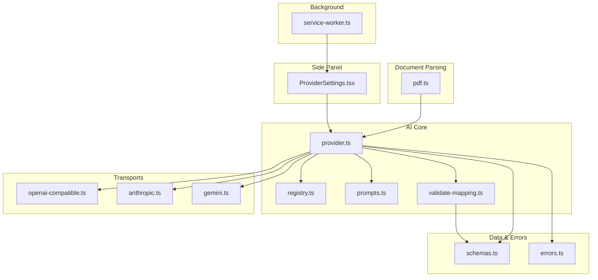
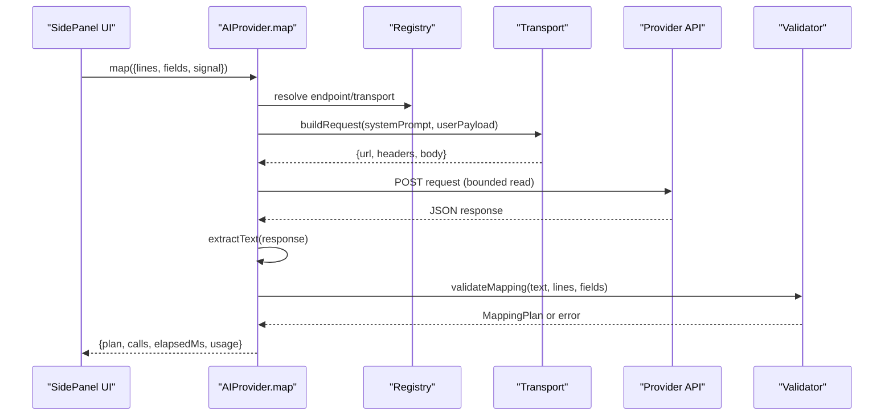
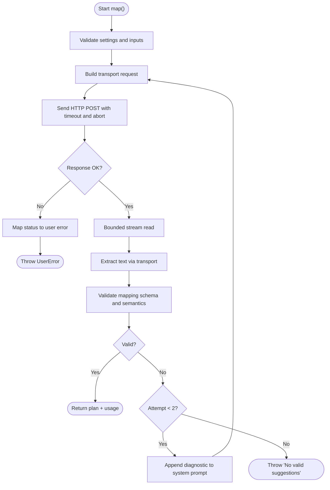
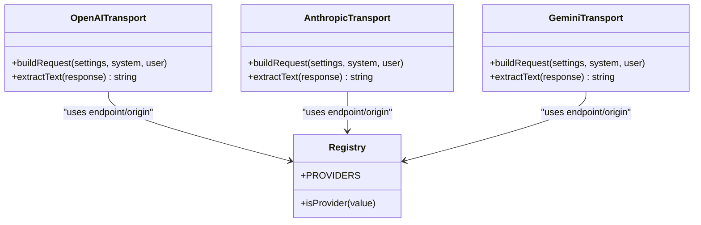
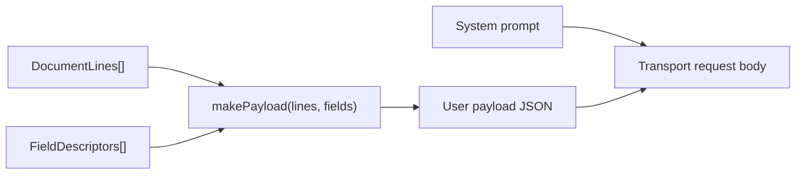
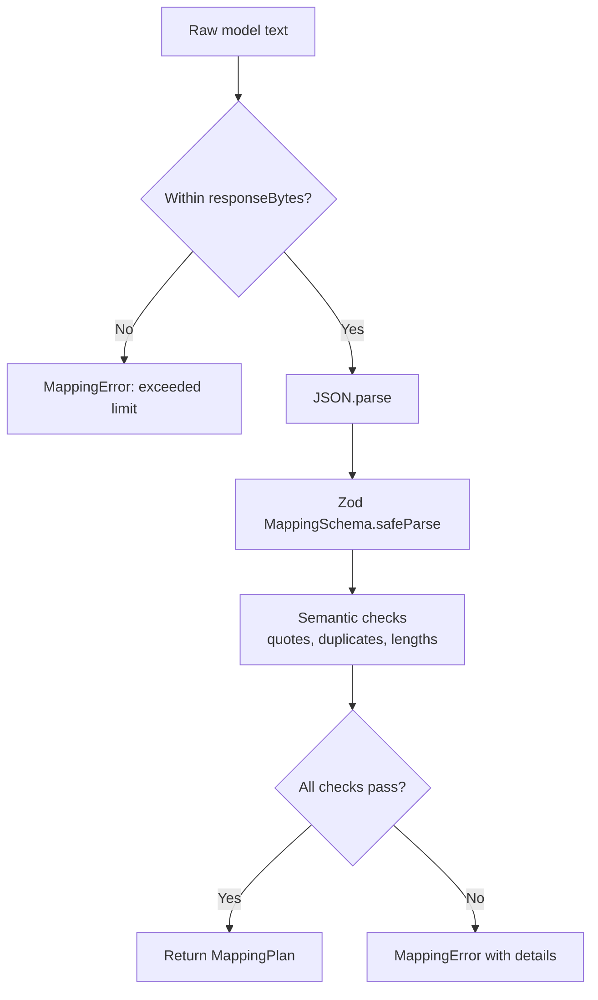
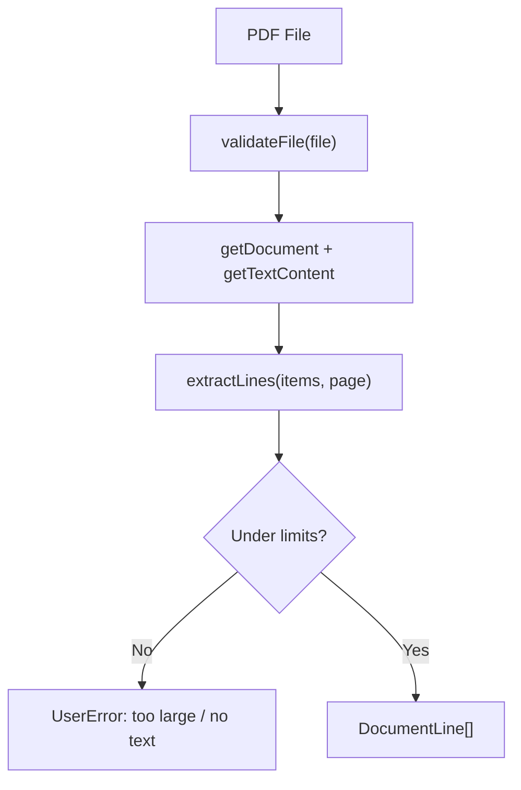
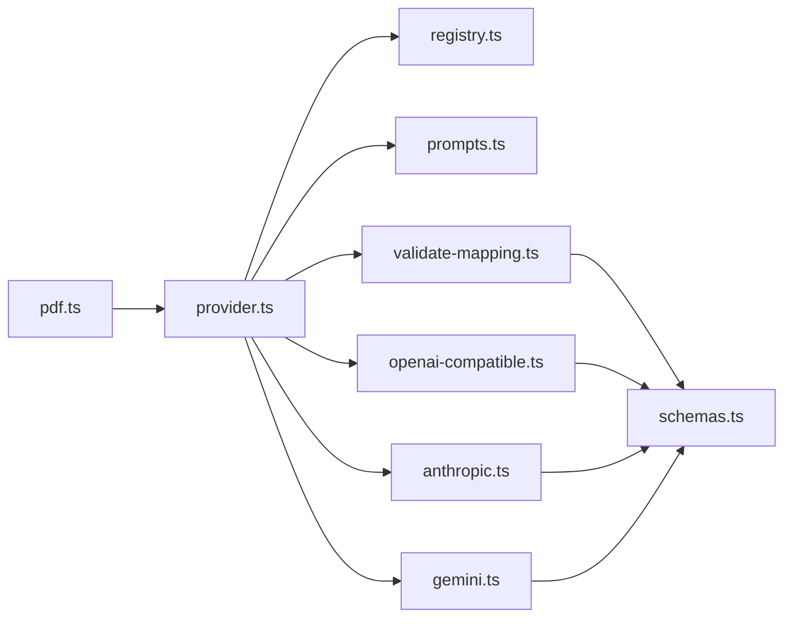

# AI Integration

<cite>
**Referenced Files in This Document**
- [provider.ts](file://src/ai/provider.ts)
- [registry.ts](file://src/ai/registry.ts)
- [prompts.ts](file://src/ai/prompts.ts)
- [validate-mapping.ts](file://src/ai/validate-mapping.ts)
- [openai-compatible.ts](file://src/ai/transports/openai-compatible.ts)
- [anthropic.ts](file://src/ai/transports/anthropic.ts)
- [gemini.ts](file://src/ai/transports/gemini.ts)
- [schemas.ts](file://src/shared/schemas.ts)
- [errors.ts](file://src/shared/errors.ts)
- [pdf.ts](file://src/parsers/pdf.ts)
- [ProviderSettings.tsx](file://src/sidepanel/components/ProviderSettings.tsx)
- [service-worker.ts](file://src/background/service-worker.ts)
</cite>

## Table of Contents
1. Introduction
2. Project Structure
3. Core Components
4. Architecture Overview
5. Detailed Component Analysis
6. Dependency Analysis
7. Performance Considerations
8. Troubleshooting Guide
9. Conclusion

## Introduction
This document explains the AI integration system that powers Help Me Fill’s form field mapping from documents. It covers the provider abstraction pattern that supports OpenAI, Anthropic Claude, Google Gemini, and OpenAI-compatible APIs; transport-layer implementations; request/response handling; error recovery strategies; prompt engineering for field mapping; configuration options; rate limiting; fallback mechanisms; and guidance for implementing a custom provider.

## Project Structure
The AI subsystem is organized around a clean separation of concerns:
- Provider orchestration and lifecycle management
- Transport adapters per provider family
- Prompt construction and payload shaping
- Strict validation of model outputs against a shared schema
- PDF parsing to extract text lines as evidence sources
- Side panel UI for provider configuration and session-scoped key storage
- Background service worker for permissions and runtime setup

**Diagram sources**
- [provider.ts:1-107](file://src/ai/provider.ts#L1-L107)
- [registry.ts:1-13](file://src/ai/registry.ts#L1-L13)
- [prompts.ts:1-26](file://src/ai/prompts.ts#L1-L26)
- [validate-mapping.ts:1-33](file://src/ai/validate-mapping.ts#L1-L33)
- [openai-compatible.ts:1-22](file://src/ai/transports/openai-compatible.ts#L1-L22)
- [anthropic.ts:1-17](file://src/ai/transports/anthropic.ts#L1-L17)
- [gemini.ts:1-21](file://src/ai/transports/gemini.ts#L1-L21)
- [schemas.ts:1-39](file://src/shared/schemas.ts#L1-L39)
- [errors.ts:1-10](file://src/shared/errors.ts#L1-L10)
- [pdf.ts:1-87](file://src/parsers/pdf.ts#L1-L87)
- [ProviderSettings.tsx:1-70](file://src/sidepanel/components/ProviderSettings.tsx#L1-L70)
- [service-worker.ts:1-29](file://src/background/service-worker.ts#L1-L29)

**Section sources**
- [provider.ts:1-107](file://src/ai/provider.ts#L1-L107)
- [registry.ts:1-13](file://src/ai/registry.ts#L1-L13)
- [prompts.ts:1-26](file://src/ai/prompts.ts#L1-L26)
- [validate-mapping.ts:1-33](file://src/ai/validate-mapping.ts#L1-L33)
- [openai-compatible.ts:1-22](file://src/ai/transports/openai-compatible.ts#L1-L22)
- [anthropic.ts:1-17](file://src/ai/transports/anthropic.ts#L1-L17)
- [gemini.ts:1-21](file://src/ai/transports/gemini.ts#L1-L21)
- [schemas.ts:1-39](file://src/shared/schemas.ts#L1-L39)
- [errors.ts:1-10](file://src/shared/errors.ts#L1-L10)
- [pdf.ts:1-87](file://src/parsers/pdf.ts#L1-L87)
- [ProviderSettings.tsx:1-70](file://src/sidepanel/components/ProviderSettings.tsx#L1-L70)
- [service-worker.ts:1-29](file://src/background/service-worker.ts#L1-L29)

## Core Components
- Provider abstraction: A single interface encapsulates mapping requests (document lines + fields) into a structured plan with assignments and unmapped fields, plus usage metadata and timing.
- Registry: Declares supported providers, their display names, network origins, endpoints, and transport families.
- Transports: Build provider-specific HTTP requests and parse responses into a common string payload.
- Prompts: Define the system instruction and build the user payload containing document lines and compacted field descriptors.
- Validation: Enforces strict JSON structure, limits, and semantic constraints on model output before returning a mapping plan.
- Error handling: Centralized user-facing errors, abort signal support, and safe cancellation.

Key responsibilities:
- Constructing transport requests based on selected provider
- Streaming-safe bounded response reading
- Retry-on-validation-failure strategy
- Usage extraction for telemetry or billing insights

**Section sources**
- [provider.ts:11-13](file://src/ai/provider.ts#L11-L13)
- [registry.ts:1-13](file://src/ai/registry.ts#L1-L13)
- [prompts.ts:4-25](file://src/ai/prompts.ts#L4-L25)
- [validate-mapping.ts:1-33](file://src/ai/validate-mapping.ts#L1-L33)
- [errors.ts:1-10](file://src/shared/errors.ts#L1-L10)

## Architecture Overview
The system follows a layered architecture:
- UI layer configures provider settings and triggers mapping
- Orchestration layer composes prompts, selects transports, and handles retries
- Transport layer adapts to provider-specific APIs
- Parser layer extracts text lines from PDFs as evidence
- Shared schemas enforce input/output contracts and limits

**Diagram sources**
- [provider.ts:52-105](file://src/ai/provider.ts#L52-L105)
- [registry.ts:1-13](file://src/ai/registry.ts#L1-L13)
- [openai-compatible.ts:4-21](file://src/ai/transports/openai-compatible.ts#L4-L21)
- [anthropic.ts:3-16](file://src/ai/transports/anthropic.ts#L3-L16)
- [gemini.ts:3-20](file://src/ai/transports/gemini.ts#L3-L20)
- [validate-mapping.ts:7-32](file://src/ai/validate-mapping.ts#L7-L32)

## Detailed Component Analysis

### Provider Abstraction and Orchestration
- Builds a transport request using the registry to select the correct transport family
- Reads responses in a bounded manner to prevent memory issues and enforces size limits
- Implements retry logic when the model returns invalid mapping output, appending a diagnostic message without re-sending untrusted content
- Honors AbortSignal for cancellations and sets a hard timeout to avoid hanging requests
- Extracts usage numbers from provider-specific response shapes

**Diagram sources**
- [provider.ts:52-105](file://src/ai/provider.ts#L52-L105)

**Section sources**
- [provider.ts:15-26](file://src/ai/provider.ts#L15-L26)
- [provider.ts:34-51](file://src/ai/provider.ts#L34-L51)
- [provider.ts:52-105](file://src/ai/provider.ts#L52-L105)

### Transport Implementations
- OpenAI-compatible: Uses chat completions endpoint with JSON mode; validates finish reason and refusal; supports DeepSeek variant token limit parameterization
- Anthropic: Uses messages endpoint with explicit version header and direct browser access flag; validates stop reason and text blocks
- Gemini: Uses generateContent with systemInstruction and JSON MIME type; filters out thought parts and validates finish reason

**Diagram sources**
- [openai-compatible.ts:1-22](file://src/ai/transports/openai-compatible.ts#L1-L22)
- [anthropic.ts:1-17](file://src/ai/transports/anthropic.ts#L1-L17)
- [gemini.ts:1-21](file://src/ai/transports/gemini.ts#L1-L21)
- [registry.ts:1-13](file://src/ai/registry.ts#L1-L13)

**Section sources**
- [openai-compatible.ts:4-21](file://src/ai/transports/openai-compatible.ts#L4-L21)
- [anthropic.ts:3-16](file://src/ai/transports/anthropic.ts#L3-L16)
- [gemini.ts:3-20](file://src/ai/transports/gemini.ts#L3-L20)

### Prompt Engineering and Payload Construction
- System prompt instructs the model to return only JSON matching the mapping schema, preserve exact values, cite evidence by line ID and quote, and abstain when ambiguous
- Payload includes compacted field descriptors (excluding sensitive or runtime-only properties) and document lines with IDs and page numbers
- The system prompt explicitly forbids inference beyond verbatim extraction and normalizes allowed transformations

**Diagram sources**
- [prompts.ts:4-25](file://src/ai/prompts.ts#L4-L25)

**Section sources**
- [prompts.ts:4-25](file://src/ai/prompts.ts#L4-L25)

### Validation and Error Recovery
- Response size is bounded before parsing to protect memory
- JSON parsing and Zod schema validation ensure structural correctness
- Semantic checks verify:
  - All fields are accounted for (assigned or unmapped)
  - No unknown or duplicate field IDs
  - Evidence quotes exist on cited lines
  - Proposed values are substrings of combined evidence
  - Field length constraints respected
- On validation failure, the system retries once with a diagnostic appended to the system prompt; subsequent failures surface a clear error

**Diagram sources**
- [validate-mapping.ts:7-32](file://src/ai/validate-mapping.ts#L7-L32)
- [schemas.ts:3-23](file://src/shared/schemas.ts#L3-L23)

**Section sources**
- [validate-mapping.ts:7-32](file://src/ai/validate-mapping.ts#L7-L32)
- [schemas.ts:3-23](file://src/shared/schemas.ts#L3-L23)

### PDF Context Extraction
- Validates file type, size, and header
- Parses pages up to a limit and extracts text lines while preserving spacing and line breaks
- Enforces character limits and ensures at least one extractable line exists
- Produces an array of lines with stable IDs used as evidence anchors in mappings

**Diagram sources**
- [pdf.ts:7-87](file://src/parsers/pdf.ts#L7-L87)

**Section sources**
- [pdf.ts:7-87](file://src/parsers/pdf.ts#L7-L87)

### Configuration, Rate Limiting, and Fallbacks
- Configuration:
  - Provider selection, model ID, and API key stored in session storage with host permission granted per origin
  - Settings validated before enabling
- Rate limiting:
  - HTTP 429 maps to a user-friendly message instructing users to wait or check quotas
  - Hard timeout prevents indefinite waits; no automatic retry after timeout
- Fallbacks:
  - One retry on validation failure with a diagnostic appended to the system prompt
  - No automatic provider switching; users must explicitly retry or change settings

**Section sources**
- [ProviderSettings.tsx:13-44](file://src/sidepanel/components/ProviderSettings.tsx#L13-L44)
- [provider.ts:63-104](file://src/ai/provider.ts#L63-L104)

### Custom Provider Implementation Guide
To add a new provider:
1. Register it in the provider registry with name, origin, endpoint, and transport family
2. If the provider differs significantly from existing transports, implement a new transport module with:
   - A function to build the TransportRequest (URL, headers, body)
   - A function to extract the text payload from the provider’s response shape
3. Wire the new transport into the provider orchestrator’s routing logic
4. Ensure the provider’s response can be parsed by the validator and conforms to the mapping schema
5. Add any necessary host permissions and update UI if needed

**Section sources**
- [registry.ts:1-13](file://src/ai/registry.ts#L1-L13)
- [openai-compatible.ts:4-21](file://src/ai/transports/openai-compatible.ts#L4-L21)
- [anthropic.ts:3-16](file://src/ai/transports/anthropic.ts#L3-L16)
- [gemini.ts:3-20](file://src/ai/transports/gemini.ts#L3-L20)
- [provider.ts:19-26](file://src/ai/provider.ts#L19-L26)

## Dependency Analysis
- provider.ts depends on registry.ts for provider metadata, prompts.ts for system/user payloads, validate-mapping.ts for output enforcement, and transport modules for request building and response parsing
- validate-mapping.ts depends on shared schemas for limits and types
- Transports depend on registry for endpoints and shared errors for consistent error reporting
- PDF parser feeds lines into the provider pipeline and shares limits with the rest of the system

**Diagram sources**
- [provider.ts:1-107](file://src/ai/provider.ts#L1-L107)
- [registry.ts:1-13](file://src/ai/registry.ts#L1-L13)
- [prompts.ts:1-26](file://src/ai/prompts.ts#L1-L26)
- [validate-mapping.ts:1-33](file://src/ai/validate-mapping.ts#L1-L33)
- [openai-compatible.ts:1-22](file://src/ai/transports/openai-compatible.ts#L1-L22)
- [anthropic.ts:1-17](file://src/ai/transports/anthropic.ts#L1-L17)
- [gemini.ts:1-21](file://src/ai/transports/gemini.ts#L1-L21)
- [schemas.ts:1-39](file://src/shared/schemas.ts#L1-L39)
- [pdf.ts:1-87](file://src/parsers/pdf.ts#L1-L87)

**Section sources**
- [provider.ts:1-107](file://src/ai/provider.ts#L1-L107)
- [registry.ts:1-13](file://src/ai/registry.ts#L1-L13)
- [validate-mapping.ts:1-33](file://src/ai/validate-mapping.ts#L1-L33)
- [schemas.ts:1-39](file://src/shared/schemas.ts#L1-L39)
- [pdf.ts:1-87](file://src/parsers/pdf.ts#L1-L87)

## Performance Considerations
- Bounded response reading prevents excessive memory use and enforces a 256 KiB response limit
- Character and field limits constrain prompt size to stay within model context windows
- Hard timeout avoids long-running requests; no automatic retry after timeout
- Minimal payload construction excludes unnecessary fields to reduce bandwidth and processing time
- PDF parsing streams page-by-page with cleanup to free resources promptly

[No sources needed since this section provides general guidance]

## Troubleshooting Guide
Common issues and resolutions:
- Invalid or missing API key:
  - Error indicates authentication failure; verify key format and account access
- Model incompatibility or refusal:
  - Some models may refuse or truncate; switch to a supported text model or shorten the document
- Rate limits or quotas:
  - HTTP 429 suggests waiting or reviewing quota; do not auto-retry immediately
- Network or CORS issues:
  - Ensure the extension has permission to the provider’s origin; re-enable if revoked
- PDF parsing problems:
  - Unsupported formats, password protection, scanned images without OCR, or oversized files will fail early with clear messages
- Excessive output size:
  - If the model returns too much text, reduce document size or adjust expectations

Operational tips:
- Use the side panel to revoke and re-grant API host permissions
- Confirm that the selected model supports JSON output for your provider
- Keep documents under the character and page limits to avoid truncation errors

**Section sources**
- [provider.ts:77-104](file://src/ai/provider.ts#L77-L104)
- [openai-compatible.ts:14-21](file://src/ai/transports/openai-compatible.ts#L14-L21)
- [anthropic.ts:10-16](file://src/ai/transports/anthropic.ts#L10-L16)
- [gemini.ts:13-20](file://src/ai/transports/gemini.ts#L13-L20)
- [pdf.ts:7-87](file://src/parsers/pdf.ts#L7-L87)
- [ProviderSettings.tsx:32-64](file://src/sidepanel/components/ProviderSettings.tsx#L32-L64)

## Conclusion
Help Me Fill’s AI integration uses a robust provider abstraction to unify multiple AI services behind a consistent interface. Strong validation, bounded I/O, and careful prompt engineering ensure reliable, auditable field mapping grounded in document evidence. The modular transport design enables easy addition of new providers, while configuration and error handling provide a smooth user experience even when providers impose limits or restrictions.