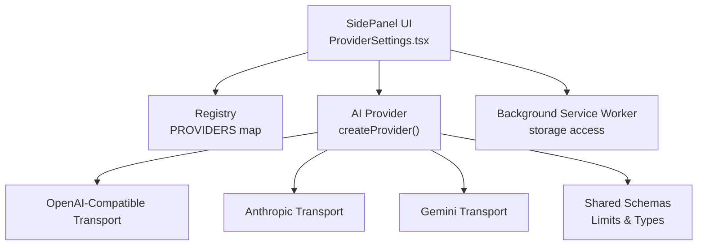
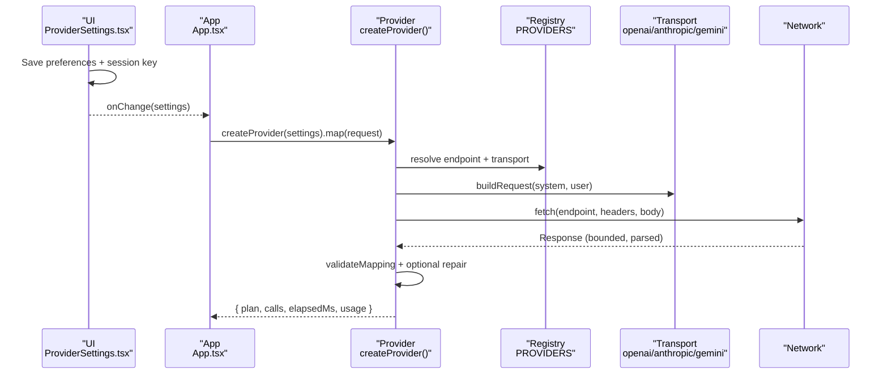
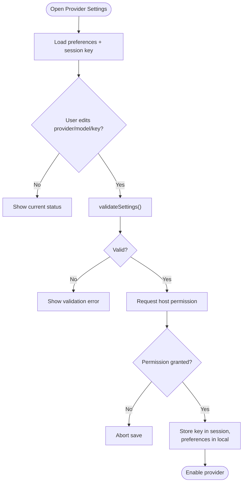
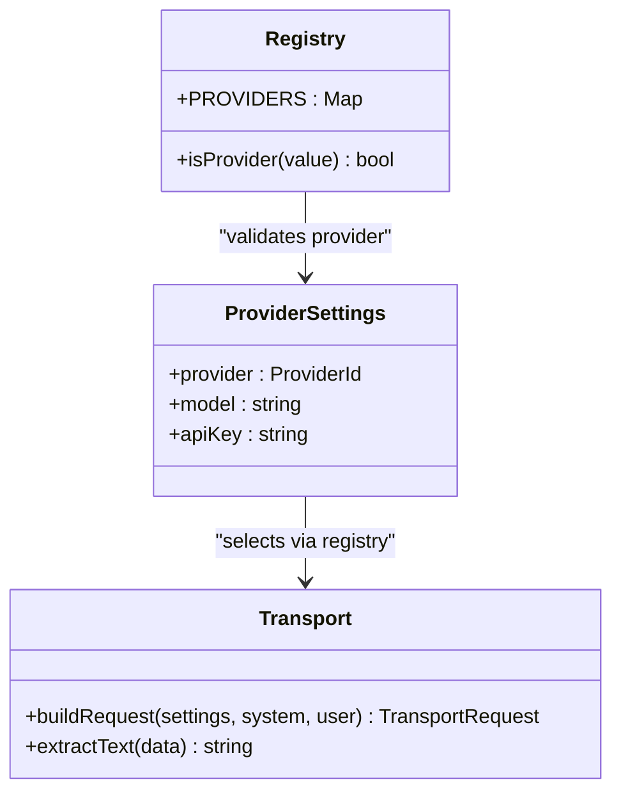
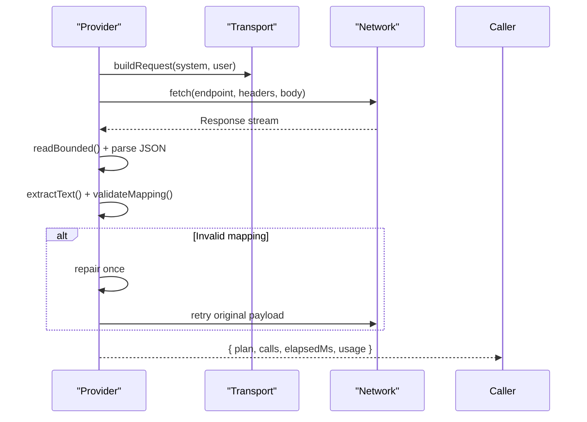
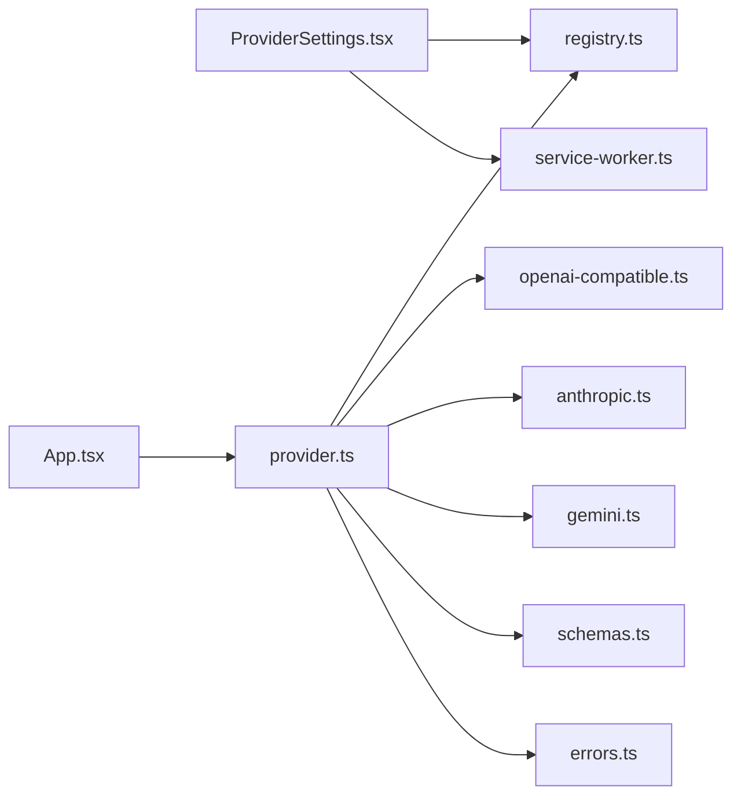

# Configuration & Settings

<cite>
**Referenced Files in This Document**
- [registry.ts](file://src/ai/registry.ts)
- [provider.ts](file://src/ai/provider.ts)
- [openai-compatible.ts](file://src/ai/transports/openai-compatible.ts)
- [anthropic.ts](file://src/ai/transports/anthropic.ts)
- [gemini.ts](file://src/ai/transports/gemini.ts)
- [schemas.ts](file://src/shared/schemas.ts)
- [errors.ts](file://src/shared/errors.ts)
- [ProviderSettings.tsx](file://src/sidepanel/components/ProviderSettings.tsx)
- [App.tsx](file://src/sidepanel/App.tsx)
- [service-worker.ts](file://src/background/service-worker.ts)
- [providers.test.ts](file://tests/unit/providers.test.ts)
</cite>

## Table of Contents
1. [Introduction](#introduction)
2. [Project Structure](#project-structure)
3. [Core Components](#core-components)
4. [Architecture Overview](#architecture-overview)
5. [Detailed Component Analysis](#detailed-component-analysis)
6. [Dependency Analysis](#dependency-analysis)
7. [Performance Considerations](#performance-considerations)
8. [Troubleshooting Guide](#troubleshooting-guide)
9. [Conclusion](#conclusion)
10. [Appendices](#appendices)

## Introduction
This document explains the AI provider configuration system used by the extension to manage settings for different AI services. It covers the ProviderSettings schema, validation rules, storage and retrieval of credentials, the registry that maps provider names to transport implementations, environment and permission requirements, security considerations for API keys, programmatic configuration, dynamic provider switching, migration between providers, rate limiting behavior, timeouts, and fallback mechanisms when primary providers are unavailable.

## Project Structure
The configuration system is implemented across a small set of focused modules:
- Registry defines supported providers, their endpoints, origins, and transport type.
- Provider orchestrates request building, execution, response parsing, validation, retries, and error handling.
- Transports implement provider-specific request formatting and response extraction.
- UI components persist preferences and session-scoped API keys using Chrome storage APIs and manage permissions.
- Background service worker sets storage access levels required for secure key handling.
- Shared schemas define limits and data contracts used during mapping.

**Diagram sources**
- [ProviderSettings.tsx:1-70](file://src/sidepanel/components/ProviderSettings.tsx#L1-L70)
- [registry.ts:1-13](file://src/ai/registry.ts#L1-L13)
- [provider.ts:1-107](file://src/ai/provider.ts#L1-L107)
- [openai-compatible.ts:1-22](file://src/ai/transports/openai-compatible.ts#L1-L22)
- [anthropic.ts:1-17](file://src/ai/transports/anthropic.ts#L1-L17)
- [gemini.ts:1-21](file://src/ai/transports/gemini.ts#L1-L21)
- [schemas.ts:1-39](file://src/shared/schemas.ts#L1-L39)
- [service-worker.ts:1-29](file://src/background/service-worker.ts#L1-L29)

**Section sources**
- [registry.ts:1-13](file://src/ai/registry.ts#L1-L13)
- [provider.ts:1-107](file://src/ai/provider.ts#L1-L107)
- [ProviderSettings.tsx:1-70](file://src/sidepanel/components/ProviderSettings.tsx#L1-L70)
- [service-worker.ts:1-29](file://src/background/service-worker.ts#L1-L29)
- [schemas.ts:1-39](file://src/shared/schemas.ts#L1-L39)

## Core Components
- ProviderSettings schema and validation:
  - ProviderSettings includes provider identifier, model string, and apiKey.
  - Validation enforces allowed characters and length for model, and requires a non-empty, space-free apiKey within a safe size limit.
- Registry:
  - Centralized map of provider IDs to display name, network origin, endpoint URL, and transport type.
  - Provides a type guard to validate provider values at runtime.
- Transport layer:
  - OpenAI-compatible, Anthropic, and Gemini transports each build a provider-specific request and extract text from responses with strict checks.
- Storage and permissions:
  - Preferences (provider and model) are stored in local storage; API keys are stored in session storage under a trusted context.
  - The extension requests host permissions for the selected provider’s origin before making requests.
- Execution and safety:
  - createProvider snapshots settings to avoid rerouting mid-request.
  - Requests are bounded in size, time-limited, and validated against expected response shapes.
  - A single repair attempt is made if JSON mapping fails; otherwise errors are surfaced immediately.

**Section sources**
- [registry.ts:1-13](file://src/ai/registry.ts#L1-L13)
- [provider.ts:15-26](file://src/ai/provider.ts#L15-L26)
- [openai-compatible.ts:1-22](file://src/ai/transports/openai-compatible.ts#L1-L22)
- [anthropic.ts:1-17](file://src/ai/transports/anthropic.ts#L1-L17)
- [gemini.ts:1-21](file://src/ai/transports/gemini.ts#L1-L21)
- [ProviderSettings.tsx:16-43](file://src/sidepanel/components/ProviderSettings.tsx#L16-L43)
- [schemas.ts:1-39](file://src/shared/schemas.ts#L1-L39)

## Architecture Overview
The system uses a registry-driven architecture where the UI selects a provider, stores credentials securely for the session, and delegates request construction to a transport based on the registry. The provider orchestrates execution, response validation, and limited retry logic.

**Diagram sources**
- [ProviderSettings.tsx:32-43](file://src/sidepanel/components/ProviderSettings.tsx#L32-L43)
- [App.tsx:73-82](file://src/sidepanel/App.tsx#L73-L82)
- [provider.ts:52-105](file://src/ai/provider.ts#L52-L105)
- [registry.ts:1-13](file://src/ai/registry.ts#L1-L13)
- [openai-compatible.ts:4-13](file://src/ai/transports/openai-compatible.ts#L4-L13)
- [anthropic.ts:3-9](file://src/ai/transports/anthropic.ts#L3-L9)
- [gemini.ts:3-11](file://src/ai/transports/gemini.ts#L3-L11)

## Detailed Component Analysis

### ProviderSettings Schema and Validation
- ProviderSettings fields:
  - provider: one of the registry keys.
  - model: text model ID from the provider account.
  - apiKey: secret token for authentication.
- Validation rules:
  - Model must match an allowed pattern and length.
  - API key must be present, contain no spaces, and be within a maximum length.
- UI behavior:
  - Loads saved preferences and session-scoped keys.
  - Requests host permissions for the chosen provider’s origin.
  - Stores API key in session storage under a trusted context and preferences in local storage.
  - Displays status messages and allows revoking permissions or removing keys.

**Diagram sources**
- [ProviderSettings.tsx:13-45](file://src/sidepanel/components/ProviderSettings.tsx#L13-L45)
- [provider.ts:15-18](file://src/ai/provider.ts#L15-L18)

**Section sources**
- [registry.ts:1-13](file://src/ai/registry.ts#L1-L13)
- [provider.ts:15-18](file://src/ai/provider.ts#L15-L18)
- [ProviderSettings.tsx:13-45](file://src/sidepanel/components/ProviderSettings.tsx#L13-L45)

### Registry System and Transport Mapping
- Registry entries include:
  - Display name for users.
  - Network origin for permission scoping.
  - Fixed endpoint URL per provider.
  - Transport type used to build requests and parse responses.
- Type guard ensures only known providers are accepted.
- Transport selection:
  - Provider chooses transport based on registry entry.
  - Each transport formats headers and bodies according to provider conventions.

**Diagram sources**
- [registry.ts:1-13](file://src/ai/registry.ts#L1-L13)
- [provider.ts:19-26](file://src/ai/provider.ts#L19-L26)
- [openai-compatible.ts:4-21](file://src/ai/transports/openai-compatible.ts#L4-L21)
- [anthropic.ts:3-16](file://src/ai/transports/anthropic.ts#L3-L16)
- [gemini.ts:3-20](file://src/ai/transports/gemini.ts#L3-L20)

**Section sources**
- [registry.ts:1-13](file://src/ai/registry.ts#L1-L13)
- [provider.ts:19-26](file://src/ai/provider.ts#L19-L26)
- [openai-compatible.ts:4-21](file://src/ai/transports/openai-compatible.ts#L4-L21)
- [anthropic.ts:3-16](file://src/ai/transports/anthropic.ts#L3-L16)
- [gemini.ts:3-20](file://src/ai/transports/gemini.ts#L3-L20)

### Request Building, Execution, and Response Handling
- Request building:
  - Uses registry endpoint and transport-specific headers/body.
  - Ensures credentials are placed in headers, not body.
- Execution:
  - Bounded response reading prevents oversized payloads.
  - Timeouts abort requests after a fixed duration without automatic retry.
  - Aborts respect external cancellation signals.
- Response handling:
  - Extracts text via transport-specific parsers.
  - Validates mapping against shared schemas; triggers one repair attempt if invalid.
  - Maps HTTP statuses to user-friendly errors and avoids leaking response bodies.

**Diagram sources**
- [provider.ts:52-105](file://src/ai/provider.ts#L52-L105)
- [openai-compatible.ts:4-21](file://src/ai/transports/openai-compatible.ts#L4-L21)
- [anthropic.ts:3-16](file://src/ai/transports/anthropic.ts#L3-L16)
- [gemini.ts:3-20](file://src/ai/transports/gemini.ts#L3-L20)
- [schemas.ts:15-23](file://src/shared/schemas.ts#L15-L23)

**Section sources**
- [provider.ts:34-105](file://src/ai/provider.ts#L34-L105)
- [schemas.ts:1-39](file://src/shared/schemas.ts#L1-L39)
- [errors.ts:1-10](file://src/shared/errors.ts#L1-L10)

### Storage, Permissions, and Security
- Storage:
  - Preferences (provider, model) stored in local storage.
  - API keys stored in session storage under a trusted context to minimize exposure.
- Permissions:
  - Host permissions requested for the provider’s origin before any network call.
  - Permissions can be revoked from the UI.
- Security considerations:
  - Keys are session-only and not encrypted; treat them as sensitive.
  - Credentials are sent only in headers; never embedded in request bodies.
  - Responses are bounded and parsed safely; invalid or refused responses are rejected.

**Section sources**
- [ProviderSettings.tsx:16-43](file://src/sidepanel/components/ProviderSettings.tsx#L16-L43)
- [service-worker.ts:1-5](file://src/background/service-worker.ts#L1-L5)
- [openai-compatible.ts:4-13](file://src/ai/transports/openai-compatible.ts#L4-L13)
- [anthropic.ts:3-9](file://src/ai/transports/anthropic.ts#L3-L9)
- [gemini.ts:3-11](file://src/ai/transports/gemini.ts#L3-L11)

### Programmatic Configuration and Dynamic Provider Switching
- Programmatic configuration:
  - Create a provider instance with settings and a custom fetcher for testing or advanced control.
  - Call map with lines, fields, and an AbortSignal to generate a mapping plan.
- Dynamic switching:
  - Update settings in the UI; the app reuses the latest snapshot for subsequent runs.
  - Ensure host permissions exist for the new provider before generating.

**Section sources**
- [provider.ts:52-105](file://src/ai/provider.ts#L52-L105)
- [App.tsx:73-82](file://src/sidepanel/App.tsx#L73-L82)
- [providers.test.ts:14-29](file://tests/unit/providers.test.ts#L14-L29)

### Migration Between Providers
- Steps:
  - Select a different provider in the UI.
  - Enter the new model and API key.
  - Grant host permission for the new provider’s origin.
  - Save; previous session key is removed or replaced.
- Notes:
  - Endpoints and headers differ per provider; registry abstracts these differences.
  - No automatic compatibility check is performed; ensure your model supports JSON output.

**Section sources**
- [ProviderSettings.tsx:32-43](file://src/sidepanel/components/ProviderSettings.tsx#L32-L43)
- [registry.ts:1-13](file://src/ai/registry.ts#L1-L13)

### Rate Limiting, Timeouts, and Fallbacks
- Rate limiting:
  - HTTP 429 responses surface a clear message instructing users to wait or review quotas.
  - No automatic retry is performed for rate limits.
- Timeouts:
  - Requests are aborted after a fixed timeout without automatic retry.
- Fallbacks:
  - If mapping validation fails once, the system repairs and retries with the original input (not untrusted output).
  - For persistent failures or unsupported models, users should switch providers or adjust inputs.

**Section sources**
- [provider.ts:63-105](file://src/ai/provider.ts#L63-L105)
- [providers.test.ts:30-68](file://tests/unit/providers.test.ts#L30-L68)

## Dependency Analysis
The following diagram shows how components depend on each other during configuration and execution.

**Diagram sources**
- [ProviderSettings.tsx:1-70](file://src/sidepanel/components/ProviderSettings.tsx#L1-L70)
- [App.tsx:1-127](file://src/sidepanel/App.tsx#L1-L127)
- [provider.ts:1-107](file://src/ai/provider.ts#L1-L107)
- [registry.ts:1-13](file://src/ai/registry.ts#L1-L13)
- [openai-compatible.ts:1-22](file://src/ai/transports/openai-compatible.ts#L1-L22)
- [anthropic.ts:1-17](file://src/ai/transports/anthropic.ts#L1-L17)
- [gemini.ts:1-21](file://src/ai/transports/gemini.ts#L1-L21)
- [schemas.ts:1-39](file://src/shared/schemas.ts#L1-L39)
- [errors.ts:1-10](file://src/shared/errors.ts#L1-L10)
- [service-worker.ts:1-29](file://src/background/service-worker.ts#L1-L29)

**Section sources**
- [App.tsx:1-127](file://src/sidepanel/App.tsx#L1-L127)
- [provider.ts:1-107](file://src/ai/provider.ts#L1-L107)
- [registry.ts:1-13](file://src/ai/registry.ts#L1-L13)

## Performance Considerations
- Input limits:
  - Character count and field count are constrained to prevent excessive payloads.
- Response bounds:
  - Responses are capped to a fixed size to avoid memory pressure.
- Timeout policy:
  - Fixed timeout prevents long-running requests; no automatic retry reduces load.
- Caching and credentials:
  - Requests use cache-control and credential policies to avoid unintended caching or leakage.

[No sources needed since this section provides general guidance]

## Troubleshooting Guide
Common issues and resolutions:
- Invalid model or API key:
  - Ensure model matches provider expectations and API key contains no spaces.
- Missing host permission:
  - Re-enable the provider to grant origin permission again.
- Rate limit or quota reached:
  - Wait before retrying or review provider account quotas.
- Network or availability errors:
  - Check browser network access and provider status; retry explicitly later.
- Refused or truncated responses:
  - Use a supported model capable of JSON output; shorten documents if necessary.
- Oversized responses:
  - Reduce document size or choose a more concise model.

**Section sources**
- [provider.ts:77-100](file://src/ai/provider.ts#L77-L100)
- [errors.ts:1-10](file://src/shared/errors.ts#L1-L10)
- [providers.test.ts:30-68](file://tests/unit/providers.test.ts#L30-L68)

## Conclusion
The configuration system centralizes provider definitions, validates settings, manages secure session-scoped credentials, and delegates to specialized transports for each AI service. It enforces safety through bounded I/O, timeouts, and strict response validation, while offering a simple path to switch providers and migrate configurations. Users retain control over permissions and can revoke access at any time.

[No sources needed since this section summarizes without analyzing specific files]

## Appendices

### Environment Variables
- No application-level environment variables are used for provider configuration.
- Provider identity, model, and API key are managed via UI and Chrome storage APIs.

[No sources needed since this section provides general guidance]

### API Key Management Best Practices
- Keep API keys in session storage only; do not persist them beyond the session.
- Always request minimal host permissions for the provider’s origin.
- Avoid logging or displaying keys; rely on UI masking and status messages.
- Treat provider accounts as the source of truth for model availability and billing.

**Section sources**
- [ProviderSettings.tsx:16-43](file://src/sidepanel/components/ProviderSettings.tsx#L16-L43)
- [service-worker.ts:1-5](file://src/background/service-worker.ts#L1-L5)