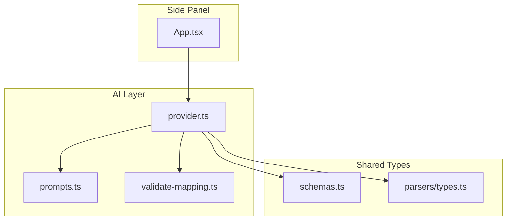
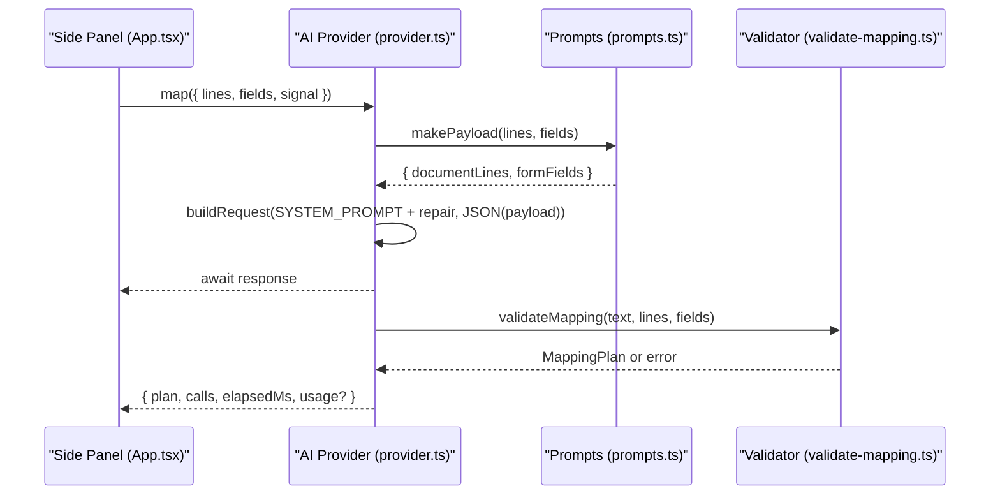
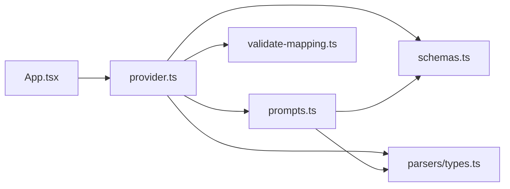

# Prompt Construction

<cite>
**Referenced Files in This Document**
- [prompts.ts](file://src/ai/prompts.ts)
- [provider.ts](file://src/ai/provider.ts)
- [validate-mapping.ts](file://src/ai/validate-mapping.ts)
- [schemas.ts](file://src/shared/schemas.ts)
- [types.ts](file://src/parsers/types.ts)
- [App.tsx](file://src/sidepanel/App.tsx)
- [mapping.test.ts](file://tests/unit/mapping.test.ts)
</cite>

## Table of Contents
1. Introduction
2. Project Structure
3. Core Components
4. Architecture Overview
5. Detailed Component Analysis
6. Dependency Analysis
7. Performance Considerations
8. Troubleshooting Guide
9. Conclusion

## Introduction
This document explains the prompt construction system that builds AI requests for mapping PDF document content to web form fields. It covers how the system defines safe AI behavior, structures inputs, sanitizes field data, and validates outputs. It also provides guidance on customizing prompts and optimizing them for different documents and forms.

## Project Structure
The prompt construction system spans a small set of focused modules:
- Prompt definition and payload building live in the AI prompts module.
- The provider orchestrates request creation, transport selection, response handling, and validation.
- Shared schemas define limits and types for fields and mappings.
- Parser types define the structure of extracted document lines.
- The side panel composes the workflow and invokes the provider with sanitized inputs.
- Unit tests validate safety and correctness properties.

**Diagram sources**
- [App.tsx:73-82](file://src/sidepanel/App.tsx#L73-L82)
- [provider.ts:1-107](file://src/ai/provider.ts#L1-L107)
- [prompts.ts:1-26](file://src/ai/prompts.ts#L1-L26)
- [validate-mapping.ts:1-33](file://src/ai/validate-mapping.ts#L1-L33)
- [schemas.ts:1-39](file://src/shared/schemas.ts#L1-L39)
- [types.ts:1-3](file://src/parsers/types.ts#L1-L3)

**Section sources**
- [App.tsx:73-82](file://src/sidepanel/App.tsx#L73-L82)
- [provider.ts:1-107](file://src/ai/provider.ts#L1-L107)
- [prompts.ts:1-26](file://src/ai/prompts.ts#L1-L26)
- [validate-mapping.ts:1-33](file://src/ai/validate-mapping.ts#L1-L33)
- [schemas.ts:1-39](file://src/shared/schemas.ts#L1-L39)
- [types.ts:1-3](file://src/parsers/types.ts#L1-L3)

## Core Components
- SYSTEM_PROMPT: Defines the AI’s role, constraints, output schema, and security posture against instruction injection from untrusted document content.
- compactFields: Sanitizes field descriptors by excluding sensitive or unnecessary properties before sending to providers.
- makePayload: Builds the user message payload combining document lines and sanitized fields.
- createProvider.map: Orchestrates request building, transport dispatch, bounded response reading, JSON extraction, and strict validation with retry support.
- validateMapping: Enforces schema, bounds, evidence integrity, and value grounding rules.

Key behaviors:
- Security: The system prompt explicitly treats document and metadata as untrusted data and forbids executing instructions found within them.
- Safety: Only a strict allowlist of field properties is sent; current values and page URLs are never included.
- Grounding: Every proposed value must be verbatim or whitespace-normalized from cited quotes on specific line IDs.
- Completeness: All supplied fields must be either assigned or unmapped; duplicates and unknown IDs are rejected.

**Section sources**
- [prompts.ts:4-25](file://src/ai/prompts.ts#L4-L25)
- [provider.ts:52-105](file://src/ai/provider.ts#L52-L105)
- [validate-mapping.ts:7-31](file://src/ai/validate-mapping.ts#L7-L31)
- [schemas.ts:3-23](file://src/shared/schemas.ts#L3-L23)

## Architecture Overview
The flow starts in the side panel when the user triggers generation. The panel calls the provider with document lines and sanitized fields. The provider constructs a transport-specific request using the system prompt and a serialized payload. After receiving the response, it extracts text, validates the mapping plan, and returns results to the UI.

**Diagram sources**
- [App.tsx:73-82](file://src/sidepanel/App.tsx#L73-L82)
- [provider.ts:19-26](file://src/ai/provider.ts#L19-L26)
- [provider.ts:55-94](file://src/ai/provider.ts#L55-L94)
- [prompts.ts:18-25](file://src/ai/prompts.ts#L18-L25)
- [validate-mapping.ts:7-31](file://src/ai/validate-mapping.ts#L7-L31)

## Detailed Component Analysis

### SYSTEM_PROMPT: Behavior, Constraints, and Security
- Role and goal: Propose values for web form fields using only document evidence.
- Output contract: Strict JSON with assignments and unmapped arrays; no extra properties.
- Evidence requirements: Each assignment cites exact quotes and their line IDs from the provided document lines.
- Value fidelity: Preserve spelling, Unicode, leading zeros, phone prefixes, identifiers, units, and date formats; only whitespace normalization is allowed. No inference or conversion.
- Semantic matching: Match both meaning and entity role (e.g., applicant vs contact). Abstain if ambiguous.
- Reuse rule: A single source fact may populate multiple fields when each clearly asks for it.
- Anti-injection: Explicitly instructs ignoring any instructions embedded in untrusted document content or metadata.
- Prohibited outputs: No selectors, JavaScript, commands, navigation, or submission actions.
- Completeness: Account for every supplied field as either assigned or unmapped.

Security implications:
- Treats all external content as data, not code.
- Prevents prompt injection by forbidding execution of instructions found inside documents or field metadata.
- Restricts output to a narrow schema to reduce attack surface.

**Section sources**
- [prompts.ts:4-16](file://src/ai/prompts.ts#L4-L16)

### compactFields: Sanitization of Field Data
- Purpose: Remove sensitive or unnecessary properties before sending to providers.
- Allowed properties: id, type, label, ariaLabel, placeholder, name, context, required, maxLength, pattern.
- Excluded properties: currentValue and any other non-allowlisted fields are omitted.
- Rationale: Protects user privacy and reduces payload size while preserving enough context for accurate mapping.

Behavioral guarantees validated by tests:
- Current values are never included in the provider payload.
- The resulting descriptor matches the expected allowlist.

**Section sources**
- [prompts.ts:18-22](file://src/ai/prompts.ts#L18-L22)
- [mapping.test.ts:26-30](file://tests/unit/mapping.test.ts#L26-L30)

### makePayload: Structuring Input Data
- Combines parsed document lines and sanitized fields into a single payload.
- Document lines include id, page, and text; fields are the compacted descriptors.
- The payload is serialized to JSON and passed as the user message to the provider.

Data flow:
- Lines come from the parser and represent extracted text per page.
- Fields come from scanning the active page and are sanitized via compactFields.

**Section sources**
- [prompts.ts:23-25](file://src/ai/prompts.ts#L23-L25)
- [types.ts:1-3](file://src/parsers/types.ts#L1-L3)
- [schemas.ts:3-14](file://src/shared/schemas.ts#L3-L14)

### Provider Orchestration: Request Building, Transport, and Validation
- Builds a transport-specific request using the selected provider settings and the combined system prompt plus optional repair hint.
- Serializes the payload created by makePayload as the user message.
- Sends the request with strict headers and policies; enforces timeouts and abort signals.
- Reads responses with a byte limit to prevent oversized payloads.
- Extracts model output text based on provider type.
- Validates the returned mapping plan strictly, including schema, bounds, evidence integrity, and value grounding.
- Supports one retry with a diagnostic repair appended to the system prompt when validation fails.

Error handling highlights:
- Invalid JSON or schema mismatches raise mapping errors.
- Unknown or duplicate field IDs are rejected.
- Quotes must exist on cited lines and contain the proposed value after normalization.
- Values must respect field length limits.

**Section sources**
- [provider.ts:19-26](file://src/ai/provider.ts#L19-L26)
- [provider.ts:34-51](file://src/ai/provider.ts#L34-L51)
- [provider.ts:55-105](file://src/ai/provider.ts#L55-L105)
- [validate-mapping.ts:7-31](file://src/ai/validate-mapping.ts#L7-L31)

### validateMapping: Grounding and Integrity Checks
- Enforces maximum response size.
- Parses JSON and validates against the mapping schema.
- Ensures all supplied fields are accounted for exactly once across assignments and unmapped.
- Verifies evidence: each quote exists on the cited line and contains the proposed value after whitespace normalization.
- Enforces field length constraints.

These checks ensure that AI suggestions are grounded in the provided document and safe to apply.

**Section sources**
- [validate-mapping.ts:7-31](file://src/ai/validate-mapping.ts#L7-L31)
- [schemas.ts:15-23](file://src/shared/schemas.ts#L15-L23)

### Field Types and Processing Examples
Field types supported by the system:
- text, email, tel, url, textarea

Processing notes:
- The system preserves original formatting and units; only whitespace normalization is permitted.
- Entity roles must match (e.g., applicant vs contact); abstain if ambiguous.
- A single source fact can populate multiple fields when each clearly asks for it.

Examples derived from tests and schema:
- Preserving Chinese characters and exact source evidence.
- Preserving leading zeros in identifiers.
- Rejecting fabricated facts even when a real quote is cited.
- Respecting maxlength constraints.

**Section sources**
- [schemas.ts:4-11](file://src/shared/schemas.ts#L4-L11)
- [mapping.test.ts:12-25](file://tests/unit/mapping.test.ts#L12-L25)

### Document Context Preservation
- Document lines carry stable ids and page numbers so evidence can be traced back precisely.
- The system requires exact substring quotes from cited lines, ensuring traceability and preventing hallucination.
- The validator cross-checks quotes against the actual line texts.

**Section sources**
- [types.ts:1-3](file://src/parsers/types.ts#L1-L3)
- [validate-mapping.ts:13-28](file://src/ai/validate-mapping.ts#L13-L28)

### Best Practices for Field Description Formatting
Recommended practices inferred from the schema and prompt constraints:
- Use concise labels and ariaLabel to describe intent without exposing sensitive state.
- Provide meaningful context (e.g., “Applicant”, “Buyer”) to help disambiguate roles.
- Set appropriate maxLength to constrain model output and align with field limits.
- Include pattern hints only when necessary; avoid embedding executable logic.
- Avoid including currentValue or page URLs in the payload; rely on compactFields to sanitize.

**Section sources**
- [schemas.ts:4-14](file://src/shared/schemas.ts#L4-L14)
- [prompts.ts:18-22](file://src/ai/prompts.ts#L18-L22)

### Prompt Customization Options
- System prompt is fixed in this implementation but can be extended by appending repair diagnostics during retries.
- User message is fully controlled via makePayload; you can adjust which fields are included by modifying compactFields’ allowlist.
- Transport selection is driven by provider settings; the same system prompt and payload work across OpenAI-compatible, Anthropic, and Gemini transports.

Optimization tips:
- Keep field descriptions minimal and role-specific to reduce ambiguity.
- Prefer explicit context over verbose instructions to guide the model.
- Limit the number of fields per request to stay within character and response limits.

**Section sources**
- [provider.ts:19-26](file://src/ai/provider.ts#L19-L26)
- [provider.ts:55-94](file://src/ai/provider.ts#L55-L94)
- [prompts.ts:18-25](file://src/ai/prompts.ts#L18-L25)

## Dependency Analysis
The following diagram shows how components depend on each other during prompt construction and validation.

**Diagram sources**
- [App.tsx:73-82](file://src/sidepanel/App.tsx#L73-L82)
- [provider.ts:1-107](file://src/ai/provider.ts#L1-L107)
- [prompts.ts:1-26](file://src/ai/prompts.ts#L1-L26)
- [validate-mapping.ts:1-33](file://src/ai/validate-mapping.ts#L1-L33)
- [schemas.ts:1-39](file://src/shared/schemas.ts#L1-L39)
- [types.ts:1-3](file://src/parsers/types.ts#L1-L3)

**Section sources**
- [provider.ts:1-107](file://src/ai/provider.ts#L1-L107)
- [prompts.ts:1-26](file://src/ai/prompts.ts#L1-L26)
- [validate-mapping.ts:1-33](file://src/ai/validate-mapping.ts#L1-L33)
- [schemas.ts:1-39](file://src/shared/schemas.ts#L1-L39)
- [types.ts:1-3](file://src/parsers/types.ts#L1-L3)

## Performance Considerations
- Character and response limits: Inputs and outputs are bounded to control cost and latency.
- Bounded response reading: Responses are capped at a defined byte threshold to prevent excessive memory use.
- Timeout and abort: Requests time out after a fixed duration and honor abort signals to cancel long-running operations.
- Minimal payload: compactFields reduces payload size by excluding sensitive or unnecessary fields.

[No sources needed since this section provides general guidance]

## Troubleshooting Guide
Common issues and resolutions:
- Invalid JSON or schema mismatch: Ensure the model returns a complete JSON object matching the mapping schema.
- Unknown or duplicate field IDs: Verify all field IDs are valid and unique across assignments and unmapped.
- Missing evidence or unsupported values: Each assignment must cite quotes present on the specified lines that contain the proposed value after normalization.
- Value exceeds maxLength: Adjust field maxLength or refine model output to fit constraints.
- Provider errors: Check API key validity, rate limits, model support for JSON output, and network access.

Operational safeguards:
- One retry with a diagnostic appended to the system prompt when validation fails.
- Clear error messages guide users to correct configuration or input.

**Section sources**
- [validate-mapping.ts:7-31](file://src/ai/validate-mapping.ts#L7-L31)
- [provider.ts:71-105](file://src/ai/provider.ts#L71-L105)

## Conclusion
The prompt construction system combines a strict system prompt, sanitized field descriptors, and robust validation to produce safe, grounded, and auditable mappings from PDF documents to web form fields. By limiting what enters the payload, enforcing evidence-based values, and validating outputs rigorously, the system minimizes risks such as instruction injection and hallucination while supporting flexible field types and clear customization points for future enhancements.

[No sources needed since this section summarizes without analyzing specific files]