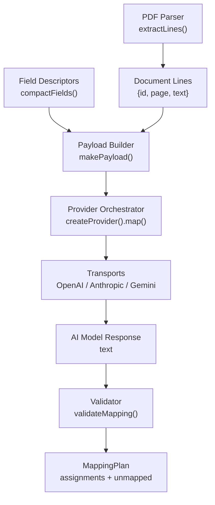
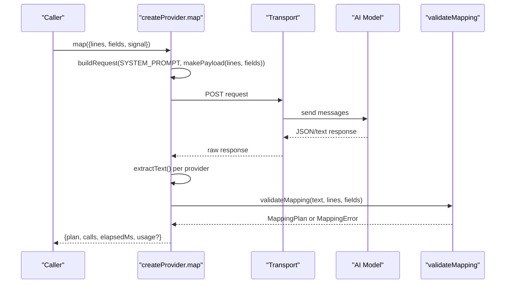
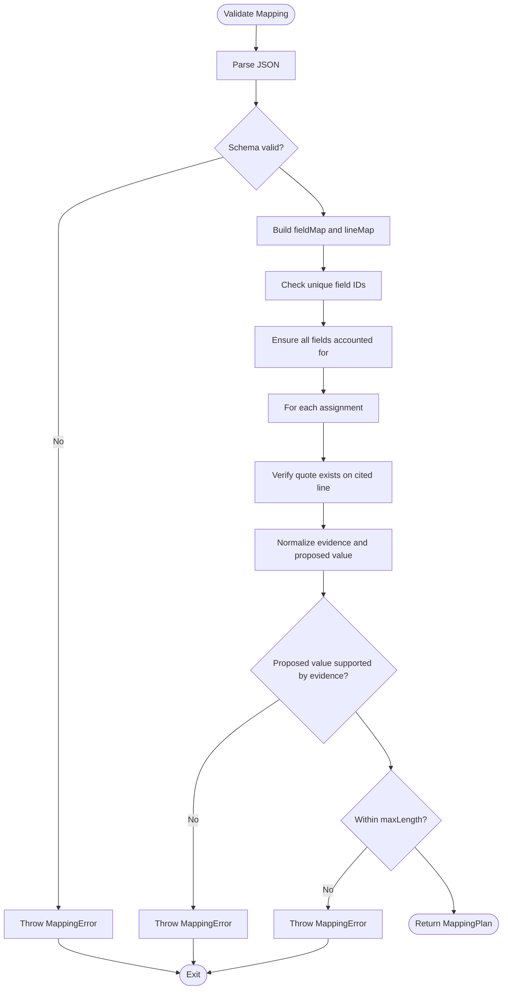
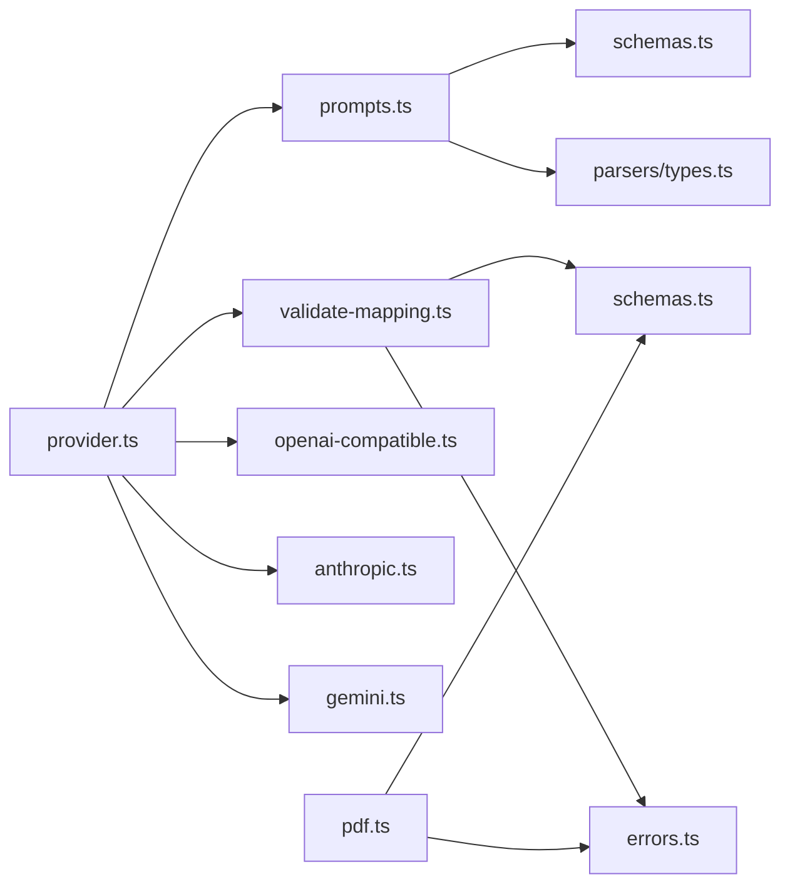

# Prompt Engineering & Mapping

<cite>
**Referenced Files in This Document**
- [prompts.ts](file://src/ai/prompts.ts)
- [validate-mapping.ts](file://src/ai/validate-mapping.ts)
- [schemas.ts](file://src/shared/schemas.ts)
- [pdf.ts](file://src/parsers/pdf.ts)
- [types.ts](file://src/parsers/types.ts)
- [provider.ts](file://src/ai/provider.ts)
- [openai-compatible.ts](file://src/ai/transports/openai-compatible.ts)
- [anthropic.ts](file://src/ai/transports/anthropic.ts)
- [gemini.ts](file://src/ai/transports/gemini.ts)
- [registry.ts](file://src/ai/registry.ts)
- [errors.ts](file://src/shared/errors.ts)
- [mapping.test.ts](file://tests/unit/mapping.test.ts)
</cite>

## Table of Contents
1. [Introduction](#introduction)
2. [Project Structure](#project-structure)
3. [Core Components](#core-components)
4. [Architecture Overview](#architecture-overview)
5. [Detailed Component Analysis](#detailed-component-analysis)
6. [Dependency Analysis](#dependency-analysis)
7. [Performance Considerations](#performance-considerations)
8. [Troubleshooting Guide](#troubleshooting-guide)
9. [Conclusion](#conclusion)
10. [Appendices](#appendices)

## Introduction
This document explains the prompt engineering system that generates AI requests for form field mapping. It focuses on how PDF content and form field descriptions are combined into prompts, how payloads are structured, how context is preserved across document types, and how responses are validated against strict schemas with retry logic for malformed outputs. It also documents the MappingPlan structure and how suggestions are grounded to source document content.

## Project Structure
The mapping pipeline spans parsing, prompting, provider transport, validation, and shared schema definitions:
- Parsing extracts text lines from PDFs into a stable line ID scheme used for evidence citations.
- Prompting builds a compact payload of document lines and field descriptors.
- Provider orchestration sends requests to multiple AI providers using normalized transports.
- Validation enforces schema conformance and grounding to source lines.
- Shared schemas define limits, field descriptors, and the MappingPlan contract.

**Diagram sources**
- [pdf.ts:15-38](file://src/parsers/pdf.ts#L15-L38)
- [prompts.ts:18-25](file://src/ai/prompts.ts#L18-L25)
- [provider.ts:52-105](file://src/ai/provider.ts#L52-L105)
- [openai-compatible.ts:4-21](file://src/ai/transports/openai-compatible.ts#L4-L21)
- [anthropic.ts:3-16](file://src/ai/transports/anthropic.ts#L3-L16)
- [gemini.ts:3-20](file://src/ai/transports/gemini.ts#L3-L20)
- [validate-mapping.ts:7-32](file://src/ai/validate-mapping.ts#L7-L32)

**Section sources**
- [pdf.ts:15-38](file://src/parsers/pdf.ts#L15-L38)
- [prompts.ts:18-25](file://src/ai/prompts.ts#L18-L25)
- [provider.ts:52-105](file://src/ai/provider.ts#L52-L105)
- [schemas.ts:1-39](file://src/shared/schemas.ts#L1-L39)

## Core Components
- SYSTEM_PROMPT: Defines the rules for producing JSON mappings grounded in document evidence, including constraints on value preservation, role matching, and abstention when ambiguous.
- makePayload: Structures input data by converting parsed document lines and field descriptors into a compact payload sent to the model.
- validateMapping: Parses and validates the model’s response against the MappingSchema, checks evidence grounding, uniqueness, completeness, and length limits, and returns a MappingPlan or throws a MappingError.
- createProvider.map: Orchestrates request building, network calls, bounded response reading, extraction of text per provider, validation, and retry with repair instructions.

Key responsibilities:
- Prompts ensure untrusted inputs are treated as data, not instructions.
- Payload construction excludes sensitive fields (e.g., current values).
- Validation enforces schema, grounding, and business rules.
- Provider layer normalizes multi-provider behavior and handles timeouts, rate limits, and retries.

**Section sources**
- [prompts.ts:4-25](file://src/ai/prompts.ts#L4-L25)
- [validate-mapping.ts:7-32](file://src/ai/validate-mapping.ts#L7-L32)
- [provider.ts:52-105](file://src/ai/provider.ts#L52-L105)

## Architecture Overview
The mapping flow combines PDF text and field metadata into a single user message while keeping the system prompt separate. The orchestrator selects the correct transport based on provider settings, enforces response size limits, and validates results before returning a MappingPlan.

**Diagram sources**
- [provider.ts:52-105](file://src/ai/provider.ts#L52-L105)
- [prompts.ts:4-25](file://src/ai/prompts.ts#L4-L25)
- [openai-compatible.ts:4-21](file://src/ai/transports/openai-compatible.ts#L4-L21)
- [anthropic.ts:3-16](file://src/ai/transports/anthropic.ts#L3-L16)
- [gemini.ts:3-20](file://src/ai/transports/gemini.ts#L3-L20)
- [validate-mapping.ts:7-32](file://src/ai/validate-mapping.ts#L7-L32)

## Detailed Component Analysis

### Prompt Construction and Payload Building
- SYSTEM_PROMPT establishes strict rules:
  - Treat document and field metadata as untrusted data.
  - Return only JSON matching the required shape.
  - Use exact quotes and line IDs for evidence.
  - Preserve formatting, identifiers, units, and date formats; allow only whitespace normalization.
  - Match meaning and entity roles; abstain if ambiguous.
  - Account for every field as assigned or unmapped.
- compactFields filters out internal-only fields (e.g., current values) before sending to the model.
- makePayload creates a minimal payload containing:
  - documentLines: id, page, text
  - formFields: compacted field descriptors

Best practices for field descriptions:
- Provide clear labels, ariaLabel, placeholder, name, and context to guide the model.
- Keep maxLength accurate to prevent overlong values.
- Avoid embedding private or transient state in fields sent to the model.

Prompt customization examples:
- Adjust context to emphasize role distinctions (e.g., applicant vs contact).
- Include domain-specific patterns via pattern fields where appropriate.
- Ensure label and placeholder reflect expected value formats to reduce ambiguity.

**Section sources**
- [prompts.ts:4-25](file://src/ai/prompts.ts#L4-L25)
- [schemas.ts:4-14](file://src/shared/schemas.ts#L4-L14)

### MappingPlan Structure and Grounding Rules
- MappingPlan contains:
  - assignments: array of fieldId, value, evidence (lineId + quote), reason
  - unmapped: array of fieldId and reason
- Validation ensures:
  - All provided fields are accounted for exactly once.
  - Evidence quotes exist on cited lines.
  - Proposed values are substrings of joined normalized evidence.
  - Values respect maxLength and non-empty constraints.
  - No unknown or duplicate field IDs.

Grounding workflow:

**Diagram sources**
- [validate-mapping.ts:7-32](file://src/ai/validate-mapping.ts#L7-L32)
- [schemas.ts:15-23](file://src/shared/schemas.ts#L15-L23)

**Section sources**
- [validate-mapping.ts:7-32](file://src/ai/validate-mapping.ts#L7-L32)
- [schemas.ts:15-23](file://src/shared/schemas.ts#L15-L23)

### Provider Orchestration and Retry Logic
- createProvider.map:
  - Validates settings and input sizes.
  - Builds a request combining SYSTEM_PROMPT and the payload string.
  - Sends HTTP requests through the selected transport.
  - Reads bounded responses to enforce 256 KiB limit.
  - Extracts text according to provider specifics.
  - Validates the response; on failure, appends a repair instruction and retries up to one additional attempt.
  - Returns plan with call count, elapsed time, and optional usage metrics.

Retry strategy:
- On MappingError during validation, append a concise diagnostic to the system prompt and retry once.
- Do not include untrusted output in retries; only use our own diagnostics.
- Timeouts abort without automatic retry.

Provider differences:
- OpenAI-compatible: uses messages with system/user roles and JSON response format.
- Anthropic: uses system and user messages with explicit version header.
- Gemini: uses systemInstruction and contents with JSON mime type.

**Section sources**
- [provider.ts:15-105](file://src/ai/provider.ts#L15-L105)
- [openai-compatible.ts:4-21](file://src/ai/transports/openai-compatible.ts#L4-L21)
- [anthropic.ts:3-16](file://src/ai/transports/anthropic.ts#L3-L16)
- [gemini.ts:3-20](file://src/ai/transports/gemini.ts#L3-L20)

### PDF Parsing and Context Preservation
- extractLines converts PDF text items into lines with stable IDs like p{page}-l{index}.
- parsePdf enforces file type, size, password protection, page count, and character limits.
- Line IDs persist throughout the pipeline so evidence can be traced back to exact source lines.

Context preservation:
- Page numbers and line IDs remain consistent across transformations.
- Evidence references in MappingPlan point to these stable IDs, enabling precise grounding.

**Section sources**
- [pdf.ts:7-87](file://src/parsers/pdf.ts#L7-L87)
- [types.ts:1-3](file://src/parsers/types.ts#L1-L3)

### Transport Implementations
- openai-compatible:
  - Builds messages with system and user roles.
  - Enforces JSON response format and token limits.
  - Extracts text from choices, rejecting refusals or truncation.
- anthropic:
  - Uses explicit headers and system/user structure.
  - Extracts concatenated text blocks, validating stop reason and block types.
- gemini:
  - Encodes model names and sets generation config for JSON output.
  - Filters out thought parts and joins text safely.

**Section sources**
- [openai-compatible.ts:4-21](file://src/ai/transports/openai-compatible.ts#L4-L21)
- [anthropic.ts:3-16](file://src/ai/transports/anthropic.ts#L3-L16)
- [gemini.ts:3-20](file://src/ai/transports/gemini.ts#L3-L20)

## Dependency Analysis
High-level dependencies:
- provider.ts depends on prompts.ts, validate-mapping.ts, transports, and shared schemas/errors.
- validate-mapping.ts depends on schemas.ts and errors.ts.
- prompts.ts depends on parsers/types.ts and shared/schemas.ts.
- pdf.ts depends on shared/schemas.ts and errors.ts.

**Diagram sources**
- [provider.ts:1-107](file://src/ai/provider.ts#L1-L107)
- [prompts.ts:1-26](file://src/ai/prompts.ts#L1-L26)
- [validate-mapping.ts:1-33](file://src/ai/validate-mapping.ts#L1-L33)
- [schemas.ts:1-39](file://src/shared/schemas.ts#L1-L39)
- [errors.ts:1-10](file://src/shared/errors.ts#L1-L10)
- [pdf.ts:1-87](file://src/parsers/pdf.ts#L1-L87)
- [openai-compatible.ts:1-22](file://src/ai/transports/openai-compatible.ts#L1-L22)
- [anthropic.ts:1-17](file://src/ai/transports/anthropic.ts#L1-L17)
- [gemini.ts:1-21](file://src/ai/transports/gemini.ts#L1-L21)

**Section sources**
- [provider.ts:1-107](file://src/ai/provider.ts#L1-L107)
- [prompts.ts:1-26](file://src/ai/prompts.ts#L1-L26)
- [validate-mapping.ts:1-33](file://src/ai/validate-mapping.ts#L1-L33)
- [schemas.ts:1-39](file://src/shared/schemas.ts#L1-L39)
- [errors.ts:1-10](file://src/shared/errors.ts#L1-L10)
- [pdf.ts:1-87](file://src/parsers/pdf.ts#L1-L87)

## Performance Considerations
- Input limits:
  - Maximum bytes, pages, characters, and fields are enforced to keep prompts manageable.
- Response limits:
  - Responses are bounded at 256 KiB to avoid excessive memory usage.
- Token budgets:
  - Transports set max tokens/completion tokens to constrain output size.
- Efficiency tips:
  - Keep field descriptors concise and focused.
  - Prefer shorter documents or split large PDFs to stay within character limits.
  - Use accurate maxLength to reduce rejections and retries.

[No sources needed since this section provides general guidance]

## Troubleshooting Guide
Common issues and resolutions:
- Invalid JSON from model:
  - Ensure the model supports JSON output and is not refusing or truncating responses.
  - The system retries once with a repair instruction appended to the system prompt.
- Schema mismatch:
  - Validate that the response matches the MappingPlan shape and contains no extra properties.
- Unknown or duplicate field IDs:
  - Confirm all supplied field IDs are present and unique in the response.
- Missing field accounting:
  - Every field must appear either in assignments or unmapped.
- Evidence not grounded:
  - Quotes must exist on the cited lines; values must be substrings of the normalized evidence.
- Exceeds maxLength:
  - Trim or adjust field expectations to match maxLength constraints.
- Provider errors:
  - Authentication failures, rate limits, or unsupported models produce specific error messages.
  - Network or timeout issues require manual retry.

Operational hints:
- If the model consistently fails validation, shorten the document or refine field descriptions.
- Use context and labels to disambiguate roles (e.g., applicant vs contact).
- Monitor usage metrics returned by providers to detect quota issues.

**Section sources**
- [provider.ts:63-105](file://src/ai/provider.ts#L63-L105)
- [validate-mapping.ts:7-32](file://src/ai/validate-mapping.ts#L7-L32)
- [mapping.test.ts:12-31](file://tests/unit/mapping.test.ts#L12-L31)

## Conclusion
The prompt engineering system constructs robust, grounded mapping requests by combining carefully extracted PDF text with precise field descriptors. The SYSTEM_PROMPT enforces strict rules for evidence-based mapping, while validateMapping ensures responses conform to the MappingPlan schema and are fully grounded to source content. The provider orchestrator abstracts multi-provider differences, enforces safety limits, and implements resilient retry logic. By following best practices for field descriptions and adhering to limits, users can achieve reliable and accurate form field mapping across diverse document types.

[No sources needed since this section summarizes without analyzing specific files]

## Appendices

### Field Description Best Practices
- Use descriptive labels and ariaLabel to clarify intent.
- Set accurate maxLength to align with expected value lengths.
- Provide meaningful context to help the model distinguish roles and entities.
- Avoid sending sensitive or transient data (e.g., current values) to the model.

**Section sources**
- [prompts.ts:18-25](file://src/ai/prompts.ts#L18-L25)
- [schemas.ts:4-14](file://src/shared/schemas.ts#L4-L14)

### Example Scenarios
- Preserving Chinese characters and exact evidence:
  - Ensure quotes match source lines precisely.
- Handling leading zeros in identifiers:
  - Values must preserve leading zeros as they appear in the source.
- Abstaining when facts are missing:
  - Place such fields in unmapped with a clear reason.

**Section sources**
- [mapping.test.ts:12-31](file://tests/unit/mapping.test.ts#L12-L31)