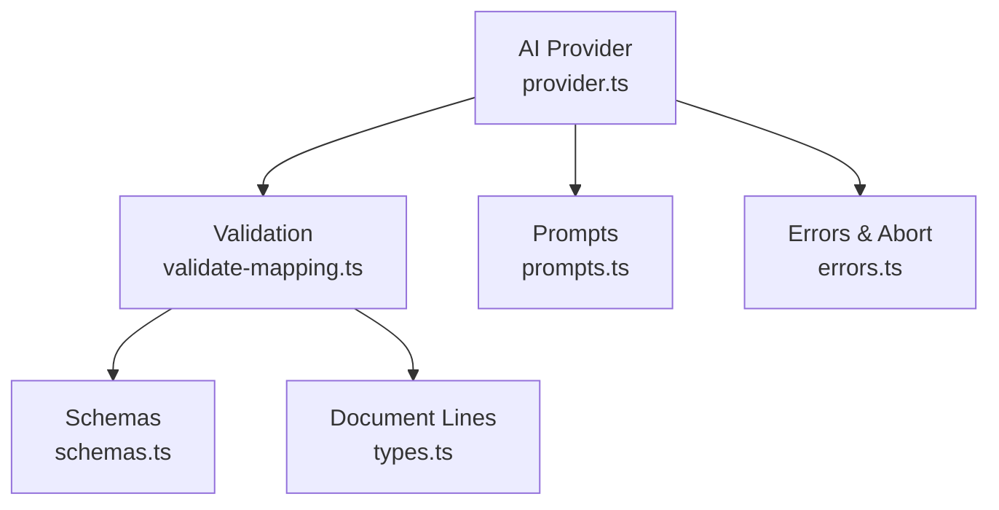
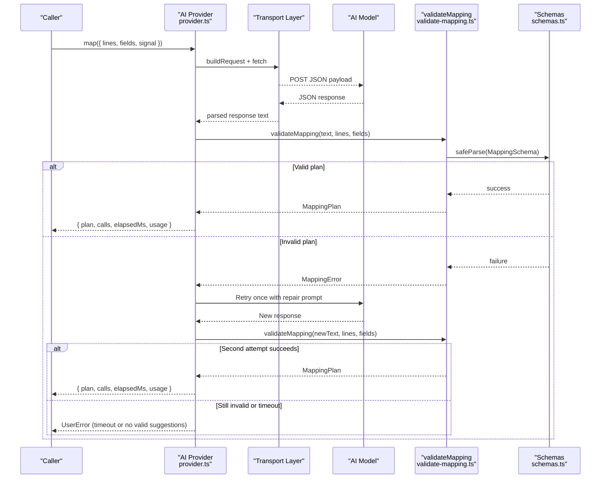
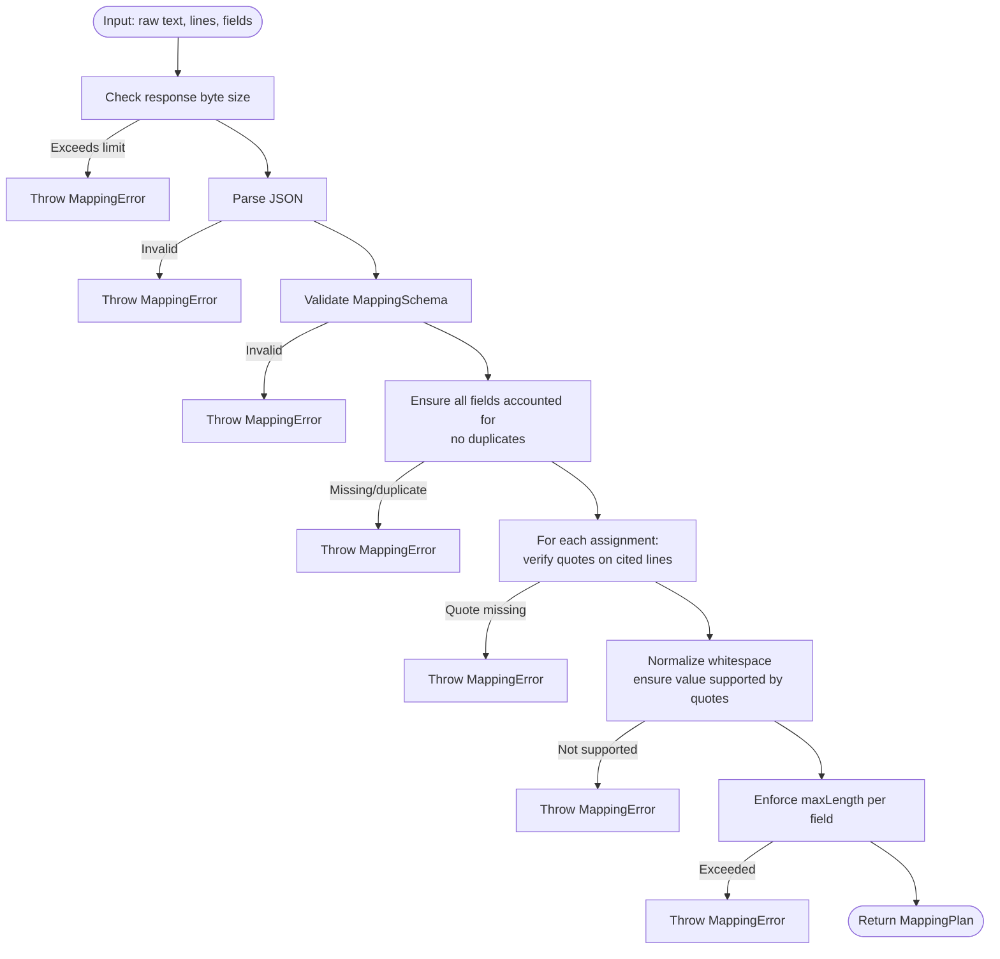
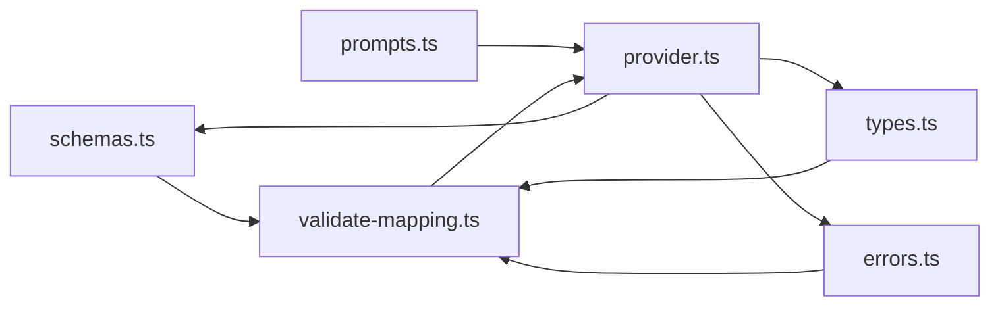

# Response Validation

<cite>
**Referenced Files in This Document**
- [validate-mapping.ts](file://src/ai/validate-mapping.ts)
- [schemas.ts](file://src/shared/schemas.ts)
- [provider.ts](file://src/ai/provider.ts)
- [prompts.ts](file://src/ai/prompts.ts)
- [types.ts](file://src/parsers/types.ts)
- [errors.ts](file://src/shared/errors.ts)
- [mapping.test.ts](file://tests/unit/mapping.test.ts)
</cite>

## Table of Contents
1. [Introduction](#introduction)
2. [Project Structure](#project-structure)
3. [Core Components](#core-components)
4. [Architecture Overview](#architecture-overview)
5. [Detailed Component Analysis](#detailed-component-analysis)
6. [Dependency Analysis](#dependency-analysis)
7. [Performance Considerations](#performance-considerations)
8. [Troubleshooting Guide](#troubleshooting-guide)
9. [Conclusion](#conclusion)

## Introduction
This document explains the AI response validation system that ensures mapping suggestions conform to expected schemas and business rules. It focuses on how validateMapping processes AI responses, validates JSON structure, enforces field assignments, and guarantees semantic consistency between field requirements and suggested values. It also documents the MappingPlan type, error handling strategies, retry mechanisms for malformed responses, and debugging techniques for validation failures.

## Project Structure
The validation system spans a small set of focused modules:
- Schema definitions define the expected shape of mapping plans and field descriptors.
- The validator parses and validates AI output against these schemas and enforces additional business rules.
- The provider orchestrates calls to AI providers, handles retries, and integrates validation into the request flow.
- Prompts instruct the model to return strictly valid JSON with grounded evidence.
- Parser types define the document lines used for evidence verification.
- Shared errors provide consistent error messaging and abort handling.

**Diagram sources**
- [provider.ts:52-105](file://src/ai/provider.ts#L52-L105)
- [validate-mapping.ts:7-31](file://src/ai/validate-mapping.ts#L7-L31)
- [schemas.ts:15-23](file://src/shared/schemas.ts#L15-L23)
- [prompts.ts:4-16](file://src/ai/prompts.ts#L4-L16)
- [types.ts:1-2](file://src/parsers/types.ts#L1-L2)
- [errors.ts:1-9](file://src/shared/errors.ts#L1-L9)

**Section sources**
- [provider.ts:52-105](file://src/ai/provider.ts#L52-L105)
- [validate-mapping.ts:7-31](file://src/ai/validate-mapping.ts#L7-L31)
- [schemas.ts:15-23](file://src/shared/schemas.ts#L15-L23)
- [prompts.ts:4-16](file://src/ai/prompts.ts#L4-L16)
- [types.ts:1-2](file://src/parsers/types.ts#L1-L2)
- [errors.ts:1-9](file://src/shared/errors.ts#L1-L9)

## Core Components
- MappingPlan and Assignment types define the expected structure of AI responses, including assignments and unmapped arrays.
- validateMapping performs parsing, schema validation, and business rule enforcement.
- The provider coordinates requests, enforces timeouts, and implements a limited retry mechanism when validation fails.

Key responsibilities:
- Parse raw text to JSON and validate against MappingSchema.
- Ensure all fields are accounted for (assigned or unmapped), no duplicates, and all field IDs are known.
- Verify evidence quotes exist on cited lines and that proposed values are supported by those quotes.
- Enforce field length limits and other constraints defined by FieldDescriptor.

**Section sources**
- [schemas.ts:15-23](file://src/shared/schemas.ts#L15-L23)
- [validate-mapping.ts:7-31](file://src/ai/validate-mapping.ts#L7-L31)
- [provider.ts:52-105](file://src/ai/provider.ts#L52-L105)

## Architecture Overview
The end-to-end flow from request to validated plan:

**Diagram sources**
- [provider.ts:52-105](file://src/ai/provider.ts#L52-L105)
- [validate-mapping.ts:7-31](file://src/ai/validate-mapping.ts#L7-L31)
- [schemas.ts:15-23](file://src/shared/schemas.ts#L15-L23)

## Detailed Component Analysis

### MappingPlan Type Structure
- assignments: Array of objects describing each field’s suggested value and supporting evidence.
  - fieldId: Identifier of the target field.
  - value: Non-empty string value to fill the field.
  - evidence: Array of evidence entries, each with lineId and quote.
  - reason: Brief explanation of why this assignment was made.
- unmapped: Array of objects for fields without safe matches.
  - fieldId: Identifier of the field.
  - reason: Explanation why no safe match exists.

Constraints enforced by schemas:
- Strict object shapes with no extra properties.
- Limits on array lengths and string sizes per LIMITS.
- Evidence arrays must be non-empty and bounded.

**Section sources**
- [schemas.ts:15-23](file://src/shared/schemas.ts#L15-L23)

### validateMapping Function
Responsibilities:
- Enforce response size limit before parsing.
- Parse raw text to JSON; throw if invalid.
- Validate against MappingSchema; throw if schema mismatch.
- Ensure all provided fields are accounted for exactly once across assignments and unmapped.
- For each assignment:
  - Verify each evidence quote exists within the cited line’s text.
  - Normalize whitespace and ensure the proposed value is present in the combined source quotes.
  - Enforce maxLength constraint per field.

Output:
- Returns a validated MappingPlan if all checks pass.

Error behavior:
- Throws MappingError with descriptive messages for each validation failure mode.

**Section sources**
- [validate-mapping.ts:7-31](file://src/ai/validate-mapping.ts#L7-L31)

### Provider Integration and Retry Mechanism
- Builds transport-specific requests using prompts and payloads.
- Reads bounded responses and extracts model text.
- Calls validateMapping; on MappingError, retries at most once by appending a repair message to the system prompt.
- Enforces a 60-second timeout per attempt; no automatic retry on timeout.
- Converts user-facing errors via errorMessage helper.

Retry policy:
- Up to one retry after a validation failure.
- Uses only diagnostic information from the first attempt to guide the second attempt.
- If both attempts fail, throws a final error indicating no valid suggestions were returned.

**Section sources**
- [provider.ts:52-105](file://src/ai/provider.ts#L52-L105)
- [errors.ts:1-9](file://src/shared/errors.ts#L1-L9)

### Prompt Guidance for Reliable Output
- System prompt instructs the model to:
  - Return only JSON matching the required shape with no extra properties.
  - Use exact quotes and their line IDs.
  - Preserve spelling, Unicode, leading zeros, identifiers, units, and date formats.
  - Match meaning and entity role; abstain if ambiguous.
  - Account for every supplied field as assigned or unmapped.
  - Never output selectors, commands, or submission actions.

These instructions reduce malformed outputs and improve validation success rates.

**Section sources**
- [prompts.ts:4-16](file://src/ai/prompts.ts#L4-L16)

### Data Flow and Business Rules

**Diagram sources**
- [validate-mapping.ts:7-31](file://src/ai/validate-mapping.ts#L7-L31)

## Dependency Analysis
- validateMapping depends on:
  - MappingSchema and FieldDescriptor from schemas.ts for structural and constraint validation.
  - DocumentLine type from parsers/types.ts for evidence verification.
  - MappingError from shared errors for consistent error signaling.
- provider.ts depends on:
  - validateMapping to enforce correctness of AI output.
  - prompts.ts to construct system prompts and payloads.
  - transports to send requests and extract text.
  - errors.ts for abort handling and user-friendly messages.

**Diagram sources**
- [validate-mapping.ts:1-3](file://src/ai/validate-mapping.ts#L1-L3)
- [schemas.ts:1-23](file://src/shared/schemas.ts#L1-L23)
- [types.ts:1-2](file://src/parsers/types.ts#L1-L2)
- [errors.ts:1-9](file://src/shared/errors.ts#L1-L9)
- [provider.ts:1-10](file://src/ai/provider.ts#L1-L10)
- [prompts.ts:1-26](file://src/ai/prompts.ts#L1-L26)

**Section sources**
- [validate-mapping.ts:1-3](file://src/ai/validate-mapping.ts#L1-L3)
- [schemas.ts:1-23](file://src/shared/schemas.ts#L1-L23)
- [types.ts:1-2](file://src/parsers/types.ts#L1-L2)
- [errors.ts:1-9](file://src/shared/errors.ts#L1-L9)
- [provider.ts:1-10](file://src/ai/provider.ts#L1-L10)
- [prompts.ts:1-26](file://src/ai/prompts.ts#L1-L26)

## Performance Considerations
- Response size is bounded early to avoid processing oversized outputs.
- Evidence verification uses maps keyed by line ID for O(1) lookups during validation.
- Whitespace normalization reduces false negatives when comparing values to evidence.
- Timeout protection prevents long-running requests from blocking the UI.

[No sources needed since this section provides general guidance]

## Troubleshooting Guide
Common validation errors and how to address them:
- Invalid JSON: The model returned prose or malformed JSON. Ensure the system prompt is intact and the model is configured to output strict JSON.
- Schema mismatch: Extra or missing properties detected. Confirm the model follows the required shape and does not include executable or selector content.
- Unknown or duplicate field IDs: The model referenced an unrecognized field or repeated a field. Check the field list passed to the provider and ensure unique IDs.
- Not all fields accounted for: Some fields were neither assigned nor listed as unmapped. Ensure every field appears exactly once in either assignments or unmapped.
- Quote not found on cited line: Evidence references do not match the actual line text. Verify line IDs and quotes precisely match the source document.
- Value not supported by evidence: The proposed value cannot be derived from the cited quotes. Adjust the value to be verbatim or ensure the correct quotes are cited.
- Exceeds field length limit: The value is longer than the field’s maxLength. Shorten the value or adjust field constraints.

Debugging techniques:
- Inspect the raw model response before validation to identify formatting issues.
- Log the MappingError message to pinpoint which rule failed.
- Use the test suite patterns to construct minimal failing cases and verify fixes.
- Confirm that the system prompt includes the required instructions and has not been altered.

Retry behavior:
- On the first validation failure, the provider retries once with a repair message appended to the system prompt.
- If the second attempt still fails or times out, a final error is thrown indicating no valid suggestions were returned.

Examples of valid and invalid responses:
- Valid: A MappingPlan where each assignment cites exact quotes from the correct lines, values are substrings of those quotes, and all fields are accounted for.
- Invalid: Any response that omits required fields, includes unknown field IDs, repeats field IDs, cites wrong lines, proposes unsupported values, or exceeds length limits.

Test coverage highlights:
- Tests assert preservation of Unicode and leading zeros.
- Tests reject prose, extra properties, unknown IDs, duplicates, missing accounts, fabricated facts, wrong-line quotes, whitespace-only values, and length violations.
- Tests confirm that current values are excluded from provider payloads.

**Section sources**
- [validate-mapping.ts:7-31](file://src/ai/validate-mapping.ts#L7-L31)
- [provider.ts:52-105](file://src/ai/provider.ts#L52-L105)
- [mapping.test.ts:12-30](file://tests/unit/mapping.test.ts#L12-L30)
- [mapping.test.ts:38-51](file://tests/unit/mapping.test.ts#L38-L51)

## Conclusion
The validation system ensures AI-generated mapping suggestions are structurally correct, semantically grounded, and compliant with field constraints. By combining strict schema validation, evidence-based verification, and controlled retries, it maintains reliability while minimizing hallucinations. When issues arise, targeted error messages and comprehensive tests help diagnose and resolve problems quickly.