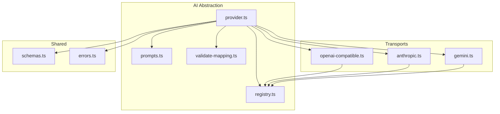
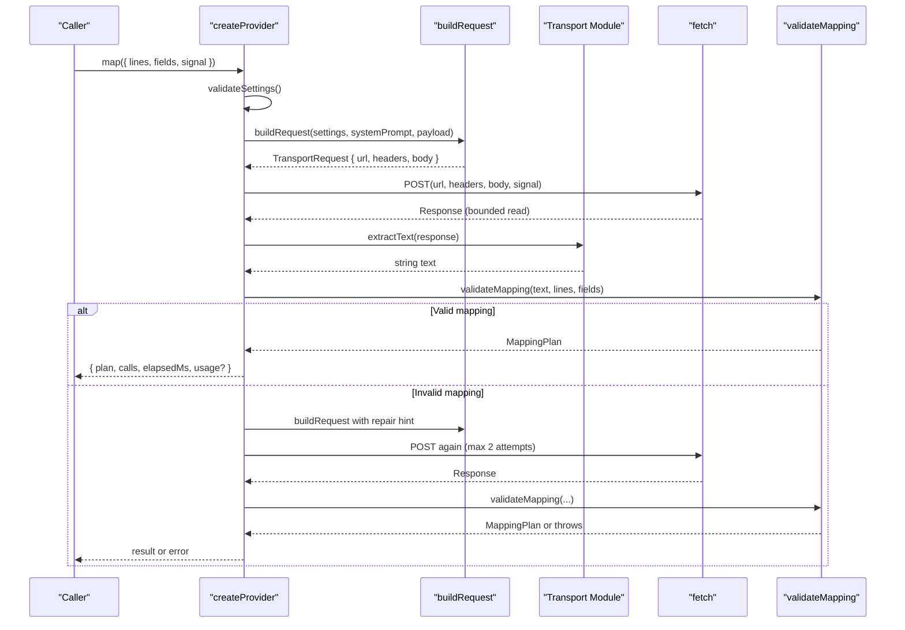
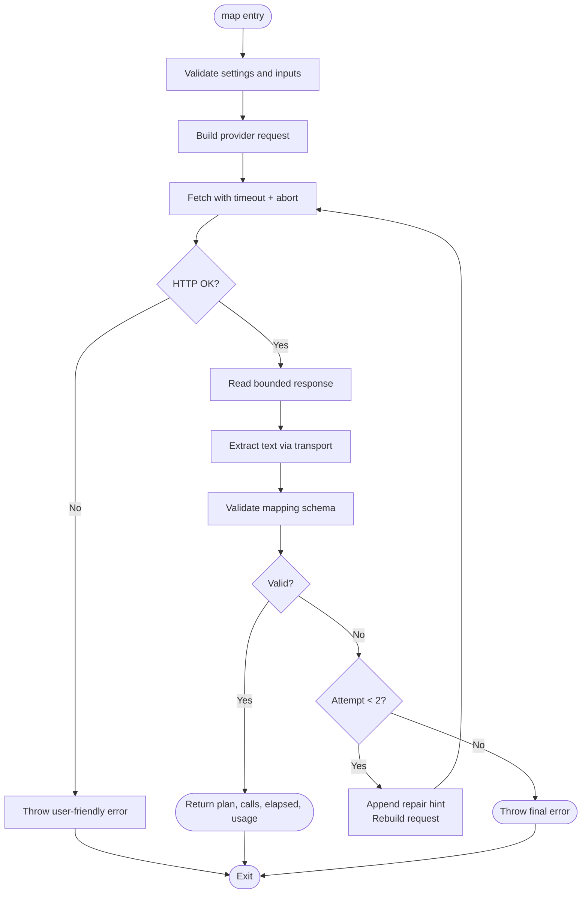
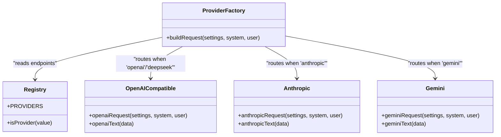
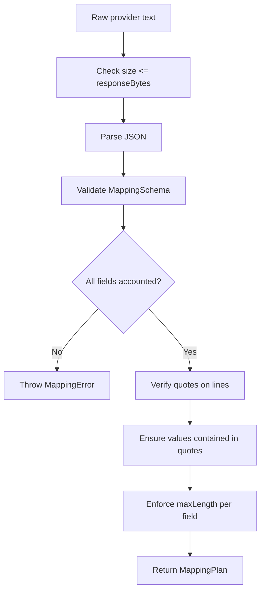
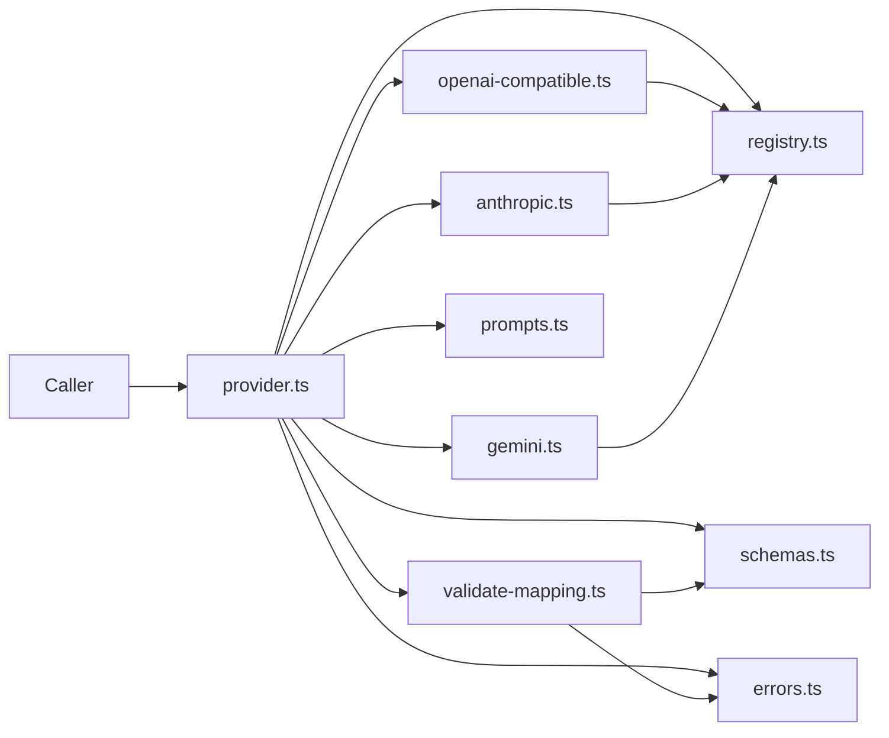

# Provider Abstraction Layer

<cite>
**Referenced Files in This Document**
- [provider.ts](file://src/ai/provider.ts)
- [registry.ts](file://src/ai/registry.ts)
- [openai-compatible.ts](file://src/ai/transports/openai-compatible.ts)
- [anthropic.ts](file://src/ai/transports/anthropic.ts)
- [gemini.ts](file://src/ai/transports/gemini.ts)
- [prompts.ts](file://src/ai/prompts.ts)
- [validate-mapping.ts](file://src/ai/validate-mapping.ts)
- [schemas.ts](file://src/shared/schemas.ts)
- [errors.ts](file://src/shared/errors.ts)
- [providers.test.ts](file://tests/unit/providers.test.ts)
</cite>

## Table of Contents
1. [Introduction](#introduction)
2. [Project Structure](#project-structure)
3. [Core Components](#core-components)
4. [Architecture Overview](#architecture-overview)
5. [Detailed Component Analysis](#detailed-component-analysis)
6. [Dependency Analysis](#dependency-analysis)
7. [Performance Considerations](#performance-considerations)
8. [Troubleshooting Guide](#troubleshooting-guide)
9. [Conclusion](#conclusion)
10. [Appendices](#appendices)

## Introduction
This document explains the AI provider abstraction layer in Help Me Fill. It focuses on how a unified contract enables support for multiple AI services (OpenAI-compatible, Anthropic, Gemini) through a single interface, how requests are built and routed to the correct transport, and how validation, error handling, retries, timeouts, and safety constraints are enforced end-to-end.

The goal is to make it easy to add new providers while keeping behavior consistent across all supported services.

## Project Structure
The AI subsystem is organized around a small set of focused modules:
- A registry that declares supported providers and their endpoints
- A provider factory that implements the unified AIProvider interface
- Transport modules that build provider-specific requests and parse responses
- Prompt composition and mapping validation utilities
- Shared schemas and error helpers

**Diagram sources**
- [provider.ts:1-107](file://src/ai/provider.ts#L1-L107)
- [registry.ts:1-13](file://src/ai/registry.ts#L1-L13)
- [openai-compatible.ts:1-22](file://src/ai/transports/openai-compatible.ts#L1-L22)
- [anthropic.ts:1-17](file://src/ai/transports/anthropic.ts#L1-L17)
- [gemini.ts:1-21](file://src/ai/transports/gemini.ts#L1-L21)
- [prompts.ts:1-26](file://src/ai/prompts.ts#L1-L26)
- [validate-mapping.ts:1-33](file://src/ai/validate-mapping.ts#L1-L33)
- [schemas.ts:1-39](file://src/shared/schemas.ts#L1-L39)
- [errors.ts:1-10](file://src/shared/errors.ts#L1-L10)

**Section sources**
- [provider.ts:1-107](file://src/ai/provider.ts#L1-L107)
- [registry.ts:1-13](file://src/ai/registry.ts#L1-L13)
- [openai-compatible.ts:1-22](file://src/ai/transports/openai-compatible.ts#L1-L22)
- [anthropic.ts:1-17](file://src/ai/transports/anthropic.ts#L1-L17)
- [gemini.ts:1-21](file://src/ai/transports/gemini.ts#L1-L21)
- [prompts.ts:1-26](file://src/ai/prompts.ts#L1-L26)
- [validate-mapping.ts:1-33](file://src/ai/validate-mapping.ts#L1-L33)
- [schemas.ts:1-39](file://src/shared/schemas.ts#L1-L39)
- [errors.ts:1-10](file://src/shared/errors.ts#L1-L10)

## Core Components
- AIProvider interface: Defines a single method map(request) that returns a MappingOutcome with plan, call count, elapsed time, and optional usage metrics.
- createProvider(settings, fetcher): Factory that builds an AIProvider instance bound to a specific provider configuration. It validates settings, composes prompts, routes to transports, enforces timeouts and abort signals, reads bounded responses, parses provider-specific payloads, validates mapping output, and handles retries safely.
- buildRequest(settings, system, user): Selects the appropriate transport based on the configured provider and constructs a TransportRequest with URL, headers, and body.
- Transport modules: openai-compatible, anthropic, gemini each implement request building and response extraction tailored to their API contracts.
- Validation and safety: validateMapping ensures the model’s JSON output conforms to the required schema and references valid lines; readBounded caps response size; errors are normalized via UserError and AbortSignal handling.

Key responsibilities by module:
- provider.ts: orchestration, retry loop, timeout, abort, bounded I/O, error translation
- registry.ts: provider metadata and endpoint selection
- transports/*: provider-specific request/response adapters
- prompts.ts: system prompt and payload construction
- validate-mapping.ts: strict schema enforcement and evidence integrity checks
- shared/schemas.ts: limits and type definitions
- shared/errors.ts: error types and abort handling

**Section sources**
- [provider.ts:11-107](file://src/ai/provider.ts#L11-L107)
- [registry.ts:1-13](file://src/ai/registry.ts#L1-L13)
- [openai-compatible.ts:4-21](file://src/ai/transports/openai-compatible.ts#L4-L21)
- [anthropic.ts:3-16](file://src/ai/transports/anthropic.ts#L3-L16)
- [gemini.ts:3-20](file://src/ai/transports/gemini.ts#L3-L20)
- [prompts.ts:4-25](file://src/ai/prompts.ts#L4-L25)
- [validate-mapping.ts:5-32](file://src/ai/validate-mapping.ts#L5-L32)
- [schemas.ts:1-39](file://src/shared/schemas.ts#L1-L39)
- [errors.ts:1-10](file://src/shared/errors.ts#L1-L10)

## Architecture Overview
The abstraction layer isolates caller code from provider-specific details. The caller invokes createProvider with settings and a fetcher, then calls map with document lines, fields, and an AbortSignal. Internally:
- Settings are validated once per call
- Prompts are composed using system instructions and a compacted payload
- A transport is selected based on the provider
- A fetch is executed with security-sensitive headers and safe options
- Responses are bounded and parsed per provider
- Output is validated against the mapping schema
- On validation failure, one repair attempt is made without leaking untrusted content back to the provider

**Diagram sources**
- [provider.ts:52-105](file://src/ai/provider.ts#L52-L105)
- [registry.ts:1-13](file://src/ai/registry.ts#L1-L13)
- [openai-compatible.ts:4-21](file://src/ai/transports/openai-compatible.ts#L4-L21)
- [anthropic.ts:3-16](file://src/ai/transports/anthropic.ts#L3-L16)
- [gemini.ts:3-20](file://src/ai/transports/gemini.ts#L3-L20)
- [validate-mapping.ts:7-32](file://src/ai/validate-mapping.ts#L7-L32)

## Detailed Component Analysis

### AIProvider Interface and createProvider
- AIProvider.map receives a MappingRequest containing document lines, field descriptors, and an AbortSignal.
- createProvider returns an implementation that:
  - Validates settings and input sizes
  - Composes the user payload from document lines and fields
  - Builds a provider-specific request
  - Executes the HTTP request with secure defaults (no credentials, no cache, redirect error)
  - Enforces a 60-second timeout and respects AbortSignal
  - Reads the response body in chunks up to a hard limit
  - Extracts text via the selected transport
  - Validates the mapping output strictly
  - Retries at most once when validation fails, appending a diagnostic repair hint but never echoing untrusted content
  - Returns a MappingOutcome including call count, elapsed time, and optional usage numbers

**Diagram sources**
- [provider.ts:52-105](file://src/ai/provider.ts#L52-L105)

**Section sources**
- [provider.ts:11-107](file://src/ai/provider.ts#L11-L107)
- [schemas.ts:1-39](file://src/shared/schemas.ts#L1-L39)
- [errors.ts:1-10](file://src/shared/errors.ts#L1-L10)

### Registry and Transport Selection
- PROVIDERS defines supported providers, display names, origins, endpoints, and transport identifiers.
- buildRequest selects the transport function based on the configured provider and returns a TransportRequest with URL, headers, and body.
- Transports:
  - OpenAI-compatible: uses Authorization Bearer header and messages array; supports both OpenAI and DeepSeek endpoints
  - Anthropic: uses x-api-key header, sets version and browser access flags, sends system and user messages
  - Gemini: uses x-goog-api-key header, encodes model name, sends systemInstruction and contents with JSON response MIME type

**Diagram sources**
- [registry.ts:1-13](file://src/ai/registry.ts#L1-L13)
- [provider.ts:19-26](file://src/ai/provider.ts#L19-L26)
- [openai-compatible.ts:4-21](file://src/ai/transports/openai-compatible.ts#L4-L21)
- [anthropic.ts:3-16](file://src/ai/transports/anthropic.ts#L3-L16)
- [gemini.ts:3-20](file://src/ai/transports/gemini.ts#L3-L20)

**Section sources**
- [registry.ts:1-13](file://src/ai/registry.ts#L1-L13)
- [provider.ts:19-26](file://src/ai/provider.ts#L19-L26)
- [openai-compatible.ts:4-21](file://src/ai/transports/openai-compatible.ts#L4-L21)
- [anthropic.ts:3-16](file://src/ai/transports/anthropic.ts#L3-L16)
- [gemini.ts:3-20](file://src/ai/transports/gemini.ts#L3-L20)

### Request Building and Payload Composition
- System prompt enforces JSON-only output, exact quoting, role-aware matching, and strict formatting rules.
- makePayload compacts field descriptors into a minimal structure and pairs them with document lines.
- buildRequest delegates to the appropriate transport which injects provider-specific headers and message formats.

Key behaviors:
- Credentials are placed only in headers, never in the body
- Model IDs are validated by regex before sending
- Max tokens are set per provider to avoid oversized outputs
- Gemini uses a JSON response MIME type to constrain output format

**Section sources**
- [prompts.ts:4-25](file://src/ai/prompts.ts#L4-L25)
- [provider.ts:15-26](file://src/ai/provider.ts#L15-L26)
- [openai-compatible.ts:4-12](file://src/ai/transports/openai-compatible.ts#L4-L12)
- [anthropic.ts:3-8](file://src/ai/transports/anthropic.ts#L3-L8)
- [gemini.ts:3-11](file://src/ai/transports/gemini.ts#L3-L11)

### Response Extraction and Validation
- Each transport extracts text from its native response shape and validates completion status.
- validateMapping performs:
  - Size check against responseBytes
  - JSON parsing
  - Schema validation against MappingSchema
  - Field coverage and uniqueness checks
  - Evidence integrity verification (quotes must exist on cited lines)
  - Value containment within quoted evidence
  - Field length enforcement

**Diagram sources**
- [validate-mapping.ts:7-32](file://src/ai/validate-mapping.ts#L7-L32)
- [schemas.ts:1-39](file://src/shared/schemas.ts#L1-L39)

**Section sources**
- [openai-compatible.ts:14-21](file://src/ai/transports/openai-compatible.ts#L14-L21)
- [anthropic.ts:10-16](file://src/ai/transports/anthropic.ts#L10-L16)
- [gemini.ts:13-20](file://src/ai/transports/gemini.ts#L13-L20)
- [validate-mapping.ts:7-32](file://src/ai/validate-mapping.ts#L7-L32)

### Error Handling, Retries, and Timeouts
- Errors:
  - Network failures and non-OK HTTP statuses throw user-friendly errors without leaking response bodies
  - Specific status codes produce targeted messages (auth, rate limit, model support, availability)
  - DOMException AbortError is surfaced as a canceled operation
- Retries:
  - At most two attempts total; second attempt includes a repair hint derived from validation errors
  - Untrusted model output is never sent back to the provider during repair
- Timeouts:
  - A 60-second timeout aborts the request; no automatic retry is performed on timeout
  - AbortSignal is respected throughout the flow
- Response bounds:
  - Streaming reader enforces a maximum response size; exceeding it cancels the stream and throws

**Section sources**
- [provider.ts:63-104](file://src/ai/provider.ts#L63-L104)
- [errors.ts:1-10](file://src/shared/errors.ts#L1-L10)
- [providers.test.ts:30-68](file://tests/unit/providers.test.ts#L30-L68)

### Custom Provider Implementation
To add a new provider:
1. Add an entry to PROVIDERS in registry.ts with name, origin, endpoint, and transport identifier.
2. Implement a transport module with:
   - A request builder that returns a TransportRequest with URL, headers, and body
   - An extractor that converts the provider’s response into a plain text string and validates success conditions
3. Wire routing in provider.ts buildRequest and extractText to handle the new transport identifier.
4. Add tests mirroring existing patterns to verify host isolation, credential placement, and response normalization.

Guidelines:
- Keep credentials out of the request body
- Use provider-specific max token limits to prevent oversized outputs
- Ensure the extractor rejects truncated or refused responses early
- Align with shared limits and schema expectations

**Section sources**
- [registry.ts:1-13](file://src/ai/registry.ts#L1-L13)
- [provider.ts:19-26](file://src/ai/provider.ts#L19-L26)
- [openai-compatible.ts:4-21](file://src/ai/transports/openai-compatible.ts#L4-L21)
- [anthropic.ts:3-16](file://src/ai/transports/anthropic.ts#L3-L16)
- [gemini.ts:3-20](file://src/ai/transports/gemini.ts#L3-L20)

## Dependency Analysis
The abstraction minimizes coupling between callers and provider specifics:
- provider.ts depends on registry, transports, prompts, validation, schemas, and errors
- Each transport depends only on registry and errors
- Validation depends on schemas and errors
- Tests mock fetch to assert behavior without network calls

**Diagram sources**
- [provider.ts:1-107](file://src/ai/provider.ts#L1-L107)
- [registry.ts:1-13](file://src/ai/registry.ts#L1-L13)
- [openai-compatible.ts:1-22](file://src/ai/transports/openai-compatible.ts#L1-L22)
- [anthropic.ts:1-17](file://src/ai/transports/anthropic.ts#L1-L17)
- [gemini.ts:1-21](file://src/ai/transports/gemini.ts#L1-L21)
- [prompts.ts:1-26](file://src/ai/prompts.ts#L1-L26)
- [validate-mapping.ts:1-33](file://src/ai/validate-mapping.ts#L1-L33)
- [schemas.ts:1-39](file://src/shared/schemas.ts#L1-L39)
- [errors.ts:1-10](file://src/shared/errors.ts#L1-L10)

**Section sources**
- [provider.ts:1-107](file://src/ai/provider.ts#L1-L107)
- [registry.ts:1-13](file://src/ai/registry.ts#L1-L13)
- [validate-mapping.ts:1-33](file://src/ai/validate-mapping.ts#L1-L33)

## Performance Considerations
- Bounded streaming response reading prevents memory spikes and enforces a 256 KiB cap
- Max token limits reduce payload size and processing time per provider
- One-shot retry avoids unnecessary network churn while improving robustness against transient malformed outputs
- AbortSignal and timeout ensure resources are released promptly under load or cancellation
- Compact field descriptors minimize payload size

[No sources needed since this section provides general guidance]

## Troubleshooting Guide
Common issues and resolutions:
- Invalid model ID or API key: ensure model matches provider expectations and key has no spaces; errors will guide you to check account access and policies
- Rate limiting or quota exceeded: wait and retry later; the error message indicates rate/quota issues
- Model refusal or truncation: choose a supported text model or shorten the document; transports reject incomplete or refused outputs
- Network or CORS issues: verify host permissions and network access; errors indicate reachability problems
- Canceled operations: if AbortSignal is triggered, the operation stops immediately without starting new requests
- Oversized responses: the system enforces a response size limit; reduce document size or adjust provider parameters

**Section sources**
- [provider.ts:15-104](file://src/ai/provider.ts#L15-L104)
- [errors.ts:1-10](file://src/shared/errors.ts#L1-L10)
- [providers.test.ts:30-68](file://tests/unit/providers.test.ts#L30-L68)

## Conclusion
The AI provider abstraction layer delivers a clean, consistent interface for interacting with multiple AI services while enforcing safety, performance, and reliability. By centralizing request building, response parsing, validation, and error handling, it allows developers to add new providers with minimal friction and maintain predictable behavior across all supported services.

[No sources needed since this section summarizes without analyzing specific files]

## Appendices

### Example: Configuring Different AI Services
- OpenAI-compatible:
  - Set provider to openai or deepseek
  - Provide model ID supported by the chosen endpoint
  - Supply API key in settings; it will be injected into the Authorization header
- Anthropic:
  - Set provider to anthropic
  - Provide model ID and API key; headers include version and browser access flag
- Gemini:
  - Set provider to gemini
  - Provide model ID (with or without models/ prefix) and API key; response MIME type is set to JSON

These configurations are consumed by buildRequest and the corresponding transport modules.

**Section sources**
- [registry.ts:1-13](file://src/ai/registry.ts#L1-L13)
- [openai-compatible.ts:4-12](file://src/ai/transports/openai-compatible.ts#L4-L12)
- [anthropic.ts:3-8](file://src/ai/transports/anthropic.ts#L3-L8)
- [gemini.ts:3-11](file://src/ai/transports/gemini.ts#L3-L11)

### Example: Implementing a Custom Provider
Steps:
1. Add provider entry in registry.ts
2. Create a transport file with request builder and text extractor
3. Update provider.ts routing in buildRequest and extractText
4. Write unit tests similar to existing ones to assert host isolation, credential placement, and response normalization

**Section sources**
- [registry.ts:1-13](file://src/ai/registry.ts#L1-L13)
- [provider.ts:19-26](file://src/ai/provider.ts#L19-L26)
- [providers.test.ts:14-29](file://tests/unit/providers.test.ts#L14-L29)