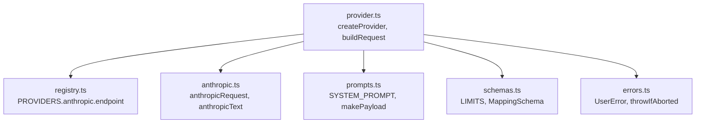
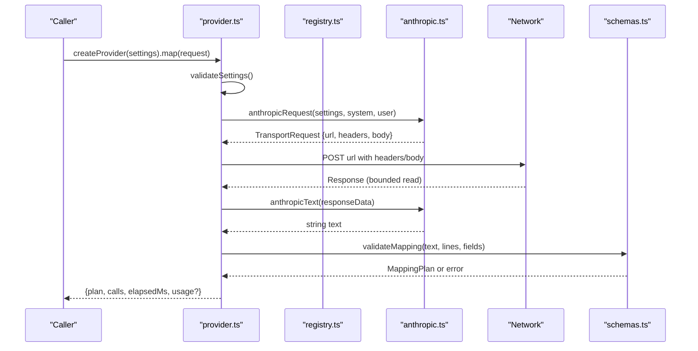
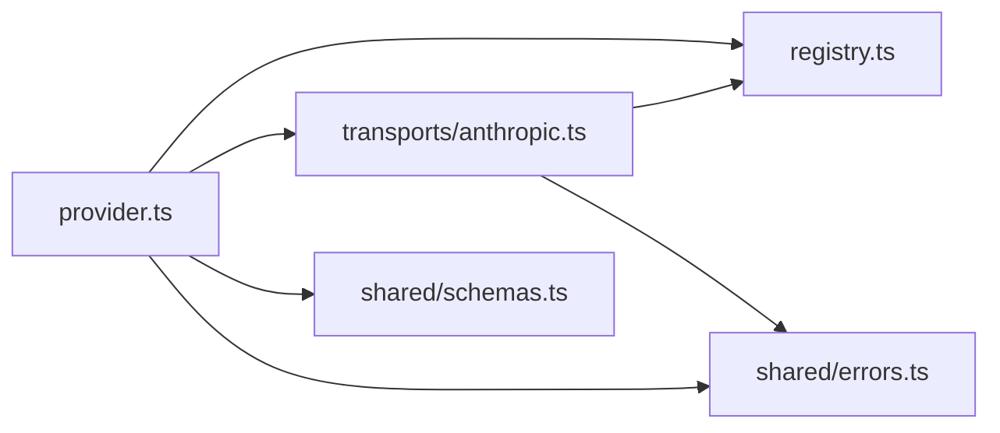

# Anthropic Transport

<cite>
**Referenced Files in This Document**
- [anthropic.ts](file://src/ai/transports/anthropic.ts)
- [provider.ts](file://src/ai/provider.ts)
- [registry.ts](file://src/ai/registry.ts)
- [prompts.ts](file://src/ai/prompts.ts)
- [schemas.ts](file://src/shared/schemas.ts)
- [errors.ts](file://src/shared/errors.ts)
- [providers.test.ts](file://tests/unit/providers.test.ts)
</cite>

## Table of Contents
1. [Introduction](#introduction)
2. [Project Structure](#project-structure)
3. [Core Components](#core-components)
4. [Architecture Overview](#architecture-overview)
5. [Detailed Component Analysis](#detailed-component-analysis)
6. [Dependency Analysis](#dependency-analysis)
7. [Performance Considerations](#performance-considerations)
8. [Troubleshooting Guide](#troubleshooting-guide)
9. [Conclusion](#conclusion)

## Introduction
This document explains the Anthropic transport implementation used to communicate with Claude models for form-filling tasks. It covers request construction, authentication, rate limiting behavior, response parsing, configuration options, error handling, and troubleshooting guidance based on the codebase.

## Project Structure
The Anthropic integration is implemented as a transport within a multi-provider AI layer:
- Registry defines provider endpoints and transports.
- Provider orchestrates request building, execution, timeouts, retries, and response extraction.
- The Anthropic transport builds the specific request payload and parses the response.
- Shared schemas define limits and validation rules.
- Shared errors provide consistent error types and messages.

**Diagram sources**
- [provider.ts:19-26](file://src/ai/provider.ts#L19-L26)
- [registry.ts:1-6](file://src/ai/registry.ts#L1-L6)
- [anthropic.ts:3-16](file://src/ai/transports/anthropic.ts#L3-L16)
- [prompts.ts:4-25](file://src/ai/prompts.ts#L4-L25)
- [schemas.ts:1-23](file://src/shared/schemas.ts#L1-L23)
- [errors.ts:1-9](file://src/shared/errors.ts#L1-L9)

**Section sources**
- [registry.ts:1-13](file://src/ai/registry.ts#L1-L13)
- [provider.ts:1-107](file://src/ai/provider.ts#L1-L107)
- [anthropic.ts:1-17](file://src/ai/transports/anthropic.ts#L1-L17)
- [prompts.ts:1-26](file://src/ai/prompts.ts#L1-L26)
- [schemas.ts:1-39](file://src/shared/schemas.ts#L1-L39)
- [errors.ts:1-10](file://src/shared/errors.ts#L1-L10)

## Core Components
- Anthropic request builder: constructs the API call URL, headers, and body for Claude.
- Response parser: validates and extracts text from Anthropic’s response structure.
- Provider orchestration: handles settings validation, request lifecycle, timeouts, retries, and usage extraction.
- Limits and schemas: enforce input/output size constraints and validate mapping results.

Key responsibilities:
- Authentication via API key header.
- Fixed endpoint selection from registry.
- System prompt injection and user payload formatting.
- Rate limit and error handling at HTTP level.
- Strict response validation before schema parsing.

**Section sources**
- [anthropic.ts:3-16](file://src/ai/transports/anthropic.ts#L3-L16)
- [provider.ts:15-26](file://src/ai/provider.ts#L15-L26)
- [schemas.ts:1-23](file://src/shared/schemas.ts#L1-L23)

## Architecture Overview
The flow from UI to model and back:
- Settings are validated and snapshot.
- A request is built using the selected provider’s transport (Anthropic).
- The fetch call uses fixed security headers and no caching.
- Responses are bounded in size and parsed into JSON.
- For Anthropic, the response is validated for stop_reason and content blocks; text is extracted.
- The resulting text is validated against the mapping schema; if invalid, one repair attempt is made without echoing untrusted output.
- Usage metadata is extracted when present.

**Diagram sources**
- [provider.ts:52-105](file://src/ai/provider.ts#L52-L105)
- [anthropic.ts:3-16](file://src/ai/transports/anthropic.ts#L3-L16)
- [registry.ts:1-6](file://src/ai/registry.ts#L1-L6)
- [schemas.ts:15-23](file://src/shared/schemas.ts#L15-L23)

## Detailed Component Analysis

### Anthropic Request Construction
- Endpoint: Uses the Anthropic messages endpoint defined in the registry.
- Headers:
  - x-api-key: set from settings.apiKey.
  - anthropic-version: pinned to a specific version.
  - anthropic-dangerous-direct-browser-access: enabled for browser-based access.
- Body:
  - model: taken from settings.model.
  - system: injected system prompt.
  - max_tokens: fixed value.
  - messages: array containing a single user message with the formatted payload.
  - stream: disabled.

Notes:
- The API key is placed only in headers, never in the body.
- The system prompt is composed once and appended with optional repair context on retry.

**Section sources**
- [anthropic.ts:3-8](file://src/ai/transports/anthropic.ts#L3-L8)
- [registry.ts:1-6](file://src/ai/registry.ts#L1-L6)
- [prompts.ts:4-25](file://src/ai/prompts.ts#L4-L25)

### Anthropic Response Parsing
- Validates stop_reason equals end_turn.
- Ensures content is an array of text blocks.
- Concatenates all block texts into a single string.
- Throws a UserError if the response is refused, truncated, or contains unsupported content types.

Implications:
- Any refusal or truncation will halt processing and surface a clear error.
- Only text-type content blocks are accepted.

**Section sources**
- [anthropic.ts:10-16](file://src/ai/transports/anthropic.ts#L10-L16)

### Provider Orchestration and Error Handling
- Settings validation enforces allowed characters and length for model and apiKey.
- Input validation checks field count and total character count against limits.
- Request lifecycle:
  - Builds request via transport-specific function.
  - Sets AbortController and timeout (60 seconds).
  - Calls fetch with secure defaults (no credentials, no cache, redirect error).
- HTTP error handling:
  - 401/403: indicates API key or access issues.
  - 429: rate limit/quota exceeded.
  - 400/404: model ID or support issues.
  - Other errors: generic provider unavailable message.
- Response handling:
  - Reads response body in chunks with a hard byte limit.
  - Parses JSON; invalid JSON raises a UserError.
  - Extracts text via transport-specific parser.
  - Validates mapping result; allows one repair attempt without echoing untrusted output.
- Usage extraction:
  - Collects numeric values under usage or usageMetadata keys.

**Section sources**
- [provider.ts:15-105](file://src/ai/provider.ts#L15-L105)
- [errors.ts:1-9](file://src/shared/errors.ts#L1-L9)

### Configuration Options and Model Variants
- Provider selection: configured via settings.provider set to 'anthropic'.
- Model: configured via settings.model; must match a valid model ID supported by the provider account.
- API key: provided via settings.apiKey; must be non-empty and contain no spaces.
- Endpoint: fixed to the Anthropic messages endpoint from the registry.
- Streaming: disabled in the request body; streaming is not used in this transport.
- Token limits: max_tokens is fixed in the request; additional input/output limits are enforced by shared schemas and response bounds.

Practical notes:
- Choose a model that supports JSON output and sufficient token capacity for your documents and fields.
- Keep payloads within character and field limits to avoid early rejection.

**Section sources**
- [registry.ts:1-6](file://src/ai/registry.ts#L1-L6)
- [anthropic.ts:3-8](file://src/ai/transports/anthropic.ts#L3-L8)
- [schemas.ts:1-23](file://src/shared/schemas.ts#L1-L23)
- [provider.ts:15-26](file://src/ai/provider.ts#L15-L26)

### Authentication Method
- API key is passed in the x-api-key header.
- No other secret material is included in the request body.
- Browser access requires enabling direct browser access via a dedicated header.

Security considerations:
- Ensure the origin policy permits requests to the Anthropic endpoint.
- Avoid logging or exposing the API key in client-side contexts beyond what is necessary.

**Section sources**
- [anthropic.ts:5-6](file://src/ai/transports/anthropic.ts#L5-L6)
- [registry.ts:1-6](file://src/ai/registry.ts#L1-L6)

### Rate Limiting Considerations
- HTTP 429 responses are surfaced with a message indicating rate limit or quota reached.
- The provider does not automatically retry on 429; callers should implement backoff or wait strategies.
- Response size is bounded to prevent excessive memory usage.

Operational tips:
- Monitor usage quotas and adjust request frequency.
- Implement exponential backoff on 429 in higher-level logic if needed.

**Section sources**
- [provider.ts:77-83](file://src/ai/provider.ts#L77-L83)
- [provider.ts:34-51](file://src/ai/provider.ts#L34-L51)

### Response Validation Strategies
- Stop reason and content type validation ensure safe, parseable outputs.
- Mapping schema validation enforces strict structure for assignments and unmapped fields.
- One repair attempt is allowed; it appends diagnostic context without re-sending untrusted model output.

Failure modes:
- Refused or truncated responses raise explicit errors.
- Invalid JSON or oversized responses are rejected early.

**Section sources**
- [anthropic.ts:10-16](file://src/ai/transports/anthropic.ts#L10-L16)
- [provider.ts:84-94](file://src/ai/provider.ts#L84-L94)
- [schemas.ts:15-23](file://src/shared/schemas.ts#L15-L23)

## Dependency Analysis

**Diagram sources**
- [provider.ts:1-26](file://src/ai/provider.ts#L1-L26)
- [anthropic.ts:1-16](file://src/ai/transports/anthropic.ts#L1-L16)
- [registry.ts:1-13](file://src/ai/registry.ts#L1-L13)
- [schemas.ts:1-23](file://src/shared/schemas.ts#L1-L23)
- [errors.ts:1-9](file://src/shared/errors.ts#L1-L9)

**Section sources**
- [provider.ts:1-26](file://src/ai/provider.ts#L1-L26)
- [anthropic.ts:1-16](file://src/ai/transports/anthropic.ts#L1-L16)
- [registry.ts:1-13](file://src/ai/registry.ts#L1-L13)
- [schemas.ts:1-23](file://src/shared/schemas.ts#L1-L23)
- [errors.ts:1-9](file://src/shared/errors.ts#L1-L9)

## Performance Considerations
- Response bounding: reads and caps response size to protect memory.
- Timeout: requests time out after 60 seconds to avoid hanging operations.
- No streaming: streaming is disabled; use larger max_tokens if needed but watch response size limits.
- Payload minimization: system prompt and user payload are constructed once; avoid unnecessary data in fields.
- Retry strategy: only one repair attempt is performed; design prompts and inputs to minimize failures.

[No sources needed since this section provides general guidance]

## Troubleshooting Guide
Common issues and resolutions:
- Invalid or missing API key:
  - Symptoms: 401/403 errors.
  - Action: verify API key format and permissions; ensure browser access is permitted.
- Rate limiting:
  - Symptoms: 429 errors.
  - Action: reduce request frequency; implement backoff; check quotas.
- Model ID or support issues:
  - Symptoms: 400/404 errors.
  - Action: confirm model ID exists and supports JSON output.
- Truncated or refused responses:
  - Symptoms: validation errors about stop_reason or content.
  - Action: shorten documents or reduce fields; choose a model with larger capacity.
- Oversized responses:
  - Symptoms: response exceeds byte limit.
  - Action: reduce document size or field count; refine prompts to produce shorter outputs.
- Network or CORS issues:
  - Symptoms: network errors or blocked requests.
  - Action: verify host permissions and CORS policies for the Anthropic endpoint.

Validation and safety behaviors:
- Inputs are validated against limits before sending.
- Responses are strictly validated before schema parsing.
- Errors are normalized to user-friendly messages.

**Section sources**
- [provider.ts:77-100](file://src/ai/provider.ts#L77-L100)
- [anthropic.ts:10-16](file://src/ai/transports/anthropic.ts#L10-L16)
- [schemas.ts:1-23](file://src/shared/schemas.ts#L1-L23)
- [errors.ts:1-9](file://src/shared/errors.ts#L1-L9)
- [providers.test.ts:14-68](file://tests/unit/providers.test.ts#L14-L68)

## Conclusion
The Anthropic transport integrates Claude via a focused request builder and strict response parser, embedded in a robust provider layer that enforces security, limits, timeouts, and validation. By configuring the correct model, API key, and respecting limits, you can reliably extract structured mapping results while handling common failure modes gracefully.

[No sources needed since this section summarizes without analyzing specific files]