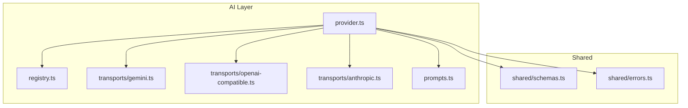
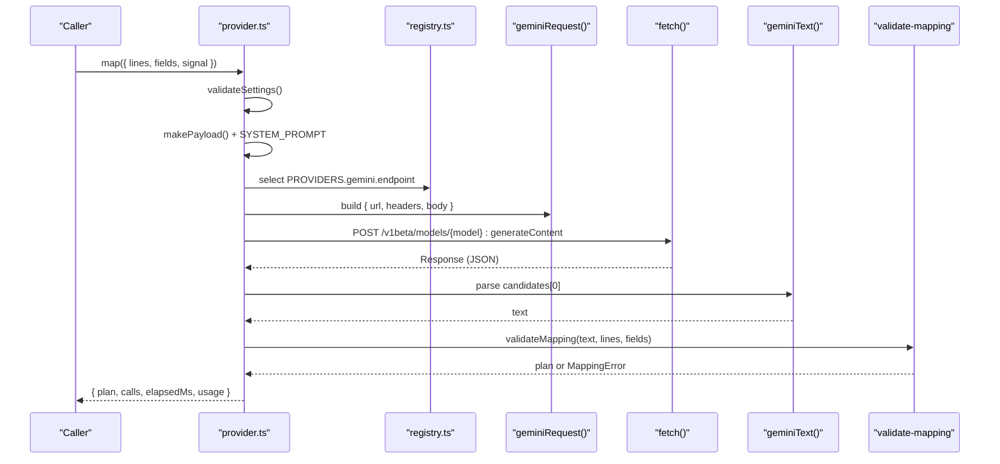
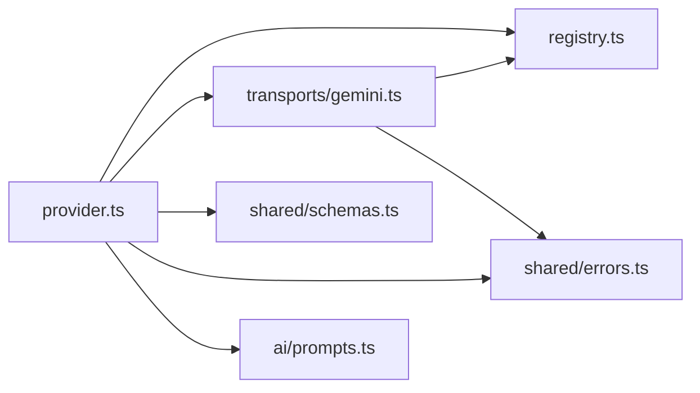
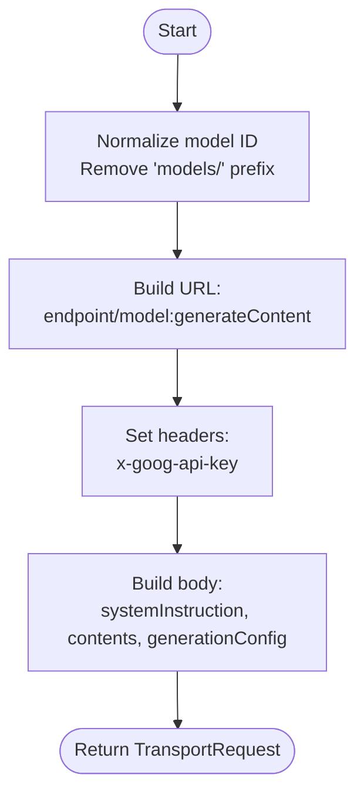
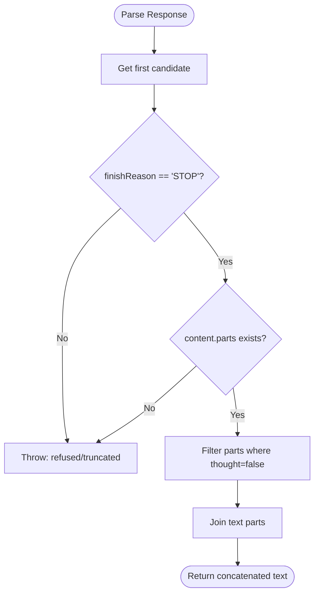

# Google Gemini Transport

<cite>
**Referenced Files in This Document**
- [gemini.ts](file://src/ai/transports/gemini.ts)
- [provider.ts](file://src/ai/provider.ts)
- [registry.ts](file://src/ai/registry.ts)
- [prompts.ts](file://src/ai/prompts.ts)
- [schemas.ts](file://src/shared/schemas.ts)
- [errors.ts](file://src/shared/errors.ts)
- [providers.test.ts](file://tests/unit/providers.test.ts)
- [manifest.json](file://src/manifest.json)
</cite>

## Table of Contents
1. [Introduction](#introduction)
2. [Project Structure](#project-structure)
3. [Core Components](#core-components)
4. [Architecture Overview](#architecture-overview)
5. [Detailed Component Analysis](#detailed-component-analysis)
6. [Dependency Analysis](#dependency-analysis)
7. [Performance Considerations](#performance-considerations)
8. [Troubleshooting Guide](#troubleshooting-guide)
9. [Conclusion](#conclusion)
10. [Appendices](#appendices)

## Introduction
This document explains the Google Gemini transport implementation used to communicate with Gemini Pro models for form-filling tasks. It covers request construction, content formatting, generation parameters, authentication via API key, response parsing, error handling, and configuration guidance. It also provides best practices for prompt optimization and handling large documents within the application’s constraints.

## Project Structure
The Gemini transport is part of a multi-provider AI abstraction layer. The provider orchestrates requests, while each transport (OpenAI-compatible, Anthropic, Gemini) builds provider-specific payloads and parses responses.

**Diagram sources**
- [provider.ts:19-26](file://src/ai/provider.ts#L19-L26)
- [registry.ts:1-6](file://src/ai/registry.ts#L1-L6)
- [gemini.ts:3-12](file://src/ai/transports/gemini.ts#L3-L12)
- [prompts.ts:4-16](file://src/ai/prompts.ts#L4-L16)
- [schemas.ts:1-39](file://src/shared/schemas.ts#L1-L39)
- [errors.ts:1-10](file://src/shared/errors.ts#L1-L10)

**Section sources**
- [provider.ts:19-26](file://src/ai/provider.ts#L19-L26)
- [registry.ts:1-6](file://src/ai/registry.ts#L1-L6)

## Core Components
- Gemini transport builder: constructs the Gemini generateContent request URL, headers, and body.
- Gemini response parser: extracts text from Gemini’s candidate structure and validates completion status.
- Provider orchestration: selects the correct transport based on settings, enforces limits, handles HTTP errors, timeouts, and retries once for schema validation failures.
- Shared schemas and errors: define input/output constraints and user-facing error messages.

Key responsibilities:
- Build a JSON-formatted request tailored to Gemini’s API.
- Enforce safety and size limits at the application level.
- Parse and validate Gemini’s response format.
- Provide consistent error messaging and retry behavior.

**Section sources**
- [gemini.ts:3-20](file://src/ai/transports/gemini.ts#L3-L20)
- [provider.ts:15-105](file://src/ai/provider.ts#L15-L105)
- [schemas.ts:1-39](file://src/shared/schemas.ts#L1-L39)
- [errors.ts:1-10](file://src/shared/errors.ts#L1-L10)

## Architecture Overview
The provider composes a system prompt and user payload, delegates to the Gemini transport to build the request, executes it over fetch, reads bounded responses, parses text, validates against the mapping schema, and returns results or errors.

**Diagram sources**
- [provider.ts:52-105](file://src/ai/provider.ts#L52-L105)
- [registry.ts:1-6](file://src/ai/registry.ts#L1-L6)
- [gemini.ts:3-20](file://src/ai/transports/gemini.ts#L3-L20)
- [prompts.ts:4-25](file://src/ai/prompts.ts#L4-L25)

## Detailed Component Analysis

### Gemini Request Construction
- Endpoint: Uses the registry endpoint with the model name appended and the generateContent method.
- Authentication: Sends the API key in the x-goog-api-key header.
- Content formatting:
  - System instruction provided as a single text part.
  - User content provided as a single message with role "user" containing one text part.
- Generation parameters:
  - responseMimeType set to application/json to enforce structured output.
  - maxOutputTokens set to a fixed upper bound.

Notes:
- Model IDs are normalized by removing any leading "models/" prefix before encoding.
- No safety settings are included in the request; safety filtering is not configured here.

**Section sources**
- [gemini.ts:3-12](file://src/ai/transports/gemini.ts#L3-L12)
- [registry.ts:1-6](file://src/ai/registry.ts#L1-L6)

### Gemini Response Parsing
- Extracts the first candidate from the response.
- Validates finishReason equals STOP and that content.parts exists.
- Filters out parts marked as thoughts and concatenates remaining text parts.
- Throws a user-friendly error if the response is refused or truncated.

**Section sources**
- [gemini.ts:13-20](file://src/ai/transports/gemini.ts#L13-L20)

### Provider Orchestration and Error Handling
- Settings validation: Ensures model ID format and API key validity.
- Input limits: Enforces maximum number of fields and total characters.
- Request execution:
  - Uses AbortController with a 60-second timeout.
  - Sets secure fetch options (credentials omitted, no cache, redirect error).
- HTTP error handling:
  - Maps common status codes to actionable messages (e.g., 401/403 for auth, 429 for rate/quota, 400/404 for model issues).
  - Cancels response bodies on error to avoid leaks.
- Response reading:
  - Streams and bounds the response to a maximum size.
  - Parses JSON safely.
- Retry logic:
  - On schema validation failure, retries once with a repair hint appended to the system prompt.
  - Does not send untrusted model output back to the provider.
- Usage extraction:
  - Reads usage or usageMetadata numbers when present.

**Section sources**
- [provider.ts:15-105](file://src/ai/provider.ts#L15-L105)
- [schemas.ts:1-39](file://src/shared/schemas.ts#L1-L39)
- [errors.ts:1-10](file://src/shared/errors.ts#L1-L10)

### Prompting and Payload Composition
- System prompt instructs the model to return strictly JSON matching the mapping schema, citing evidence and preserving exact values.
- User payload includes compacted field descriptors and document lines.

Best practices embedded in prompts:
- Do not infer facts; only copy verbatim supported values.
- Preserve formats, units, identifiers, and dates.
- Match both meaning and entity role; abstain if ambiguous.
- Account for every field as assigned or unmapped.

**Section sources**
- [prompts.ts:4-25](file://src/ai/prompts.ts#L4-L25)

## Dependency Analysis
- provider.ts depends on:
  - registry.ts for provider endpoints and transport selection.
  - transports/gemini.ts for building and parsing Gemini requests/responses.
  - shared/schemas.ts for limits and validation targets.
  - shared/errors.ts for error types and utilities.
  - ai/prompts.ts for system instructions and payload composition.
- gemini.ts depends on:
  - registry.ts for the base endpoint.
  - shared/errors.ts for user-facing errors.

**Diagram sources**
- [provider.ts:1-10](file://src/ai/provider.ts#L1-L10)
- [gemini.ts:1-3](file://src/ai/transports/gemini.ts#L1-L3)
- [registry.ts:1-6](file://src/ai/registry.ts#L1-L6)
- [schemas.ts:1-39](file://src/shared/schemas.ts#L1-L39)
- [errors.ts:1-10](file://src/shared/errors.ts#L1-L10)
- [prompts.ts:1-25](file://src/ai/prompts.ts#L1-L25)

**Section sources**
- [provider.ts:1-10](file://src/ai/provider.ts#L1-L10)
- [gemini.ts:1-3](file://src/ai/transports/gemini.ts#L1-L3)

## Performance Considerations
- Response size limit: Responses are bounded to prevent memory pressure; oversized responses trigger an error.
- Timeout: Requests time out after 60 seconds to avoid hanging operations.
- Token budget: maxOutputTokens is set to constrain output length.
- Field and character limits: Inputs are validated against maximum counts and sizes to keep payloads manageable.
- Single retry: Only one retry is attempted for schema validation failures to balance reliability and cost.

Recommendations:
- Keep documents concise to stay within character limits.
- Use precise prompts to reduce hallucinations and unnecessary tokens.
- Prefer smaller batches of fields per request when possible.

**Section sources**
- [provider.ts:34-51](file://src/ai/provider.ts#L34-L51)
- [provider.ts:52-105](file://src/ai/provider.ts#L52-L105)
- [schemas.ts:1-39](file://src/shared/schemas.ts#L1-L39)
- [gemini.ts:9-10](file://src/ai/transports/gemini.ts#L9-L10)

## Troubleshooting Guide
Common issues and resolutions:
- Invalid model or unsupported model:
  - Ensure the model ID matches your provider account and supports JSON output.
  - Check for proper normalization (no leading "models/" prefix).
- API key or access issues:
  - Verify the API key is valid and has necessary permissions.
  - Confirm browser extension host permissions allow the Gemini endpoint.
- Rate limiting or quota exceeded:
  - Wait before retrying; check your provider account quotas.
- Truncated or refused responses:
  - Shorten the document or adjust prompts to reduce output size.
  - Ensure the model can produce JSON and is not blocked by safety filters.
- Network or timeout errors:
  - Check connectivity and ensure the operation completes within 60 seconds.
  - If canceled, no new request was started.

Provider-specific notes:
- Safety filters: Not explicitly configured in this transport; if content is blocked, shorten inputs or refine prompts.
- Quota management: Handled by the provider; the app surfaces 429 errors with guidance to wait or review quotas.

**Section sources**
- [provider.ts:77-83](file://src/ai/provider.ts#L77-L83)
- [provider.ts:95-104](file://src/ai/provider.ts#L95-L104)
- [gemini.ts:13-20](file://src/ai/transports/gemini.ts#L13-L20)
- [manifest.json:10](file://src/manifest.json#L10)

## Conclusion
The Gemini transport integrates tightly with the provider layer to deliver reliable, bounded, and safe interactions with Gemini Pro models. It uses a strict JSON output strategy, enforces input and output limits, and provides clear error handling and retry semantics. By following the prompt guidelines and respecting size and token constraints, users can achieve robust form-filling automation across diverse documents.

## Appendices

### Configuration Examples
- Base endpoint and origin are defined centrally; do not hardcode elsewhere.
- Authentication:
  - API key is passed via the x-goog-api-key header.
- Model selection:
  - Use a model ID supported by your account; normalize by removing any "models/" prefix.
- Generation parameters:
  - responseMimeType: application/json
  - maxOutputTokens: fixed upper bound
- Safety settings:
  - Not configured in this transport; rely on provider defaults or adjust prompts to avoid sensitive content.

Example settings shape (conceptual):
- provider: "gemini"
- model: "<your-model-id>"
- apiKey: "<your-api-key>"

Note: Replace placeholders with actual values from your environment.

**Section sources**
- [registry.ts:1-6](file://src/ai/registry.ts#L1-L6)
- [gemini.ts:3-12](file://src/ai/transports/gemini.ts#L3-L12)

### Data Flow Diagrams

#### Request Building Flow

**Diagram sources**
- [gemini.ts:3-12](file://src/ai/transports/gemini.ts#L3-L12)
- [registry.ts:1-6](file://src/ai/registry.ts#L1-L6)

#### Response Parsing Flow

**Diagram sources**
- [gemini.ts:13-20](file://src/ai/transports/gemini.ts#L13-L20)

### Security and Permissions
- The extension manifest includes permission for the Gemini endpoint to allow network access.
- API keys are sent in headers and never included in the request body.

**Section sources**
- [manifest.json:10](file://src/manifest.json#L10)
- [gemini.ts:7-10](file://src/ai/transports/gemini.ts#L7-L10)

### Testing Notes
- Tests verify that each transport uses its fixed host and credentials correctly.
- Mocked responses include Gemini’s expected envelope for successful parsing.
- Failure scenarios cover timeouts, oversized responses, and invalid outputs.

**Section sources**
- [providers.test.ts:14-29](file://tests/unit/providers.test.ts#L14-L29)
- [providers.test.ts:30-68](file://tests/unit/providers.test.ts#L30-L68)