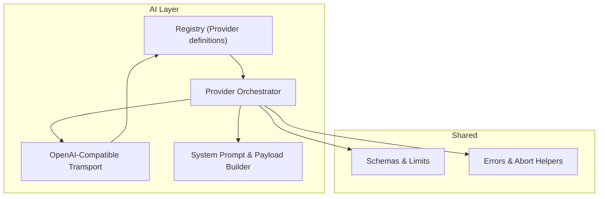
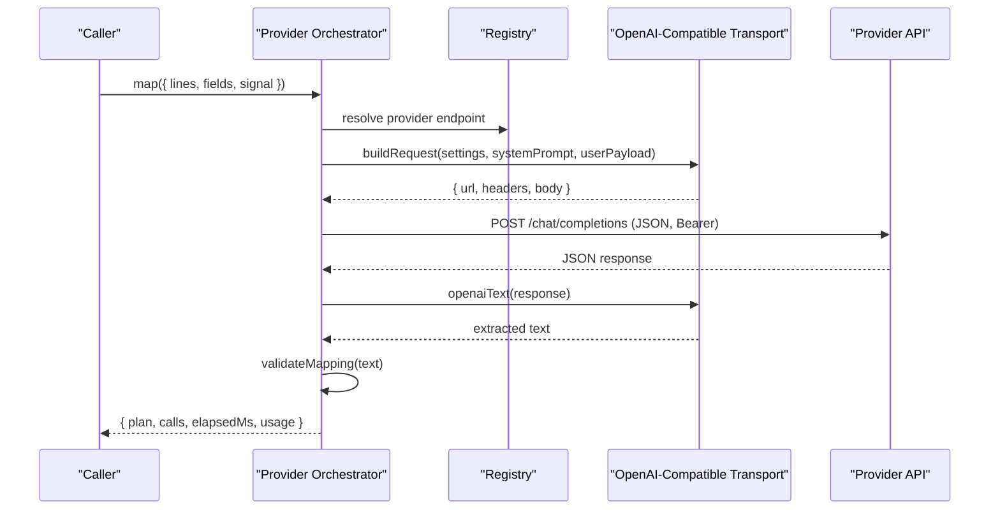
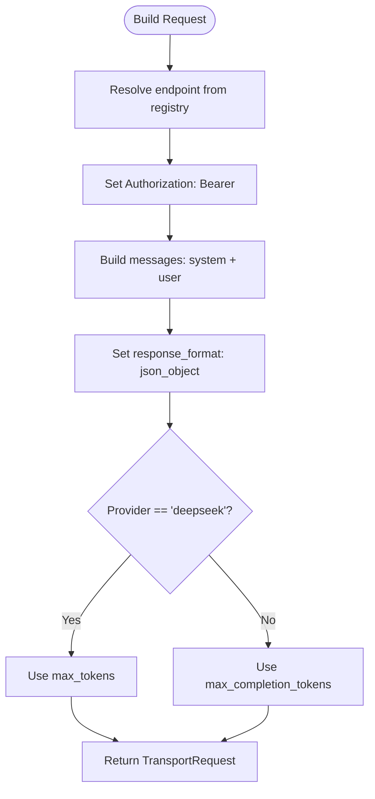
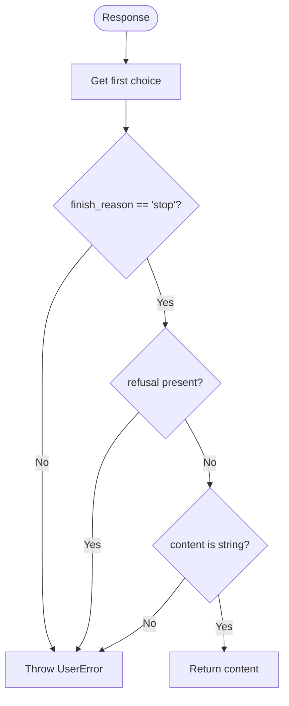
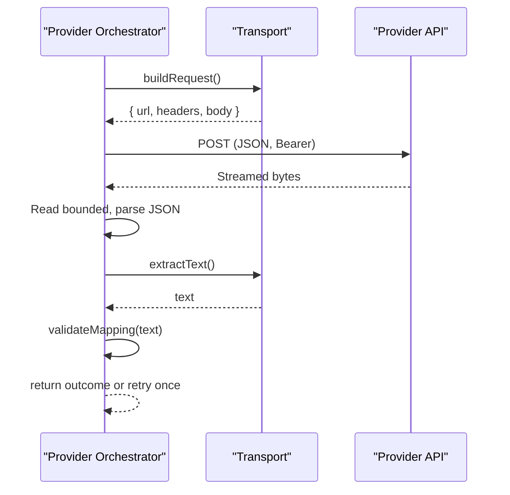
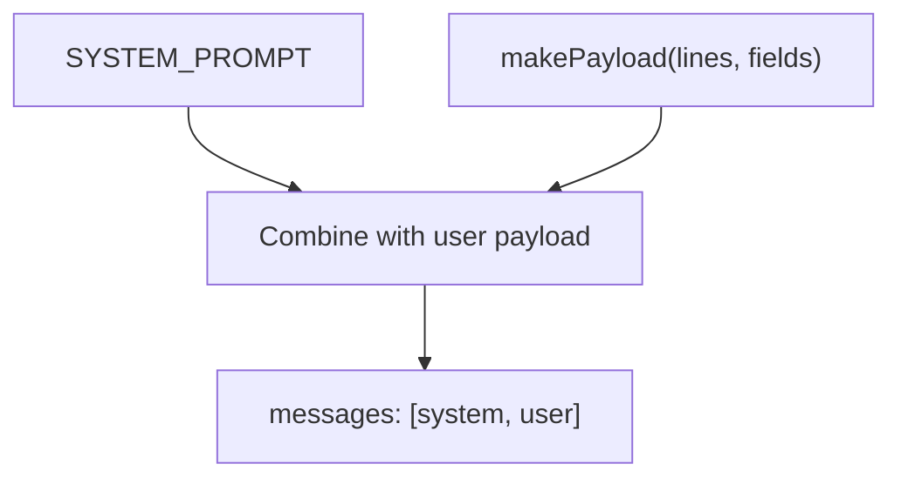
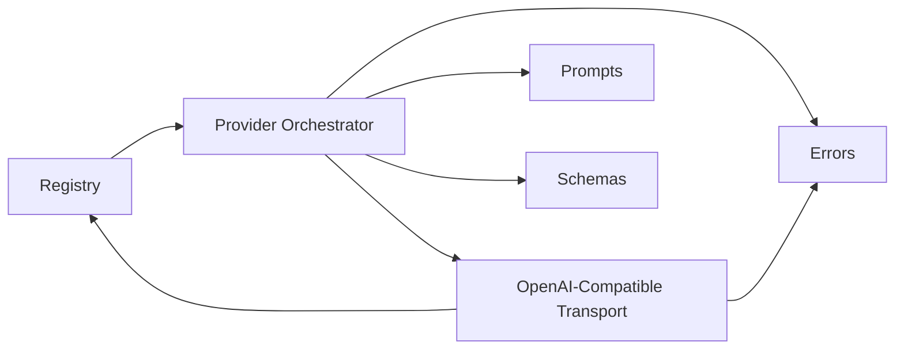

# OpenAI-Compatible Transport

<cite>
**Referenced Files in This Document**
- [openai-compatible.ts](file://src/ai/transports/openai-compatible.ts)
- [provider.ts](file://src/ai/provider.ts)
- [registry.ts](file://src/ai/registry.ts)
- [prompts.ts](file://src/ai/prompts.ts)
- [schemas.ts](file://src/shared/schemas.ts)
- [errors.ts](file://src/shared/errors.ts)
</cite>

## Table of Contents
1. [Introduction](#introduction)
2. [Project Structure](#project-structure)
3. [Core Components](#core-components)
4. [Architecture Overview](#architecture-overview)
5. [Detailed Component Analysis](#detailed-component-analysis)
6. [Dependency Analysis](#dependency-analysis)
7. [Performance Considerations](#performance-considerations)
8. [Troubleshooting Guide](#troubleshooting-guide)
9. [Conclusion](#conclusion)

## Introduction
This document explains the OpenAI-compatible transport used to communicate with OpenAI and compatible providers such as DeepSeek. It covers how requests are formatted, how authentication is set up, how responses are validated and parsed into text, and how configuration differs between providers. It also clarifies the difference between max_tokens and max_completion_tokens usage based on provider type.

## Project Structure
The OpenAI-compatible transport lives under the AI transports layer and integrates with a provider registry and request builder that orchestrates the full mapping workflow.

**Diagram sources**
- [registry.ts:1-13](file://src/ai/registry.ts#L1-L13)
- [provider.ts:1-107](file://src/ai/provider.ts#L1-L107)
- [openai-compatible.ts:1-22](file://src/ai/transports/openai-compatible.ts#L1-L22)
- [prompts.ts:1-26](file://src/ai/prompts.ts#L1-L26)
- [schemas.ts:1-39](file://src/shared/schemas.ts#L1-L39)
- [errors.ts:1-10](file://src/shared/errors.ts#L1-L10)

**Section sources**
- [registry.ts:1-13](file://src/ai/registry.ts#L1-L13)
- [provider.ts:1-107](file://src/ai/provider.ts#L1-L107)
- [openai-compatible.ts:1-22](file://src/ai/transports/openai-compatible.ts#L1-L22)
- [prompts.ts:1-26](file://src/ai/prompts.ts#L1-L26)
- [schemas.ts:1-39](file://src/shared/schemas.ts#L1-L39)
- [errors.ts:1-10](file://src/shared/errors.ts#L1-L10)

## Core Components
- OpenAI-compatible request builder: constructs the HTTP request body and headers for OpenAI-compatible endpoints.
- Text extractor: validates the response structure, checks finish reasons and refusals, and extracts content from the first choice.
- Provider orchestrator: builds the request using the appropriate transport, executes the fetch call, enforces limits and timeouts, parses JSON, and validates the returned mapping.

Key responsibilities:
- Request formatting: system and user messages, model selection, JSON mode, token limit parameterization by provider.
- Authentication: Bearer token via Authorization header.
- Response handling: bounded streaming read, JSON parse, extraction, validation, retry on mapping errors.

**Section sources**
- [openai-compatible.ts:4-21](file://src/ai/transports/openai-compatible.ts#L4-L21)
- [provider.ts:19-105](file://src/ai/provider.ts#L19-L105)
- [registry.ts:1-13](file://src/ai/registry.ts#L1-L13)

## Architecture Overview
The provider orchestrator selects the correct transport based on the configured provider and delegates request building to the transport. For OpenAI-compatible providers, the transport returns a standardized request object that includes URL, headers, and body. The orchestrator performs the network call, enforces response size limits and timeouts, parses JSON, extracts text via the transport’s extractor, and validates the result against the schema.

**Diagram sources**
- [provider.ts:19-105](file://src/ai/provider.ts#L19-L105)
- [openai-compatible.ts:4-21](file://src/ai/transports/openai-compatible.ts#L4-L21)
- [registry.ts:1-13](file://src/ai/registry.ts#L1-L13)

## Detailed Component Analysis

### OpenAI-Compatible Request Builder
- Purpose: Build a standardized request for OpenAI-compatible endpoints.
- Inputs: provider settings (provider id, model, apiKey), system message, user message.
- Behavior:
  - Resolves the endpoint from the registry based on provider.
  - Sets Authorization header with Bearer token from settings.apiKey.
  - Constructs a JSON body with:
    - model: from settings.model
    - messages: array containing a system message followed by a user message
    - response_format: json_object to enforce structured output
    - stream: false
    - Token limit parameter:
      - For deepseek: uses max_tokens
      - For other providers: uses max_completion_tokens
  - Returns a TransportRequest object with url, headers, and body.

**Diagram sources**
- [openai-compatible.ts:4-13](file://src/ai/transports/openai-compatible.ts#L4-L13)
- [registry.ts:1-6](file://src/ai/registry.ts#L1-L6)

**Section sources**
- [openai-compatible.ts:4-13](file://src/ai/transports/openai-compatible.ts#L4-L13)
- [registry.ts:1-6](file://src/ai/registry.ts#L1-L6)

### Text Extraction Function
- Purpose: Validate the provider response and extract usable text for mapping.
- Validation rules:
  - Ensures at least one choice exists.
  - Requires finish_reason to be stop.
  - Rejects if refusal is present.
  - Requires message.content to be a string.
- Output: Returns the content string from the first choice.
- Error behavior: Throws a UserError when validation fails, indicating refusal, truncation, or incompatibility.

**Diagram sources**
- [openai-compatible.ts:14-21](file://src/ai/transports/openai-compatible.ts#L14-L21)

**Section sources**
- [openai-compatible.ts:14-21](file://src/ai/transports/openai-compatible.ts#L14-L21)
- [errors.ts:1-10](file://src/shared/errors.ts#L1-L10)

### Provider Orchestrator Integration
- Builds the request using the selected transport (OpenAI-compatible by default).
- Executes the HTTP POST with JSON content type and Bearer token.
- Enforces response size limit by streaming and canceling if exceeded.
- Parses the response as JSON; throws on invalid JSON.
- Extracts text via the transport-specific extractor.
- Validates the extracted text against the mapping schema; retries once with a repair prompt if validation fails.
- Returns plan, call count, elapsed time, and optional usage numbers.

**Diagram sources**
- [provider.ts:19-105](file://src/ai/provider.ts#L19-L105)
- [openai-compatible.ts:4-21](file://src/ai/transports/openai-compatible.ts#L4-L21)

**Section sources**
- [provider.ts:19-105](file://src/ai/provider.ts#L19-L105)

### System and User Message Construction
- System message: A fixed prompt instructing the model to return only JSON matching the required shape, copy values verbatim, cite evidence, and avoid inference or transformations.
- User message: A JSON payload built from document lines and field descriptors, excluding sensitive or unnecessary fields like current values and page URLs.

**Diagram sources**
- [prompts.ts:4-16](file://src/ai/prompts.ts#L4-L16)
- [prompts.ts:18-25](file://src/ai/prompts.ts#L18-L25)
- [openai-compatible.ts:8-9](file://src/ai/transports/openai-compatible.ts#L8-L9)

**Section sources**
- [prompts.ts:4-16](file://src/ai/prompts.ts#L4-L16)
- [prompts.ts:18-25](file://src/ai/prompts.ts#L18-L25)
- [openai-compatible.ts:8-9](file://src/ai/transports/openai-compatible.ts#L8-L9)

## Dependency Analysis
- Registry provides provider metadata including endpoint URLs and transport routing.
- Provider orchestrator depends on registry to select endpoints and transports.
- OpenAI-compatible transport depends on registry for endpoint resolution and on shared errors for error types.
- Prompts module supplies the system prompt and payload construction used by the orchestrator and transported in the request body.
- Schemas define limits and validation constraints applied during orchestration and post-processing.

**Diagram sources**
- [registry.ts:1-13](file://src/ai/registry.ts#L1-L13)
- [provider.ts:1-107](file://src/ai/provider.ts#L1-L107)
- [openai-compatible.ts:1-22](file://src/ai/transports/openai-compatible.ts#L1-L22)
- [prompts.ts:1-26](file://src/ai/prompts.ts#L1-L26)
- [schemas.ts:1-39](file://src/shared/schemas.ts#L1-L39)
- [errors.ts:1-10](file://src/shared/errors.ts#L1-L10)

**Section sources**
- [registry.ts:1-13](file://src/ai/registry.ts#L1-L13)
- [provider.ts:1-107](file://src/ai/provider.ts#L1-L107)
- [openai-compatible.ts:1-22](file://src/ai/transports/openai-compatible.ts#L1-L22)
- [prompts.ts:1-26](file://src/ai/prompts.ts#L1-L26)
- [schemas.ts:1-39](file://src/shared/schemas.ts#L1-L39)
- [errors.ts:1-10](file://src/shared/errors.ts#L1-L10)

## Performance Considerations
- Streaming response reader enforces a hard limit on response size to prevent memory pressure and long waits.
- Timeout protection aborts requests after a fixed duration to avoid hanging operations.
- JSON mode reduces parsing ambiguity and improves reliability of downstream validation.
- Single retry with a targeted repair prompt can recover from malformed outputs without additional network overhead beyond one extra call.

[No sources needed since this section provides general guidance]

## Troubleshooting Guide
Common issues and strategies:
- Invalid or missing API key: Ensure the provider settings include a non-empty, space-free API key. The orchestrator validates format and length before sending.
- Rate limiting or quota exhaustion: Requests returning 429 indicate rate limits; wait and retry explicitly.
- Unauthorized access: 401/403 responses suggest incorrect keys or insufficient permissions; verify account access and browser policies.
- Model ID mismatch: 400/404 may indicate unsupported models or endpoints; confirm the model ID matches provider capabilities and JSON output support.
- Provider refusal or truncated output: The text extractor rejects refusals and non-stop finish reasons; switch to a supported text model or shorten input documents.
- Network or CORS failures: If the provider is unreachable or blocked by browser policy, ensure network access and host permissions are configured correctly.

**Section sources**
- [provider.ts:15-18](file://src/ai/provider.ts#L15-L18)
- [provider.ts:77-83](file://src/ai/provider.ts#L77-L83)
- [provider.ts:97-104](file://src/ai/provider.ts#L97-L104)
- [openai-compatible.ts:14-21](file://src/ai/transports/openai-compatible.ts#L14-L21)
- [errors.ts:1-10](file://src/shared/errors.ts#L1-L10)

## Conclusion
The OpenAI-compatible transport standardizes communication with OpenAI and compatible services by constructing well-formed requests, enforcing secure authentication, and validating structured JSON responses. The provider orchestrator adds robustness through bounded streaming, timeouts, and validation-driven retries. Configuration varies slightly by provider, notably in the token limit parameter name, ensuring compatibility across different backends while maintaining consistent behavior and error handling.

[No sources needed since this section summarizes without analyzing specific files]

## Appendices

### Configuration Examples

- OpenAI
  - Provider: openai
  - Endpoint: https://api.openai.com/v1/chat/completions
  - Authentication: Authorization header with Bearer token from settings.apiKey
  - Model: Provide a valid text model ID from your OpenAI account
  - Token limit: Uses max_completion_tokens

- DeepSeek
  - Provider: deepseek
  - Endpoint: https://api.deepseek.com/chat/completions
  - Authentication: Authorization header with Bearer token from settings.apiKey
  - Model: Provide a valid text model ID from your DeepSeek account
  - Token limit: Uses max_tokens

Notes:
- Both providers use JSON mode to enforce structured output.
- System and user messages are constructed automatically by the orchestrator and transport.
- The text extractor ensures only safe, complete responses are accepted.

**Section sources**
- [registry.ts:1-6](file://src/ai/registry.ts#L1-L6)
- [openai-compatible.ts:4-13](file://src/ai/transports/openai-compatible.ts#L4-L13)
- [prompts.ts:4-16](file://src/ai/prompts.ts#L4-L16)
- [openai-compatible.ts:14-21](file://src/ai/transports/openai-compatible.ts#L14-L21)