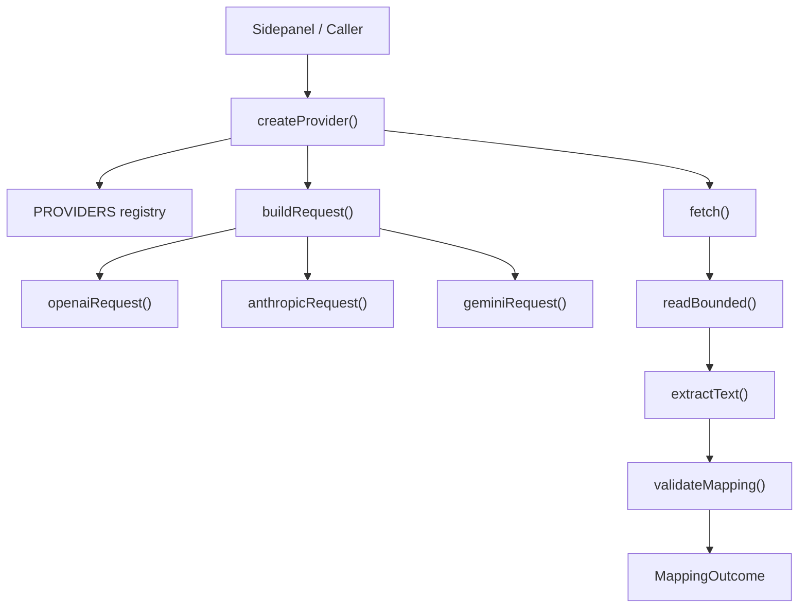
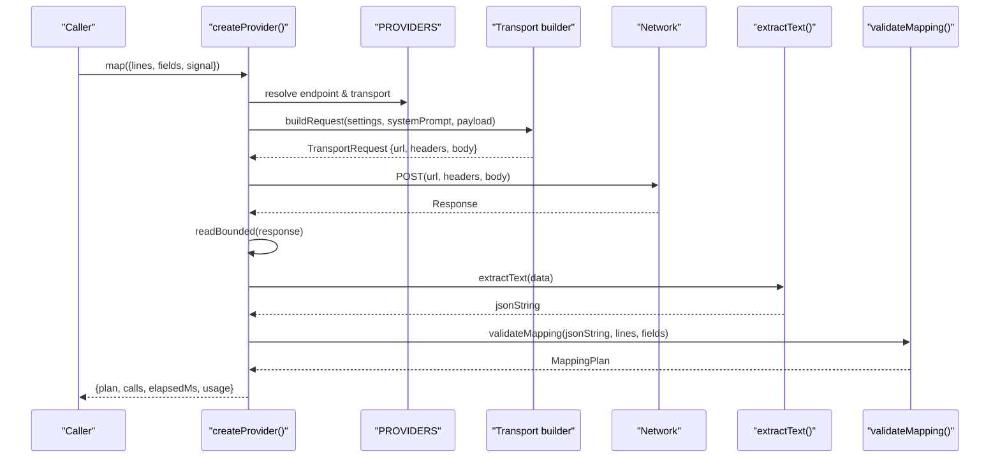
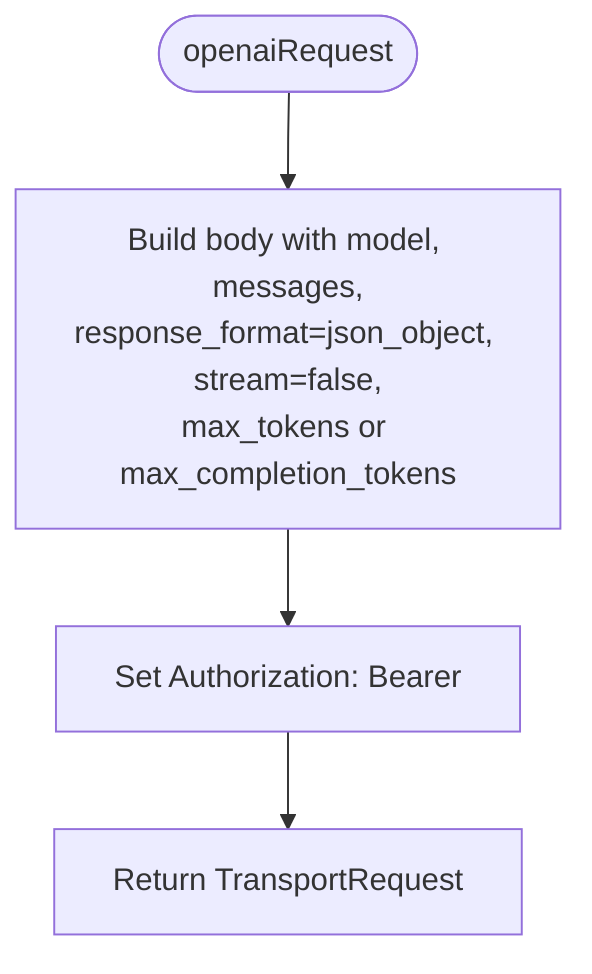
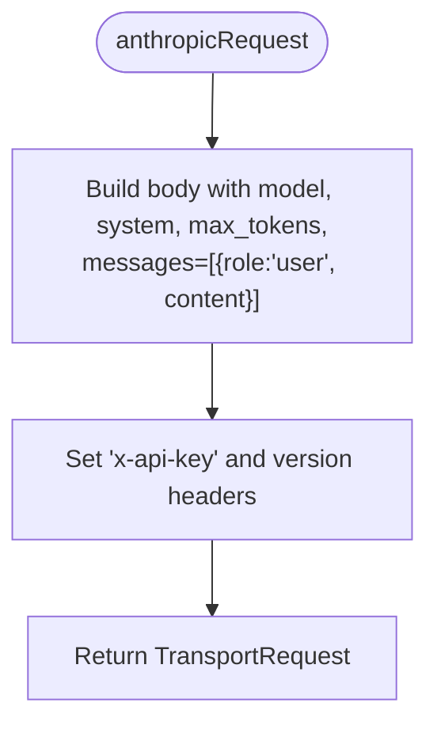
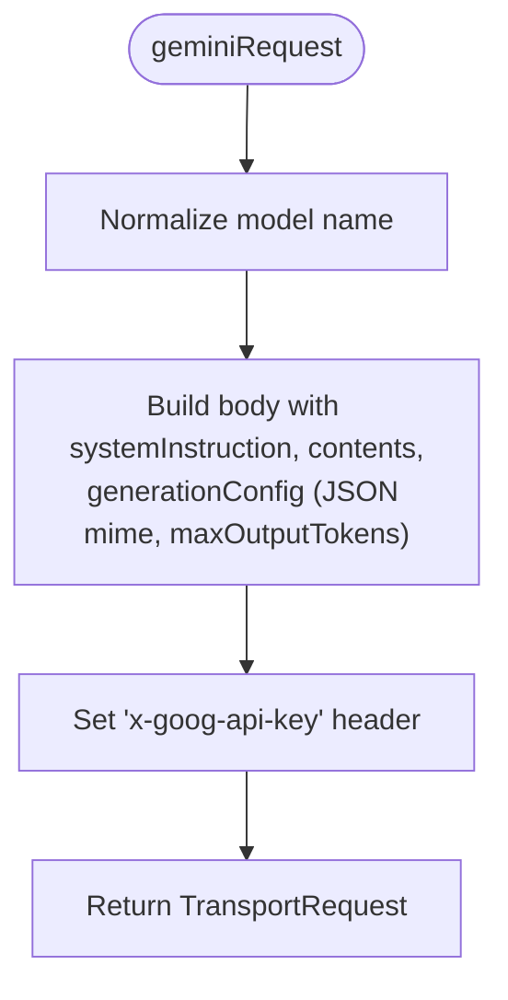
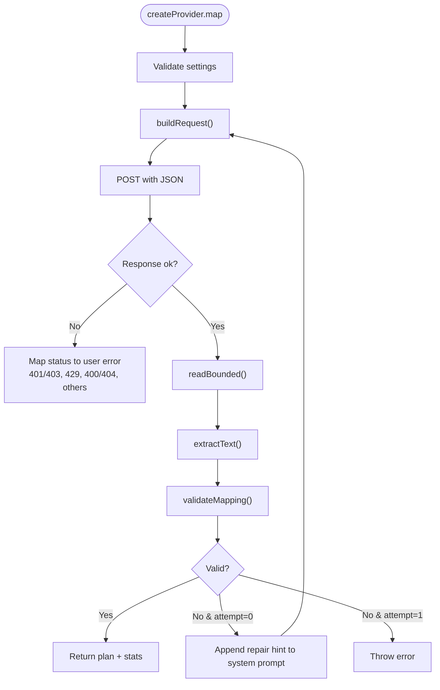
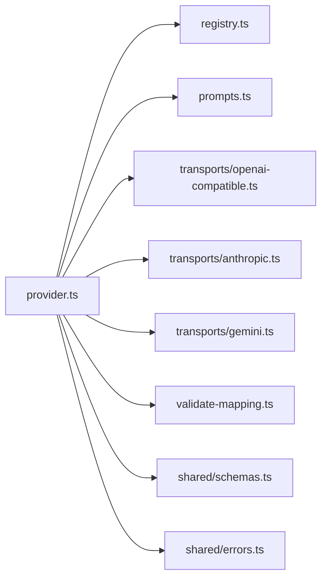

# Transport Implementations

<cite>
**Referenced Files in This Document**
- [openai-compatible.ts](file://src/ai/transports/openai-compatible.ts)
- [anthropic.ts](file://src/ai/transports/anthropic.ts)
- [gemini.ts](file://src/ai/transports/gemini.ts)
- [provider.ts](file://src/ai/provider.ts)
- [registry.ts](file://src/ai/registry.ts)
- [prompts.ts](file://src/ai/prompts.ts)
- [validate-mapping.ts](file://src/ai/validate-mapping.ts)
- [schemas.ts](file://src/shared/schemas.ts)
- [errors.ts](file://src/shared/errors.ts)
</cite>

## Table of Contents
1. [Introduction](#introduction)
2. [Project Structure](#project-structure)
3. [Core Components](#core-components)
4. [Architecture Overview](#architecture-overview)
5. [Detailed Component Analysis](#detailed-component-analysis)
6. [Dependency Analysis](#dependency-analysis)
7. [Performance Considerations](#performance-considerations)
8. [Troubleshooting Guide](#troubleshooting-guide)
9. [Conclusion](#conclusion)
10. [Appendices](#appendices)

## Introduction
This document explains the AI transport implementations that communicate with different AI service providers to propose values for web form fields based on document evidence. It covers:
- OpenAI-compatible transport for standard OpenAI APIs and compatible services (including DeepSeek)
- Anthropic transport for Claude models
- Google Gemini transport for Gemini Pro models

It details request formatting differences, authentication methods, rate limiting handling, response parsing strategies, configuration examples, API key setup, model selection, and text extraction functions that normalize provider responses into a consistent format.

## Project Structure
The AI layer is organized around a provider abstraction that selects a transport based on configured settings, builds a provider-specific request, executes it, parses the response, validates the mapping output, and returns a normalized plan.

**Diagram sources**
- [provider.ts:19-26](file://src/ai/provider.ts#L19-L26)
- [registry.ts:1-6](file://src/ai/registry.ts#L1-L6)
- [openai-compatible.ts:4-13](file://src/ai/transports/openai-compatible.ts#L4-L13)
- [anthropic.ts:3-9](file://src/ai/transports/anthropic.ts#L3-L9)
- [gemini.ts:3-12](file://src/ai/transports/gemini.ts#L3-L12)
- [provider.ts:34-51](file://src/ai/provider.ts#L34-L51)
- [validate-mapping.ts:7-31](file://src/ai/validate-mapping.ts#L7-L31)

**Section sources**
- [provider.ts:19-26](file://src/ai/provider.ts#L19-L26)
- [registry.ts:1-6](file://src/ai/registry.ts#L1-L6)

## Core Components
- Provider orchestration: Validates settings, constructs prompts, dispatches to transports, handles timeouts and aborts, enforces response size limits, parses and validates mapping output, and reports usage.
- Transports: Build provider-specific HTTP requests and parse provider-specific responses into plain text JSON strings.
- Prompting: Supplies a system prompt and payload structure for document lines and field descriptors.
- Validation: Enforces schema constraints, quote presence, value containment, and field coverage.

Key responsibilities:
- Request building per provider
- Authentication header configuration
- Response normalization to a single string containing JSON
- Mapping validation against a strict schema
- Error classification and user-friendly messages

**Section sources**
- [provider.ts:15-105](file://src/ai/provider.ts#L15-L105)
- [prompts.ts:4-25](file://src/ai/prompts.ts#L4-L25)
- [validate-mapping.ts:7-31](file://src/ai/validate-mapping.ts#L7-L31)
- [schemas.ts:1-39](file://src/shared/schemas.ts#L1-L39)

## Architecture Overview
The provider creates a mapping request by combining a system prompt with a compacted payload of document lines and fields. It then delegates to a transport to build a provider-specific request, executes it via fetch, reads bounded response bytes, extracts text using a transport-specific parser, and validates the result.

**Diagram sources**
- [provider.ts:52-105](file://src/ai/provider.ts#L52-L105)
- [registry.ts:1-6](file://src/ai/registry.ts#L1-L6)
- [openai-compatible.ts:4-13](file://src/ai/transports/openai-compatible.ts#L4-L13)
- [anthropic.ts:3-9](file://src/ai/transports/anthropic.ts#L3-L9)
- [gemini.ts:3-12](file://src/ai/transports/gemini.ts#L3-L12)
- [validate-mapping.ts:7-31](file://src/ai/validate-mapping.ts#L7-L31)

## Detailed Component Analysis

### OpenAI-Compatible Transport
- Purpose: Supports OpenAI’s chat completions and compatible endpoints (e.g., DeepSeek).
- Request formatting:
  - Endpoint from registry
  - Authorization via Bearer token header
  - Body includes model, messages array with system and user roles, JSON response format flag, streaming disabled, and token limit parameter (provider-specific variant)
- Authentication: Bearer token in Authorization header
- Rate limiting: Handled at provider level; 429 status triggers a user message advising to wait or check quota
- Response parsing:
  - Extracts first choice
  - Requires finish reason stop and no refusal
  - Returns message content as string
- Model selection: Use provider’s supported text model ID; ensure JSON mode support

**Diagram sources**
- [openai-compatible.ts:4-13](file://src/ai/transports/openai-compatible.ts#L4-L13)

**Section sources**
- [openai-compatible.ts:4-21](file://src/ai/transports/openai-compatible.ts#L4-L21)
- [registry.ts:1-6](file://src/ai/registry.ts#L1-L6)
- [provider.ts:19-26](file://src/ai/provider.ts#L19-L26)

### Anthropic Transport
- Purpose: Communicates with Anthropic’s messages API for Claude models.
- Request formatting:
  - Endpoint from registry
  - Headers include x-api-key, anthropic-version, and browser access flag
  - Body includes model, system prompt, max tokens, messages array with user role, streaming disabled
- Authentication: x-api-key header
- Rate limiting: Handled at provider level; 429 status triggers a user message advising to wait or check quota
- Response parsing:
  - Requires end_turn stop reason
  - Content must be an array of text blocks
  - Concatenates all text blocks into one string

**Diagram sources**
- [anthropic.ts:3-9](file://src/ai/transports/anthropic.ts#L3-L9)

**Section sources**
- [anthropic.ts:3-16](file://src/ai/transports/anthropic.ts#L3-L16)
- [registry.ts:1-6](file://src/ai/registry.ts#L1-L6)
- [provider.ts:19-26](file://src/ai/provider.ts#L19-L26)

### Google Gemini Transport
- Purpose: Communicates with Gemini Pro models via the generative language API.
- Request formatting:
  - Endpoint constructed by appending model path to base endpoint
  - Header uses x-goog-api-key
  - Body includes systemInstruction parts, contents with user role and text parts, generationConfig specifying JSON mime type and max output tokens
- Authentication: x-goog-api-key header
- Rate limiting: Handled at provider level; 429 status triggers a user message advising to wait or check quota
- Response parsing:
  - Requires STOP finish reason
  - Ensures candidate has parts array
  - Filters out “thought” parts and concatenates remaining text

**Diagram sources**
- [gemini.ts:3-12](file://src/ai/transports/gemini.ts#L3-L12)

**Section sources**
- [gemini.ts:3-20](file://src/ai/transports/gemini.ts#L3-L20)
- [registry.ts:1-6](file://src/ai/registry.ts#L1-L6)
- [provider.ts:19-26](file://src/ai/provider.ts#L19-L26)

### Provider Orchestration and Text Extraction
- Settings validation: Ensures model ID format and API key validity
- Request routing: Chooses transport based on provider setting
- Network execution: POST with JSON content type, omits credentials/cache/referrer, abortable via AbortController
- Response reading: Streams response body with a hard byte limit; cancels and errors if exceeded; decodes and parses JSON
- Text extraction: Delegates to transport-specific extractor to get a JSON string
- Mapping validation: Parses JSON, validates against schema, checks quotes exist in cited lines, ensures every field is addressed, and enforces length constraints
- Retry strategy: On mapping validation failure, retries once with a repair hint appended to the system prompt
- Usage reporting: Extracts numeric usage fields from response metadata when present

**Diagram sources**
- [provider.ts:15-105](file://src/ai/provider.ts#L15-L105)
- [validate-mapping.ts:7-31](file://src/ai/validate-mapping.ts#L7-L31)

**Section sources**
- [provider.ts:15-105](file://src/ai/provider.ts#L15-L105)
- [validate-mapping.ts:7-31](file://src/ai/validate-mapping.ts#L7-L31)
- [schemas.ts:1-39](file://src/shared/schemas.ts#L1-L39)

## Dependency Analysis
- provider.ts depends on:
  - registry.ts for provider endpoints and transport selection
  - prompts.ts for system prompt and payload construction
  - transports/* for request builders and response parsers
  - validate-mapping.ts for output validation
  - shared/schemas.ts for limits and types
  - shared/errors.ts for error utilities
- Transports depend on:
  - registry.ts for endpoints
  - shared/errors.ts for throwing user-facing errors

**Diagram sources**
- [provider.ts:1-10](file://src/ai/provider.ts#L1-L10)
- [registry.ts:1-6](file://src/ai/registry.ts#L1-L6)
- [prompts.ts:1-25](file://src/ai/prompts.ts#L1-L25)
- [openai-compatible.ts:1-21](file://src/ai/transports/openai-compatible.ts#L1-L21)
- [anthropic.ts:1-16](file://src/ai/transports/anthropic.ts#L1-L16)
- [gemini.ts:1-20](file://src/ai/transports/gemini.ts#L1-L20)
- [validate-mapping.ts:1-31](file://src/ai/validate-mapping.ts#L1-L31)
- [schemas.ts:1-39](file://src/shared/schemas.ts#L1-L39)
- [errors.ts:1-10](file://src/shared/errors.ts#L1-L10)

**Section sources**
- [provider.ts:1-10](file://src/ai/provider.ts#L1-L10)
- [registry.ts:1-6](file://src/ai/registry.ts#L1-L6)

## Performance Considerations
- Response size cap: Reads response body with a hard byte limit to prevent memory issues; cancels stream and throws if exceeded
- Timeout protection: Each request is aborted after 60 seconds to avoid hanging operations
- Streaming disabled: All transports set stream false to simplify parsing and reduce complexity
- Payload minimization: Fields are compacted before sending to reduce payload size
- Retry only on validation failure: Avoids unnecessary network calls; repair hint guides the model to correct its output

[No sources needed since this section provides general guidance]

## Troubleshooting Guide
Common issues and resolutions:
- Invalid model or API key:
  - Ensure model ID matches provider-supported text models
  - Verify API key has no spaces and meets length requirements
- Provider refused or truncated response:
  - Shorten the document or choose a model with larger context/token limits
  - For OpenAI-compatible, ensure JSON mode is supported
  - For Anthropic, ensure content blocks are text-only
  - For Gemini, ensure generationConfig sets JSON mime type
- Rate limiting or quota reached:
  - Wait and retry later; check provider account quotas
- Network or CORS issues:
  - Confirm origin permissions for the provider host
  - Ensure browser allows cross-origin requests to the provider endpoint
- Mapping validation failures:
  - The system will retry once with a repair hint; if still failing, review field definitions and document clarity
  - Ensure quoted evidence exists in the cited lines and proposed values are substrings of evidence

Error messaging and categories:
- 401/403: Check API key, account access, and browser-access policy
- 429: Rate limit or quota reached; wait or check provider account
- 400/404: Check model ID and JSON output support
- Other errors: Provider unavailable; retry explicitly later

**Section sources**
- [provider.ts:77-83](file://src/ai/provider.ts#L77-L83)
- [provider.ts:95-104](file://src/ai/provider.ts#L95-L104)
- [openai-compatible.ts:14-21](file://src/ai/transports/openai-compatible.ts#L14-L21)
- [anthropic.ts:10-16](file://src/ai/transports/anthropic.ts#L10-L16)
- [gemini.ts:13-20](file://src/ai/transports/gemini.ts#L13-L20)
- [validate-mapping.ts:7-31](file://src/ai/validate-mapping.ts#L7-L31)
- [errors.ts:1-10](file://src/shared/errors.ts#L1-L10)

## Conclusion
The transport layer abstracts provider-specific differences behind a unified interface. Each transport formats requests and parses responses according to provider conventions while the provider orchestrator enforces safety limits, timeouts, and validation. This design enables consistent behavior across OpenAI-compatible, Anthropic, and Gemini providers, with clear error paths and robust response normalization.

[No sources needed since this section summarizes without analyzing specific files]

## Appendices

### Configuration Examples and Setup

- OpenAI-compatible (OpenAI or DeepSeek):
  - Provider: openai or deepseek
  - Endpoint: From registry
  - Authentication: Authorization header with Bearer token
  - Model: A text model supporting JSON responses
  - Example settings shape:
    - provider: "openai" | "deepseek"
    - model: "<model-id>"
    - apiKey: "<api-key>"

- Anthropic:
  - Provider: anthropic
  - Endpoint: From registry
  - Authentication: x-api-key header
  - Model: A Claude model supporting text responses
  - Example settings shape:
    - provider: "anthropic"
    - model: "<model-id>"
    - apiKey: "<api-key>"

- Google Gemini:
  - Provider: gemini
  - Endpoint: From registry with model path
  - Authentication: x-goog-api-key header
  - Model: A Gemini Pro model with JSON output support
  - Example settings shape:
    - provider: "gemini"
    - model: "<model-id>"
    - apiKey: "<api-key>"

Model selection tips:
- Choose models known to support JSON output for reliable mapping
- Prefer models with sufficient token capacity for large documents
- If encountering truncation, shorten input or select a larger-context model

API key setup:
- Ensure keys are valid and have necessary permissions
- For Anthropic, confirm browser direct access is allowed
- For Gemini, ensure API key is enabled for generative language API

Rate limiting:
- Respect provider quotas; implement user-visible delays or backoff if needed
- Monitor usage metrics returned by providers when available

**Section sources**
- [registry.ts:1-6](file://src/ai/registry.ts#L1-L6)
- [openai-compatible.ts:4-13](file://src/ai/transports/openai-compatible.ts#L4-L13)
- [anthropic.ts:3-9](file://src/ai/transports/anthropic.ts#L3-L9)
- [gemini.ts:3-12](file://src/ai/transports/gemini.ts#L3-L12)
- [provider.ts:15-18](file://src/ai/provider.ts#L15-L18)

### Text Extraction Functions Summary
- OpenAI-compatible:
  - Extracts first choice, requires stop finish reason and no refusal, returns message content
- Anthropic:
  - Requires end_turn stop reason and text-only content blocks, concatenates texts
- Gemini:
  - Requires STOP finish reason and parts array, filters thought parts, concatenates texts

These functions ensure a consistent JSON string is passed to the mapping validator regardless of provider.

**Section sources**
- [openai-compatible.ts:14-21](file://src/ai/transports/openai-compatible.ts#L14-L21)
- [anthropic.ts:10-16](file://src/ai/transports/anthropic.ts#L10-L16)
- [gemini.ts:13-20](file://src/ai/transports/gemini.ts#L13-L20)