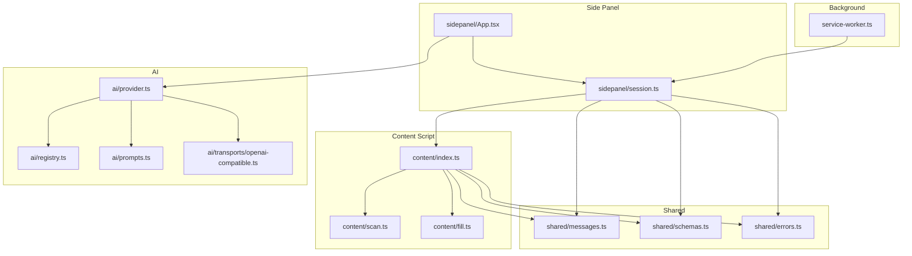
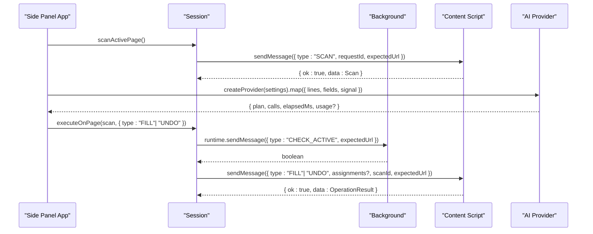
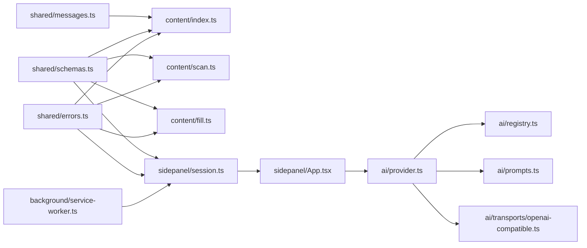

# API Reference

<cite>
**Referenced Files in This Document**
- [messages.ts](file://src/shared/messages.ts)
- [schemas.ts](file://src/shared/schemas.ts)
- [errors.ts](file://src/shared/errors.ts)
- [service-worker.ts](file://src/background/service-worker.ts)
- [index.ts](file://src/content/index.ts)
- [scan.ts](file://src/content/scan.ts)
- [fill.ts](file://src/content/fill.ts)
- [session.ts](file://src/sidepanel/session.ts)
- [App.tsx](file://src/sidepanel/App.tsx)
- [provider.ts](file://src/ai/provider.ts)
- [registry.ts](file://src/ai/registry.ts)
- [prompts.ts](file://src/ai/prompts.ts)
- [openai-compatible.ts](file://src/ai/transports/openai-compatible.ts)
- [types.ts](file://src/parsers/types.ts)
</cite>

## Table of Contents
1. [Introduction](#introduction)
2. [Project Structure](#project-structure)
3. [Core Components](#core-components)
4. [Architecture Overview](#architecture-overview)
5. [Detailed Component Analysis](#detailed-component-analysis)
6. [Dependency Analysis](#dependency-analysis)
7. [Performance Considerations](#performance-considerations)
8. [Troubleshooting Guide](#troubleshooting-guide)
9. [Conclusion](#conclusion)
10. [Appendices](#appendices)

## Introduction
This document provides a comprehensive API reference for the Help Me Fill extension. It covers:
- The Chrome Extension messaging protocol between contexts (background, content script, side panel).
- Message types, payload schemas, and response formats.
- Internal APIs exposed by modules (content scanning, filling, undo, session management).
- AI provider interfaces enabling pluggable AI services.
- Type definitions, validation schemas, and error handling patterns.
- Code examples demonstrating proper usage and integration patterns.

The goal is to enable developers to extend or integrate with the extension safely and correctly.

## Project Structure
The extension is organized into distinct contexts and modules:
- Background service worker: initializes storage access levels and handles active tab checks.
- Content scripts: scan forms, execute fills, and manage undo history on the page.
- Side panel: orchestrates parsing, scanning, mapping, review, and execution flows.
- Shared schemas and messages: define typed payloads and validation rules.
- AI providers: abstract interface and transport implementations for external LLMs.

**Diagram sources**
- [service-worker.ts:1-29](file://src/background/service-worker.ts#L1-L29)
- [index.ts:1-72](file://src/content/index.ts#L1-L72)
- [scan.ts:1-88](file://src/content/scan.ts#L1-L88)
- [fill.ts:1-82](file://src/content/fill.ts#L1-L82)
- [session.ts:1-86](file://src/sidepanel/session.ts#L1-L86)
- [App.tsx:1-127](file://src/sidepanel/App.tsx#L1-L127)
- [messages.ts:1-20](file://src/shared/messages.ts#L1-L20)
- [schemas.ts:1-39](file://src/shared/schemas.ts#L1-L39)
- [errors.ts:1-10](file://src/shared/errors.ts#L1-L10)
- [provider.ts:1-107](file://src/ai/provider.ts#L1-L107)
- [registry.ts:1-13](file://src/ai/registry.ts#L1-L13)
- [prompts.ts:1-26](file://src/ai/prompts.ts#L1-L26)
- [openai-compatible.ts:1-22](file://src/ai/transports/openai-compatible.ts#L1-L22)

**Section sources**
- [service-worker.ts:1-29](file://src/background/service-worker.ts#L1-L29)
- [index.ts:1-72](file://src/content/index.ts#L1-L72)
- [session.ts:1-86](file://src/sidepanel/session.ts#L1-L86)
- [App.tsx:1-127](file://src/sidepanel/App.tsx#L1-L127)

## Core Components
- Messaging layer: Typed message schemas and reply envelopes ensure safe cross-context communication.
- Scanning: Captures supported form fields with metadata and exclusions.
- Filling: Validates and writes values to native controls with verification and undo support.
- Session orchestration: Manages phases, state transitions, and lifecycle events in the side panel.
- AI provider abstraction: Pluggable transports for OpenAI-compatible, Anthropic, and Gemini endpoints.

Key responsibilities:
- Validate all inputs using Zod schemas before processing.
- Enforce safety limits and abort signals throughout long-running operations.
- Provide consistent error messages via a shared error utility.

**Section sources**
- [messages.ts:1-20](file://src/shared/messages.ts#L1-L20)
- [schemas.ts:1-39](file://src/shared/schemas.ts#L1-L39)
- [errors.ts:1-10](file://src/shared/errors.ts#L1-L10)
- [scan.ts:1-88](file://src/content/scan.ts#L1-L88)
- [fill.ts:1-82](file://src/content/fill.ts#L1-L82)
- [session.ts:1-86](file://src/sidepanel/session.ts#L1-L86)
- [provider.ts:1-107](file://src/ai/provider.ts#L1-L107)

## Architecture Overview
The extension uses a three-part architecture:
- Background: minimal setup and active-tab authorization checks.
- Content: executes scanning and field manipulation on the target page.
- Side panel: drives the workflow, communicates with content and AI providers, and manages UI state.

**Diagram sources**
- [session.ts:44-86](file://src/sidepanel/session.ts#L44-L86)
- [service-worker.ts:17-29](file://src/background/service-worker.ts#L17-L29)
- [index.ts:22-69](file://src/content/index.ts#L22-L69)
- [provider.ts:52-105](file://src/ai/provider.ts#L52-L105)
- [App.tsx:69-95](file://src/sidepanel/App.tsx#L69-L95)

## Detailed Component Analysis

### Messaging Protocol
- Message envelope: All messages are validated against a discriminated union schema that includes a UUID-based requestId and a type discriminator.
- Supported message types:
  - SCAN: Initiates a form scan on the content script. Payload includes requestId and expectedUrl.
  - FILL: Executes field assignments. Payload includes requestId, scanId, expectedUrl, and an array of WriteAssignment entries.
  - UNDO: Restores previous values. Payload includes requestId, scanId, expectedUrl.
  - CLEAR: Cancels ongoing work and resets internal state. Payload includes requestId.
  - CANCEL: Signals cancellation to the content script. Payload includes requestId.
- Reply format: A uniform envelope { ok: true; data: T } | { ok: false; error: string } is used for all responses.

Validation and constraints:
- Field IDs must be non-empty strings up to a maximum length.
- Values and evidence are bounded by global limits defined in schemas.
- Assignments arrays are bounded by a maximum number of fields.

Error handling:
- Invalid messages return a structured error envelope.
- User-facing errors are normalized via a shared error utility.

Usage example (conceptual):
- To scan a page, send a SCAN message with a unique requestId and the current URL.
- To fill fields, collect assignments from the review step and send a FILL message with the same requestId pattern.
- To undo, send an UNDO message referencing the original scanId and expectedUrl.

**Section sources**
- [messages.ts:1-20](file://src/shared/messages.ts#L1-L20)
- [schemas.ts:1-39](file://src/shared/schemas.ts#L1-L39)
- [errors.ts:1-10](file://src/shared/errors.ts#L1-L10)
- [index.ts:22-69](file://src/content/index.ts#L22-L69)

### Content Script API
Responsibilities:
- Manage lifecycle and state for scanning and filling.
- Validate incoming messages and enforce security checks.
- Execute scans and fills while guarding against page changes and cancellations.

Key functions and behaviors:
- Registry creation: scanPage returns a registry containing a scan descriptor and a map of registered fields.
- Execution guard: Provides authorize and canceled checks to ensure the operation remains valid during execution.
- Undo tracking: Maintains a list of undo entries to support restoration of previous values.

Important validations:
- Page identity checks ensure the expected URL matches the current location.
- Registry assertions validate that the DOM has not changed since scanning.
- Control value validation enforces browser-native constraints before writing.

Return values:
- SCAN returns a scan descriptor with fields and exclusions.
- FILL returns an operation result with per-field status and a canUndo flag.
- UNDO returns an operation result indicating completion and no further undo availability.

Error conditions:
- Mismatched URLs or scanIds trigger user errors requiring re-scan.
- Changes to the form structure invalidate the current registry.
- Cancellations propagate through AbortSignal checks.

**Section sources**
- [index.ts:1-72](file://src/content/index.ts#L1-L72)
- [scan.ts:1-88](file://src/content/scan.ts#L1-L88)
- [fill.ts:1-82](file://src/content/fill.ts#L1-L82)

### Side Panel Session API
Responsibilities:
- Orchestrate the end-to-end workflow: parsing, scanning, mapping, review, filling, and undoing.
- Communicate with background and content scripts to perform actions safely.
- Maintain phase-based state and provide progress updates.

Key functions:
- scanActivePage: Injects the content script, validates permissions, sends a SCAN message, and returns a bound scan including target information.
- executeOnPage: Establishes a port connection to the content script, waits for readiness, and sends FILL or UNDO messages.
- assertActive: Ensures the target tab and URL have not changed before executing actions.

State machine:
- Phases include idle, parsing, scanning, ready, mapping, review, filling, complete, and undoing.
- Reducer handles actions like START, PROGRESS, DOCUMENT, SCAN, PLAN, ROW, SELECT_ALL, RESULT, ERROR, INVALIDATE, PROVIDER_CHANGED.

Error handling:
- Network or permission issues raise user errors with actionable messages.
- Tab changes or page navigation invalidate the session and prompt re-scanning.

**Section sources**
- [session.ts:1-86](file://src/sidepanel/session.ts#L1-L86)
- [App.tsx:1-127](file://src/sidepanel/App.tsx#L1-L127)

### Background Service Worker API
Responsibilities:
- Configure storage access levels for trusted contexts.
- Handle toolbar action clicks to open the side panel.
- Validate active tab context for sensitive operations.

Key behavior:
- CHECK_ACTIVE message handler verifies that the sender is from the extension, belongs to the expected frame, and matches the expected URL and active tab.

Error handling:
- If validation fails, responds with false to indicate the operation should not proceed.

**Section sources**
- [service-worker.ts:1-29](file://src/background/service-worker.ts#L1-L29)

### AI Provider Interface
Interface definition:
- AIProvider.map(request): Accepts a MappingRequest containing document lines, field descriptors, and an AbortSignal. Returns a Promise<MappingOutcome> with a validated plan, call count, elapsed time, and optional usage metrics.

Implementation details:
- buildRequest constructs a TransportRequest based on the selected provider’s transport type.
- extractText parses provider-specific responses into a single text payload.
- readBounded enforces response size limits and ensures JSON parseability.
- validateSettings validates model IDs and API keys.
- createProvider returns an AIProvider instance configured with settings and a fetcher.

Supported transports:
- OpenAI-compatible: Uses chat completions endpoint with JSON output mode.
- Anthropic: Uses messages endpoint with custom text extraction.
- Gemini: Uses generative language endpoint with custom text extraction.

Error handling:
- HTTP errors are mapped to user-friendly messages based on status codes.
- Timeouts and network failures produce clear errors prompting explicit retries.
- Validation failures may trigger a single retry with diagnostic feedback.

**Section sources**
- [provider.ts:1-107](file://src/ai/provider.ts#L1-L107)
- [registry.ts:1-13](file://src/ai/registry.ts#L1-L13)
- [prompts.ts:1-26](file://src/ai/prompts.ts#L1-L26)
- [openai-compatible.ts:1-22](file://src/ai/transports/openai-compatible.ts#L1-L22)

### Data Models and Validation Schemas
Field descriptors:
- Include id, type, label, ariaLabel, placeholder, name, context, required, maxLength, and pattern.
- Local fields add currentValue for pre-fill awareness.

Mapping plan:
- Assignments contain fieldId, value, evidence (lineId and quote), and reason.
- Unmapped entries explain why a field could not be safely filled.

Scan descriptor:
- Includes scanId, url, fields array, and exclusions map.

Operation result:
- Array of FillResult entries with fieldId, status, and detail.
- canUndo indicates whether undo is available.

Limits:
- Global constants cap bytes, pages, characters, fields, response size, and value lengths to ensure safety and performance.

**Section sources**
- [schemas.ts:1-39](file://src/shared/schemas.ts#L1-L39)
- [types.ts:1-3](file://src/parsers/types.ts#L1-L3)

### Error Handling Patterns
- UserError: A specific error class for user-actionable failures.
- errorMessage: Normalizes errors into user-friendly strings, handling AbortError specially.
- throwIfAborted: Throws an AbortError when an AbortSignal is aborted.
- Consistent use across content, side panel, and AI provider layers ensures predictable UX.

**Section sources**
- [errors.ts:1-10](file://src/shared/errors.ts#L1-L10)

## Dependency Analysis
The following diagram shows key dependencies between modules:

**Diagram sources**
- [messages.ts:1-20](file://src/shared/messages.ts#L1-L20)
- [schemas.ts:1-39](file://src/shared/schemas.ts#L1-L39)
- [errors.ts:1-10](file://src/shared/errors.ts#L1-L10)
- [index.ts:1-72](file://src/content/index.ts#L1-L72)
- [scan.ts:1-88](file://src/content/scan.ts#L1-L88)
- [fill.ts:1-82](file://src/content/fill.ts#L1-L82)
- [session.ts:1-86](file://src/sidepanel/session.ts#L1-L86)
- [App.tsx:1-127](file://src/sidepanel/App.tsx#L1-L127)
- [provider.ts:1-107](file://src/ai/provider.ts#L1-L107)
- [registry.ts:1-13](file://src/ai/registry.ts#L1-L13)
- [prompts.ts:1-26](file://src/ai/prompts.ts#L1-L26)
- [openai-compatible.ts:1-22](file://src/ai/transports/openai-compatible.ts#L1-L22)
- [service-worker.ts:1-29](file://src/background/service-worker.ts#L1-L29)

**Section sources**
- [index.ts:1-72](file://src/content/index.ts#L1-L72)
- [session.ts:1-86](file://src/sidepanel/session.ts#L1-L86)
- [provider.ts:1-107](file://src/ai/provider.ts#L1-L107)

## Performance Considerations
- Response size limits: AI provider responses are bounded to prevent memory pressure.
- Field and character limits: Prevent excessive payloads to AI services and keep scanning efficient.
- Verification delays: Filling includes short delays to allow DOM updates and event propagation to settle.
- Abort signals: Long-running tasks respect cancellation to avoid wasted work.

[No sources needed since this section provides general guidance]

## Troubleshooting Guide
Common issues and resolutions:
- Invalid message: Ensure all messages conform to the discriminated union schema and include required fields.
- Page changed: Re-scan after navigating or switching tabs; the registry asserts URL and scanId consistency.
- Missing permissions: Enable provider host permissions before generating mappings.
- Active tab mismatch: Use the background CHECK_ACTIVE flow to verify the intended tab before filling.
- Provider errors: Check API keys, model IDs, rate limits, and network access; retry explicitly after transient failures.

**Section sources**
- [index.ts:22-69](file://src/content/index.ts#L22-L69)
- [session.ts:44-86](file://src/sidepanel/session.ts#L44-L86)
- [provider.ts:52-105](file://src/ai/provider.ts#L52-L105)
- [service-worker.ts:17-29](file://src/background/service-worker.ts#L17-L29)

## Conclusion
The Help Me Fill extension provides a robust, type-safe API for scanning forms, generating AI-driven mappings, reviewing assignments, and executing fills with undo support. The messaging protocol and shared schemas ensure reliable cross-context communication, while the AI provider abstraction enables flexible integration with multiple LLM backends. Developers can extend functionality by adhering to the defined interfaces, validating inputs, and handling errors consistently.

[No sources needed since this section summarizes without analyzing specific files]

## Appendices

### API Usage Examples

- Scanning a page:
  - From the side panel, call scanActivePage to inject the content script and send a SCAN message.
  - Validate the returned scan descriptor and store the bound scan for later operations.

- Generating a mapping:
  - Create an AI provider with settings and call map with document lines, compacted fields, and an AbortSignal.
  - Display the resulting plan in the review table for user confirmation.

- Executing a fill:
  - Filter selected rows into assignments and call executeOnPage with a FILL message.
  - Handle the OperationResult to show per-field statuses and enable undo if available.

- Undoing fills:
  - Call executeOnPage with an UNDO message referencing the original scanId and expectedUrl.
  - Update UI to reflect completion and disable undo until a new fill occurs.

**Section sources**
- [session.ts:55-86](file://src/sidepanel/session.ts#L55-L86)
- [App.tsx:69-95](file://src/sidepanel/App.tsx#L69-L95)
- [provider.ts:52-105](file://src/ai/provider.ts#L52-L105)