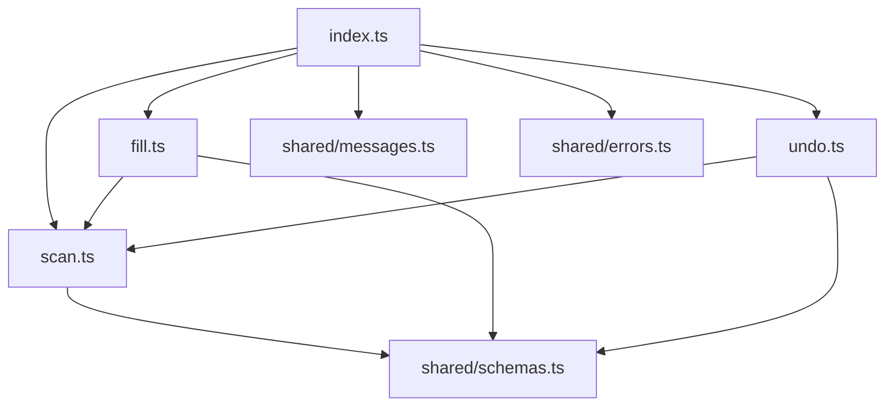
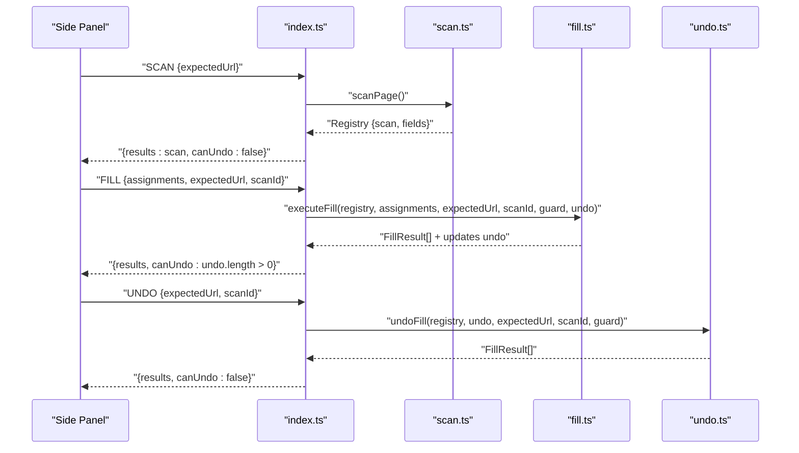
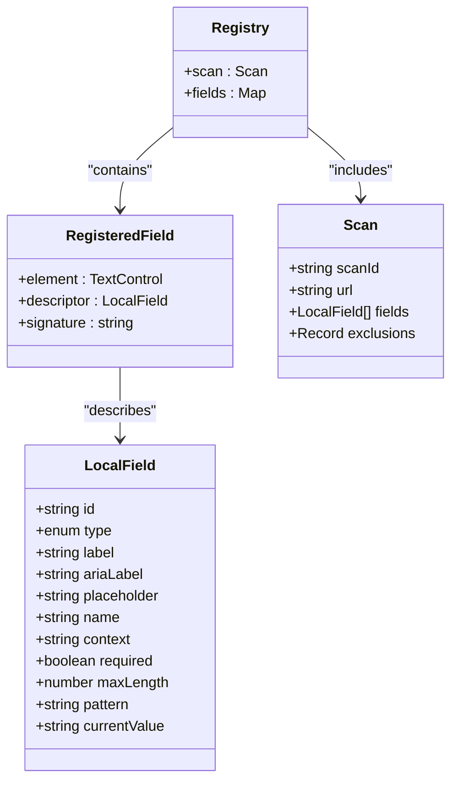
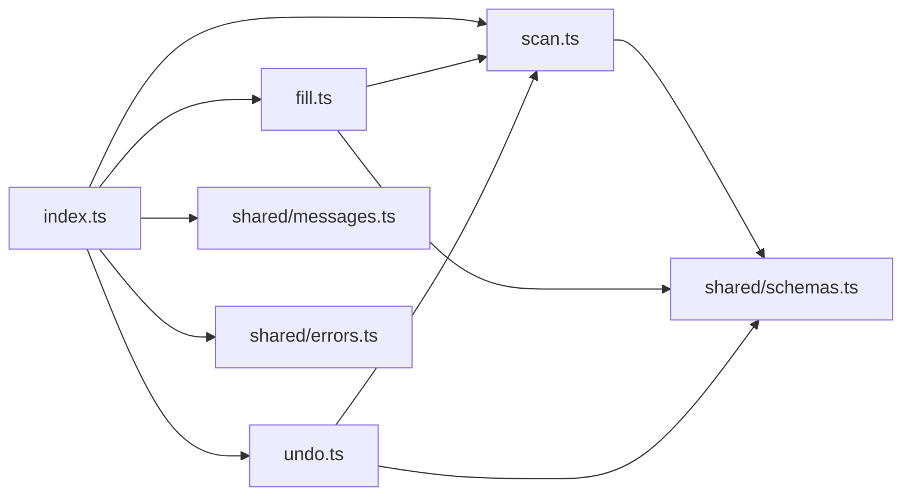

# Content Script APIs

<cite>
**Referenced Files in This Document**
- [index.ts](file://src/content/index.ts)
- [scan.ts](file://src/content/scan.ts)
- [fill.ts](file://src/content/fill.ts)
- [undo.ts](file://src/content/undo.ts)
- [schemas.ts](file://src/shared/schemas.ts)
- [messages.ts](file://src/shared/messages.ts)
- [errors.ts](file://src/shared/errors.ts)
- [filler.test.ts](file://tests/integration/filler.test.ts)
</cite>

## Table of Contents
1. [Introduction](#introduction)
2. [Project Structure](#project-structure)
3. [Core Components](#core-components)
4. [Architecture Overview](#architecture-overview)
5. [Detailed Component Analysis](#detailed-component-analysis)
6. [Dependency Analysis](#dependency-analysis)
7. [Performance Considerations](#performance-considerations)
8. [Troubleshooting Guide](#troubleshooting-guide)
9. [Conclusion](#conclusion)
10. [Appendices](#appendices)

## Introduction
This document describes the internal APIs exposed by the content script modules for form scanning, field filling, and undo operations. It focuses on the public functions scanPage(), describe(), exclusion(), fingerprint(), fillField() (implemented as executeFill()), and undoFill(). It also documents the Registry data structure, RegisteredField type, and LocalField schema, along with error conditions and usage patterns demonstrated through integration tests.

## Project Structure
The content script is organized into focused modules:
- index.ts: Message routing, lifecycle, and state management between side panel and page DOM.
- scan.ts: Scanning, field description, exclusion rules, fingerprinting, and registry creation/validation.
- fill.ts: Safe value writing, validation, verification, and execution flow for filling fields.
- undo.ts: Reversal of previously filled values with safety checks.
- shared schemas and messages: Type-safe contracts for data passed across boundaries.

**Diagram sources**
- [index.ts:1-72](file://src/content/index.ts#L1-L72)
- [scan.ts:1-88](file://src/content/scan.ts#L1-L88)
- [fill.ts:1-82](file://src/content/fill.ts#L1-L82)
- [undo.ts:1-29](file://src/content/undo.ts#L1-L29)
- [schemas.ts:1-39](file://src/shared/schemas.ts#L1-L39)
- [messages.ts:1-20](file://src/shared/messages.ts#L1-L20)
- [errors.ts:1-10](file://src/shared/errors.ts#L1-L10)

**Section sources**
- [index.ts:1-72](file://src/content/index.ts#L1-L72)
- [scan.ts:1-88](file://src/content/scan.ts#L1-L88)
- [fill.ts:1-82](file://src/content/fill.ts#L1-L82)
- [undo.ts:1-29](file://src/content/undo.ts#L1-L29)
- [schemas.ts:1-39](file://src/shared/schemas.ts#L1-L39)
- [messages.ts:1-20](file://src/shared/messages.ts#L1-L20)
- [errors.ts:1-10](file://src/shared/errors.ts#L1-L10)

## Core Components
- Registry: Holds a snapshot of the scanned form and live references to elements.
- RegisteredField: Represents a single discovered control with its descriptor and stable signature.
- LocalField: The normalized field metadata used during scanning and mapping.
- ExecutionGuard: Interface used by fill and undo to check cancellation and tab authorization.
- UndoEntry: Records previous and written values for each filled field to support undo.

Key responsibilities:
- scanPage(): Discover eligible controls, build descriptors, enforce limits, and return a Registry.
- describe(element, id): Build a LocalField from a control’s accessibility and attributes.
- exclusion(element): Determine if a control should be skipped and why.
- fingerprint(element): Create a stable string to detect later DOM changes.
- executeFill(registry, writes, expectedUrl, scanId, guard, undo): Validate and write values safely, returning results and populating undo entries.
- undoFill(registry, entries, expectedUrl, scanId, guard): Restore previous values with safety checks.

**Section sources**
- [scan.ts:4-76](file://src/content/scan.ts#L4-L76)
- [fill.ts:6-82](file://src/content/fill.ts#L6-L82)
- [undo.ts:1-29](file://src/content/undo.ts#L1-L29)
- [schemas.ts:3-39](file://src/shared/schemas.ts#L3-L39)

## Architecture Overview
The content script exposes an internal API surface that is orchestrated by index.ts via runtime messages. The flow is:
- SCAN: Creates a Registry and returns the scan payload to the caller.
- FILL: Validates assignments against the Registry, writes values safely, and returns per-field results plus whether undo is possible.
- UNDO: Restores previous values in reverse order and returns per-field results.

**Diagram sources**
- [index.ts:22-52](file://src/content/index.ts#L22-L52)
- [scan.ts:62-76](file://src/content/scan.ts#L62-L76)
- [fill.ts:42-82](file://src/content/fill.ts#L42-L82)
- [undo.ts:6-29](file://src/content/undo.ts#L6-L29)

## Detailed Component Analysis

### Registry and Data Structures
- Registry
  - Fields: Map from unique field IDs to RegisteredField instances.
  - Scan: Snapshot including scanId, url, fields array (LocalField), and exclusions counts.
- RegisteredField
  - element: The actual TextControl (input or textarea).
  - descriptor: LocalField describing the control.
  - signature: Stable fingerprint used to detect DOM changes.
- LocalField
  - Normalized metadata: id, type, label, ariaLabel, placeholder, name, context, required, maxLength, pattern, currentValue.
  - Enforced by LocalFieldSchema; includes current value and constraints.

**Diagram sources**
- [scan.ts:4-7](file://src/content/scan.ts#L4-L7)
- [schemas.ts:13-30](file://src/shared/schemas.ts#L13-L30)

**Section sources**
- [scan.ts:4-7](file://src/content/scan.ts#L4-L7)
- [schemas.ts:13-30](file://src/shared/schemas.ts#L13-L30)

### scanPage()
Purpose:
- Scans the document for eligible text controls, builds descriptors, enforces safety limits, and returns a Registry.

Signature:
- scanPage(doc?: Document): Registry

Parameters:
- doc: Optional Document to scan; defaults to current document.

Return:
- Registry containing:
  - scan: { scanId, url, fields[], exclusions }
  - fields: Map<fieldId, RegisteredField>

Error conditions:
- Too many controls (>1000): throws UserError.
- More than 60 supported fields: throws UserError without partial results.

Behavior highlights:
- Skips disabled, hidden, readonly, sensitive, authentication/payment-related controls.
- Counts unsupported types (selects, rich text, iframes) in exclusions.

Usage example reference:
- See integration test setup and assertions for typical usage patterns.

**Section sources**
- [scan.ts:62-76](file://src/content/scan.ts#L62-L76)
- [filler.test.ts:22-45](file://tests/integration/filler.test.ts#L22-L45)

### describe(element, id)
Purpose:
- Produces a LocalField descriptor for a given TextControl using labels, aria attributes, placeholders, and context.

Signature:
- describe(element: TextControl, id: string): LocalField

Parameters:
- element: HTMLInputElement or HTMLTextAreaElement.
- id: Unique identifier assigned to the field.

Return:
- LocalField with normalized label, ariaLabel, placeholder, name, context, required, maxLength, pattern, and currentValue.

Notes:
- Label extraction avoids nested control contents to prevent leaking private values into metadata.

**Section sources**
- [scan.ts:32-46](file://src/content/scan.ts#L32-L46)

### exclusion(element)
Purpose:
- Determines whether a control should be excluded from scanning and why.

Signature:
- exclusion(element: TextControl): string | undefined

Parameters:
- element: Target control to evaluate.

Return:
- undefined if eligible; otherwise a reason string such as:
  - Unsupported input type
  - Disabled or read-only
  - Hidden controls
  - Authentication or payment controls
  - Potentially sensitive controls
  - Control exceeds safety limits

Behavior highlights:
- Checks visibility, disabled/read-only states, autocomplete tokens, sensitive keywords, and length/pattern limits.

**Section sources**
- [scan.ts:47-57](file://src/content/scan.ts#L47-L57)

### fingerprint(element)
Purpose:
- Generates a stable JSON string representing a control’s descriptor and identity to detect later DOM mutations.

Signature:
- fingerprint(element: TextControl): string

Parameters:
- element: Target control.

Return:
- Stringified descriptor excluding currentValue, plus domId, autocomplete, and form id.

Usage:
- Used to validate that the form has not changed before filling or undo.

**Section sources**
- [scan.ts:58-61](file://src/content/scan.ts#L58-L61)

### executeFill() (fillField)
Note: The internal function is named executeFill(); it implements the “fill” operation exposed to callers via index.ts.

Purpose:
- Validates assignments, writes values safely to native inputs/textareas, verifies persistence, and records undo information.

Signature:
- executeFill(registry: Registry, writes: WriteAssignment[], expectedUrl: string, scanId: string, guard: ExecutionGuard, undo: UndoEntry[]): Promise<FillResult[]>

Parameters:
- registry: Registry obtained from scanPage().
- writes: Array of WriteAssignment objects specifying fieldId, value, expectedValue, allowOverwrite.
- expectedUrl: URL at time of scan; must match current document URL.
- scanId: UUID of the scan session; must match current registry.
- guard: Object with authorize() and canceled() to ensure safe execution context.
- undo: Mutable array to record previous values for undo.

Return:
- Array of FillResult items with status:
  - filled: Value persisted and valid.
  - skipped: Already contains selected value.
  - changed/reverted: Page changed or rejected the value.
  - failed: Error occurred; subsequent writes are skipped.

Error conditions:
- Unknown or duplicate field ID.
- Field changed since review.
- Overwriting existing value without explicit approval.
- Invalid value (length, minimum, browser normalization, constraint).
- Tab inactive or operation canceled.
- Form changed after focus or during writing.

Verification:
- Uses requestAnimationFrame and short delays to confirm value persistence and validity.

Usage example reference:
- See integration tests for preflight validation, overwrite handling, and failure scenarios.

**Section sources**
- [fill.ts:8-82](file://src/content/fill.ts#L8-L82)
- [filler.test.ts:47-108](file://tests/integration/filler.test.ts#L47-L108)

### undoFill()
Purpose:
- Restores previous values for filled fields in reverse order, preserving user edits when present.

Signature:
- undoFill(registry: Registry, entries: UndoEntry[], expectedUrl: string, scanId: string, guard: ExecutionGuard): Promise<FillResult[]>

Parameters:
- registry: Same Registry used for original scan.
- entries: UndoEntry[] produced by executeFill().
- expectedUrl, scanId: Must match current context.
- guard: Authorization and cancellation checks.

Return:
- Array of FillResult with status:
  - restored: Previous value successfully restored.
  - changed/reverted: Page did not retain previous value.
  - skipped: Subsequent user edit preserved.
  - failed: Error occurred; process stops.

Safety:
- Re-validates registry and element connectivity before restoring.
- Focuses elements and dispatches events to maintain consistency.

**Section sources**
- [undo.ts:6-29](file://src/content/undo.ts#L6-L29)
- [filler.test.ts:109-128](file://tests/integration/filler.test.ts#L109-L128)

### Registry Validation: assertRegistry()
Purpose:
- Ensures the Registry matches the expected URL and scanId, and that no DOM changes have invalidated the scan.

Signature:
- assertRegistry(registry: Registry, expectedUrl: string, scanId: string): void

Error conditions:
- Mismatched scanId or URL.
- Disconnected or modified elements.
- Added or removed eligible fields.

Used by:
- executeFill() and undoFill() to protect against unsafe operations.

**Section sources**
- [scan.ts:77-87](file://src/content/scan.ts#L77-L87)

## Dependency Analysis
- index.ts depends on scan.ts, fill.ts, undo.ts, and shared messages/errors.
- fill.ts depends on scan.ts for Registry and validation helpers.
- undo.ts depends on fill.ts for setNativeValue and verifyValue, and on scan.ts for Registry validation.
- All modules rely on shared schemas for type safety and limits.

**Diagram sources**
- [index.ts:1-72](file://src/content/index.ts#L1-L72)
- [scan.ts:1-88](file://src/content/scan.ts#L1-L88)
- [fill.ts:1-82](file://src/content/fill.ts#L1-L82)
- [undo.ts:1-29](file://src/content/undo.ts#L1-L29)
- [schemas.ts:1-39](file://src/shared/schemas.ts#L1-L39)
- [messages.ts:1-20](file://src/shared/messages.ts#L1-L20)
- [errors.ts:1-10](file://src/shared/errors.ts#L1-L10)

**Section sources**
- [index.ts:1-72](file://src/content/index.ts#L1-L72)
- [scan.ts:1-88](file://src/content/scan.ts#L1-L88)
- [fill.ts:1-82](file://src/content/fill.ts#L1-L82)
- [undo.ts:1-29](file://src/content/undo.ts#L1-L29)
- [schemas.ts:1-39](file://src/shared/schemas.ts#L1-L39)
- [messages.ts:1-20](file://src/shared/messages.ts#L1-L20)
- [errors.ts:1-10](file://src/shared/errors.ts#L1-L10)

## Performance Considerations
- Limits: Maximum 1000 controls scanned; maximum 60 supported fields; value length capped; response size limited.
- Visibility checks: Efficient traversal to skip hidden or inert elements.
- Label extraction: Tree walker bounded by node count and text length to avoid heavy DOM scans.
- Verification: Short async waits and frame scheduling to accommodate controlled components without blocking UI.

[No sources needed since this section provides general guidance]

## Troubleshooting Guide
Common errors and resolutions:
- “Another operation is still running”: Wait for completion or clear the session.
- “The page changed. Scan again”: Ensure expectedUrl matches current location before scanning.
- “Unknown or duplicate field ID”: Verify fieldId exists and is unique in assignments.
- “A field changed since review”: Re-scan and re-review before filling.
- “Overwriting an existing value requires explicit approval”: Set allowOverwrite to true when intentional.
- “Value exceeds the field length limit” / “Value does not satisfy the field type, pattern, or required constraint”: Adjust value or field constraints.
- “The target changed on focus”: Inspect focus handlers that may modify values.
- “The document or route changed. Scan and review again.”: Re-scan when URL or scanId mismatch occurs.
- “The form structure changed. Scan and review again.”: DOM modifications invalidate the scan; re-scan.

Error message mapping:
- UserError messages are surfaced directly; AbortError maps to a cancellation message; other errors map to a generic failure message.

**Section sources**
- [index.ts:22-52](file://src/content/index.ts#L22-L52)
- [fill.ts:42-82](file://src/content/fill.ts#L42-L82)
- [undo.ts:6-29](file://src/content/undo.ts#L6-L29)
- [errors.ts:1-10](file://src/shared/errors.ts#L1-L10)

## Conclusion
The content script provides a robust, safety-first API for scanning forms, mapping fields, and performing reversible fills. The Registry and LocalField structures capture essential metadata while enforcing strict limits and validations. Functions like scanPage(), describe(), exclusion(), fingerprint(), executeFill(), and undoFill() work together to ensure reliable, auditable, and undoable form interactions. Integration tests demonstrate correct usage and edge case handling.

[No sources needed since this section summarizes without analyzing specific files]

## Appendices

### API Usage Examples (References)
- Scanning and asserting behavior:
  - See integration tests for constructing a Registry and validating labels, contexts, and exclusions.
- Filling fields safely:
  - See integration tests for preflight validation, overwrite handling, and result interpretation.
- Undoing fills:
  - See integration tests for restoring previous values and preserving user edits.

**Section sources**
- [filler.test.ts:22-45](file://tests/integration/filler.test.ts#L22-L45)
- [filler.test.ts:47-108](file://tests/integration/filler.test.ts#L47-L108)
- [filler.test.ts:109-128](file://tests/integration/filler.test.ts#L109-L128)