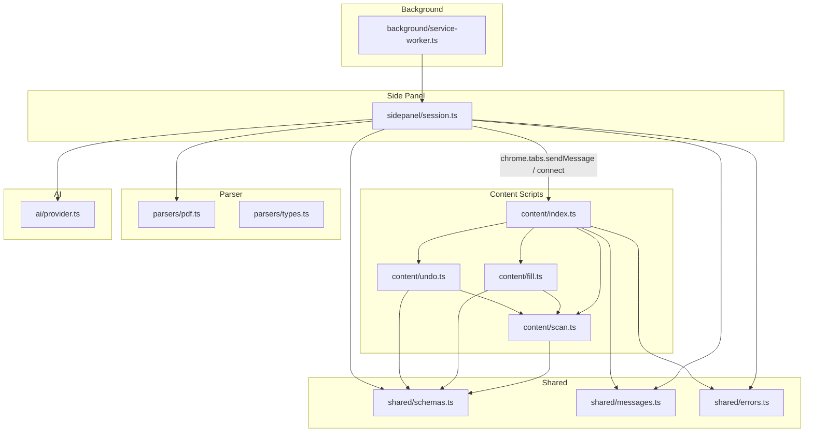
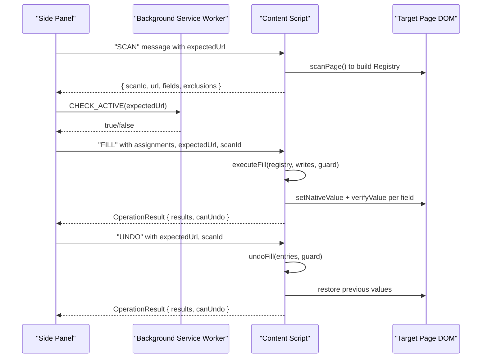
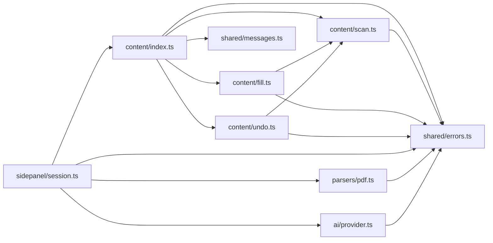
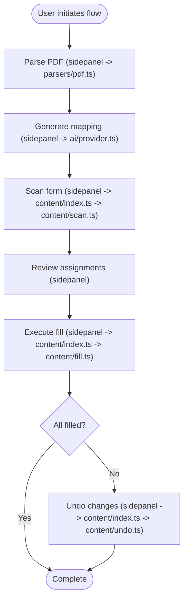

# Internal Module APIs

<cite>
**Referenced Files in This Document**
- [scan.ts](file://src/content/scan.ts)
- [fill.ts](file://src/content/fill.ts)
- [undo.ts](file://src/content/undo.ts)
- [index.ts](file://src/content/index.ts)
- [pdf.ts](file://src/parsers/pdf.ts)
- [types.ts](file://src/parsers/types.ts)
- [session.ts](file://src/sidepanel/session.ts)
- [schemas.ts](file://src/shared/schemas.ts)
- [messages.ts](file://src/shared/messages.ts)
- [errors.ts](file://src/shared/errors.ts)
- [provider.ts](file://src/ai/provider.ts)
- [service-worker.ts](file://src/background/service-worker.ts)
</cite>

## Table of Contents
1. [Introduction](#introduction)
2. [Project Structure](#project-structure)
3. [Core Components](#core-components)
4. [Architecture Overview](#architecture-overview)
5. [Detailed Component Analysis](#detailed-component-analysis)
6. [Dependency Analysis](#dependency-analysis)
7. [Performance Considerations](#performance-considerations)
8. [Troubleshooting Guide](#troubleshooting-guide)
9. [Conclusion](#conclusion)
10. [Appendices](#appendices)

## Introduction
This document describes the internal APIs exposed by the Help Me Fill extension modules. It focuses on:
- Form scanning and field discovery
- Field filling with validation and verification
- Undo operations to restore previous values
- PDF parsing for text extraction
- Session management and cross-process messaging between side panel, content scripts, and background service worker

It explains function signatures, parameters, return values, error conditions, data flows, and integration patterns so developers can extend or integrate with the extension safely.

## Project Structure
The extension is organized into distinct modules:
- Content scripts (form scanning, filling, undoing)
- Parser module (PDF text extraction)
- Side panel session state machine and messaging helpers
- Shared schemas, messages, and errors
- AI provider abstraction for mapping suggestions
- Background service worker for authorization checks

**Diagram sources**
- [index.ts:1-72](file://src/content/index.ts#L1-L72)
- [scan.ts:1-88](file://src/content/scan.ts#L1-L88)
- [fill.ts:1-82](file://src/content/fill.ts#L1-L82)
- [undo.ts:1-29](file://src/content/undo.ts#L1-L29)
- [pdf.ts:1-87](file://src/parsers/pdf.ts#L1-L87)
- [types.ts:1-3](file://src/parsers/types.ts#L1-L3)
- [session.ts:1-86](file://src/sidepanel/session.ts#L1-L86)
- [schemas.ts:1-39](file://src/shared/schemas.ts#L1-L39)
- [messages.ts:1-20](file://src/shared/messages.ts#L1-L20)
- [errors.ts:1-10](file://src/shared/errors.ts#L1-L10)
- [provider.ts:1-107](file://src/ai/provider.ts#L1-L107)
- [service-worker.ts:1-29](file://src/background/service-worker.ts#L1-L29)

**Section sources**
- [index.ts:1-72](file://src/content/index.ts#L1-L72)
- [session.ts:1-86](file://src/sidepanel/session.ts#L1-L86)
- [schemas.ts:1-39](file://src/shared/schemas.ts#L1-L39)
- [messages.ts:1-20](file://src/shared/messages.ts#L1-L20)
- [errors.ts:1-10](file://src/shared/errors.ts#L1-L10)

## Core Components
- Form scanning: Discovers visible, supported form controls, builds descriptors, and returns a registry used by fill/undo.
- Field filling: Validates assignments, writes values using native setters, verifies persistence, and tracks undo entries.
- Undo: Reverses previously filled values while preserving subsequent user edits.
- PDF parsing: Extracts text lines from PDFs with size limits and progress callbacks.
- Session management: Coordinates side panel state, messaging, and execution guards across tabs and frames.

Key shared types and limits are defined centrally to ensure consistency across modules.

**Section sources**
- [scan.ts:10-88](file://src/content/scan.ts#L10-L88)
- [fill.ts:6-82](file://src/content/fill.ts#L6-L82)
- [undo.ts:1-29](file://src/content/undo.ts#L1-L29)
- [pdf.ts:7-87](file://src/parsers/pdf.ts#L7-L87)
- [session.ts:6-86](file://src/sidepanel/session.ts#L6-L86)
- [schemas.ts:1-39](file://src/shared/schemas.ts#L1-L39)

## Architecture Overview
The extension coordinates three main processes:
- Side panel: Holds session state, orchestrates parsing and mapping, and sends commands to the content script.
- Content script: Executes on the target page; scans forms, fills fields, and supports undo.
- Background service worker: Provides short-lived authorization checks to confirm the active tab matches expectations.

**Diagram sources**
- [session.ts:44-86](file://src/sidepanel/session.ts#L44-L86)
- [index.ts:22-53](file://src/content/index.ts#L22-L53)
- [fill.ts:42-82](file://src/content/fill.ts#L42-L82)
- [undo.ts:6-28](file://src/content/undo.ts#L6-L28)
- [service-worker.ts:18-28](file://src/background/service-worker.ts#L18-L28)

## Detailed Component Analysis

### Form Scanning API (content/scan.ts)
Purpose: Discover eligible form controls, describe them, and produce a stable registry for later operations.

Key exports and behaviors:
- isVisible(element): Checks visibility via attributes, computed styles, and geometry.
- describe(element, id): Builds a LocalField descriptor including label, ariaLabel, placeholder, name, context, required, maxLength, pattern, and currentValue.
- exclusion(element): Returns a reason string if a control should be excluded (unsupported type, disabled/readonly, hidden, sensitive keywords, safety limits).
- fingerprint(element): Produces a JSON signature based on descriptor plus DOM identity and autocomplete/form IDs.
- scanPage(doc?): Returns a Registry containing scan metadata and a Map of registered fields. Enforces limits on total controls and supported fields.
- assertRegistry(registry, expectedUrl, scanId): Validates that the current page still matches the scanned URL and scan ID, and that all registered fields remain unchanged.

Data structures:
- TextControl: HTMLInputElement | HTMLTextAreaElement
- RegisteredField: { element, descriptor, signature }
- Registry: { scan: Scan, fields: Map<string, RegisteredField> }

Error conditions:
- Too many controls or too many supported fields triggers UserError.
- assertRegistry throws UserError if the document changed, route changed, or any field became invalid or replaced.

Integration notes:
- Used by fill and undo to validate preconditions before writing or restoring values.
- Exclusions are aggregated and returned in the scan result for UI transparency.

**Section sources**
- [scan.ts:10-88](file://src/content/scan.ts#L10-L88)
- [schemas.ts:1-39](file://src/shared/schemas.ts#L1-L39)

### Field Filling API (content/fill.ts)
Purpose: Validate and write values to form fields, verify persistence, and track undo entries.

Key exports and behaviors:
- validateControlValue(element, value): Validates length constraints, browser normalization, and validity against type/pattern/required.
- setNativeValue(element, value): Uses the native setter to assign the value and dispatches input/change events and blur.
- verifyValue(element, value, checkValidity?): Polls briefly to ensure the value persists and remains valid.
- executeFill(registry, writes, expectedUrl, scanId, guard, undo[]): Performs full preflight validation, then iteratively writes each assignment with cancellation and authorization checks. Tracks results and stops on failure.

Parameters:
- registry: Registry produced by scanPage
- writes: Array of WriteAssignment (fieldId, value, expectedValue, allowOverwrite)
- expectedUrl, scanId: Identity tokens to prevent cross-page misuse
- guard: ExecutionGuard with authorize() and canceled() to coordinate UI and tab activity
- undo: Accumulator array of UndoEntry for later reversal

Return value:
- Array of FillResult per assignment with status and detail.

Error conditions:
- Unknown/duplicate field IDs
- Field changed since review
- Overwriting existing values without approval
- Invalid value per constraints
- Target change during focus/write
- Cancellation or loss of active tab

Integration notes:
- Results include skipped, filled, changed/reverted, failed statuses.
- On failure, remaining assignments are marked skipped.

**Section sources**
- [fill.ts:6-82](file://src/content/fill.ts#L6-L82)
- [messages.ts:4-8](file://src/shared/messages.ts#L4-L8)
- [schemas.ts:33-39](file://src/shared/schemas.ts#L33-L39)

### Undo API (content/undo.ts)
Purpose: Restore previous values for fields that were filled, preserving subsequent user edits.

Key export:
- undoFill(registry, entries, expectedUrl, scanId, guard): Iterates entries in reverse, validates registry, ensures no subsequent edits occurred, restores previous values, and verifies restoration.

Parameters:
- registry: Same Registry used during scan
- entries: UndoEntry[] captured during fill
- expectedUrl, scanId: Identity tokens
- guard: ExecutionGuard

Return value:
- Array of FillResult with restored or changed/reverted statuses.

Error conditions:
- Cancellation or tab change
- Target changed during undo
- Element disconnected or value mismatched

Integration notes:
- Restores only when the written value is still present; otherwise skips to preserve user edits.

**Section sources**
- [undo.ts:1-29](file://src/content/undo.ts#L1-L29)
- [fill.ts:6-26](file://src/content/fill.ts#L6-L26)

### PDF Parsing API (parsers/pdf.ts)
Purpose: Extract text lines from PDF files with safety limits and progress reporting.

Key exports and behaviors:
- validateFile(file): Ensures file is a PDF, non-empty, and within size limits.
- extractLines(items, page): Converts raw text items into DocumentLine[], handling line breaks and spacing.
- parsePdf(file, signal, onProgress): Parses PDF pages, enforces page and character limits, handles password protection, and returns a ParsedDocument.

Parameters:
- file: File object with name, size, type
- signal: AbortSignal to cancel parsing
- onProgress: Callback(page, total) for UI updates

Return value:
- ParsedDocument: { name, pages, characters, lines }

Error conditions:
- Not a PDF or empty
- Exceeds size/pages/characters limits
- Password-protected PDF
- No extractable text (scanned/image-only)
- Corrupt or unsupported encoding

Integration notes:
- Progress updates enable responsive UI during long parses.
- Aborts cleanly via signal and destroys tasks in finally.

**Section sources**
- [pdf.ts:7-87](file://src/parsers/pdf.ts#L7-L87)
- [types.ts:1-3](file://src/parsers/types.ts#L1-L3)
- [schemas.ts:1-3](file://src/shared/schemas.ts#L1-L3)

### Session Management API (sidepanel/session.ts)
Purpose: Manage side panel state, communicate with content scripts, and enforce safety checks.

Key exports and behaviors:
- Session and Phase: State machine for workflow phases (idle, parsing, scanning, ready, mapping, review, filling, complete, undoing).
- sessionReducer(state, action): Pure reducer handling actions like START, DOCUMENT, SCAN, PLAN, ROW, SELECT_ALL, RESULT, ERROR, INVALIDATE, PROVIDER_CHANGED.
- isBusy(phase): Utility to disable UI during busy phases.
- assertActive(target): Verifies the target tab/window and URL match expectations.
- sendPage(target, message): Sends a typed message to the content script and validates the reply.
- scanActivePage(): Injects content script, obtains document identity, asserts activity, and requests a scan from the content script.
- executeOnPage(scan, message): Establishes a port to the content script, waits for readiness, and executes FILL or UNDO operations.

Parameters and return values:
- All functions use strongly-typed schemas for messages and results.
- Errors are wrapped as UserError with user-friendly messages.

Integration notes:
- The session acts as the coordinator between parsing, mapping, scanning, and execution.
- Ports and messages ensure strict lifecycle control and cancellation support.

**Section sources**
- [session.ts:6-86](file://src/sidepanel/session.ts#L6-L86)
- [schemas.ts:1-39](file://src/shared/schemas.ts#L1-L39)
- [messages.ts:1-20](file://src/shared/messages.ts#L1-L20)

### Content Script Entry (content/index.ts)
Purpose: Hosts runtime state, listens for messages, and routes operations to scan/fill/undo.

Key behaviors:
- Maintains registry, undo entries, busy flag, and connection tracking.
- Handles SCAN, FILL, UNDO, CLEAR, CANCEL messages.
- Validates trusted origins and connects to the review panel via ports.
- Wraps execution with guards to ensure cancellation and tab activity.

Integration notes:
- Acts as the bridge between side panel commands and page-level operations.
- Ensures only one operation runs at a time and clears state on page hide.

**Section sources**
- [index.ts:1-72](file://src/content/index.ts#L1-L72)

### AI Provider API (ai/provider.ts)
Purpose: Abstracts mapping generation from parsed PDF text to form fields.

Key exports and behaviors:
- createProvider(settings, fetcher): Returns an AIProvider with map(request) that calls the selected transport, validates response, and returns a MappingPlan.
- buildRequest(settings, system, user): Constructs transport-specific requests.
- Validation and retry logic handle malformed responses and timeouts.

Parameters:
- settings: ProviderSettings with model and apiKey
- request: MappingRequest with lines, fields, and AbortSignal

Return value:
- MappingOutcome: { plan, calls, elapsedMs, usage? }

Error conditions:
- Invalid settings or inputs
- Provider errors (auth, rate limit, unavailable)
- Timeout exceeded
- Invalid provider response

Integration notes:
- Bounded response reading prevents memory issues.
- Retry uses original data and diagnostic feedback.

**Section sources**
- [provider.ts:1-107](file://src/ai/provider.ts#L1-L107)
- [schemas.ts:1-39](file://src/shared/schemas.ts#L1-L39)

### Background Service Worker (background/service-worker.ts)
Purpose: Configure storage access levels and provide short-lived authorization checks.

Key behaviors:
- Configures storage access for trusted contexts and side panel behavior.
- Handles CHECK_ACTIVE messages to verify the active tab matches expectedUrl.

Integration notes:
- Used by content scripts to ensure operations run on the intended tab.

**Section sources**
- [service-worker.ts:1-29](file://src/background/service-worker.ts#L1-L29)

## Dependency Analysis
- Content scripts depend on shared schemas, messages, and errors for consistent typing and error handling.
- Fill and undo depend on scan for registry validation and field descriptors.
- Side panel depends on parsers and AI provider to prepare data for mapping and execution.
- Background service worker provides minimal but critical authorization checks.

**Diagram sources**
- [index.ts:1-72](file://src/content/index.ts#L1-L72)
- [scan.ts:1-88](file://src/content/scan.ts#L1-L88)
- [fill.ts:1-82](file://src/content/fill.ts#L1-L82)
- [undo.ts:1-29](file://src/content/undo.ts#L1-L29)
- [session.ts:1-86](file://src/sidepanel/session.ts#L1-L86)
- [pdf.ts:1-87](file://src/parsers/pdf.ts#L1-L87)
- [provider.ts:1-107](file://src/ai/provider.ts#L1-L107)
- [messages.ts:1-20](file://src/shared/messages.ts#L1-L20)
- [errors.ts:1-10](file://src/shared/errors.ts#L1-L10)

**Section sources**
- [index.ts:1-72](file://src/content/index.ts#L1-L72)
- [session.ts:1-86](file://src/sidepanel/session.ts#L1-L86)

## Performance Considerations
- Limits protect against excessive resource usage:
  - Maximum bytes, pages, characters for PDFs
  - Maximum fields and response size for mappings
  - Value length caps for field inputs
- Verification routines in fill minimize flaky writes by polling briefly after setting values.
- PDF parsing cleans up page resources and supports abort signals to free memory promptly.
- AI provider bounds response sizes and includes timeout handling to avoid hanging requests.

[No sources needed since this section provides general guidance]

## Troubleshooting Guide
Common errors and their causes:
- "Too many controls" or "More than 60 supported fields": The page has too many inputs; simplify the form or reduce complexity.
- "Unknown or duplicate field ID": Assignments reference invalid or repeated field identifiers.
- "A field changed since review": Fields were modified after scanning; re-scan and re-review.
- "Overwriting an existing value requires explicit approval": Set allowOverwrite when intentional.
- "The target changed on focus": Focus handlers replaced or altered the control; re-scan.
- "Canceled. No new request was started": Operation aborted via signal or UI cancellation.
- "Password-protected PDFs are not supported": Use unprotected documents.
- "No extractable text was found": Scanned/image-only PDFs require OCR, which is not included yet.
- "The provider took longer than 60 seconds": Increase timeout or retry explicitly.

Integration tips:
- Always pass expectedUrl and scanId to validate operations against the correct document.
- Use ExecutionGuard to respect cancellation and tab activity.
- Handle both filled and changed/reverted statuses to inform users about partial success.

**Section sources**
- [scan.ts:62-88](file://src/content/scan.ts#L62-L88)
- [fill.ts:42-82](file://src/content/fill.ts#L42-L82)
- [undo.ts:6-28](file://src/content/undo.ts#L6-L28)
- [pdf.ts:7-87](file://src/parsers/pdf.ts#L7-L87)
- [provider.ts:52-107](file://src/ai/provider.ts#L52-L107)
- [errors.ts:1-10](file://src/shared/errors.ts#L1-L10)

## Conclusion
The Help Me Fill extension exposes well-defined internal APIs for scanning, filling, undoing, parsing, and session management. Each module enforces safety limits, validates inputs, and communicates through typed messages. Developers extending the extension should:
- Respect limits and error conditions
- Use ExecutionGuard for cancellations and activity checks
- Validate registry identities to prevent cross-page misuse
- Handle partial results and provide clear user feedback

[No sources needed since this section summarizes without analyzing specific files]

## Appendices

### Data Flow Between Modules

**Diagram sources**
- [session.ts:44-86](file://src/sidepanel/session.ts#L44-L86)
- [pdf.ts:40-87](file://src/parsers/pdf.ts#L40-L87)
- [provider.ts:52-107](file://src/ai/provider.ts#L52-L107)
- [index.ts:22-53](file://src/content/index.ts#L22-L53)
- [scan.ts:62-88](file://src/content/scan.ts#L62-L88)
- [fill.ts:42-82](file://src/content/fill.ts#L42-L82)
- [undo.ts:6-28](file://src/content/undo.ts#L6-L28)

### Example Integration Patterns
- Scanning a page:
  - Call scanActivePage() from the side panel to obtain a BoundScan.
  - Use the returned fields to generate a mapping plan.
- Filling fields:
  - Build WriteAssignment arrays with fieldId, value, expectedValue, and allowOverwrite.
  - Send a FILL message via sendPage() and handle OperationResult statuses.
- Undoing changes:
  - If canUndo is true, send an UNDO message to restore previous values.
- Parsing PDFs:
  - Validate the file, then call parsePdf() with an AbortSignal and progress callback.
  - Use the resulting lines for mapping.

[No sources needed since this section provides general guidance]