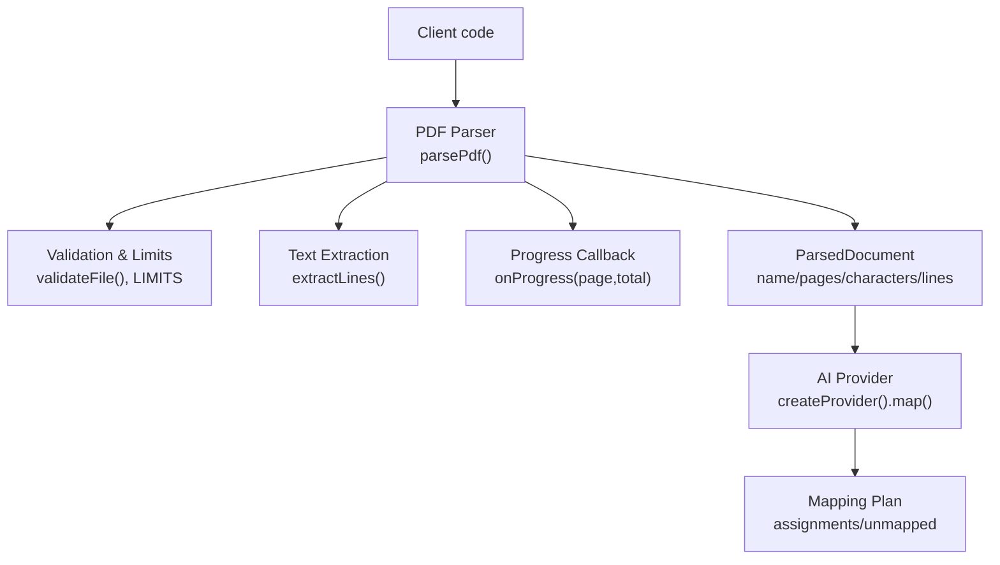
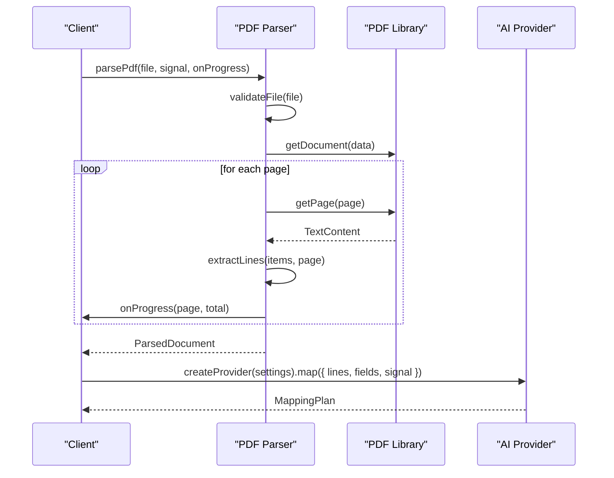
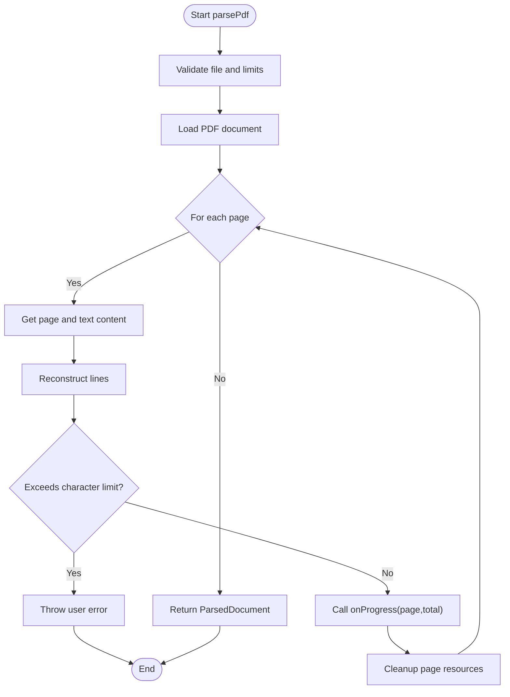
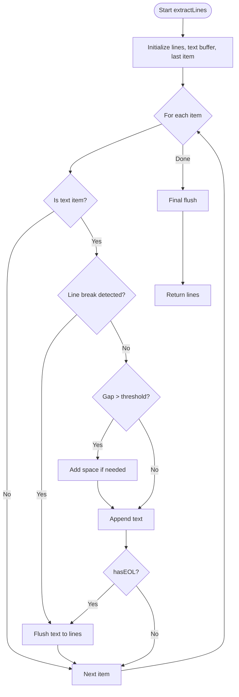
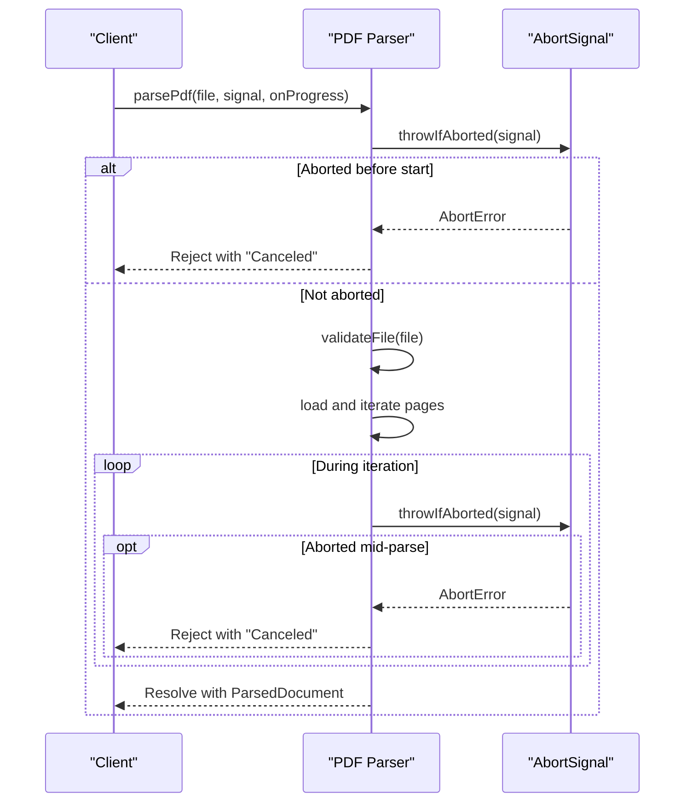
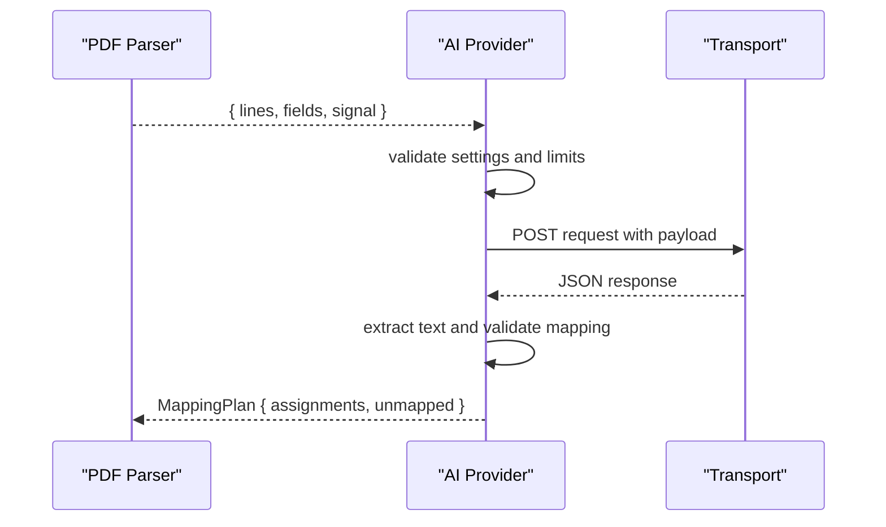
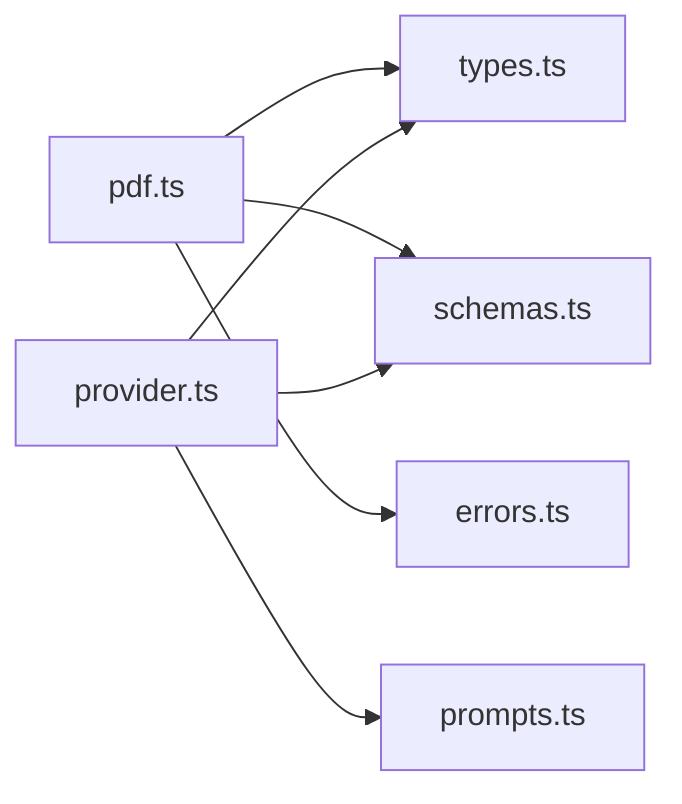

# PDF Parser APIs

<cite>
**Referenced Files in This Document**
- [pdf.ts](file://src/parsers/pdf.ts)
- [types.ts](file://src/parsers/types.ts)
- [schemas.ts](file://src/shared/schemas.ts)
- [errors.ts](file://src/shared/errors.ts)
- [provider.ts](file://src/ai/provider.ts)
- [prompts.ts](file://src/ai/prompts.ts)
- [scan.ts](file://src/content/scan.ts)
- [fill.ts](file://src/content/fill.ts)
- [pdf.test.ts](file://tests/unit/pdf.test.ts)
</cite>

## Table of Contents
1. [Introduction](#introduction)
2. [Project Structure](#project-structure)
3. [Core Components](#core-components)
4. [Architecture Overview](#architecture-overview)
5. [Detailed Component Analysis](#detailed-component-analysis)
6. [Dependency Analysis](#dependency-analysis)
7. [Performance Considerations](#performance-considerations)
8. [Troubleshooting Guide](#troubleshooting-guide)
9. [Conclusion](#conclusion)
10. [Appendices](#appendices)

## Introduction
This document describes the client-side PDF parsing APIs used to extract text from PDFs and feed it into an AI provider for form mapping. It covers function signatures, progress reporting, error handling, the ParsedDocument interface, line processing logic, memory management, streaming considerations, supported features, limitations, and integration with the AI provider system.

## Project Structure
The PDF parsing feature is implemented as a small, focused module that:
- Validates input files and enforces size/page/character limits
- Parses PDFs using a library and reconstructs lines per page
- Returns a structured result consumed by downstream components (AI mapping and UI)

**Diagram sources**
- [pdf.ts:7-13](file://src/parsers/pdf.ts#L7-L13)
- [pdf.ts:15-38](file://src/parsers/pdf.ts#L15-L38)
- [pdf.ts:40-86](file://src/parsers/pdf.ts#L40-L86)
- [types.ts:1-3](file://src/parsers/types.ts#L1-L3)
- [schemas.ts:3](file://src/shared/schemas.ts#L3)
- [provider.ts:52-106](file://src/ai/provider.ts#L52-L106)

**Section sources**
- [pdf.ts:7-13](file://src/parsers/pdf.ts#L7-L13)
- [pdf.ts:40-86](file://src/parsers/pdf.ts#L40-L86)
- [types.ts:1-3](file://src/parsers/types.ts#L1-L3)
- [schemas.ts:3](file://src/shared/schemas.ts#L3)

## Core Components
- File validation and limits enforcement
- Line reconstruction algorithm
- Asynchronous PDF parsing with progress and cancellation
- Structured output via ParsedDocument

Key responsibilities:
- Validate file type, size, and header
- Enforce global limits for pages and characters
- Reconstruct readable lines from low-level text items
- Report progress per page
- Handle errors and abort signals consistently

**Section sources**
- [pdf.ts:7-13](file://src/parsers/pdf.ts#L7-L13)
- [pdf.ts:15-38](file://src/parsers/pdf.ts#L15-L38)
- [pdf.ts:40-86](file://src/parsers/pdf.ts#L40-L86)
- [types.ts:1-3](file://src/parsers/types.ts#L1-L3)
- [schemas.ts:3](file://src/shared/schemas.ts#L3)
- [errors.ts:1-10](file://src/shared/errors.ts#L1-L10)

## Architecture Overview
The PDF parser integrates with the AI provider pipeline. The flow:
1. Client calls parsePdf with a File and AbortSignal
2. Parser validates inputs, loads PDF, and iterates pages
3. For each page, text content is extracted and reconstructed into lines
4. Progress is reported after each page
5. Resulting ParsedDocument is passed to the AI provider to generate a mapping plan

**Diagram sources**
- [pdf.ts:40-86](file://src/parsers/pdf.ts#L40-L86)
- [provider.ts:52-106](file://src/ai/provider.ts#L52-L106)

## Detailed Component Analysis

### PDF Parsing API: parsePdf
- Purpose: Parse a PDF file into a structured set of lines with metadata
- Signature: parsePdf(file: File, signal: AbortSignal, onProgress: (page: number, total: number) => void): Promise<ParsedDocument>
- Behavior:
  - Validates file type, size, and header
  - Configures worker resources and loads the document
  - Iterates pages, extracts text, reconstructs lines, and enforces limits
  - Reports progress per page
  - Supports cancellation via AbortSignal
  - Cleans up resources even on errors or aborts
- Output: ParsedDocument containing name, pages, characters, and lines

**Diagram sources**
- [pdf.ts:40-86](file://src/parsers/pdf.ts#L40-L86)

**Section sources**
- [pdf.ts:40-86](file://src/parsers/pdf.ts#L40-L86)
- [errors.ts:1-10](file://src/shared/errors.ts#L1-L10)

### Line Processing Algorithm: extractLines
- Input: Array of text items from the PDF library and the current page number
- Output: Array of DocumentLine objects with id, page, and text
- Logic:
  - Skips non-text items
  - Detects line breaks based on vertical position differences relative to font height
  - Adds spacing between words when horizontal gaps exceed thresholds
  - Flushes accumulated text when an explicit end-of-line marker is present
  - Assigns stable ids using page and line index

**Diagram sources**
- [pdf.ts:15-38](file://src/parsers/pdf.ts#L15-L38)

**Section sources**
- [pdf.ts:15-38](file://src/parsers/pdf.ts#L15-L38)

### ParsedDocument Interface
- Fields:
  - name: string — original file name
  - pages: number — total pages parsed
  - characters: number — total characters across all lines
  - lines: DocumentLine[] — ordered list of extracted lines with page references

- Usage: Consumed by the AI provider to build prompts and produce mapping plans

**Section sources**
- [types.ts:1-3](file://src/parsers/types.ts#L1-L3)
- [provider.ts:52-106](file://src/ai/provider.ts#L52-L106)

### Error Handling and Cancellation
- UserError: Custom error type for user-facing messages
- AbortSignal: Throws a specific abort error; operations stop immediately
- Validation errors: Invalid file type, empty file, oversized file, invalid PDF header, password protection, too many pages, excessive characters, no extractable text
- Resource cleanup: Ensures PDF task destruction and event listener removal

**Diagram sources**
- [pdf.ts:40-86](file://src/parsers/pdf.ts#L40-L86)
- [errors.ts:1-10](file://src/shared/errors.ts#L1-L10)

**Section sources**
- [pdf.ts:40-86](file://src/parsers/pdf.ts#L40-L86)
- [errors.ts:1-10](file://src/shared/errors.ts#L1-L10)

### Integration with AI Provider System
- The parser returns ParsedDocument which is transformed into a payload for the AI provider
- The provider builds requests according to configured transport and validates responses
- Mapping results are validated against field descriptors and returned as assignments or unmapped reasons

**Diagram sources**
- [provider.ts:52-106](file://src/ai/provider.ts#L52-L106)
- [prompts.ts:18-25](file://src/ai/prompts.ts#L18-L25)

**Section sources**
- [provider.ts:52-106](file://src/ai/provider.ts#L52-L106)
- [prompts.ts:18-25](file://src/ai/prompts.ts#L18-L25)

## Dependency Analysis
- PDF Parser depends on:
  - PDF library for document loading and text extraction
  - Shared schemas for limits
  - Shared errors for consistent error types and abort handling
  - Types for structured output
- AI Provider depends on:
  - Parser output (DocumentLine[])
  - Shared schemas for field descriptors and limits
  - Transports for different providers

**Diagram sources**
- [pdf.ts:1-6](file://src/parsers/pdf.ts#L1-L6)
- [provider.ts:1-9](file://src/ai/provider.ts#L1-L9)

**Section sources**
- [pdf.ts:1-6](file://src/parsers/pdf.ts#L1-L6)
- [provider.ts:1-9](file://src/ai/provider.ts#L1-L9)

## Performance Considerations
- Memory usage:
  - Entire PDF is loaded into memory as bytes; ensure files are within size limits
  - Page resources are cleaned up after processing each page
  - Character count is tracked to prevent excessive memory consumption
- Time complexity:
  - Line reconstruction processes each text item once; O(n) per page
  - Total time scales with number of pages and text items
- Streaming large PDFs:
  - Current implementation loads full bytes; not fully streaming at the byte level
  - Use chunked reading only if you modify the loader; otherwise rely on page-by-page processing
- Limits:
  - Max file size: 10 MiB
  - Max pages: 20
  - Max characters: 24,000
  - These enforce predictable performance and memory usage

[No sources needed since this section provides general guidance]

## Troubleshooting Guide
Common issues and resolutions:
- Invalid file type or empty file: Ensure the selected file is a PDF and has content
- Oversized file: Reduce file size or split documents
- Invalid PDF header: Confirm the file is a valid PDF
- Password-protected PDFs: Use unprotected documents
- Too many pages: Shorten the document
- Excessive characters: Choose a shorter PDF
- No extractable text: Scanned/image-only PDFs require OCR, which is not included
- Network or provider errors: Check API key, model ID, rate limits, and network access

**Section sources**
- [pdf.ts:7-13](file://src/parsers/pdf.ts#L7-L13)
- [pdf.ts:40-86](file://src/parsers/pdf.ts#L40-L86)
- [errors.ts:1-10](file://src/shared/errors.ts#L1-L10)

## Conclusion
The PDF parser provides a robust, limited-scope solution for client-side text extraction with clear boundaries for safety and performance. It integrates seamlessly with the AI provider to map document content to form fields. While it does not support OCR or streaming at the byte level, its design ensures predictable behavior, proper resource cleanup, and comprehensive error handling.

[No sources needed since this section summarizes without analyzing specific files]

## Appendices

### Supported PDF Features and Limitations
- Supported:
  - Text-based PDFs with selectable text
  - Unicode text preservation
  - Basic line reconstruction with spacing and line-break detection
- Not supported:
  - OCR for scanned or image-only PDFs
  - Password-protected PDFs
  - Very large or very long documents beyond defined limits

**Section sources**
- [pdf.ts:7-13](file://src/parsers/pdf.ts#L7-L13)
- [pdf.ts:40-86](file://src/parsers/pdf.ts#L40-L86)
- [schemas.ts:3](file://src/shared/schemas.ts#L3)

### Examples of Usage Patterns
- Streaming large PDFs:
  - Process page-by-page and report progress; avoid accumulating large intermediate structures
  - Respect limits to prevent memory pressure
- Handling different PDF structures:
  - Rely on line reconstruction heuristics; verify outputs for complex layouts
  - Use page references in line IDs to correlate evidence
- Integrating with AI provider:
  - Pass lines and field descriptors to the provider
  - Validate mapping results and handle retries or failures gracefully

[No sources needed since this section provides general guidance]

### Unit Tests Reference
- Validation and guards:
  - Rejects non-PDF, oversized, and empty files
  - Enforces page and character limits
  - Destroys tasks on errors
  - Handles cancellation and password prompts
- Line reconstruction:
  - Preserves Unicode and zeros
  - Produces correct line grouping and IDs

**Section sources**
- [pdf.test.ts:9-44](file://tests/unit/pdf.test.ts#L9-L44)