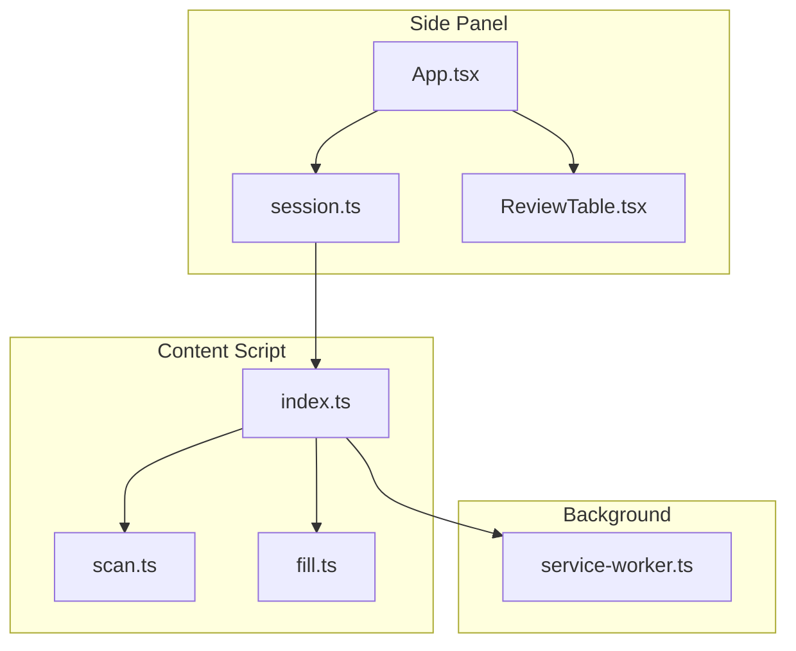
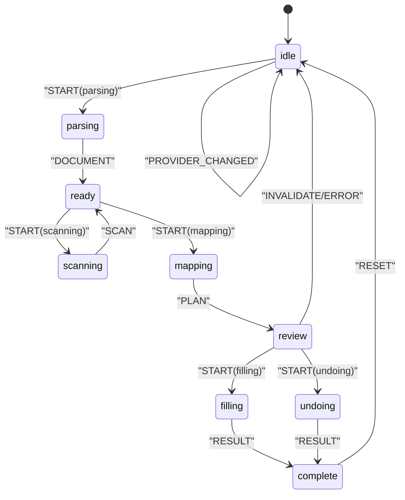
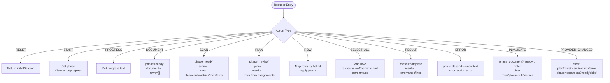
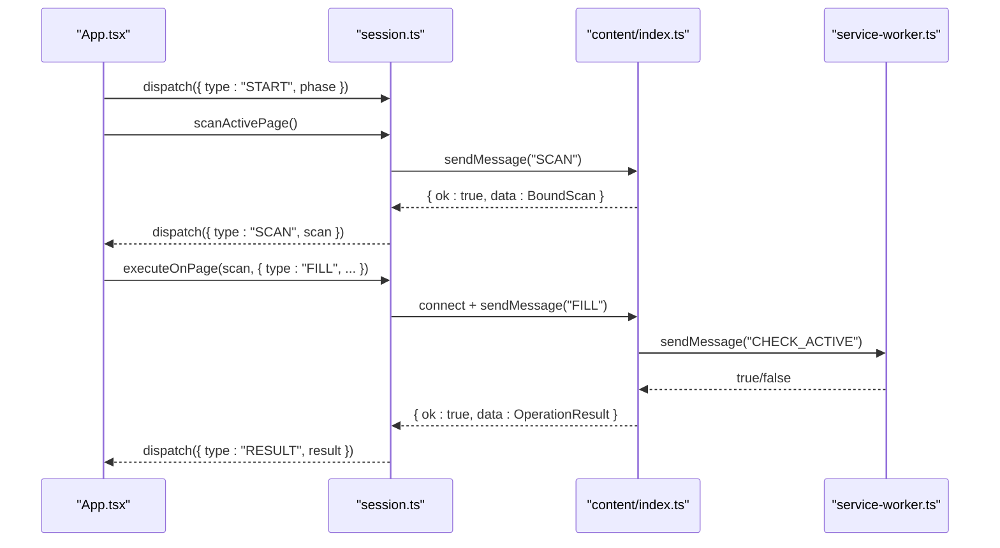
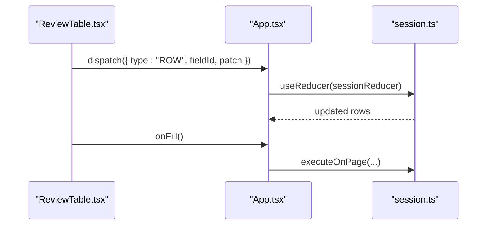
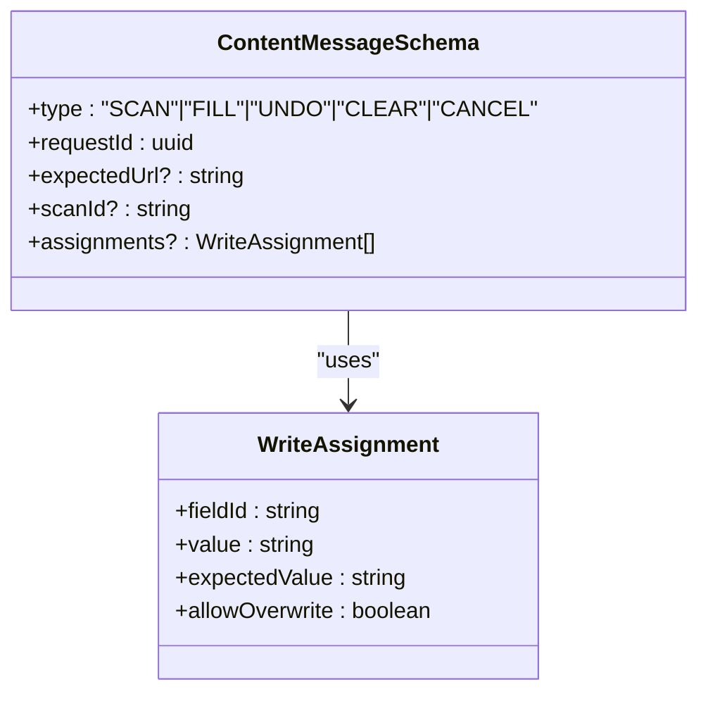
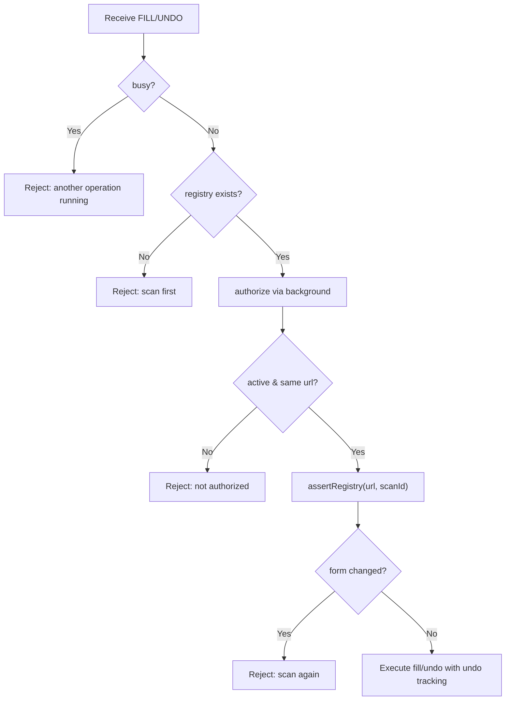
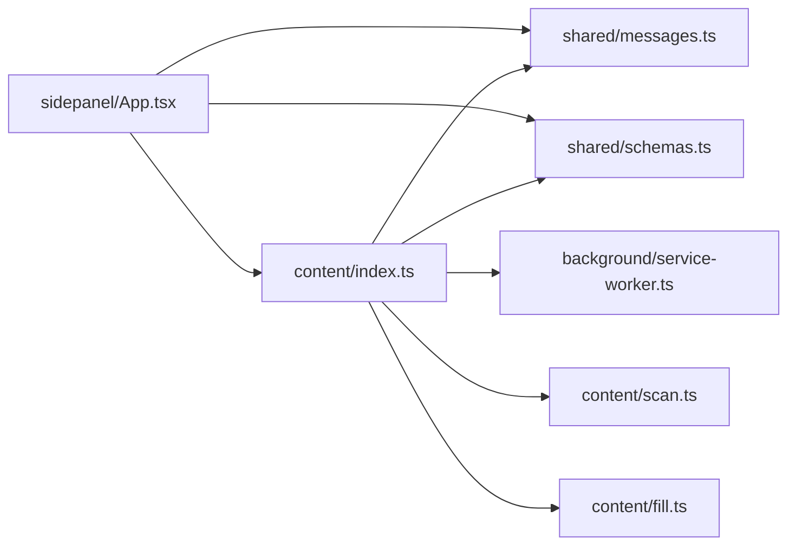

# Session Management APIs

<cite>
**Referenced Files in This Document**
- [session.ts](file://src/sidepanel/session.ts)
- [App.tsx](file://src/sidepanel/App.tsx)
- [ReviewTable.tsx](file://src/sidepanel/components/ReviewTable.tsx)
- [messages.ts](file://src/shared/messages.ts)
- [schemas.ts](file://src/shared/schemas.ts)
- [errors.ts](file://src/shared/errors.ts)
- [service-worker.ts](file://src/background/service-worker.ts)
- [index.ts (content)](file://src/content/index.ts)
- [scan.ts](file://src/content/scan.ts)
- [fill.ts](file://src/content/fill.ts)
</cite>

## Table of Contents
1. Introduction
2. Project Structure
3. Core Components
4. Architecture Overview
5. Detailed Component Analysis
6. Dependency Analysis
7. Performance Considerations
8. Troubleshooting Guide
9. Conclusion

## Introduction
This document explains the session management APIs that coordinate the extension’s workflow state from document upload through form filling completion. It covers the SessionState interface, action dispatching and reducer patterns for state transitions, lifecycle phases, programmatic session control, error recovery, UI integration, state persistence, cross-context communication, and memory management strategies.

## Project Structure
The session management spans three contexts:
- Side panel: owns the session state, orchestrates workflows, and renders UI.
- Content script: scans and fills fields on the active page, validates changes, and supports undo.
- Background service worker: grants short-lived authorization checks and manages side panel behavior.

**Diagram sources**
- [App.tsx:15-127](file://src/sidepanel/App.tsx#L15-L127)
- [session.ts:1-86](file://src/sidepanel/session.ts#L1-L86)
- [ReviewTable.tsx:1-30](file://src/sidepanel/components/ReviewTable.tsx#L1-L30)
- [index.ts (content):1-72](file://src/content/index.ts#L1-L72)
- [scan.ts:1-88](file://src/content/scan.ts#L1-L88)
- [fill.ts:1-82](file://src/content/fill.ts#L1-L82)
- [service-worker.ts:1-29](file://src/background/service-worker.ts#L1-L29)

**Section sources**
- [App.tsx:15-127](file://src/sidepanel/App.tsx#L15-L127)
- [session.ts:1-86](file://src/sidepanel/session.ts#L1-L86)
- [index.ts (content):1-72](file://src/content/index.ts#L1-L72)
- [service-worker.ts:1-29](file://src/background/service-worker.ts#L1-L29)

## Core Components
- Session state model and reducer: defines phases, data shape, and deterministic transitions.
- Action types: RESET, START, PROGRESS, DOCUMENT, SCAN, PLAN, ROW, SELECT_ALL, RESULT, ERROR, INVALIDATE, PROVIDER_CHANGED.
- Utilities: isBusy, assertActive, sendPage, scanActivePage, executeOnPage.
- UI integration: App orchestrates workflows; ReviewTable drives selection and edits.
- Cross-context messaging: typed messages and replies between side panel and content script.
- Validation schemas: shared constraints for fields, mappings, scans, and operation results.
- Error handling: UserError and AbortError normalization.

Key responsibilities:
- Side panel: owns lifecycle, dispatches actions, coordinates scanning, mapping, review, and filling.
- Content script: enforces page integrity, executes fill/undo, tracks undo entries, and responds to messages.
- Background: authorizes operations via CHECK_ACTIVE and configures storage access levels.

**Section sources**
- [session.ts:6-42](file://src/sidepanel/session.ts#L6-L42)
- [session.ts:44-86](file://src/sidepanel/session.ts#L44-L86)
- [App.tsx:15-127](file://src/sidepanel/App.tsx#L15-L127)
- [ReviewTable.tsx:1-30](file://src/sidepanel/components/ReviewTable.tsx#L1-L30)
- [messages.ts:1-20](file://src/shared/messages.ts#L1-L20)
- [schemas.ts:1-39](file://src/shared/schemas.ts#L1-L39)
- [errors.ts:1-10](file://src/shared/errors.ts#L1-L10)

## Architecture Overview
The session lifecycle flows through well-defined phases with explicit state transitions driven by actions. The side panel uses a reducer pattern to manage state deterministically and communicates with the content script over Chrome runtime APIs.

**Diagram sources**
- [session.ts:6-42](file://src/sidepanel/session.ts#L6-L42)
- [App.tsx:50-107](file://src/sidepanel/App.tsx#L50-L107)

## Detailed Component Analysis

### Session State Interface and Reducer
- Phase enum: idle, parsing, scanning, ready, mapping, review, filling, complete, undoing.
- Session shape: phase, optional document, scan, plan, rows array, result, error, progress, metrics.
- Reducer handles:
  - Lifecycle: START sets phase and clears transient state.
  - Data ingestion: DOCUMENT resets to ready; SCAN resets plan/result/metrics and prepares review rows.
  - Review editing: ROW patches individual row attributes; SELECT_ALL toggles selections respecting overwrite rules.
  - Completion: RESULT moves to complete; ERROR returns to appropriate prior phase based on context.
  - Invalidation: INVALIDATE resets rows and plan while preserving document when present; PROVIDER_CHANGED clears AI-driven artifacts.
- Utility: isBusy identifies non-idle phases where user interactions should be gated.

**Diagram sources**
- [session.ts:6-42](file://src/sidepanel/session.ts#L6-L42)

**Section sources**
- [session.ts:6-42](file://src/sidepanel/session.ts#L6-L42)

### Workflow Orchestration in the Side Panel
- run(phase, task): ensures single execution per epoch, starts phase, dispatches START, awaits task, dispatches resulting action or error, and cleans up.
- Upload: resets session, parses PDF locally, updates progress, then sets DOCUMENT.
- Scan: invalidates previous state, scans active page, binds target, and sets SCAN.
- Generate: asserts active tab, checks permissions, calls provider mapping, and sets PLAN with metrics.
- Fill: builds assignments from selected rows, sends FILL message, and sets RESULT.
- Undo: sends UNDO if supported, and sets RESULT.
- Cancel: aborts current work and notifies content script to stop pending operations.
- Reset: clears session state and attempts to clear storage keys used by the page.

**Diagram sources**
- [App.tsx:50-107](file://src/sidepanel/App.tsx#L50-L107)
- [session.ts:44-86](file://src/sidepanel/session.ts#L44-L86)
- [index.ts (content):22-69](file://src/content/index.ts#L22-L69)
- [service-worker.ts:17-28](file://src/background/service-worker.ts#L17-L28)

**Section sources**
- [App.tsx:50-107](file://src/sidepanel/App.tsx#L50-L107)
- [session.ts:44-86](file://src/sidepanel/session.ts#L44-L86)

### Review Table Integration
- Renders evidence-backed suggestions and allows manual overrides.
- Dispatches ROW actions to update value, selection, manual flag, and allowOverwrite.
- Provides SELECT_ALL to bulk-select/deselect respecting overwrite rules.
- Triggers onFill callback to start the filling phase.

**Diagram sources**
- [ReviewTable.tsx:1-30](file://src/sidepanel/components/ReviewTable.tsx#L1-L30)
- [session.ts:26-42](file://src/sidepanel/session.ts#L26-L42)
- [App.tsx:84-95](file://src/sidepanel/App.tsx#L84-L95)

**Section sources**
- [ReviewTable.tsx:1-30](file://src/sidepanel/components/ReviewTable.tsx#L1-L30)
- [App.tsx:84-95](file://src/sidepanel/App.tsx#L84-L95)

### Cross-Context Communication and Message Contracts
- Messages are strongly typed using discriminated unions and validated at both ends.
- Supported message types:
  - SCAN: initiates page scan with expectedUrl and requestId.
  - FILL: submits assignments with write constraints and expected values.
  - UNDO: restores previously changed values.
  - CLEAR: cancels ongoing operations and clears registry/undo state.
  - CANCEL: stops pending operations gracefully.
- Replies are normalized to { ok, data | error } envelopes.

**Diagram sources**
- [messages.ts:1-20](file://src/shared/messages.ts#L1-L20)

**Section sources**
- [messages.ts:1-20](file://src/shared/messages.ts#L1-L20)

### Page Integrity and Execution Guards
- Content script maintains a registry of scanned fields and an undo stack.
- Before each operation, it verifies:
  - Active tab and URL match expectations via background CHECK_ACTIVE.
  - Registry matches expectedUrl and scanId.
  - DOM structure and field signatures remain unchanged.
- Guard functions prevent execution if canceled or if the target becomes inactive.

**Diagram sources**
- [index.ts (content):22-69](file://src/content/index.ts#L22-L69)
- [scan.ts:62-88](file://src/content/scan.ts#L62-L88)
- [fill.ts:42-82](file://src/content/fill.ts#L42-L82)
- [service-worker.ts:17-28](file://src/background/service-worker.ts#L17-L28)

**Section sources**
- [index.ts (content):22-69](file://src/content/index.ts#L22-L69)
- [scan.ts:62-88](file://src/content/scan.ts#L62-L88)
- [fill.ts:42-82](file://src/content/fill.ts#L42-L82)
- [service-worker.ts:17-28](file://src/background/service-worker.ts#L17-L28)

### Programmatic Session Control Examples
- Start parsing: dispatch START with phase parsing, then set DOCUMENT after parse completes.
- Start scanning: dispatch START with phase scanning, then set SCAN with bound scan result.
- Generate mapping: dispatch START with phase mapping, then set PLAN with assignments and metrics.
- Fill selected fields: build assignments from rows, dispatch START with phase filling, then set RESULT.
- Undo last fill: dispatch START with phase undoing, then set RESULT with restored status.
- Cancel long-running work: abort controller and send CLEAR/CANCEL to content script.
- Reset session: dispatch RESET and clear storage keys.

These flows are implemented in the side panel’s event handlers and run wrapper.

**Section sources**
- [App.tsx:50-107](file://src/sidepanel/App.tsx#L50-L107)
- [session.ts:44-86](file://src/sidepanel/session.ts#L44-L86)

### Error Recovery Patterns
- Normalize errors: UserError messages surface to UI; AbortError indicates cancellation; generic fallback suggests reset.
- Phase-aware error routing: during filling/undoing, INVALIDATE preserves partial state hints; otherwise ERROR returns to appropriate phase.
- Invalidation triggers:
  - Tab/window changes detected via listeners.
  - URL or loading state changes invalidate sessions.
  - Content script rejects operations if page changes mid-execution.
- Retry guidance: prompts users to rescan and re-review after invalidation.

**Section sources**
- [errors.ts:1-10](file://src/shared/errors.ts#L1-L10)
- [App.tsx:27-48](file://src/sidepanel/App.tsx#L27-L48)
- [App.tsx:50-63](file://src/sidepanel/App.tsx#L50-L63)
- [index.ts (content):22-69](file://src/content/index.ts#L22-L69)

### State Persistence, Cross-Context Communication, and Memory Management
- Storage configuration: background sets access levels for session and local storage to trusted contexts.
- Short-lived authorization: CHECK_ACTIVE ensures the intended tab remains active before executing sensitive operations.
- Connection lifecycle:
  - Side panel opens a named port per operation; content script requires a live panel connection throughout execution.
  - Disconnects cancel remaining writes and clean up registries and undo stacks.
- Memory hygiene:
  - Completed tasks map bounded by size limit to avoid unbounded growth.
  - Pagehide events clear registries, undo stacks, connections, and completed maps.
  - Side panel clears controllers and storage keys on reset.

**Section sources**
- [service-worker.ts:1-15](file://src/background/service-worker.ts#L1-L15)
- [index.ts (content):14-21](file://src/content/index.ts#L14-L21)
- [index.ts (content):54-71](file://src/content/index.ts#L54-L71)
- [App.tsx:102-107](file://src/sidepanel/App.tsx#L102-L107)

## Dependency Analysis
- Side panel depends on:
  - Parsers for PDF extraction.
  - AI provider registry for mapping generation.
  - Shared schemas and messages for validation.
  - Content script via chrome.runtime messaging and scripting APIs.
- Content script depends on:
  - Shared messages and schemas.
  - Local scanning and filling logic.
  - Background service worker for authorization checks.
- Background depends on:
  - Chrome extensions APIs for storage and side panel behavior.

**Diagram sources**
- [App.tsx:1-127](file://src/sidepanel/App.tsx#L1-L127)
- [messages.ts:1-20](file://src/shared/messages.ts#L1-L20)
- [schemas.ts:1-39](file://src/shared/schemas.ts#L1-L39)
- [index.ts (content):1-72](file://src/content/index.ts#L1-L72)
- [scan.ts:1-88](file://src/content/scan.ts#L1-L88)
- [fill.ts:1-82](file://src/content/fill.ts#L1-L82)
- [service-worker.ts:1-29](file://src/background/service-worker.ts#L1-L29)

**Section sources**
- [App.tsx:1-127](file://src/sidepanel/App.tsx#L1-L127)
- [index.ts (content):1-72](file://src/content/index.ts#L1-L72)
- [service-worker.ts:1-29](file://src/background/service-worker.ts#L1-L29)

## Performance Considerations
- Limits enforced via shared schemas protect against large payloads and excessive fields.
- Scanning restricts node counts and excludes unsupported controls to keep processing fast.
- Verification delays ensure asynchronous UI updates settle before asserting values.
- Task concurrency controlled by epoch and AbortController prevents overlapping operations.
- Bounded completion map prevents memory leaks in content script.

[No sources needed since this section provides general guidance]

## Troubleshooting Guide
Common issues and resolutions:
- Target tab/page changed: assertActive and background CHECK_ACTIVE detect mismatches; prompt to rescan.
- Page access denied: scripting injection failures indicate restricted pages; instruct user to grant access.
- Invalid response from page: malformed or missing reply indicates content script issues; rescan recommended.
- Form changed mid-operation: registry assertions fail; require re-scan and re-review.
- Overwrite protection: existing values require explicit allowOverwrite; guide user to confirm.
- Cancellation: AbortError surfaced as “Canceled”; no new request started.

**Section sources**
- [session.ts:44-86](file://src/sidepanel/session.ts#L44-L86)
- [errors.ts:1-10](file://src/shared/errors.ts#L1-L10)
- [index.ts (content):22-69](file://src/content/index.ts#L22-L69)
- [fill.ts:42-82](file://src/content/fill.ts#L42-L82)

## Conclusion
The session management system uses a clear reducer-based state machine with explicit phases and robust cross-context guards. It integrates tightly with the UI to provide a guided workflow from document upload to form filling, while enforcing safety limits, validating page integrity, and supporting undo and cancellation. Proper error handling and memory management ensure resilience across dynamic web environments.