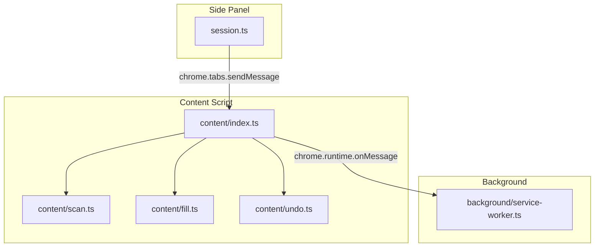
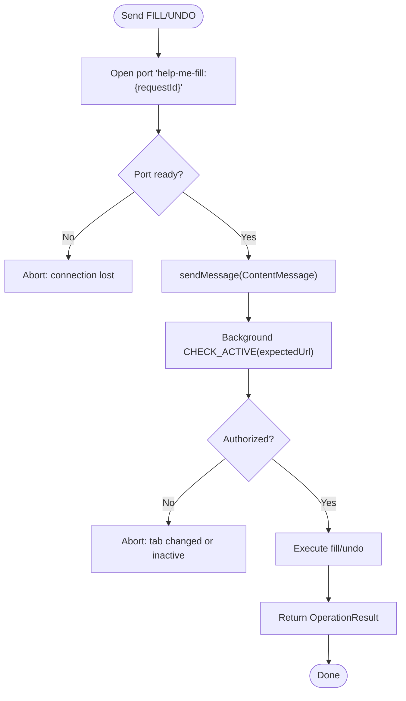
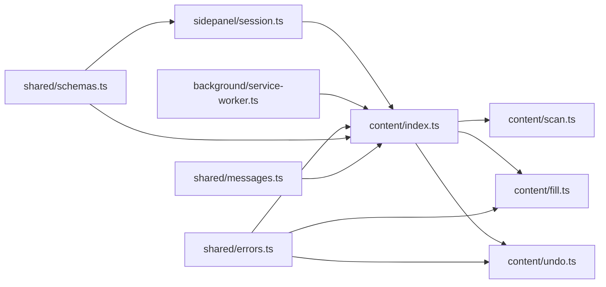

# Messaging Protocol

<cite>
**Referenced Files in This Document**
- [messages.ts](file://src/shared/messages.ts)
- [schemas.ts](file://src/shared/schemas.ts)
- [errors.ts](file://src/shared/errors.ts)
- [service-worker.ts](file://src/background/service-worker.ts)
- [index.ts](file://src/content/index.ts)
- [scan.ts](file://src/content/scan.ts)
- [fill.ts](file://src/content/fill.ts)
- [undo.ts](file://src/content/undo.ts)
- [session.ts](file://src/sidepanel/session.ts)
</cite>

## Table of Contents
1. [Introduction](#introduction)
2. [Project Structure](#project-structure)
3. [Core Components](#core-components)
4. [Architecture Overview](#architecture-overview)
5. [Detailed Component Analysis](#detailed-component-analysis)
6. [Dependency Analysis](#dependency-analysis)
7. [Performance Considerations](#performance-considerations)
8. [Troubleshooting Guide](#troubleshooting-guide)
9. [Conclusion](#conclusion)

## Introduction
This document describes the Chrome Extension messaging protocol used to coordinate operations across extension contexts: background service worker, content script (page context), and side panel (extension UI). It covers all message types (SCAN, FILL, UNDO, CLEAR, CANCEL), their payload schemas, validation constraints, request-response correlation via requestId, standardized Reply<T> responses, error handling patterns, and examples of constructing and sending messages from the side panel to the content script.

## Project Structure
The messaging protocol is defined and enforced in shared modules and implemented by the content script and side panel:
- Shared definitions: message schemas, data schemas, and error utilities
- Content script: receives messages, validates them, executes scanning/filling/undoing, and returns results
- Side panel: constructs messages, sends them to the active tab’s content script, and handles responses
- Background service worker: provides a lightweight CHECK_ACTIVE authorization check for sensitive operations



**Diagram sources**
- [session.ts:48-84](file://src/sidepanel/session.ts#L48-L84)
- [index.ts:22-69](file://src/content/index.ts#L22-L69)
- [service-worker.ts:18-28](file://src/background/service-worker.ts#L18-L28)

**Section sources**
- [messages.ts:1-20](file://src/shared/messages.ts#L1-L20)
- [schemas.ts:1-39](file://src/shared/schemas.ts#L1-L39)
- [index.ts:1-72](file://src/content/index.ts#L1-L72)
- [session.ts:1-86](file://src/sidepanel/session.ts#L1-L86)
- [service-worker.ts:1-29](file://src/background/service-worker.ts#L1-L29)

## Core Components
- Message schema: A discriminated union defines all allowed message types and payloads with strict validation.
- Data schemas: Define field descriptors, scan results, mapping plans, and operation results with size and type constraints.
- Error handling: User-facing errors are normalized into strings for consistent response payloads.
- Request correlation: Every request includes a UUID requestId; the content script caches tasks by requestId to correlate responses.
- Reply<T>: All responses follow a uniform shape { ok: true; data: T } | { ok: false; error: string }.

Key responsibilities:
- Side panel: builds requests, ensures target tab is still active, connects to content script, and parses responses.
- Content script: validates incoming messages, enforces state invariants (busy flag, registry validity), executes operations, and returns standardized replies.
- Background: authorizes that the expected tab remains active before executing or undoing writes.

**Section sources**
- [messages.ts:4-19](file://src/shared/messages.ts#L4-L19)
- [schemas.ts:3-39](file://src/shared/schemas.ts#L3-L39)
- [errors.ts:1-10](file://src/shared/errors.ts#L1-L10)
- [index.ts:22-69](file://src/content/index.ts#L22-L69)
- [session.ts:44-84](file://src/sidepanel/session.ts#L44-L84)

## Architecture Overview
The protocol uses a request-response pattern between the side panel and the content script. The side panel sends a typed message to the content script on the active tab. The content script validates the message, performs the requested operation, and responds with a Reply<T>. For write operations (FILL/UNDO), the content script also establishes a long-lived port connection to ensure the review panel remains connected throughout execution.

```mermaid
sequenceDiagram
participant SP as "Side Panel<br/>session.ts"
participant CS as "Content Script<br/>content/index.ts"
participant BG as "Background<br/>service-worker.ts"
SP->>CS : sendMessage({ type : "SCAN", requestId, expectedUrl })
CS-->>SP : Reply<Scan>
SP->>CS : connect(port name = "help-me-fill : {requestId}")
CS-->>SP : { ready : true }
SP->>CS : sendMessage({ type : "FILL", requestId, assignments, expectedUrl, scanId })
CS->>BG : sendMessage({ type : "CHECK_ACTIVE", expectedUrl })
BG-->>CS : boolean
CS-->>SP : Reply<OperationResult>
SP->>CS : sendMessage({ type : "UNDO", requestId, expectedUrl, scanId })
CS->>BG : sendMessage({ type : "CHECK_ACTIVE", expectedUrl })
BG-->>CS : boolean
CS-->>SP : Reply<OperationResult>
Note over SP,CS : CLEAR cancels ongoing work; CANCEL stops current operation
```

**Diagram sources**
- [session.ts:55-84](file://src/sidepanel/session.ts#L55-L84)
- [index.ts:22-69](file://src/content/index.ts#L22-L69)
- [service-worker.ts:18-28](file://src/background/service-worker.ts#L18-L28)

## Detailed Component Analysis

### Message Types and Payloads
All messages are validated against a discriminated union schema. Each message includes a UUID requestId for correlation. Some messages include an expectedUrl to verify the page identity.

- SCAN
  - Purpose: Discover form fields on the page and return a scan snapshot.
  - Required fields: type, requestId, expectedUrl
  - Response: Scan object containing scanId, url, fields array, and exclusions map.

- FILL
  - Purpose: Write values to previously scanned fields.
  - Required fields: type, requestId, expectedUrl, scanId, assignments
  - assignments: Array of WriteAssignment entries, each with fieldId, value, expectedValue, allowOverwrite.
  - Response: OperationResult with per-field status and canUndo flag.

- UNDO
  - Purpose: Revert previously filled values.
  - Required fields: type, requestId, expectedUrl, scanId
  - Response: OperationResult with per-field status and canUndo flag set to false.

- CLEAR
  - Purpose: Cancel any ongoing operation and reset internal state in the content script.
  - Required fields: type, requestId
  - Response: null (no data).

- CANCEL
  - Purpose: Stop the currently running operation without resetting state.
  - Required fields: type, requestId
  - Response: null (no data).

Validation constraints and limits:
- Field identifiers: min length 1, max length 100
- Values: max length defined by LIMITS.value
- Assignments array: minimum 1 entry, maximum LIMITS.fields
- URLs: max length 8192 characters
- Responses: bounded by LIMITS.responseBytes at higher layers

Reply<T> standardization:
- Success: { ok: true; data: T }
- Failure: { ok: false; error: string }

Error normalization:
- User-facing errors are wrapped and converted to user-friendly strings.
- Abort signals result in a specific canceled message.

**Section sources**
- [messages.ts:4-19](file://src/shared/messages.ts#L4-L19)
- [schemas.ts:3-39](file://src/shared/schemas.ts#L3-L39)
- [errors.ts:1-10](file://src/shared/errors.ts#L1-L10)

### Request-Response Correlation and Port Connection
- requestId correlation:
  - The side panel generates a unique requestId for each request.
  - The content script stores pending tasks keyed by requestId and resolves the corresponding Promise when the response is ready.
  - For FILL and UNDO, the task is cached to handle asynchronous completion and prevent duplicate handling.

- Port connection for write operations:
  - Before sending FILL or UNDO, the side panel opens a port named "help-me-fill:{requestId}".
  - The content script accepts only trusted ports from the side panel and emits a ready signal once connected.
  - If the port disconnects during execution, the operation is considered canceled.

- Authorization check:
  - For write operations, the content script asks the background service worker whether the expected tab remains active and matches the expected URL.
  - If not authorized, the operation is aborted.



**Diagram sources**
- [session.ts:71-84](file://src/sidepanel/session.ts#L71-L84)
- [index.ts:22-69](file://src/content/index.ts#L22-L69)
- [service-worker.ts:18-28](file://src/background/service-worker.ts#L18-L28)

**Section sources**
- [index.ts:10-21](file://src/content/index.ts#L10-L21)
- [index.ts:22-69](file://src/content/index.ts#L22-L69)
- [session.ts:48-84](file://src/sidepanel/session.ts#L48-L84)
- [service-worker.ts:18-28](file://src/background/service-worker.ts#L18-L28)

### Validation Schemas and Parameter Constraints
- Limits:
  - bytes: 10 MB
  - pages: 20
  - characters: 24,000
  - fields: 60
  - responseBytes: 256 KB
  - value: 4,000 characters

- Field descriptor constraints:
  - id: 1–100 chars
  - type: one of text, email, tel, url, textarea
  - label, ariaLabel, placeholder, context: up to 240 chars
  - name: up to 120 chars
  - required: boolean
  - maxLength: integer >= -1
  - pattern: up to 500 chars

- Mapping plan:
  - assignments: array of objects with fieldId, value, evidence array, reason
  - unmapped: array of objects with fieldId, reason

- Scan result:
  - scanId: string
  - url: string
  - fields: array of LocalField (extends FieldSchema with currentValue)
  - exclusions: record<string, number>

- Operation result:
  - results: array of FillResult with fieldId, status enum, detail string
  - canUndo: boolean

These constraints are enforced using strict Zod schemas, ensuring invalid payloads are rejected early.

**Section sources**
- [schemas.ts:3-39](file://src/shared/schemas.ts#L3-L39)

### Error Handling Patterns
- Input validation failures:
  - Invalid messages are rejected with a generic error message in the Reply payload.
- Business rule violations:
  - Examples include page changes, missing registry, duplicate field IDs, exceeding field limits, and unauthorized operations.
- Normalized errors:
  - UserError instances are converted to user-friendly strings.
  - Abort signals produce a clear cancellation message.
- Guard checks:
  - Execution guards authorize operations and detect cancellations mid-flight.
  - Registry assertions validate that the document and form structure have not changed since scanning.

**Section sources**
- [errors.ts:1-10](file://src/shared/errors.ts#L1-L10)
- [index.ts:22-69](file://src/content/index.ts#L22-L69)
- [fill.ts:42-81](file://src/content/fill.ts#L42-L81)
- [undo.ts:6-28](file://src/content/undo.ts#L6-L28)

### Examples of Proper Message Construction and Handling

- Scanning a page:
  - Construct a SCAN message with a generated requestId and the current page URL as expectedUrl.
  - Send it to the active tab’s content script.
  - Parse the response as a Reply<Scan> and validate the returned scan.url equals expectedUrl.

- Executing a fill:
  - Ensure the side panel is connected via a port named "help-me-fill:{requestId}" and received a ready signal.
  - Build a FILL message including assignments with fieldId, value, expectedValue, and allowOverwhere appropriate.
  - Include expectedUrl and scanId from the prior scan.
  - Handle the OperationResult response and update UI accordingly.

- Undoing fills:
  - Build an UNDO message with requestId, expectedUrl, and scanId.
  - Use the same port connection established for the original fill.
  - Process the OperationResult to reflect restored or reverted fields.

- Clearing or canceling:
  - Send CLEAR to abort ongoing work and reset state in the content script.
  - Send CANCEL to stop the current operation without resetting state.

Note: Avoid sending messages if the target tab has changed or if the port connection is lost. Always re-scan after detecting page changes.

**Section sources**
- [session.ts:55-84](file://src/sidepanel/session.ts#L55-L84)
- [index.ts:22-69](file://src/content/index.ts#L22-L69)

## Dependency Analysis
The messaging protocol depends on shared schemas and error utilities, and integrates with browser APIs for tabs, runtime messaging, and scripting injection.



**Diagram sources**
- [messages.ts:1-20](file://src/shared/messages.ts#L1-L20)
- [schemas.ts:1-39](file://src/shared/schemas.ts#L1-L39)
- [errors.ts:1-10](file://src/shared/errors.ts#L1-L10)
- [index.ts:1-72](file://src/content/index.ts#L1-L72)
- [session.ts:1-86](file://src/sidepanel/session.ts#L1-L86)
- [service-worker.ts:1-29](file://src/background/service-worker.ts#L1-L29)

**Section sources**
- [index.ts:1-72](file://src/content/index.ts#L1-L72)
- [session.ts:1-86](file://src/sidepanel/session.ts#L1-L86)
- [service-worker.ts:1-29](file://src/background/service-worker.ts#L1-L29)

## Performance Considerations
- Limit the number of fields processed per operation to prevent excessive DOM manipulation and memory usage.
- Validate inputs early to fail fast and avoid unnecessary work.
- Use port connections for write operations to minimize repeated messaging overhead and ensure continuity.
- Enforce size limits on payloads and responses to keep communication efficient.
- Batch operations where possible and avoid redundant scans by caching scan results until the page changes.

[No sources needed since this section provides general guidance]

## Troubleshooting Guide
Common issues and resolutions:
- Invalid message payload:
  - Cause: Missing or incorrect fields, violating schema constraints.
  - Resolution: Regenerate requestId, ensure expectedUrl matches the current page, and verify assignment constraints.

- Page changed during operation:
  - Cause: Navigation or dynamic updates invalidated the scan or field references.
  - Resolution: Re-scan the page and rebuild the mapping plan before retrying.

- Target tab inactive or changed:
  - Cause: Background authorization check failed.
  - Resolution: Ensure the correct tab is active and grant access again if necessary.

- Port connection lost:
  - Cause: Side panel closed or disconnected unexpectedly.
  - Resolution: Reconnect via a new port and retry the operation.

- Overwriting existing values:
  - Cause: expectedValue differs from current field value without explicit approval.
  - Resolution: Set allowOverwrite to true after user confirmation.

**Section sources**
- [index.ts:22-69](file://src/content/index.ts#L22-L69)
- [fill.ts:42-81](file://src/content/fill.ts#L42-L81)
- [undo.ts:6-28](file://src/content/undo.ts#L6-L28)
- [service-worker.ts:18-28](file://src/background/service-worker.ts#L18-L28)

## Conclusion
The messaging protocol provides a robust, validated, and secure way to coordinate scanning, filling, and undoing operations across extension contexts. By enforcing strict schemas, correlating requests with requestId, standardizing responses with Reply<T>, and validating target activity through the background service worker, the system ensures reliable and user-friendly interactions. Adhering to these patterns will help maintain consistency and resilience across different extension environments.