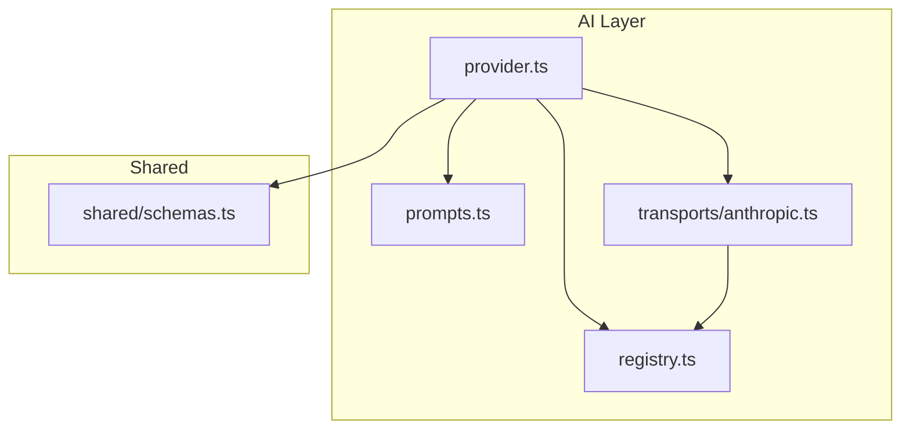
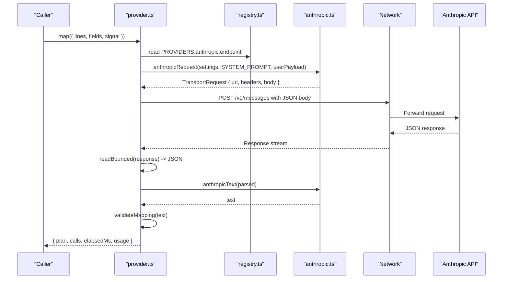
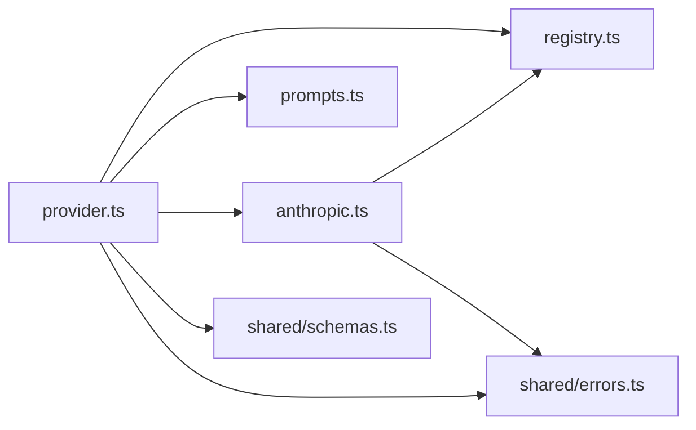

# Anthropic Transport

<cite>
**Referenced Files in This Document**
- [anthropic.ts](file://src/ai/transports/anthropic.ts)
- [provider.ts](file://src/ai/provider.ts)
- [registry.ts](file://src/ai/registry.ts)
- [prompts.ts](file://src/ai/prompts.ts)
- [schemas.ts](file://src/shared/schemas.ts)
</cite>

## Table of Contents
1. [Introduction](#introduction)
2. [Project Structure](#project-structure)
3. [Core Components](#core-components)
4. [Architecture Overview](#architecture-overview)
5. [Detailed Component Analysis](#detailed-component-analysis)
6. [Dependency Analysis](#dependency-analysis)
7. [Performance Considerations](#performance-considerations)
8. [Troubleshooting Guide](#troubleshooting-guide)
9. [Conclusion](#conclusion)

## Introduction
This document explains the Anthropic transport implementation used to communicate with Anthropic’s API for form-filling tasks. It focuses on how requests are built, how messages and system prompts are formatted, how responses are parsed, and how usage metadata is captured. It also provides setup guidance, authentication details, and troubleshooting tips for common issues encountered when using the Anthropic provider.

## Project Structure
The Anthropic transport lives under the AI transports layer and integrates with a provider orchestration module that builds requests, executes them via fetch, extracts text, validates mapping output, and collects usage metrics.

**Diagram sources**
- [provider.ts:1-107](file://src/ai/provider.ts#L1-L107)
- [registry.ts:1-13](file://src/ai/registry.ts#L1-L13)
- [prompts.ts:1-26](file://src/ai/prompts.ts#L1-L26)
- [anthropic.ts:1-17](file://src/ai/transports/anthropic.ts#L1-L17)
- [schemas.ts:1-39](file://src/shared/schemas.ts#L1-L39)

**Section sources**
- [provider.ts:1-107](file://src/ai/provider.ts#L1-L107)
- [registry.ts:1-13](file://src/ai/registry.ts#L1-L13)
- [prompts.ts:1-26](file://src/ai/prompts.ts#L1-L26)
- [anthropic.ts:1-17](file://src/ai/transports/anthropic.ts#L1-L17)
- [schemas.ts:1-39](file://src/shared/schemas.ts#L1-L39)

## Core Components
- anthropicRequest(settings, system, user): Builds an HTTP request payload for Anthropic’s Messages API. It sets the endpoint, headers (including API key and version), model, system prompt, max tokens, message array, and disables streaming.
- anthropicText(data): Parses the response from Anthropic, validates content blocks, and returns the concatenated text. It enforces expected structure and throws a descriptive error if the response is invalid or truncated.

Key responsibilities:
- Message formatting: The function constructs a single-user message array containing the user payload.
- System prompt handling: The system prompt is passed as a separate field in the request body.
- Response extraction: The function expects a stop reason indicating completion and an array of content blocks of type text. It concatenates all text blocks into one string.

**Section sources**
- [anthropic.ts:3-16](file://src/ai/transports/anthropic.ts#L3-L16)

## Architecture Overview
The provider orchestrates the full flow: building the request, making the network call, reading bounded responses, extracting text via the appropriate transport, validating the mapping result, and returning usage information.

**Diagram sources**
- [provider.ts:19-105](file://src/ai/provider.ts#L19-L105)
- [registry.ts:1-13](file://src/ai/registry.ts#L1-L13)
- [anthropic.ts:3-16](file://src/ai/transports/anthropic.ts#L3-L16)
- [prompts.ts:4-16](file://src/ai/prompts.ts#L4-L16)

## Detailed Component Analysis

### anthropicRequest
Purpose:
- Constructs a request object conforming to Anthropic’s Messages API format.
- Sets required headers including the API key and API version.
- Includes the system prompt and a single user message containing the serialized payload.
- Configures model, token limits, and disables streaming for this use case.

Message formatting:
- Uses a messages array with one entry having role “user” and content set to the user payload string.
- System prompt is provided as a top-level field in the request body.

Response configuration:
- Disables streaming by setting stream to false.
- Sets max_tokens to a fixed upper bound suitable for the task.

Headers:
- x-api-key: taken from settings.apiKey.
- anthropic-version: pinned to a specific API version.
- anthropropic-dangerous-direct-browser-access: enabled to allow direct browser calls to the API endpoint.

**Section sources**
- [anthropic.ts:3-9](file://src/ai/transports/anthropic.ts#L3-L9)
- [registry.ts:1-6](file://src/ai/registry.ts#L1-L6)

### anthropicText
Purpose:
- Validates and extracts textual content from the Anthropic response.
- Enforces that the response indicates a completed turn and contains only supported text content blocks.

Validation rules:
- Expects stop_reason to indicate completion.
- Expects content to be an array where every block has type “text”.
- Concatenates all block.text values into a single string.

Error behavior:
- Throws a user-facing error if the response is missing, truncated, or contains unsupported content types.

**Section sources**
- [anthropic.ts:10-16](file://src/ai/transports/anthropic.ts#L10-L16)

### Provider Integration
The provider module selects the correct transport based on settings.provider and routes both request construction and response parsing accordingly. For Anthropic:
- buildRequest delegates to anthropicRequest.
- extractText delegates to anthropicText.
- usageNumbers reads usage or usageMetadata from the response and filters numeric entries.

Request lifecycle highlights:
- Validates settings and input sizes against shared limits.
- Serializes the user payload using makePayload from prompts.
- Sends a POST request with Content-Type application/json and strict security headers.
- Reads the response body with a size limit and parses JSON.
- Extracts text, validates mapping, and returns results with timing and usage.

**Section sources**
- [provider.ts:19-33](file://src/ai/provider.ts#L19-L33)
- [provider.ts:52-105](file://src/ai/provider.ts#L52-L105)
- [prompts.ts:23-25](file://src/ai/prompts.ts#L23-L25)
- [schemas.ts:1-3](file://src/shared/schemas.ts#L1-L3)

## Dependency Analysis
- anthropic.ts depends on registry for the provider endpoint and on shared errors for throwing user errors.
- provider.ts depends on registry, prompts, transports (including anthropic), shared schemas, and shared errors.
- prompts.ts defines the system prompt and payload builder used by the provider.
- schemas.ts defines limits and validation schemas used across the provider pipeline.

**Diagram sources**
- [anthropic.ts:1-17](file://src/ai/transports/anthropic.ts#L1-L17)
- [provider.ts:1-107](file://src/ai/provider.ts#L1-L107)
- [registry.ts:1-13](file://src/ai/registry.ts#L1-L13)
- [prompts.ts:1-26](file://src/ai/prompts.ts#L1-L26)
- [schemas.ts:1-39](file://src/shared/schemas.ts#L1-L39)

**Section sources**
- [anthropic.ts:1-17](file://src/ai/transports/anthropic.ts#L1-L17)
- [provider.ts:1-107](file://src/ai/provider.ts#L1-L107)
- [registry.ts:1-13](file://src/ai/registry.ts#L1-L13)
- [prompts.ts:1-26](file://src/ai/prompts.ts#L1-L26)
- [schemas.ts:1-39](file://src/shared/schemas.ts#L1-L39)

## Performance Considerations
- Streaming is disabled; responses are fully buffered and then parsed. This simplifies parsing but increases memory usage proportional to response size.
- Response size is bounded to prevent excessive memory consumption; exceeding the limit triggers cancellation and an error.
- Input size is constrained by shared limits for characters and fields to keep payloads manageable.
- Timeouts are enforced to avoid hanging requests; timeouts do not trigger automatic retries.

[No sources needed since this section provides general guidance]

## Troubleshooting Guide
Common issues and resolutions:
- Invalid or missing API key: Ensure the API key is present, contains no spaces, and matches your provider account. The provider validates key format and length before sending requests.
- Authentication failures (401/403): Check the API key, account permissions, and browser access policy. The provider surfaces a clear message for these cases.
- Rate limiting or quota exceeded (429): Wait before retrying or adjust usage patterns. The provider includes guidance in the error message.
- Model ID or JSON support issues (400/404): Verify the model ID exists and supports JSON output for the selected provider.
- Truncated or unsupported response: If the response lacks the expected stop reason or contains non-text content blocks, the transport will throw a descriptive error. Reduce document size or adjust the model.
- Network or CORS issues: Ensure the extension or environment allows requests to the provider origin. The provider uses strict security headers and omits credentials.

Usage metadata:
- Usage numbers are extracted from either usage or usageMetadata in the response, filtering only numeric entries. This enables tracking token usage per call.

**Section sources**
- [provider.ts:15-18](file://src/ai/provider.ts#L15-L18)
- [provider.ts:77-83](file://src/ai/provider.ts#L77-L83)
- [provider.ts:34-51](file://src/ai/provider.ts#L34-L51)
- [provider.ts:27-33](file://src/ai/provider.ts#L27-L33)
- [anthropic.ts:10-16](file://src/ai/transports/anthropic.ts#L10-L16)

## Conclusion
The Anthropic transport provides a focused integration with Anthropic’s Messages API for form-filling tasks. It formats requests with a system prompt and a single user message, enforces safe response parsing, and integrates tightly with the provider layer for validation, error handling, and usage tracking. By following the setup and troubleshooting guidance, you can reliably use Anthropic as a backend for mapping document content to web form fields.