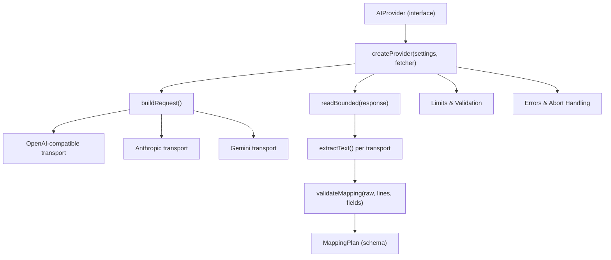
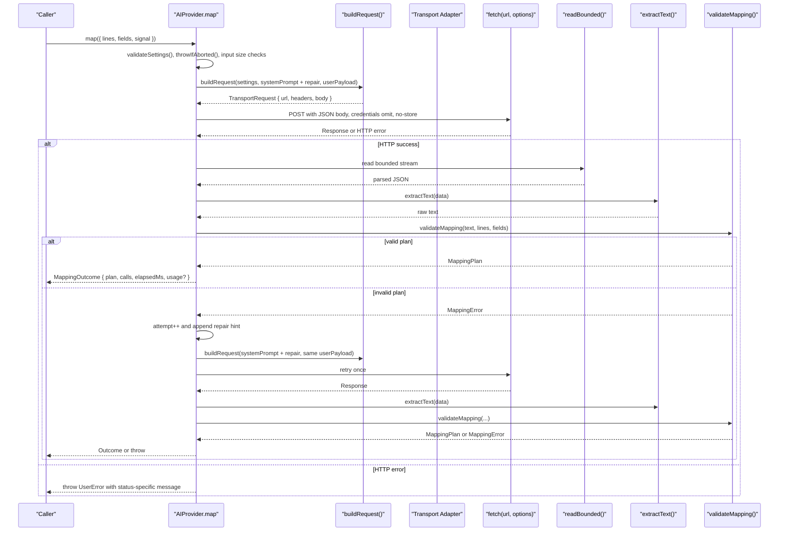
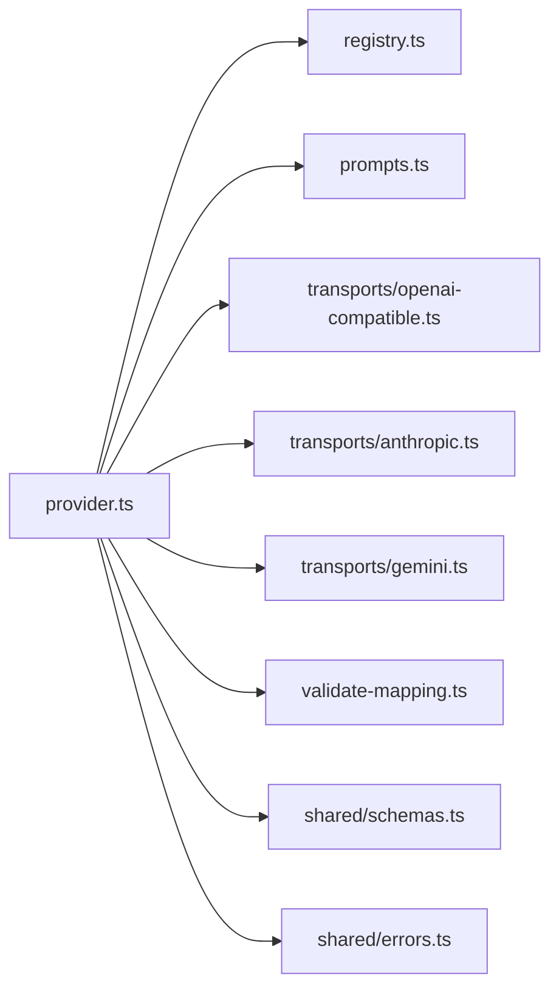

# Core Provider Interface

<cite>
**Referenced Files in This Document**
- [provider.ts](file://src/ai/provider.ts)
- [registry.ts](file://src/ai/registry.ts)
- [openai-compatible.ts](file://src/ai/transports/openai-compatible.ts)
- [anthropic.ts](file://src/ai/transports/anthropic.ts)
- [gemini.ts](file://src/ai/transports/gemini.ts)
- [validate-mapping.ts](file://src/ai/validate-mapping.ts)
- [schemas.ts](file://src/shared/schemas.ts)
- [errors.ts](file://src/shared/errors.ts)
- [prompts.ts](file://src/ai/prompts.ts)
- [providers.test.ts](file://tests/unit/providers.test.ts)
- [mapping.test.ts](file://tests/unit/mapping.test.ts)
</cite>

## Table of Contents
1. Introduction
2. Project Structure
3. Core Components
4. Architecture Overview
5. Detailed Component Analysis
6. Dependency Analysis
7. Performance Considerations
8. Troubleshooting Guide
9. Conclusion

## Introduction
This document describes the core AI provider interface that defines the contract for all AI service implementations used to map document content into form fields. It focuses on:
- The AIProvider interface and its map method
- The MappingRequest and MappingOutcome types
- The createProvider factory function
- Request/response flow, validation, error handling, and retry logic
- How different providers implement the interface via transport adapters
- Examples of handling timeouts, rate limits, invalid responses, and refusals

## Project Structure
The provider system is organized around a single interface and a factory that wires together transports, prompts, validation, and shared limits.

**Diagram sources**
- [provider.ts:11-106](file://src/ai/provider.ts#L11-L106)
- [registry.ts:1-13](file://src/ai/registry.ts#L1-L13)
- [openai-compatible.ts:4-21](file://src/ai/transports/openai-compatible.ts#L4-L21)
- [anthropic.ts:3-16](file://src/ai/transports/anthropic.ts#L3-L16)
- [gemini.ts:3-20](file://src/ai/transports/gemini.ts#L3-L20)
- [validate-mapping.ts:7-32](file://src/ai/validate-mapping.ts#L7-L32)
- [schemas.ts:1-39](file://src/shared/schemas.ts#L1-L39)
- [errors.ts:1-10](file://src/shared/errors.ts#L1-L10)

**Section sources**
- [provider.ts:11-106](file://src/ai/provider.ts#L11-L106)
- [registry.ts:1-13](file://src/ai/registry.ts#L1-L13)

## Core Components
- AIProvider interface: Defines a single map(request) method returning a promise of MappingOutcome.
- MappingRequest: Input payload containing document lines, field descriptors, and an AbortSignal.
- MappingOutcome: Output including the validated mapping plan, number of calls made, elapsed time, and optional usage metrics.
- createProvider(settings, fetcher): Factory that returns an AIProvider implementation with request building, transport dispatch, response reading, extraction, validation, retry, and error handling.
- Transport adapters: openai-compatible, anthropic, gemini each provide buildRequest and extractText functions tailored to their API shapes.
- Validation: validateMapping enforces schema, evidence grounding, uniqueness, and length constraints using shared schemas and limits.
- Shared utilities: Limits, errors, abort signaling, and prompt composition.

**Section sources**
- [provider.ts:11-13](file://src/ai/provider.ts#L11-L13)
- [provider.ts:52-106](file://src/ai/provider.ts#L52-L106)
- [registry.ts:1-13](file://src/ai/registry.ts#L1-L13)
- [validate-mapping.ts:7-32](file://src/ai/validate-mapping.ts#L7-L32)
- [schemas.ts:1-39](file://src/shared/schemas.ts#L1-L39)
- [errors.ts:1-10](file://src/shared/errors.ts#L1-L10)
- [prompts.ts:4-25](file://src/ai/prompts.ts#L4-L25)

## Architecture Overview
The provider architecture separates concerns across layers:
- Interface layer: AIProvider.map abstracts provider specifics.
- Orchestration layer: createProvider coordinates settings validation, input validation, request construction, network call, response bounds checking, text extraction, and mapping validation.
- Transport layer: Each provider adapter builds a provider-specific request and extracts text from provider-specific responses.
- Validation layer: validateMapping ensures outputs are safe, grounded, and complete.

**Diagram sources**
- [provider.ts:52-106](file://src/ai/provider.ts#L52-L106)
- [openai-compatible.ts:4-21](file://src/ai/transports/openai-compatible.ts#L4-L21)
- [anthropic.ts:3-16](file://src/ai/transports/anthropic.ts#L3-L16)
- [gemini.ts:3-20](file://src/ai/transports/gemini.ts#L3-L20)
- [validate-mapping.ts:7-32](file://src/ai/validate-mapping.ts#L7-L32)

## Detailed Component Analysis

### AIProvider Interface and Types
- AIProvider.map(request): Accepts MappingRequest and returns Promise<MappingOutcome>.
- MappingRequest:
  - lines: Array of document lines with id, page, text.
  - fields: Field descriptors describing target form fields.
  - signal: AbortSignal to cancel ongoing work.
- MappingOutcome:
  - plan: Validated MappingPlan with assignments and unmapped fields.
  - calls: Number of provider calls made (including one retry).
  - elapsedMs: Time spent in map.
  - usage?: Optional token usage metrics extracted from provider response.

**Section sources**
- [provider.ts:11-13](file://src/ai/provider.ts#L11-L13)
- [schemas.ts:15-24](file://src/shared/schemas.ts#L15-L24)

### createProvider Factory
Responsibilities:
- Snapshot settings to avoid rerouting mid-request.
- Validate settings and inputs (field count, character limit).
- Build request using selected transport.
- Enforce timeout and abort semantics.
- Read bounded response to prevent memory issues.
- Extract text based on transport.
- Validate mapping output; if invalid, retry once with a diagnostic appended to the system prompt.
- Return MappingOutcome with timing and usage.

Key behaviors:
- Timeout: 60 seconds; throws a specific error without automatic retry.
- Aborts: Checks at multiple points; throws AbortError when canceled.
- HTTP errors: Non-OK responses throw UserError with messages tailored to status codes (e.g., 401/403, 429, 400/404).
- Retry: Only on validation failure (MappingError), not on network or HTTP errors.
- Safety: Does not echo untrusted model output back to the provider during repair; only appends a diagnostic string to the system prompt.

**Section sources**
- [provider.ts:15-26](file://src/ai/provider.ts#L15-L26)
- [provider.ts:34-51](file://src/ai/provider.ts#L34-L51)
- [provider.ts:52-106](file://src/ai/provider.ts#L52-L106)

### Transport Adapters
Each adapter provides:
- buildRequest(settings, system, user): Returns TransportRequest with URL, headers, and body.
- extractText(data): Validates provider response shape and returns a plain text string.

OpenAI-compatible:
- Uses Authorization header and JSON object response format.
- Expects finish_reason stop and non-refused content.

Anthropic:
- Uses x-api-key header and versioning headers.
- Expects end_turn and text blocks.

Gemini:
- Encodes model name and uses generateContent endpoint.
- Expects STOP finishReason and text parts.

**Section sources**
- [openai-compatible.ts:4-21](file://src/ai/transports/openai-compatible.ts#L4-L21)
- [anthropic.ts:3-16](file://src/ai/transports/anthropic.ts#L3-L16)
- [gemini.ts:3-20](file://src/ai/transports/gemini.ts#L3-L20)

### Validation Mechanisms
validateMapping enforces:
- Size limit on raw output.
- Valid JSON parse.
- Schema compliance (assignments and unmapped arrays).
- All fields accounted for (no duplicates, no unknown IDs).
- Evidence grounding: quotes must exist on cited lines and support proposed values.
- Length constraints per field.

MappingError is thrown for any validation failure and triggers a single retry with a diagnostic appended to the system prompt.

**Section sources**
- [validate-mapping.ts:7-32](file://src/ai/validate-mapping.ts#L7-L32)
- [schemas.ts:1-39](file://src/shared/schemas.ts#L1-L39)

### Error Handling Patterns
- UserError: Used for user-facing errors (invalid settings, bad input, provider errors).
- AbortError: Thrown when AbortSignal is triggered; no new request started.
- Network failures: Throw a generic reachability error; no retry.
- HTTP status codes:
  - 401/403: Authentication/access issues.
  - 429: Rate limit/quota reached.
  - 400/404: Model or endpoint mismatch.
  - Others: Generic unavailability.
- Refusals/truncations: Transport extractors reject unsupported or truncated responses immediately.

**Section sources**
- [errors.ts:1-10](file://src/shared/errors.ts#L1-L10)
- [provider.ts:77-100](file://src/ai/provider.ts#L77-L100)
- [openai-compatible.ts:14-21](file://src/ai/transports/openai-compatible.ts#L14-L21)
- [anthropic.ts:10-16](file://src/ai/transports/anthropic.ts#L10-L16)
- [gemini.ts:13-20](file://src/ai/transports/gemini.ts#L13-L20)

### Retry Logic
- Automatic retry occurs only once after a MappingError during validateMapping.
- The retry does not resend the untrusted model output; it reuses the original user payload and appends a diagnostic to the system prompt.
- No retries for network errors, HTTP errors, timeouts, or refusals.

**Section sources**
- [provider.ts:87-94](file://src/ai/provider.ts#L87-L94)
- [validate-mapping.ts:7-32](file://src/ai/validate-mapping.ts#L7-L32)

### Request/Response Flow Examples
- Successful mapping: One call, validated plan returned with usage metrics if present.
- Invalid JSON or schema: One retry with diagnostic; if still invalid, throws MappingError.
- Rate limit (429): Throws UserError with guidance; no retry.
- Timeout (>60s): Throws UserError indicating timeout; no retry.
- Oversized response: Throws UserError indicating response exceeded limit.

These flows are verified by unit tests covering safety, failures, timeouts, and refusal handling.

**Section sources**
- [providers.test.ts:22-68](file://tests/unit/providers.test.ts#L22-L68)

## Dependency Analysis
The provider depends on:
- Registry for provider metadata and transport selection.
- Prompts for system instructions and payload construction.
- Transports for request shaping and response parsing.
- Validation for schema enforcement and grounding checks.
- Shared schemas for limits and data models.
- Errors for consistent error types and abort handling.

**Diagram sources**
- [provider.ts:1-10](file://src/ai/provider.ts#L1-L10)
- [registry.ts:1-13](file://src/ai/registry.ts#L1-L13)
- [prompts.ts:1-26](file://src/ai/prompts.ts#L1-L26)
- [openai-compatible.ts:1-22](file://src/ai/transports/openai-compatible.ts#L1-L22)
- [anthropic.ts:1-17](file://src/ai/transports/anthropic.ts#L1-L17)
- [gemini.ts:1-21](file://src/ai/transports/gemini.ts#L1-L21)
- [validate-mapping.ts:1-33](file://src/ai/validate-mapping.ts#L1-L33)
- [schemas.ts:1-39](file://src/shared/schemas.ts#L1-L39)
- [errors.ts:1-10](file://src/shared/errors.ts#L1-L10)

**Section sources**
- [provider.ts:1-10](file://src/ai/provider.ts#L1-L10)
- [registry.ts:1-13](file://src/ai/registry.ts#L1-L13)

## Performance Considerations
- Bounded response reading prevents memory exhaustion by enforcing a maximum response size.
- Short-circuit validations reduce unnecessary network calls (empty or oversized inputs).
- Single retry minimizes extra requests while improving robustness against transient validation issues.
- Usage metrics are captured when available to aid monitoring and cost tracking.

[No sources needed since this section provides general guidance]

## Troubleshooting Guide
Common issues and resolutions:
- Invalid settings: Ensure model ID and API key meet format and length requirements.
- Empty or too large input: Reduce document size or field count within limits.
- Provider refused or truncated response: Use a supported text model or shorten the document.
- Rate limit or quota reached: Wait before retrying or adjust account quotas.
- Network unreachable: Check browser permissions and network access to provider endpoints.
- Timeout: Increase client-side timeout policy or reduce input size; no automatic retry is performed.
- Invalid mapping output: Review model behavior; the system will retry once with a diagnostic appended to the system prompt.

**Section sources**
- [provider.ts:15-18](file://src/ai/provider.ts#L15-L18)
- [provider.ts:58-60](file://src/ai/provider.ts#L58-L60)
- [provider.ts:77-100](file://src/ai/provider.ts#L77-L100)
- [openai-compatible.ts:14-21](file://src/ai/transports/openai-compatible.ts#L14-L21)
- [anthropic.ts:10-16](file://src/ai/transports/anthropic.ts#L10-L16)
- [gemini.ts:13-20](file://src/ai/transports/gemini.ts#L13-L20)
- [validate-mapping.ts:7-32](file://src/ai/validate-mapping.ts#L7-L32)

## Conclusion
The AIProvider interface standardizes how different AI services are invoked and validated. The createProvider factory encapsulates request construction, transport abstraction, bounded response handling, strict validation, and controlled retry logic. Together, these components ensure safe, predictable, and efficient mapping of document content into form fields across multiple providers.

[No sources needed since this section summarizes without analyzing specific files]