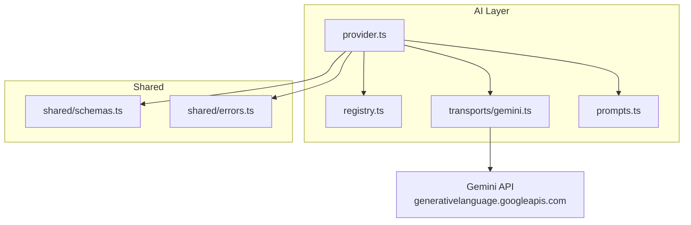
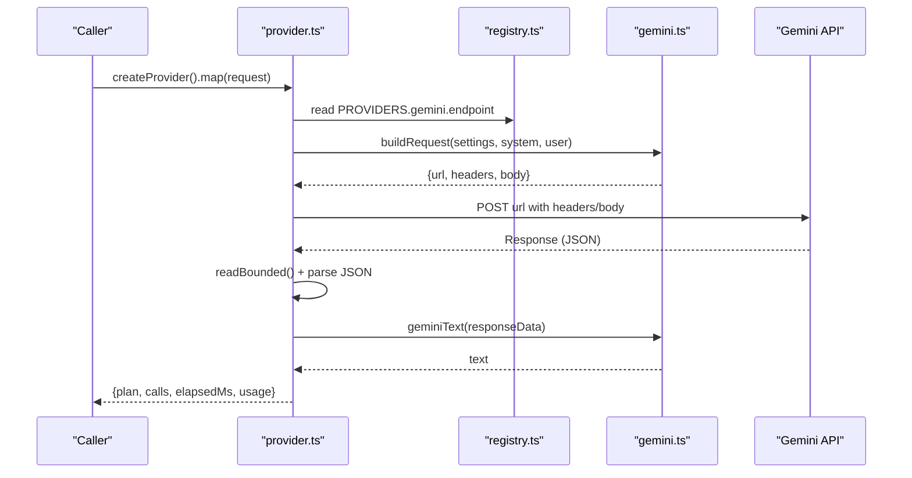
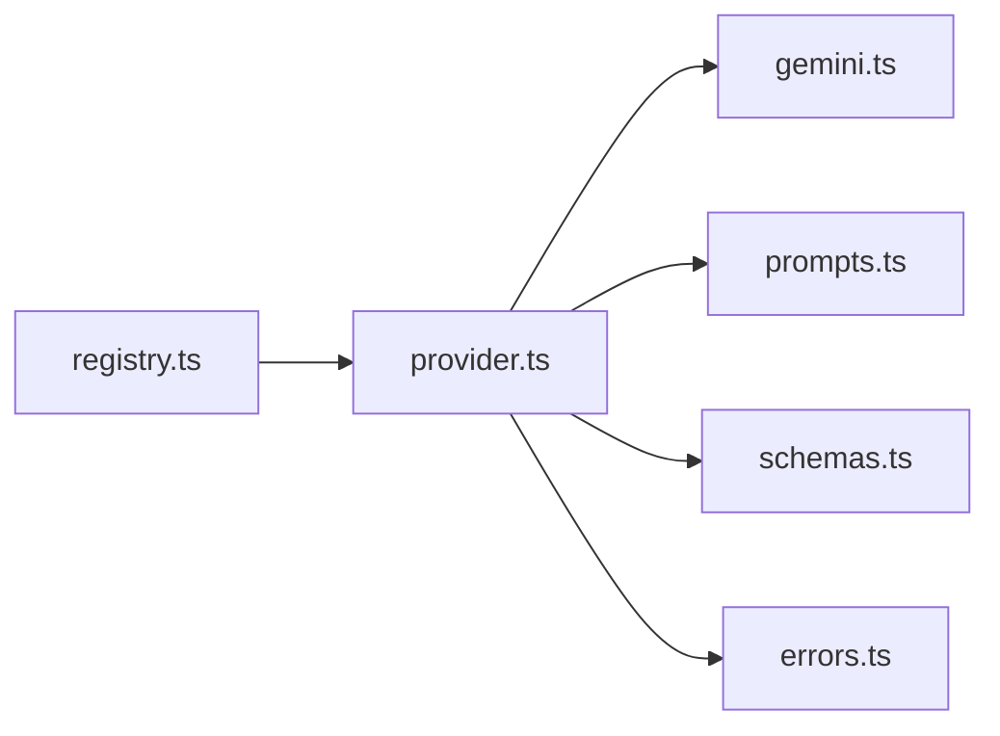

# Gemini Transport

<cite>
**Referenced Files in This Document**
- [gemini.ts](file://src/ai/transports/gemini.ts)
- [provider.ts](file://src/ai/provider.ts)
- [registry.ts](file://src/ai/registry.ts)
- [prompts.ts](file://src/ai/prompts.ts)
- [schemas.ts](file://src/shared/schemas.ts)
- [errors.ts](file://src/shared/errors.ts)
</cite>

## Table of Contents
1. [Introduction](#introduction)
2. [Project Structure](#project-structure)
3. [Core Components](#core-components)
4. [Architecture Overview](#architecture-overview)
5. [Detailed Component Analysis](#detailed-component-analysis)
6. [Dependency Analysis](#dependency-analysis)
7. [Performance Considerations](#performance-considerations)
8. [Troubleshooting Guide](#troubleshooting-guide)
9. [Conclusion](#conclusion)
10. [Appendices](#appendices)

## Introduction
This document explains the Google Gemini transport implementation used to call Google’s Gemini API for form-filling tasks. It focuses on how requests are built and responses processed, with emphasis on model configuration, generation config, safety considerations, and usage metadata handling. It also provides setup guidance, authentication procedures, and best practices for optimizing calls to the Gemini API within this codebase.

## Project Structure
The Gemini transport is part of a multi-provider AI layer that standardizes provider interactions. The key files involved are:
- Transport-specific request/response logic for Gemini
- Provider orchestration that selects the correct transport based on settings
- Registry defining provider endpoints and transport names
- Prompt construction and payload building
- Shared schemas and error utilities

**Diagram sources**
- [provider.ts:19-26](file://src/ai/provider.ts#L19-L26)
- [registry.ts:1-6](file://src/ai/registry.ts#L1-L6)
- [gemini.ts:3-11](file://src/ai/transports/gemini.ts#L3-L11)
- [prompts.ts:4-25](file://src/ai/prompts.ts#L4-L25)
- [schemas.ts:1-39](file://src/shared/schemas.ts#L1-L39)
- [errors.ts:1-10](file://src/shared/errors.ts#L1-L10)

**Section sources**
- [provider.ts:19-26](file://src/ai/provider.ts#L19-L26)
- [registry.ts:1-6](file://src/ai/registry.ts#L1-L6)
- [gemini.ts:3-11](file://src/ai/transports/gemini.ts#L3-L11)
- [prompts.ts:4-25](file://src/ai/prompts.ts#L4-L25)
- [schemas.ts:1-39](file://src/shared/schemas.ts#L1-L39)
- [errors.ts:1-10](file://src/shared/errors.ts#L1-L10)

## Core Components
- geminiRequest: Builds a Gemini API request tailored for JSON output using system instructions and user content.
- geminiText: Extracts the final text from Gemini’s response, filtering out internal “thought” parts and validating completion status.
- Provider orchestration: Chooses the Gemini transport based on settings and handles retries, timeouts, and usage extraction.

Key responsibilities:
- Constructing the correct endpoint URL and headers for Gemini
- Setting generationConfig for JSON mode and token limits
- Parsing and validating Gemini responses
- Integrating with shared limits and error handling

**Section sources**
- [gemini.ts:3-20](file://src/ai/transports/gemini.ts#L3-L20)
- [provider.ts:19-26](file://src/ai/provider.ts#L19-L26)
- [provider.ts:27-33](file://src/ai/provider.ts#L27-L33)
- [provider.ts:52-105](file://src/ai/provider.ts#L52-L105)

## Architecture Overview
The flow starts with the provider layer, which builds a transport-specific request and executes it via fetch. For Gemini, the request includes a system instruction and user content, along with generationConfig to enforce JSON output. The response is bounded, parsed, and passed through geminiText to extract the final string. Usage metadata is extracted when available.

**Diagram sources**
- [provider.ts:52-105](file://src/ai/provider.ts#L52-L105)
- [registry.ts:1-6](file://src/ai/registry.ts#L1-L6)
- [gemini.ts:3-20](file://src/ai/transports/gemini.ts#L3-L20)

## Detailed Component Analysis

### geminiRequest
Purpose:
- Normalizes the model ID by removing any leading “models/” prefix and encoding it for safe URL usage.
- Constructs the Gemini endpoint URL using the registry’s endpoint and the :generateContent method.
- Sets the Authorization header via x-goog-api-key from settings.apiKey.
- Builds the request body with:
  - systemInstruction containing the system prompt as a text part
  - contents array with a user role and text part
  - generationConfig specifying JSON mime type and maxOutputTokens

Model configuration:
- Model selection is driven by settings.model; the function ensures compatibility with the expected path format.

Generation config:
- responseMimeType set to application/json to enforce structured output suitable for downstream validation.
- maxOutputTokens set to a fixed limit to control response size.

Safety settings:
- No explicit safetySettings are included in the request body here. Safety controls would need to be added at the request level if required by your use case.

Headers and authentication:
- Uses x-goog-api-key header populated from settings.apiKey. Ensure the key has appropriate permissions and is scoped correctly.

Error considerations:
- If the model or endpoint is invalid, errors will surface upstream during fetch and be handled by the provider layer.

**Section sources**
- [gemini.ts:3-11](file://src/ai/transports/gemini.ts#L3-L11)
- [registry.ts:1-6](file://src/ai/registry.ts#L1-L6)

### geminiText
Purpose:
- Safely extracts the final text from Gemini’s response structure.
- Validates that the first candidate finished successfully and contains an array of parts.
- Filters out internal “thought” parts and concatenates remaining text parts into a single string.

Response processing details:
- Reads candidates[0] and checks finishReason to ensure STOP.
- Ensures content.parts exists and is an array.
- Ignores parts where thought is true to avoid including internal reasoning in the final output.
- Throws a UserError if the response is refused or truncated.

Usage metadata:
- Extraction of usage metadata occurs in the provider layer, not here. See usageNumbers for details.

**Section sources**
- [gemini.ts:13-20](file://src/ai/transports/gemini.ts#L13-L20)
- [errors.ts:1-10](file://src/shared/errors.ts#L1-L10)

### Provider Orchestration for Gemini
Responsibilities:
- Selects the Gemini transport based on settings.provider.
- Builds the request using geminiRequest and executes it via fetch with robust error handling.
- Enforces response size limits and parses JSON safely.
- Extracts text via geminiText and validates mapping output.
- Captures usage metadata when present in the response.

Timeouts and retries:
- Implements a 60-second timeout per request.
- Allows one retry attempt if the initial mapping validation fails, appending diagnostic context to the system prompt.

Usage metadata extraction:
- Supports both usage and usageMetadata fields from provider responses, filtering to numeric values only.

**Section sources**
- [provider.ts:19-26](file://src/ai/provider.ts#L19-L26)
- [provider.ts:27-33](file://src/ai/provider.ts#L27-L33)
- [provider.ts:34-51](file://src/ai/provider.ts#L34-L51)
- [provider.ts:52-105](file://src/ai/provider.ts#L52-L105)

### System Prompt and Payload Construction
- SYSTEM_PROMPT defines strict rules for returning JSON assignments and unmapped fields, emphasizing verbatim values, evidence quoting, and preserving formats.
- makePayload serializes document lines and field descriptors into a compact payload sent to the model.

Best practices:
- Keep payloads within character limits defined in schemas.
- Avoid injecting untrusted instructions into the system prompt beyond what is necessary.

**Section sources**
- [prompts.ts:4-25](file://src/ai/prompts.ts#L4-L25)
- [schemas.ts:1-39](file://src/shared/schemas.ts#L1-L39)

## Dependency Analysis
The Gemini transport depends on:
- Registry for provider endpoint resolution
- Provider orchestration for execution, timeouts, and error handling
- Shared schemas for input/output constraints
- Error utilities for consistent error messaging

**Diagram sources**
- [registry.ts:1-6](file://src/ai/registry.ts#L1-L6)
- [provider.ts:1-10](file://src/ai/provider.ts#L1-L10)
- [gemini.ts:1-2](file://src/ai/transports/gemini.ts#L1-L2)
- [prompts.ts:1-2](file://src/ai/prompts.ts#L1-L2)
- [schemas.ts:1-3](file://src/shared/schemas.ts#L1-L3)
- [errors.ts:1-10](file://src/shared/errors.ts#L1-L10)

**Section sources**
- [registry.ts:1-6](file://src/ai/registry.ts#L1-L6)
- [provider.ts:1-10](file://src/ai/provider.ts#L1-L10)
- [gemini.ts:1-2](file://src/ai/transports/gemini.ts#L1-L2)
- [prompts.ts:1-2](file://src/ai/prompts.ts#L1-L2)
- [schemas.ts:1-3](file://src/shared/schemas.ts#L1-L3)
- [errors.ts:1-10](file://src/shared/errors.ts#L1-L10)

## Performance Considerations
- Token budget: maxOutputTokens is set to a fixed value to cap response length. Adjust based on expected output size and model capabilities.
- Response size limit: The provider enforces a maximum response byte size to prevent memory issues.
- Timeout: A 60-second timeout prevents long-running requests; consider tuning based on network conditions and model latency.
- Payload size: Respect character and field limits to avoid truncation or validation failures.
- Retry strategy: One automatic retry is performed only when mapping validation fails; subsequent failures require explicit retries.

[No sources needed since this section provides general guidance]

## Troubleshooting Guide
Common issues and resolutions:
- Invalid model ID: Ensure settings.model matches a supported Gemini model and does not include extra prefixes unless normalized by the transport.
- API key problems: Verify x-goog-api-key is set correctly and has sufficient permissions. Check account access and browser-access policies.
- Rate limits or quotas: Handle 429 responses by waiting or adjusting request frequency.
- Truncated or refused responses: geminiText throws a UserError when finishReason is not STOP or parts are missing. Shorten documents or adjust prompts.
- Network or CORS issues: Errors indicate unreachable providers or permission restrictions; verify network access and host permissions.
- Excessive response size: Responses exceeding limits are rejected; reduce input size or tighten generationConfig.

Error handling highlights:
- UserError messages provide actionable feedback for invalid inputs, timeouts, and provider errors.
- Abort signals cancel ongoing operations cleanly.

**Section sources**
- [provider.ts:77-100](file://src/ai/provider.ts#L77-L100)
- [gemini.ts:13-20](file://src/ai/transports/gemini.ts#L13-L20)
- [errors.ts:1-10](file://src/shared/errors.ts#L1-L10)

## Conclusion
The Gemini transport integrates tightly with the provider layer to deliver reliable, structured outputs for form-filling tasks. By configuring generationConfig for JSON mode and enforcing token and response limits, it balances performance and correctness. Authentication is handled via an API key header, and response parsing ensures only valid, complete outputs proceed to validation. Following the best practices outlined here will help optimize reliability and efficiency when calling the Gemini API.

[No sources needed since this section summarizes without analyzing specific files]

## Appendices

### Setup Guidance
- Provider selection: Configure settings.provider to use the Gemini provider.
- Model configuration: Set settings.model to a supported Gemini model identifier.
- Authentication: Provide a valid API key in settings.apiKey; it will be sent as x-goog-api-key.
- Endpoint resolution: The registry resolves the correct Gemini endpoint for generateContent.

**Section sources**
- [registry.ts:1-6](file://src/ai/registry.ts#L1-L6)
- [gemini.ts:3-11](file://src/ai/transports/gemini.ts#L3-L11)

### Best Practices for Optimizing Gemini API Calls
- Use JSON mode: generationConfig.responseMimeType set to application/json ensures predictable, parseable output.
- Control output size: Adjust maxOutputTokens to match expected response length while staying within model limits.
- Keep prompts concise: The system prompt enforces strict output shapes; keep user payloads focused and within character limits.
- Monitor usage: Extract usage metadata when available to track token consumption and refine limits.
- Handle errors gracefully: Implement retries for transient failures and provide clear user feedback for configuration issues.

**Section sources**
- [gemini.ts:3-11](file://src/ai/transports/gemini.ts#L3-L11)
- [provider.ts:27-33](file://src/ai/provider.ts#L27-L33)
- [schemas.ts:1-39](file://src/shared/schemas.ts#L1-L39)