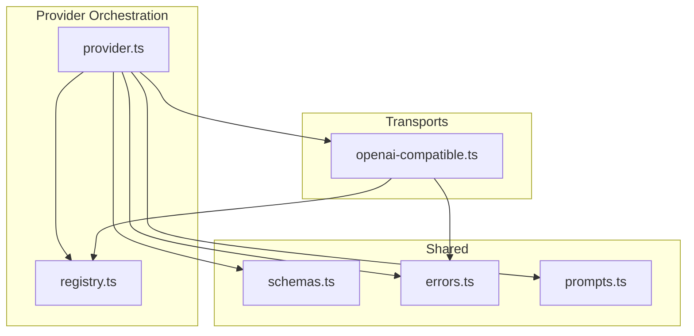
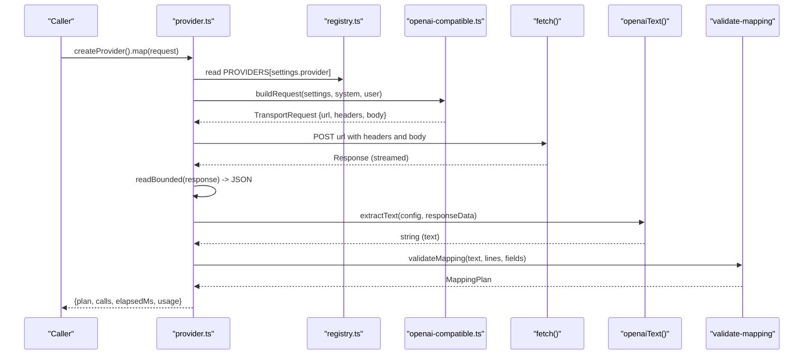
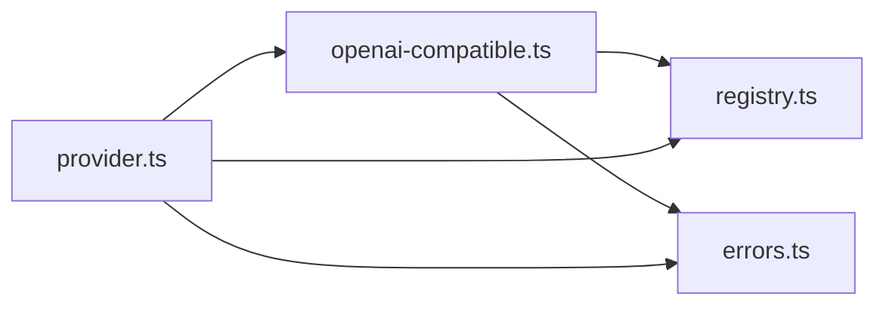
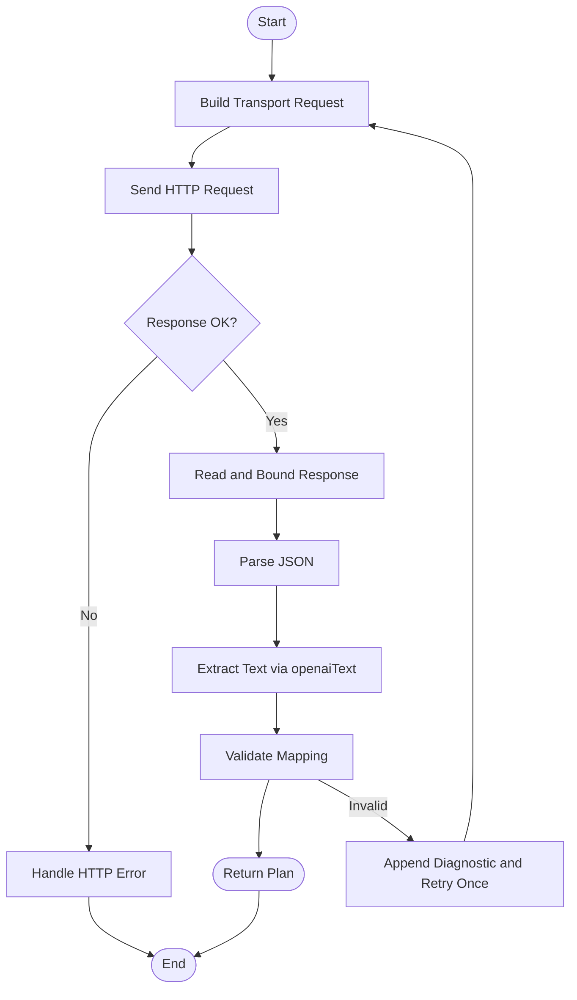

# OpenAI Compatible Transport

<cite>
**Referenced Files in This Document**
- [openai-compatible.ts](file://src/ai/transports/openai-compatible.ts)
- [provider.ts](file://src/ai/provider.ts)
- [registry.ts](file://src/ai/registry.ts)
- [prompts.ts](file://src/ai/prompts.ts)
- [schemas.ts](file://src/shared/schemas.ts)
- [errors.ts](file://src/shared/errors.ts)
</cite>

## Table of Contents
1. [Introduction](#introduction)
2. [Project Structure](#project-structure)
3. [Core Components](#core-components)
4. [Architecture Overview](#architecture-overview)
5. [Detailed Component Analysis](#detailed-component-analysis)
6. [Dependency Analysis](#dependency-analysis)
7. [Performance Considerations](#performance-considerations)
8. [Troubleshooting Guide](#troubleshooting-guide)
9. [Conclusion](#conclusion)
10. [Appendices](#appendices)

## Introduction
This document explains the OpenAI-compatible transport implementation that formats requests and parses responses for OpenAI’s native API and other services following a similar pattern (for example, DeepSeek). It focuses on:
- Request formatting via openaiRequest
- Response parsing via openaiText
- Authentication handling using Bearer tokens
- Integration with the provider orchestration layer
- Error handling strategies and compatibility notes across providers and API versions

The goal is to help you understand how this transport enables consistent AI-powered form filling against multiple backends while keeping request payloads, authentication, and response validation centralized and safe.

## Project Structure
At a high level:
- The registry defines supported providers and their endpoints.
- The provider orchestrator builds transport-specific requests and parses responses.
- The OpenAI-compatible transport implements request formatting and response parsing for OpenAI-like APIs.
- Shared schemas define limits and validation rules used throughout.
- Errors are normalized into user-friendly messages.

**Diagram sources**
- [provider.ts:1-107](file://src/ai/provider.ts#L1-L107)
- [registry.ts:1-13](file://src/ai/registry.ts#L1-L13)
- [openai-compatible.ts:1-22](file://src/ai/transports/openai-compatible.ts#L1-L22)
- [schemas.ts:1-39](file://src/shared/schemas.ts#L1-L39)
- [errors.ts:1-10](file://src/shared/errors.ts#L1-L10)
- [prompts.ts:1-26](file://src/ai/prompts.ts#L1-L26)

**Section sources**
- [provider.ts:1-107](file://src/ai/provider.ts#L1-L107)
- [registry.ts:1-13](file://src/ai/registry.ts#L1-L13)
- [openai-compatible.ts:1-22](file://src/ai/transports/openai-compatible.ts#L1-L22)
- [schemas.ts:1-39](file://src/shared/schemas.ts#L1-L39)
- [errors.ts:1-10](file://src/shared/errors.ts#L1-L10)
- [prompts.ts:1-26](file://src/ai/prompts.ts#L1-L26)

## Core Components
- openaiRequest(settings, system, user): Builds an OpenAI-compatible HTTP request payload including model, messages, JSON response format, token limits, and Authorization header.
- openaiText(data): Validates and extracts text from an OpenAI-style response, ensuring completion was successful and content is present.
- Provider orchestration (provider.ts): Chooses the correct transport based on provider settings, performs network I/O with timeouts and abort support, enforces response size limits, parses provider-specific responses, validates mapping output, and normalizes errors.
- Registry (registry.ts): Declares provider metadata such as endpoint URLs and transport type.
- Prompts (prompts.ts): Defines the system prompt and constructs the user payload containing document lines and field descriptors.
- Schemas (schemas.ts): Defines input/output shapes and global limits (e.g., maximum response bytes).
- Errors (errors.ts): Provides a UserError class and utilities for abort signaling and error message formatting.

**Section sources**
- [openai-compatible.ts:4-21](file://src/ai/transports/openai-compatible.ts#L4-L21)
- [provider.ts:15-106](file://src/ai/provider.ts#L15-L106)
- [registry.ts:1-13](file://src/ai/registry.ts#L1-L13)
- [prompts.ts:4-25](file://src/ai/prompts.ts#L4-L25)
- [schemas.ts:1-39](file://src/shared/schemas.ts#L1-L39)
- [errors.ts:1-10](file://src/shared/errors.ts#L1-L10)

## Architecture Overview
The provider layer composes a transport-agnostic workflow:
- Build a transport-specific request using the selected provider’s transport function.
- Send the request with fetch, enforcing timeouts, abort signals, and strict headers.
- Read and bound the response body to prevent oversized payloads.
- Parse provider-specific response into a string via the corresponding text extractor.
- Validate the extracted text against the expected mapping schema.
- Return a structured outcome with plan, call count, elapsed time, and usage metrics when available.

**Diagram sources**
- [provider.ts:52-106](file://src/ai/provider.ts#L52-L106)
- [registry.ts:1-13](file://src/ai/registry.ts#L1-L13)
- [openai-compatible.ts:4-21](file://src/ai/transports/openai-compatible.ts#L4-L21)

## Detailed Component Analysis

### openaiRequest: Request Formatting
Purpose:
- Constructs an OpenAI-compatible chat completions request.
- Sets the model, messages array with system and user roles, and forces JSON output.
- Applies token limits appropriate for the provider (OpenAI uses max_completion_tokens; DeepSeek uses max_tokens).
- Adds Authorization header with a Bearer token derived from settings.apiKey.

Key behaviors:
- URL selection: Uses the endpoint from the registry for the chosen provider.
- Headers: Includes Authorization with Bearer token.
- Body:
  - model: from settings.model
  - messages: [{ role: 'system', content }, { role: 'user', content }]
  - response_format: { type: 'json_object' }
  - stream: false
  - Token limit: conditional per provider (DeepSeek vs others)

Compatibility notes:
- Works with OpenAI’s /v1/chat/completions and compatible endpoints like DeepSeek’s /chat/completions.
- Ensures JSON mode by requesting response_format: json_object.

**Section sources**
- [openai-compatible.ts:4-13](file://src/ai/transports/openai-compatible.ts#L4-L13)
- [registry.ts:1-6](file://src/ai/registry.ts#L1-L6)

### openaiText: Response Parsing
Purpose:
- Extracts the final text from an OpenAI-style response.
- Validates that the model completed successfully and did not refuse or truncate the response.
- Returns the content string if valid.

Validation checks:
- Ensure choices exists and at least one choice is present.
- Verify finish_reason equals stop.
- Ensure no refusal flag is set.
- Confirm message.content is a string.

Error behavior:
- Throws a UserError with a descriptive message when validation fails.

**Section sources**
- [openai-compatible.ts:14-21](file://src/ai/transports/openai-compatible.ts#L14-L21)
- [errors.ts:1-6](file://src/shared/errors.ts#L1-L6)

### Provider Orchestration: Building Requests and Handling Responses
Responsibilities:
- Select transport based on provider settings.
- Compose system and user prompts using shared prompt utilities.
- Execute HTTP requests with strict controls:
  - Timeouts and abort signals
  - Content-Type and provider-specific headers
  - No caching and secure redirect policies
- Enforce response size limits and parse JSON safely.
- Route parsed data through provider-specific text extractors.
- Validate mapping output and optionally retry once with repair instructions.
- Normalize errors and report usage numbers when available.

Important details:
- Timeout: 60 seconds; aborts and raises a user-friendly error.
- Response size limit: bounded to 256 KiB to avoid memory issues.
- Retry strategy: If mapping validation fails, retries once with a diagnostic appended to the system prompt.
- Usage extraction: Reads usage or usageMetadata fields and filters to numeric values.

**Section sources**
- [provider.ts:15-106](file://src/ai/provider.ts#L15-L106)
- [prompts.ts:4-25](file://src/ai/prompts.ts#L4-L25)
- [schemas.ts:1-39](file://src/shared/schemas.ts#L1-L39)
- [errors.ts:1-10](file://src/shared/errors.ts#L1-L10)

### Authentication Handling
- OpenAI-compatible transport uses Bearer token authentication via the Authorization header.
- The API key is sourced from settings.apiKey and injected into the request headers.
- Other transports use provider-specific headers (Anthropic uses x-api-key; Gemini uses x-goog-api-key), but the OpenAI-compatible path consistently uses Bearer tokens.

Security considerations:
- Keys are passed only in headers and never logged.
- Credentials are omitted and redirects are disallowed to reduce exposure.

**Section sources**
- [openai-compatible.ts:4-13](file://src/ai/transports/openai-compatible.ts#L4-L13)
- [provider.ts:71-83](file://src/ai/provider.ts#L71-L83)

### Configuration Examples
Provider configuration is defined centrally:
- Provider IDs include OpenAI and DeepSeek, both routed to the OpenAI-compatible transport.
- Each provider entry includes display name, allowed origin, endpoint URL, and transport type.

Example configuration elements:
- Provider ID: openai or deepseek
- Endpoint: specific to each provider
- Transport: openai (uses openaiRequest and openaiText)

Settings required at runtime:
- provider: one of the registered provider IDs
- model: a valid model identifier supported by the provider
- apiKey: a non-empty API key without spaces

Usage in the provider layer:
- Settings are validated before making requests.
- The registry maps provider IDs to endpoints and transport functions.

**Section sources**
- [registry.ts:1-13](file://src/ai/registry.ts#L1-L13)
- [provider.ts:15-22](file://src/ai/provider.ts#L15-L22)

### Error Handling Strategies
- HTTP errors: Status codes map to user-friendly messages (e.g., 401/403 for auth issues, 429 for rate limits, 400/404 for invalid models).
- Response parsing: Invalid JSON or empty bodies raise clear errors.
- Validation failures: Mapping validation errors trigger a single retry with a diagnostic appended to the system prompt.
- Abort and timeout: Aborted requests and timeouts produce explicit messages indicating cancellation or excessive latency.
- Size limits: Oversized responses are rejected early to protect memory.

**Section sources**
- [provider.ts:71-106](file://src/ai/provider.ts#L71-L106)
- [errors.ts:1-10](file://src/shared/errors.ts#L1-L10)

### Compatibility Notes for Different API Versions
- OpenAI-compatible transport targets the Chat Completions interface with JSON mode enabled.
- Token limit parameter varies by provider:
  - OpenAI: uses max_completion_tokens
  - DeepSeek: uses max_tokens
- Both are handled automatically by the transport logic.
- Gemini and Anthropic have separate transports and parsers; they are not affected by changes in the OpenAI-compatible path.

**Section sources**
- [openai-compatible.ts:4-13](file://src/ai/transports/openai-compatible.ts#L4-L13)
- [registry.ts:1-6](file://src/ai/registry.ts#L1-L6)

## Dependency Analysis
The OpenAI-compatible transport depends on:
- Registry for provider endpoints and transport routing
- Errors for consistent error types
- Provider orchestration for execution flow, timeouts, and validation

**Diagram sources**
- [openai-compatible.ts:1-22](file://src/ai/transports/openai-compatible.ts#L1-L22)
- [provider.ts:1-107](file://src/ai/provider.ts#L1-L107)
- [registry.ts:1-13](file://src/ai/registry.ts#L1-L13)
- [errors.ts:1-10](file://src/shared/errors.ts#L1-L10)

**Section sources**
- [openai-compatible.ts:1-22](file://src/ai/transports/openai-compatible.ts#L1-L22)
- [provider.ts:1-107](file://src/ai/provider.ts#L1-L107)
- [registry.ts:1-13](file://src/ai/registry.ts#L1-L13)
- [errors.ts:1-10](file://src/shared/errors.ts#L1-L10)

## Performance Considerations
- Streaming disabled: Responses are fully buffered then parsed to JSON, simplifying parsing but increasing memory usage for large responses.
- Response size cap: Enforced at 256 KiB to prevent excessive memory consumption.
- Timeout protection: 60-second timeout avoids long-running requests.
- Single retry: One retry with a diagnostic reduces unnecessary network calls while improving robustness.
- Token limits: Set to reasonable defaults (8192) to balance quality and cost.

[No sources needed since this section provides general guidance]

## Troubleshooting Guide
Common issues and resolutions:
- Authentication failures (401/403): Verify API key validity, account access, and browser-access policy.
- Rate limiting (429): Wait before retrying or check quota limits in your provider account.
- Invalid model or unsupported features (400/404): Confirm the model supports JSON output and the endpoint version.
- Empty or invalid responses: Check network connectivity and ensure the provider returned a valid JSON payload.
- Oversized responses: Reduce document length or choose a more concise model.
- Timeouts: Increase patience or reduce input size; automatic retries are not performed after timeouts.

Operational tips:
- Use shorter documents to stay within token and response limits.
- Ensure the selected provider supports JSON mode and the specified model.
- Monitor usage metrics when available to detect unexpected costs or quotas.

**Section sources**
- [provider.ts:71-106](file://src/ai/provider.ts#L71-L106)
- [schemas.ts:1-39](file://src/shared/schemas.ts#L1-L39)

## Conclusion
The OpenAI-compatible transport provides a clean, consistent way to interact with OpenAI’s native API and compatible services like DeepSeek. By centralizing request formatting, authentication, and response parsing, it enables reliable AI-driven form filling across providers while maintaining safety through timeouts, size limits, and robust error handling. The provider orchestration layer ensures that all transports share common workflows for execution, validation, and diagnostics.

[No sources needed since this section summarizes without analyzing specific files]

## Appendices

### Data Flow Summary

**Diagram sources**
- [provider.ts:52-106](file://src/ai/provider.ts#L52-L106)
- [openai-compatible.ts:4-21](file://src/ai/transports/openai-compatible.ts#L4-L21)