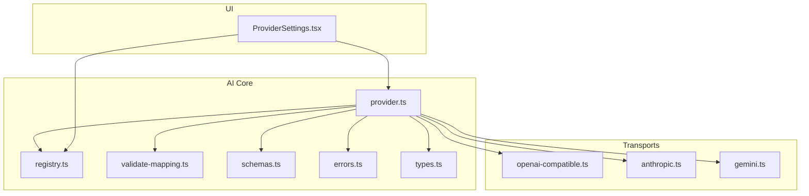
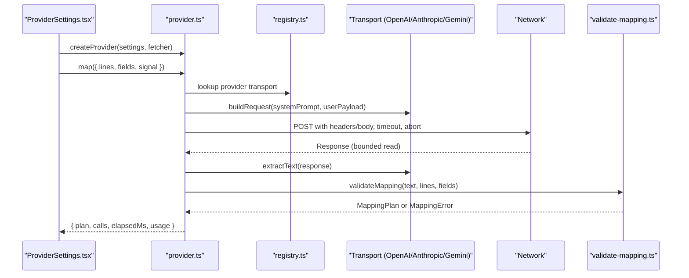
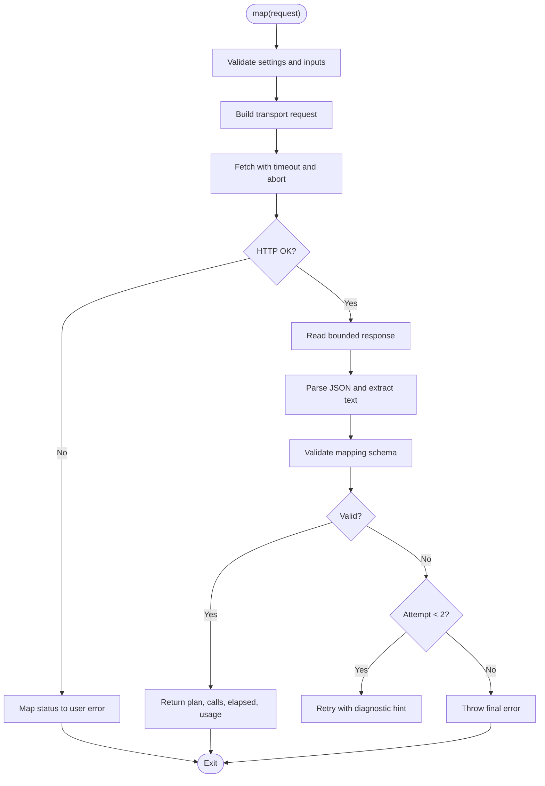
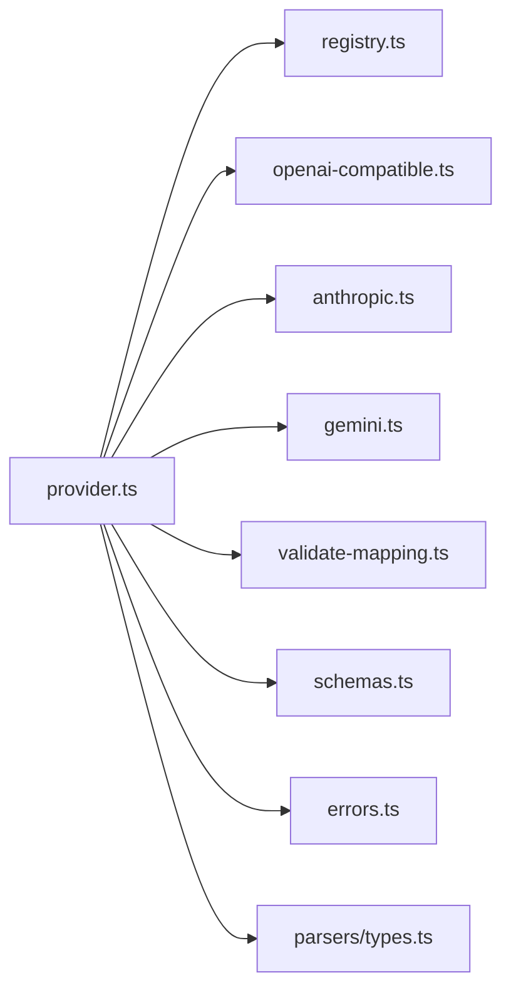

# Provider Interfaces

<cite>
**Referenced Files in This Document**
- [provider.ts](file://src/ai/provider.ts)
- [registry.ts](file://src/ai/registry.ts)
- [anthropic.ts](file://src/ai/transports/anthropic.ts)
- [gemini.ts](file://src/ai/transports/gemini.ts)
- [openai-compatible.ts](file://src/ai/transports/openai-compatible.ts)
- [prompts.ts](file://src/ai/prompts.ts)
- [validate-mapping.ts](file://src/ai/validate-mapping.ts)
- [schemas.ts](file://src/shared/schemas.ts)
- [errors.ts](file://src/shared/errors.ts)
- [types.ts](file://src/parsers/types.ts)
- [ProviderSettings.tsx](file://src/sidepanel/components/ProviderSettings.tsx)
- [providers.test.ts](file://tests/unit/providers.test.ts)
</cite>

## Table of Contents
1. [Introduction](#introduction)
2. [Project Structure](#project-structure)
3. [Core Components](#core-components)
4. [Architecture Overview](#architecture-overview)
5. [Detailed Component Analysis](#detailed-component-analysis)
6. [Dependency Analysis](#dependency-analysis)
7. [Performance Considerations](#performance-considerations)
8. [Troubleshooting Guide](#troubleshooting-guide)
9. [Conclusion](#conclusion)
10. [Appendices](#appendices)

## Introduction
This document explains the AI provider interface system that enables pluggable AI service implementations for form-filling suggestions. It covers:
- The Provider interface contract and how it orchestrates requests to different transports
- Transport layer abstractions for OpenAI-compatible, Anthropic, and Gemini providers
- Request/response formats, error handling strategies, and authentication mechanisms
- Examples from existing provider implementations
- Guidelines for creating custom AI provider integrations

The system is designed so that new providers can be added by implementing a transport adapter that conforms to the shared request/response contracts and validation rules.

## Project Structure
The AI subsystem is organized around a central provider orchestration module, a registry of supported providers, and per-provider transport adapters. Supporting modules provide schemas, prompts, validation, and shared errors.

**Diagram sources**
- [provider.ts:1-107](file://src/ai/provider.ts#L1-L107)
- [registry.ts:1-13](file://src/ai/registry.ts#L1-L13)
- [openai-compatible.ts:1-22](file://src/ai/transports/openai-compatible.ts#L1-L22)
- [anthropic.ts:1-17](file://src/ai/transports/anthropic.ts#L1-L17)
- [gemini.ts:1-21](file://src/ai/transports/gemini.ts#L1-L21)
- [validate-mapping.ts:1-33](file://src/ai/validate-mapping.ts#L1-L33)
- [schemas.ts:1-39](file://src/shared/schemas.ts#L1-L39)
- [errors.ts:1-10](file://src/shared/errors.ts#L1-L10)
- [types.ts:1-3](file://src/parsers/types.ts#L1-L3)
- [ProviderSettings.tsx:1-70](file://src/sidepanel/components/ProviderSettings.tsx#L1-L70)

**Section sources**
- [provider.ts:1-107](file://src/ai/provider.ts#L1-L107)
- [registry.ts:1-13](file://src/ai/registry.ts#L1-L13)

## Core Components
- Provider interface and factory: Defines the mapping operation contract and builds provider instances with settings and fetcher injection.
- Registry: Declares supported providers, their endpoints, origins, and transport types.
- Transports: Implement request construction and response extraction for each provider family.
- Validation: Enforces schema constraints on model output and input limits.
- Prompts: Provides the system prompt and payload construction for the mapping task.
- Errors: Centralized user-facing error types and abort handling utilities.

Key responsibilities:
- Build a transport-specific request using the registry and settings
- Execute HTTP calls with strict security headers and timeouts
- Extract text responses per transport
- Validate JSON output against a strict mapping schema
- Provide bounded response reading and robust error messages

**Section sources**
- [provider.ts:11-26](file://src/ai/provider.ts#L11-L26)
- [registry.ts:1-13](file://src/ai/registry.ts#L1-L13)
- [openai-compatible.ts:4-13](file://src/ai/transports/openai-compatible.ts#L4-L13)
- [anthropic.ts:3-9](file://src/ai/transports/anthropic.ts#L3-L9)
- [gemini.ts:3-12](file://src/ai/transports/gemini.ts#L3-L12)
- [validate-mapping.ts:7-31](file://src/ai/validate-mapping.ts#L7-L31)
- [prompts.ts:4-25](file://src/ai/prompts.ts#L4-L25)
- [errors.ts:1-10](file://src/shared/errors.ts#L1-L10)

## Architecture Overview
The provider orchestrator composes a transport-specific request, performs a secure fetch, extracts provider-specific text, validates the result, and returns a mapping plan or an error.

**Diagram sources**
- [provider.ts:52-105](file://src/ai/provider.ts#L52-L105)
- [registry.ts:1-13](file://src/ai/registry.ts#L1-L13)
- [openai-compatible.ts:4-13](file://src/ai/transports/openai-compatible.ts#L4-L13)
- [anthropic.ts:3-9](file://src/ai/transports/anthropic.ts#L3-L9)
- [gemini.ts:3-12](file://src/ai/transports/gemini.ts#L3-L12)
- [validate-mapping.ts:7-31](file://src/ai/validate-mapping.ts#L7-L31)

## Detailed Component Analysis

### Provider Interface and Orchestration
- Contract: A provider exposes a single method to map document lines to field values, returning a plan, call count, elapsed time, and optional usage metrics.
- Settings validation: Ensures model IDs and API keys conform to expected patterns before any network call.
- Request building: Delegates to the appropriate transport based on the selected provider.
- Fetch execution: Uses a configurable fetcher for testability; enforces secure defaults (no credentials, no cache, redirect error).
- Response handling: Reads bounded streams, parses JSON, extracts provider-specific text, and validates against the mapping schema.
- Retry strategy: Performs at most one repair retry when the model output fails validation; never sends untrusted model output back to the provider.
- Error handling: Maps HTTP status codes to user-friendly messages; handles timeouts, aborts, and oversized responses.

**Diagram sources**
- [provider.ts:52-105](file://src/ai/provider.ts#L52-L105)
- [validate-mapping.ts:7-31](file://src/ai/validate-mapping.ts#L7-L31)

**Section sources**
- [provider.ts:11-26](file://src/ai/provider.ts#L11-L26)
- [provider.ts:52-105](file://src/ai/provider.ts#L52-L105)
- [errors.ts:1-10](file://src/shared/errors.ts#L1-L10)

### Registry and Provider Configuration
- Providers are declared with display name, browser origin permission, endpoint URL, and transport type.
- Type guards ensure only known providers are used.
- Settings include provider ID, model ID, and API key.

Supported providers:
- OpenAI-compatible (including DeepSeek via same transport)
- Anthropic
- Google Gemini

**Section sources**
- [registry.ts:1-13](file://src/ai/registry.ts#L1-L13)
- [ProviderSettings.tsx:1-70](file://src/sidepanel/components/ProviderSettings.tsx#L1-L70)

### Transport Layer Abstractions

#### OpenAI-Compatible Transport
- Request format: Standard chat completions body with system and user messages, JSON response mode, and token limit configuration.
- Authentication: Bearer token in Authorization header.
- Response extraction: Reads first choice’s message content if finish reason indicates completion and no refusal occurred.

**Section sources**
- [openai-compatible.ts:4-13](file://src/ai/transports/openai-compatible.ts#L4-L13)
- [openai-compatible.ts:14-21](file://src/ai/transports/openai-compatible.ts#L14-L21)

#### Anthropic Transport
- Request format: Messages array with user role, system instruction, and explicit max tokens.
- Authentication: x-api-key header and version header; includes a flag for direct browser access.
- Response extraction: Validates stop reason and content blocks, concatenating text parts.

**Section sources**
- [anthropic.ts:3-9](file://src/ai/transports/anthropic.ts#L3-L9)
- [anthropic.ts:10-16](file://src/ai/transports/anthropic.ts#L10-L16)

#### Gemini Transport
- Request format: System instruction and contents with generation config enforcing JSON mime type and token limits.
- Authentication: x-goog-api-key header.
- Response extraction: Validates candidate finish reason and content parts, filtering out non-text thoughts.

**Section sources**
- [gemini.ts:3-12](file://src/ai/transports/gemini.ts#L3-L12)
- [gemini.ts:13-20](file://src/ai/transports/gemini.ts#L13-L20)

### Prompting and Payload Construction
- System prompt instructs the model to return a strict JSON structure with assignments and unmapped fields, including evidence quotes and reasons.
- Payload creation compacts field descriptors into a minimal set and pairs them with document lines.

**Section sources**
- [prompts.ts:4-25](file://src/ai/prompts.ts#L4-L25)

### Validation and Limits
- Input limits: Characters, pages, fields, and value lengths are enforced to prevent abuse and keep payloads manageable.
- Output validation: Parses JSON, checks schema compliance, ensures all fields are accounted for, verifies evidence quotes exist on cited lines, and enforces length constraints.
- Response size limit: Streams responses with a hard cap to avoid memory issues.

**Section sources**
- [schemas.ts:1-39](file://src/shared/schemas.ts#L1-L39)
- [validate-mapping.ts:7-31](file://src/ai/validate-mapping.ts#L7-L31)
- [provider.ts:34-51](file://src/ai/provider.ts#L34-L51)

### Authentication and Permissions
- API keys are stored in session storage and passed via headers per transport.
- Browser permissions are requested for provider origins before making requests.
- No backend proxy is used; requests go directly to provider endpoints.

**Section sources**
- [ProviderSettings.tsx:16-44](file://src/sidepanel/components/ProviderSettings.tsx#L16-L44)
- [registry.ts:1-13](file://src/ai/registry.ts#L1-L13)

### Error Handling Strategies
- UserError: Wraps user-facing messages for consistent handling.
- Abort handling: Prevents starting canceled requests and surfaces clear cancellation messages.
- HTTP errors: Maps common status codes to actionable messages without leaking provider bodies.
- Timeouts: Enforces a fixed timeout and reports clearly when exceeded.
- Oversized responses: Stops streaming early and informs users to shorten documents or adjust models.

**Section sources**
- [errors.ts:1-10](file://src/shared/errors.ts#L1-L10)
- [provider.ts:77-100](file://src/ai/provider.ts#L77-L100)

### Example Usage and Tests
- Unit tests verify that each transport uses its fixed host and headers, normalizes responses, and respects safety behaviors like not retrying on network failures and not leaking error bodies.
- Tests also confirm repair behavior after invalid JSON and rejection of truncated or refused responses.

**Section sources**
- [providers.test.ts:14-68](file://tests/unit/providers.test.ts#L14-L68)

## Dependency Analysis
The provider depends on registry to select transports, transports to build requests and parse responses, validation to enforce schema, and shared schemas/errors for limits and messaging.

**Diagram sources**
- [provider.ts:1-107](file://src/ai/provider.ts#L1-L107)
- [registry.ts:1-13](file://src/ai/registry.ts#L1-L13)
- [openai-compatible.ts:1-22](file://src/ai/transports/openai-compatible.ts#L1-L22)
- [anthropic.ts:1-17](file://src/ai/transports/anthropic.ts#L1-L17)
- [gemini.ts:1-21](file://src/ai/transports/gemini.ts#L1-L21)
- [validate-mapping.ts:1-33](file://src/ai/validate-mapping.ts#L1-L33)
- [schemas.ts:1-39](file://src/shared/schemas.ts#L1-L39)
- [errors.ts:1-10](file://src/shared/errors.ts#L1-L10)
- [types.ts:1-3](file://src/parsers/types.ts#L1-L3)

**Section sources**
- [provider.ts:1-107](file://src/ai/provider.ts#L1-L107)

## Performance Considerations
- Bounded response streaming prevents excessive memory use and enforces a strict response size limit.
- Fixed timeout avoids long-running requests; consider adjusting timeout policy if needed for large documents.
- Minimal payload construction reduces network overhead by compacting field descriptors.
- One-shot repair retry minimizes unnecessary network calls while improving resilience to malformed outputs.

[No sources needed since this section provides general guidance]

## Troubleshooting Guide
Common issues and resolutions:
- Invalid or missing API key: Ensure the key has no spaces and matches your provider’s requirements.
- Model incompatibility: Use a model that supports JSON output and sufficient context length.
- Rate limits or quota exceeded: Wait and retry later; check provider account limits.
- Network or CORS restrictions: Verify browser permissions for the provider origin and network access.
- Oversized responses: Shorten the document or choose a model with larger context windows.
- Canceled operations: If aborted, no request was started; restart the operation.

**Section sources**
- [provider.ts:77-100](file://src/ai/provider.ts#L77-L100)
- [errors.ts:1-10](file://src/shared/errors.ts#L1-L10)

## Conclusion
The AI provider interface system offers a clean abstraction over multiple LLM providers through a unified interface and transport adapters. It emphasizes safety, validation, and user-friendly error handling while enabling easy extension for new providers. By following the established patterns—implementing request builders and response extractors per transport—you can integrate additional AI services consistently.

[No sources needed since this section summarizes without analyzing specific files]

## Appendices

### Adding a New Provider (Step-by-Step)
1. Register the provider in the registry with name, origin, endpoint, and transport identifier.
2. Implement a transport module with:
   - A function to build the request given settings, system prompt, and user payload
   - A function to extract text from the provider’s response, validating success conditions
3. Wire the transport into the provider orchestrator by adding a branch in request building and text extraction.
4. Add unit tests to verify:
   - Correct URL origin and header usage
   - Normalization and validation of mocked responses
   - Safety behaviors (timeouts, aborts, oversized responses, error handling)

**Section sources**
- [registry.ts:1-13](file://src/ai/registry.ts#L1-L13)
- [openai-compatible.ts:4-21](file://src/ai/transports/openai-compatible.ts#L4-L21)
- [anthropic.ts:3-16](file://src/ai/transports/anthropic.ts#L3-L16)
- [gemini.ts:3-20](file://src/ai/transports/gemini.ts#L3-L20)
- [providers.test.ts:14-68](file://tests/unit/providers.test.ts#L14-L68)