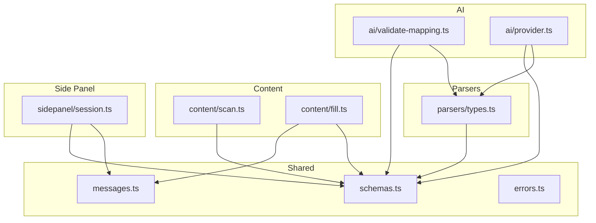
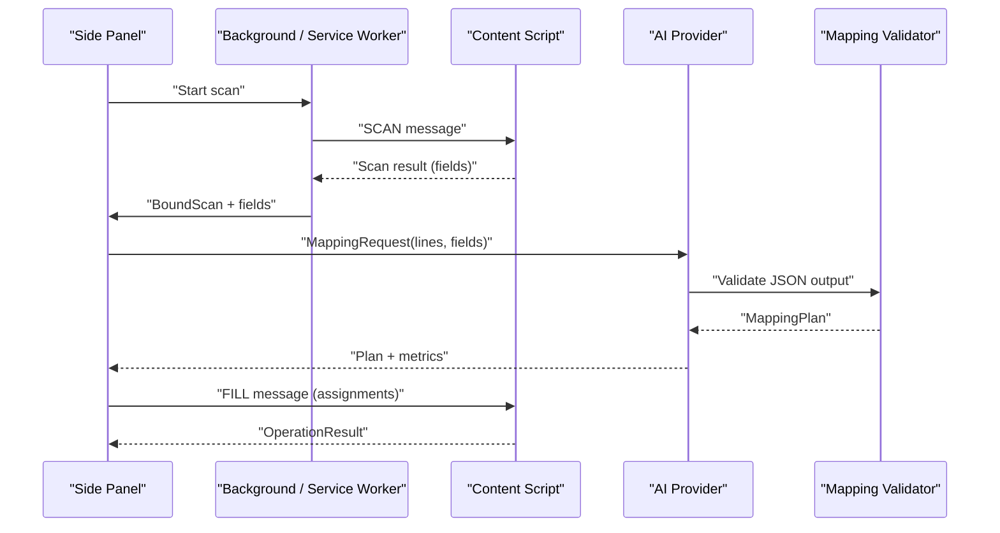
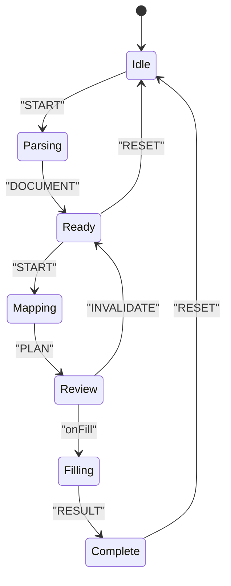
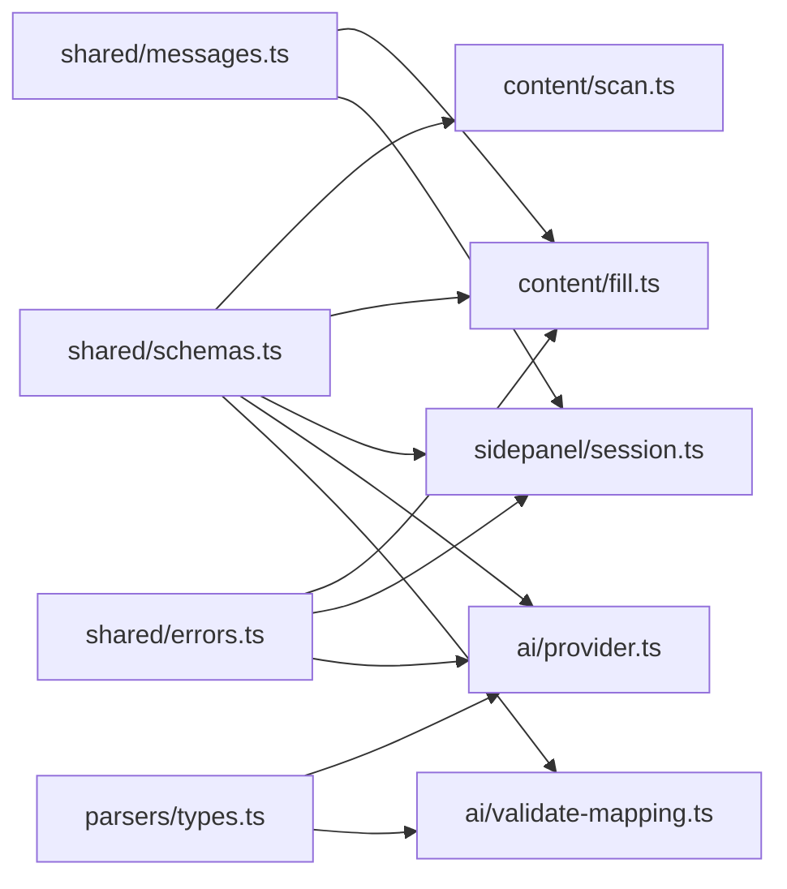

# Type Definitions & Schemas

<cite>
**Referenced Files in This Document**
- [schemas.ts](file://src/shared/schemas.ts)
- [messages.ts](file://src/shared/messages.ts)
- [errors.ts](file://src/shared/errors.ts)
- [types.ts](file://src/parsers/types.ts)
- [session.ts](file://src/sidepanel/session.ts)
- [validate-mapping.ts](file://src/ai/validate-mapping.ts)
- [provider.ts](file://src/ai/provider.ts)
- [scan.ts](file://src/content/scan.ts)
- [fill.ts](file://src/content/fill.ts)
</cite>

## Table of Contents
1. Introduction
2. Project Structure
3. Core Components
4. Architecture Overview
5. Detailed Component Analysis
6. Dependency Analysis
7. Performance Considerations
8. Troubleshooting Guide
9. Conclusion

## Introduction
This document catalogs all TypeScript type definitions and Zod validation schemas used across the extension. It explains data models for parsed documents, form fields, mapping plans, and session state; details validation rules, constraints, and business logic enforced by schemas; and documents error types, error codes, and error handling patterns. Examples show how schemas are used to infer types at compile time and validate data at runtime in both development and production flows.

## Project Structure
The type system is centered around shared schemas and messages that cross boundaries (background, content script, side panel, AI provider). Parsed document types describe extracted text from PDFs or other sources. Content scripts define field descriptors and registries. The side panel manages session state and orchestrates scanning, mapping, review, and filling.

**Diagram sources**
- [schemas.ts:1-39](file://src/shared/schemas.ts#L1-L39)
- [messages.ts:1-20](file://src/shared/messages.ts#L1-L20)
- [errors.ts:1-10](file://src/shared/errors.ts#L1-L10)
- [types.ts:1-3](file://src/parsers/types.ts#L1-L3)
- [scan.ts:1-88](file://src/content/scan.ts#L1-L88)
- [fill.ts:1-82](file://src/content/fill.ts#L1-L82)
- [session.ts:1-86](file://src/sidepanel/session.ts#L1-L86)
- [validate-mapping.ts:1-33](file://src/ai/validate-mapping.ts#L1-L33)
- [provider.ts:1-107](file://src/ai/provider.ts#L1-L107)

**Section sources**
- [schemas.ts:1-39](file://src/shared/schemas.ts#L1-L39)
- [messages.ts:1-20](file://src/shared/messages.ts#L1-L20)
- [types.ts:1-3](file://src/parsers/types.ts#L1-L3)
- [session.ts:1-86](file://src/sidepanel/session.ts#L1-L86)

## Core Components
This section summarizes the primary types and schemas, their roles, and where they are used.

- Limits and constants
  - Centralized size and count limits for bytes, pages, characters, fields, response payload, and value length. Used throughout parsing, scanning, mapping, and messaging to enforce safety caps.

- Field descriptors and local fields
  - FieldDescriptor describes a discovered form field with id, type, label, ariaLabel, placeholder, name, context, required, maxLength, pattern.
  - LocalField extends FieldDescriptor with currentValue to capture the current DOM value during scanning.

- Mapping plan
  - MappingPlan contains assignments and unmapped entries. Each assignment links a fieldId to a proposed value with evidence lines and a reason. Unmapped entries explain why a field could not be mapped.

- Scanning and binding
  - Scan captures scanId, url, fields, and exclusions. BoundScan adds a Target (tabId, windowId, documentId, url) to bind a scan to a specific browser tab/page.

- Messaging
  - WriteAssignment defines a single write operation with fieldId, value, expectedValue, and allowOverwrite.
  - ContentMessageSchema is a discriminated union over SCAN, FILL, UNDO, CLEAR, CANCEL messages with shared requestId and optional scan-specific fields.
  - Reply<T> is a generic success/failure envelope for inter-script communication.

- Operation results
  - FillResult enumerates per-field outcomes: filled, skipped, changed/reverted, failed, restored.
  - OperationResult wraps an array of FillResult plus canUndo flag.

- Session state
  - Phase enumerates workflow stages: idle, parsing, scanning, ready, mapping, review, filling, complete, undoing.
  - Session holds phase, parsed document, bound scan, mapping plan, review rows, result, error, progress, metrics.
  - Action defines all reducer actions including RESET, START, PROGRESS, DOCUMENT, SCAN, PLAN, ROW, SELECT_ALL, RESULT, ERROR, INVALIDATE, PROVIDER_CHANGED.

- Parsed documents
  - DocumentLine represents a line of text with id, page number, and text.
  - ParsedDocument aggregates name, pages, characters, and lines.

**Section sources**
- [schemas.ts:1-39](file://src/shared/schemas.ts#L1-L39)
- [messages.ts:1-20](file://src/shared/messages.ts#L1-L20)
- [session.ts:1-86](file://src/sidepanel/session.ts#L1-L86)
- [types.ts:1-3](file://src/parsers/types.ts#L1-L3)

## Architecture Overview
The following sequence shows how types and schemas flow through the extension’s core operations: scanning, mapping, review, and filling.

**Diagram sources**
- [session.ts:55-85](file://src/sidepanel/session.ts#L55-L85)
- [messages.ts:1-20](file://src/shared/messages.ts#L1-L20)
- [provider.ts:52-105](file://src/ai/provider.ts#L52-L105)
- [validate-mapping.ts:7-32](file://src/ai/validate-mapping.ts#L7-L32)
- [fill.ts:42-81](file://src/content/fill.ts#L42-L81)

## Detailed Component Analysis

### Field and Local Field Models
- FieldDescriptor enforces:
  - id: non-empty string up to 100 chars
  - type: one of text, email, tel, url, textarea
  - label, ariaLabel, placeholder, context: bounded strings
  - name: bounded string
  - required: boolean
  - maxLength: integer >= -1
  - pattern: bounded regex-like string
- LocalField extends FieldDescriptor with currentValue bounded by LIMITS.value.

Validation usage:
- During scanning, each control is described into a LocalField and validated via the schema before being included in the scan.

Type inference:
- Types like FieldDescriptor and LocalField are inferred directly from their Zod schemas, ensuring compile-time alignment with runtime validation.

**Section sources**
- [schemas.ts:3-14](file://src/shared/schemas.ts#L3-L14)
- [scan.ts:32-46](file://src/content/scan.ts#L32-L46)

### Mapping Plan Model
- MappingPlan includes:
  - assignments: array of objects linking fieldId to value with evidence items and reason; bounded by LIMITS.fields
  - unmapped: array of fieldId + reason; bounded by LIMITS.fields
- Assignment is derived from MappingPlan for convenience.

Business rules enforced by validator:
- Response byte limit check
- JSON parse and schema validation
- All fields must be accounted for (no unknown or duplicate field IDs)
- Evidence quotes must exist on cited lines
- Proposed values must be supported by evidence
- Values must respect field.maxLength

Usage:
- AI provider returns raw text; validator parses and validates to produce a MappingPlan consumed by the review UI and fill pipeline.

**Section sources**
- [schemas.ts:15-24](file://src/shared/schemas.ts#L15-L24)
- [validate-mapping.ts:7-32](file://src/ai/validate-mapping.ts#L7-L32)
- [provider.ts:52-105](file://src/ai/provider.ts#L52-L105)

### Scanning and Binding
- Scan captures scanId, url, fields, and exclusions.
- BoundScan augments Scan with Target (tabId, windowId, documentId, url).
- Validation ensures URL consistency between target and scanned page.

Runtime checks:
- assertActive verifies the target tab/window/document still matches expectations.
- executeOnPage establishes a port and waits for readiness before sending FILL/UNDO.

**Section sources**
- [schemas.ts:25-33](file://src/shared/schemas.ts#L25-L33)
- [session.ts:44-70](file://src/sidepanel/session.ts#L44-L70)

### Messaging Schema
- WriteAssignment:
  - fieldId: bounded string
  - value: bounded string
  - expectedValue: bounded string
  - allowOverwrite: boolean
- ContentMessageSchema:
  - Discriminated union over SCAN, FILL, UNDO, CLEAR, CANCEL
  - Shared requestId UUID
  - SCAN/FILL/UNDO include scanId and expectedUrl
  - FILL includes assignments array bounded by LIMITS.fields

Type inference:
- ContentMessage and WriteAssignment are inferred from schemas, enabling strongly-typed message passing between background and content scripts.

**Section sources**
- [messages.ts:1-20](file://src/shared/messages.ts#L1-L20)

### Operation Results
- FillResult status enum:
  - filled: value persisted and verified
  - skipped: already contained the selected value
  - changed/reverted: page changed, rejected, or replaced the value
  - failed: execution error occurred
  - restored: restoration after undo (used elsewhere in the codebase)
- OperationResult:
  - results: array of FillResult
  - canUndo: indicates whether undo is available

Usage:
- Returned from executeOnPage and stored in session.result to drive UI feedback.

**Section sources**
- [schemas.ts:33-38](file://src/shared/schemas.ts#L33-L38)
- [fill.ts:42-81](file://src/content/fill.ts#L42-L81)
- [session.ts:26-41](file://src/sidepanel/session.ts#L26-L41)

### Session State Machine
- Phase:
  - idle -> parsing -> ready -> mapping -> review -> filling -> complete
  - Also supports undoing and error recovery paths
- Session:
  - Holds phase, document, scan, plan, rows, result, error, progress, metrics
- Actions:
  - RESET, START, PROGRESS, DOCUMENT, SCAN, PLAN, ROW, SELECT_ALL, RESULT, ERROR, INVALIDATE, PROVIDER_CHANGED
- Reducer behavior:
  - Clears errors and resets intermediate state on transitions
  - Builds ReviewRow from MappingPlan.assignments with selection flags
  - Handles bulk selection and manual overrides

**Diagram sources**
- [session.ts:7-41](file://src/sidepanel/session.ts#L7-L41)

**Section sources**
- [session.ts:1-86](file://src/sidepanel/session.ts#L1-L86)

### Parsed Documents
- DocumentLine: id, page, text
- ParsedDocument: name, pages, characters, lines

Used to pass structured text segments to the AI provider for mapping.

**Section sources**
- [types.ts:1-3](file://src/parsers/types.ts#L1-L3)

## Dependency Analysis
The following diagram highlights key dependencies among modules and their reliance on shared types and schemas.

**Diagram sources**
- [schemas.ts:1-39](file://src/shared/schemas.ts#L1-L39)
- [messages.ts:1-20](file://src/shared/messages.ts#L1-L20)
- [errors.ts:1-10](file://src/shared/errors.ts#L1-L10)
- [types.ts:1-3](file://src/parsers/types.ts#L1-L3)
- [scan.ts:1-88](file://src/content/scan.ts#L1-L88)
- [fill.ts:1-82](file://src/content/fill.ts#L1-L82)
- [session.ts:1-86](file://src/sidepanel/session.ts#L1-L86)
- [provider.ts:1-107](file://src/ai/provider.ts#L1-L107)
- [validate-mapping.ts:1-33](file://src/ai/validate-mapping.ts#L1-L33)

**Section sources**
- [schemas.ts:1-39](file://src/shared/schemas.ts#L1-L39)
- [messages.ts:1-20](file://src/shared/messages.ts#L1-L20)
- [errors.ts:1-10](file://src/shared/errors.ts#L1-L10)
- [types.ts:1-3](file://src/parsers/types.ts#L1-L3)
- [scan.ts:1-88](file://src/content/scan.ts#L1-L88)
- [fill.ts:1-82](file://src/content/fill.ts#L1-L82)
- [session.ts:1-86](file://src/sidepanel/session.ts#L1-L86)
- [provider.ts:1-107](file://src/ai/provider.ts#L1-L107)
- [validate-mapping.ts:1-33](file://src/ai/validate-mapping.ts#L1-L33)

## Performance Considerations
- Byte and character limits prevent oversized payloads from reaching AI providers or bloating memory.
- Field counts and value lengths are capped to keep scanning and mapping efficient.
- Streaming response reading enforces a strict response byte cap to avoid unbounded memory growth.
- Pre-flight validation in fill prevents partial writes when later assignments would fail.

[No sources needed since this section provides general guidance]

## Troubleshooting Guide
Error types and handling patterns:
- UserError: Base error class for user-facing failures. errorMessage normalizes messages for display.
- throwIfAborted: Throws AbortError when an AbortSignal is aborted, used to cancel long-running operations.
- MappingError: Specialized error for invalid model outputs; triggers retry with repair hints.
- Provider request errors: HTTP status codes map to actionable messages (auth, rate limit, model support, availability).
- Page connection errors: Lost connections or invalid responses lead to explicit prompts to rescan.

Common scenarios:
- Aborted requests: Use throwIfAborted to ensure clean cancellation.
- Invalid mapping output: Catch MappingError and optionally retry once with diagnostic context.
- Page changes: assertActive and assertRegistry detect mismatches and prompt re-scan.
- Fill failures: Per-field failures are captured in OperationResult with detailed reasons; remaining writes are skipped.

**Section sources**
- [errors.ts:1-10](file://src/shared/errors.ts#L1-L10)
- [validate-mapping.ts:1-33](file://src/ai/validate-mapping.ts#L1-L33)
- [provider.ts:15-105](file://src/ai/provider.ts#L15-L105)
- [session.ts:44-85](file://src/sidepanel/session.ts#L44-L85)
- [fill.ts:8-81](file://src/content/fill.ts#L8-L81)

## Conclusion
The extension uses a cohesive set of TypeScript types and Zod schemas to enforce consistent contracts across components. Shared schemas centralize validation rules and limits, while inferred types provide compile-time safety. Runtime validation occurs at critical boundaries: scanning, mapping, messaging, and filling. Error handling is explicit and user-friendly, guiding users to recover from transient issues like page changes or provider errors. This design ensures robustness, clarity, and maintainability across the extension’s lifecycle.