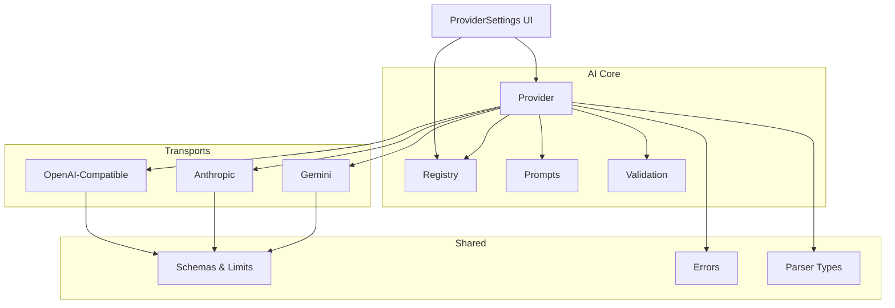
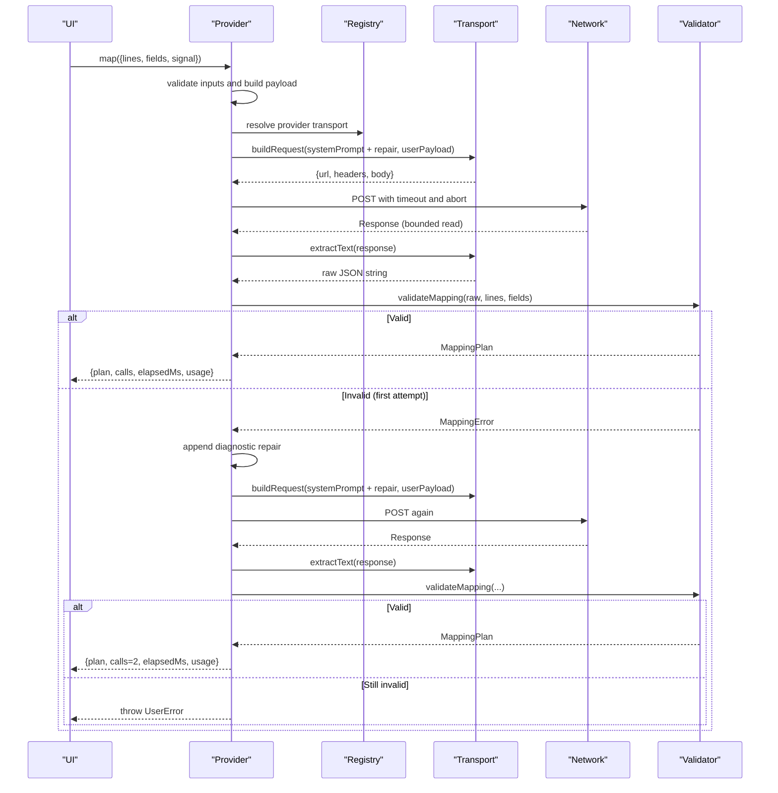
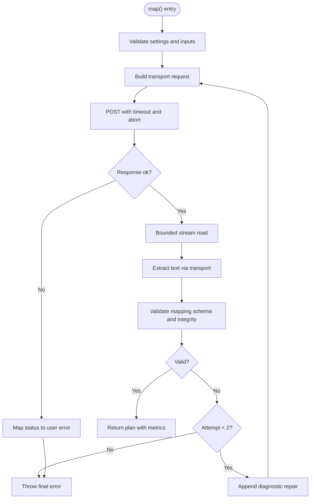
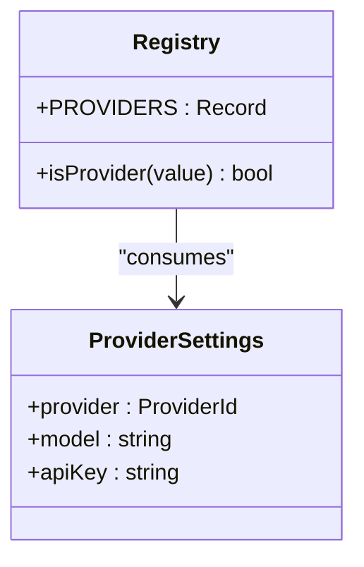
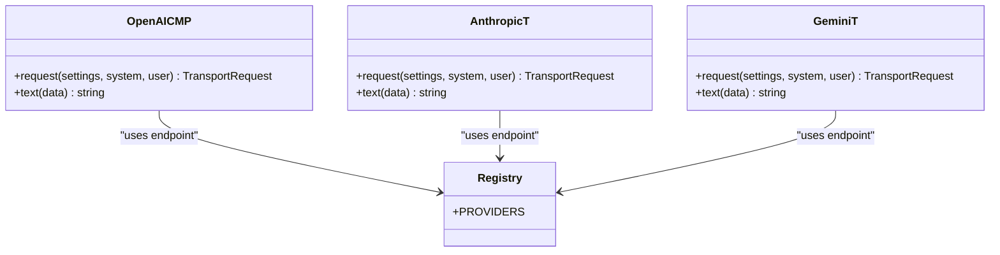
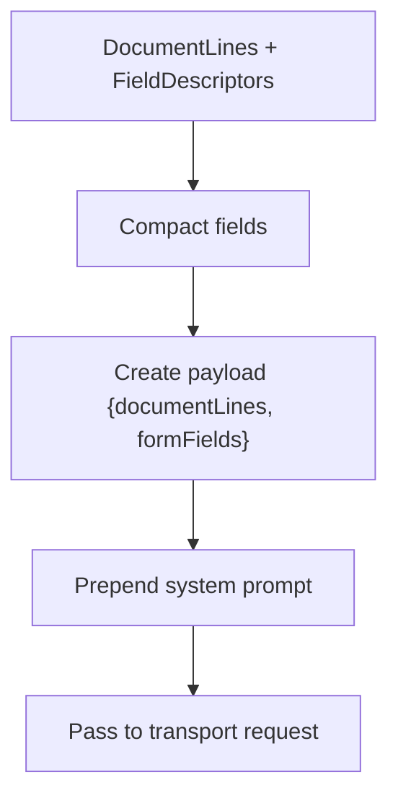
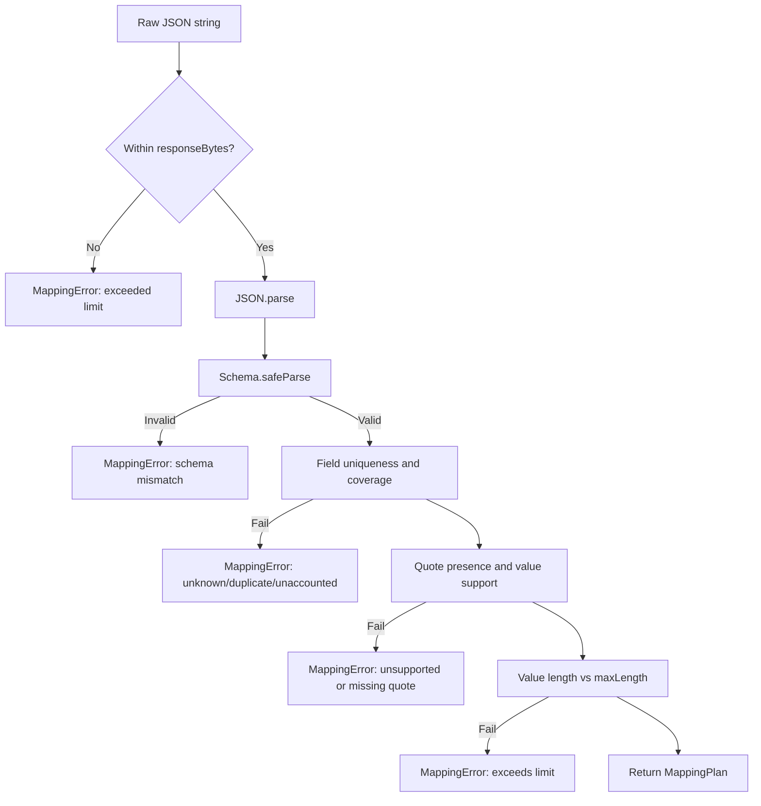
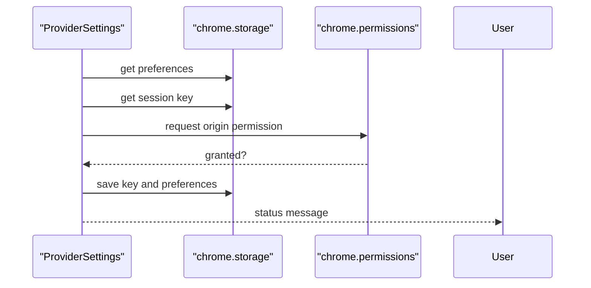
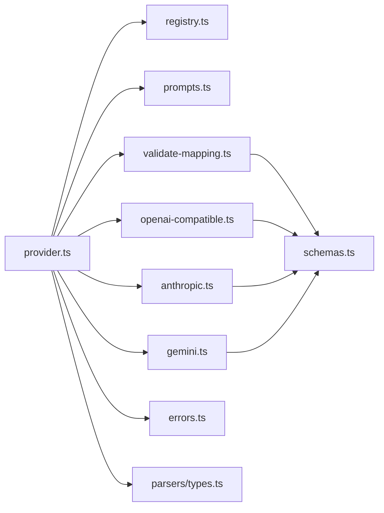

# AI Provider Abstraction Layer

<cite>
**Referenced Files in This Document**
- [provider.ts](file://src/ai/provider.ts)
- [registry.ts](file://src/ai/registry.ts)
- [prompts.ts](file://src/ai/prompts.ts)
- [validate-mapping.ts](file://src/ai/validate-mapping.ts)
- [openai-compatible.ts](file://src/ai/transports/openai-compatible.ts)
- [anthropic.ts](file://src/ai/transports/anthropic.ts)
- [gemini.ts](file://src/ai/transports/gemini.ts)
- [schemas.ts](file://src/shared/schemas.ts)
- [errors.ts](file://src/shared/errors.ts)
- [types.ts](file://src/parsers/types.ts)
- [ProviderSettings.tsx](file://src/sidepanel/components/ProviderSettings.tsx)
- [providers.test.ts](file://tests/unit/providers.test.ts)
</cite>

## Table of Contents
1. [Introduction](#introduction)
2. [Project Structure](#project-structure)
3. [Core Components](#core-components)
4. [Architecture Overview](#architecture-overview)
5. [Detailed Component Analysis](#detailed-component-analysis)
6. [Dependency Analysis](#dependency-analysis)
7. [Performance Considerations](#performance-considerions)
8. [Troubleshooting Guide](#troubleshooting-guide)
9. [Conclusion](#conclusion)

## Introduction
This document explains the AI provider abstraction layer that standardizes interactions with multiple AI backends (OpenAI, Anthropic Claude, Google Gemini). It covers:
- A unified provider interface for mapping form fields to document evidence
- Transport implementations that handle protocol-specific authentication, request formatting, and response parsing
- A prompt engineering system that generates optimized prompts for field mapping tasks
- A registry pattern that dynamically loads and configures providers based on user settings
- Error handling strategies, retry logic, and fallback mechanisms when services are unavailable or return invalid responses

## Project Structure
The AI subsystem is organized into focused modules:
- Registry defines supported providers and their endpoints
- Prompts define system instructions and payload construction
- Provider orchestrates requests, retries, validation, and timing
- Transports implement per-provider request building and response extraction
- Validation enforces schema constraints and data integrity
- Shared schemas define limits and types used across the system
- UI component manages provider configuration and permissions

**Diagram sources**
- [registry.ts:1-13](file://src/ai/registry.ts#L1-L13)
- [prompts.ts:1-26](file://src/ai/prompts.ts#L1-L26)
- [provider.ts:1-107](file://src/ai/provider.ts#L1-L107)
- [openai-compatible.ts:1-22](file://src/ai/transports/openai-compatible.ts#L1-L22)
- [anthropic.ts:1-17](file://src/ai/transports/anthropic.ts#L1-L17)
- [gemini.ts:1-21](file://src/ai/transports/gemini.ts#L1-L21)
- [schemas.ts:1-39](file://src/shared/schemas.ts#L1-L39)
- [errors.ts:1-10](file://src/shared/errors.ts#L1-L10)
- [types.ts:1-3](file://src/parsers/types.ts#L1-L3)

**Section sources**
- [registry.ts:1-13](file://src/ai/registry.ts#L1-L13)
- [provider.ts:1-107](file://src/ai/provider.ts#L1-L107)
- [prompts.ts:1-26](file://src/ai/prompts.ts#L1-L26)
- [validate-mapping.ts:1-33](file://src/ai/validate-mapping.ts#L1-L33)
- [openai-compatible.ts:1-22](file://src/ai/transports/openai-compatible.ts#L1-L22)
- [anthropic.ts:1-17](file://src/ai/transports/anthropic.ts#L1-L17)
- [gemini.ts:1-21](file://src/ai/transports/gemini.ts#L1-L21)
- [schemas.ts:1-39](file://src/shared/schemas.ts#L1-L39)
- [errors.ts:1-10](file://src/shared/errors.ts#L1-L10)
- [types.ts:1-3](file://src/parsers/types.ts#L1-L3)

## Core Components
- Provider interface and orchestration:
  - Defines a single map method that accepts document lines, field descriptors, and an abort signal, returning a plan with usage metrics and call count
  - Validates inputs against shared limits and constructs payloads using the prompt module
  - Builds transport-specific requests via the registry and executes them with strict security headers and timeouts
  - Parses provider responses through transport-specific extractors and validates output against a strict schema
  - Implements one-shot repair retry when model output fails validation, without echoing untrusted content back to the provider
- Registry:
  - Declares supported providers, display names, origins, endpoints, and transport identifiers
  - Provides type-safe provider ID checks and typed settings
- Prompt engineering:
  - System prompt instructs the model to produce JSON assignments with verbatim quotes and reasons
  - Payload builder compacts field metadata and pairs it with document lines for context
- Validation:
  - Enforces schema compliance, uniqueness of field IDs, presence of all fields, quote-to-line integrity, value support by evidence, and length limits
- Transport implementations:
  - OpenAI-compatible: Bearer token auth, messages array, JSON mode, max tokens
  - Anthropic: API key header, version header, direct browser access flag, system and user messages
  - Gemini: API key header, system instruction, contents, JSON mime type, max output tokens
- Shared schemas and errors:
  - Centralized limits for bytes, pages, characters, fields, values, and response size
  - User-facing error class and utilities for abort handling and message normalization

**Section sources**
- [provider.ts:11-107](file://src/ai/provider.ts#L11-L107)
- [registry.ts:1-13](file://src/ai/registry.ts#L1-L13)
- [prompts.ts:4-25](file://src/ai/prompts.ts#L4-L25)
- [validate-mapping.ts:1-33](file://src/ai/validate-mapping.ts#L1-L33)
- [openai-compatible.ts:4-21](file://src/ai/transports/openai-compatible.ts#L4-L21)
- [anthropic.ts:3-16](file://src/ai/transports/anthropic.ts#L3-L16)
- [gemini.ts:3-20](file://src/ai/transports/gemini.ts#L3-L20)
- [schemas.ts:1-39](file://src/shared/schemas.ts#L1-L39)
- [errors.ts:1-10](file://src/shared/errors.ts#L1-L10)

## Architecture Overview
The abstraction layer decouples business logic from provider specifics:
- The provider orchestrator composes prompts, builds transport requests, performs bounded streaming reads, extracts text, validates mappings, and returns structured results
- Each transport encapsulates authentication, endpoint selection, and response parsing
- The registry centralizes provider metadata and enables dynamic selection based on user settings
- Validation ensures outputs are safe, complete, and consistent with input constraints

**Diagram sources**
- [provider.ts:52-105](file://src/ai/provider.ts#L52-L105)
- [registry.ts:1-13](file://src/ai/registry.ts#L1-L13)
- [openai-compatible.ts:4-21](file://src/ai/transports/openai-compatible.ts#L4-L21)
- [anthropic.ts:3-16](file://src/ai/transports/anthropic.ts#L3-L16)
- [gemini.ts:3-20](file://src/ai/transports/gemini.ts#L3-L20)
- [validate-mapping.ts:7-31](file://src/ai/validate-mapping.ts#L7-L31)

## Detailed Component Analysis

### Provider Interface and Orchestration
- Responsibilities:
  - Validate settings and inputs against shared limits
  - Build transport requests using registry and prompts
  - Execute HTTP requests with strict security options and timeouts
  - Parse bounded responses and extract provider-specific text
  - Validate mapping output and optionally retry once with a diagnostic repair
  - Return structured outcomes including call counts, elapsed time, and usage metrics
- Key behaviors:
  - Abort signals are respected at each step to avoid unnecessary work
  - Timeouts prevent hanging requests; network failures do not auto-retry
  - HTTP error codes map to user-friendly messages without leaking bodies
  - One-shot repair retry uses only internal diagnostics, never echoing untrusted model output

**Diagram sources**
- [provider.ts:52-105](file://src/ai/provider.ts#L52-L105)

**Section sources**
- [provider.ts:15-107](file://src/ai/provider.ts#L15-L107)

### Registry Pattern
- Centralizes provider metadata:
  - Names, origins, endpoints, and transport identifiers
- Type safety:
  - ProviderId union and ProviderSettings type ensure compile-time correctness
  - Utility to check valid provider IDs
- Dynamic selection:
  - Provider selects transport based on current settings snapshot

**Diagram sources**
- [registry.ts:1-13](file://src/ai/registry.ts#L1-L13)

**Section sources**
- [registry.ts:1-13](file://src/ai/registry.ts#L1-L13)

### Transport Implementations
- OpenAI-compatible:
  - Uses Bearer token authorization
  - Sends messages with system and user roles
  - Requests JSON output and sets appropriate token limits
  - Extracts first choice content if finish reason indicates success
- Anthropic:
  - Uses x-api-key and version headers
  - Supports direct browser access flag
  - Sends system and user messages with token limits
  - Extracts concatenated text blocks when stop reason indicates completion
- Gemini:
  - Uses x-goog-api-key header
  - Sends systemInstruction and contents with JSON mime type
  - Filters out thought parts and joins text
  - Ensures finish reason indicates successful generation

**Diagram sources**
- [openai-compatible.ts:4-21](file://src/ai/transports/openai-compatible.ts#L4-L21)
- [anthropic.ts:3-16](file://src/ai/transports/anthropic.ts#L3-L16)
- [gemini.ts:3-20](file://src/ai/transports/gemini.ts#L3-L20)
- [registry.ts:1-13](file://src/ai/registry.ts#L1-L13)

**Section sources**
- [openai-compatible.ts:1-22](file://src/ai/transports/openai-compatible.ts#L1-L22)
- [anthropic.ts:1-17](file://src/ai/transports/anthropic.ts#L1-L17)
- [gemini.ts:1-21](file://src/ai/transports/gemini.ts#L1-L21)

### Prompt Engineering System
- System prompt:
  - Instructs the model to return JSON with assignments and unmapped fields
  - Requires verbatim quotes, line IDs, and brief reasons
  - Enforces fidelity to source text and prohibits inference or transformations
- Payload construction:
  - Compacts field descriptors to a minimal set of metadata
  - Pairs document lines and fields into a single payload for the model

**Diagram sources**
- [prompts.ts:4-25](file://src/ai/prompts.ts#L4-L25)

**Section sources**
- [prompts.ts:1-26](file://src/ai/prompts.ts#L1-L26)

### Validation and Schema Enforcement
- Constraints:
  - Response size limit enforced before parsing
  - Strict JSON parsing and schema validation
  - All fields must be accounted for (assigned or unmapped)
  - Evidence quotes must exist in cited lines and support proposed values
  - Value length must respect field limits
- Error signaling:
  - MappingError extends UserError for consistent handling

**Diagram sources**
- [validate-mapping.ts:7-31](file://src/ai/validate-mapping.ts#L7-L31)
- [schemas.ts:1-39](file://src/shared/schemas.ts#L1-L39)

**Section sources**
- [validate-mapping.ts:1-33](file://src/ai/validate-mapping.ts#L1-L33)
- [schemas.ts:1-39](file://src/shared/schemas.ts#L1-L39)

### UI Integration and Settings Management
- ProviderSettings component:
  - Loads saved preferences and session keys
  - Validates settings before enabling
  - Requests host permissions for the selected provider origin
  - Stores keys in session storage and preferences in local storage
  - Allows revoking permissions and removing keys

**Diagram sources**
- [ProviderSettings.tsx:13-44](file://src/sidepanel/components/ProviderSettings.tsx#L13-L44)

**Section sources**
- [ProviderSettings.tsx:1-70](file://src/sidepanel/components/ProviderSettings.tsx#L1-L70)

## Dependency Analysis
- Coupling:
  - Provider depends on registry for provider metadata, prompts for system instructions, transports for request/response handling, and validation for output integrity
  - Transports depend on registry for endpoints and shared errors for consistent error signaling
  - Validation depends on shared schemas for limits and types
- Cohesion:
  - Each transport encapsulates provider-specific details, keeping the provider orchestrator clean
  - Registry centralizes configuration, reducing duplication
- External integrations:
  - Direct browser calls to provider APIs with explicit origins and credentials
  - Chrome storage and permissions APIs for secure, user-managed configuration

**Diagram sources**
- [provider.ts:1-107](file://src/ai/provider.ts#L1-L107)
- [registry.ts:1-13](file://src/ai/registry.ts#L1-L13)
- [prompts.ts:1-26](file://src/ai/prompts.ts#L1-L26)
- [openai-compatible.ts:1-22](file://src/ai/transports/openai-compatible.ts#L1-L22)
- [anthropic.ts:1-17](file://src/ai/transports/anthropic.ts#L1-L17)
- [gemini.ts:1-21](file://src/ai/transports/gemini.ts#L1-L21)
- [validate-mapping.ts:1-33](file://src/ai/validate-mapping.ts#L1-L33)
- [schemas.ts:1-39](file://src/shared/schemas.ts#L1-L39)
- [errors.ts:1-10](file://src/shared/errors.ts#L1-L10)
- [types.ts:1-3](file://src/parsers/types.ts#L1-L3)

**Section sources**
- [provider.ts:1-107](file://src/ai/provider.ts#L1-L107)
- [registry.ts:1-13](file://src/ai/registry.ts#L1-L13)
- [validate-mapping.ts:1-33](file://src/ai/validate-mapping.ts#L1-L33)
- [schemas.ts:1-39](file://src/shared/schemas.ts#L1-L39)

## Performance Considerations
- Bounded response reading prevents memory exhaustion and enforces response size limits
- Timeout protection avoids long-running requests and frees resources promptly
- Minimal payload construction reduces network overhead and improves latency
- One-shot repair retry minimizes extra calls while improving robustness against malformed outputs
- Stream-based response reading ensures efficient processing of large responses within limits

[No sources needed since this section provides general guidance]

## Troubleshooting Guide
Common issues and resolutions:
- Invalid or missing API key:
  - Ensure the key contains no spaces and meets provider requirements
  - Verify host permissions are granted for the provider origin
- Model incompatibility or refusal:
  - Use a supported text model capable of JSON output
  - Shorten documents if models refuse due to size constraints
- Rate limits or quota reached:
  - Wait and retry explicitly; automatic retries are not performed for rate limits
- Network or availability errors:
  - Check network connectivity and provider status; no automatic retry is applied
- Oversized responses:
  - Reduce document size or choose a model with larger capacity; the system enforces a response byte limit
- Aborted operations:
  - If canceled, no new request was started; restart the operation

**Section sources**
- [provider.ts:77-104](file://src/ai/provider.ts#L77-L104)
- [errors.ts:1-10](file://src/shared/errors.ts#L1-L10)
- [providers.test.ts:30-68](file://tests/unit/providers.test.ts#L30-L68)

## Conclusion
The AI provider abstraction layer provides a robust, secure, and extensible foundation for integrating multiple AI backends. By standardizing requests and responses, enforcing strict validation, and implementing careful error handling and limited retry logic, it ensures reliable form field mapping across providers while maintaining performance and safety. The registry pattern simplifies configuration and enables dynamic provider selection based on user settings, and the prompt engineering system guides models to produce consistent, verifiable outputs.

[No sources needed since this section summarizes without analyzing specific files]