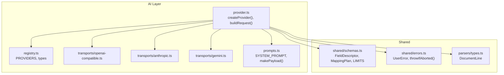
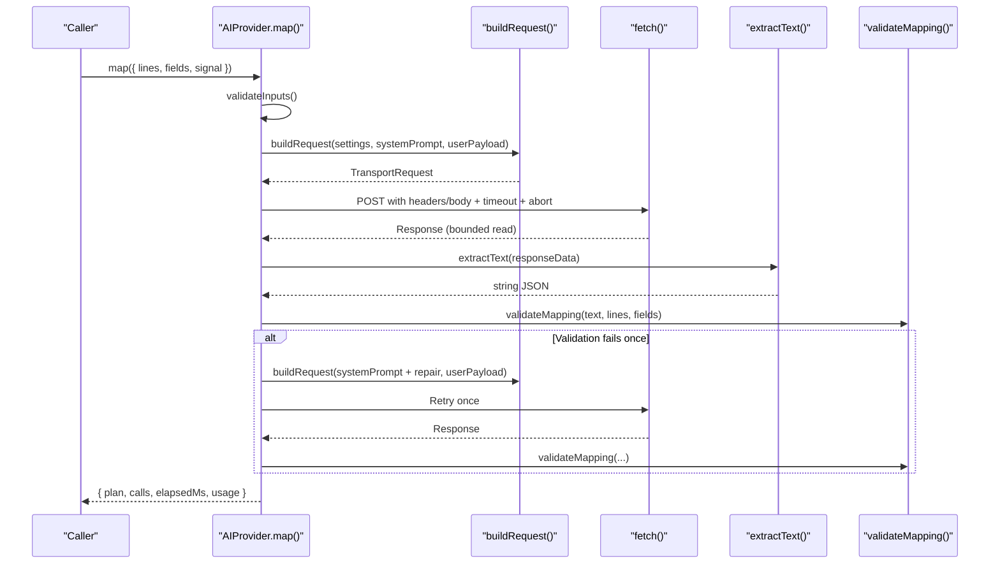
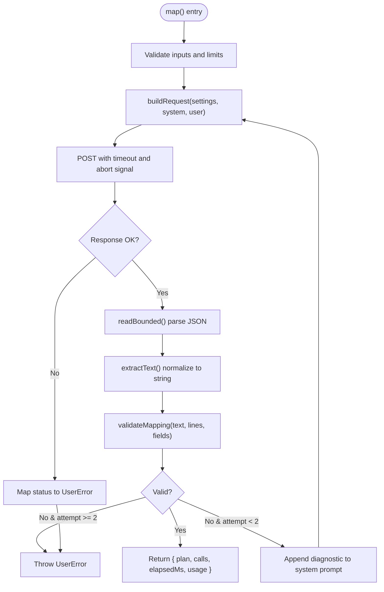
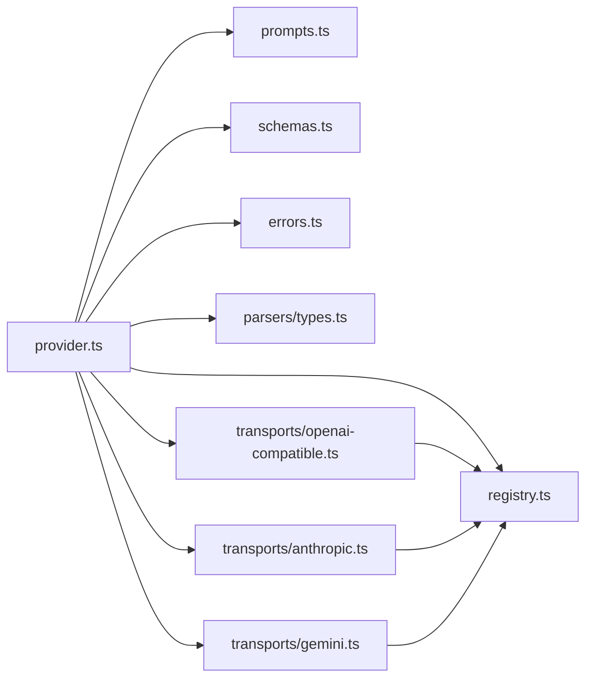

# Core Provider Interface

<cite>
**Referenced Files in This Document**
- [provider.ts](file://src/ai/provider.ts)
- [registry.ts](file://src/ai/registry.ts)
- [anthropic.ts](file://src/ai/transports/anthropic.ts)
- [gemini.ts](file://src/ai/transports/gemini.ts)
- [openai-compatible.ts](file://src/ai/transports/openai-compatible.ts)
- [prompts.ts](file://src/ai/prompts.ts)
- [schemas.ts](file://src/shared/schemas.ts)
- [errors.ts](file://src/shared/errors.ts)
- [types.ts](file://src/parsers/types.ts)
- [providers.test.ts](file://tests/unit/providers.test.ts)
</cite>

## Table of Contents
1. [Introduction](#introduction)
2. [Project Structure](#project-structure)
3. [Core Components](#core-components)
4. [Architecture Overview](#architecture-overview)
5. [Detailed Component Analysis](#detailed-component-analysis)
6. [Dependency Analysis](#dependency-analysis)
7. [Performance Considerations](#performance-considerations)
8. [Troubleshooting Guide](#troubleshooting-guide)
9. [Conclusion](#conclusion)
10. [Appendices](#appendices)

## Introduction
This document describes the core AI provider interface that standardizes how the application integrates with multiple AI service providers. It defines a unified contract for sending requests, handling responses, validating outputs, and managing errors. The interface abstracts provider-specific details behind a consistent API so new providers can be added by implementing a small set of transport functions.

The core responsibilities include:
- Defining a stable provider contract (AIProvider)
- Building provider-specific HTTP requests from shared settings
- Normalizing provider responses into a common text payload
- Validating structured mapping results against strict schemas
- Enforcing safety limits, timeouts, and abort signals
- Providing clear error messages and retry behavior

## Project Structure
The AI integration is organized around a central provider module that orchestrates request building, network calls, response normalization, validation, and lifecycle management. Transport modules implement provider-specific request construction and response parsing. Shared schemas define input/output contracts and limits. Errors are standardized to provide user-friendly messages.

**Diagram sources**
- [provider.ts:1-107](file://src/ai/provider.ts#L1-L107)
- [registry.ts:1-13](file://src/ai/registry.ts#L1-L13)
- [openai-compatible.ts:1-22](file://src/ai/transports/openai-compatible.ts#L1-L22)
- [anthropic.ts:1-17](file://src/ai/transports/anthropic.ts#L1-L17)
- [gemini.ts:1-21](file://src/ai/transports/gemini.ts#L1-L21)
- [prompts.ts:1-26](file://src/ai/prompts.ts#L1-L26)
- [schemas.ts:1-39](file://src/shared/schemas.ts#L1-L39)
- [errors.ts:1-10](file://src/shared/errors.ts#L1-L10)
- [types.ts:1-3](file://src/parsers/types.ts#L1-L3)

**Section sources**
- [provider.ts:1-107](file://src/ai/provider.ts#L1-L107)
- [registry.ts:1-13](file://src/ai/registry.ts#L1-L13)
- [prompts.ts:1-26](file://src/ai/prompts.ts#L1-L26)
- [schemas.ts:1-39](file://src/shared/schemas.ts#L1-L39)
- [errors.ts:1-10](file://src/shared/errors.ts#L1-L10)
- [types.ts:1-3](file://src/parsers/types.ts#L1-L3)

## Core Components
- AIProvider interface: A minimal contract exposing a single method to map document lines to form fields. Implementations encapsulate provider selection, request creation, network calls, response normalization, validation, and retries.
- Provider registry: Central configuration of supported providers, their endpoints, origins, and transport names.
- Transport functions: For each provider, functions to build the HTTP request and extract normalized text from the response.
- Request/response types: Strongly typed structures for inputs, outputs, and limits.
- Error handling: Standardized user-facing errors and abort signal handling.

Key types and interfaces:
- MappingRequest: Input to the provider’s map method containing document lines, field descriptors, and an AbortSignal.
- MappingOutcome: Result including the validated mapping plan, number of calls made, elapsed time, and optional usage metrics.
- ProviderSettings: Configuration object identifying the provider, model, and API key.
- TransportRequest: Low-level HTTP request envelope (URL, headers, body).

Lifecycle highlights:
- createProvider(settings, fetcher) returns an AIProvider instance bound to the provided settings and fetch implementation.
- Each call to map validates inputs, builds a provider request, performs a bounded read of the response, normalizes text, validates the mapping, and handles retries only for schema repair.

**Section sources**
- [provider.ts:11-13](file://src/ai/provider.ts#L11-L13)
- [provider.ts:52-106](file://src/ai/provider.ts#L52-L106)
- [registry.ts:1-13](file://src/ai/registry.ts#L1-L13)
- [schemas.ts:1-39](file://src/shared/schemas.ts#L1-L39)

## Architecture Overview
The provider architecture separates concerns between orchestration and transport:
- Orchestration (provider.ts): Validates inputs, constructs payloads, manages timeouts and aborts, performs bounded response reading, normalizes provider responses, validates mapping output, and implements limited retry logic.
- Transport (transports/*): Encapsulates provider-specific request formatting and response parsing.
- Registry (registry.ts): Declares available providers and their endpoints.
- Shared (shared/*): Defines schemas, limits, and error utilities.

**Diagram sources**
- [provider.ts:52-106](file://src/ai/provider.ts#L52-L106)
- [registry.ts:1-13](file://src/ai/registry.ts#L1-L13)
- [openai-compatible.ts:1-22](file://src/ai/transports/openai-compatible.ts#L1-L22)
- [anthropic.ts:1-17](file://src/ai/transports/anthropic.ts#L1-L17)
- [gemini.ts:1-21](file://src/ai/transports/gemini.ts#L1-L21)
- [prompts.ts:1-26](file://src/ai/prompts.ts#L1-L26)
- [schemas.ts:1-39](file://src/shared/schemas.ts#L1-L39)

## Detailed Component Analysis

### Provider Interface and Lifecycle
- AIProvider.map(request): Accepts a MappingRequest and returns a Promise<MappingOutcome>. It enforces input limits, abort signals, timeouts, and provides at most one automatic retry when the mapping validation fails due to malformed or incomplete output.
- createProvider(settings, fetcher): Returns an AIProvider instance. Settings are captured at creation time to avoid rerouting mid-request if UI changes occur after consent.
- Request building: buildRequest selects the appropriate transport based on settings.provider and constructs a TransportRequest with provider-specific headers and bodies.
- Response handling: readBounded ensures responses do not exceed configured byte limits and parses JSON safely. extractText delegates to provider-specific parsers to normalize content into a single string.
- Validation: validateMapping checks the returned JSON against MappingSchema; on failure, a diagnostic message is appended to the system prompt and a single retry is attempted without re-sending untrusted previous output.

**Diagram sources**
- [provider.ts:52-106](file://src/ai/provider.ts#L52-L106)
- [schemas.ts:1-39](file://src/shared/schemas.ts#L1-L39)

**Section sources**
- [provider.ts:11-13](file://src/ai/provider.ts#L11-L13)
- [provider.ts:15-26](file://src/ai/provider.ts#L15-L26)
- [provider.ts:34-51](file://src/ai/provider.ts#L34-L51)
- [provider.ts:52-106](file://src/ai/provider.ts#L52-L106)

### Request and Response Types
- MappingRequest: Contains document lines, field descriptors, and an AbortSignal for cancellation.
- MappingOutcome: Includes the validated MappingPlan, number of attempts, elapsed time, and optional usage metrics extracted from provider response metadata.
- ProviderSettings: Identifies provider, model, and API key.
- TransportRequest: Describes URL, headers, and body for the underlying HTTP call.
- FieldDescriptor and MappingPlan: Defined in shared schemas to ensure consistency across providers and consumers.

Usage notes:
- Inputs are validated against LIMITS to prevent oversized payloads.
- Output usage numbers are extracted from provider-specific usage fields when present.

**Section sources**
- [provider.ts:11-13](file://src/ai/provider.ts#L11-L13)
- [registry.ts:1-13](file://src/ai/registry.ts#L1-L13)
- [schemas.ts:1-39](file://src/shared/schemas.ts#L1-L39)
- [types.ts:1-3](file://src/parsers/types.ts#L1-L3)

### Error Handling Patterns
- UserError: All user-facing failures are wrapped in a custom error type for consistent messaging.
- Abort handling: throwIfAborted checks the AbortSignal before starting work and during processing to honor cancellations promptly.
- HTTP errors: Status codes are mapped to specific messages (e.g., authentication, rate limiting, unsupported model). Bodies are not leaked to the caller.
- Timeouts: A fixed timeout triggers an abort; no automatic retry is performed for timeouts.
- Oversized responses: Responses exceeding the configured limit are rejected early.
- Network failures: Generic network errors are converted to user-friendly messages without retrying.

**Section sources**
- [errors.ts:1-10](file://src/shared/errors.ts#L1-L10)
- [provider.ts:34-51](file://src/ai/provider.ts#L34-L51)
- [provider.ts:77-104](file://src/ai/provider.ts#L77-L104)

### Configuration Options
- Provider identification: provider, model, apiKey are required in ProviderSettings.
- Provider registry: PROVIDERS maps provider IDs to display name, allowed origin, endpoint, and transport type.
- Transport selection: buildRequest chooses the correct transport function based on settings.provider.

Validation:
- Model ID must match a restricted pattern.
- API key must be non-empty, contain no spaces, and within length limits.

**Section sources**
- [registry.ts:1-13](file://src/ai/registry.ts#L1-L13)
- [provider.ts:15-22](file://src/ai/provider.ts#L15-L22)

### Transport Implementations
Each transport provides two functions:
- request(settings, system, user): Builds a TransportRequest tailored to the provider’s API.
- text(data): Parses the provider’s response and extracts a single JSON string, throwing on refusal or truncation.

OpenAI-compatible:
- Uses Authorization header with bearer token.
- Requests JSON output via response_format.
- Distinguishes max_tokens vs max_completion_tokens depending on provider.

Anthropic:
- Uses x-api-key header and anthropic-version.
- Expects content blocks of type text and stop_reason indicating completion.

Gemini:
- Uses x-goog-api-key header.
- Requires generationConfig to enforce JSON mime type.
- Expects finishReason STOP and parts without “thought” entries.

**Section sources**
- [openai-compatible.ts:1-22](file://src/ai/transports/openai-compatible.ts#L1-L22)
- [anthropic.ts:1-17](file://src/ai/transports/anthropic.ts#L1-L17)
- [gemini.ts:1-21](file://src/ai/transports/gemini.ts#L1-L21)

### Creating a New Provider
To add a new provider:
1. Register it in the provider registry with name, origin, endpoint, and a unique transport identifier.
2. Implement transport functions:
   - request(settings, system, user): Return a TransportRequest with the correct URL, headers, and body for your provider.
   - text(data): Parse the provider’s response and return a single JSON string. Throw a UserError if the response indicates refusal or truncation.
3. Wire up selection in buildRequest and extractText to route to your new transport based on the provider ID.
4. Add tests to verify:
   - Correct host and headers are used.
   - Keys are not embedded in URLs or bodies.
   - Normalized text is produced from mocked responses.
   - Errors are handled appropriately.

Example references:
- See existing transports for patterns in request construction and response parsing.
- Use the unit test file to guide assertions for new transports.

**Section sources**
- [registry.ts:1-13](file://src/ai/registry.ts#L1-L13)
- [provider.ts:19-26](file://src/ai/provider.ts#L19-L26)
- [openai-compatible.ts:1-22](file://src/ai/transports/openai-compatible.ts#L1-L22)
- [anthropic.ts:1-17](file://src/ai/transports/anthropic.ts#L1-L17)
- [gemini.ts:1-21](file://src/ai/transports/gemini.ts#L1-L21)
- [providers.test.ts:14-29](file://tests/unit/providers.test.ts#L14-L29)

### Connection Handling Strategies
- Fixed hosts: Providers are restricted to predefined endpoints and origins to prevent arbitrary redirections.
- Credentials policy: Requests use credentials omitted and cache disabled to avoid leaking sensitive data.
- Redirect policy: Redirects are explicitly disallowed to maintain security and determinism.
- Timeout and abort: Each request has a hard timeout and respects AbortSignal for cancellation.
- Bounded reads: Responses are streamed and bounded to prevent memory exhaustion.

**Section sources**
- [registry.ts:1-13](file://src/ai/registry.ts#L1-L13)
- [provider.ts:72-76](file://src/ai/provider.ts#L72-L76)
- [provider.ts:34-51](file://src/ai/provider.ts#L34-L51)

## Dependency Analysis
The provider layer depends on:
- Registry for provider definitions and transport routing.
- Prompts for constructing system instructions and payloads.
- Schemas for input/output validation and limits.
- Errors for standardized error handling and abort signaling.
- Parser types for document line structures.

Transport modules depend on:
- Registry for endpoints and provider metadata.
- Errors for throwing user-facing errors on invalid responses.

**Diagram sources**
- [provider.ts:1-107](file://src/ai/provider.ts#L1-L107)
- [registry.ts:1-13](file://src/ai/registry.ts#L1-L13)
- [prompts.ts:1-26](file://src/ai/prompts.ts#L1-L26)
- [schemas.ts:1-39](file://src/shared/schemas.ts#L1-L39)
- [errors.ts:1-10](file://src/shared/errors.ts#L1-L10)
- [types.ts:1-3](file://src/parsers/types.ts#L1-L3)
- [openai-compatible.ts:1-22](file://src/ai/transports/openai-compatible.ts#L1-L22)
- [anthropic.ts:1-17](file://src/ai/transports/anthropic.ts#L1-L17)
- [gemini.ts:1-21](file://src/ai/transports/gemini.ts#L1-L21)

**Section sources**
- [provider.ts:1-107](file://src/ai/provider.ts#L1-L107)
- [registry.ts:1-13](file://src/ai/registry.ts#L1-L13)
- [openai-compatible.ts:1-22](file://src/ai/transports/openai-compatible.ts#L1-L22)
- [anthropic.ts:1-17](file://src/ai/transports/anthropic.ts#L1-L17)
- [gemini.ts:1-21](file://src/ai/transports/gemini.ts#L1-L21)

## Performance Considerations
- Bounded response reading prevents excessive memory usage and enforces a maximum response size.
- Streaming reads allow early termination when limits are exceeded.
- Short timeouts reduce resource holding during slow or stalled provider responses.
- Minimal retry strategy avoids unnecessary network load; only one repair attempt is made for schema issues.
- Payloads are compacted to exclude sensitive or unnecessary fields from provider requests.

[No sources needed since this section provides general guidance]

## Troubleshooting Guide
Common issues and resolutions:
- Invalid model or API key: Ensure model matches provider expectations and API key contains no spaces and meets length constraints.
- Rate limiting or quota reached: Wait and retry later; do not automatically retry on rate-limit errors.
- Unsupported model or incompatible response format: Choose a model that supports JSON output and sufficient context window.
- Network or permission errors: Verify browser access policies and network connectivity to the provider’s domain.
- Canceled operations: If the AbortSignal is triggered, no request will start or continue.
- Oversized responses: Reduce document size or choose a provider/model capable of handling larger outputs.

Diagnostic tips:
- Inspect the error message from UserError for actionable guidance.
- Confirm that the selected provider’s endpoint and headers are correctly set in the registry and transport.
- Validate that the provider response structure matches expected shapes in the transport’s text parser.

**Section sources**
- [errors.ts:1-10](file://src/shared/errors.ts#L1-L10)
- [provider.ts:77-104](file://src/ai/provider.ts#L77-L104)
- [openai-compatible.ts:14-21](file://src/ai/transports/openai-compatible.ts#L14-L21)
- [anthropic.ts:10-16](file://src/ai/transports/anthropic.ts#L10-L16)
- [gemini.ts:13-20](file://src/ai/transports/gemini.ts#L13-L20)

## Conclusion
The core provider interface establishes a robust, secure, and extensible contract for integrating multiple AI services. By separating orchestration from transport, enforcing strict validation and safety limits, and providing clear error handling, the system ensures reliable operation across diverse providers while keeping the integration surface minimal for adding new ones.

[No sources needed since this section summarizes without analyzing specific files]

## Appendices

### Data Models Summary
- FieldDescriptor: Describes form fields to be filled, including identifiers, types, labels, and constraints.
- MappingPlan: Structured result containing assignments with evidence and reasons, plus unmapped fields with explanations.
- DocumentLine: Represents a line of parsed document content with id, page, and text.

**Section sources**
- [schemas.ts:1-39](file://src/shared/schemas.ts#L1-L39)
- [types.ts:1-3](file://src/parsers/types.ts#L1-L3)