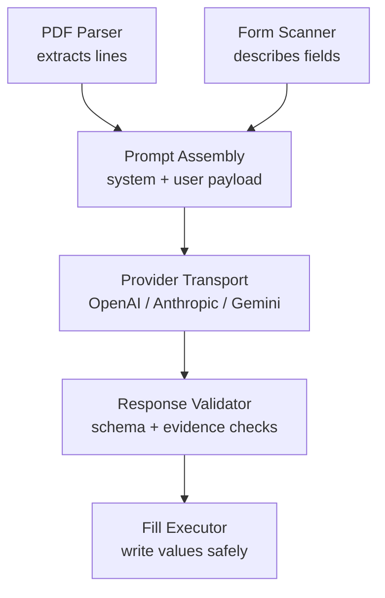
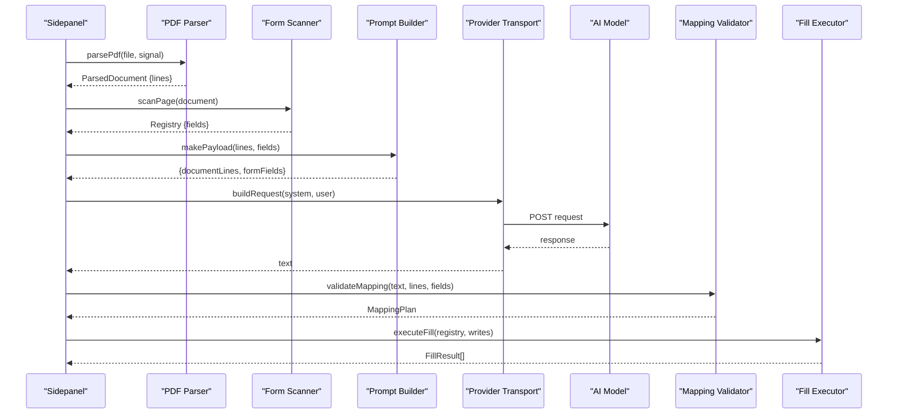
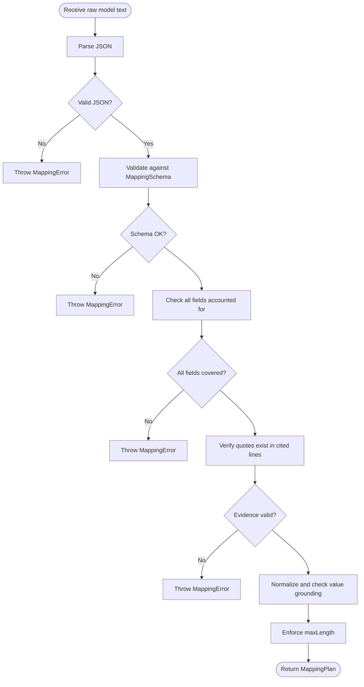
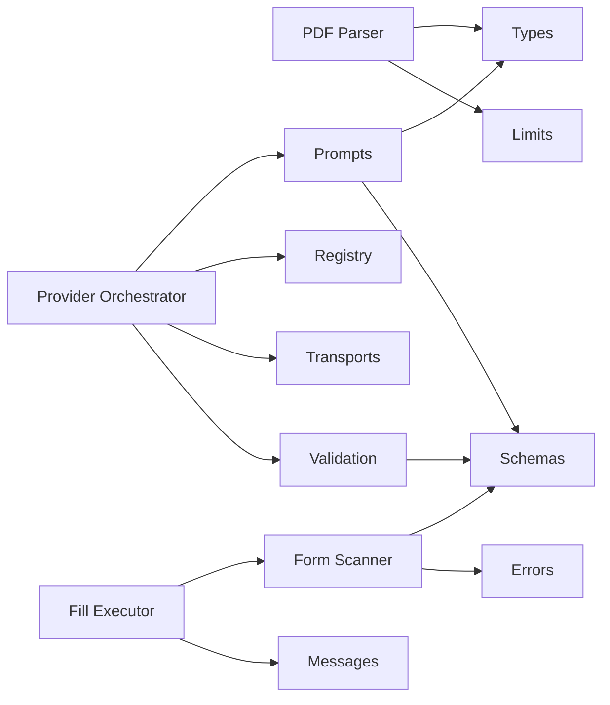
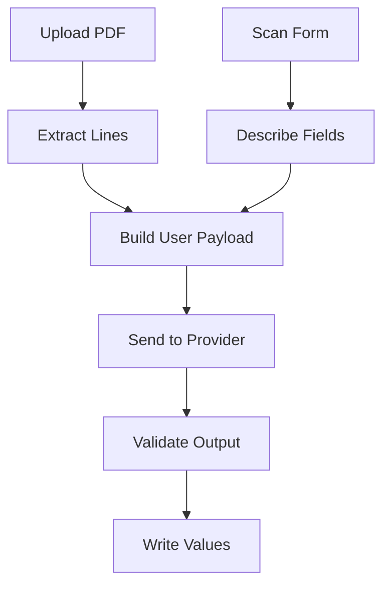

# Prompt Engineering System

<cite>
**Referenced Files in This Document**
- [prompts.ts](file://src/ai/prompts.ts)
- [provider.ts](file://src/ai/provider.ts)
- [registry.ts](file://src/ai/registry.ts)
- [validate-mapping.ts](file://src/ai/validate-mapping.ts)
- [openai-compatible.ts](file://src/ai/transports/openai-compatible.ts)
- [anthropic.ts](file://src/ai/transports/anthropic.ts)
- [gemini.ts](file://src/ai/transports/gemini.ts)
- [schemas.ts](file://src/shared/schemas.ts)
- [pdf.ts](file://src/parsers/pdf.ts)
- [types.ts](file://src/parsers/types.ts)
- [scan.ts](file://src/content/scan.ts)
- [fill.ts](file://src/content/fill.ts)
</cite>

## Table of Contents
1. [Introduction](#introduction)
2. [Project Structure](#project-structure)
3. [Core Components](#core-components)
4. [Architecture Overview](#architecture-overview)
5. [Detailed Component Analysis](#detailed-component-analysis)
6. [Dependency Analysis](#dependency-analysis)
7. [Performance Considerations](#performance-considerations)
8. [Troubleshooting Guide](#troubleshooting-guide)
9. [Conclusion](#conclusion)
10. [Appendices](#appendices)

## Introduction
This document explains the prompt engineering system that generates optimized prompts for form field mapping tasks. It covers how PDF content is extracted and transformed into structured lines, how web form fields are described and compacted, and how these pieces are combined into AI queries via provider-specific transports. The system enforces strict schemas, evidence-based value extraction, and robust validation to improve accuracy when mapping document text to web form fields.

## Project Structure
The prompt engineering pipeline spans several modules:
- PDF parsing converts documents into page-scoped lines with stable IDs.
- Form scanning describes visible text controls as field descriptors with labels, context, and constraints.
- Prompt assembly builds a system instruction and a user payload containing document lines and field metadata.
- Provider transports format requests for OpenAI-compatible APIs, Anthropic, and Gemini.
- Response validation ensures outputs conform to a strict schema and are grounded in cited evidence.
- Execution fills validated values back into the form with safety checks.

**Diagram sources**
- [pdf.ts:15-87](file://src/parsers/pdf.ts#L15-L87)
- [scan.ts:32-76](file://src/content/scan.ts#L32-L76)
- [prompts.ts:4-25](file://src/ai/prompts.ts#L4-L25)
- [openai-compatible.ts:4-21](file://src/ai/transports/openai-compatible.ts#L4-L21)
- [anthropic.ts:3-16](file://src/ai/transports/anthropic.ts#L3-L16)
- [gemini.ts:3-20](file://src/ai/transports/gemini.ts#L3-L20)
- [validate-mapping.ts:7-32](file://src/ai/validate-mapping.ts#L7-L32)
- [fill.ts:42-80](file://src/content/fill.ts#L42-L80)

**Section sources**
- [pdf.ts:15-87](file://src/parsers/pdf.ts#L15-L87)
- [scan.ts:32-76](file://src/content/scan.ts#L32-L76)
- [prompts.ts:4-25](file://src/ai/prompts.ts#L4-L25)
- [schemas.ts:3-23](file://src/shared/schemas.ts#L3-L23)

## Core Components
- System prompt defines the rules for extracting verbatim values from document lines and returning a strict JSON mapping plan with assignments and unmapped fields.
- Field compaction strips sensitive or runtime-only properties before sending to providers, ensuring only safe metadata reaches the model.
- Payload construction serializes document lines and compacted fields into a single user message for the AI.
- Provider transport selection formats requests according to each provider’s API contract and extracts text responses consistently.
- Validation enforces schema compliance, uniqueness, coverage of all fields, evidence presence, and value grounding.

Key responsibilities:
- Build untrusted but constrained inputs (document lines, field descriptors).
- Enforce limits on input size and output size to protect performance and cost.
- Provide retry logic with diagnostic repair messages when validation fails.
- Ensure every field is explicitly assigned or unmapped with reasons.

**Section sources**
- [prompts.ts:4-25](file://src/ai/prompts.ts#L4-L25)
- [provider.ts:19-26](file://src/ai/provider.ts#L19-L26)
- [validate-mapping.ts:7-32](file://src/ai/validate-mapping.ts#L7-L32)
- [schemas.ts:3-23](file://src/shared/schemas.ts#L3-L23)

## Architecture Overview
The end-to-end flow starts with a PDF and a web form, produces an AI query, validates the response, and writes values back to the form.

**Diagram sources**
- [pdf.ts:40-87](file://src/parsers/pdf.ts#L40-L87)
- [scan.ts:62-76](file://src/content/scan.ts#L62-L76)
- [prompts.ts:18-25](file://src/ai/prompts.ts#L18-L25)
- [provider.ts:52-105](file://src/ai/provider.ts#L52-L105)
- [openai-compatible.ts:4-21](file://src/ai/transports/openai-compatible.ts#L4-L21)
- [anthropic.ts:3-16](file://src/ai/transports/anthropic.ts#L3-L16)
- [gemini.ts:3-20](file://src/ai/transports/gemini.ts#L3-L20)
- [validate-mapping.ts:7-32](file://src/ai/validate-mapping.ts#L7-L32)
- [fill.ts:42-80](file://src/content/fill.ts#L42-L80)

## Detailed Component Analysis

### Prompt Templates and Variable Substitution
- System prompt establishes strict behavior: use only provided field IDs, copy verbatim values supported by document lines, cite exact quotes and line IDs, preserve formatting details, avoid inference, and return a complete mapping plan including unmapped fields with reasons.
- Field compaction filters out current values and page URL from the payload to prevent leaking runtime state to providers.
- Payload construction serializes document lines and compacted fields into a user message string for the AI.

Best practices embedded in the template:
- Require evidence-backed values with exact quotes and line references.
- Prohibit inference and conversions; allow only whitespace normalization.
- Enforce one assignment per field and explicit unmapped entries for missing data.

**Section sources**
- [prompts.ts:4-25](file://src/ai/prompts.ts#L4-L25)

### Context Building Strategies
- PDF parser tokenizes pages into lines with stable IDs and page numbers, preserving spacing and line breaks based on text geometry.
- Form scanner describes each control with label, ariaLabel, placeholder, name, context (heading), required flag, maxLength, and pattern. Sensitive controls are excluded to reduce risk.
- Combined context sent to the model includes both document evidence and precise field metadata, enabling accurate role-aware matching (e.g., applicant vs contact).

Optimization techniques:
- Limit total characters extracted from PDFs to stay within model constraints.
- Cap number of fields and enforce maximum lengths to keep payloads manageable.
- Use compacted field descriptors to minimize noise while retaining essential hints.

**Section sources**
- [pdf.ts:15-87](file://src/parsers/pdf.ts#L15-L87)
- [scan.ts:32-76](file://src/content/scan.ts#L32-L76)
- [schemas.ts:3-23](file://src/shared/schemas.ts#L3-L23)

### Provider Transports and Request Formatting
- OpenAI-compatible transport uses messages with system and user roles and requests JSON output mode.
- Anthropic transport sends a separate system block and user message with max tokens configured.
- Gemini transport sets systemInstruction and generationConfig for JSON mime type and token limits.
- All transports normalize response text extraction and handle refusal/truncation errors consistently.

Provider selection is driven by registry configuration, allowing multiple endpoints under a unified interface.

**Section sources**
- [registry.ts:1-12](file://src/ai/registry.ts#L1-L12)
- [openai-compatible.ts:4-21](file://src/ai/transports/openai-compatible.ts#L4-L21)
- [anthropic.ts:3-16](file://src/ai/transports/anthropic.ts#L3-L16)
- [gemini.ts:3-20](file://src/ai/transports/gemini.ts#L3-L20)

### Validation and Error Handling
- Response validator enforces:
  - JSON validity and schema conformance.
  - Unique and known field IDs across assignments and unmapped lists.
  - Coverage of all fields (no omissions).
  - Evidence quotes must exist in cited lines.
  - Proposed values must be substrings of joined evidence after whitespace normalization.
  - Value length constraints per field.
- If validation fails once, the system retries with a repair message appended to the system prompt, instructing the model to correct its output without re-sending untrusted prior content.
- Network and provider errors are translated into user-friendly messages, with timeouts and rate-limit handling.

**Diagram sources**
- [validate-mapping.ts:7-32](file://src/ai/validate-mapping.ts#L7-L32)
- [schemas.ts:15-23](file://src/shared/schemas.ts#L15-L23)

**Section sources**
- [validate-mapping.ts:7-32](file://src/ai/validate-mapping.ts#L7-L32)
- [provider.ts:63-105](file://src/ai/provider.ts#L63-L105)

### Execution Safety and Form Filling
- Before writing, the executor validates expected values, prevents overwrites without approval, and checks native browser validity.
- Values are set using native setters and events to ensure compatibility with frameworks.
- Post-write verification confirms persistence and validity; failures mark results appropriately and stop further writes to avoid partial states.

**Section sources**
- [fill.ts:8-80](file://src/content/fill.ts#L8-L80)

## Dependency Analysis
The system composes several modules with clear boundaries:
- Parsing depends on shared limits and error utilities.
- Scanning depends on shared schemas and error utilities.
- Prompt building depends on parsed types and schemas.
- Provider orchestration depends on registry, transports, and validation.
- Execution depends on scanning registry and shared messages.

**Diagram sources**
- [pdf.ts:1-87](file://src/parsers/pdf.ts#L1-L87)
- [scan.ts:1-88](file://src/content/scan.ts#L1-L88)
- [prompts.ts:1-25](file://src/ai/prompts.ts#L1-L25)
- [provider.ts:1-107](file://src/ai/provider.ts#L1-L107)
- [registry.ts:1-12](file://src/ai/registry.ts#L1-L12)
- [openai-compatible.ts:1-22](file://src/ai/transports/openai-compatible.ts#L1-L22)
- [anthropic.ts:1-17](file://src/ai/transports/anthropic.ts#L1-L17)
- [gemini.ts:1-21](file://src/ai/transports/gemini.ts#L1-L21)
- [validate-mapping.ts:1-33](file://src/ai/validate-mapping.ts#L1-L33)
- [fill.ts:1-82](file://src/content/fill.ts#L1-L82)

**Section sources**
- [schemas.ts:1-39](file://src/shared/schemas.ts#L1-L39)
- [registry.ts:1-12](file://src/ai/registry.ts#L1-L12)

## Performance Considerations
- Input limits:
  - PDF size capped at 10 MiB.
  - Extracted text limited to 24,000 characters.
  - Maximum 20 pages processed.
  - Maximum 60 fields scanned.
  - Response size limited to 256 KiB.
- Token and output limits:
  - Max tokens set to 8192 across transports to constrain model output.
- Timeouts:
  - Requests time out after 60 seconds to prevent hanging operations.
- Memory and streaming:
  - Responses are read in bounded chunks and canceled if they exceed limits.
- Efficiency tips:
  - Keep PDFs concise and text-based; avoid image-only scans.
  - Prefer forms with clear labels and minimal complexity.
  - Use compacted field descriptors to reduce payload size.

[No sources needed since this section provides general guidance]

## Troubleshooting Guide
Common issues and resolutions:
- Invalid or unsupported PDF:
  - Ensure the file is a standard PDF with extractable text; password-protected or image-only PDFs are not supported.
- Too many controls or fields:
  - Simplify the form or reduce the number of eligible fields to meet limits.
- Provider errors:
  - Authentication failures: verify API key and account access.
  - Rate limits: wait or adjust usage settings.
  - Model incompatibility: choose a model that supports JSON output and sufficient token capacity.
- Validation failures:
  - Missing or duplicate field IDs: ensure the model accounts for every field exactly once.
  - Evidence mismatch: confirm quotes exist in cited lines and values are grounded in evidence.
  - Exceeding field length: shorten proposed values to fit maxLength.
- Execution failures:
  - Overwriting existing values requires explicit approval.
  - Browser normalization or invalid values will be rejected; edit before filling.

**Section sources**
- [pdf.ts:7-13](file://src/parsers/pdf.ts#L7-L13)
- [pdf.ts:40-87](file://src/parsers/pdf.ts#L40-L87)
- [scan.ts:62-88](file://src/content/scan.ts#L62-L88)
- [provider.ts:71-105](file://src/ai/provider.ts#L71-L105)
- [validate-mapping.ts:7-32](file://src/ai/validate-mapping.ts#L7-L32)
- [fill.ts:8-80](file://src/content/fill.ts#L8-L80)

## Conclusion
The prompt engineering system combines careful context construction, strict prompting, and rigorous validation to map PDF content to web form fields reliably. By enforcing evidence-backed extraction, limiting inputs and outputs, and providing robust error handling and retries, it achieves high accuracy in form-filling scenarios. Following the best practices outlined here—clear field metadata, concise documents, and appropriate model selection—will further improve outcomes.

[No sources needed since this section summarizes without analyzing specific files]

## Appendices

### Prompt Variations and Optimization Techniques
- Role-aware matching:
  - Emphasize entity roles (applicant vs contact) to avoid misattribution.
- Verbatim preservation:
  - Maintain spelling, Unicode, leading zeros, phone prefixes, identifiers, units, and date formats.
- Evidence citation:
  - Require exact quotes and line IDs to ground values in source text.
- Unmapped reporting:
  - Always include unmapped fields with reasons when information is missing or ambiguous.
- Repair messaging:
  - On validation failure, append a concise diagnostic to guide the model toward a corrected response.

**Section sources**
- [prompts.ts:4-16](file://src/ai/prompts.ts#L4-L16)
- [validate-mapping.ts:7-32](file://src/ai/validate-mapping.ts#L7-L32)
- [provider.ts:87-94](file://src/ai/provider.ts#L87-L94)

### Data Flow Summary

**Diagram sources**
- [pdf.ts:40-87](file://src/parsers/pdf.ts#L40-L87)
- [scan.ts:62-76](file://src/content/scan.ts#L62-L76)
- [prompts.ts:18-25](file://src/ai/prompts.ts#L18-L25)
- [provider.ts:52-105](file://src/ai/provider.ts#L52-L105)
- [validate-mapping.ts:7-32](file://src/ai/validate-mapping.ts#L7-L32)
- [fill.ts:42-80](file://src/content/fill.ts#L42-L80)