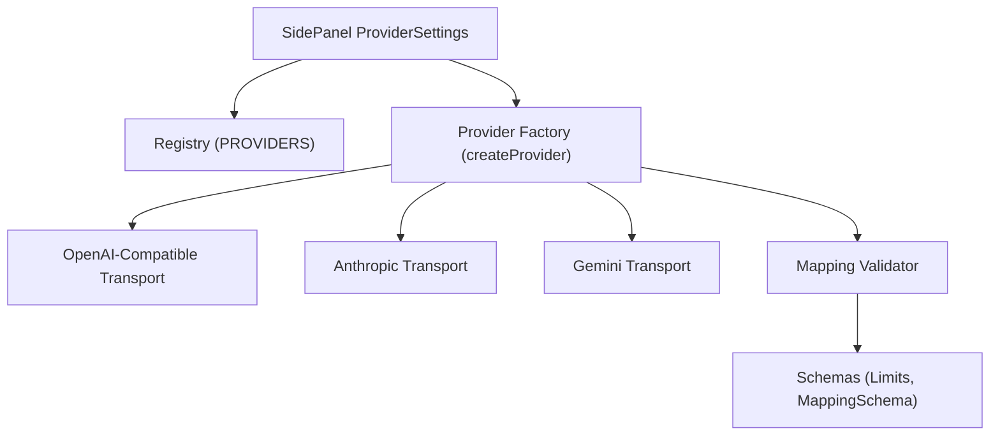
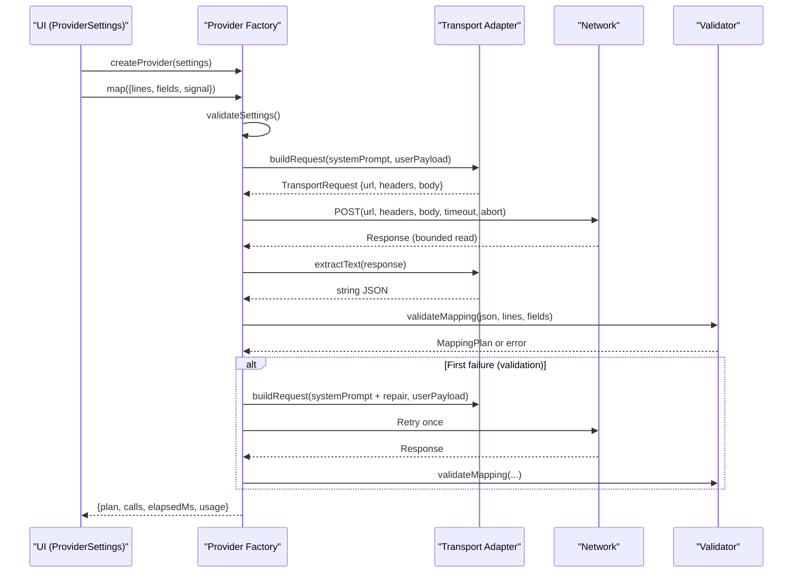
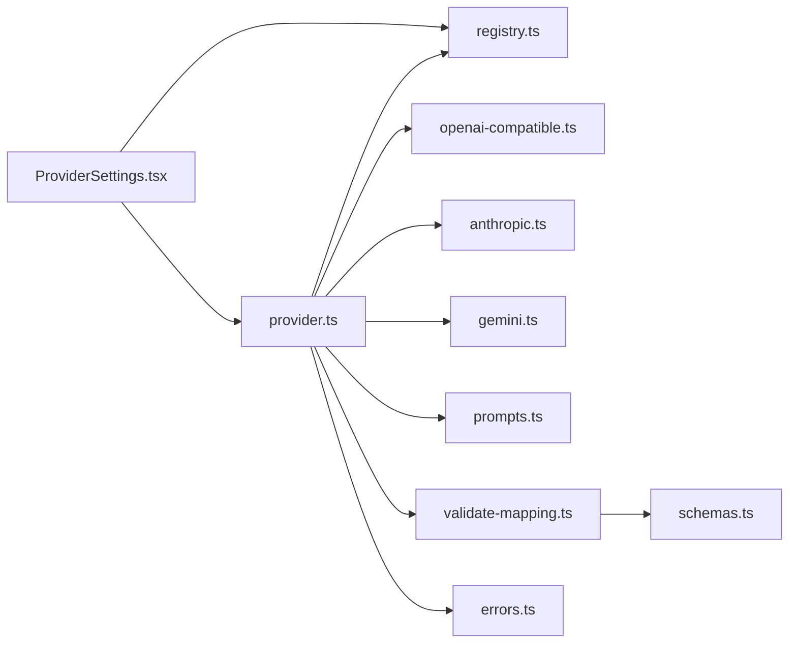

# Provider Registry and Configuration

<cite>
**Referenced Files in This Document**
- [registry.ts](file://src/ai/registry.ts)
- [provider.ts](file://src/ai/provider.ts)
- [openai-compatible.ts](file://src/ai/transports/openai-compatible.ts)
- [anthropic.ts](file://src/ai/transports/anthropic.ts)
- [gemini.ts](file://src/ai/transports/gemini.ts)
- [prompts.ts](file://src/ai/prompts.ts)
- [validate-mapping.ts](file://src/ai/validate-mapping.ts)
- [schemas.ts](file://src/shared/schemas.ts)
- [errors.ts](file://src/shared/errors.ts)
- [ProviderSettings.tsx](file://src/sidepanel/components/ProviderSettings.tsx)
- [providers.test.ts](file://tests/unit/providers.test.ts)
</cite>

## Table of Contents
1. [Introduction](#introduction)
2. [Project Structure](#project-structure)
3. [Core Components](#core-components)
4. [Architecture Overview](#architecture-overview)
5. [Detailed Component Analysis](#detailed-component-analysis)
6. [Dependency Analysis](#dependency-analysis)
7. [Performance Considerations](#performance-considerations)
8. [Troubleshooting Guide](#troubleshooting-guide)
9. [Conclusion](#conclusion)
10. [Appendices](#appendices)

## Introduction
This document explains the provider registry system that manages dynamic loading and configuration of AI providers for form-filling tasks. It covers how providers are registered, discovered, and instantiated based on user settings; how configurations are validated; how fallback mechanisms work when primary requests fail; and the configuration schema that defines available provider options. It also includes examples of adding new providers and customizing behavior through configuration.

## Project Structure
The provider system is implemented across a small set of focused modules:
- Registry and types define supported providers and request shapes.
- A provider factory builds transport-specific requests and parses responses.
- Transport adapters implement per-provider HTTP formats and response parsing.
- Validation ensures model outputs conform to a strict mapping schema before use.
- UI components persist and validate user settings and manage permissions.

**Diagram sources**
- [ProviderSettings.tsx:1-70](file://src/sidepanel/components/ProviderSettings.tsx#L1-L70)
- [registry.ts:1-13](file://src/ai/registry.ts#L1-L13)
- [provider.ts:1-107](file://src/ai/provider.ts#L1-L107)
- [openai-compatible.ts:1-22](file://src/ai/transports/openai-compatible.ts#L1-L22)
- [anthropic.ts:1-17](file://src/ai/transports/anthropic.ts#L1-L17)
- [gemini.ts:1-21](file://src/ai/transports/gemini.ts#L1-L21)
- [validate-mapping.ts:1-33](file://src/ai/validate-mapping.ts#L1-L33)
- [schemas.ts:1-39](file://src/shared/schemas.ts#L1-L39)

**Section sources**
- [registry.ts:1-13](file://src/ai/registry.ts#L1-L13)
- [provider.ts:1-107](file://src/ai/provider.ts#L1-L107)
- [ProviderSettings.tsx:1-70](file://src/sidepanel/components/ProviderSettings.tsx#L1-L70)

## Core Components
- Provider Registry: Central map of supported providers with names, origins, endpoints, and transport identifiers.
- Provider Factory: Builds transport-specific requests, executes them with safety controls, parses responses, validates output, and returns a mapping plan.
- Transports: Per-provider implementations for constructing requests and extracting text from responses.
- Validation: Enforces limits and schema constraints on both inputs and model outputs.
- Settings UI: Persists provider selection, model ID, and API key; manages host permissions and session-scoped storage.

Key responsibilities:
- Registration and discovery: Providers are declared once in the registry and exposed to the UI and runtime.
- Instantiation: createProvider constructs an isolated instance bound to current settings and fetcher.
- Validation: Settings and model outputs are validated before and after network calls.
- Fallbacks: One automatic retry is performed only for invalid model outputs; network or HTTP errors do not retry.

**Section sources**
- [registry.ts:1-13](file://src/ai/registry.ts#L1-L13)
- [provider.ts:15-107](file://src/ai/provider.ts#L15-L107)
- [openai-compatible.ts:1-22](file://src/ai/transports/openai-compatible.ts#L1-L22)
- [anthropic.ts:1-17](file://src/ai/transports/anthropic.ts#L1-L17)
- [gemini.ts:1-21](file://src/ai/transports/gemini.ts#L1-L21)
- [validate-mapping.ts:1-33](file://src/ai/validate-mapping.ts#L1-L33)
- [schemas.ts:1-39](file://src/shared/schemas.ts#L1-L39)
- [ProviderSettings.tsx:1-70](file://src/sidepanel/components/ProviderSettings.tsx#L1-L70)

## Architecture Overview
The system uses a registry-driven architecture where each provider maps to a transport adapter. The provider factory composes prompts, builds transport requests, enforces timeouts and abort signals, reads bounded responses, extracts text, and validates the result against a strict schema. If validation fails once, it retries with a diagnostic prompt but never re-sends untrusted model output.

**Diagram sources**
- [provider.ts:52-105](file://src/ai/provider.ts#L52-L105)
- [openai-compatible.ts:4-21](file://src/ai/transports/openai-compatible.ts#L4-L21)
- [anthropic.ts:3-16](file://src/ai/transports/anthropic.ts#L3-L16)
- [gemini.ts:3-20](file://src/ai/transports/gemini.ts#L3-L20)
- [validate-mapping.ts:7-32](file://src/ai/validate-mapping.ts#L7-L32)

## Detailed Component Analysis

### Provider Registry
- Defines all supported providers with display name, origin pattern, endpoint URL, and transport type.
- Exposes a type-safe provider ID union and a helper to validate provider IDs.
- Provides a typed settings shape including provider, model, and apiKey.

Usage highlights:
- UI enumerates providers for selection.
- Runtime selects transport by provider.transport.
- Permissions are requested using provider.origin.

**Section sources**
- [registry.ts:1-13](file://src/ai/registry.ts#L1-L13)
- [ProviderSettings.tsx:1-70](file://src/sidepanel/components/ProviderSettings.tsx#L1-L70)

### Provider Factory and Request Lifecycle
- Validates settings (model format, apiKey rules).
- Enforces input limits (fields count, characters).
- Builds transport-specific requests using the registry’s endpoint and transport.
- Executes fetch with security flags, abort controller, and a 60-second timeout.
- Reads bounded responses to prevent memory abuse and parse JSON safely.
- Extracts text via transport-specific parsers.
- Validates mapping output; if invalid, retries once with a diagnostic prompt.
- Returns plan, call count, elapsed time, and optional usage metrics.

Error handling:
- Distinguishes authentication, rate limiting, bad model, and general failures.
- Does not retry on HTTP errors or network failures.
- Honors abort signals and cleans up timers/listeners.

**Section sources**
- [provider.ts:15-107](file://src/ai/provider.ts#L15-L107)
- [errors.ts:1-10](file://src/shared/errors.ts#L1-L10)

### Transport Adapters
- OpenAI-compatible: Uses Bearer token, messages array, JSON mode, and token limits. Extracts content from choices.
- Anthropic: Uses x-api-key header, anthropic-version, direct browser access flag, and message-based payload. Extracts text blocks.
- Gemini: Encodes model name, uses systemInstruction and contents, sets JSON mime type, and filters thought parts.

Each adapter encapsulates provider-specific request construction and safe text extraction.

**Section sources**
- [openai-compatible.ts:1-22](file://src/ai/transports/openai-compatible.ts#L1-L22)
- [anthropic.ts:1-17](file://src/ai/transports/anthropic.ts#L1-L17)
- [gemini.ts:1-21](file://src/ai/transports/gemini.ts#L1-L21)

### Prompting and Payload Construction
- System prompt instructs the model to return strictly structured JSON for field assignments and unmapped fields, with evidence quoting and semantic matching rules.
- makePayload compacts field descriptors into a minimal payload and pairs it with document lines.

**Section sources**
- [prompts.ts:1-26](file://src/ai/prompts.ts#L1-L26)

### Validation System
- Input validation: Limits on bytes, pages, characters, fields, response size, and value length.
- Output validation: Parses JSON, validates against MappingSchema, checks field coverage, uniqueness, quote presence, value support by evidence, and field length constraints.
- Custom MappingError subclass used to differentiate validation failures from other errors.

**Section sources**
- [schemas.ts:1-39](file://src/shared/schemas.ts#L1-L39)
- [validate-mapping.ts:1-33](file://src/ai/validate-mapping.ts#L1-L33)

### User Settings and Persistence
- Loads saved preferences and session-stored keys.
- Validates settings before saving.
- Requests host permission for the selected provider origin.
- Stores API key in session storage and preferences in local storage.
- Allows revoking permissions and removing keys.

**Section sources**
- [ProviderSettings.tsx:1-70](file://src/sidepanel/components/ProviderSettings.tsx#L1-L70)

### Adding a New Provider (Step-by-Step)
To add a new provider:
1. Define the provider entry in the registry with name, origin, endpoint, and transport identifier.
2. Implement a transport adapter module with request builder and text extractor functions.
3. Wire the new transport into the provider factory’s routing logic based on provider.transport.
4. Update UI to enumerate the new provider automatically (if using registry enumeration).
5. Add tests to verify request structure, response parsing, and error paths.

Example references:
- Registry definition pattern: [registry.ts:1-13](file://src/ai/registry.ts#L1-L13)
- Transport implementation pattern: [openai-compatible.ts:1-22](file://src/ai/transports/openai-compatible.ts#L1-L22), [anthropic.ts:1-17](file://src/ai/transports/anthropic.ts#L1-L17), [gemini.ts:1-21](file://src/ai/transports/gemini.ts#L1-L21)
- Factory routing: [provider.ts:19-26](file://src/ai/provider.ts#L19-L26)

**Section sources**
- [registry.ts:1-13](file://src/ai/registry.ts#L1-L13)
- [provider.ts:19-26](file://src/ai/provider.ts#L19-L26)
- [openai-compatible.ts:1-22](file://src/ai/transports/openai-compatible.ts#L1-L22)
- [anthropic.ts:1-17](file://src/ai/transports/anthropic.ts#L1-L17)
- [gemini.ts:1-21](file://src/ai/transports/gemini.ts#L1-L21)

### Customizing Provider Behavior via Configuration
- Model ID: Selects which model to call; must be valid per provider account.
- API Key: Stored in session storage; required for authentication.
- Host Origin: Permission is requested per provider origin; can be revoked.
- Transport-specific options: Token limits and JSON modes are handled inside transports; users typically do not configure these directly.

Behavioral knobs:
- Timeouts: Fixed at 60 seconds per request.
- Retry policy: One retry only for invalid model output; no retries for network or HTTP errors.
- Safety: Credentials are placed in headers, not body; responses are bounded and parsed safely.

**Section sources**
- [provider.ts:52-105](file://src/ai/provider.ts#L52-L105)
- [openai-compatible.ts:4-12](file://src/ai/transports/openai-compatible.ts#L4-L12)
- [anthropic.ts:3-8](file://src/ai/transports/anthropic.ts#L3-L8)
- [gemini.ts:3-11](file://src/ai/transports/gemini.ts#L3-L11)
- [ProviderSettings.tsx:32-44](file://src/sidepanel/components/ProviderSettings.tsx#L32-L44)

## Dependency Analysis
The provider system has clear layering:
- UI depends on registry and provider factory.
- Provider factory depends on registry, transports, prompts, validators, and shared schemas/errors.
- Transports depend on registry and errors.
- Validators depend on schemas and errors.

**Diagram sources**
- [ProviderSettings.tsx:1-70](file://src/sidepanel/components/ProviderSettings.tsx#L1-L70)
- [registry.ts:1-13](file://src/ai/registry.ts#L1-L13)
- [provider.ts:1-107](file://src/ai/provider.ts#L1-L107)
- [openai-compatible.ts:1-22](file://src/ai/transports/openai-compatible.ts#L1-L22)
- [anthropic.ts:1-17](file://src/ai/transports/anthropic.ts#L1-L17)
- [gemini.ts:1-21](file://src/ai/transports/gemini.ts#L1-L21)
- [prompts.ts:1-26](file://src/ai/prompts.ts#L1-L26)
- [validate-mapping.ts:1-33](file://src/ai/validate-mapping.ts#L1-L33)
- [schemas.ts:1-39](file://src/shared/schemas.ts#L1-L39)
- [errors.ts:1-10](file://src/shared/errors.ts#L1-L10)

**Section sources**
- [provider.ts:1-107](file://src/ai/provider.ts#L1-L107)
- [registry.ts:1-13](file://src/ai/registry.ts#L1-L13)

## Performance Considerations
- Bounded response reading prevents excessive memory usage and enforces a 256 KiB limit.
- Fixed 60-second timeout avoids long-running requests without user intervention.
- Minimal payload construction reduces bandwidth and processing overhead.
- Single retry for invalid outputs balances robustness with cost control.
- Using JSON mode and explicit token limits helps keep responses predictable and within budget.

[No sources needed since this section provides general guidance]

## Troubleshooting Guide
Common issues and resolutions:
- Invalid model ID or unsupported model: Ensure the model supports JSON output and is available for the selected provider.
- API key errors (401/403): Verify key validity, account access, and browser-access policies.
- Rate limits (429): Wait or adjust usage; no automatic retry is performed.
- Bad request or missing model (400/404): Confirm model ID and provider compatibility.
- Network failures: Check connectivity and host permissions; no automatic retry.
- Oversized responses: Reduce document size or choose a more efficient model.
- Aborted requests: Canceled operations do not start new requests.

Validation failures:
- Non-JSON or schema mismatch: The system will retry once with a diagnostic prompt; persistent failures indicate model incompatibility or overly complex documents.
- Evidence mismatches: Ensure quotes exist on cited lines and values are supported by evidence.

**Section sources**
- [provider.ts:71-104](file://src/ai/provider.ts#L71-L104)
- [validate-mapping.ts:7-32](file://src/ai/validate-mapping.ts#L7-L32)
- [errors.ts:1-10](file://src/shared/errors.ts#L1-L10)
- [providers.test.ts:30-68](file://tests/unit/providers.test.ts#L30-L68)

## Conclusion
The provider registry system offers a secure, extensible, and well-validated approach to integrating multiple AI providers. By centralizing provider metadata, isolating transport logic, enforcing strict input/output validation, and implementing cautious fallback behavior, it balances usability with safety and performance. Extending the system to support new providers involves adding registry entries and transport adapters, while configuration remains simple and user-controlled.

[No sources needed since this section summarizes without analyzing specific files]

## Appendices

### Configuration Schema Summary
- Provider settings include provider ID, model ID, and API key.
- Limits constrain input size, field counts, and response sizes.
- Mapping output must conform to a strict schema with assignments and unmapped fields, including evidence citations and reasons.

**Section sources**
- [registry.ts:1-13](file://src/ai/registry.ts#L1-L13)
- [schemas.ts:1-39](file://src/shared/schemas.ts#L1-L39)

### Example Workflows

#### Adding a New Provider
- Register provider in registry with name, origin, endpoint, and transport.
- Implement transport request builder and text extractor.
- Route transport in provider factory based on provider.transport.
- Test request structure, response parsing, and error handling.

References:
- [registry.ts:1-13](file://src/ai/registry.ts#L1-L13)
- [provider.ts:19-26](file://src/ai/provider.ts#L19-L26)
- [openai-compatible.ts:1-22](file://src/ai/transports/openai-compatible.ts#L1-L22)
- [anthropic.ts:1-17](file://src/ai/transports/anthropic.ts#L1-L17)
- [gemini.ts:1-21](file://src/ai/transports/gemini.ts#L1-L21)

#### Customizing Behavior via Configuration
- Choose provider and model ID appropriate for your needs.
- Store API key in session storage; request host permission.
- Adjust expectations around timeouts, retries, and response sizes.

References:
- [ProviderSettings.tsx:32-44](file://src/sidepanel/components/ProviderSettings.tsx#L32-L44)
- [provider.ts:52-105](file://src/ai/provider.ts#L52-L105)