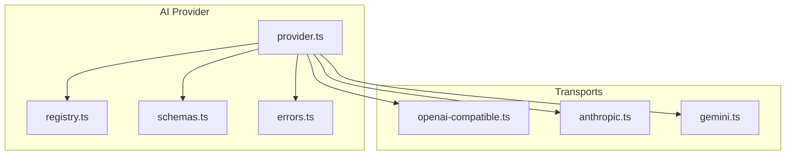
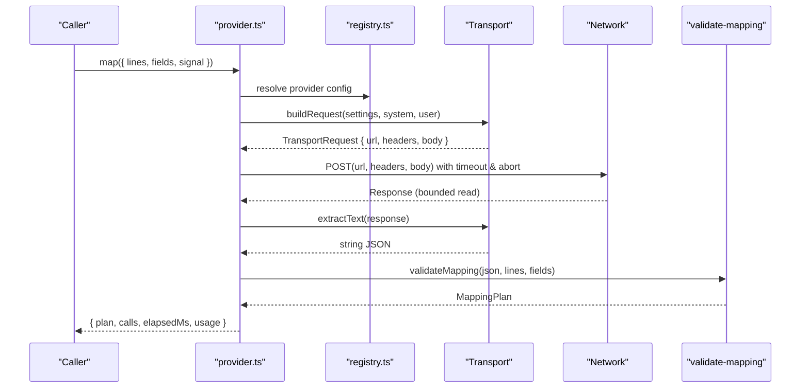
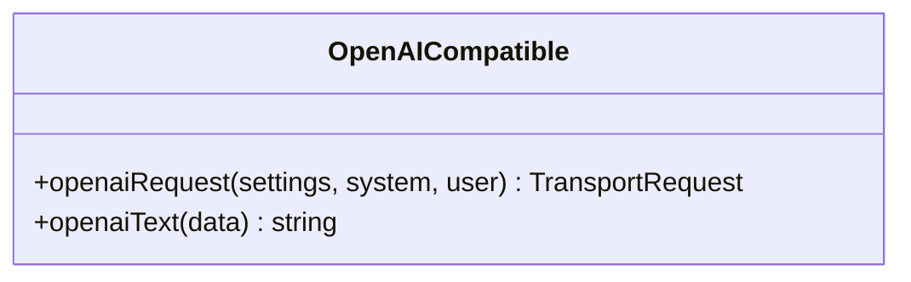
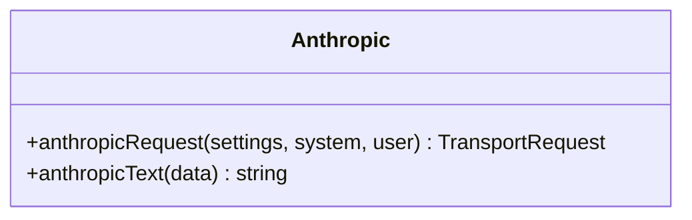
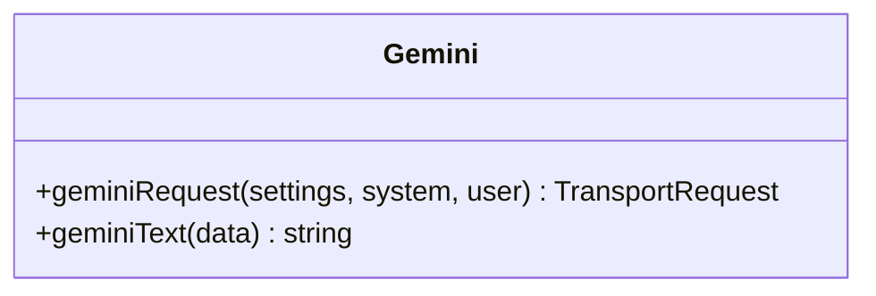
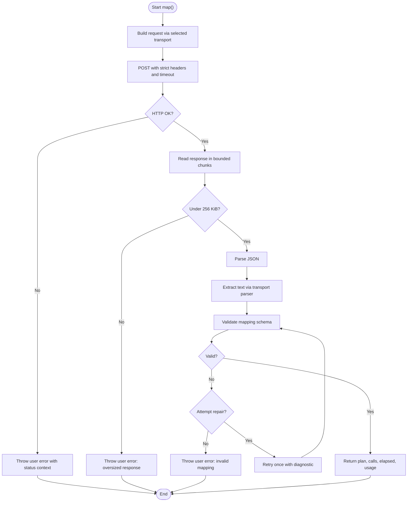
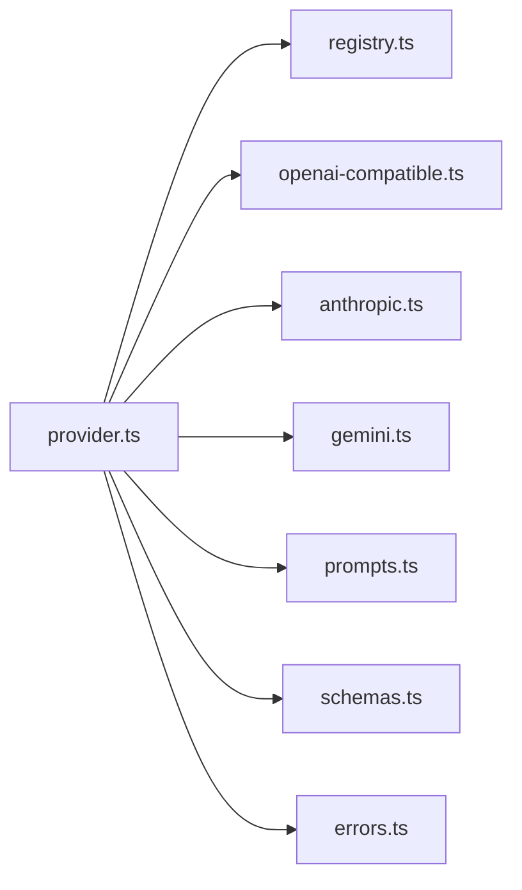

# Transport Layer Implementations

<cite>
**Referenced Files in This Document**
- [openai-compatible.ts](file://src/ai/transports/openai-compatible.ts)
- [anthropic.ts](file://src/ai/transports/anthropic.ts)
- [gemini.ts](file://src/ai/transports/gemini.ts)
- [provider.ts](file://src/ai/provider.ts)
- [registry.ts](file://src/ai/registry.ts)
- [prompts.ts](file://src/ai/prompts.ts)
- [schemas.ts](file://src/shared/schemas.ts)
- [errors.ts](file://src/shared/errors.ts)
- [providers.test.ts](file://tests/unit/providers.test.ts)
</cite>

## Table of Contents
1. [Introduction](#introduction)
2. [Project Structure](#project-structure)
3. [Core Components](#core-components)
4. [Architecture Overview](#architecture-overview)
5. [Detailed Component Analysis](#detailed-component-analysis)
6. [Dependency Analysis](#dependency-analysis)
7. [Performance Considerations](#performance-considerations)
8. [Troubleshooting Guide](#troubleshooting-guide)
9. [Conclusion](#conclusion)
10. [Appendices](#appendices)

## Introduction
This document explains the transport layer implementations that handle protocol-specific communication with AI services for form mapping. It covers:
- OpenAI-compatible transport (works with any OpenAI API-compatible endpoint, including DeepSeek)
- Anthropic Claude transport
- Google Gemini transport

For each transport, we detail authentication methods, request formatting, response parsing, and error handling. We also include configuration examples, rate limiting considerations, and streaming support status based on the current implementation.

## Project Structure
The transport layer is organized under src/ai/transports with a central provider orchestrating requests and responses. The registry defines providers and endpoints, while shared schemas define limits and validation rules.

**Diagram sources**
- [provider.ts:1-107](file://src/ai/provider.ts#L1-L107)
- [registry.ts:1-13](file://src/ai/registry.ts#L1-L13)
- [schemas.ts:1-39](file://src/shared/schemas.ts#L1-L39)
- [errors.ts:1-10](file://src/shared/errors.ts#L1-L10)
- [openai-compatible.ts:1-22](file://src/ai/transports/openai-compatible.ts#L1-L22)
- [anthropic.ts:1-17](file://src/ai/transports/anthropic.ts#L1-L17)
- [gemini.ts:1-21](file://src/ai/transports/gemini.ts#L1-L21)

**Section sources**
- [provider.ts:1-107](file://src/ai/provider.ts#L1-L107)
- [registry.ts:1-13](file://src/ai/registry.ts#L1-L13)
- [schemas.ts:1-39](file://src/shared/schemas.ts#L1-L39)
- [errors.ts:1-10](file://src/shared/errors.ts#L1-L10)

## Core Components
- Registry: Defines supported providers, their display names, origins, endpoints, and transport identifiers.
- Provider: Builds transport-specific requests, executes HTTP calls, enforces timeouts and size limits, parses responses, validates output, and handles retries for schema repair.
- Transports:
  - OpenAI-compatible: Formats requests for OpenAI-style chat completions; extracts text from choices.
  - Anthropic: Formats requests for Claude messages; extracts text blocks.
  - Gemini: Formats requests for generateContent; extracts non-thought text parts.

Key responsibilities:
- Authentication via headers per provider.
- Request body construction tailored to each API.
- Response extraction and validation into a common JSON mapping plan.
- Error handling with user-friendly messages and safe retry behavior.

**Section sources**
- [registry.ts:1-13](file://src/ai/registry.ts#L1-L13)
- [provider.ts:15-107](file://src/ai/provider.ts#L15-L107)
- [openai-compatible.ts:4-21](file://src/ai/transports/openai-compatible.ts#L4-L21)
- [anthropic.ts:3-16](file://src/ai/transports/anthropic.ts#L3-L16)
- [gemini.ts:3-20](file://src/ai/transports/gemini.ts#L3-L20)

## Architecture Overview
The provider selects the appropriate transport based on settings, builds a request, performs a bounded fetch, parses and validates the response, and returns a mapping plan or throws a user-facing error.

**Diagram sources**
- [provider.ts:19-107](file://src/ai/provider.ts#L19-L107)
- [registry.ts:1-13](file://src/ai/registry.ts#L1-L13)
- [openai-compatible.ts:4-21](file://src/ai/transports/openai-compatible.ts#L4-L21)
- [anthropic.ts:3-16](file://src/ai/transports/anthropic.ts#L3-L16)
- [gemini.ts:3-20](file://src/ai/transports/gemini.ts#L3-L20)

## Detailed Component Analysis

### OpenAI-Compatible Transport
- Purpose: Works with any OpenAI API-compatible endpoint (e.g., OpenAI, DeepSeek).
- Authentication: Bearer token in Authorization header using the provided API key.
- Request format:
  - Endpoint from registry.
  - Body includes model, messages array with system and user roles, response_format set to JSON object, stream disabled, and token limit field depending on provider.
- Response parsing:
  - Extracts first choice’s message content if finish_reason is stop and no refusal.
  - Throws a user error for refusals, truncation, or incompatible models.
- Streaming: Not used; stream is explicitly disabled.
- Rate limiting: Handled by provider orchestration; 429 triggers a user error with guidance to wait or check quotas.

Configuration example
- Provider selection and model: Use registry provider id (e.g., openai or deepseek), supply a valid model ID and API key.
- Token limits: The transport sets a token ceiling appropriate for the provider variant.

Error handling
- Non-OK HTTP statuses are converted to user errors with context-specific messages.
- Network failures and timeouts are surfaced without leaking secrets.

**Section sources**
- [openai-compatible.ts:4-21](file://src/ai/transports/openai-compatible.ts#L4-L21)
- [registry.ts:1-13](file://src/ai/registry.ts#L1-L13)
- [provider.ts:71-104](file://src/ai/provider.ts#L71-L104)

#### Class-like structure for OpenAI-compatible transport

**Diagram sources**
- [openai-compatible.ts:4-21](file://src/ai/transports/openai-compatible.ts#L4-L21)

### Anthropic Claude Transport
- Purpose: Communicates with Anthropic Claude via the messages endpoint.
- Authentication: x-api-key header with the provided API key; includes version and browser-access headers required by the API.
- Request format:
  - Endpoint fixed to Anthropic messages.
  - Body includes model, system prompt, max tokens, messages with user role, and stream disabled.
- Response parsing:
  - Validates stop_reason is end_turn and content contains only text blocks.
  - Concatenates text blocks into a single string.
  - Throws a user error for unsupported content or truncation.
- Streaming: Not used; stream is explicitly disabled.
- Rate limiting: Same provider-level handling; 429 yields a user error advising to wait or check quotas.

Configuration example
- Provider: anthropic
- Model: a Claude model ID
- API key: Provided in settings

Error handling
- Refusals, truncated responses, or unexpected content types raise user errors.
- HTTP errors are handled centrally with clear messages.

**Section sources**
- [anthropic.ts:3-16](file://src/ai/transports/anthropic.ts#L3-L16)
- [registry.ts:1-13](file://src/ai/registry.ts#L1-L13)
- [provider.ts:71-104](file://src/ai/provider.ts#L71-L104)

#### Class-like structure for Anthropic transport

**Diagram sources**
- [anthropic.ts:3-16](file://src/ai/transports/anthropic.ts#L3-L16)

### Google Gemini Transport
- Purpose: Communicates with Google Gemini via generateContent.
- Authentication: x-goog-api-key header with the provided API key.
- Request format:
  - Endpoint uses the registry base plus model name and generateContent suffix.
  - Body includes systemInstruction, contents with user role and text parts, generationConfig specifying JSON mime type and max output tokens.
- Response parsing:
  - Validates first candidate finishReason is STOP and content.parts exists.
  - Filters out thought-only parts and concatenates remaining text.
  - Throws a user error for refusals or truncation.
- Streaming: Not used; this transport does not implement streaming.
- Rate limiting: Same provider-level handling; 429 yields a user error advising to wait or check quotas.

Configuration example
- Provider: gemini
- Model: a Gemini model ID (with or without models/ prefix)
- API key: Provided in settings

Error handling
- Refusals, truncated responses, or missing parts raise user errors.
- HTTP errors are handled centrally with clear messages.

**Section sources**
- [gemini.ts:3-20](file://src/ai/transports/gemini.ts#L3-L20)
- [registry.ts:1-13](file://src/ai/registry.ts#L1-L13)
- [provider.ts:71-104](file://src/ai/provider.ts#L71-L104)

#### Class-like structure for Gemini transport

**Diagram sources**
- [gemini.ts:3-20](file://src/ai/transports/gemini.ts#L3-L20)

### Provider Orchestration and Safety
- Request building: Chooses the correct transport function based on provider settings.
- Fetch execution: Uses fetch with strict security options (no credentials, no cache, redirect error, no referrer).
- Timeouts and cancellation: 60-second timeout; respects AbortSignal to cancel in-flight requests.
- Response bounds: Reads the response body in chunks and cancels if exceeding 256 KiB.
- Validation and repair: Parses JSON, validates against the mapping schema, and attempts one repair pass when validation fails, without sending untrusted model output back to the provider.
- Usage extraction: Normalizes usage metadata across providers when available.

**Diagram sources**
- [provider.ts:34-107](file://src/ai/provider.ts#L34-L107)
- [schemas.ts:1-39](file://src/shared/schemas.ts#L1-L39)

**Section sources**
- [provider.ts:19-107](file://src/ai/provider.ts#L19-L107)
- [schemas.ts:1-39](file://src/shared/schemas.ts#L1-L39)
- [errors.ts:1-10](file://src/shared/errors.ts#L1-L10)

## Dependency Analysis
- provider.ts depends on:
  - registry.ts for provider definitions and endpoints
  - transports for request builders and text extractors
  - prompts.ts for system prompt and payload construction
  - schemas.ts for limits and validation
  - errors.ts for consistent error types and helpers
- Each transport depends on registry for endpoints and errors for user errors.

**Diagram sources**
- [provider.ts:1-107](file://src/ai/provider.ts#L1-L107)
- [registry.ts:1-13](file://src/ai/registry.ts#L1-L13)
- [prompts.ts:1-26](file://src/ai/prompts.ts#L1-L26)
- [schemas.ts:1-39](file://src/shared/schemas.ts#L1-L39)
- [errors.ts:1-10](file://src/shared/errors.ts#L1-L10)

**Section sources**
- [provider.ts:1-107](file://src/ai/provider.ts#L1-L107)
- [registry.ts:1-13](file://src/ai/registry.ts#L1-L13)
- [prompts.ts:1-26](file://src/ai/prompts.ts#L1-L26)
- [schemas.ts:1-39](file://src/shared/schemas.ts#L1-L39)
- [errors.ts:1-10](file://src/shared/errors.ts#L1-L10)

## Performance Considerations
- Bounded response reading: Prevents memory issues by enforcing a 256 KiB response limit.
- Timeout protection: 60-second timeout avoids long-running requests.
- Minimal retries: Only one schema-repair retry to reduce latency and cost.
- Token limits: Each transport sets an upper bound on tokens to control costs and avoid excessive outputs.
- Streaming: Not implemented; all transports disable streaming to simplify parsing and ensure deterministic JSON responses.

[No sources needed since this section provides general guidance]

## Troubleshooting Guide
Common issues and how they are handled:
- Invalid or missing API key: Provider validation rejects malformed keys; HTTP 401/403 returns a user error guiding users to verify keys and access.
- Rate limits or quotas: HTTP 429 returns a user error advising to wait or check account quotas.
- Model incompatibility or refusal: Transport parsers detect refusals or unsupported formats and throw user errors with guidance to choose a supported model or shorten input.
- Oversized responses: Responses over 256 KiB are rejected early to protect resources.
- Network failures: Caught and converted to user errors without leaking internals.
- Cancellation: Aborted signals prevent starting new requests and cancel ongoing ones.

Validation and repair:
- If the provider returns invalid JSON or a mapping that fails schema validation, the provider attempts one repair pass by appending a diagnostic to the system prompt and retrying once. Untrusted model output is never sent back to the provider.

**Section sources**
- [provider.ts:52-107](file://src/ai/provider.ts#L52-L107)
- [errors.ts:1-10](file://src/shared/errors.ts#L1-L10)
- [providers.test.ts:30-68](file://tests/unit/providers.test.ts#L30-L68)

## Conclusion
The transport layer provides a unified interface to multiple AI providers with strong safety guarantees:
- Strict authentication per provider
- Protocol-specific request formatting
- Robust response parsing and validation
- Clear error handling and limited retry logic
- Protection against oversized responses and long-running requests

Streaming is intentionally disabled to ensure reliable JSON parsing and predictable behavior. For production use, consider adding streaming support per provider if needed, along with additional rate-limiting strategies at the application level.

[No sources needed since this section summarizes without analyzing specific files]

## Appendices

### Configuration Examples
- OpenAI-compatible:
  - Provider: openai or deepseek
  - Model: a compatible text model ID
  - API Key: your bearer token
- Anthropic:
  - Provider: anthropic
  - Model: a Claude model ID
  - API Key: your x-api-key
- Gemini:
  - Provider: gemini
  - Model: a Gemini model ID (models/ prefix optional)
  - API Key: your x-goog-api-key

These configurations are consumed by the provider to select the correct transport and endpoint.

**Section sources**
- [registry.ts:1-13](file://src/ai/registry.ts#L1-L13)
- [provider.ts:15-26](file://src/ai/provider.ts#L15-L26)

### Streaming Support Status
- All transports currently disable streaming to ensure deterministic JSON responses and simpler parsing.
- If streaming is required in the future, each transport would need updates to parse streamed chunks and aggregate results safely.

[No sources needed since this section provides general guidance]