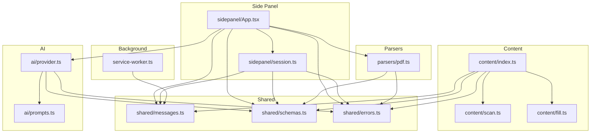
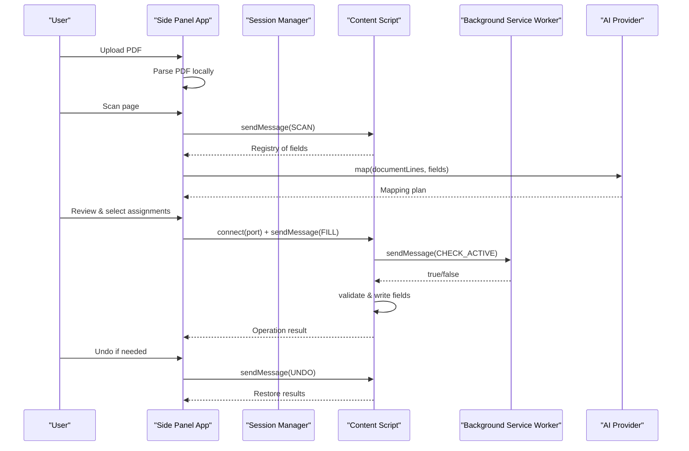
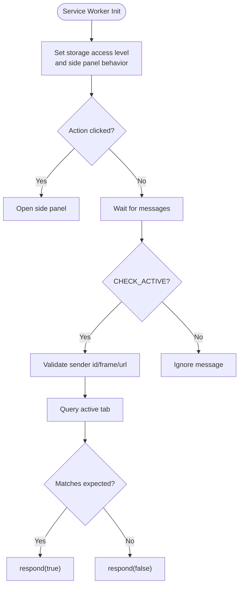
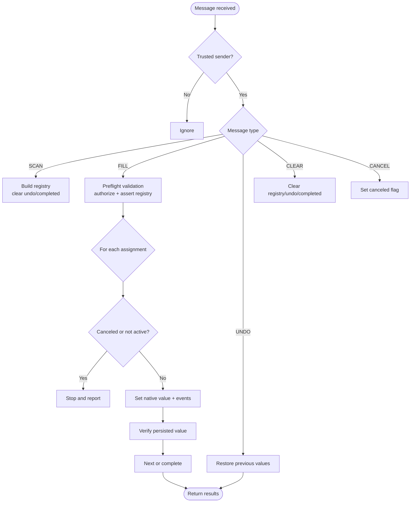
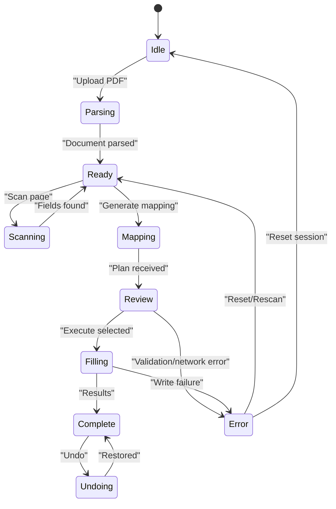
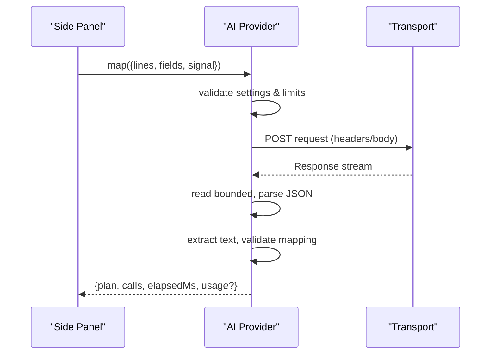
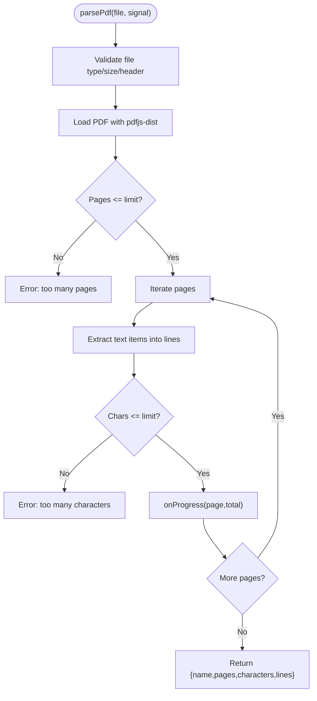
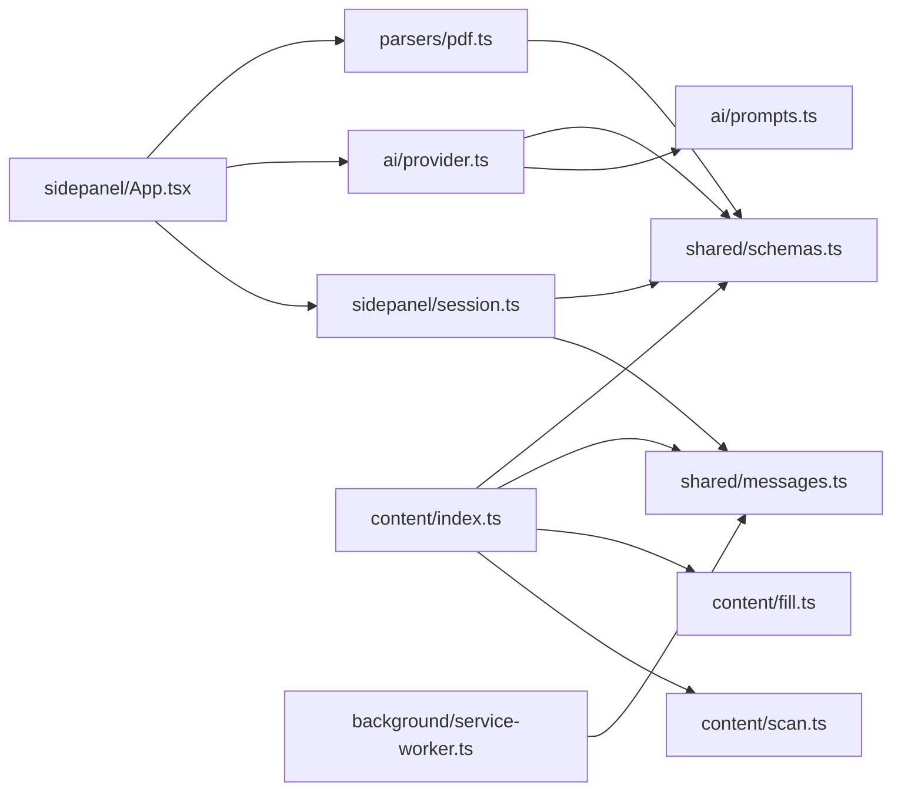

# Architecture Overview

<cite>
**Referenced Files in This Document**
- [manifest.json](file://src/manifest.json)
- [service-worker.ts](file://src/background/service-worker.ts)
- [index.ts](file://src/content/index.ts)
- [scan.ts](file://src/content/scan.ts)
- [fill.ts](file://src/content/fill.ts)
- [App.tsx](file://src/sidepanel/App.tsx)
- [session.ts](file://src/sidepanel/session.ts)
- [messages.ts](file://src/shared/messages.ts)
- [schemas.ts](file://src/shared/schemas.ts)
- [provider.ts](file://src/ai/provider.ts)
- [prompts.ts](file://src/ai/prompts.ts)
- [pdf.ts](file://src/parsers/pdf.ts)
- [errors.ts](file://src/shared/errors.ts)
</cite>

## Table of Contents
1. Introduction
2. Project Structure
3. Core Components
4. Architecture Overview
5. Detailed Component Analysis
6. Dependency Analysis
7. Performance Considerations
8. Troubleshooting Guide
9. Conclusion

## Introduction
This document describes the Help Me Fill browser extension architecture with a three-context design:
- Background service worker: privileged setup and active-tab authorization checks.
- Content scripts: page interaction, form scanning, field filling, and undo support.
- Side panel UI: user interface for PDF upload, AI-driven mapping review, and execution control.

The extension uses Chrome Extension messaging to coordinate work across contexts while enforcing strict security boundaries. Data flows from local PDF parsing to AI-assisted mapping and finally to controlled form filling on the target page. Privacy is maintained by keeping PDF text extraction local, sending only necessary metadata to AI providers after explicit consent, and validating every step before writing to the page.

## Project Structure
The codebase is organized by context and responsibility:
- Background: service worker initialization and runtime message handling.
- Content: page scanning, registry management, and safe field writes.
- Side panel: React UI, session state, provider configuration, and orchestration.
- Shared: message schemas, data schemas, and error utilities.
- AI: provider abstraction, transports, prompts, and validation.
- Parsers: local PDF text extraction.

**Diagram sources**
- [manifest.json:1-19](file://src/manifest.json#L1-L19)
- [service-worker.ts:1-29](file://src/background/service-worker.ts#L1-L29)
- [index.ts:1-72](file://src/content/index.ts#L1-L72)
- [scan.ts:1-88](file://src/content/scan.ts#L1-L88)
- [fill.ts:1-82](file://src/content/fill.ts#L1-L82)
- [App.tsx:1-127](file://src/sidepanel/App.tsx#L1-L127)
- [session.ts:1-86](file://src/sidepanel/session.ts#L1-L86)
- [messages.ts:1-20](file://src/shared/messages.ts#L1-L20)
- [schemas.ts:1-39](file://src/shared/schemas.ts#L1-L39)
- [provider.ts:1-107](file://src/ai/provider.ts#L1-L107)
- [prompts.ts:1-26](file://src/ai/prompts.ts#L1-L26)
- [pdf.ts:1-87](file://src/parsers/pdf.ts#L1-L87)
- [errors.ts:1-10](file://src/shared/errors.ts#L1-L10)

**Section sources**
- [manifest.json:1-19](file://src/manifest.json#L1-L19)

## Core Components
- Background service worker initializes storage access levels and side panel behavior, opens the side panel on action click, and validates that the active tab matches expected context before allowing sensitive operations.
- Content script registers itself once per page, maintains a registry of scanned fields, handles messages from the side panel (scan, fill, undo, clear, cancel), and enforces guards to prevent unintended writes.
- Side panel orchestrates the workflow: parse PDF locally, scan the current page, call AI to propose mappings, present results for review, and execute fills or undo operations. It manages session state and lifecycle via a reducer.
- Shared schemas define strict contracts for messages, field descriptors, mapping plans, and operation results. Limits protect against abuse and excessive payloads.
- AI provider abstracts multiple LLM backends, builds requests, enforces timeouts and response size limits, validates AI output, and returns a mapping plan.
- PDF parser extracts text lines locally with safety checks for file type, size, pages, and character count.

**Section sources**
- [service-worker.ts:1-29](file://src/background/service-worker.ts#L1-L29)
- [index.ts:1-72](file://src/content/index.ts#L1-L72)
- [App.tsx:1-127](file://src/sidepanel/App.tsx#L1-L127)
- [session.ts:1-86](file://src/sidepanel/session.ts#L1-L86)
- [messages.ts:1-20](file://src/shared/messages.ts#L1-L20)
- [schemas.ts:1-39](file://src/shared/schemas.ts#L1-L39)
- [provider.ts:1-107](file://src/ai/provider.ts#L1-L107)
- [pdf.ts:1-87](file://src/parsers/pdf.ts#L1-L87)

## Architecture Overview
The extension follows a strict three-context boundary model:
- Background: minimal privileges; configures storage and side panel behavior; authorizes active-tab checks via runtime messages.
- Content: runs in the target page’s context; scans DOM, maintains a registry of fields, executes safe writes, and supports undo.
- Side panel: user-facing UI; performs local PDF parsing; calls AI to generate mapping suggestions; coordinates content actions through messaging.

Communication patterns:
- Side panel to content: typed messages over chrome.tabs.sendMessage for SCAN, FILL, UNDO, CLEAR, CANCEL. A long-lived port is established during FILL/UNDO to ensure the panel remains connected throughout execution.
- Content to background: runtime message CHECK_ACTIVE to verify the active tab matches expected URL and identity.
- Side panel to AI: direct HTTP requests using configured provider transport, with abort signals and strict response limits.

Security model:
- Strict origin and frame checks for trusted connections.
- Active-tab verification before any write operation.
- Field-level preflight validation and post-write verification.
- Local-only PDF parsing; only compacted field metadata and document lines are sent to AI after explicit user consent.
- Hard limits on payload sizes, number of fields, and response bytes.

**Diagram sources**
- [App.tsx:64-95](file://src/sidepanel/App.tsx#L64-L95)
- [session.ts:48-85](file://src/sidepanel/session.ts#L48-L85)
- [index.ts:22-69](file://src/content/index.ts#L22-L69)
- [service-worker.ts:17-28](file://src/background/service-worker.ts#L17-L28)
- [provider.ts:52-105](file://src/ai/provider.ts#L52-L105)

## Detailed Component Analysis

### Background Service Worker
Responsibilities:
- Configure storage access levels and side panel behavior at startup/install.
- Open side panel when the extension action is clicked.
- Handle CHECK_ACTIVE messages from content scripts to confirm the active tab matches expected URL and identity.

Security considerations:
- Validates sender identity and frame context.
- Uses tabs.query to confirm active tab and URL match before responding positively.

**Diagram sources**
- [service-worker.ts:1-29](file://src/background/service-worker.ts#L1-L29)

**Section sources**
- [service-worker.ts:1-29](file://src/background/service-worker.ts#L1-L29)

### Content Scripts
Responsibilities:
- Initialize once per page, establish trusted connection with side panel via named ports.
- Maintain a registry of scanned fields with signatures to detect changes.
- Handle SCAN to build registry, FILL to execute validated writes, UNDO to restore values, CLEAR/CANCEL to reset state.
- Enforce guards: check cancellation, active-tab authorization, and registry integrity before each write.

Safety mechanisms:
- Preflight validation of all assignments before any write.
- Native value setter with input/change events and blur to trigger page handlers.
- Post-write verification with retries and validity checks.
- Undo entries recorded to support restoration.

**Diagram sources**
- [index.ts:22-69](file://src/content/index.ts#L22-L69)
- [fill.ts:42-81](file://src/content/fill.ts#L42-L81)
- [scan.ts:62-87](file://src/content/scan.ts#L62-L87)

**Section sources**
- [index.ts:1-72](file://src/content/index.ts#L1-L72)
- [fill.ts:1-82](file://src/content/fill.ts#L1-L82)
- [scan.ts:1-88](file://src/content/scan.ts#L1-L88)

### Side Panel UI and Session Management
Responsibilities:
- Manage session state via a reducer: idle, parsing, scanning, ready, mapping, review, filling, complete, undoing.
- Orchestrate workflow: upload PDF, scan page, call AI, present mapping for review, execute fills/undo.
- Establish persistent port connection to content during FILL/UNDO to ensure continuity and cancellation support.
- Monitor tab activity and invalidate sessions when target changes.

State transitions:
- START phase sets progress and clears errors.
- PLAN transitions to review with rows derived from mapping plan.
- RESULT completes with operation results and canUndo flag.
- INVALIDATE resets plan/results and allows re-scan/review.

**Diagram sources**
- [App.tsx:50-107](file://src/sidepanel/App.tsx#L50-L107)
- [session.ts:26-42](file://src/sidepanel/session.ts#L26-L42)

**Section sources**
- [App.tsx:1-127](file://src/sidepanel/App.tsx#L1-L127)
- [session.ts:1-86](file://src/sidepanel/session.ts#L1-L86)

### AI Provider and Prompting
Responsibilities:
- Abstract multiple providers (OpenAI-compatible, Anthropic, Gemini).
- Build requests with system prompt and compacted field metadata plus document lines.
- Enforce timeouts, response size limits, and abort signals.
- Validate AI output against schema; retry once with repair guidance on validation failure.

Privacy and safety:
- Only compacted field metadata and document lines are sent; no current values or URLs.
- Explicit permissions required for each provider origin.
- Usage metrics captured for transparency.

**Diagram sources**
- [provider.ts:52-105](file://src/ai/provider.ts#L52-L105)
- [prompts.ts:4-25](file://src/ai/prompts.ts#L4-L25)

**Section sources**
- [provider.ts:1-107](file://src/ai/provider.ts#L1-L107)
- [prompts.ts:1-26](file://src/ai/prompts.ts#L1-L26)

### PDF Parser
Responsibilities:
- Validate file type, size, and header.
- Extract text lines per page with line-break detection.
- Enforce limits on pages and total characters.
- Handle password-protected or unsupported PDFs gracefully.

**Diagram sources**
- [pdf.ts:7-86](file://src/parsers/pdf.ts#L7-L86)

**Section sources**
- [pdf.ts:1-87](file://src/parsers/pdf.ts#L1-L87)

## Dependency Analysis
Key dependencies and relationships:
- Side panel depends on session manager for state and messaging helpers, AI provider for mapping, and PDF parser for local extraction.
- Content script depends on shared messages and schemas for validation, and on scan/fill modules for page interaction.
- Background service worker depends on shared messages for message types and provides authorization checks.
- AI provider depends on prompts and transports, and validates outputs against shared schemas.

**Diagram sources**
- [App.tsx:1-127](file://src/sidepanel/App.tsx#L1-L127)
- [session.ts:1-86](file://src/sidepanel/session.ts#L1-L86)
- [provider.ts:1-107](file://src/ai/provider.ts#L1-L107)
- [pdf.ts:1-87](file://src/parsers/pdf.ts#L1-L87)
- [index.ts:1-72](file://src/content/index.ts#L1-L72)
- [scan.ts:1-88](file://src/content/scan.ts#L1-L88)
- [fill.ts:1-82](file://src/content/fill.ts#L1-L82)
- [service-worker.ts:1-29](file://src/background/service-worker.ts#L1-L29)
- [messages.ts:1-20](file://src/shared/messages.ts#L1-L20)
- [schemas.ts:1-39](file://src/shared/schemas.ts#L1-L39)
- [prompts.ts:1-26](file://src/ai/prompts.ts#L1-L26)

**Section sources**
- [App.tsx:1-127](file://src/sidepanel/App.tsx#L1-L127)
- [session.ts:1-86](file://src/sidepanel/session.ts#L1-L86)
- [provider.ts:1-107](file://src/ai/provider.ts#L1-L107)
- [pdf.ts:1-87](file://src/parsers/pdf.ts#L1-L87)
- [index.ts:1-72](file://src/content/index.ts#L1-L72)
- [scan.ts:1-88](file://src/content/scan.ts#L1-L88)
- [fill.ts:1-82](file://src/content/fill.ts#L1-L82)
- [service-worker.ts:1-29](file://src/background/service-worker.ts#L1-L29)
- [messages.ts:1-20](file://src/shared/messages.ts#L1-L20)
- [schemas.ts:1-39](file://src/shared/schemas.ts#L1-L39)
- [prompts.ts:1-26](file://src/ai/prompts.ts#L1-L26)

## Performance Considerations
- Local PDF parsing avoids network overhead and keeps large documents private.
- AI requests are bounded by timeouts and response size limits to prevent hangs and memory pressure.
- Content-side preflight validation prevents partial writes and reduces unnecessary network calls.
- AbortController integration ensures cancellations propagate across contexts, freeing resources promptly.
- Registry fingerprinting detects DOM changes early, avoiding expensive or invalid operations.

[No sources needed since this section provides general guidance]

## Troubleshooting Guide
Common issues and resolutions:
- Target tab changed: The session is invalidated; rescan and review again.
- Page connection lost: Reopen the side panel on the intended page and rescan.
- Provider permission missing: Enable the required host permission for the chosen provider.
- Invalid AI response: Retry explicitly; the system does not auto-retry beyond one repair attempt.
- Password-protected or image-only PDF: Use an unprotected, text-based PDF.
- Too many controls or fields: Simplify the form or reduce selections.

Error handling spans:
- UserError propagation and normalization across contexts.
- AbortError handling for cancellations.
- Validation failures in AI responses with repair guidance.

**Section sources**
- [errors.ts:1-10](file://src/shared/errors.ts#L1-L10)
- [provider.ts:77-105](file://src/ai/provider.ts#L77-L105)
- [pdf.ts:7-86](file://src/parsers/pdf.ts#L7-L86)
- [session.ts:44-85](file://src/sidepanel/session.ts#L44-L85)
- [index.ts:22-69](file://src/content/index.ts#L22-L69)

## Conclusion
Help Me Fill implements a secure, privacy-preserving three-context architecture:
- Background service worker handles minimal privileged tasks and active-tab authorization.
- Content scripts safely interact with web forms, maintaining strict validation and undo capabilities.
- Side panel orchestrates the workflow with local PDF parsing, AI-assisted mapping, and user-controlled execution.

Messaging between contexts is strongly typed and validated, ensuring robust communication. Security boundaries are enforced at every step: trusted origins, active-tab checks, field-level validation, and limited data exposure to AI providers. The result is a reliable system that leverages AI to assist form filling while protecting user privacy and preventing unintended modifications.

[No sources needed since this section summarizes without analyzing specific files]