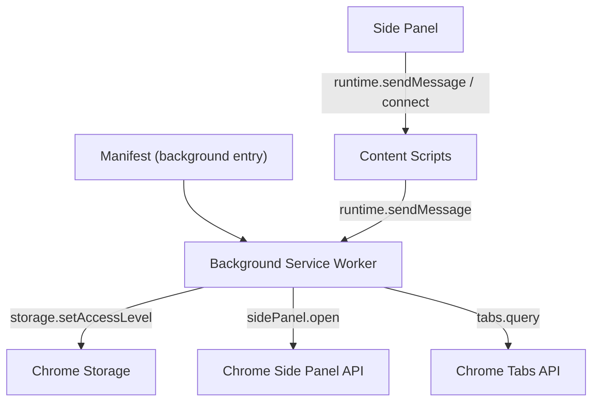
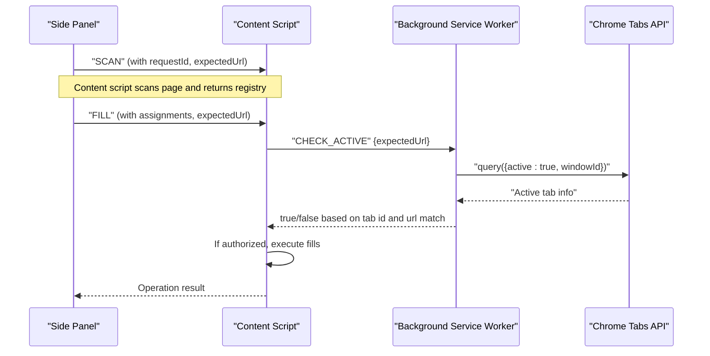
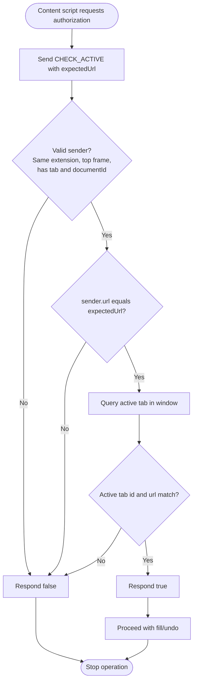
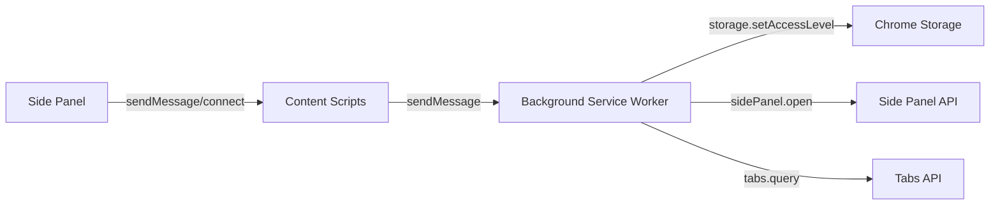

# Background Service Worker

<cite>
**Referenced Files in This Document**
- [service-worker.ts](file://src/background/service-worker.ts)
- [manifest.json](file://src/manifest.json)
- [messages.ts](file://src/shared/messages.ts)
- [index.ts](file://src/content/index.ts)
- [fill.ts](file://src/content/fill.ts)
- [session.ts](file://src/sidepanel/session.ts)
</cite>

## Table of Contents
1. [Introduction](#introduction)
2. [Project Structure](#project-structure)
3. [Core Components](#core-components)
4. [Architecture Overview](#architecture-overview)
5. [Detailed Component Analysis](#detailed-component-analysis)
6. [Dependency Analysis](#dependency-analysis)
7. [Performance Considerations](#performance-considerations)
8. [Troubleshooting Guide](#troubleshooting-guide)
9. [Conclusion](#conclusion)

## Introduction
This document explains the background service worker component that acts as the privileged context for the extension. It manages extension lifecycle, enforces secure storage access levels, handles toolbar action clicks to open the side panel, and validates messages from content scripts to ensure only legitimate communication occurs. A key security mechanism is the CHECK_ACTIVE message pattern used to verify tab activity and URL consistency before allowing sensitive operations like filling forms.

## Project Structure
The background service worker is defined as a module-based service worker in the manifest and lives under the background directory. It coordinates with the side panel and content scripts via runtime messaging and uses Chrome APIs for storage, tabs, and side panel behavior.

**Diagram sources**
- [manifest.json:13-17](file://src/manifest.json#L13-L17)
- [service-worker.ts:1-28](file://src/background/service-worker.ts#L1-L28)
- [session.ts:44-85](file://src/sidepanel/session.ts#L44-L85)
- [index.ts:22-69](file://src/content/index.ts#L22-L69)

**Section sources**
- [manifest.json:1-19](file://src/manifest.json#L1-L19)
- [service-worker.ts:1-28](file://src/background/service-worker.ts#L1-L28)

## Core Components
- Privileged configuration on install/startup: sets storage access levels to TRUSTED_CONTEXTS to restrict storage usage to trusted contexts.
- Action click handler: opens the side panel explicitly and ensures activeTab permissions are granted by user gesture.
- Message validation: listens for messages, validates type and sender identity, verifies expected URLs, and checks current active tab state.

Key responsibilities:
- Lifecycle: configure storage and side panel behavior on install and startup.
- Security: enforce strict sender validation and tab verification for sensitive operations.
- UX: provide explicit side panel opening via toolbar action.

**Section sources**
- [service-worker.ts:1-28](file://src/background/service-worker.ts#L1-L28)
- [manifest.json:6-17](file://src/manifest.json#L6-L17)

## Architecture Overview
The background service worker sits between the side panel and content scripts. The side panel initiates scanning and filling workflows and communicates with content scripts. Before executing writes, content scripts request authorization via a CHECK_ACTIVE message to the background. The background validates the sender’s identity, frame, document identity, URL, and whether the tab is currently active and matches the expected URL. Only when all checks pass does it authorize the operation.

**Diagram sources**
- [service-worker.ts:18-28](file://src/background/service-worker.ts#L18-L28)
- [index.ts:22-69](file://src/content/index.ts#L22-L69)
- [fill.ts:42-80](file://src/content/fill.ts#L42-L80)
- [session.ts:44-85](file://src/sidepanel/session.ts#L44-L85)

## Detailed Component Analysis

### Background Service Worker Configuration
- Sets storage session and local access levels to TRUSTED_CONTEXTS to ensure only trusted contexts can read/write storage.
- Configures side panel behavior so that clicking the action does not automatically open the panel; instead, the handler explicitly opens it to ensure activeTab permission is granted.
- Runs configuration on install, startup, and immediately to guarantee settings are applied.

Security implications:
- Restricting storage access to trusted contexts prevents untrusted code from reading or writing sensitive data.
- Explicit action handling avoids granting activeTab implicitly and ensures user intent.

**Section sources**
- [service-worker.ts:1-15](file://src/background/service-worker.ts#L1-L15)
- [manifest.json:6-17](file://src/manifest.json#L6-L17)

### Action Click Handling
- Listens for toolbar action clicks and opens the side panel for the clicked tab.
- On failure to open, sets a badge indicator to alert the user.

User experience:
- Provides a clear affordance to open the review panel.
- Gives feedback if the panel cannot be opened.

**Section sources**
- [service-worker.ts:6-12](file://src/background/service-worker.ts#L6-L12)

### Message Validation System
- Validates incoming messages strictly:
  - Ensures message is an object with a type field.
  - Accepts only the CHECK_ACTIVE message type.
  - Verifies sender identity: must be from the same extension, top-level frame, and include a valid tab and document identity.
  - Validates expectedUrl presence and equality with sender.url.
  - Confirms the tab is currently active and its URL matches the expected URL using chrome.tabs.query.
- Returns false for invalid messages to prevent further processing.

Security benefits:
- Prevents malicious injection attacks by ensuring only legitimate content scripts from the extension can trigger sensitive actions.
- Enforces per-tab and per-document isolation and confirms the target remains unchanged during execution.

**Section sources**
- [service-worker.ts:17-28](file://src/background/service-worker.ts#L17-L28)

### CHECK_ACTIVE Message Pattern
Usage flow:
- The content script sends a CHECK_ACTIVE message including the expected URL before performing any write operations.
- The background validates the sender and verifies the tab is active and matches the expected URL.
- The content script proceeds only if the background responds positively.

Prevention of malicious injection:
- Even if a malicious script injects into the page, it cannot forge a valid sender identity or bypass the active tab check.
- The combination of sender.id, frameId, documentId, and URL checks ensures cross-origin and cross-frame isolation.
- Active tab verification ensures the user has not navigated away or switched tabs mid-operation.

**Diagram sources**
- [service-worker.ts:18-28](file://src/background/service-worker.ts#L18-L28)
- [index.ts:34-40](file://src/content/index.ts#L34-L40)
- [fill.ts:56-60](file://src/content/fill.ts#L56-L60)

**Section sources**
- [service-worker.ts:17-28](file://src/background/service-worker.ts#L17-L28)
- [index.ts:22-69](file://src/content/index.ts#L22-L69)
- [fill.ts:42-80](file://src/content/fill.ts#L42-L80)

### Side Panel Integration
- The side panel establishes a connection to the content script and waits for a ready acknowledgment before sending operations.
- It sends SCAN and FILL/UNDO messages with required fields such as requestId, expectedUrl, and assignments.
- It asserts the target tab remains active and unchanged before each operation.

Security integration:
- Uses documentId to scope connections and messages to a specific page instance.
- Validates responses and handles errors gracefully.

**Section sources**
- [session.ts:44-85](file://src/sidepanel/session.ts#L44-L85)
- [messages.ts:1-20](file://src/shared/messages.ts#L1-L20)

## Dependency Analysis
- The background service worker depends on Chrome APIs for storage, tabs, and side panel behavior.
- It interacts with content scripts via runtime messaging and relies on strict sender validation.
- The side panel orchestrates scanning and filling workflows and communicates with both content scripts and the background.

**Diagram sources**
- [service-worker.ts:1-28](file://src/background/service-worker.ts#L1-L28)
- [session.ts:44-85](file://src/sidepanel/session.ts#L44-L85)
- [index.ts:22-69](file://src/content/index.ts#L22-L69)

**Section sources**
- [service-worker.ts:1-28](file://src/background/service-worker.ts#L1-L28)
- [session.ts:44-85](file://src/sidepanel/session.ts#L44-L85)
- [index.ts:22-69](file://src/content/index.ts#L22-L69)

## Performance Considerations
- The background performs minimal work: storage configuration and lightweight message validation. Heavy parsing and provider calls are intentionally kept out of the background to keep it short-lived and efficient.
- Tab queries are executed only when necessary (during CHECK_ACTIVE), minimizing overhead.
- Side panel and content scripts handle most of the UI and processing load.

[No sources needed since this section provides general guidance]

## Troubleshooting Guide
Common issues and resolutions:
- Side panel fails to open:
  - Ensure the toolbar icon was clicked on the target tab to grant activeTab permission.
  - Check for error badges set by the background when opening fails.
- CHECK_ACTIVE returns false:
  - Verify the sender is from the same extension and top-level frame.
  - Confirm expectedUrl matches the current tab URL.
  - Ensure the tab is still active and has not navigated away.
- Connection lost or invalid response:
  - Re-scan the page to re-establish a fresh connection and registry.
  - Ensure the side panel remains connected throughout the operation.

**Section sources**
- [service-worker.ts:6-12](file://src/background/service-worker.ts#L6-L12)
- [service-worker.ts:17-28](file://src/background/service-worker.ts#L17-L28)
- [session.ts:44-85](file://src/sidepanel/session.ts#L44-L85)
- [index.ts:22-69](file://src/content/index.ts#L22-L69)

## Conclusion
The background service worker serves as the secure, privileged core of the extension. It configures storage access to trusted contexts, manages side panel interactions, and enforces strict message validation through the CHECK_ACTIVE pattern. This design prevents malicious injection attacks by validating sender identity, frame context, document identity, URL consistency, and active tab status before authorizing sensitive operations. The separation of concerns keeps the background lightweight while delegating heavy tasks to the side panel and content scripts.