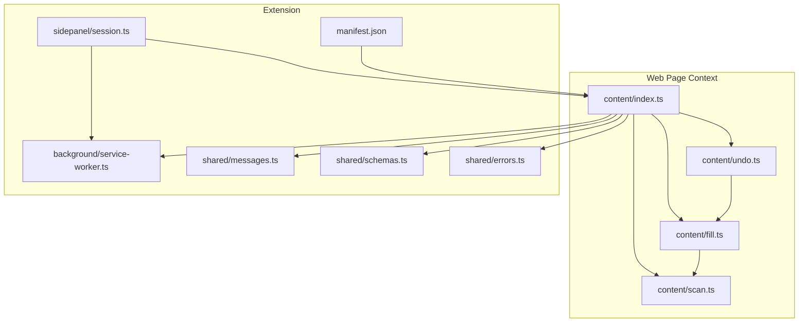
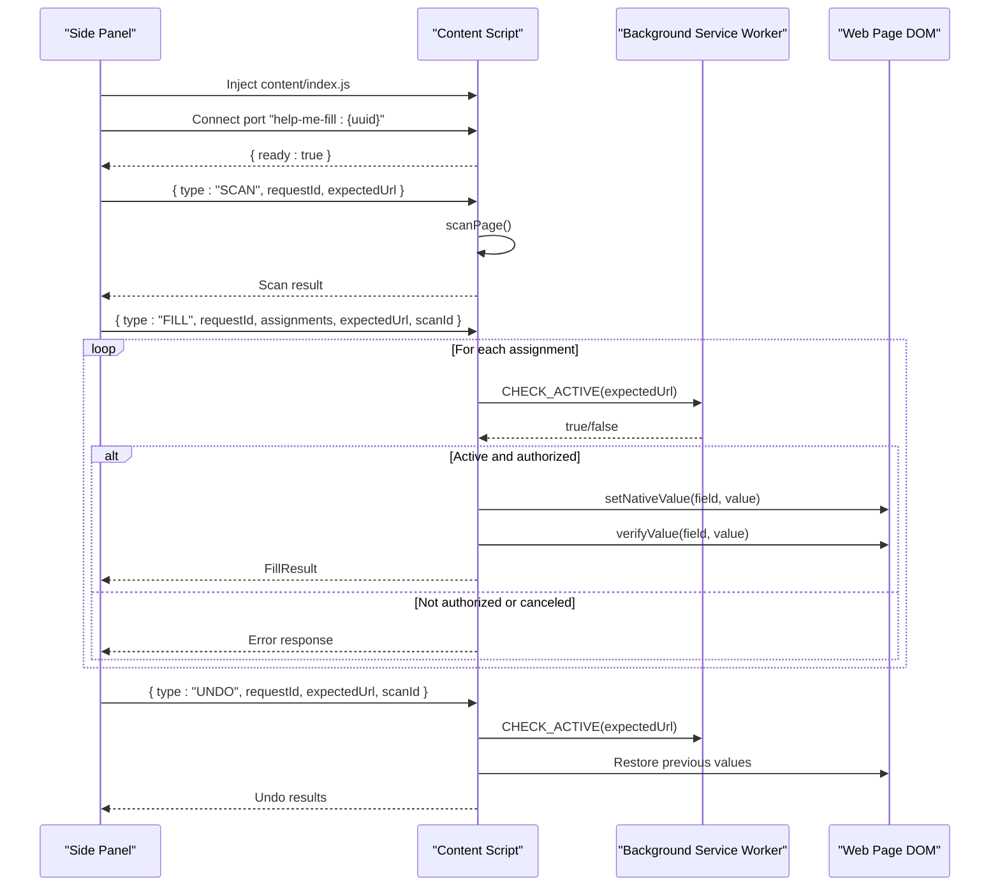
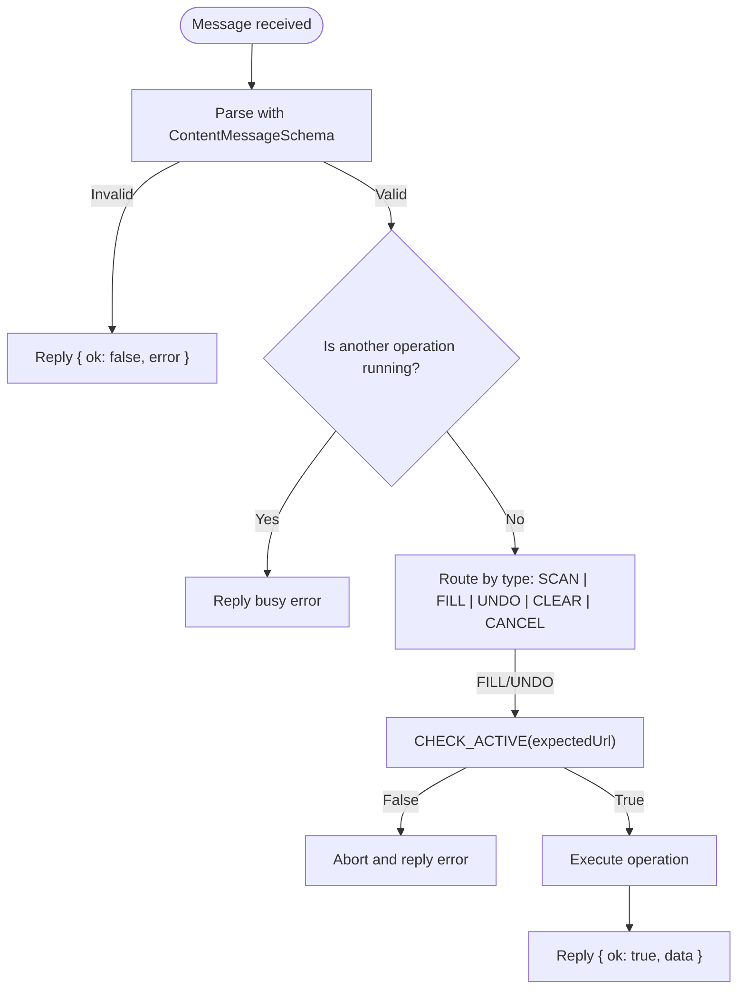
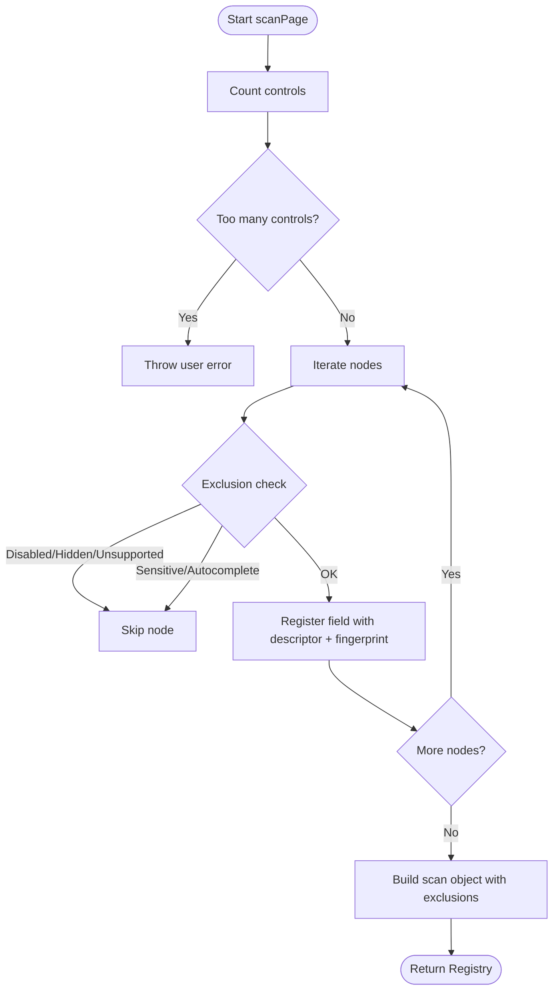
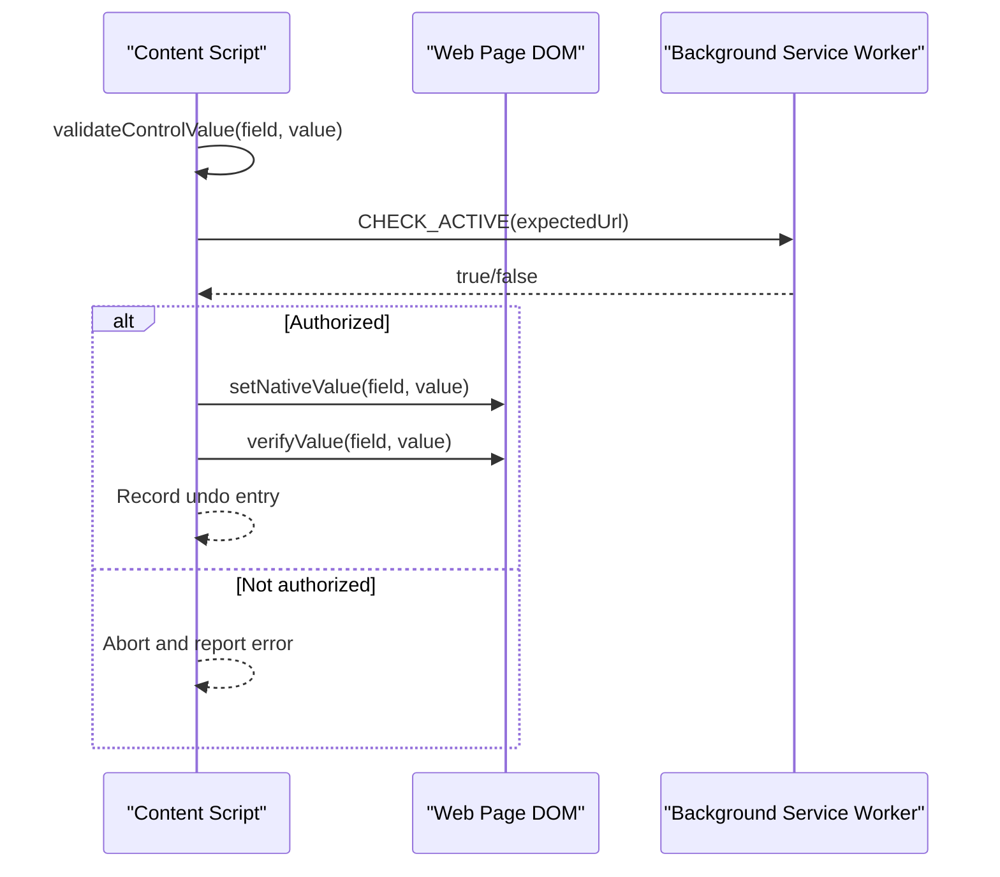
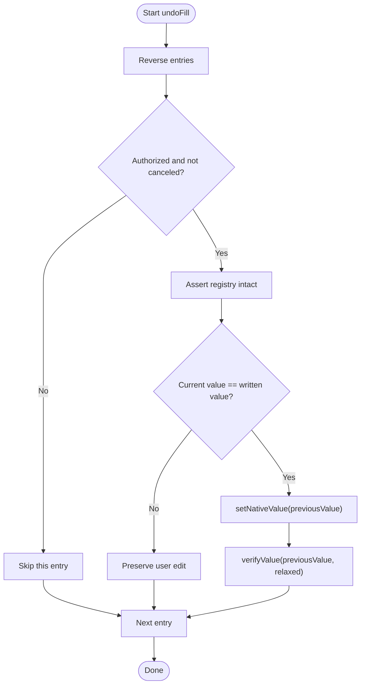
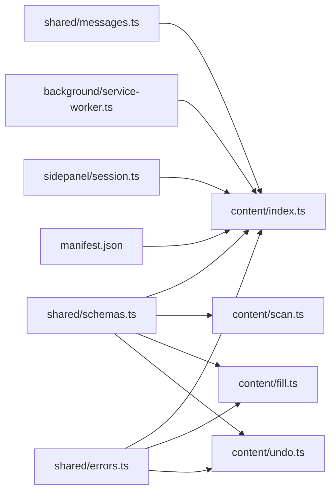

# Content Scripts Architecture

<cite>
**Referenced Files in This Document**
- [index.ts](file://src/content/index.ts)
- [scan.ts](file://src/content/scan.ts)
- [fill.ts](file://src/content/fill.ts)
- [undo.ts](file://src/content/undo.ts)
- [service-worker.ts](file://src/background/service-worker.ts)
- [messages.ts](file://src/shared/messages.ts)
- [schemas.ts](file://src/shared/schemas.ts)
- [errors.ts](file://src/shared/errors.ts)
- [session.ts](file://src/sidepanel/session.ts)
- [manifest.json](file://src/manifest.json)
</cite>

## Table of Contents
1. [Introduction](#introduction)
2. [Project Structure](#project-structure)
3. [Core Components](#core-components)
4. [Architecture Overview](#architecture-overview)
5. [Detailed Component Analysis](#detailed-component-analysis)
6. [Dependency Analysis](#dependency-analysis)
7. [Performance Considerations](#performance-considerations)
8. [Troubleshooting Guide](#troubleshooting-guide)
9. [Conclusion](#conclusion)

## Introduction
This document explains the content scripts architecture that runs inside web page contexts to safely scan and fill forms, while communicating securely with the extension’s background service worker and side panel. It covers:
- Secure messaging between content scripts and the background service worker using Chrome Extension APIs
- Form scanning that detects supported input fields and filters out sensitive or unsafe elements
- Safe DOM manipulation for form filling without breaking page functionality
- Undo functionality that preserves original field states and allows reverting changes
- Security measures to prevent XSS and protect data privacy during interactions

## Project Structure
The content script layer is composed of four modules:
- Entry and message routing: index.ts
- Scanning and validation: scan.ts
- Filling logic: fill.ts
- Undo logic: undo.ts

These modules coordinate with:
- Background service worker: service-worker.ts (authorization checks)
- Side panel session manager: session.ts (orchestrates scanning, mapping, and execution)
- Shared schemas and messages: schemas.ts, messages.ts, errors.ts
- Manifest permissions: manifest.json

**Diagram sources**
- [index.ts:1-72](file://src/content/index.ts#L1-L72)
- [scan.ts:1-88](file://src/content/scan.ts#L1-L88)
- [fill.ts:1-82](file://src/content/fill.ts#L1-L82)
- [undo.ts:1-29](file://src/content/undo.ts#L1-L29)
- [service-worker.ts:1-29](file://src/background/service-worker.ts#L1-L29)
- [session.ts:44-86](file://src/sidepanel/session.ts#L44-L86)
- [messages.ts:1-20](file://src/shared/messages.ts#L1-L20)
- [schemas.ts:1-39](file://src/shared/schemas.ts#L1-L39)
- [errors.ts:1-10](file://src/shared/errors.ts#L1-L10)
- [manifest.json:1-19](file://src/manifest.json#L1-L19)

**Section sources**
- [index.ts:1-72](file://src/content/index.ts#L1-L72)
- [scan.ts:1-88](file://src/content/scan.ts#L1-L88)
- [fill.ts:1-82](file://src/content/fill.ts#L1-L82)
- [undo.ts:1-29](file://src/content/undo.ts#L1-L29)
- [service-worker.ts:1-29](file://src/background/service-worker.ts#L1-L29)
- [session.ts:44-86](file://src/sidepanel/session.ts#L44-L86)
- [messages.ts:1-20](file://src/shared/messages.ts#L1-L20)
- [schemas.ts:1-39](file://src/shared/schemas.ts#L1-L39)
- [errors.ts:1-10](file://src/shared/errors.ts#L1-L10)
- [manifest.json:1-19](file://src/manifest.json#L1-L19)

## Core Components
- Content entrypoint (index.ts): Initializes the content script once per page, sets up trusted connections from the side panel, routes messages, enforces state guards, and coordinates scanning, filling, and undo operations.
- Scanner (scan.ts): Discovers text-like controls, builds descriptors, applies exclusion rules (disabled, hidden, sensitive patterns), and validates structural integrity before any write.
- Filler (fill.ts): Validates assignments, writes values via native setters, triggers events, verifies persistence, and records undo entries.
- Undoer (undo.ts): Reverses fills by restoring previous values, with safety checks and verification.
- Background service worker (service-worker.ts): Provides short-lived authorization checks ensuring the target tab remains active and matches expected URL.
- Side panel session (session.ts): Orchestrates injection, scanning, and execution; manages ports and timeouts; sends typed messages and parses results.

**Section sources**
- [index.ts:1-72](file://src/content/index.ts#L1-L72)
- [scan.ts:1-88](file://src/content/scan.ts#L1-L88)
- [fill.ts:1-82](file://src/content/fill.ts#L1-L82)
- [undo.ts:1-29](file://src/content/undo.ts#L1-L29)
- [service-worker.ts:1-29](file://src/background/service-worker.ts#L1-L29)
- [session.ts:44-86](file://src/sidepanel/session.ts#L44-L86)

## Architecture Overview
The secure communication flow uses a combination of message passing and long-lived ports:
- The side panel injects the content script into the active tab and opens a port named with a unique UUID.
- The content script validates the sender and registers the connection.
- For each operation (SCAN, FILL, UNDO), the side panel sends a typed message through chrome.tabs.sendMessage with a documentId.
- Before writing, the content script asks the background service worker to confirm the tab is still active and on the expected URL.
- Results are returned as typed responses with success or error payloads.

**Diagram sources**
- [session.ts:55-86](file://src/sidepanel/session.ts#L55-L86)
- [index.ts:15-69](file://src/content/index.ts#L15-L69)
- [service-worker.ts:17-28](file://src/background/service-worker.ts#L17-L28)
- [fill.ts:42-81](file://src/content/fill.ts#L42-L81)
- [undo.ts:6-28](file://src/content/undo.ts#L6-L28)

## Detailed Component Analysis

### Secure Messaging and Connection Model
- Trusted connections: Only ports from the extension’s own side panel are accepted, validated by origin and name pattern.
- Message schema enforcement: All incoming messages are parsed against a discriminated union schema to ensure structure and limits.
- Request lifecycle: Each operation carries a unique requestId; the content script tracks pending tasks to avoid race conditions and caps concurrent operations.
- Authorization gate: Before any write, the content script calls the background service worker to verify the tab is active and matches the expected URL.

**Diagram sources**
- [index.ts:22-69](file://src/content/index.ts#L22-L69)
- [service-worker.ts:17-28](file://src/background/service-worker.ts#L17-L28)
- [messages.ts:1-20](file://src/shared/messages.ts#L1-L20)

**Section sources**
- [index.ts:1-72](file://src/content/index.ts#L1-L72)
- [service-worker.ts:1-29](file://src/background/service-worker.ts#L1-L29)
- [messages.ts:1-20](file://src/shared/messages.ts#L1-L20)

### Form Scanning and Safety Filters
- Field discovery: Scans input and textarea elements, building descriptors including labels, placeholders, context, constraints, and current values.
- Visibility checks: Excludes hidden, inert, or non-visible controls.
- Type filtering: Only supports safe text-like types; rejects unsupported types.
- Sensitive element detection: Uses pattern matching on labels, aria attributes, placeholders, names, and IDs to exclude passwords, OTP/PIN/CVV, credit card numbers, bank account info, social security numbers, CAPTCHAs, and similar sensitive inputs.
- Autocomplete filtering: Rejects authentication or payment-related autocomplete tokens.
- Limits: Enforces maximum number of fields and value sizes to prevent abuse or performance issues.
- Integrity assertions: Ensures the document and form structure have not changed since scanning before allowing writes.

**Diagram sources**
- [scan.ts:62-88](file://src/content/scan.ts#L62-L88)
- [scan.ts:10-57](file://src/content/scan.ts#L10-L57)
- [schemas.ts:1-39](file://src/shared/schemas.ts#L1-L39)

**Section sources**
- [scan.ts:1-88](file://src/content/scan.ts#L1-L88)
- [schemas.ts:1-39](file://src/shared/schemas.ts#L1-L39)

### Safe Form Filling Mechanism
- Pre-flight validation: Verifies assignments against registry, prevents duplicates, ensures no unexpected overwrites unless explicitly allowed, and validates constraints (length, pattern, required).
- Native value setting: Uses the browser’s native setter to trigger real-time updates and event listeners, then dispatches input/change events and blurs the control.
- Persistence verification: Waits for DOM stabilization and re-checks that the value persisted and validity holds.
- Guarded execution: Checks cancellation and active-tab authorization before each write; aborts remaining writes on failure.
- Undo tracking: Records previous values and written values to enable precise restoration.

**Diagram sources**
- [fill.ts:8-41](file://src/content/fill.ts#L8-L41)
- [fill.ts:42-81](file://src/content/fill.ts#L42-L81)
- [service-worker.ts:17-28](file://src/background/service-worker.ts#L17-L28)

**Section sources**
- [fill.ts:1-82](file://src/content/fill.ts#L1-L82)

### Undo Functionality
- Reverse order restoration: Restores fields in reverse order to minimize interference.
- State preservation: Only restores if the current value equals what was written, preserving subsequent user edits.
- Safety checks: Re-validates registry and authorization before each restore.
- Verification: Attempts to verify restored values without strict validity checks to accommodate page-specific behaviors.

**Diagram sources**
- [undo.ts:6-28](file://src/content/undo.ts#L6-L28)
- [fill.ts:17-41](file://src/content/fill.ts#L17-L41)

**Section sources**
- [undo.ts:1-29](file://src/content/undo.ts#L1-L29)
- [fill.ts:1-82](file://src/content/fill.ts#L1-L82)

### Security Measures Against XSS and Data Privacy
- Strict message parsing: All messages are validated against schemas to prevent injection of unexpected structures.
- Origin and frame validation: Only trusted side panel connections are accepted; background checks ensure the correct tab and URL.
- CSP and permissions: Manifest restricts extension pages’ CSP and requests only necessary permissions; optional host permissions are declared for external APIs.
- Sensitive field filtering: Patterns detect and exclude sensitive inputs such as passwords, OTPs, CVV, credit cards, bank accounts, SSNs, CAPTCHAs, and related terms.
- Controlled DOM manipulation: Uses native setters and events rather than innerHTML or eval; avoids arbitrary code execution paths.
- Limits and bounds: Enforces maximum field counts and value lengths to mitigate resource exhaustion and payload size risks.

**Section sources**
- [messages.ts:1-20](file://src/shared/messages.ts#L1-L20)
- [schemas.ts:1-39](file://src/shared/schemas.ts#L1-L39)
- [scan.ts:8-57](file://src/content/scan.ts#L8-L57)
- [service-worker.ts:17-28](file://src/background/service-worker.ts#L17-L28)
- [manifest.json:1-19](file://src/manifest.json#L1-L19)

## Dependency Analysis
The content scripts depend on shared schemas and messages for type safety and limits, and coordinate with the background service worker for authorization. The side panel orchestrates the workflow and handles UI state.

**Diagram sources**
- [messages.ts:1-20](file://src/shared/messages.ts#L1-L20)
- [schemas.ts:1-39](file://src/shared/schemas.ts#L1-L39)
- [errors.ts:1-10](file://src/shared/errors.ts#L1-L10)
- [index.ts:1-72](file://src/content/index.ts#L1-L72)
- [scan.ts:1-88](file://src/content/scan.ts#L1-L88)
- [fill.ts:1-82](file://src/content/fill.ts#L1-L82)
- [undo.ts:1-29](file://src/content/undo.ts#L1-L29)
- [service-worker.ts:1-29](file://src/background/service-worker.ts#L1-L29)
- [session.ts:44-86](file://src/sidepanel/session.ts#L44-L86)
- [manifest.json:1-19](file://src/manifest.json#L1-L19)

**Section sources**
- [index.ts:1-72](file://src/content/index.ts#L1-L72)
- [scan.ts:1-88](file://src/content/scan.ts#L1-L88)
- [fill.ts:1-82](file://src/content/fill.ts#L1-L82)
- [undo.ts:1-29](file://src/content/undo.ts#L1-L29)
- [service-worker.ts:1-29](file://src/background/service-worker.ts#L1-L29)
- [session.ts:44-86](file://src/sidepanel/session.ts#L44-L86)
- [messages.ts:1-20](file://src/shared/messages.ts#L1-L20)
- [schemas.ts:1-39](file://src/shared/schemas.ts#L1-L39)
- [errors.ts:1-10](file://src/shared/errors.ts#L1-L10)
- [manifest.json:1-19](file://src/manifest.json#L1-L19)

## Performance Considerations
- Limiting scans: Enforces maximum number of fields and value sizes to keep scanning and processing fast and memory-safe.
- Efficient DOM traversal: Uses targeted selectors and bounded tree walking to collect labels and context without excessive overhead.
- Batch operations: Fills are processed sequentially with pre-validation to fail fast and avoid partial writes.
- Event-driven updates: Dispatches minimal events to integrate with page frameworks while avoiding heavy reflows.

[No sources needed since this section provides general guidance]

## Troubleshooting Guide
Common issues and their causes:
- Invalid extension message: Indicates malformed or unauthorized message; check schema compliance and trusted origins.
- Another operation is still running: A prior task has not completed; wait or clear the session.
- The page changed: Navigation or DOM mutation invalidated the scan; re-scan before filling.
- Unknown or duplicate field ID: Ensure assignments reference valid, unique field IDs from the scan.
- Overwriting an existing value requires explicit approval: Set allowOverwrite when appropriate.
- The review panel is no longer connected: Port disconnected; reconnect and retry.
- Target tab changed or inactive: Authorization failed; ensure the correct tab is active and URL matches.
- Control exceeds safety limits: Values or patterns too large; reduce input size.
- Unsupported input type or disabled/read-only: Only supported text-like controls can be filled.
- Hidden controls: Controls must be visible and interactive.
- Authentication or payment controls: Blocked by sensitive pattern detection.

**Section sources**
- [index.ts:22-69](file://src/content/index.ts#L22-L69)
- [scan.ts:47-88](file://src/content/scan.ts#L47-L88)
- [fill.ts:8-81](file://src/content/fill.ts#L8-L81)
- [undo.ts:6-28](file://src/content/undo.ts#L6-L28)
- [errors.ts:1-10](file://src/shared/errors.ts#L1-L10)

## Conclusion
The content scripts provide a robust, secure mechanism to scan and fill web forms within browser contexts. They enforce strict message validation, limit exposure to sensitive inputs, and use safe DOM manipulation techniques. Authorization checks via the background service worker ensure operations occur only on the intended, active tab. Undo support preserves user intent and enables safe reversibility. Together, these components deliver a reliable and privacy-preserving form-filling experience.