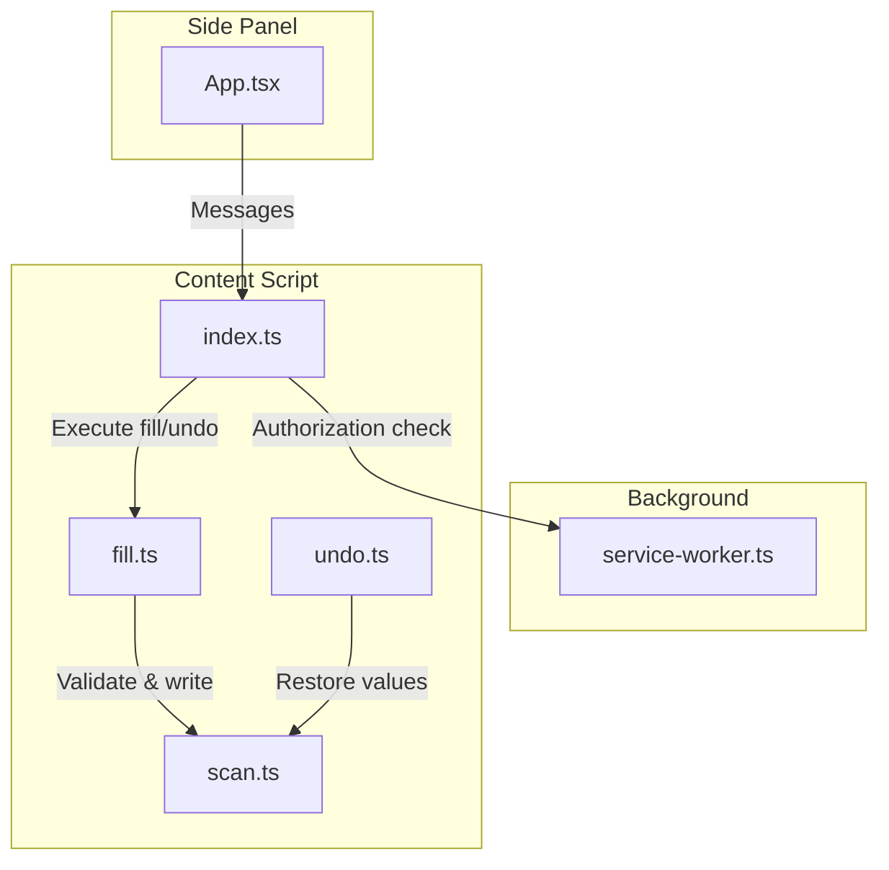
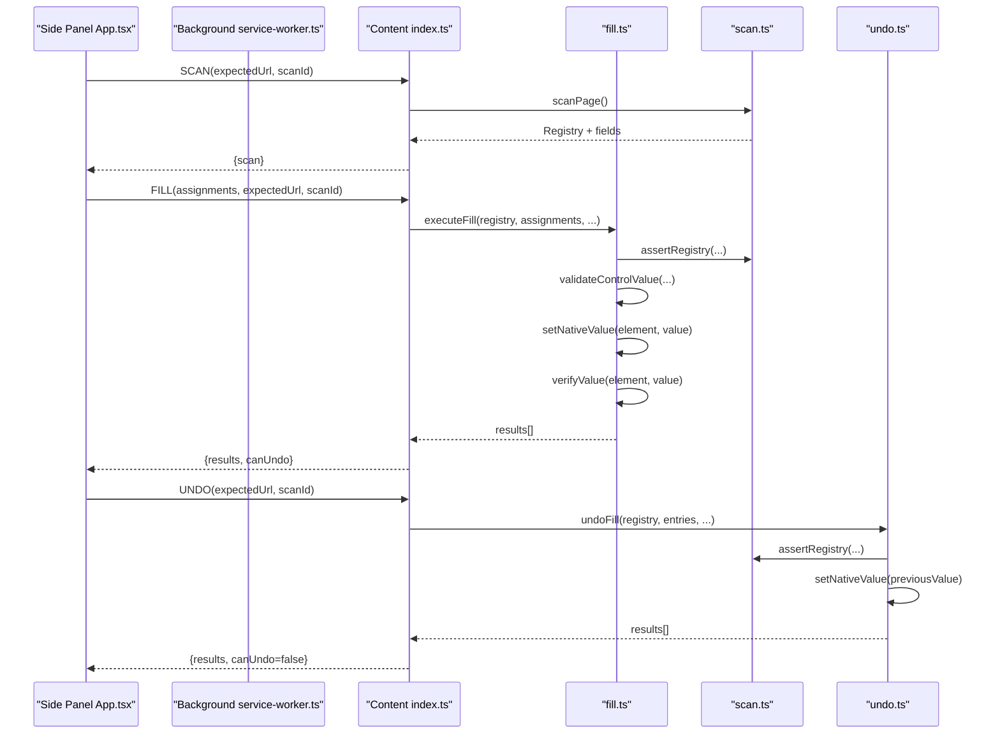
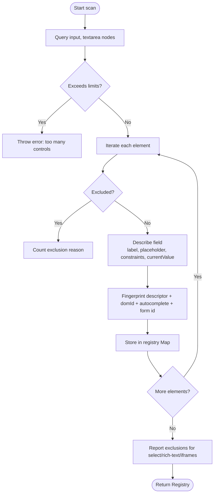
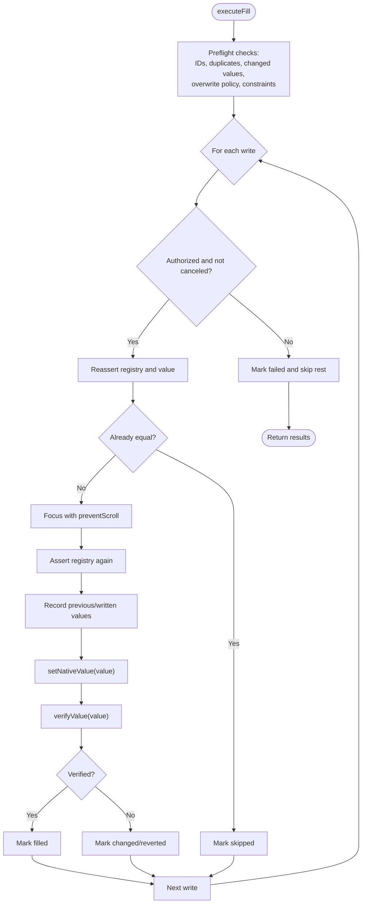
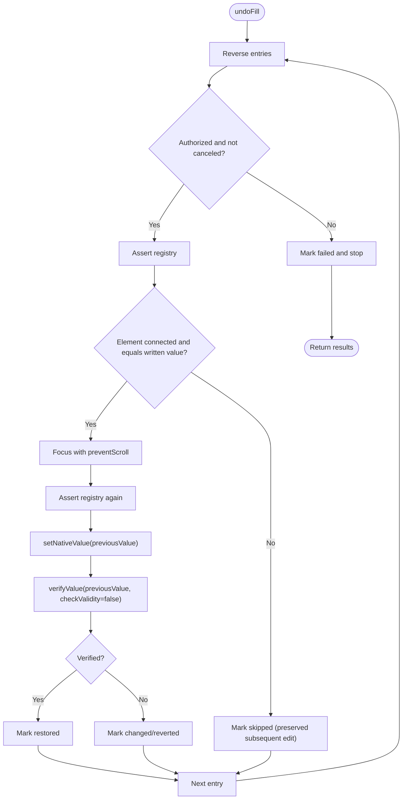
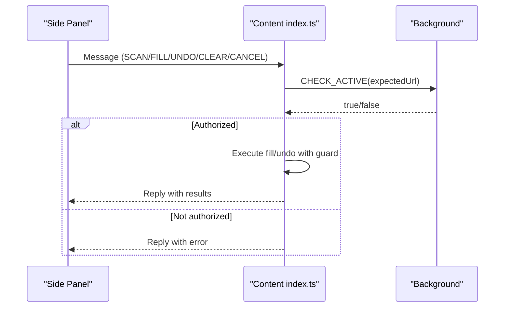
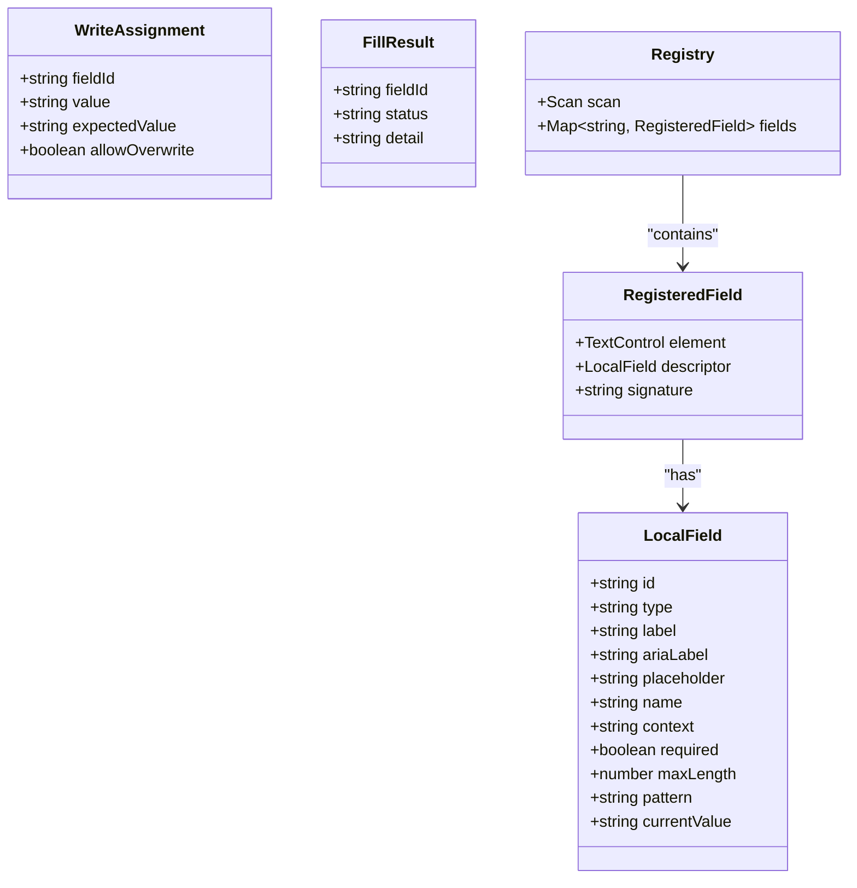
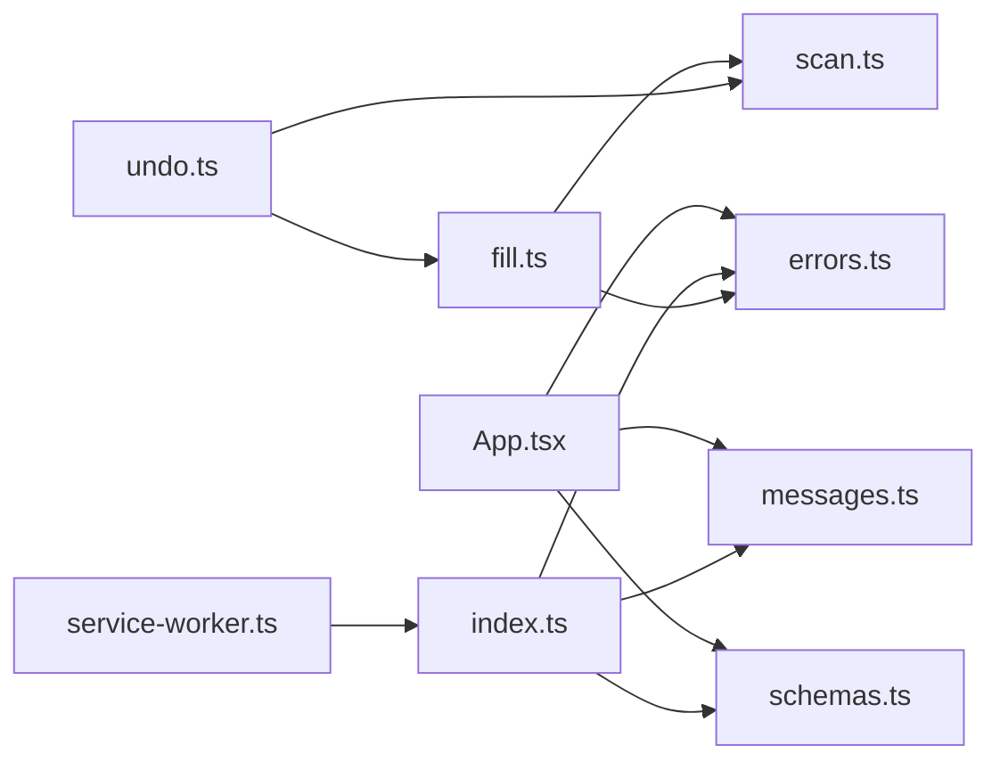

# Field Manipulation Engine

<cite>
**Referenced Files in This Document**
- [fill.ts](file://src/content/fill.ts)
- [scan.ts](file://src/content/scan.ts)
- [undo.ts](file://src/content/undo.ts)
- [index.ts](file://src/content/index.ts)
- [schemas.ts](file://src/shared/schemas.ts)
- [errors.ts](file://src/shared/errors.ts)
- [messages.ts](file://src/shared/messages.ts)
- [service-worker.ts](file://src/background/service-worker.ts)
- [App.tsx](file://src/sidepanel/App.tsx)
- [filler.test.ts](file://tests/integration/filler.test.ts)
</cite>

## Table of Contents
1. [Introduction](#introduction)
2. [Project Structure](#project-structure)
3. [Core Components](#core-components)
4. [Architecture Overview](#architecture-overview)
5. [Detailed Component Analysis](#detailed-component-analysis)
6. [Dependency Analysis](#dependency-analysis)
7. [Performance Considerations](#performance-considerations)
8. [Troubleshooting Guide](#troubleshooting-guide)
9. [Conclusion](#conclusion)
10. [Appendices](#appendices)

## Introduction
This document explains the safe field manipulation engine that fills form fields without breaking page functionality. It focuses on how DOM elements are populated while preserving event handlers and validation logic, how original values are captured to enable undo, and how errors are handled when dynamic content or JavaScript validation interferes. It also provides examples of successful population across supported input types and clarifies limitations for complex widgets such as date pickers and custom components.

## Project Structure
The engine is implemented as a browser extension with three primary layers:
- Side panel UI: orchestrates scanning, mapping, filling, and undo flows.
- Background service worker: authorizes active tab checks and manages permissions.
- Content script: performs safe DOM operations on the target page.

**Diagram sources**
- [App.tsx:69-95](file://src/sidepanel/App.tsx#L69-L95)
- [service-worker.ts:17-28](file://src/background/service-worker.ts#L17-L28)
- [index.ts:22-53](file://src/content/index.ts#L22-L53)
- [fill.ts:42-81](file://src/content/fill.ts#L42-L81)
- [scan.ts:62-87](file://src/content/scan.ts#L62-L87)
- [undo.ts:6-28](file://src/content/undo.ts#L6-L28)

**Section sources**
- [App.tsx:69-95](file://src/sidepanel/App.tsx#L69-L95)
- [service-worker.ts:17-28](file://src/background/service-worker.ts#L17-L28)
- [index.ts:22-53](file://src/content/index.ts#L22-L53)
- [fill.ts:42-81](file://src/content/fill.ts#L42-L81)
- [scan.ts:62-87](file://src/content/scan.ts#L62-L87)
- [undo.ts:6-28](file://src/content/undo.ts#L6-L28)

## Core Components
- Scanner: discovers eligible text controls, captures metadata (labels, placeholders, constraints), and builds a registry snapshot used throughout execution.
- Filler: validates assignments against constraints and snapshot state, writes values using native setters, dispatches events, and verifies persistence.
- Undoer: restores previous values safely, skipping edits made by users or pages after the initial fill.
- Orchestrator: manages lifecycle, messaging between side panel and content script, authorization, cancellation, and completion.

Key responsibilities:
- Preserve event handlers and validation by using native value setters and dispatching standard events.
- Capture original values before modification to support undo.
- Validate inputs against maxLength/minLength/pattern/required and browser validity.
- Guard against race conditions, page changes, and unauthorized actions.

**Section sources**
- [scan.ts:32-87](file://src/content/scan.ts#L32-L87)
- [fill.ts:8-81](file://src/content/fill.ts#L8-L81)
- [undo.ts:6-28](file://src/content/undo.ts#L6-L28)
- [index.ts:22-53](file://src/content/index.ts#L22-L53)

## Architecture Overview
The flow begins in the side panel, which scans the current page, generates a mapping plan, and then requests the content script to execute fills. The content script validates and writes values, verifies them, and returns results. An optional undo operation restores previous values.

**Diagram sources**
- [App.tsx:69-95](file://src/sidepanel/App.tsx#L69-L95)
- [service-worker.ts:17-28](file://src/background/service-worker.ts#L17-L28)
- [index.ts:22-53](file://src/content/index.ts#L22-L53)
- [fill.ts:42-81](file://src/content/fill.ts#L42-L81)
- [scan.ts:62-87](file://src/content/scan.ts#L62-L87)
- [undo.ts:6-28](file://src/content/undo.ts#L6-L28)

## Detailed Component Analysis

### Scanner: Safe discovery and metadata capture
- Scans only visible, enabled text controls within limits.
- Captures labels via aria-labelledby/aria-label and associated label elements; excludes nested control contents from labels to avoid leaking values into metadata.
- Records constraints (required, maxLength, pattern) and current values.
- Excludes sensitive or unsupported controls (e.g., password, payment, disabled, hidden).
- Builds a fingerprint per field to detect later DOM mutations.

**Diagram sources**
- [scan.ts:62-87](file://src/content/scan.ts#L62-L87)
- [scan.ts:32-61](file://src/content/scan.ts#L32-L61)

**Section sources**
- [scan.ts:10-87](file://src/content/scan.ts#L10-L87)

### Filler: Validation, safe writing, and verification
- Preflight validation:
  - Ensures all field IDs exist and are unique.
  - Verifies no user edits occurred since review.
  - Enforces overwrite policy (requires explicit approval if overwriting non-empty values).
  - Validates length limits and browser validity using a cloned node probe.
- Writing strategy:
  - Uses native value setter via prototype descriptor to preserve event wiring.
  - Dispatches input and change events and blurs the field to trigger page-side effects.
  - Focuses the field with scroll prevention to minimize visual disruption.
- Verification:
  - Waits for rendering and rechecks value and validity multiple times to detect asynchronous rejections or replacements by page scripts.
- State preservation:
  - Captures previous value and written value for each field to enable undo.

**Diagram sources**
- [fill.ts:42-81](file://src/content/fill.ts#L42-L81)
- [fill.ts:8-26](file://src/content/fill.ts#L8-L26)

**Section sources**
- [fill.ts:8-81](file://src/content/fill.ts#L8-L81)

### Undoer: Restoring previous values safely
- Iterates undo entries in reverse order to restore last-written first.
- Skips restoration if the field was edited by the user or replaced by the page after the fill.
- Reuses the same native setter and verification approach to ensure consistency.
- Reports restored vs changed/reverted statuses based on verification.

**Diagram sources**
- [undo.ts:6-28](file://src/content/undo.ts#L6-L28)
- [fill.ts:17-41](file://src/content/fill.ts#L17-L41)

**Section sources**
- [undo.ts:6-28](file://src/content/undo.ts#L6-L28)

### Orchestrator: Messaging, authorization, and lifecycle
- Maintains a registry snapshot and undo entries for the session.
- Validates incoming messages and ensures the side panel connection is active.
- Performs an active-tab URL check via the background service worker before executing fills or undo.
- Handles cancellation and clearing of state.

**Diagram sources**
- [index.ts:22-53](file://src/content/index.ts#L22-L53)
- [service-worker.ts:17-28](file://src/background/service-worker.ts#L17-L28)

**Section sources**
- [index.ts:22-53](file://src/content/index.ts#L22-L53)
- [service-worker.ts:17-28](file://src/background/service-worker.ts#L17-L28)

### Data Models and Contracts
- Field descriptors include type, labels, constraints, and current value.
- Assignments specify field ID, desired value, expected current value, and overwrite permission.
- Results report per-field status and details.

**Diagram sources**
- [schemas.ts:3-39](file://src/shared/schemas.ts#L3-L39)
- [scan.ts:4-6](file://src/content/scan.ts#L4-L6)
- [messages.ts:4-8](file://src/shared/messages.ts#L4-L8)

**Section sources**
- [schemas.ts:3-39](file://src/shared/schemas.ts#L3-L39)
- [messages.ts:4-8](file://src/shared/messages.ts#L4-L8)
- [scan.ts:4-6](file://src/content/scan.ts#L4-L6)

## Dependency Analysis
- Content script depends on shared schemas and errors for validation and messaging contracts.
- Filler depends on scanner for registry assertions and field descriptions.
- Undoer depends on filler utilities for consistent value setting and verification.
- Background service worker provides authorization checks to ensure the correct tab is active.
- Side panel coordinates the workflow and displays results.

**Diagram sources**
- [App.tsx:1-13](file://src/sidepanel/App.tsx#L1-L13)
- [index.ts:1-5](file://src/content/index.ts#L1-L5)
- [fill.ts:1-4](file://src/content/fill.ts#L1-L4)
- [undo.ts:1-4](file://src/content/undo.ts#L1-L4)
- [service-worker.ts:17-28](file://src/background/service-worker.ts#L17-L28)

**Section sources**
- [App.tsx:1-13](file://src/sidepanel/App.tsx#L1-L13)
- [index.ts:1-5](file://src/content/index.ts#L1-L5)
- [fill.ts:1-4](file://src/content/fill.ts#L1-L4)
- [undo.ts:1-4](file://src/content/undo.ts#L1-L4)
- [service-worker.ts:17-28](file://src/background/service-worker.ts#L17-L28)

## Performance Considerations
- Limits:
  - Maximum number of fields scanned and assignments per operation to prevent heavy DOM traversal and long-running tasks.
  - Value length limits to avoid oversized payloads and excessive memory usage.
- Efficient scanning:
  - Visibility checks and early exclusions reduce processing overhead.
  - Tree walker with visited count and length caps prevents expensive label extraction.
- Verification timing:
  - Short waits and requestAnimationFrame usage balance responsiveness with reliability for async page updates.

[No sources needed since this section provides general guidance]

## Troubleshooting Guide
Common failure modes and strategies:
- Unknown or duplicate field IDs:
  - Preflight rejects invalid assignments before any writes occur.
- Changed fields since review:
  - Snapshot-based checks ensure values have not been modified by users or the page.
- Overwrite protection:
  - Non-empty values require explicit approval to prevent accidental data loss.
- Constraint violations:
  - Length and browser validity are validated before writing; invalid values are rejected with clear messages.
- Dynamic content interference:
  - Verification detects values reverted or replaced by page scripts; reports changed/reverted status.
- Authorization failures:
  - Active tab URL mismatch or tab switching aborts the operation and reports failure.
- Cancellation:
  - Cancelling clears ongoing work and stops remaining writes; partial fills may remain.

Error handling patterns:
- UserError instances carry human-readable messages.
- Abort signals result in standardized cancellation messages.
- Unexpected errors are normalized to a generic message to avoid leaking internals.

**Section sources**
- [fill.ts:42-81](file://src/content/fill.ts#L42-L81)
- [errors.ts:1-10](file://src/shared/errors.ts#L1-L10)
- [filler.test.ts:47-129](file://tests/integration/filler.test.ts#L47-L129)

## Conclusion
The field manipulation engine prioritizes safety and fidelity: it uses native value setters to preserve event handlers and validation, validates inputs rigorously, and verifies persistence against dynamic page behavior. Original values are captured to enable reliable undo. Robust guards protect against race conditions, unauthorized actions, and unexpected page changes. While the engine supports common text-based inputs effectively, complex widgets like date pickers and custom components are not directly supported; users should rely on native controls where possible.

[No sources needed since this section summarizes without analyzing specific files]

## Appendices

### Supported Input Types and Examples
- Text, email, tel, url, textarea:
  - Values are written via native setters and verified through standard events and validity checks.
  - Tests demonstrate successful filling and event emission without triggering form submission.

Examples from tests:
- Native inputs receive input/change/blur events and retain values after verification.
- Overwrite protection works for non-empty values unless explicitly approved.
- Constraints like maxLength and pattern are enforced before writing.

**Section sources**
- [filler.test.ts:47-129](file://tests/integration/filler.test.ts#L47-L129)

### Handling Complex Interactions
- Date pickers and custom widgets:
  - The engine targets native text controls only. If a widget replaces native inputs with custom elements, those are excluded from scanning.
  - For frameworks that bind values to controlled components, ensure the underlying native input is present and exposed; otherwise, manual intervention may be required.
- Rich text editors and iframes:
  - Explicitly excluded due to complexity and potential security risks.

Limitations documented in the side panel hint:
- Top-frame text fields only; authentication/payment filtering is best-effort; no iframes, custom widgets, or form submission.

**Section sources**
- [App.tsx:117-120](file://src/sidepanel/App.tsx#L117-L120)
- [scan.ts:47-57](file://src/content/scan.ts#L47-L57)