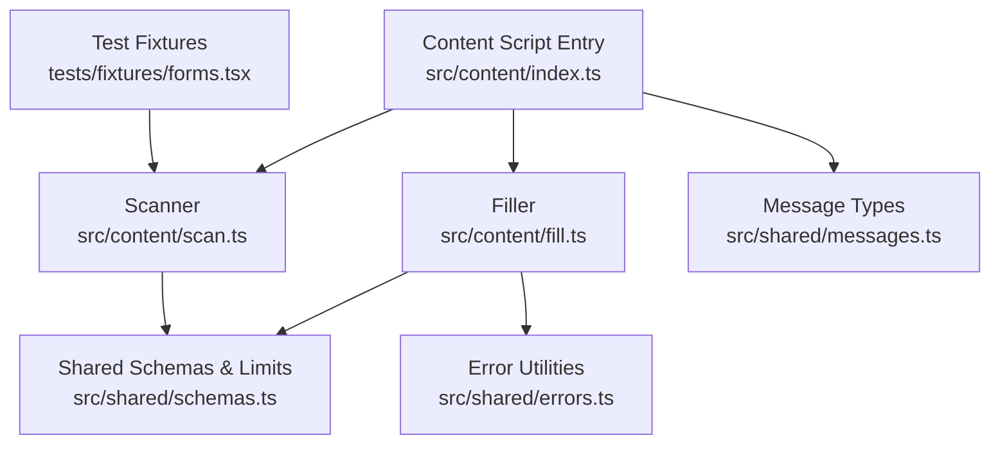
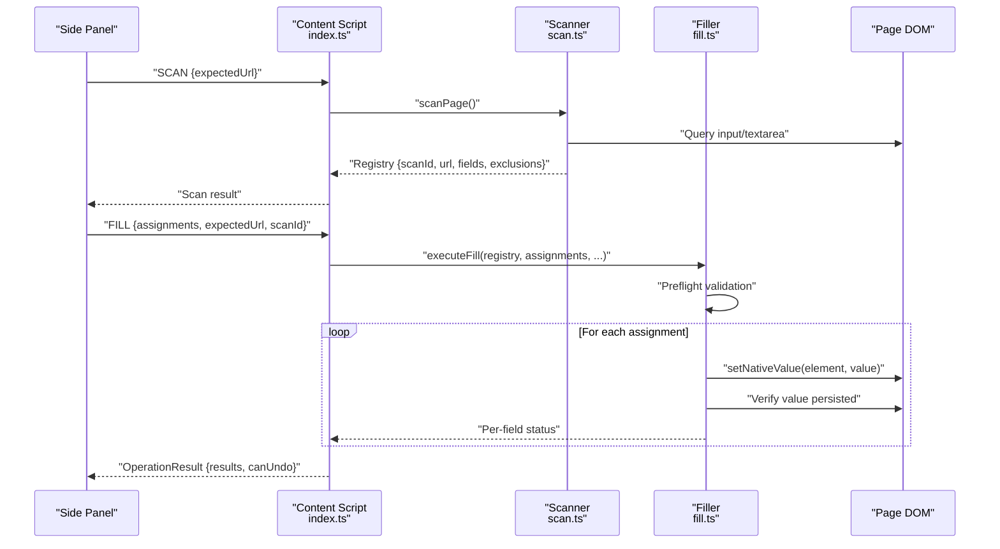
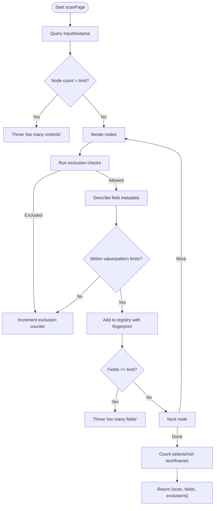
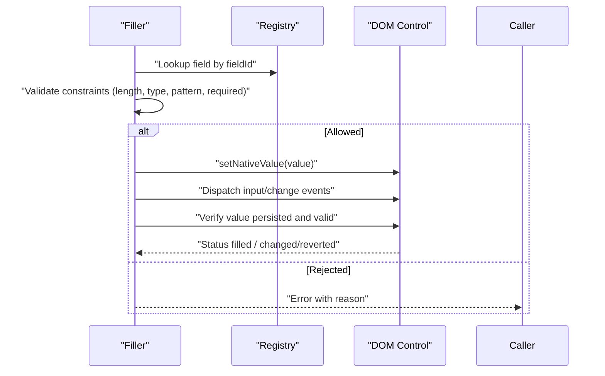
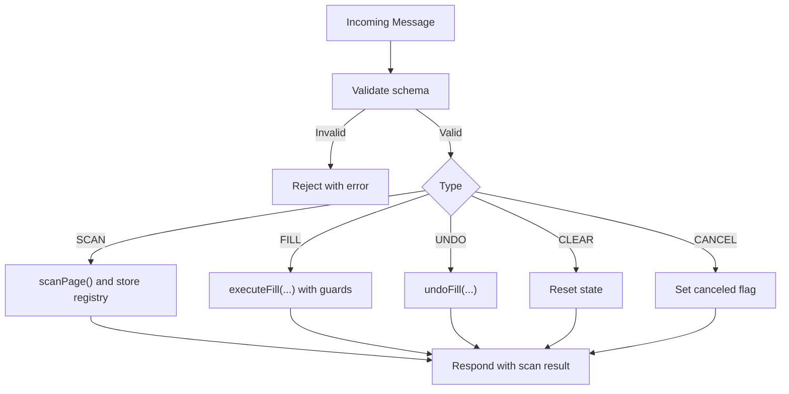
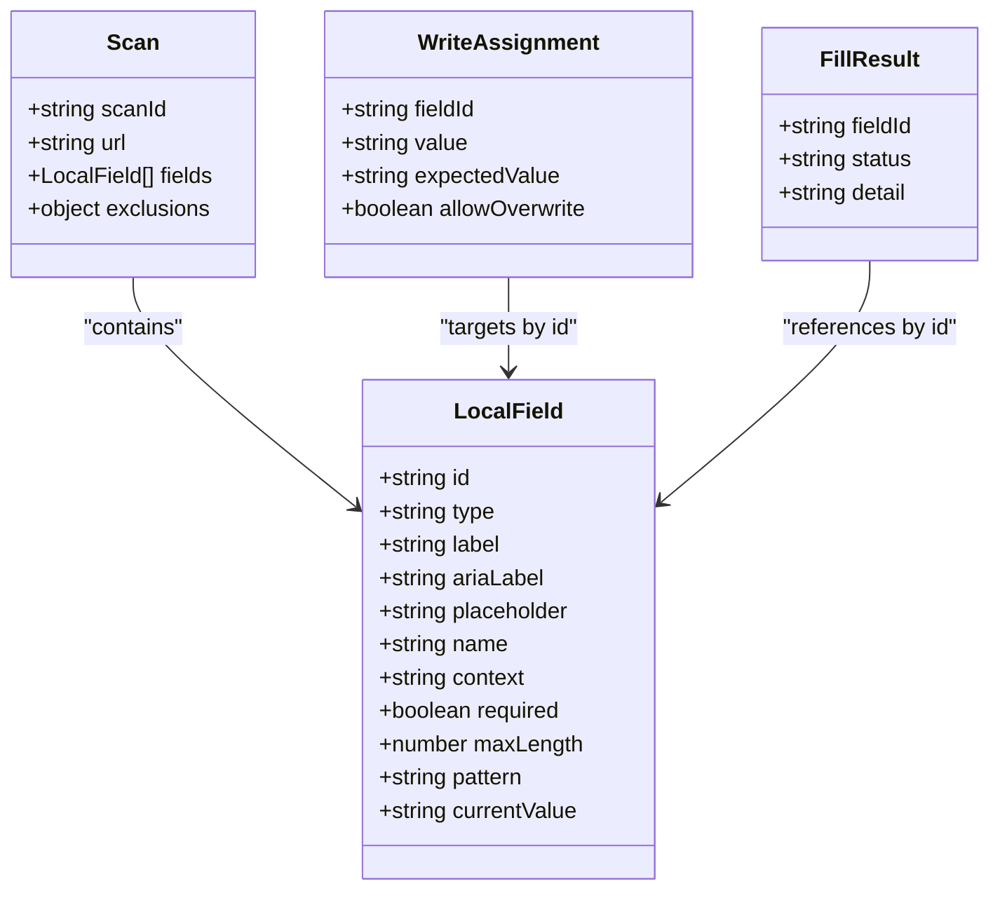
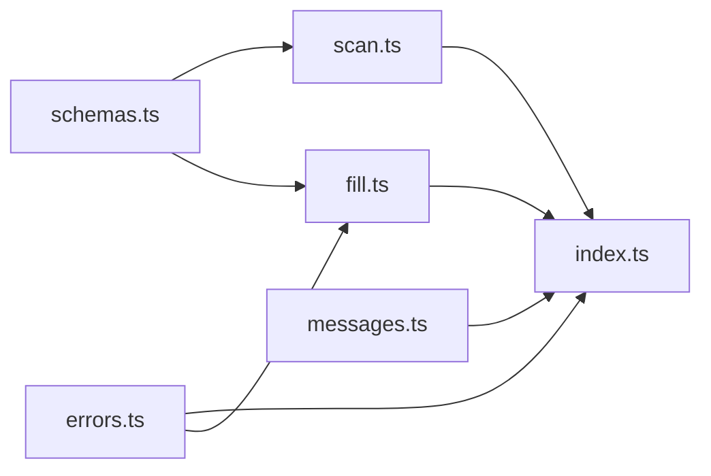

# Form Scanning System

<cite>
**Referenced Files in This Document**
- [scan.ts](file://src/content/scan.ts)
- [fill.ts](file://src/content/fill.ts)
- [index.ts](file://src/content/index.ts)
- [schemas.ts](file://src/shared/schemas.ts)
- [messages.ts](file://src/shared/messages.ts)
- [errors.ts](file://src/shared/errors.ts)
- [forms.tsx](file://tests/fixtures/forms.tsx)
</cite>

## Table of Contents
1. [Introduction](#introduction)
2. [Project Structure](#project-structure)
3. [Core Components](#core-components)
4. [Architecture Overview](#architecture-overview)
5. [Detailed Component Analysis](#detailed-component-analysis)
6. [Dependency Analysis](#dependency-analysis)
7. [Performance Considerations](#performance-considerations)
8. [Troubleshooting Guide](#troubleshooting-guide)
9. [Conclusion](#conclusion)

## Introduction
This document explains the form scanning system that detects and analyzes web page form fields to enable safe, user-approved filling. It covers how supported input elements are identified, how sensitive or unsupported controls are filtered out, how field metadata is extracted (including accessibility labels, validation rules, and constraints), and what security measures protect against malicious or unauthorized operations. It also provides examples of supported versus unsupported elements and discusses performance considerations for large forms.

## Project Structure
The scanning and filling logic lives in the content script layer of the extension:
- Scanning and field discovery: src/content/scan.ts
- Filling execution and verification: src/content/fill.ts
- Content script message handling and lifecycle: src/content/index.ts
- Shared schemas and limits: src/shared/schemas.ts
- Message types and validation: src/shared/messages.ts
- Error utilities: src/shared/errors.ts
- Test fixtures demonstrating supported/unsupported elements: tests/fixtures/forms.tsx

**Diagram sources**
- [index.ts:1-72](file://src/content/index.ts#L1-L72)
- [scan.ts:1-88](file://src/content/scan.ts#L1-L88)
- [fill.ts:1-82](file://src/content/fill.ts#L1-L82)
- [schemas.ts:1-39](file://src/shared/schemas.ts#L1-L39)
- [messages.ts:1-20](file://src/shared/messages.ts#L1-L20)
- [errors.ts:1-10](file://src/shared/errors.ts#L1-L10)
- [forms.tsx:1-48](file://tests/fixtures/forms.tsx#L1-L48)

**Section sources**
- [index.ts:1-72](file://src/content/index.ts#L1-L72)
- [scan.ts:1-88](file://src/content/scan.ts#L1-L88)
- [fill.ts:1-82](file://src/content/fill.ts#L1-L82)
- [schemas.ts:1-39](file://src/shared/schemas.ts#L1-L39)
- [messages.ts:1-20](file://src/shared/messages.ts#L1-L20)
- [errors.ts:1-10](file://src/shared/errors.ts#L1-L10)
- [forms.tsx:1-48](file://tests/fixtures/forms.tsx#L1-L48)

## Core Components
- Scanner: Discovers eligible text-like controls, extracts metadata, applies safety filters, and returns a registry with descriptors and fingerprints.
- Filler: Validates assignments, writes values safely using native setters, verifies persistence, and supports undo.
- Message Handler: Orchestrates scan and fill flows, enforces trust boundaries, and manages session state.
- Schemas and Limits: Define allowed field types, size caps, and data contracts between components.
- Errors: Centralized error formatting and abort handling.

Key responsibilities:
- Supported element detection and filtering
- Metadata extraction (labels, placeholders, constraints)
- Security checks (sensitive patterns, disabled/hidden, autocomplete tokens)
- Performance safeguards (limits on nodes and fields)
- Safe value writing and verification

**Section sources**
- [scan.ts:10-88](file://src/content/scan.ts#L10-L88)
- [fill.ts:8-82](file://src/content/fill.ts#L8-L82)
- [index.ts:22-52](file://src/content/index.ts#L22-L52)
- [schemas.ts:1-39](file://src/shared/schemas.ts#L1-L39)
- [errors.ts:1-10](file://src/shared/errors.ts#L1-L10)

## Architecture Overview
The content script receives messages from the side panel, validates them, and executes either a scan or a fill operation. The scanner builds a registry of eligible fields with stable identifiers and signatures. The filler pre-validates all assignments before executing any writes, ensuring atomicity and safety.

**Diagram sources**
- [index.ts:22-52](file://src/content/index.ts#L22-L52)
- [scan.ts:62-76](file://src/content/scan.ts#L62-L76)
- [fill.ts:42-82](file://src/content/fill.ts#L42-L82)

## Detailed Component Analysis

### Scanner: Field Discovery and Filtering
- Supported inputs: Only text-like inputs and textareas are considered. Unsupported types are excluded early.
- Visibility checks: Hidden, inert, aria-hidden, display:none, visibility:hidden/collapse, opacity:0, and zero-size bounding boxes are rejected.
- Disabled/read-only: Controls that are disabled, read-only, or aria-disabled are skipped.
- Autocomplete-based exclusion: Tokens indicating authentication or payment (e.g., one-time-code, current-password, new-password, username, cc-*) are blocked.
- Sensitive pattern matching: Labels, aria-labels, placeholders, names, and ids are checked against a sensitive pattern list (passwords, OTP/PIN/CVV, credit card numbers, bank details, SSN, captcha).
- Safety limits: Values and patterns are bounded by shared limits; oversized inputs are rejected.
- Metadata extraction:
  - Label resolution via associated label elements and aria-labelledby/aria-label.
  - Context derived from nearest fieldset legend or section headings.
  - Constraints captured: required, maxLength, minLength (via browser validity), pattern, placeholder, name.
- Registry and fingerprinting: Each field gets a unique id and a signature based on descriptor plus DOM identity and autocomplete context to detect changes.

**Diagram sources**
- [scan.ts:62-76](file://src/content/scan.ts#L62-L76)
- [scan.ts:47-57](file://src/content/scan.ts#L47-L57)
- [scan.ts:32-46](file://src/content/scan.ts#L32-L46)
- [schemas.ts:3](file://src/shared/schemas.ts#L3)

**Section sources**
- [scan.ts:10-88](file://src/content/scan.ts#L10-L88)
- [schemas.ts:1-39](file://src/shared/schemas.ts#L1-L39)

### Filler: Safe Value Writing and Verification
- Preflight validation: Ensures all target fields exist, are unchanged since review, and values satisfy constraints (length, type, pattern, required). Overwrite protection requires explicit approval.
- Native value setting: Uses the native setter on the control’s prototype to ensure proper event dispatch and internal state updates.
- Verification: Waits for UI updates and re-checks that the value persists and remains valid.
- Atomic execution: On any failure, remaining assignments are marked skipped to prevent partial fills.
- Undo support: Tracks previous values to allow restoration.

**Diagram sources**
- [fill.ts:8-41](file://src/content/fill.ts#L8-L41)
- [fill.ts:42-82](file://src/content/fill.ts#L42-L82)

**Section sources**
- [fill.ts:8-82](file://src/content/fill.ts#L8-L82)

### Message Handling and Session Integrity
- Trust boundary: Only trusted side panel connections are accepted.
- State management: Maintains a registry, undo stack, busy flag, and cancellation state.
- Operation flow: Handles SCAN, FILL, UNDO, CLEAR, CANCEL messages with strict validation and error reporting.
- Guarded execution: Verifies active tab and URL consistency before each write.

**Diagram sources**
- [index.ts:22-52](file://src/content/index.ts#L22-L52)
- [messages.ts:1-20](file://src/shared/messages.ts#L1-L20)

**Section sources**
- [index.ts:1-72](file://src/content/index.ts#L1-L72)
- [messages.ts:1-20](file://src/shared/messages.ts#L1-L20)

### Data Models and Contracts
- Field descriptor includes: id, type, label, ariaLabel, placeholder, name, context, required, maxLength, pattern, currentValue.
- Local field extends descriptor with currentValue bound by value length limits.
- Mapping plan defines assignments and unmapped fields with reasons.
- Scan result includes scanId, url, fields array, and exclusion counts.
- Fill results report per-field status and detail.

**Diagram sources**
- [schemas.ts:3-39](file://src/shared/schemas.ts#L3-L39)

**Section sources**
- [schemas.ts:1-39](file://src/shared/schemas.ts#L1-L39)

### Supported vs Unsupported Elements
- Supported:
  - Text inputs (text, email, tel, url)
  - Textareas
- Unsupported or filtered:
  - Other input types (e.g., password, checkbox, radio, number, date, file, etc.)
  - Selects, rich text editors, iframes
  - Disabled, read-only, hidden, or aria-hidden controls
  - Controls with sensitive labels/names/placeholders or IDs
  - Controls with autocomplete tokens indicating authentication or payment
  - Controls exceeding value or pattern length limits

Examples in test fixtures demonstrate additional controls like password, payment card inputs, hidden/disabled/readonly inputs, and selects that are intentionally not scanned.

**Section sources**
- [scan.ts:47-57](file://src/content/scan.ts#L47-L57)
- [scan.ts:62-76](file://src/content/scan.ts#L62-L76)
- [forms.tsx:11-11](file://tests/fixtures/forms.tsx#L11-L11)

## Dependency Analysis
- scan.ts depends on shared schemas for limits and types, and errors for user-facing exceptions.
- fill.ts depends on scan.ts for registry and assertion helpers, and on shared errors for consistent error messages.
- index.ts orchestrates messaging and uses both scanner and filler, enforcing trust and session integrity.
- All components adhere to shared schemas for data exchange and validation.

**Diagram sources**
- [scan.ts:1-88](file://src/content/scan.ts#L1-L88)
- [fill.ts:1-82](file://src/content/fill.ts#L1-L82)
- [index.ts:1-72](file://src/content/index.ts#L1-L72)
- [schemas.ts:1-39](file://src/shared/schemas.ts#L1-L39)
- [messages.ts:1-20](file://src/shared/messages.ts#L1-L20)
- [errors.ts:1-10](file://src/shared/errors.ts#L1-L10)

**Section sources**
- [scan.ts:1-88](file://src/content/scan.ts#L1-L88)
- [fill.ts:1-82](file://src/content/fill.ts#L1-L82)
- [index.ts:1-72](file://src/content/index.ts#L1-L72)
- [schemas.ts:1-39](file://src/shared/schemas.ts#L1-L39)
- [messages.ts:1-20](file://src/shared/messages.ts#L1-L20)
- [errors.ts:1-10](file://src/shared/errors.ts#L1-L10)

## Performance Considerations
- Node count guard: Scanning aborts if more than a threshold number of input/textarea nodes are found to avoid expensive traversal.
- Field cap: Scanning stops after a maximum number of supported fields to keep memory and processing time bounded.
- Value and pattern limits: Enforced to prevent oversized payloads and excessive regex work.
- Efficient label extraction: Uses a tree walker with a filter to skip non-text nodes and control contents, with iteration and length caps to avoid runaway DOM walks.
- Visibility checks: Early exit on common hidden states; bounding box checks only when necessary.
- Verification pacing: Filler waits briefly and re-checks to accommodate asynchronous UI updates without busy loops.

These measures collectively ensure predictable performance even on pages with large or complex forms.

[No sources needed since this section provides general guidance]

## Troubleshooting Guide
Common issues and their causes:
- Too many controls: Page has an excessive number of input/textarea nodes; simplify the form or reduce visible controls.
- Too many fields: More than the allowed number of supported fields were detected; reduce form complexity.
- Unsupported input type: Non-text input types are not scanned; use text/email/tel/url inputs or textareas.
- Disabled or read-only: Controls must be enabled and editable.
- Hidden controls: Controls must be visible and not hidden via CSS or attributes.
- Authentication or payment controls: Autocomplete tokens or sensitive patterns trigger exclusion for security.
- Control exceeds safety limits: Values or patterns exceed configured limits; shorten content or adjust constraints.
- Unknown or duplicate field ID: Ensure assignments reference valid, unique field IDs from the scan.
- Field changed since review: Values or structure changed; re-scan and re-review.
- Overwriting existing value: Requires explicit approval; set allowOverwrite accordingly.
- Browser normalization or invalid value: Adjust input to satisfy type, pattern, or required constraints.
- Target change during filling: Focus handlers or page scripts may replace or modify controls; re-scan if needed.

Error messages are normalized through centralized error utilities to provide consistent feedback.

**Section sources**
- [scan.ts:62-88](file://src/content/scan.ts#L62-L88)
- [fill.ts:8-82](file://src/content/fill.ts#L8-L82)
- [errors.ts:1-10](file://src/shared/errors.ts#L1-L10)

## Conclusion
The form scanning system provides a robust, secure, and performant way to identify and analyze web page form fields. It focuses on text-like inputs, extracts comprehensive metadata including accessibility labels and constraints, and applies strong security filters to avoid sensitive or risky controls. The filler ensures safe, validated, and verifiable value writes with full auditability and undo support. Together, these components deliver reliable automation while protecting users from unintended or unsafe operations.