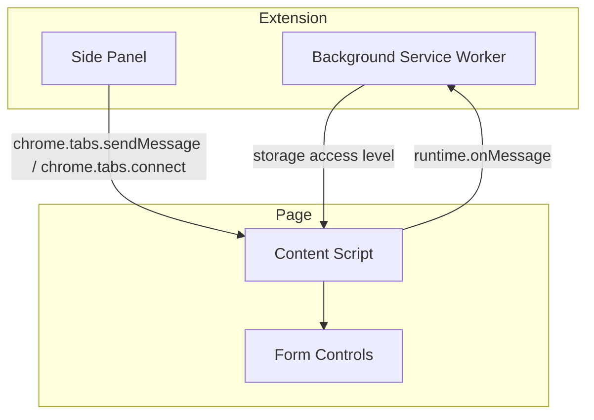
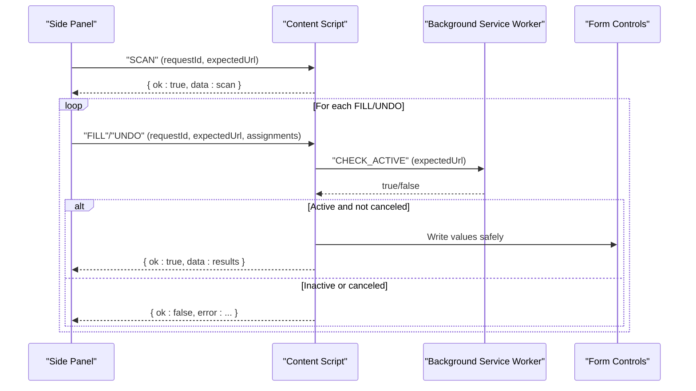
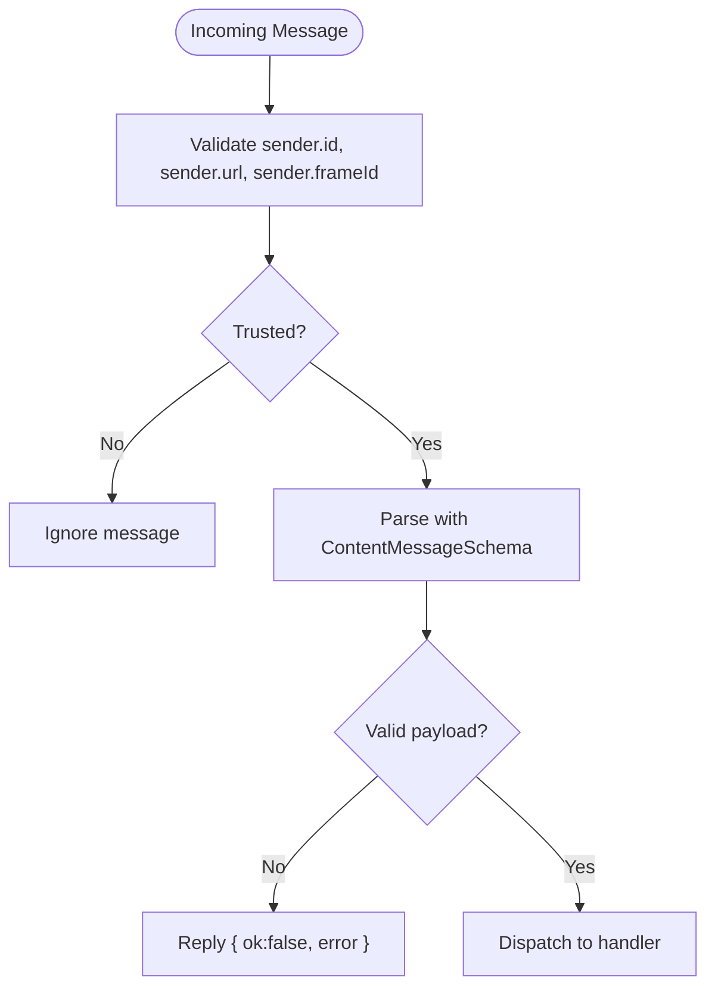
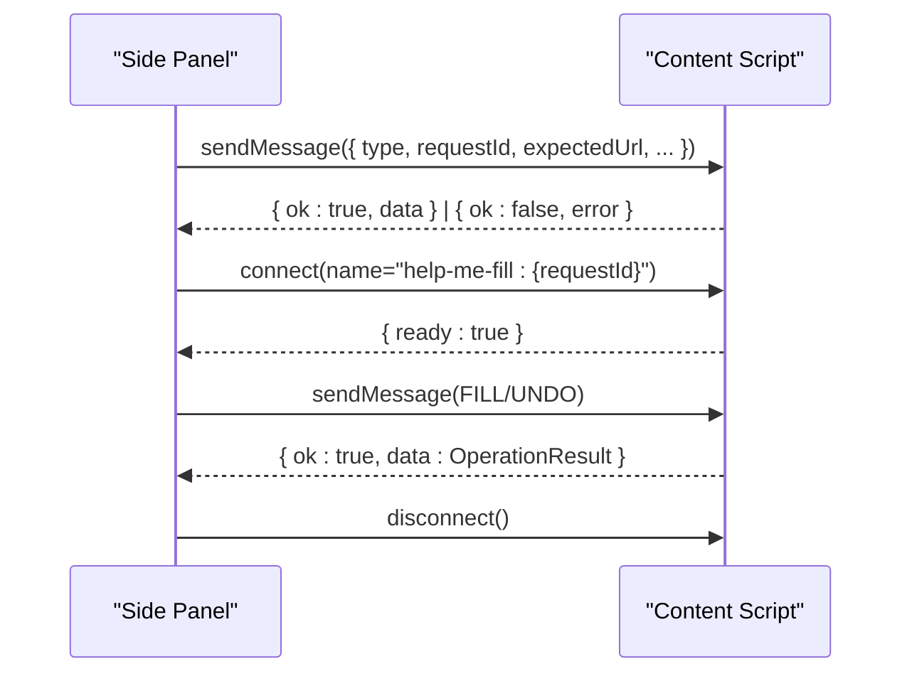
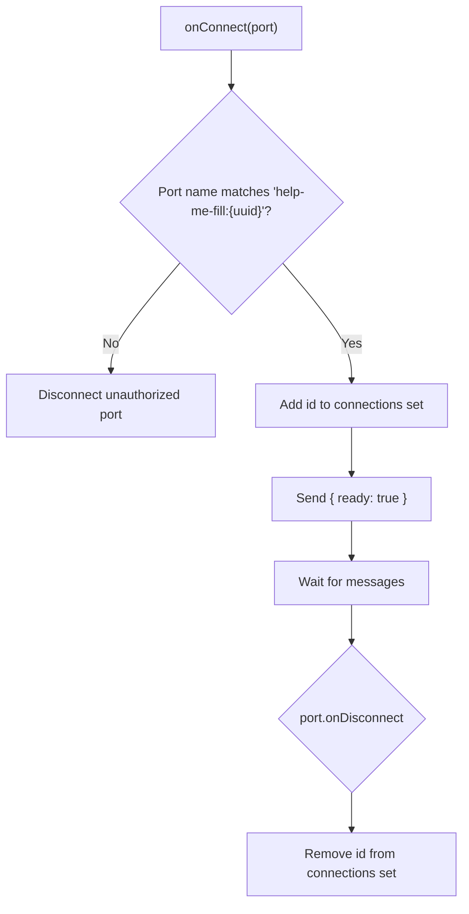
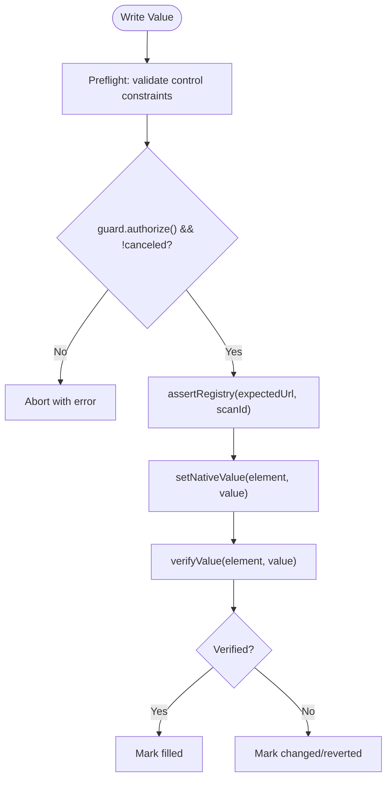
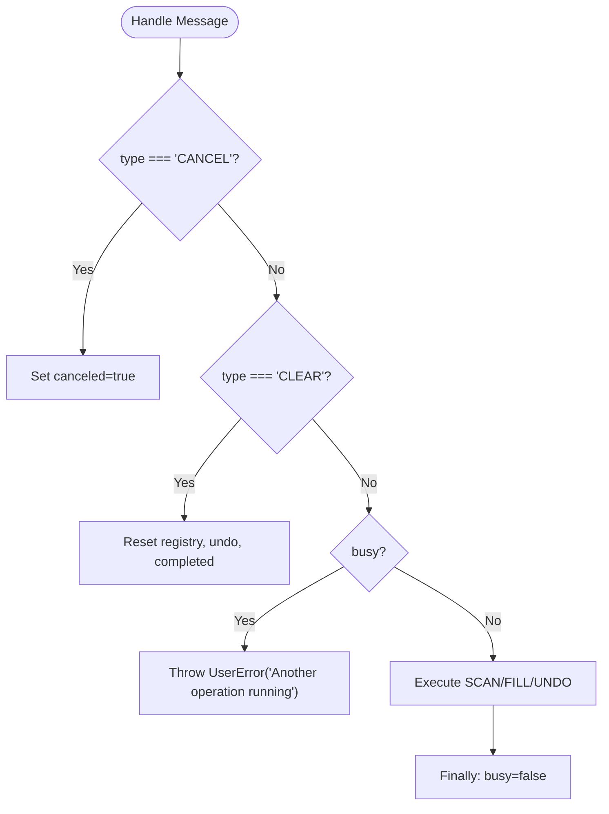
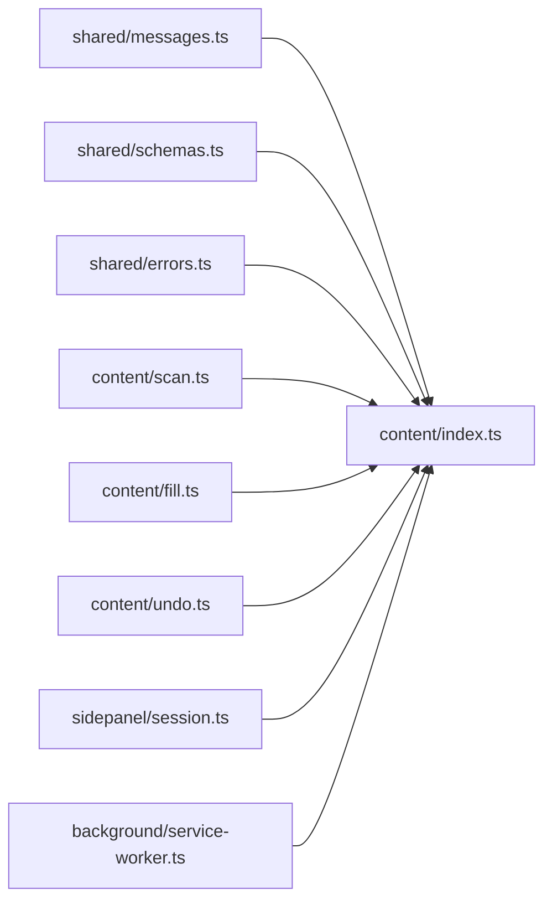

# Security & Communication Layer

<cite>
**Referenced Files in This Document**
- [src/manifest.json](file://src/manifest.json)
- [src/background/service-worker.ts](file://src/background/service-worker.ts)
- [src/content/index.ts](file://src/content/index.ts)
- [src/content/fill.ts](file://src/content/fill.ts)
- [src/content/scan.ts](file://src/content/scan.ts)
- [src/content/undo.ts](file://src/content/undo.ts)
- [src/shared/messages.ts](file://src/shared/messages.ts)
- [src/shared/schemas.ts](file://src/shared/schemas.ts)
- [src/shared/errors.ts](file://src/shared/errors.ts)
- [src/sidepanel/session.ts](file://src/sidepanel/session.ts)
</cite>

## Table of Contents
1. [Introduction](#introduction)
2. [Project Structure](#project-structure)
3. [Core Components](#core-components)
4. [Architecture Overview](#architecture-overview)
5. [Detailed Component Analysis](#detailed-component-analysis)
6. [Dependency Analysis](#dependency-analysis)
7. [Performance Considerations](#performance-considerations)
8. [Troubleshooting Guide](#troubleshooting-guide)
9. [Conclusion](#conclusion)

## Introduction
This document explains the security layer and communication patterns between content scripts and extension components (background service worker and side panel). It focuses on:
- Trusted sender validation to ensure only authorized extension contexts can communicate with content scripts
- Message passing protocol using Chrome Extension messaging API, including request/response patterns and error handling
- Connection management that tracks active side panel connections and handles disconnections gracefully
- Security measures preventing XSS and ensuring data privacy during form interactions
- Busy state management to prevent concurrent operations and maintain stability

## Project Structure
The security and communication logic spans several modules:
- Background service worker: authorizes short-lived checks and configures storage access levels
- Content script: validates messages, enforces busy state, manages connections, and executes fill/undo safely
- Side panel session: orchestrates scanning, mapping, review, and execution while enforcing target activity and timeouts
- Shared schemas and messages: define strict message contracts and limits
- Manifest: defines permissions and CSP for secure execution

**Diagram sources**
- [src/background/service-worker.ts:1-29](file://src/background/service-worker.ts#L1-L29)
- [src/content/index.ts:1-72](file://src/content/index.ts#L1-L72)
- [src/sidepanel/session.ts:44-85](file://src/sidepanel/session.ts#L44-L85)
- [src/manifest.json:1-19](file://src/manifest.json#L1-L19)

**Section sources**
- [src/manifest.json:1-19](file://src/manifest.json#L1-L19)
- [src/background/service-worker.ts:1-29](file://src/background/service-worker.ts#L1-L29)
- [src/content/index.ts:1-72](file://src/content/index.ts#L1-L72)
- [src/sidepanel/session.ts:1-86](file://src/sidepanel/session.ts#L1-L86)

## Core Components
- Trusted sender validation: Ensures messages originate from trusted extension contexts and match expected URLs and frames
- Message schema validation: Uses Zod schemas to enforce structure and size limits for all inter-component messages
- Connection lifecycle: Establishes a port per operation, verifies readiness, and disconnects on completion or failure
- Busy guard: Prevents overlapping operations in the content script to avoid race conditions
- Execution guards: Re-checks tab activity and cancellation before each write to ensure safety

**Section sources**
- [src/content/index.ts:13-69](file://src/content/index.ts#L13-L69)
- [src/shared/messages.ts:1-20](file://src/shared/messages.ts#L1-L20)
- [src/shared/schemas.ts:1-39](file://src/shared/schemas.ts#L1-L39)
- [src/sidepanel/session.ts:44-85](file://src/sidepanel/session.ts#L44-L85)

## Architecture Overview
The system uses three main actors:
- Background service worker: Configures storage access and performs short-lived authorization checks
- Content script: Validates incoming messages, maintains busy/connection state, and executes safe writes
- Side panel: Initiates scans, reviews mappings, and drives fill/undo operations with timeouts and validations

**Diagram sources**
- [src/sidepanel/session.ts:55-85](file://src/sidepanel/session.ts#L55-L85)
- [src/content/index.ts:22-69](file://src/content/index.ts#L22-L69)
- [src/background/service-worker.ts:17-28](file://src/background/service-worker.ts#L17-L28)

## Detailed Component Analysis

### Trusted Sender Validation
- The content script validates every incoming message via a trusted sender check that ensures:
  - The sender is part of the same extension
  - The sender URL matches the side panel page
  - The sender is not associated with a tab context (to prevent injection from arbitrary tabs)
- Messages are parsed against a strict schema; invalid payloads receive an error reply without processing
- The background service worker further validates CHECK_ACTIVE requests by checking frame identity, tab presence, and matching expected URL

**Diagram sources**
- [src/content/index.ts:13-69](file://src/content/index.ts#L13-L69)
- [src/background/service-worker.ts:17-28](file://src/background/service-worker.ts#L17-L28)
- [src/shared/messages.ts:1-20](file://src/shared/messages.ts#L1-L20)

**Section sources**
- [src/content/index.ts:13-69](file://src/content/index.ts#L13-L69)
- [src/background/service-worker.ts:17-28](file://src/background/service-worker.ts#L17-L28)
- [src/shared/messages.ts:1-20](file://src/shared/messages.ts#L1-L20)

### Message Passing Protocol
- Request/Response pattern:
  - Side panel sends typed messages to the content script using chrome.tabs.sendMessage with a unique requestId
  - Content script responds with a standardized Reply envelope containing either data or an error string
- Connection-based handshake:
  - For FILL/UNDO, the side panel opens a port named with the requestId
  - The content script acknowledges readiness; if not acknowledged within a timeout, the operation fails
- Error handling:
  - All errors are normalized into user-friendly strings via errorMessage
  - Invalid messages return structured errors without side effects

**Diagram sources**
- [src/sidepanel/session.ts:48-85](file://src/sidepanel/session.ts#L48-L85)
- [src/content/index.ts:15-21](file://src/content/index.ts#L15-L21)
- [src/content/index.ts:54-69](file://src/content/index.ts#L54-L69)

**Section sources**
- [src/sidepanel/session.ts:48-85](file://src/sidepanel/session.ts#L48-L85)
- [src/content/index.ts:15-21](file://src/content/index.ts#L15-L21)
- [src/content/index.ts:54-69](file://src/content/index.ts#L54-L69)
- [src/shared/errors.ts:1-10](file://src/shared/errors.ts#L1-L10)

### Connection Management System
- Tracks active side panel connections per requestId:
  - A Set stores connection IDs derived from port names
  - Disconnection events remove entries automatically
- Enforces that operations require an active connection:
  - Before executing FILL/UNDO, the content script checks that the requestId’s connection exists
  - If missing, it aborts with a clear error indicating the review panel disconnected
- Graceful cleanup:
  - On page hide, all state is reset, including connections and completed tasks

**Diagram sources**
- [src/content/index.ts:15-21](file://src/content/index.ts#L15-L21)
- [src/content/index.ts:32-36](file://src/content/index.ts#L32-L36)
- [src/content/index.ts:70-71](file://src/content/index.ts#L70-L71)

**Section sources**
- [src/content/index.ts:15-21](file://src/content/index.ts#L15-L21)
- [src/content/index.ts:32-36](file://src/content/index.ts#L32-L36)
- [src/content/index.ts:70-71](file://src/content/index.ts#L70-L71)

### Security Measures Against XSS and Data Privacy
- Strict content security policy:
  - CSP restricts script sources to self and disables object-src to mitigate XSS risks in extension pages
- Input validation and sanitization:
  - All messages validated with Zod schemas; sizes limited to prevent abuse
  - Field descriptors exclude sensitive controls (passwords, OTPs, CVV, etc.) and unsupported types
- Safe value setting:
  - Values are written via native setters and verified through multiple checks to ensure they persist correctly
  - Control validity and normalization are checked before writing
- Target integrity:
  - Registry assertions verify that the page URL, scan ID, and field signatures remain unchanged during operations
  - Activity checks ensure the target tab remains active and unchanged

**Diagram sources**
- [src/content/fill.ts:8-26](file://src/content/fill.ts#L8-L26)
- [src/content/fill.ts:28-41](file://src/content/fill.ts#L28-L41)
- [src/content/fill.ts:42-81](file://src/content/fill.ts#L42-L81)
- [src/content/scan.ts:47-57](file://src/content/scan.ts#L47-L57)
- [src/content/scan.ts:77-87](file://src/content/scan.ts#L77-L87)
- [src/manifest.json:17-17](file://src/manifest.json#L17-L17)

**Section sources**
- [src/manifest.json:17-17](file://src/manifest.json#L17-L17)
- [src/content/fill.ts:8-26](file://src/content/fill.ts#L8-L26)
- [src/content/fill.ts:28-41](file://src/content/fill.ts#L28-L41)
- [src/content/fill.ts:42-81](file://src/content/fill.ts#L42-L81)
- [src/content/scan.ts:47-57](file://src/content/scan.ts#L47-L57)
- [src/content/scan.ts:77-87](file://src/content/scan.ts#L77-L87)

### Busy State Management
- Single-operation enforcement:
  - A busy flag prevents starting new operations until the current one completes or is canceled
- Cancellation support:
  - CANCEL and CLEAR messages reset state and stop ongoing work
- Completion cleanup:
  - Finally blocks ensure busy is cleared even on errors
- Concurrency protection:
  - Completed task map caps pending responses to prevent memory growth

**Diagram sources**
- [src/content/index.ts:22-53](file://src/content/index.ts#L22-L53)

**Section sources**
- [src/content/index.ts:22-53](file://src/content/index.ts#L22-L53)

## Dependency Analysis
- Content script depends on:
  - Shared messages and schemas for validation
  - Scan module for registry creation and integrity checks
  - Fill/Undo modules for safe value manipulation
  - Errors module for consistent error formatting
- Side panel depends on:
  - Session utilities for sending messages and managing ports
  - Schemas for parsing results and plans
- Background service worker depends on:
  - Storage APIs to set access levels
  - Tabs API to verify active tab and URL

**Diagram sources**
- [src/content/index.ts:1-6](file://src/content/index.ts#L1-L6)
- [src/sidepanel/session.ts:1-5](file://src/sidepanel/session.ts#L1-L5)
- [src/background/service-worker.ts:1-29](file://src/background/service-worker.ts#L1-L29)

**Section sources**
- [src/content/index.ts:1-6](file://src/content/index.ts#L1-L6)
- [src/sidepanel/session.ts:1-5](file://src/sidepanel/session.ts#L1-L5)
- [src/background/service-worker.ts:1-29](file://src/background/service-worker.ts#L1-L29)

## Performance Considerations
- Limiting fields and response sizes via shared schemas reduces memory usage and network overhead
- Preflight validation avoids partial writes when later assignments are invalid
- Verification loops use short delays to confirm persistence without blocking excessively
- Port timeouts prevent hanging operations when the content script does not acknowledge

[No sources needed since this section provides general guidance]

## Troubleshooting Guide
Common issues and their causes:
- Invalid extension message: Payload failed schema validation; ensure correct message shape and limits
- Page changed during operation: Registry assertions detect URL, scanId, or field signature changes; re-scan and review
- Target tab inactive or changed: CHECK_ACTIVE returns false; ensure the tab remains active and matches expected URL
- Review panel disconnected: Missing connection for requestId; reconnect and retry
- Busy operation: Another operation still running; wait or cancel/clear first

**Section sources**
- [src/content/index.ts:22-69](file://src/content/index.ts#L22-L69)
- [src/sidepanel/session.ts:44-85](file://src/sidepanel/session.ts#L44-L85)
- [src/shared/errors.ts:1-10](file://src/shared/errors.ts#L1-L10)

## Conclusion
The security and communication layer combines strict sender validation, schema-driven message contracts, connection-aware execution, and robust integrity checks to ensure safe and stable form filling. Busy state management and activity guards prevent race conditions and protect users from unintended modifications. Together, these mechanisms provide a resilient foundation for cross-extension communication while mitigating XSS risks and preserving data privacy.