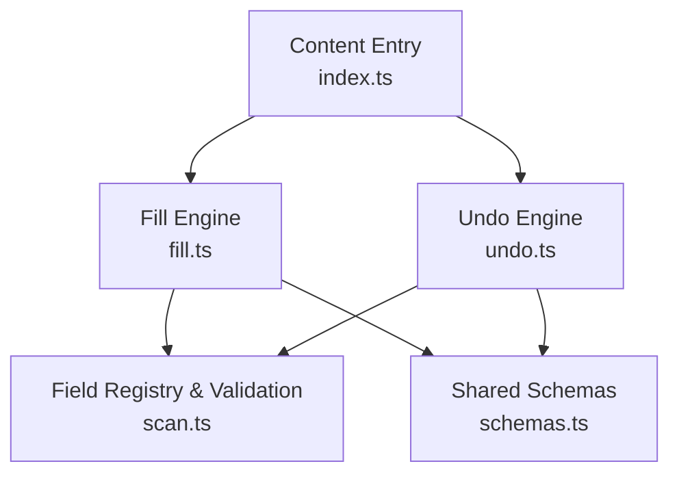
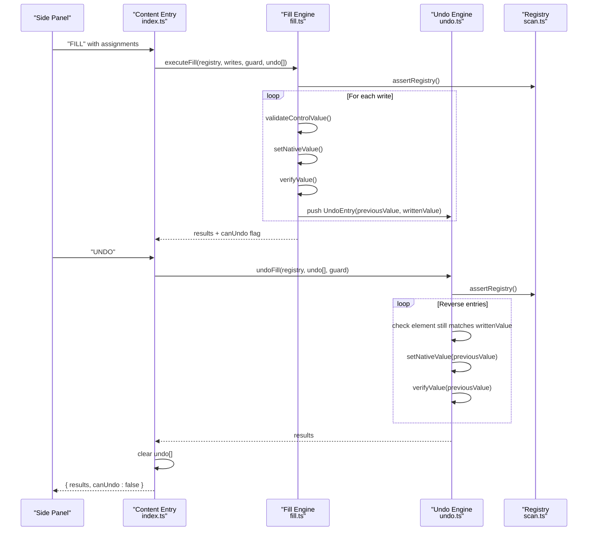
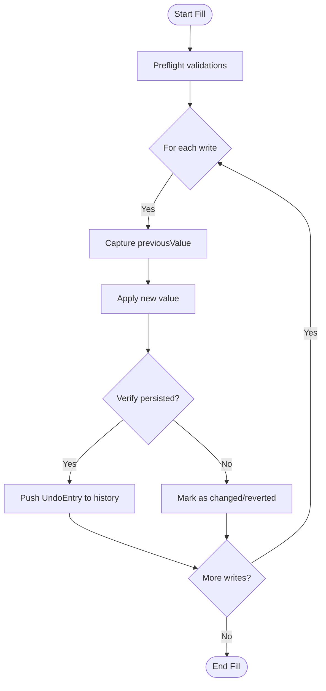
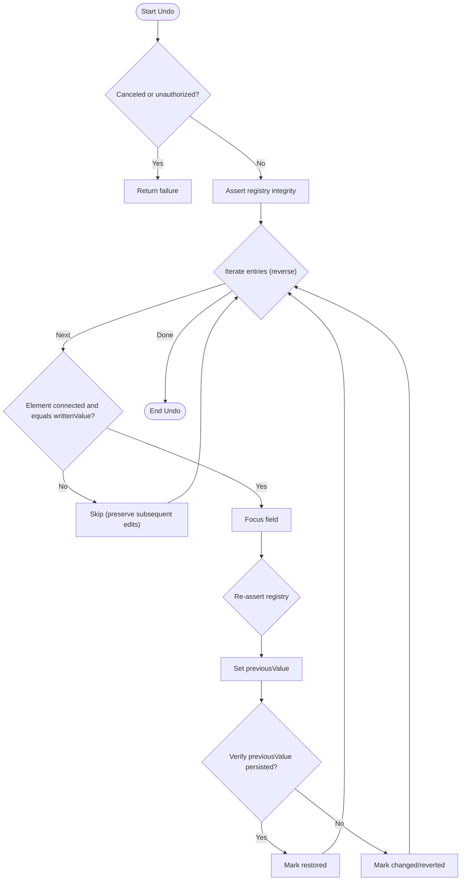
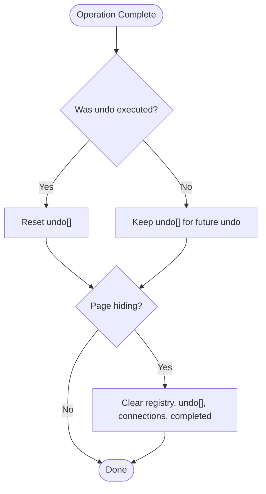
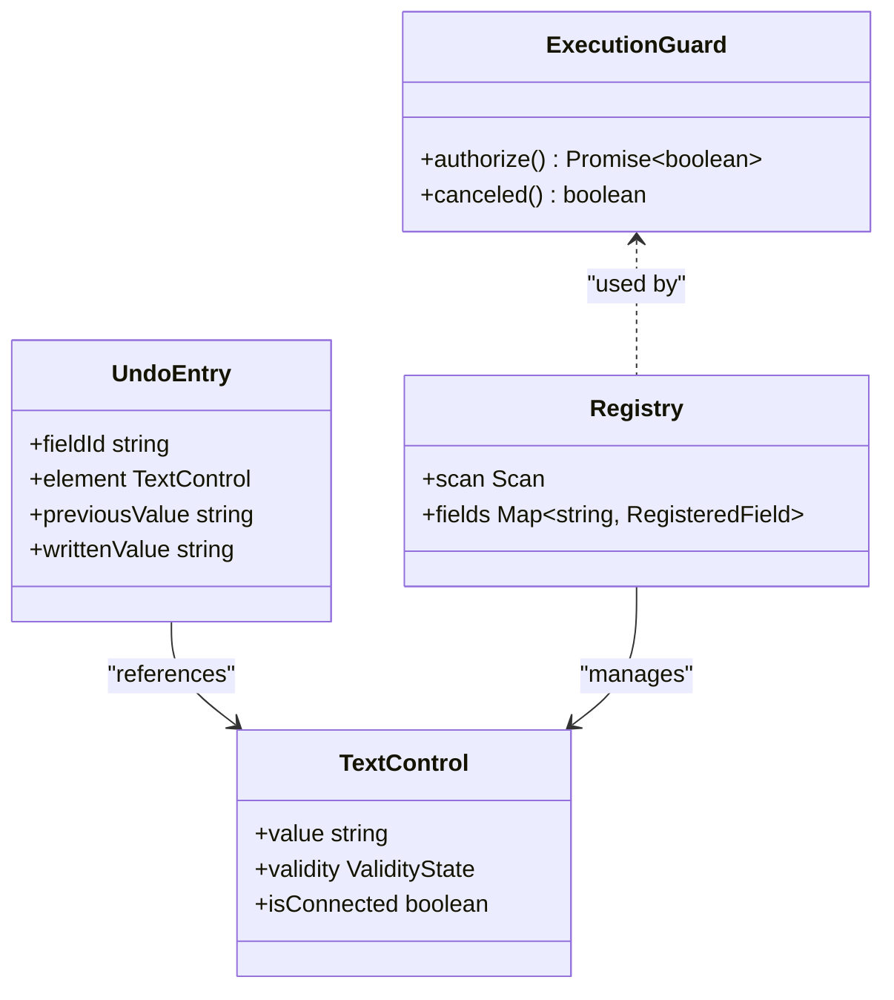
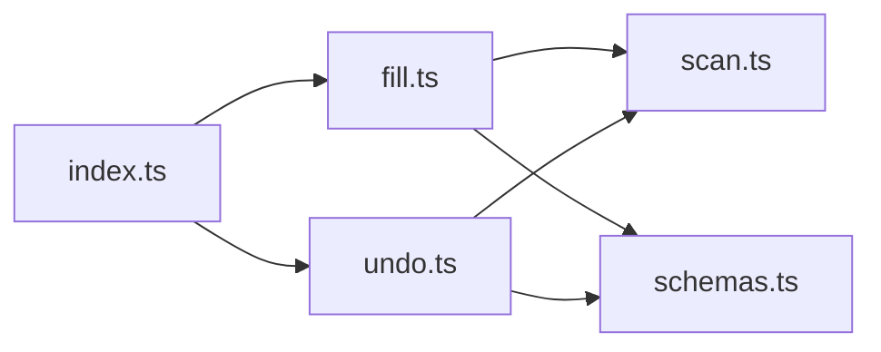

# Undo System Architecture

<cite>
**Referenced Files in This Document**
- [fill.ts](file://src/content/fill.ts)
- [undo.ts](file://src/content/undo.ts)
- [index.ts](file://src/content/index.ts)
- [scan.ts](file://src/content/scan.ts)
- [schemas.ts](file://src/shared/schemas.ts)
- [filler.test.ts](file://tests/integration/filler.test.ts)
</cite>

## Table of Contents
1. [Introduction](#introduction)
2. [Project Structure](#project-structure)
3. [Core Components](#core-components)
4. [Architecture Overview](#architecture-overview)
5. [Detailed Component Analysis](#detailed-component-analysis)
6. [Dependency Analysis](#dependency-analysis)
7. [Performance Considerations](#performance-considerations)
8. [Troubleshooting Guide](#troubleshooting-guide)
9. [Conclusion](#conclusion)

## Introduction
This document explains the undo system that preserves original form states and enables reverting changes. It focuses on how snapshots are captured before modifications, how a history stack is maintained for rollback operations, and how cleanup ensures memory safety after successful operations. It also covers edge cases such as dynamically added fields and concurrent modifications.

## Project Structure
The undo system spans several modules:
- Content script entrypoint orchestrates scanning, filling, and undoing while managing lifecycle and concurrency.
- Fill module captures snapshots and performs writes with verification.
- Undo module restores previous values safely.
- Scan module provides field descriptors and validation helpers to ensure the page has not changed unexpectedly.
- Shared schemas define result types and limits.

**Diagram sources**
- [index.ts:22-52](file://src/content/index.ts#L22-L52)
- [fill.ts:42-81](file://src/content/fill.ts#L42-L81)
- [undo.ts:6-28](file://src/content/undo.ts#L6-L28)
- [scan.ts:62-87](file://src/content/scan.ts#L62-L87)
- [schemas.ts:33-38](file://src/shared/schemas.ts#L33-L38)

**Section sources**
- [index.ts:22-52](file://src/content/index.ts#L22-L52)
- [fill.ts:42-81](file://src/content/fill.ts#L42-L81)
- [undo.ts:6-28](file://src/content/undo.ts#L6-L28)
- [scan.ts:62-87](file://src/content/scan.ts#L62-L87)
- [schemas.ts:33-38](file://src/shared/schemas.ts#L33-L38)

## Core Components
- UndoEntry structure: Captures the field identity, DOM element reference, original value, and the value written by the fill operation.
- ExecutionGuard: Ensures operations remain authorized and not canceled during execution.
- Snapshot mechanism: Before each write, the current field value is recorded into an UndoEntry so it can be restored later.
- History stack: An array of UndoEntry entries accumulates per-fill operations; cleared after undo completes.
- Cleanup process: After a successful undo, the history stack is reset to free memory and prevent stale references.

Key responsibilities:
- Capture: Record previousValue and writtenValue when a field is modified.
- Verify: Confirm that the written value persisted through asynchronous effects.
- Restore: Revert to previousValue only if the field remains unchanged since the write.
- Guard: Abort or skip operations if the page state changes or user cancels.

**Section sources**
- [fill.ts:6-7](file://src/content/fill.ts#L6-L7)
- [fill.ts:42-81](file://src/content/fill.ts#L42-L81)
- [undo.ts:6-28](file://src/content/undo.ts#L6-L28)
- [index.ts:10-10](file://src/content/index.ts#L10-L10)
- [index.ts:43-51](file://src/content/index.ts#L43-L51)

## Architecture Overview
The undo system integrates with the content script’s message handling pipeline. Scanning produces a registry snapshot used for both filling and undoing. The fill engine records undo entries as it writes values. The undo engine iterates these entries in reverse order to restore original values, skipping any that have been altered by subsequent user edits or page logic.

**Diagram sources**
- [index.ts:22-52](file://src/content/index.ts#L22-L52)
- [fill.ts:42-81](file://src/content/fill.ts#L42-L81)
- [undo.ts:6-28](file://src/content/undo.ts#L6-L28)
- [scan.ts:77-87](file://src/content/scan.ts#L77-L87)

## Detailed Component Analysis

### UndoEntry Structure and Tracking
- fieldId: Stable identifier for the target field from the scan registry.
- element: Direct reference to the DOM control being modified.
- previousValue: Value captured before modification (snapshot).
- writtenValue: Value applied by the fill operation; used to detect subsequent changes.

This structure enables precise restoration by matching the same element and verifying it has not been edited since the write.

**Section sources**
- [fill.ts:6-6](file://src/content/fill.ts#L6-L6)
- [schemas.ts:33-38](file://src/shared/schemas.ts#L33-L38)

### Snapshot Mechanism and History Stack
- During filling, before applying a new value, the current field value is recorded as previousValue.
- Each successful write pushes an UndoEntry onto the undo array.
- The history stack persists across multiple writes within one operation, enabling batched undo.

**Diagram sources**
- [fill.ts:42-81](file://src/content/fill.ts#L42-L81)

**Section sources**
- [fill.ts:42-81](file://src/content/fill.ts#L42-L81)

### Undo Operation Flow
- Undo iterates entries in reverse order to restore original values.
- For each entry:
  - Asserts registry integrity (URL, scan ID, and form structure).
  - Skips if the element was disconnected or its current value differs from the writtenValue (indicating a subsequent edit).
  - Restores previousValue using native setter and verifies persistence.
  - Records status per field: restored, changed/reverted, skipped, or failed.

**Diagram sources**
- [undo.ts:6-28](file://src/content/undo.ts#L6-L28)
- [scan.ts:77-87](file://src/content/scan.ts#L77-L87)

**Section sources**
- [undo.ts:6-28](file://src/content/undo.ts#L6-L28)
- [scan.ts:77-87](file://src/content/scan.ts#L77-L87)

### Cleanup Process and Memory Management
- After a successful undo, the undo array is cleared to release references to DOM elements and strings, preventing memory leaks.
- On page hide or CLEAR messages, all state including registry and undo history is reset.
- Completed task map is bounded to avoid unbounded growth.

**Diagram sources**
- [index.ts:43-51](file://src/content/index.ts#L43-L51)
- [index.ts:23-24](file://src/content/index.ts#L23-L24)
- [index.ts:62-65](file://src/content/index.ts#L62-L65)
- [index.ts:70-70](file://src/content/index.ts#L70-L70)

**Section sources**
- [index.ts:43-51](file://src/content/index.ts#L43-L51)
- [index.ts:23-24](file://src/content/index.ts#L23-L24)
- [index.ts:62-65](file://src/content/index.ts#L62-L65)
- [index.ts:70-70](file://src/content/index.ts#L70-L70)

### Edge Cases and Concurrency Handling
- Concurrent modifications:
  - ExecutionGuard checks cancellation and tab authorization between steps to abort mid-operation safely.
  - Registry assertions detect URL changes, scan ID mismatches, and structural changes to the form.
- Dynamically added fields:
  - assertRegistry compares current eligible controls against the scanned set; additions invalidate the operation to prevent inconsistent state.
- Subsequent user edits:
  - Undo skips entries whose current value no longer matches the writtenValue, preserving user edits.
- Controlled inputs and side effects:
  - Verification waits for async rendering and re-checks validity to detect pages that revert or normalize values.

**Diagram sources**
- [fill.ts:6-7](file://src/content/fill.ts#L6-L7)
- [scan.ts:4-6](file://src/content/scan.ts#L4-L6)
- [fill.ts:42-81](file://src/content/fill.ts#L42-L81)
- [undo.ts:6-28](file://src/content/undo.ts#L6-L28)

**Section sources**
- [index.ts:34-40](file://src/content/index.ts#L34-L40)
- [scan.ts:77-87](file://src/content/scan.ts#L77-L87)
- [undo.ts:12-21](file://src/content/undo.ts#L12-L21)

## Dependency Analysis
- fill.ts depends on scan.ts for registry assertions and type definitions, and on shared schemas for result types.
- undo.ts depends on fill.ts utilities (setNativeValue, verifyValue) and scan.ts for registry assertions.
- index.ts coordinates messaging, lifecycle, and state management, invoking fill.ts and undo.ts based on incoming messages.

**Diagram sources**
- [index.ts:2-4](file://src/content/index.ts#L2-L4)
- [fill.ts:1-4](file://src/content/fill.ts#L1-L4)
- [undo.ts:1-3](file://src/content/undo.ts#L1-L3)
- [schemas.ts:33-38](file://src/shared/schemas.ts#L33-L38)

**Section sources**
- [index.ts:2-4](file://src/content/index.ts#L2-L4)
- [fill.ts:1-4](file://src/content/fill.ts#L1-L4)
- [undo.ts:1-3](file://src/content/undo.ts#L1-L3)
- [schemas.ts:33-38](file://src/shared/schemas.ts#L33-L38)

## Performance Considerations
- Minimal overhead: Snapshots capture only necessary metadata (previousValue and writtenValue) per field.
- Verification delays: Short waits ensure asynchronous UI updates settle before marking success or failure.
- Bounded queues: Completed tasks are capped to prevent memory growth under high-frequency calls.
- Early exits: Guards and registry assertions fail fast when conditions change, avoiding unnecessary work.

[No sources needed since this section provides general guidance]

## Troubleshooting Guide
Common issues and their causes:
- Field changed during filling:
  - Cause: User or page modified the field after review but before writing.
  - Resolution: Re-scan and re-review to refresh the registry snapshot.
- Target changed on focus:
  - Cause: Focus handlers replaced or altered the control synchronously.
  - Resolution: Ensure stable focus behavior; re-scan if the control was replaced.
- Undo skipped due to subsequent edits:
  - Cause: User edited the field after the fill operation.
  - Resolution: Accept that user edits are preserved; re-run fill if you need to overwrite again.
- Undo failed due to page-side effects:
  - Cause: The page did not retain the previous value after restoration.
  - Resolution: Inspect event listeners or controlled components that may override values.

Operational safeguards:
- ExecutionGuard prevents operations when canceled or unauthorized.
- Registry assertions enforce URL, scan ID, and structural consistency.

**Section sources**
- [fill.ts:59-73](file://src/content/fill.ts#L59-L73)
- [undo.ts:12-24](file://src/content/undo.ts#L12-L24)
- [scan.ts:77-87](file://src/content/scan.ts#L77-L87)

## Conclusion
The undo system reliably preserves original form states by capturing snapshots before modifications and maintaining a per-operation history stack. It uses robust guards and registry assertions to handle dynamic changes and concurrent modifications gracefully. After undo, cleanup resets state to manage memory usage effectively. Tests demonstrate correct behavior for typical scenarios and edge cases, ensuring safe and predictable undo semantics.