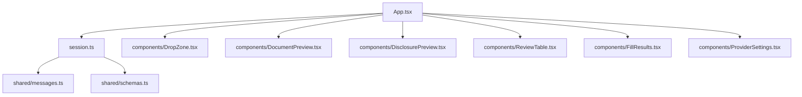
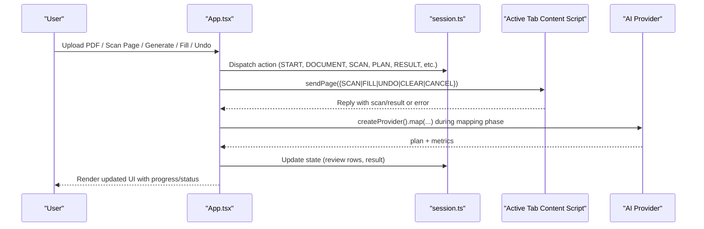
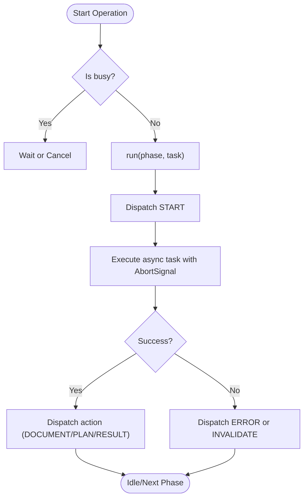
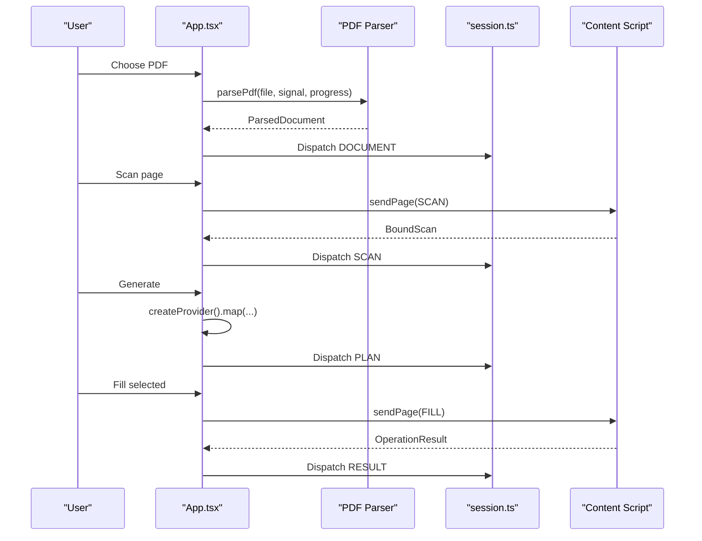
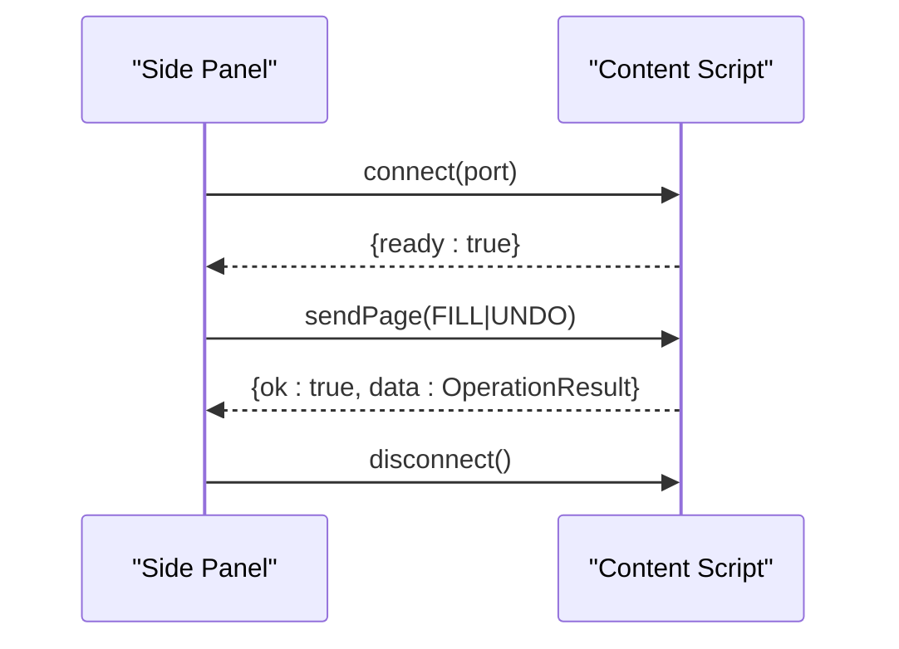
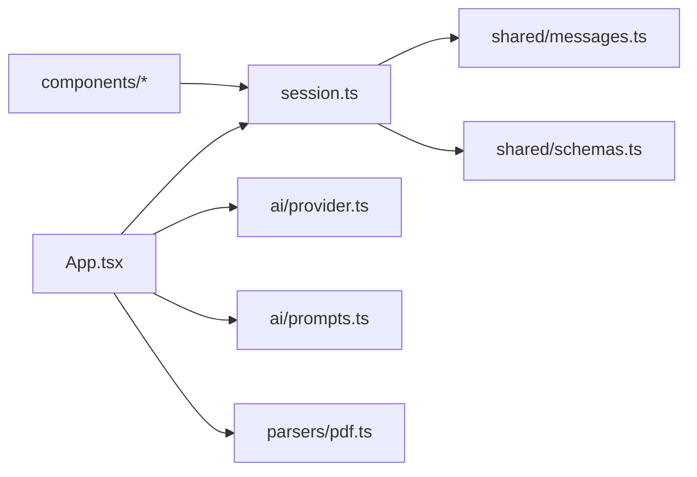

# Side Panel UI System

<cite>
**Referenced Files in This Document**
- [App.tsx](file://src/sidepanel/App.tsx)
- [session.ts](file://src/sidepanel/session.ts)
- [main.tsx](file://src/sidepanel/main.tsx)
- [styles.css](file://src/sidepanel/styles.css)
- [DropZone.tsx](file://src/sidepanel/components/DropZone.tsx)
- [DocumentPreview.tsx](file://src/sidepanel/components/DocumentPreview.tsx)
- [DisclosurePreview.tsx](file://src/sidepanel/components/DisclosurePreview.tsx)
- [ReviewTable.tsx](file://src/sidepanel/components/ReviewTable.tsx)
- [FillResults.tsx](file://src/sidepanel/components/FillResults.tsx)
- [ProviderSettings.tsx](file://src/sidepanel/components/ProviderSettings.tsx)
- [messages.ts](file://src/shared/messages.ts)
- [schemas.ts](file://src/shared/schemas.ts)
</cite>

## Table of Contents
1. Introduction
2. Project Structure
3. Core Components
4. Architecture Overview
5. Detailed Component Analysis
6. Dependency Analysis
7. Performance Considerations
8. Troubleshooting Guide
9. Conclusion

## Introduction
This document explains the React-based side panel user interface for a browser extension that helps fill web forms using PDF documents and AI-assisted mapping. It covers session state management, component hierarchy, user interaction patterns (PDF upload, form scanning, AI mapping review, selective field filling), responsive design and accessibility features, and how the UI synchronizes with background processes and content scripts while providing real-time feedback.

## Project Structure
The side panel is a React application mounted into the extension’s side panel page. The App orchestrates the workflow using a reducer-driven session state, communicates with the active tab via content scripts, and renders focused UI components for each stage: upload, scan, review, and fill.

**Diagram sources**
- [App.tsx:1-127](file://src/sidepanel/App.tsx#L1-L127)
- [session.ts:1-86](file://src/sidepanel/session.ts#L1-L86)
- [messages.ts:1-20](file://src/shared/messages.ts#L1-L20)
- [schemas.ts:1-39](file://src/shared/schemas.ts#L1-L39)

**Section sources**
- [App.tsx:1-127](file://src/sidepanel/App.tsx#L1-L127)
- [main.tsx:1-15](file://src/sidepanel/main.tsx#L1-L15)
- [styles.css:1-73](file://src/sidepanel/styles.css#L1-L73)

## Core Components
- App: Central controller managing lifecycle, phase transitions, error handling, and coordination between UI and background/content scripts.
- Session manager (session.ts): Defines phases, actions, and reducer logic; provides utilities to communicate with the active tab and enforce safety checks.
- Provider settings: Configures the LLM provider, model, and API key; manages permissions and session storage.
- DropZone: Accepts a single PDF file via drag-and-drop or file picker.
- DocumentPreview: Shows parsed document metadata and extracted text lines.
- DisclosurePreview: Presents outgoing data preview and mapping instructions before sending to the provider.
- ReviewTable: Displays AI-generated mapping suggestions with evidence, manual overrides, overwrite protection, and selection controls.
- FillResults: Reports per-field outcomes and offers undo if supported.

Key responsibilities:
- Phase gating: parsing → ready → mapping → review → filling → complete (or undoing).
- Real-time progress and cancellation during long-running tasks.
- Synchronization with the active tab to ensure the target page has not changed.
- Validation and limits enforcement through shared schemas.

**Section sources**
- [App.tsx:15-127](file://src/sidepanel/App.tsx#L15-L127)
- [session.ts:6-86](file://src/sidepanel/session.ts#L6-L86)
- [ProviderSettings.tsx:1-70](file://src/sidepanel/components/ProviderSettings.tsx#L1-L70)
- [DropZone.tsx:1-21](file://src/sidepanel/components/DropZone.tsx#L1-L21)
- [DocumentPreview.tsx:1-9](file://src/sidepanel/components/DocumentPreview.tsx#L1-L9)
- [DisclosurePreview.tsx:1-19](file://src/sidepanel/components/DisclosurePreview.tsx#L1-L19)
- [ReviewTable.tsx:1-30](file://src/sidepanel/components/ReviewTable.tsx#L1-L30)
- [FillResults.tsx:1-13](file://src/sidepanel/components/FillResults.tsx#L1-L13)

## Architecture Overview
The side panel uses a unidirectional data flow driven by a reducer. User actions dispatch actions that transition the session phase and update UI state. Long-running operations are wrapped with an abort controller to support cancellation and epoch-based staleness guards.

**Diagram sources**
- [App.tsx:50-107](file://src/sidepanel/App.tsx#L50-L107)
- [session.ts:44-85](file://src/sidepanel/session.ts#L44-L85)
- [messages.ts:1-20](file://src/shared/messages.ts#L1-L20)

## Detailed Component Analysis

### Session State Management
- Phases: idle, parsing, scanning, ready, mapping, review, filling, complete, undoing.
- Actions: RESET, START, PROGRESS, DOCUMENT, SCAN, PLAN, ROW, SELECT_ALL, RESULT, ERROR, INVALIDATE, PROVIDER_CHANGED.
- Reducer behavior:
  - Resets on invalidation or provider changes.
  - Builds review rows from AI plan with defaults (selected=false, allowOverwrite=false, manual=false).
  - Select-all respects overwrite constraints and existing values.
  - Errors revert to appropriate phase based on context.
- Utilities:
  - assertActive ensures the target tab/window/url remains unchanged before sensitive operations.
  - sendPage sends messages to the content script with typed validation.
  - scanActivePage injects content script, validates permissions, and returns a bound scan tied to the current tab.
  - executeOnPage establishes a port handshake with the content script before executing FILL/UNDO.

**Diagram sources**
- [App.tsx:50-63](file://src/sidepanel/App.tsx#L50-L63)
- [session.ts:26-42](file://src/sidepanel/session.ts#L26-L42)

**Section sources**
- [session.ts:6-86](file://src/sidepanel/session.ts#L6-L86)
- [App.tsx:50-107](file://src/sidepanel/App.tsx#L50-L107)

### App Component Workflow
- Upload: Parses PDF locally, updates document, moves to ready.
- Scan: Injects content script, scans top-frame fields, binds scan to target.
- Generate: Validates provider permission, calls provider mapping with compacted fields and document lines, transitions to review.
- Fill: Sends assignments to content script, shows results, supports undo if available.
- Undo: Restores previous values via content script.
- Cancel: Aborts ongoing work and notifies content script to cancel.
- Reset: Clears session state and storage keys.

**Diagram sources**
- [App.tsx:64-107](file://src/sidepanel/App.tsx#L64-L107)
- [session.ts:55-85](file://src/sidepanel/session.ts#L55-L85)

**Section sources**
- [App.tsx:64-127](file://src/sidepanel/App.tsx#L64-L127)

### UI Components and Interaction Patterns

#### DropZone
- Accepts one PDF via drag-and-drop or file picker.
- Enforces single-file constraint and displays errors.
- Disabled during busy phases.

**Section sources**
- [DropZone.tsx:1-21](file://src/sidepanel/components/DropZone.tsx#L1-L21)

#### DocumentPreview
- Shows filename, page count, character count, and extracted text lines.
- Supports inspecting reading order and source accuracy.

**Section sources**
- [DocumentPreview.tsx:1-9](file://src/sidepanel/components/DocumentPreview.tsx#L1-L9)

#### DisclosurePreview
- Informs users about what data leaves the browser (extracted lines and field metadata).
- Provides a preview of the payload and mapping instructions.
- Requires provider configuration before enabling generation.

**Section sources**
- [DisclosurePreview.tsx:1-19](file://src/sidepanel/components/DisclosurePreview.tsx#L1-L19)

#### ReviewTable
- Lists AI suggestions with evidence blocks and reasons.
- Allows manual value edits and marks them as overrides.
- Protects overwriting existing values unless explicitly allowed.
- Supports select all/clear selection respecting constraints.
- Shows unmapped fields and their reasons.
- Displays metrics and warnings about potential side effects.

**Section sources**
- [ReviewTable.tsx:1-30](file://src/sidepanel/components/ReviewTable.tsx#L1-L30)

#### FillResults
- Summarizes per-field operation status and details.
- Offers undo when supported.
- Reminds users that verification is local and server-side effects cannot be reversed.

**Section sources**
- [FillResults.tsx:1-13](file://src/sidepanel/components/FillResults.tsx#L1-L13)

#### ProviderSettings
- Loads saved preferences and session-stored API keys.
- Requests host permissions for the chosen provider.
- Stores keys in session storage and preferences in local storage.
- Allows revoking permissions and removing keys.

**Section sources**
- [ProviderSettings.tsx:1-70](file://src/sidepanel/components/ProviderSettings.tsx#L1-L70)

### Responsive Design and Accessibility
- Responsive layout:
  - Base min-width and max-width constraints for readability.
  - Media query adjusts padding and layout for narrow screens.
  - Reduced motion preference disables animations and transitions.
- Accessibility:
  - Semantic headings and landmarks.
  - aria-labels on interactive regions and lists.
  - Focus-visible outlines for keyboard navigation.
  - Visually hidden inputs for file selection.
  - Status and alert roles for dynamic feedback.

**Section sources**
- [styles.css:1-73](file://src/sidepanel/styles.css#L1-L73)

### Background and Content Script Synchronization
- Message types: SCAN, FILL, UNDO, CLEAR, CANCEL with strict schemas.
- Reply envelope: ok/data or ok/error for consistent error handling.
- Port handshake: Before executing FILL/UNDO, the side panel connects to the content script and waits for a ready acknowledgment within a timeout.
- Safety checks:
  - assertActive verifies the target tab/window/url have not changed.
  - Permissions check for provider origins before making requests.
  - Limits enforced via shared schemas (bytes, pages, characters, fields, response size, value length).

**Diagram sources**
- [session.ts:71-85](file://src/sidepanel/session.ts#L71-L85)
- [messages.ts:1-20](file://src/shared/messages.ts#L1-L20)

**Section sources**
- [session.ts:44-85](file://src/sidepanel/session.ts#L44-L85)
- [messages.ts:1-20](file://src/shared/messages.ts#L1-L20)
- [schemas.ts:1-39](file://src/shared/schemas.ts#L1-L39)

## Dependency Analysis
- App depends on:
  - session.ts for state machine and communication helpers.
  - ai/provider and ai/prompts for mapping generation.
  - parsers/pdf for local extraction.
  - shared/errors for user-facing error formatting.
- session.ts depends on:
  - shared/schemas for type-safe message and data contracts.
  - shared/messages for message schema and reply types.
- Components depend on:
  - session.ts types for props and dispatch.
  - shared schemas for types like BoundScan and OperationResult.

**Diagram sources**
- [App.tsx:1-14](file://src/sidepanel/App.tsx#L1-L14)
- [session.ts:1-86](file://src/sidepanel/session.ts#L1-L86)
- [messages.ts:1-20](file://src/shared/messages.ts#L1-L20)
- [schemas.ts:1-39](file://src/shared/schemas.ts#L1-L39)

**Section sources**
- [App.tsx:1-14](file://src/sidepanel/App.tsx#L1-L14)
- [session.ts:1-86](file://src/sidepanel/session.ts#L1-L86)

## Performance Considerations
- Local PDF parsing reduces network overhead and preserves privacy.
- Compact field payloads minimize request size to providers.
- AbortController and epoch guards prevent stale updates and allow cancellation.
- Selective filling reduces unnecessary writes and potential side effects.
- Limits in schemas protect against oversized payloads and excessive iterations.

[No sources needed since this section provides general guidance]

## Troubleshooting Guide
Common issues and resolutions:
- Target tab/page changed mid-operation:
  - The app detects tab activation, URL changes, or tab closure and invalidates the session. Rescan and review again.
- Page access denied or restricted:
  - Ensure you clicked the toolbar icon on the intended page to grant access and that the page is HTTP(S).
- Connection lost:
  - If the content script connection drops, re-scan to re-establish communication.
- Missing provider permissions:
  - Enable the provider and accept host permissions; revoke and re-enable if necessary.
- Partial fills after failure:
  - Inspect the page for partial changes and use undo if available; otherwise rescan and retry.

**Section sources**
- [App.tsx:34-48](file://src/sidepanel/App.tsx#L34-L48)
- [session.ts:44-69](file://src/sidepanel/session.ts#L44-L69)
- [ProviderSettings.tsx:32-45](file://src/sidepanel/components/ProviderSettings.tsx#L32-L45)

## Conclusion
The side panel implements a robust, user-centric workflow that combines local PDF processing, AI-assisted mapping, and safe, reversible form filling. Its reducer-driven session state, strict messaging schemas, and active-tab synchronization ensure reliability and transparency. The UI emphasizes consent, evidence-backed suggestions, and user control, while responsive and accessible styles make it usable across devices and assistive technologies.