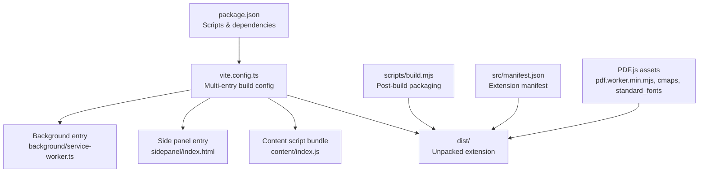
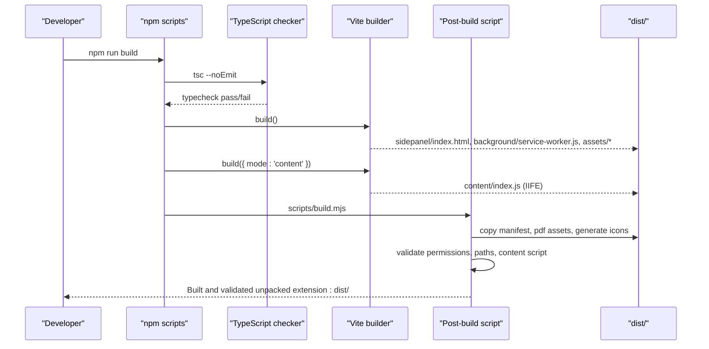
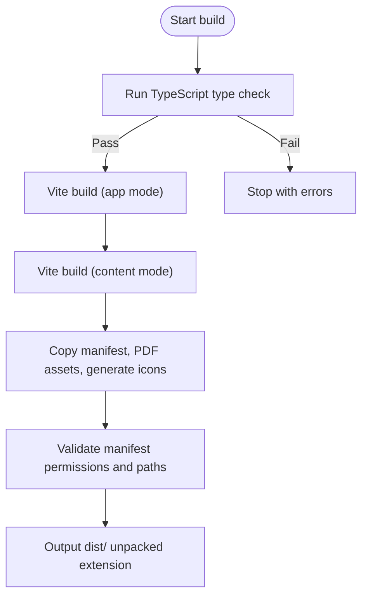
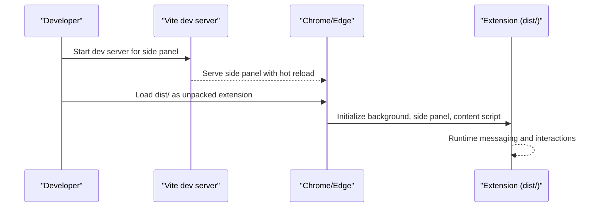
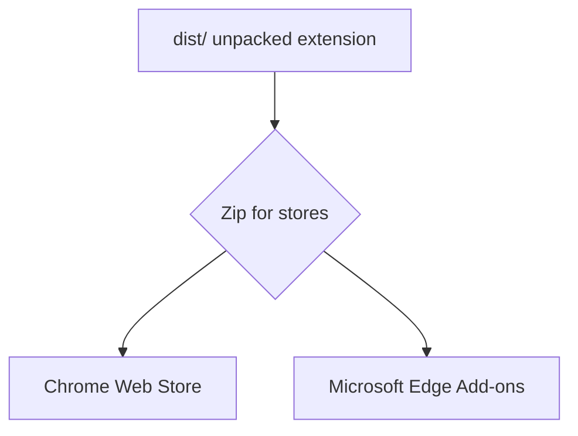
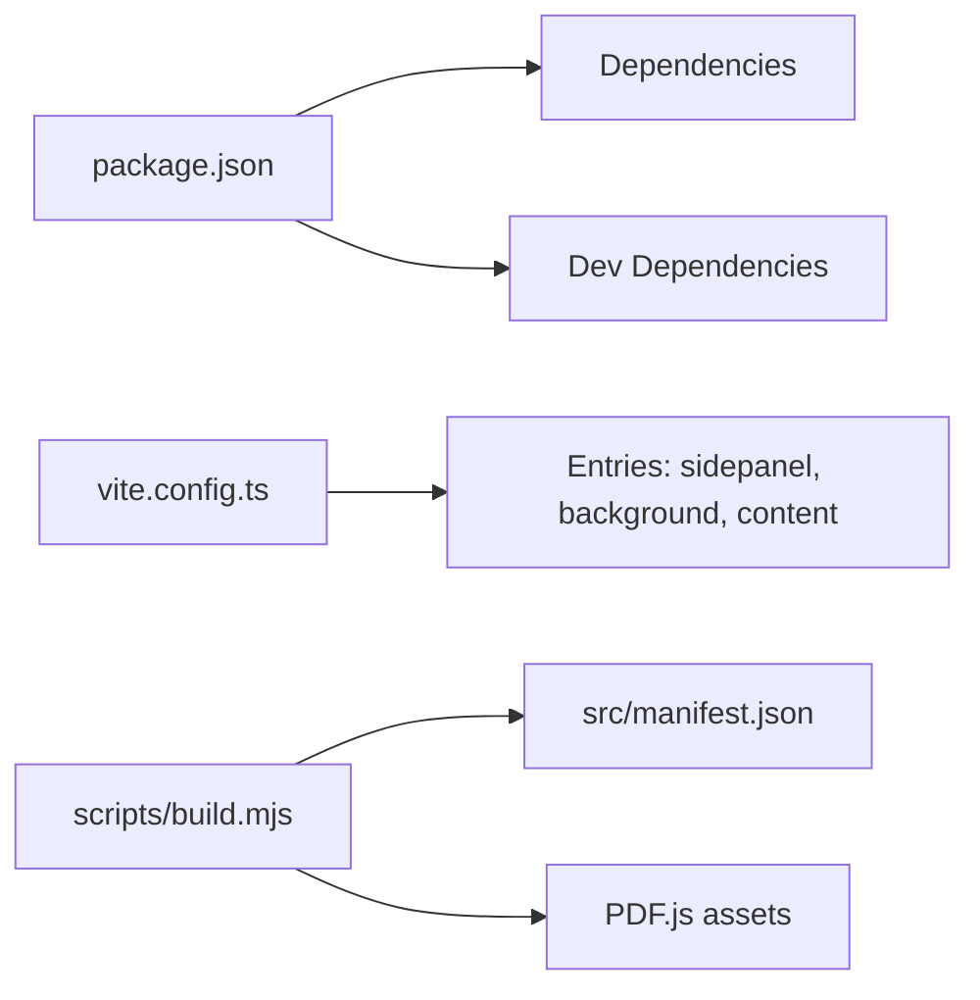

# Build and Deployment

<cite>
**Referenced Files in This Document**
- [package.json](file://package.json)
- [vite.config.ts](file://vite.config.ts)
- [tsconfig.json](file://tsconfig.json)
- [scripts/build.mjs](file://scripts/build.mjs)
- [src/manifest.json](file://src/manifest.json)
- [vitest.config.ts](file://vitest.config.ts)
- [playwright.config.ts](file://playwright.config.ts)
- [scripts/fixtures.mjs](file://scripts/fixtures.mjs)
- [scripts/serve-fixtures.mjs](file://scripts/serve-fixtures.mjs)
- [scripts/benchmark.mjs](file://scripts/benchmark.mjs)
- [src/content/index.ts](file://src/content/index.ts)
- [src/background/service-worker.ts](file://src/background/service-worker.ts)
- [src/sidepanel/main.tsx](file://src/sidepanel/main.tsx)
- [tests/fixtures/vite.config.ts](file://tests/fixtures/vite.config.ts)
</cite>

## Table of Contents
1. [Introduction](#introduction)
2. [Project Structure](#project-structure)
3. [Core Components](#core-components)
4. [Architecture Overview](#architecture-overview)
5. [Detailed Component Analysis](#detailed-component-analysis)
6. [Dependency Analysis](#dependency-analysis)
7. [Performance Considerations](#performance-considerations)
8. [Troubleshooting Guide](#troubleshooting-guide)
9. [Conclusion](#conclusion)
10. [Appendices](#appendices)

## Introduction
This document explains how to build, test, and distribute the Help Me Fill extension for Chrome Web Store and Microsoft Edge Add-ons. It covers development environment setup, Vite-based builds with TypeScript, asset bundling, optimization steps, local testing with hot reloading, debugging techniques, deployment procedures, version management, release processes, troubleshooting common issues, and performance tips for production builds.

## Project Structure
The project uses a modern Vite + TypeScript stack with separate outputs for:
- Side panel (React UI)
- Background service worker
- Content script bundle
- PDF.js assets required at runtime

**Diagram sources**
- [package.json:7-15](file://package.json#L7-L15)
- [vite.config.ts:5-22](file://vite.config.ts#L5-L22)
- [scripts/build.mjs:7-13](file://scripts/build.mjs#L7-L13)
- [src/manifest.json:1-18](file://src/manifest.json#L1-L18)

**Section sources**
- [package.json:1-38](file://package.json#L1-L38)
- [vite.config.ts:1-23](file://vite.config.ts#L1-L23)
- [scripts/build.mjs:1-62](file://scripts/build.mjs#L1-L62)
- [src/manifest.json:1-19](file://src/manifest.json#L1-L19)

## Core Components
- Build orchestration:
  - Type checking via TypeScript without emitting files
  - Vite builds side panel and background as multi-entry app
  - Separate content script library build using IIFE format
  - Post-build tasks copy manifest, PDF.js assets, generate icons, and validate output
- Manifest and permissions:
  - Manifest v3 with minimal permissions and optional host permissions for AI providers
- Testing:
  - Unit/integration tests with Vitest in jsdom
  - End-to-end tests with Playwright across Chrome and Edge
  - Fixture generation and local fixture server for tests

**Section sources**
- [package.json:7-15](file://package.json#L7-L15)
- [vite.config.ts:5-22](file://vite.config.ts#L5-L22)
- [scripts/build.mjs:7-62](file://scripts/build.mjs#L7-L62)
- [src/manifest.json:1-18](file://src/manifest.json#L1-L18)
- [vitest.config.ts:1-3](file://vitest.config.ts#L1-L3)
- [playwright.config.ts:1-14](file://playwright.config.ts#L1-L14)

## Architecture Overview
The build pipeline produces an unpacked extension directory suitable for distribution. The main flows are:

**Diagram sources**
- [package.json:7-15](file://package.json#L7-L15)
- [vite.config.ts:5-22](file://vite.config.ts#L5-L22)
- [scripts/build.mjs:7-62](file://scripts/build.mjs#L7-L62)

## Detailed Component Analysis

### Development Environment Setup
- Node.js version is enforced by package engines; use a compatible LTS or current release.
- Install dependencies with your preferred package manager.
- Ensure you have access to Chrome and Edge browsers for testing.

Key configuration highlights:
- TypeScript target ES2022 with strict mode and no emit during build.
- Vite configured for both app and content script modes.
- Tests use jsdom for unit/integration and Playwright for e2e.

**Section sources**
- [package.json:1-15](file://package.json#L1-L15)
- [tsconfig.json:1-18](file://tsconfig.json#L1-L18)
- [vitest.config.ts:1-3](file://vitest.config.ts#L1-L3)
- [playwright.config.ts:1-14](file://playwright.config.ts#L1-L14)

### Build Process Using Vite and TypeScript
- Type check first: ensures code correctness before building.
- App build:
  - Outputs side panel HTML and background service worker.
  - Uses React plugin for JSX support.
  - Emits hashed assets and a dedicated background entry.
- Content script build:
  - Produces a single IIFE bundle named content/index.js.
  - No public directory and no sourcemaps for this mode.
- Post-build packaging:
  - Copies manifest.json to dist/.
  - Copies PDF.js worker and resources into dist/pdf/.
  - Generates PNG icons programmatically for 16, 48, 128 sizes.
  - Validates manifest permissions and paths.
  - Ensures content script does not rely on dynamic imports.

**Diagram sources**
- [package.json:7-15](file://package.json#L7-L15)
- [vite.config.ts:5-22](file://vite.config.ts#L5-L22)
- [scripts/build.mjs:7-62](file://scripts/build.mjs#L7-L62)

**Section sources**
- [vite.config.ts:5-22](file://vite.config.ts#L5-L22)
- [scripts/build.mjs:7-62](file://scripts/build.mjs#L7-L62)

### Asset Bundling and Optimization
- Assets:
  - PDF.js worker and font maps are copied to dist/pdf/ for runtime loading.
  - Icons are generated as PNGs without external image tools.
- Optimization:
  - Production builds disable sourcemaps and target ES2022.
  - Content script is bundled as a classic IIFE to avoid module loading constraints.
  - Rollup options ensure stable filenames for background and hashed names for other chunks.

**Section sources**
- [scripts/build.mjs:9-13](file://scripts/build.mjs#L9-L13)
- [scripts/build.mjs:29-44](file://scripts/build.mjs#L29-L44)
- [vite.config.ts:5-22](file://vite.config.ts#L5-L22)

### Development Workflow: Hot Reloading, Debugging, Local Testing
- Side panel and background:
  - Use Vite’s dev server for fast reloads when developing the side panel UI.
  - Load the built dist/ folder as an unpacked extension in Chrome/Edge for full integration testing.
- Content script:
  - Built separately as IIFE; changes require rebuilding content mode.
- Debugging:
  - Use browser DevTools for the side panel page and background service worker.
  - Inspect messages between background, side panel, and content script.
- Local fixtures:
  - Generate synthetic PDF fixtures for tests and benchmarks.
  - Serve fixtures locally for e2e tests.

**Diagram sources**
- [playwright.config.ts:9-12](file://playwright.config.ts#L9-L12)
- [scripts/serve-fixtures.mjs:1-6](file://scripts/serve-fixtures.mjs#L1-L6)
- [src/sidepanel/main.tsx:13-15](file://src/sidepanel/main.tsx#L13-L15)

**Section sources**
- [playwright.config.ts:1-14](file://playwright.config.ts#L1-L14)
- [scripts/fixtures.mjs:1-35](file://scripts/fixtures.mjs#L1-L35)
- [scripts/serve-fixtures.mjs:1-6](file://scripts/serve-fixtures.mjs#L1-L6)
- [src/sidepanel/main.tsx:13-15](file://src/sidepanel/main.tsx#L13-L15)

### Distribution Preparation for Chrome Web Store and Microsoft Edge Add-ons
- Unpacked artifact:
  - The build outputs a ready-to-package dist/ directory containing all required files.
- Validation:
  - The post-build script asserts that only expected permissions are present and that referenced paths exist.
  - It also verifies the content script does not rely on runtime chunk loading.
- Packaging:
  - Zip dist/ for submission to Chrome Web Store and Microsoft Edge Add-ons.
  - Ensure version in manifest matches your release tag.

[No diagram sources needed since this diagram shows conceptual workflow]

**Section sources**
- [scripts/build.mjs:45-62](file://scripts/build.mjs#L45-L62)
- [src/manifest.json:1-18](file://src/manifest.json#L1-L18)

### Version Management and Release Processes
- Version source:
  - Extension version is defined in the manifest file.
- Release steps:
  - Update version in manifest to match your release tag.
  - Run the full build to regenerate artifacts and validate.
  - Zip dist/ and submit to stores.
  - Tag repository and publish release notes.

**Section sources**
- [src/manifest.json:1-18](file://src/manifest.json#L1-L18)
- [scripts/build.mjs:45-62](file://scripts/build.mjs#L45-L62)

### Benchmarking and Provider Integration Notes
- Benchmarks can exercise AI provider integrations against synthetic data when explicitly enabled.
- Requires setting an API key via environment variable and passing explicit flags to allow paid requests.

**Section sources**
- [scripts/benchmark.mjs:1-33](file://scripts/benchmark.mjs#L1-L33)

## Dependency Analysis
The build depends on Vite, TypeScript, and several runtime libraries. The manifest declares minimal permissions and optional host permissions for AI providers.

**Diagram sources**
- [package.json:17-36](file://package.json#L17-L36)
- [vite.config.ts:5-22](file://vite.config.ts#L5-L22)
- [scripts/build.mjs:9-13](file://scripts/build.mjs#L9-L13)
- [src/manifest.json:6-12](file://src/manifest.json#L6-L12)

**Section sources**
- [package.json:17-36](file://package.json#L17-L36)
- [vite.config.ts:5-22](file://vite.config.ts#L5-L22)
- [scripts/build.mjs:9-13](file://scripts/build.mjs#L9-L13)
- [src/manifest.json:6-12](file://src/manifest.json#L6-L12)

## Performance Considerations
- Target ES2022 for modern runtime compatibility and smaller bundles.
- Disable sourcemaps in production builds to reduce size.
- Content script is built as a single IIFE to avoid dynamic imports and extra network requests.
- Keep permissions minimal; optional host permissions are used for AI providers to defer privilege escalation until needed.
- Avoid large assets in the extension; prefer lazy loading where possible.

[No sources needed since this section provides general guidance]

## Troubleshooting Guide
Common build issues and resolutions:
- Type errors:
  - Fix TypeScript errors reported by the type check step before proceeding.
- Content script module restrictions:
  - If the content script fails due to dynamic imports, ensure it remains a classic script without runtime chunk loading.
- Missing permissions or paths:
  - The post-build validation will fail if unexpected permissions or missing files are detected; adjust manifest and ensure all referenced assets exist under dist/.
- PDF.js assets:
  - Ensure the worker and resource directories are copied correctly; missing assets will cause runtime failures.
- Icon generation:
  - If icon files are missing, verify the build script ran successfully and dist/icons contains the generated PNGs.

Debugging tips:
- Use browser DevTools to inspect the background service worker and side panel pages.
- For e2e issues, start the fixture server locally and verify URLs.
- Re-run tests with verbose reporters to identify failures.

**Section sources**
- [scripts/build.mjs:45-62](file://scripts/build.mjs#L45-L62)
- [playwright.config.ts:1-14](file://playwright.config.ts#L1-L14)
- [scripts/serve-fixtures.mjs:1-6](file://scripts/serve-fixtures.mjs#L1-L6)

## Conclusion
The Help Me Fill extension uses a streamlined Vite + TypeScript build pipeline that produces a validated, distributable unpacked extension. The process includes robust post-build checks, asset handling, and clear separation between app, background, and content script outputs. Follow the outlined steps for development, testing, and distribution to maintain consistency across releases and platforms.

[No sources needed since this section summarizes without analyzing specific files]

## Appendices

### Quick Commands Reference
- Type check: run the typecheck script.
- Build: run the build script to produce dist/.
- Unit/integration tests: run the test script.
- E2E tests: run the e2e test script which builds and executes Playwright tests.
- Generate fixtures: run the fixtures script to create synthetic PDFs.
- Serve fixtures: run the fixtures serve script to start a local server for tests.

**Section sources**
- [package.json:7-15](file://package.json#L7-L15)
- [playwright.config.ts:9-12](file://playwright.config.ts#L9-L12)
- [scripts/fixtures.mjs:1-35](file://scripts/fixtures.mjs#L1-L35)
- [scripts/serve-fixtures.mjs:1-6](file://scripts/serve-fixtures.mjs#L1-L6)