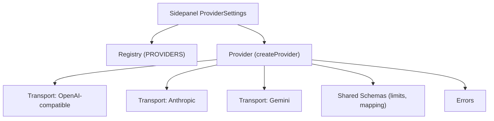
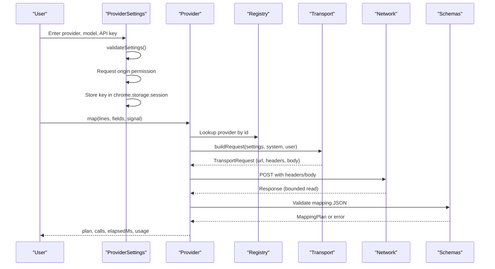
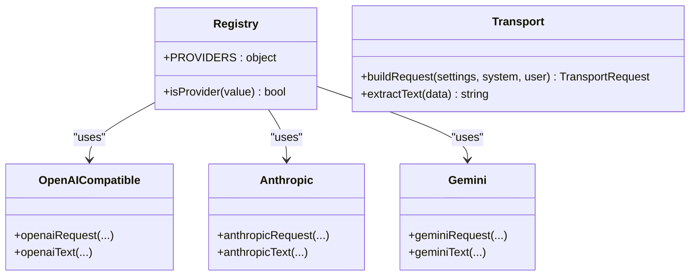
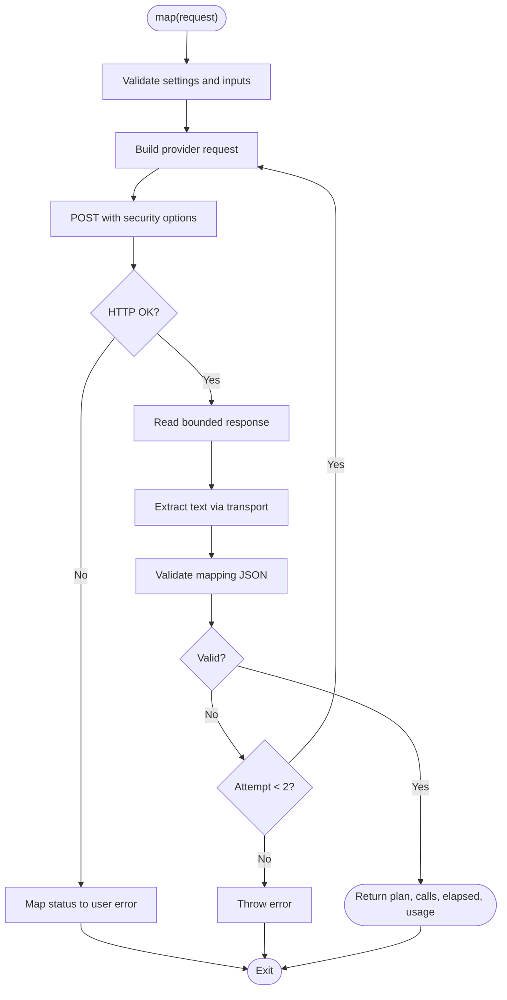
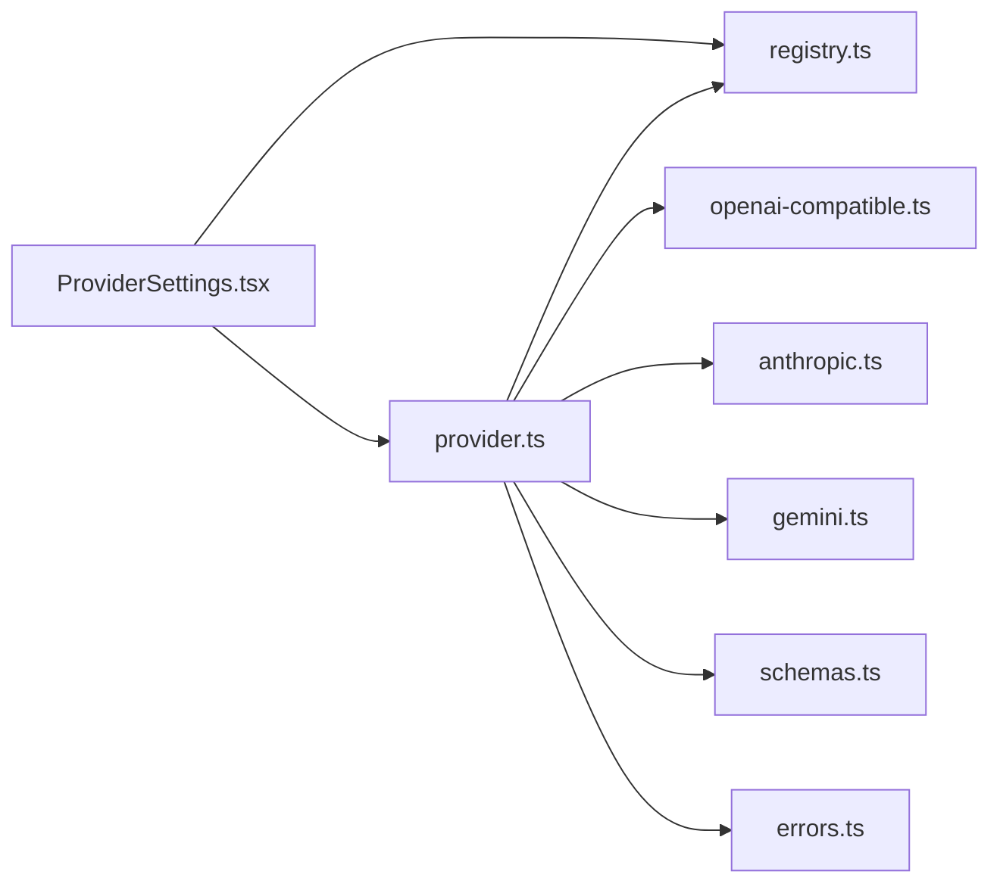

# AI Provider Configuration

<cite>
**Referenced Files in This Document**
- [registry.ts](file://src/ai/registry.ts)
- [provider.ts](file://src/ai/provider.ts)
- [openai-compatible.ts](file://src/ai/transports/openai-compatible.ts)
- [anthropic.ts](file://src/ai/transports/anthropic.ts)
- [gemini.ts](file://src/ai/transports/gemini.ts)
- [schemas.ts](file://src/shared/schemas.ts)
- [ProviderSettings.tsx](file://src/sidepanel/components/ProviderSettings.tsx)
- [prompts.ts](file://src/ai/prompts.ts)
- [errors.ts](file://src/shared/errors.ts)
- [session.ts](file://src/sidepanel/session.ts)
- [providers.test.ts](file://tests/unit/providers.test.ts)
</cite>

## Table of Contents
1. Introduction
2. Project Structure
3. Core Components
4. Architecture Overview
5. Detailed Component Analysis
6. Dependency Analysis
7. Performance Considerations
8. Troubleshooting Guide
9. Conclusion
10. Appendices

## Introduction
This document explains how Help Me Fill configures and uses AI providers to generate form-filling suggestions. It covers supported providers (OpenAI, Anthropic Claude, Google Gemini), the provider registry that enables adding new services, the configuration interface for API keys and model selection, origin permissions, validation schema, step-by-step setup guides, troubleshooting authentication issues, secure key management best practices, and how the extension handles provider switching and session-based key storage.

## Project Structure
The AI provider system is organized into:
- Registry and transport layer for each provider
- A unified provider abstraction that builds requests, executes them, and validates responses
- UI components for configuring providers and managing keys
- Shared schemas for validation and limits
- Error utilities and session handling

**Diagram sources**
- [ProviderSettings.tsx:1-70](file://src/sidepanel/components/ProviderSettings.tsx#L1-L70)
- [registry.ts:1-13](file://src/ai/registry.ts#L1-L13)
- [provider.ts:1-107](file://src/ai/provider.ts#L1-L107)
- [openai-compatible.ts:1-22](file://src/ai/transports/openai-compatible.ts#L1-L22)
- [anthropic.ts:1-17](file://src/ai/transports/anthropic.ts#L1-L17)
- [gemini.ts:1-21](file://src/ai/transports/gemini.ts#L1-L21)
- [schemas.ts:1-39](file://src/shared/schemas.ts#L1-L39)
- [errors.ts:1-10](file://src/shared/errors.ts#L1-L10)

**Section sources**
- [registry.ts:1-13](file://src/ai/registry.ts#L1-L13)
- [provider.ts:1-107](file://src/ai/provider.ts#L1-L107)
- [ProviderSettings.tsx:1-70](file://src/sidepanel/components/ProviderSettings.tsx#L1-L70)

## Core Components
- Provider registry: Central list of supported providers with names, origins, endpoints, and transport identifiers.
- Unified provider: Builds provider-specific requests, performs network calls, enforces timeouts and size limits, parses responses, and validates mapping output.
- Transport modules: Encode request payloads and decode responses per provider.
- Validation schema: Enforces input/output sizes, field constraints, and mapping structure.
- UI settings: Collects provider, model, and API key; manages permissions and session storage.

Key responsibilities:
- Registry defines allowed providers and their network origins.
- Provider orchestrates request building, execution, retries, and response parsing.
- Transports encapsulate provider-specific details so the core logic remains uniform.
- Schemas protect against oversized or malformed data.
- UI ensures user consent for permissions and stores keys securely within the browser session.

**Section sources**
- [registry.ts:1-13](file://src/ai/registry.ts#L1-L13)
- [provider.ts:15-107](file://src/ai/provider.ts#L15-L107)
- [openai-compatible.ts:1-22](file://src/ai/transports/openai-compatible.ts#L1-L22)
- [anthropic.ts:1-17](file://src/ai/transports/anthropic.ts#L1-L17)
- [gemini.ts:1-21](file://src/ai/transports/gemini.ts#L1-L21)
- [schemas.ts:1-39](file://src/shared/schemas.ts#L1-L39)
- [ProviderSettings.tsx:1-70](file://src/sidepanel/components/ProviderSettings.tsx#L1-L70)

## Architecture Overview
The flow from UI to provider and back:

**Diagram sources**
- [ProviderSettings.tsx:13-45](file://src/sidepanel/components/ProviderSettings.tsx#L13-L45)
- [provider.ts:19-105](file://src/ai/provider.ts#L19-L105)
- [registry.ts:1-13](file://src/ai/registry.ts#L1-L13)
- [openai-compatible.ts:4-21](file://src/ai/transports/openai-compatible.ts#L4-L21)
- [anthropic.ts:3-16](file://src/ai/transports/anthropic.ts#L3-L16)
- [gemini.ts:3-20](file://src/ai/transports/gemini.ts#L3-L20)
- [schemas.ts:15-23](file://src/shared/schemas.ts#L15-L23)

## Detailed Component Analysis

### Supported Providers and Setup Requirements
- OpenAI
  - Endpoint and host are defined in the registry.
  - Uses OpenAI-compatible transport with JSON response format.
  - Requires a valid model ID and API key.
  - Origin permission required for the OpenAI API host.
- Anthropic Claude
  - Fixed endpoint used by the registry.
  - Uses Anthropic transport with specific headers and version.
  - Requires a valid model ID and API key.
  - Origin permission required for the Anthropic API host.
- Google Gemini
  - Endpoint and host are defined in the registry.
  - Uses Gemini transport with system instruction and JSON response MIME type.
  - Requires a valid model ID and API key.
  - Origin permission required for the Gemini API host.

Notes:
- The registry also includes DeepSeek using the OpenAI-compatible transport.
- Each provider’s transport encodes credentials in headers only; the body does not contain the API key.

**Section sources**
- [registry.ts:1-13](file://src/ai/registry.ts#L1-L13)
- [openai-compatible.ts:4-21](file://src/ai/transports/openai-compatible.ts#L4-L21)
- [anthropic.ts:3-16](file://src/ai/transports/anthropic.ts#L3-L16)
- [gemini.ts:3-20](file://src/ai/transports/gemini.ts#L3-L20)

### Provider Registry System
- Centralized registry maps provider IDs to display name, origin pattern, endpoint URL, and transport identifier.
- Type guard ensures only known providers are accepted.
- Extensibility: Add a new provider by registering it in the registry and implementing or reusing a transport module.

**Diagram sources**
- [registry.ts:1-13](file://src/ai/registry.ts#L1-L13)
- [openai-compatible.ts:4-21](file://src/ai/transports/openai-compatible.ts#L4-L21)
- [anthropic.ts:3-16](file://src/ai/transports/anthropic.ts#L3-L16)
- [gemini.ts:3-20](file://src/ai/transports/gemini.ts#L3-L20)

**Section sources**
- [registry.ts:1-13](file://src/ai/registry.ts#L1-L13)

### Configuration Interface
- Fields: Provider dropdown, Model ID text input, API key password input.
- Actions: Enable provider, Remove key, Revoke API host permission.
- Behavior:
  - Validates settings before saving.
  - Requests origin permission for the selected provider.
  - Stores API key in session storage under a provider-scoped key.
  - Persists provider and model in local preferences.
  - Restores session key on load if permission exists.

Security notes:
- Keys are stored in session storage, not persistent storage.
- No backend or subscription is involved; direct connections to provider APIs.
- Origin permissions are required and can be revoked at any time.

**Section sources**
- [ProviderSettings.tsx:13-68](file://src/sidepanel/components/ProviderSettings.tsx#L13-L68)

### Validation Schema and Limits
- Input limits: bytes, pages, characters, fields, response bytes, value length.
- Field descriptors validated with strict schema.
- Mapping output validated to ensure assignments and unmapped lists conform to expected structure and limits.
- These constraints prevent oversized payloads and enforce safe, predictable outputs.

**Section sources**
- [schemas.ts:1-39](file://src/shared/schemas.ts#L1-L39)

### Prompting and Payload Construction
- System prompt instructs the model to return structured JSON with assignments and evidence.
- Payload construction compacts field metadata and excludes sensitive values like current field values and page URLs.
- This reduces risk and keeps payloads minimal.

**Section sources**
- [prompts.ts:4-25](file://src/ai/prompts.ts#L4-L25)

### Provider Switching and Session-Based Key Storage
- Switching providers:
  - Changing provider clears model and key inputs until saved again.
  - On save, origin permission is requested for the new provider.
  - Session key is stored scoped by provider ID.
- Session storage:
  - API key stored under a key derived from provider ID.
  - Access level set to trusted contexts for secure access.
  - Preferences store provider and model for restoration.
- State reset:
  - When provider changes, the sidepanel resets review state to avoid stale mappings.

**Section sources**
- [ProviderSettings.tsx:13-45](file://src/sidepanel/components/ProviderSettings.tsx#L13-L45)
- [session.ts:26-40](file://src/sidepanel/session.ts#L26-L40)

### Request Execution, Retries, and Safety
- Build request:
  - Chooses transport based on provider.
  - Encodes headers with API key; body contains no secrets.
- Network call:
  - Uses fetch with explicit security options (no credentials, no cache, redirect error).
  - Bounded response reading to prevent memory abuse.
- Timeouts and aborts:
  - 60-second timeout with AbortController.
  - Respects external abort signals.
- Retry policy:
  - One retry attempt if initial mapping fails validation; never sends untrusted output back to provider.
  - Does not retry HTTP errors or network failures.
- Error handling:
  - Maps status codes to user-friendly messages.
  - Throws typed user errors for consistent messaging.

**Diagram sources**
- [provider.ts:52-105](file://src/ai/provider.ts#L52-L105)
- [openai-compatible.ts:4-21](file://src/ai/transports/openai-compatible.ts#L4-L21)
- [anthropic.ts:3-16](file://src/ai/transports/anthropic.ts#L3-L16)
- [gemini.ts:3-20](file://src/ai/transports/gemini.ts#L3-L20)
- [errors.ts:1-10](file://src/shared/errors.ts#L1-L10)

**Section sources**
- [provider.ts:19-105](file://src/ai/provider.ts#L19-L105)
- [errors.ts:1-10](file://src/shared/errors.ts#L1-L10)

## Dependency Analysis
- Provider depends on:
  - Registry for provider metadata and transport selection.
  - Transport modules for request encoding and response decoding.
  - Schemas for limits and mapping validation.
  - Errors for consistent error types and messages.
- UI depends on:
  - Registry for provider list and origins.
  - Provider validation function for settings.
  - Chrome APIs for permissions and storage.

**Diagram sources**
- [ProviderSettings.tsx:1-70](file://src/sidepanel/components/ProviderSettings.tsx#L1-L70)
- [registry.ts:1-13](file://src/ai/registry.ts#L1-L13)
- [provider.ts:1-107](file://src/ai/provider.ts#L1-L107)
- [openai-compatible.ts:1-22](file://src/ai/transports/openai-compatible.ts#L1-L22)
- [anthropic.ts:1-17](file://src/ai/transports/anthropic.ts#L1-L17)
- [gemini.ts:1-21](file://src/ai/transports/gemini.ts#L1-L21)
- [schemas.ts:1-39](file://src/shared/schemas.ts#L1-L39)
- [errors.ts:1-10](file://src/shared/errors.ts#L1-L10)

**Section sources**
- [providers.test.ts:14-29](file://tests/unit/providers.test.ts#L14-L29)

## Performance Considerations
- Response size limit: Prevents large payloads from consuming memory.
- Timeout: Avoids hanging requests beyond 60 seconds.
- Minimal payload: Only necessary field metadata is sent; sensitive values excluded.
- Single retry: Reduces unnecessary network overhead while improving robustness for transient validation issues.

[No sources needed since this section provides general guidance]

## Troubleshooting Guide
Common authentication and configuration issues:
- Invalid API key or model ID:
  - Ensure the model ID matches your provider account and supports JSON output.
  - Confirm the API key has no spaces and meets length requirements.
- Origin permission denied:
  - Grant permission when prompted; you can revoke it later from the settings UI.
- Rate limiting or quota exceeded:
  - Wait and retry; check your provider account quotas.
- Provider unavailable or network error:
  - Verify network access and that the extension has permission to reach the provider host.
- Refused or truncated response:
  - Try a different model or shorten the document; some models may not support long outputs or JSON mode.

Steps to recover:
- Remove the stored key and re-enable the provider.
- Revoke and re-grant API host permission.
- Reset the sidepanel session and rescan the form.

**Section sources**
- [provider.ts:77-100](file://src/ai/provider.ts#L77-L100)
- [ProviderSettings.tsx:32-68](file://src/sidepanel/components/ProviderSettings.tsx#L32-L68)
- [errors.ts:1-10](file://src/shared/errors.ts#L1-L10)

## Conclusion
Help Me Fill provides a secure, extensible system for configuring multiple AI providers through a centralized registry and unified provider abstraction. The UI streamlines API key management with session-only storage and explicit origin permissions. Robust validation, bounded I/O, timeouts, and limited retries ensure reliability and safety. Adding new providers involves registering them and implementing or reusing a transport module.

[No sources needed since this section summarizes without analyzing specific files]

## Appendices

### Step-by-Step Setup Guides

- OpenAI
  1. Select OpenAI from the provider dropdown.
  2. Enter your model ID from your OpenAI account.
  3. Paste your API key.
  4. Click Enable provider to grant origin permission and store the key in session storage.
  5. Generate suggestions; if errors occur, verify model compatibility and permissions.

- Anthropic Claude
  1. Select Anthropic from the provider dropdown.
  2. Enter your model ID from your Anthropic account.
  3. Paste your API key.
  4. Click Enable provider to grant origin permission and store the key in session storage.
  5. Generate suggestions; if errors occur, verify model compatibility and permissions.

- Google Gemini
  1. Select Google Gemini from the provider dropdown.
  2. Enter your model ID from your Gemini account.
  3. Paste your API key.
  4. Click Enable provider to grant origin permission and store the key in session storage.
  5. Generate suggestions; if errors occur, verify model compatibility and permissions.

[No sources needed since this section provides procedural guidance]

### Best Practices for Managing API Keys Securely
- Use short-lived sessions: Keys are stored only for the browser session.
- Revoke permissions when not in use: Use the revoke action to remove host permissions.
- Keep model IDs accurate: Mismatched models can cause refusal or truncation.
- Limit document size: Shorter documents reduce token usage and improve reliability.
- Monitor quotas: Check provider accounts for rate limits and usage.

[No sources needed since this section provides general guidance]