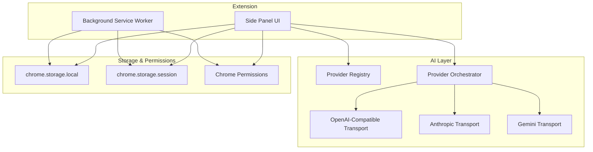
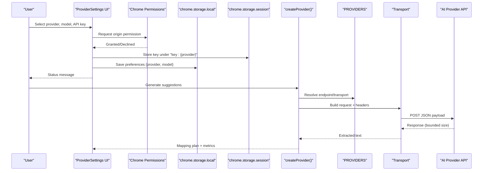
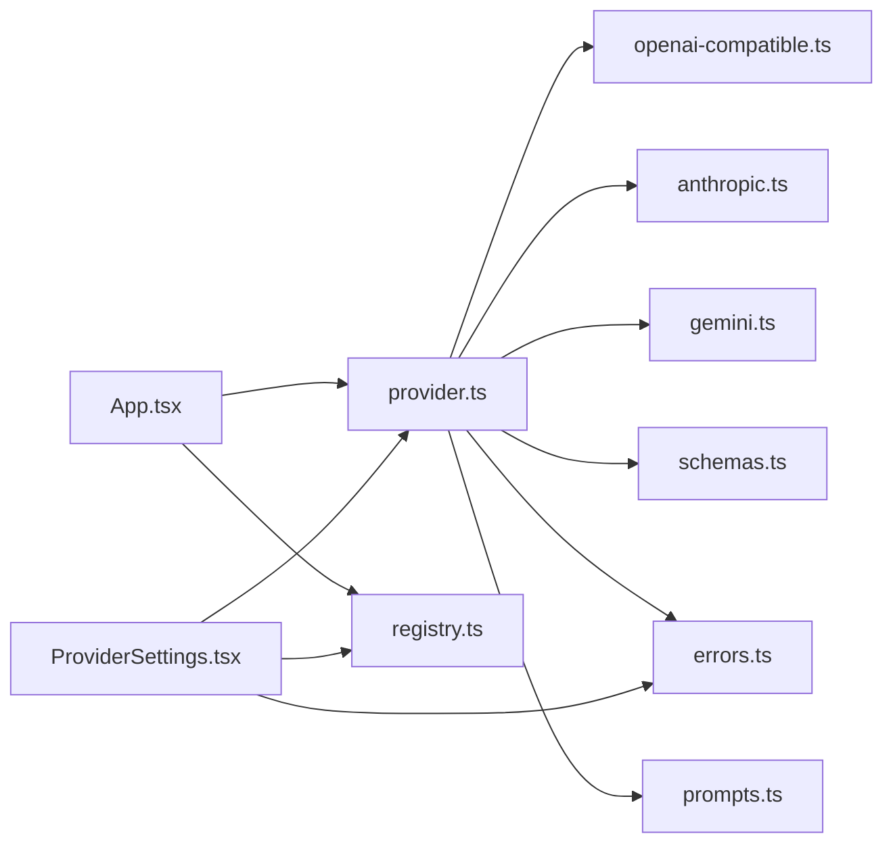

# Configuration

<cite>
**Referenced Files in This Document**
- [manifest.json](file://src/manifest.json)
- [registry.ts](file://src/ai/registry.ts)
- [provider.ts](file://src/ai/provider.ts)
- [openai-compatible.ts](file://src/ai/transports/openai-compatible.ts)
- [anthropic.ts](file://src/ai/transports/anthropic.ts)
- [gemini.ts](file://src/ai/transports/gemini.ts)
- [ProviderSettings.tsx](file://src/sidepanel/components/ProviderSettings.tsx)
- [App.tsx](file://src/sidepanel/App.tsx)
- [service-worker.ts](file://src/background/service-worker.ts)
- [schemas.ts](file://src/shared/schemas.ts)
- [prompts.ts](file://src/ai/prompts.ts)
- [errors.ts](file://src/shared/errors.ts)
</cite>

## Table of Contents
1. Introduction
2. Project Structure
3. Core Components
4. Architecture Overview
5. Detailed Component Analysis
6. Dependency Analysis
7. Performance Considerations
8. Troubleshooting Guide
9. Conclusion

## Introduction
This document explains how to configure the Help Me Fill extension, including AI provider settings (API keys, endpoints, model selection), security and permissions, storage-based persistence, default values, and the Zod-based validation system that ensures configuration integrity. It also documents the provider registry for adding or customizing AI services and provides troubleshooting guidance and production best practices.

## Project Structure
The extension is a Manifest V3 Chrome extension with:
- A background service worker that configures storage access levels and handles action clicks.
- A side panel UI where users select an AI provider, enter a model ID and API key, and manage permissions.
- An AI layer that builds requests and parses responses via transport-specific modules.
- Shared schemas and error utilities used across components.

**Diagram sources**
- [service-worker.ts:1-15](file://src/background/service-worker.ts#L1-L15)
- [ProviderSettings.tsx:1-70](file://src/sidepanel/components/ProviderSettings.tsx#L1-L70)
- [registry.ts:1-13](file://src/ai/registry.ts#L1-L13)
- [provider.ts:1-107](file://src/ai/provider.ts#L1-L107)
- [openai-compatible.ts:1-22](file://src/ai/transports/openai-compatible.ts#L1-L22)
- [anthropic.ts:1-17](file://src/ai/transports/anthropic.ts#L1-L17)
- [gemini.ts:1-21](file://src/ai/transports/gemini.ts#L1-L21)

**Section sources**
- [manifest.json:1-19](file://src/manifest.json#L1-L19)
- [service-worker.ts:1-29](file://src/background/service-worker.ts#L1-L29)

## Core Components
- Provider Registry: Declares supported providers, their display names, origins, endpoints, and transport types.
- Provider Orchestrator: Validates settings, builds transport requests, enforces limits, handles retries, timeouts, and response parsing.
- Transports: Build provider-specific HTTP payloads and extract text from responses.
- Side Panel Settings: UI for selecting provider/model/API key, requesting host permissions, and persisting preferences and session keys.
- Storage and Permissions: Uses chrome.storage.local for persistent preferences and chrome.storage.session for temporary API keys; requires optional host permissions per provider origin.
- Validation: Zod schemas enforce input/output shapes and limits for mapping plans and scan data.

**Section sources**
- [registry.ts:1-13](file://src/ai/registry.ts#L1-L13)
- [provider.ts:15-107](file://src/ai/provider.ts#L15-L107)
- [openai-compatible.ts:1-22](file://src/ai/transports/openai-compatible.ts#L1-L22)
- [anthropic.ts:1-17](file://src/ai/transports/anthropic.ts#L1-L17)
- [gemini.ts:1-21](file://src/ai/transports/gemini.ts#L1-L21)
- [ProviderSettings.tsx:1-70](file://src/sidepanel/components/ProviderSettings.tsx#L1-L70)
- [schemas.ts:1-39](file://src/shared/schemas.ts#L1-L39)

## Architecture Overview
The configuration flow spans UI, storage, permissions, and the AI layer:

**Diagram sources**
- [ProviderSettings.tsx:32-44](file://src/sidepanel/components/ProviderSettings.tsx#L32-L44)
- [provider.ts:52-105](file://src/ai/provider.ts#L52-L105)
- [registry.ts:1-13](file://src/ai/registry.ts#L1-L13)
- [openai-compatible.ts:4-13](file://src/ai/transports/openai-compatible.ts#L4-L13)
- [anthropic.ts:3-9](file://src/ai/transports/anthropic.ts#L3-L9)
- [gemini.ts:3-12](file://src/ai/transports/gemini.ts#L3-L12)

## Detailed Component Analysis

### AI Provider Configuration
- Provider selection: Choose from built-in providers defined in the registry.
- Model ID: Enter a model ID supported by the selected provider.
- API Key: Provide a non-empty string without spaces; stored only for the browser session.
- Host Permission: The extension requests permission to call the provider’s origin when enabling the provider.

Validation rules enforced at save time:
- Model must match a strict pattern.
- API key must be present, contain no whitespace, and not exceed a maximum length.

Request construction:
- OpenAI-compatible: Bearer token header, JSON object response format, max tokens configured per provider variant.
- Anthropic: x-api-key header, anthropic-version header, messages body with system prompt and user content.
- Gemini: x-goog-api-key header, generateContent endpoint with system instruction and JSON response MIME type.

Response handling:
- Responses are bounded to a safe size limit.
- Each transport validates response shape and extracts text; errors surface as user-friendly messages.

**Section sources**
- [registry.ts:1-13](file://src/ai/registry.ts#L1-L13)
- [provider.ts:15-26](file://src/ai/provider.ts#L15-L26)
- [openai-compatible.ts:4-21](file://src/ai/transports/openai-compatible.ts#L4-L21)
- [anthropic.ts:3-16](file://src/ai/transports/anthropic.ts#L3-L16)
- [gemini.ts:3-20](file://src/ai/transports/gemini.ts#L3-L20)
- [provider.ts:34-51](file://src/ai/provider.ts#L34-L51)

### Security Preferences and Extension Permissions
- Permissions declared in the manifest include sidePanel, scripting, activeTab, and storage.
- Optional host permissions allow direct calls to provider APIs when granted by the user.
- Background service worker sets storage access levels to trusted contexts for both local and session storage.
- Keys are stored in session storage and never persisted across sessions.
- Content Security Policy restricts script execution to self-origin.

Best practices:
- Always grant host permissions explicitly for the chosen provider.
- Revoke host permissions when not in use.
- Avoid storing secrets beyond the session scope.

**Section sources**
- [manifest.json:1-19](file://src/manifest.json#L1-L19)
- [service-worker.ts:1-5](file://src/background/service-worker.ts#L1-L5)
- [ProviderSettings.tsx:32-44](file://src/sidepanel/components/ProviderSettings.tsx#L32-L44)

### Storage-Based Settings Persistence
- Persistent preferences: provider and model saved to chrome.storage.local.
- Temporary API key: saved to chrome.storage.session under a key scoped to the provider.
- On load, the UI restores previously saved preferences and session key if available and permissions exist.
- Resetting the session clears session storage and removes settings state.

Default values:
- Default provider is set in the UI component state.
- No default model or API key; these must be provided by the user.

**Section sources**
- [ProviderSettings.tsx:13-28](file://src/sidepanel/components/ProviderSettings.tsx#L13-L28)
- [ProviderSettings.tsx:32-44](file://src/sidepanel/components/ProviderSettings.tsx#L32-L44)
- [App.tsx:102-107](file://src/sidepanel/App.tsx#L102-L107)

### Schema Validation System (Zod)
- Field descriptors and mapping plans are validated using Zod schemas to ensure correctness and safety.
- Limits are enforced for bytes, pages, characters, fields, response size, and value lengths.
- Mapping output includes assignments and unmapped fields with evidence and reasons, all strictly validated.
- Scan inputs validate field lists and exclusions.

Usage in the pipeline:
- Prompts build compact field payloads excluding sensitive current values and URLs.
- Mapping results are validated before being presented to the user.

**Section sources**
- [schemas.ts:1-39](file://src/shared/schemas.ts#L1-L39)
- [prompts.ts:18-25](file://src/ai/prompts.ts#L18-L25)
- [provider.ts:55-60](file://src/ai/provider.ts#L55-L60)

### Provider Registry and Customization
- The registry defines provider IDs, display names, origins, endpoints, and transport identifiers.
- New providers can be added by extending the registry with a new entry and implementing a transport module that constructs requests and extracts text consistently.
- Existing providers can be customized by updating endpoints, headers, or transport behavior in their respective files.

Adding a new provider:
- Add an entry to the registry with name, origin, endpoint, and transport.
- Implement request builder and text extractor in a new transport file.
- Wire into the orchestrator if needed.

**Section sources**
- [registry.ts:1-13](file://src/ai/registry.ts#L1-L13)
- [openai-compatible.ts:1-22](file://src/ai/transports/openai-compatible.ts#L1-L22)
- [anthropic.ts:1-17](file://src/ai/transports/anthropic.ts#L1-L17)
- [gemini.ts:1-21](file://src/ai/transports/gemini.ts#L1-L21)

### Environment Variables
- No environment variables are required for runtime configuration.
- All configuration is managed through the side panel UI and stored in Chrome storage.

[No sources needed since this section provides general guidance]

## Dependency Analysis

**Diagram sources**
- [App.tsx:73-83](file://src/sidepanel/App.tsx#L73-L83)
- [provider.ts:1-107](file://src/ai/provider.ts#L1-L107)
- [registry.ts:1-13](file://src/ai/registry.ts#L1-L13)
- [openai-compatible.ts:1-22](file://src/ai/transports/openai-compatible.ts#L1-L22)
- [anthropic.ts:1-17](file://src/ai/transports/anthropic.ts#L1-L17)
- [gemini.ts:1-21](file://src/ai/transports/gemini.ts#L1-L21)
- [schemas.ts:1-39](file://src/shared/schemas.ts#L1-L39)
- [errors.ts:1-10](file://src/shared/errors.ts#L1-L10)
- [prompts.ts:1-26](file://src/ai/prompts.ts#L1-L26)

**Section sources**
- [App.tsx:73-83](file://src/sidepanel/App.tsx#L73-L83)
- [provider.ts:1-107](file://src/ai/provider.ts#L1-L107)

## Performance Considerations
- Response size is bounded to prevent excessive memory usage during streaming reads.
- Requests include a timeout to avoid hanging operations.
- Mapping attempts up to two times on validation failures, reusing original inputs and appending diagnostics.
- Fields and document sizes are limited to protect against large payloads.

Recommendations:
- Use concise models and shorter documents to reduce token usage and latency.
- Ensure network stability and provider availability to minimize retries.
- Monitor usage metrics returned by providers when available.

**Section sources**
- [provider.ts:34-51](file://src/ai/provider.ts#L34-L51)
- [provider.ts:63-105](file://src/ai/provider.ts#L63-L105)
- [schemas.ts:3-3](file://src/shared/schemas.ts#L3-L3)

## Troubleshooting Guide
Common issues and resolutions:
- Missing or invalid API key: Ensure the key is present, contains no spaces, and matches your provider’s requirements.
- Invalid model ID: Confirm the model exists and supports JSON output for the selected provider.
- Host permission declined: Re-enable the provider to request permission again; revoke and re-grant if necessary.
- Rate limiting or quota exceeded: Wait and retry; check your provider account limits.
- Network or CORS issues: Verify browser access policy and network connectivity to the provider origin.
- Excessive response size: Shorten the document or choose a more efficient model.
- Aborted or canceled operations: Restart the workflow after canceling or switching tabs.

Error handling highlights:
- User-facing errors are normalized and displayed via a shared utility.
- Abort signals are respected to cancel ongoing work cleanly.

**Section sources**
- [provider.ts:15-26](file://src/ai/provider.ts#L15-L26)
- [provider.ts:77-100](file://src/ai/provider.ts#L77-L100)
- [errors.ts:1-10](file://src/shared/errors.ts#L1-L10)
- [ProviderSettings.tsx:32-44](file://src/sidepanel/components/ProviderSettings.tsx#L32-L44)

## Conclusion
Help Me Fill centralizes configuration in the side panel, persists minimal settings locally, and keeps secrets ephemeral in session storage. The provider registry and transport abstraction make it straightforward to add or customize AI services. Zod schemas enforce robust validation and safety limits. Follow the troubleshooting steps and best practices to ensure reliable operation in both development and production environments.