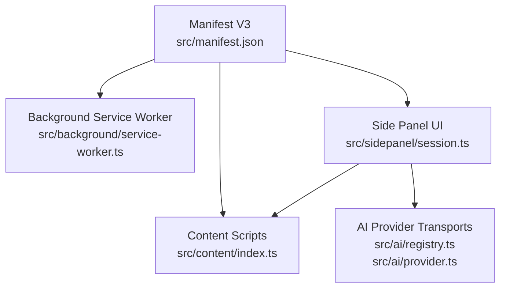
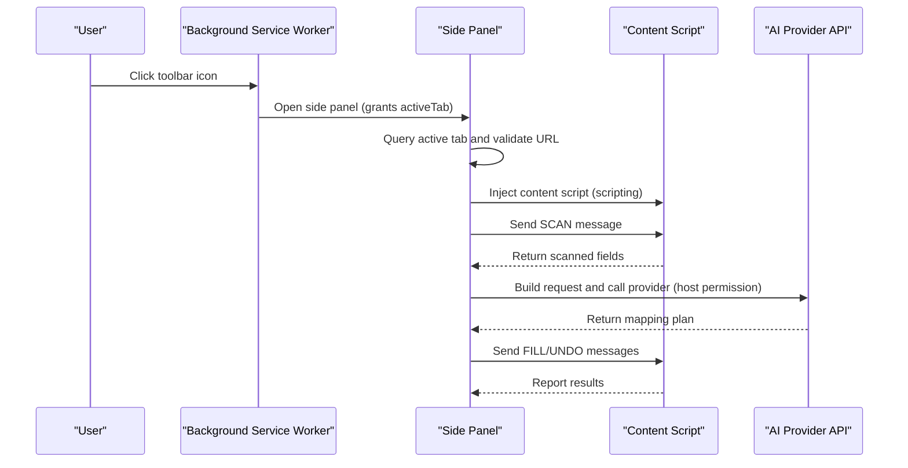
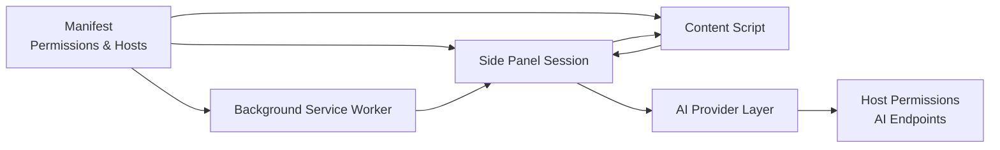

# Extension Permissions

<cite>
**Referenced Files in This Document**
- [manifest.json](file://src/manifest.json)
- [service-worker.ts](file://src/background/service-worker.ts)
- [index.ts](file://src/content/index.ts)
- [session.ts](file://src/sidepanel/session.ts)
- [registry.ts](file://src/ai/registry.ts)
- [provider.ts](file://src/ai/provider.ts)
</cite>

## Table of Contents
1. Introduction
2. Project Structure
3. Core Components
4. Architecture Overview
5. Detailed Component Analysis
6. Dependency Analysis
7. Performance Considerations
8. Troubleshooting Guide
9. Conclusion

## Introduction
This document explains the permission model for Help Me Fill, a Chrome extension that reviews AI suggestions from a PDF and fills supported web text fields. It covers required permissions (storage access, tab monitoring, scripting), optional host permissions for AI providers, when each permission is requested from users, security implications, the permission request flow and user consent process, guidance on minimizing permissions, and browser-specific differences between Chrome and Edge.

## Project Structure
Help Me Fill uses Manifest V3 with a background service worker, a side panel UI, content scripts injected into target pages, and AI provider transports. The manifest declares core permissions and optional host permissions for external AI APIs.

**Diagram sources**
- [manifest.json:1-19](file://src/manifest.json#L1-L19)
- [service-worker.ts:1-29](file://src/background/service-worker.ts#L1-L29)
- [session.ts:44-86](file://src/sidepanel/session.ts#L44-L86)
- [index.ts:1-72](file://src/content/index.ts#L1-L72)
- [registry.ts:1-13](file://src/ai/registry.ts#L1-L13)
- [provider.ts:52-106](file://src/ai/provider.ts#L52-L106)

**Section sources**
- [manifest.json:1-19](file://src/manifest.json#L1-L19)

## Core Components
- Background service worker: configures storage access levels and opens the side panel via action clicks; validates active tab context during operations.
- Side panel session: orchestrates scanning, mapping, and filling; requests tab scripting and messaging to inject content scripts and communicate with the page.
- Content script: runs inside the target page to scan form fields and apply fill or undo actions under strict origin checks.
- AI provider layer: constructs outbound HTTP requests to AI endpoints declared as optional host permissions.

Key permission usage by component:
- Storage: background sets access levels for session and local storage to trusted contexts.
- Tab and scripting: side panel queries active tabs and injects content scripts to scan/fill forms.
- Active tab: background ensures the correct tab is active before opening the panel and performing actions.
- Host permissions: AI transports call provider endpoints declared as optional host permissions.

**Section sources**
- [service-worker.ts:1-29](file://src/background/service-worker.ts#L1-L29)
- [session.ts:44-86](file://src/sidepanel/session.ts#L44-L86)
- [index.ts:1-72](file://src/content/index.ts#L1-L72)
- [registry.ts:1-13](file://src/ai/registry.ts#L1-L13)
- [provider.ts:52-106](file://src/ai/provider.ts#L52-L106)

## Architecture Overview
The extension follows a three-layer architecture:
- Background: initializes secure storage access and manages side panel opening with explicit action handling to ensure activeTab is granted.
- Side panel: drives the workflow, requesting scripting and tab access only when needed.
- Content script: executes within the target page after injection, enforcing trust and URL checks before processing messages.

**Diagram sources**
- [service-worker.ts:1-29](file://src/background/service-worker.ts#L1-L29)
- [session.ts:44-86](file://src/sidepanel/session.ts#L44-L86)
- [index.ts:1-72](file://src/content/index.ts#L1-L72)
- [provider.ts:52-106](file://src/ai/provider.ts#L52-L106)
- [registry.ts:1-13](file://src/ai/registry.ts#L1-L13)

## Detailed Component Analysis

### Permission Model and Declaration
- Required permissions:
  - sidePanel: to open and manage the review panel.
  - scripting: to inject content scripts into target pages for scanning and filling.
  - activeTab: to interact with the currently active tab when the user triggers an action.
  - storage: to persist settings and state; background sets access levels to trusted contexts.
- Optional host permissions:
  - https://api.openai.com/*
  - https://api.anthropic.com/*
  - https://generativelanguage.googleapis.com/*
  - https://api.deepseek.com/*

These are declared in the manifest and used by the AI provider layer to make outbound requests.

**Section sources**
- [manifest.json:1-19](file://src/manifest.json#L1-L19)
- [registry.ts:1-13](file://src/ai/registry.ts#L1-L13)

### Storage Access and Security
- The background sets storage access levels for both session and local storage to trusted contexts, ensuring only extension-controlled code can read/write these storages.
- This reduces risk of cross-origin data leakage and aligns with MV3 best practices.

Security implications:
- Limits storage exposure to trusted contexts, preventing unintended reads/writes from untrusted origins.
- Combined with strict message validation and origin checks in content scripts, this minimizes attack surface.

**Section sources**
- [service-worker.ts:1-29](file://src/background/service-worker.ts#L1-L29)

### Tab Monitoring and Scripting
- The side panel queries the active tab and injects a content script to scan form fields and execute fill/undo operations.
- Before injecting or sending messages, it validates the active tab identity and URL to prevent cross-tab misuse.

Security implications:
- Requires explicit user action to grant activeTab and scripting access per tab interaction.
- Strict checks ensure content scripts operate only on intended pages and sessions.

**Section sources**
- [session.ts:44-86](file://src/sidepanel/session.ts#L44-L86)
- [index.ts:1-72](file://src/content/index.ts#L1-L72)

### Host Permissions for AI Providers
- The AI provider layer builds requests to configured endpoints (OpenAI, Anthropic, Gemini, DeepSeek).
- Outbound calls use standard fetch with credentials omitted and no-store caching, reducing data retention risks.
- Responses are bounded in size and validated before parsing to mitigate abuse and memory issues.

Security implications:
- Host permissions are optional and only requested when the user selects a provider; they restrict network access to known AI endpoints.
- Response bounds and validation protect against oversized or malformed payloads.

**Section sources**
- [registry.ts:1-13](file://src/ai/registry.ts#L1-L13)
- [provider.ts:52-106](file://src/ai/provider.ts#L52-L106)

### Permission Request Flow and User Consent
- On first install/startup, the background configures storage access levels without prompting users.
- When the user clicks the toolbar icon:
  - The background opens the side panel and grants activeTab for that tab.
  - The side panel then requests scripting to inject content scripts into the current tab.
  - If the user later chooses an AI provider, the extension may prompt for host permissions to that provider’s domain if not already granted.

User consent points:
- Toolbar click triggers activeTab and side panel access.
- Scripting injection occurs after the user initiates scanning on a specific tab.
- Host permissions are prompted when making outbound requests to AI providers not previously allowed.

**Section sources**
- [service-worker.ts:1-29](file://src/background/service-worker.ts#L1-L29)
- [session.ts:44-86](file://src/sidepanel/session.ts#L44-L86)
- [manifest.json:1-19](file://src/manifest.json#L1-L19)

### Security Implications Summary
- Storage: Trusted-context access prevents unauthorized reads/writes.
- Tabs and scripting: Scoped to user-initiated actions and validated targets.
- Host permissions: Limited to declared AI endpoints; responses bounded and validated.
- Content script trust: Only extension-owned URLs and matching document IDs are accepted.

**Section sources**
- [service-worker.ts:1-29](file://src/background/service-worker.ts#L1-L29)
- [index.ts:1-72](file://src/content/index.ts#L1-L72)
- [provider.ts:52-106](file://src/ai/provider.ts#L52-L106)

### Browser-Specific Handling: Chrome vs Edge
- Both browsers follow MV3 patterns; however, the background explicitly handles action clicks to ensure activeTab is consistently granted across Chrome and Edge production artifacts.
- The side panel behavior is configured to not auto-open on action click, relying on explicit user interaction to minimize unnecessary permissions.

Practical notes:
- In some environments, automatic panel opening did not grant activeTab reliably; explicit action handling resolves this.
- Host permission prompts may vary slightly in timing or UX between Chrome and Edge but remain tied to outbound requests to AI endpoints.

**Section sources**
- [service-worker.ts:1-29](file://src/background/service-worker.ts#L1-L29)
- [manifest.json:1-19](file://src/manifest.json#L1-L19)

## Dependency Analysis
The following diagram shows how components depend on permissions and each other:

**Diagram sources**
- [manifest.json:1-19](file://src/manifest.json#L1-L19)
- [service-worker.ts:1-29](file://src/background/service-worker.ts#L1-L29)
- [session.ts:44-86](file://src/sidepanel/session.ts#L44-L86)
- [index.ts:1-72](file://src/content/index.ts#L1-L72)
- [registry.ts:1-13](file://src/ai/registry.ts#L1-L13)
- [provider.ts:52-106](file://src/ai/provider.ts#L52-L106)

**Section sources**
- [manifest.json:1-19](file://src/manifest.json#L1-L19)
- [service-worker.ts:1-29](file://src/background/service-worker.ts#L1-L29)
- [session.ts:44-86](file://src/sidepanel/session.ts#L44-L86)
- [index.ts:1-72](file://src/content/index.ts#L1-L72)
- [registry.ts:1-13](file://src/ai/registry.ts#L1-L13)
- [provider.ts:52-106](file://src/ai/provider.ts#L52-L106)

## Performance Considerations
- Limit response sizes from AI providers to avoid excessive memory usage.
- Use abort signals and timeouts to prevent long-running requests from blocking the UI.
- Minimize repeated injections by reusing established connections where possible.
- Keep storage access scoped to trusted contexts to reduce overhead and risk.

[No sources needed since this section provides general guidance]

## Troubleshooting Guide
Common permission-related issues and resolutions:
- “Page access was denied”: Ensure the user clicked the toolbar icon on the target tab to grant activeTab and scripting; restricted pages are not supported.
- “Target tab or page changed”: Re-scan after navigation; the extension validates active tab identity before operations.
- “Provider request failed” or “Could not reach the selected provider”: Verify host permissions for the chosen AI endpoint and network access; check API key validity and account policies.
- “Storage access errors”: Confirm background initialization ran and storage access levels were set to trusted contexts.

**Section sources**
- [session.ts:44-86](file://src/sidepanel/session.ts#L44-L86)
- [provider.ts:52-106](file://src/ai/provider.ts#L52-L106)
- [service-worker.ts:1-29](file://src/background/service-worker.ts#L1-L29)

## Conclusion
Help Me Fill uses a minimal, purpose-driven permission model aligned with MV3 best practices:
- Required permissions enable safe scanning and filling via scripting and activeTab.
- Optional host permissions are limited to known AI providers and requested only when needed.
- Explicit action handling improves reliability across Chrome and Edge.
- Security is reinforced through trusted storage access, strict origin checks, bounded responses, and validation.

To minimize permissions:
- Avoid declaring broad host permissions; rely on optional hosts for specific providers.
- Defer scripting and tab access until user-initiated actions.
- Clearly explain to users why each permission is necessary at the moment it is requested.

[No sources needed since this section summarizes without analyzing specific files]