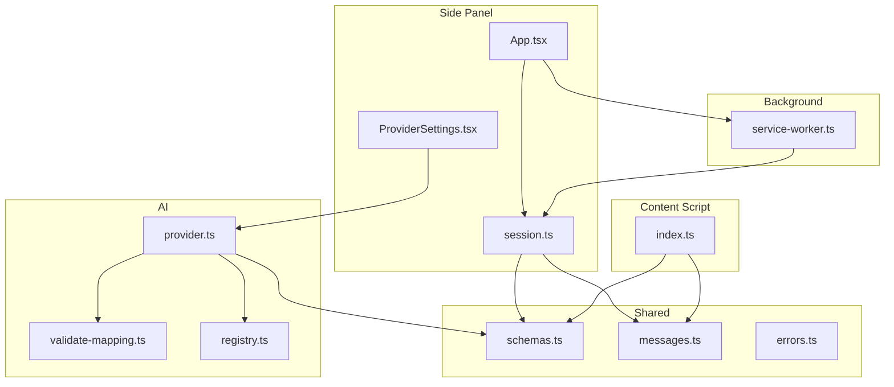
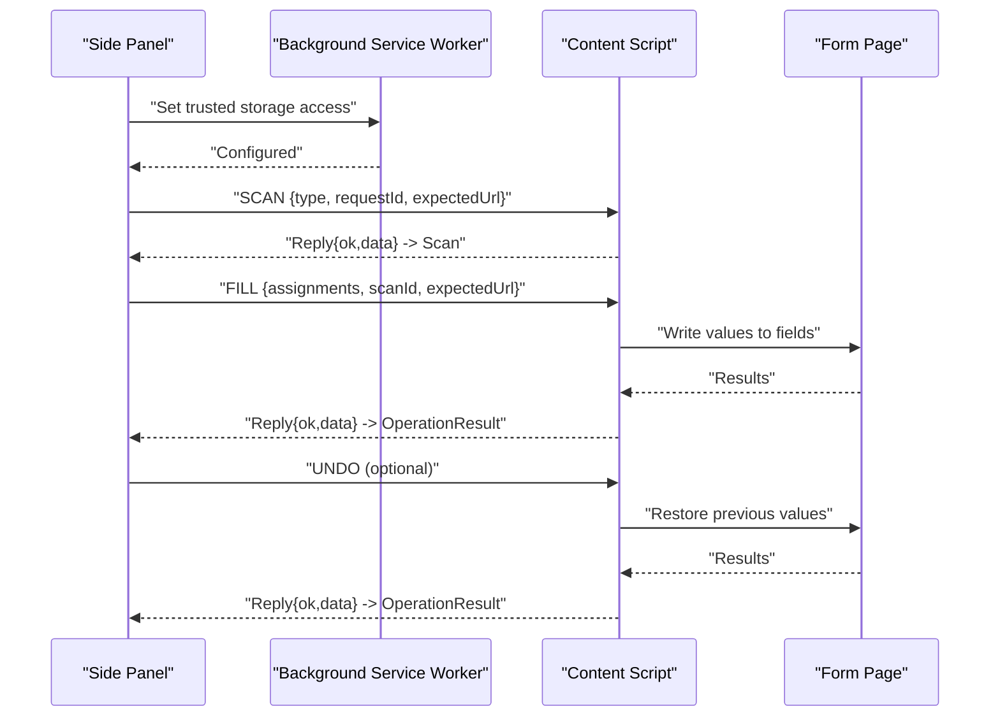
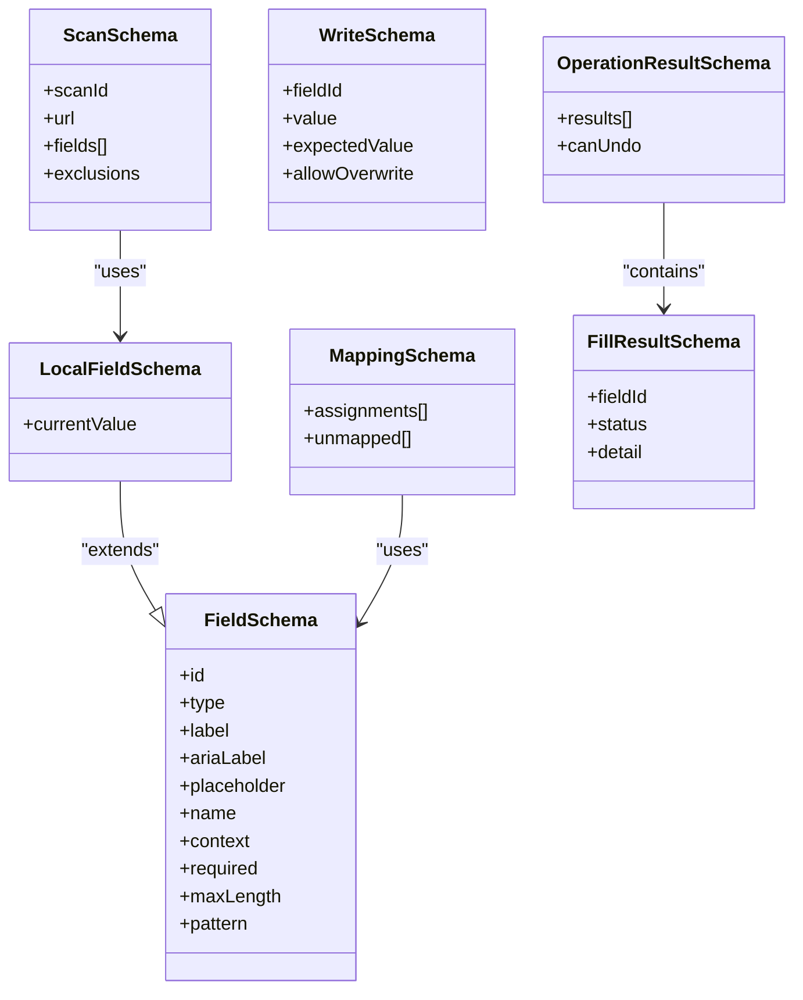
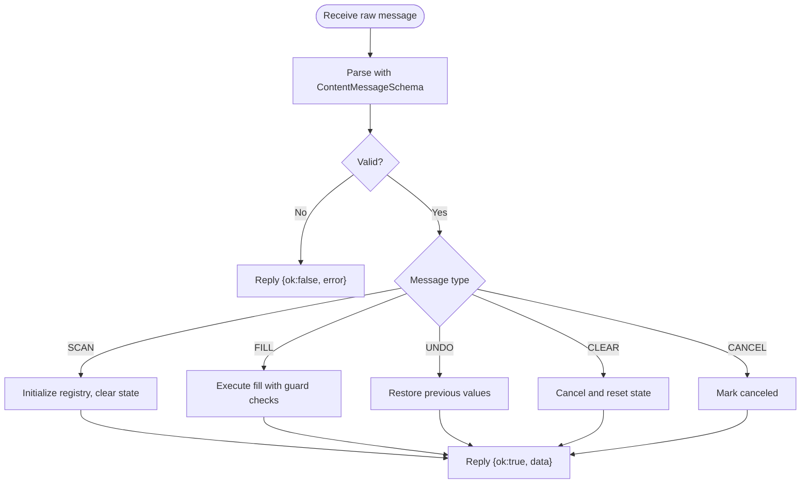
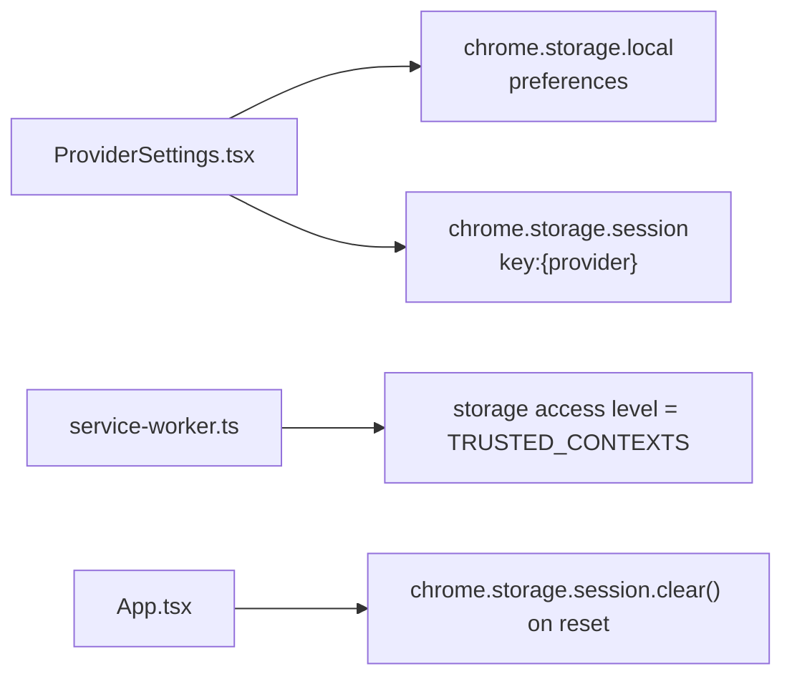
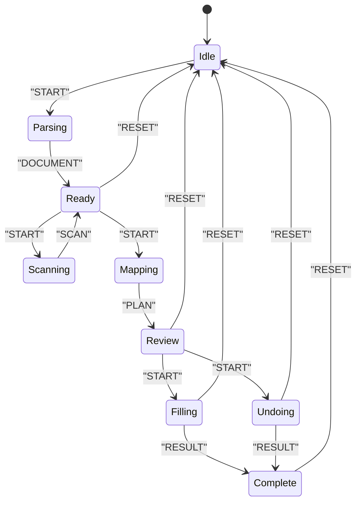
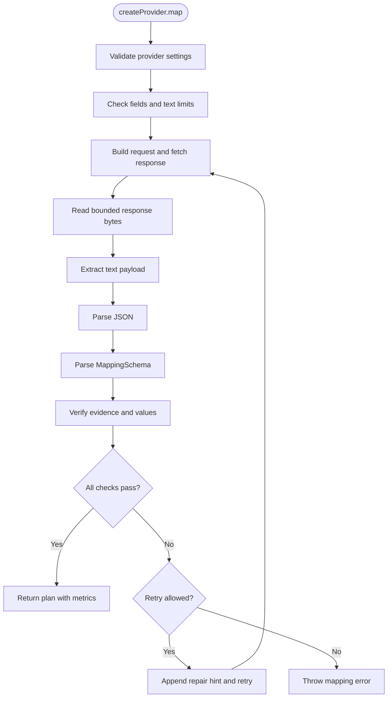
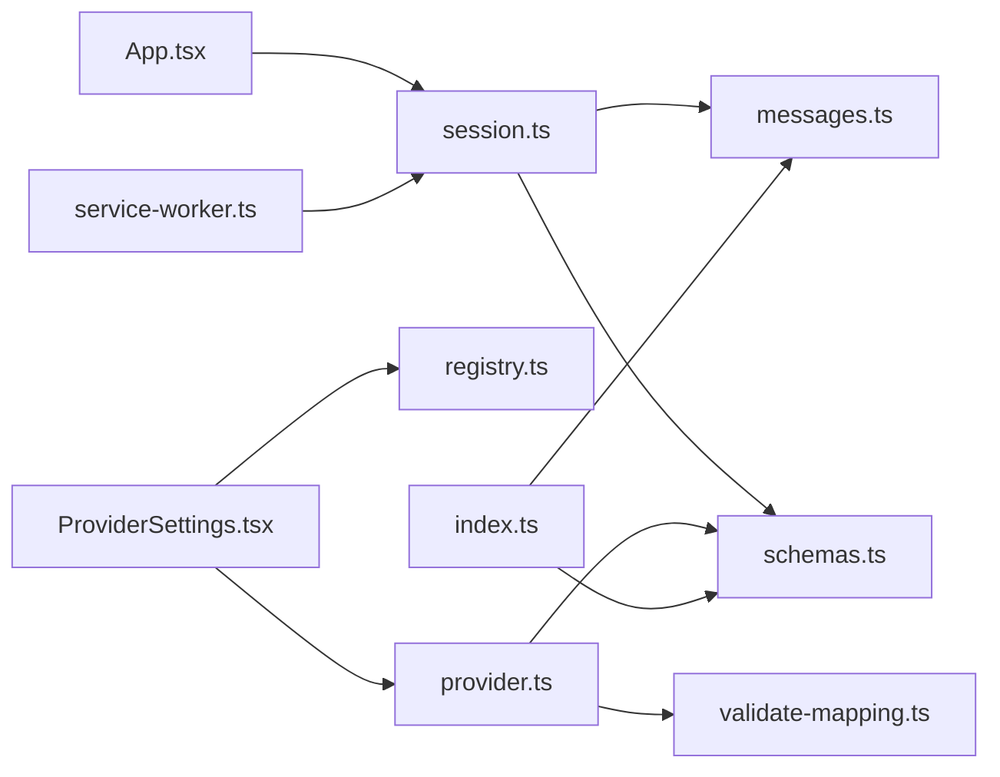

# Storage and Schemas

<cite>
**Referenced Files in This Document**
- [schemas.ts](file://src/shared/schemas.ts)
- [messages.ts](file://src/shared/messages.ts)
- [errors.ts](file://src/shared/errors.ts)
- [session.ts](file://src/sidepanel/session.ts)
- [service-worker.ts](file://src/background/service-worker.ts)
- [index.ts](file://src/content/index.ts)
- [App.tsx](file://src/sidepanel/App.tsx)
- [ProviderSettings.tsx](file://src/sidepanel/components/ProviderSettings.tsx)
- [provider.ts](file://src/ai/provider.ts)
- [validate-mapping.ts](file://src/ai/validate-mapping.ts)
- [registry.ts](file://src/ai/registry.ts)
- [manifest.json](file://src/manifest.json)
</cite>

## Table of Contents
1. [Introduction](#introduction)
2. [Project Structure](#project-structure)
3. [Core Components](#core-components)
4. [Architecture Overview](#architecture-overview)
5. [Detailed Component Analysis](#detailed-component-analysis)
6. [Dependency Analysis](#dependency-analysis)
7. [Performance Considerations](#performance-considerations)
8. [Troubleshooting Guide](#troubleshooting-guide)
9. [Conclusion](#conclusion)
10. [Appendices](#appendices)

## Introduction
This document explains how Help Me Fill stores data and validates schemas to ensure integrity across the extension’s contexts. It covers:
- Zod-based schema validation for messages, mappings, scans, and results
- Storage architecture using Chrome storage APIs (local for preferences, session for temporary secrets like API keys)
- Message schemas used between side panel, content script, and background service worker
- Session management and state persistence patterns
- Error handling strategies and migration/version compatibility considerations

## Project Structure
The storage and validation system spans shared types and schemas, side panel UI and session logic, content script message handling, and background initialization. The manifest declares required permissions for storage and scripting.

**Diagram sources**
- [App.tsx:1-127](file://src/sidepanel/App.tsx#L1-L127)
- [ProviderSettings.tsx:1-70](file://src/sidepanel/components/ProviderSettings.tsx#L1-L70)
- [session.ts:1-86](file://src/sidepanel/session.ts#L1-L86)
- [service-worker.ts:1-29](file://src/background/service-worker.ts#L1-L29)
- [index.ts:1-72](file://src/content/index.ts#L1-L72)
- [schemas.ts:1-39](file://src/shared/schemas.ts#L1-L39)
- [messages.ts:1-20](file://src/shared/messages.ts#L1-L20)
- [errors.ts:1-10](file://src/shared/errors.ts#L1-L10)
- [provider.ts:1-107](file://src/ai/provider.ts#L1-L107)
- [validate-mapping.ts:1-33](file://src/ai/validate-mapping.ts#L1-L33)
- [registry.ts:1-13](file://src/ai/registry.ts#L1-L13)

**Section sources**
- [manifest.json:1-19](file://src/manifest.json#L1-L19)

## Core Components
- Shared schemas define strict contracts for fields, scans, mapping plans, write assignments, and operation results. Limits enforce memory and payload sizes.
- Message schemas validate inter-context communication payloads and standardize replies.
- Side panel session manages workflow phases, target binding, and page messaging with robust error handling.
- Background service worker sets trusted storage access levels and validates active tab context for security-sensitive operations.
- Content script enforces message validation, guards against concurrent operations, and coordinates fill/undo flows with the side panel.
- AI provider validates settings, bounds responses, and enforces mapping output through a dedicated validator.

**Section sources**
- [schemas.ts:1-39](file://src/shared/schemas.ts#L1-L39)
- [messages.ts:1-20](file://src/shared/messages.ts#L1-L20)
- [session.ts:1-86](file://src/sidepanel/session.ts#L1-L86)
- [service-worker.ts:1-29](file://src/background/service-worker.ts#L1-L29)
- [index.ts:1-72](file://src/content/index.ts#L1-L72)
- [provider.ts:1-107](file://src/ai/provider.ts#L1-L107)
- [validate-mapping.ts:1-33](file://src/ai/validate-mapping.ts#L1-L33)

## Architecture Overview
The extension uses three main contexts with clear boundaries:
- Side panel: orchestrates workflow, persists preferences, and sends validated messages to the content script.
- Content script: runs on the form page, scans fields, executes fills/unos, and maintains per-page state.
- Background service worker: initializes storage access levels and performs cross-tab checks when needed.

**Diagram sources**
- [service-worker.ts:1-29](file://src/background/service-worker.ts#L1-L29)
- [session.ts:44-86](file://src/sidepanel/session.ts#L44-L86)
- [index.ts:22-69](file://src/content/index.ts#L22-L69)

## Detailed Component Analysis

### Schema Validation System (Zod)
- Field descriptors and local field variants define supported input types, labels, constraints, and current values.
- Mapping plan schema constrains assignments and unmapped fields, including evidence citations and reasons.
- Scan schema binds a scan to a URL and includes exclusions metadata.
- Write assignment schema defines safe writes with optional overwrite control and expected value tracking.
- Operation result schema standardizes outcomes and undo capability flags.

**Diagram sources**
- [schemas.ts:4-39](file://src/shared/schemas.ts#L4-L39)

**Section sources**
- [schemas.ts:1-39](file://src/shared/schemas.ts#L1-L39)

### Message Schemas and Inter-Context Communication
- ContentMessage is a discriminated union that enforces type safety for SCAN, FILL, UNDO, CLEAR, and CANCEL operations.
- Each message carries a UUID requestId for correlation and includes expectedUrl to prevent cross-tab misuse.
- Replies follow a uniform shape with ok/data or ok/error, enabling consistent error propagation.

**Diagram sources**
- [messages.ts:1-20](file://src/shared/messages.ts#L1-L20)
- [index.ts:22-69](file://src/content/index.ts#L22-L69)

**Section sources**
- [messages.ts:1-20](file://src/shared/messages.ts#L1-L20)
- [index.ts:1-72](file://src/content/index.ts#L1-L72)

### Storage Architecture
- Preferences (provider and model) are stored in chrome.storage.local under a single key.
- API keys are stored in chrome.storage.session keyed by provider, ensuring they persist only for the browser session.
- Background service worker sets storage access levels to TRUSTED_CONTEXTS to allow secure reads/writes from extension pages.
- Side panel clears session storage during reset and handles permission revocation for API hosts.

**Diagram sources**
- [ProviderSettings.tsx:13-52](file://src/sidepanel/components/ProviderSettings.tsx#L13-L52)
- [service-worker.ts:1-15](file://src/background/service-worker.ts#L1-L15)
- [App.tsx:102-107](file://src/sidepanel/App.tsx#L102-L107)

**Section sources**
- [ProviderSettings.tsx:1-70](file://src/sidepanel/components/ProviderSettings.tsx#L1-L70)
- [service-worker.ts:1-29](file://src/background/service-worker.ts#L1-L29)
- [App.tsx:102-107](file://src/sidepanel/App.tsx#L102-L107)

### Session Management and State Persistence
- Side panel session reducer models phases (idle, parsing, scanning, ready, mapping, review, filling, complete, undoing) and transitions based on actions.
- Target binding ensures the active tab and URL remain consistent; changes invalidate the session.
- Messaging helpers send validated messages to the content script and parse replies with strict schemas.
- Long-running operations use AbortController and epoch counters to avoid stale updates after resets.

**Diagram sources**
- [session.ts:6-42](file://src/sidepanel/session.ts#L6-L42)

**Section sources**
- [session.ts:1-86](file://src/sidepanel/session.ts#L1-L86)
- [App.tsx:15-107](file://src/sidepanel/App.tsx#L15-L107)

### AI Provider Validation and Mapping
- Settings validation enforces model ID format and API key constraints before any network call.
- Response size is bounded to prevent memory issues; invalid JSON or schema mismatches raise mapping errors.
- Mapping validator ensures all fields are accounted for, evidence quotes exist on cited lines, proposed values are supported by evidence, and length limits are respected.

**Diagram sources**
- [provider.ts:15-107](file://src/ai/provider.ts#L15-L107)
- [validate-mapping.ts:1-33](file://src/ai/validate-mapping.ts#L1-L33)

**Section sources**
- [provider.ts:1-107](file://src/ai/provider.ts#L1-L107)
- [validate-mapping.ts:1-33](file://src/ai/validate-mapping.ts#L1-L33)

## Dependency Analysis
- Side panel depends on shared schemas and messages for validation and messaging, and on session logic for state management.
- Content script depends on shared messages and schemas to validate incoming requests and produce typed replies.
- AI provider depends on registry for provider configuration and transports, and on shared schemas for limits and types.
- Background service worker provides storage access configuration and active tab verification hooks.

**Diagram sources**
- [App.tsx:1-127](file://src/sidepanel/App.tsx#L1-L127)
- [session.ts:1-86](file://src/sidepanel/session.ts#L1-L86)
- [messages.ts:1-20](file://src/shared/messages.ts#L1-L20)
- [schemas.ts:1-39](file://src/shared/schemas.ts#L1-L39)
- [ProviderSettings.tsx:1-70](file://src/sidepanel/components/ProviderSettings.tsx#L1-L70)
- [registry.ts:1-13](file://src/ai/registry.ts#L1-L13)
- [provider.ts:1-107](file://src/ai/provider.ts#L1-L107)
- [validate-mapping.ts:1-33](file://src/ai/validate-mapping.ts#L1-L33)
- [index.ts:1-72](file://src/content/index.ts#L1-L72)
- [service-worker.ts:1-29](file://src/background/service-worker.ts#L1-L29)

**Section sources**
- [App.tsx:1-127](file://src/sidepanel/App.tsx#L1-L127)
- [session.ts:1-86](file://src/sidepanel/session.ts#L1-L86)
- [messages.ts:1-20](file://src/shared/messages.ts#L1-L20)
- [schemas.ts:1-39](file://src/shared/schemas.ts#L1-L39)
- [ProviderSettings.tsx:1-70](file://src/sidepanel/components/ProviderSettings.tsx#L1-L70)
- [registry.ts:1-13](file://src/ai/registry.ts#L1-L13)
- [provider.ts:1-107](file://src/ai/provider.ts#L1-L107)
- [validate-mapping.ts:1-33](file://src/ai/validate-mapping.ts#L1-L33)
- [index.ts:1-72](file://src/content/index.ts#L1-L72)
- [service-worker.ts:1-29](file://src/background/service-worker.ts#L1-L29)

## Performance Considerations
- Bounded response reading prevents excessive memory usage when fetching provider outputs.
- Strict limits on fields, characters, and response bytes protect against large inputs and outputs.
- Content script caps pending tasks to avoid unbounded growth during rapid operations.
- Abort signals and epoch counters reduce wasted work and stale state updates.

[No sources needed since this section provides general guidance]

## Troubleshooting Guide
Common errors and their handling:
- Invalid extension messages: content script returns a standardized error reply when message parsing fails.
- Aborted operations: DOMException AbortError is normalized into user-friendly messages.
- Provider failures: HTTP status codes map to actionable messages (e.g., rate limiting, authentication).
- Session invalidation: Changes to active tab or URL trigger invalidation prompts to rescan.

**Section sources**
- [errors.ts:1-10](file://src/shared/errors.ts#L1-L10)
- [index.ts:54-69](file://src/content/index.ts#L54-L69)
- [provider.ts:77-100](file://src/ai/provider.ts#L77-L100)
- [session.ts:44-69](file://src/sidepanel/session.ts#L44-L69)

## Conclusion
Help Me Fill enforces data integrity through comprehensive Zod schemas and strict message contracts. Storage is split between persistent preferences and ephemeral session keys, with background initialization ensuring trusted access. The side panel session manages lifecycle and state transitions while coordinating with the content script to safely fill forms. AI provider validations and mapping checks ensure outputs are safe, bounded, and traceable to source evidence.

[No sources needed since this section summarizes without analyzing specific files]

## Appendices

### Examples of Schema Definitions and Validation Rules
- Field descriptor schema defines supported input types and label constraints.
- Mapping plan schema constrains assignments and unmapped fields, requiring evidence citations and reasons.
- Write assignment schema controls overwrites and tracks expected values for undo support.
- Operation result schema standardizes outcomes and indicates undo availability.

**Section sources**
- [schemas.ts:4-39](file://src/shared/schemas.ts#L4-L39)
- [messages.ts:4-19](file://src/shared/messages.ts#L4-L19)

### Data Migration and Version Compatibility
- Preferences are stored under a single key; future migrations should update the preferences structure and handle legacy formats gracefully.
- Session keys are scoped by provider; removal and re-enablement flow supports rotating keys without affecting other providers.
- Resetting the session clears temporary state and can clear session storage; errors during cleanup are surfaced to users.

**Section sources**
- [ProviderSettings.tsx:13-52](file://src/sidepanel/components/ProviderSettings.tsx#L13-L52)
- [App.tsx:102-107](file://src/sidepanel/App.tsx#L102-L107)