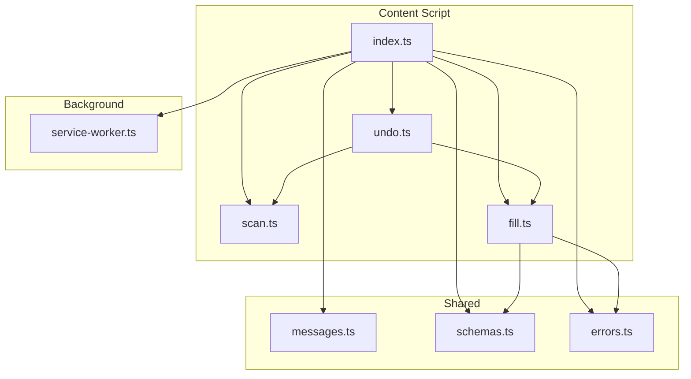
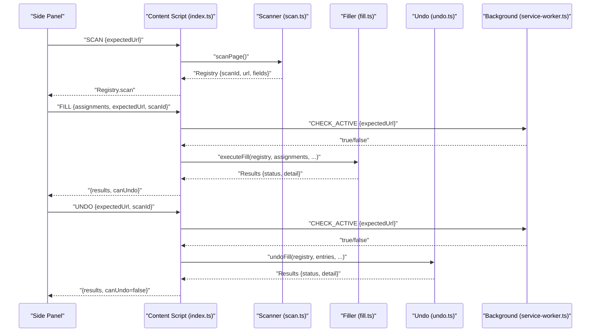
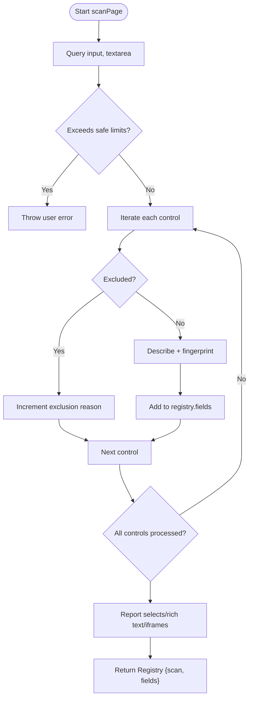
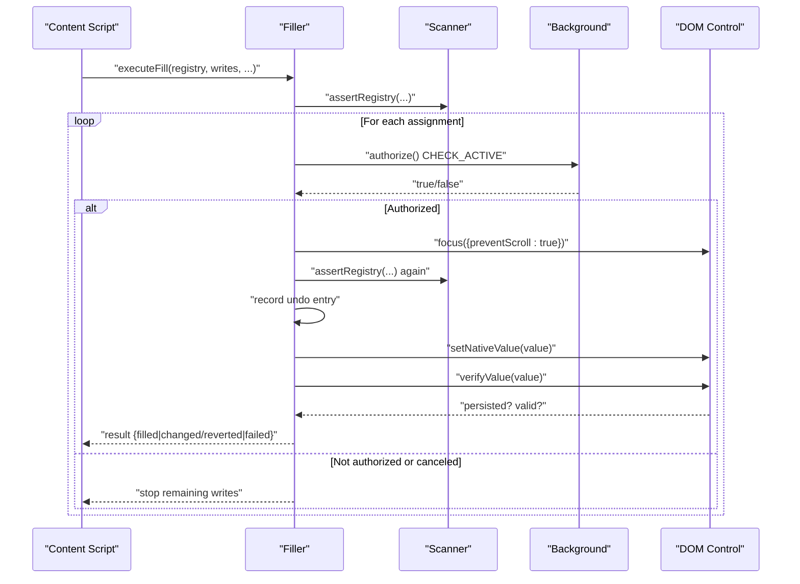
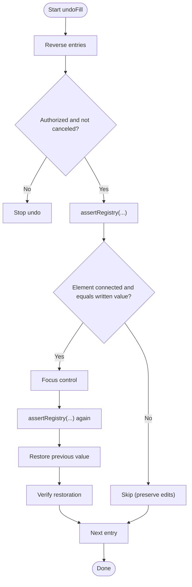
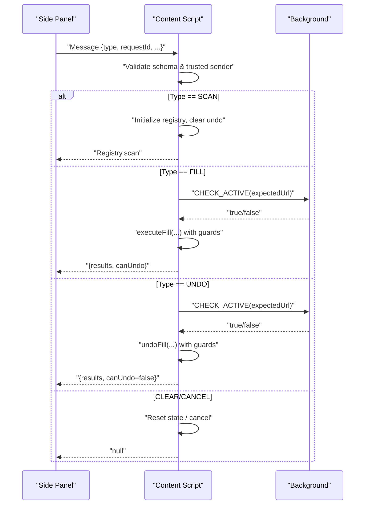
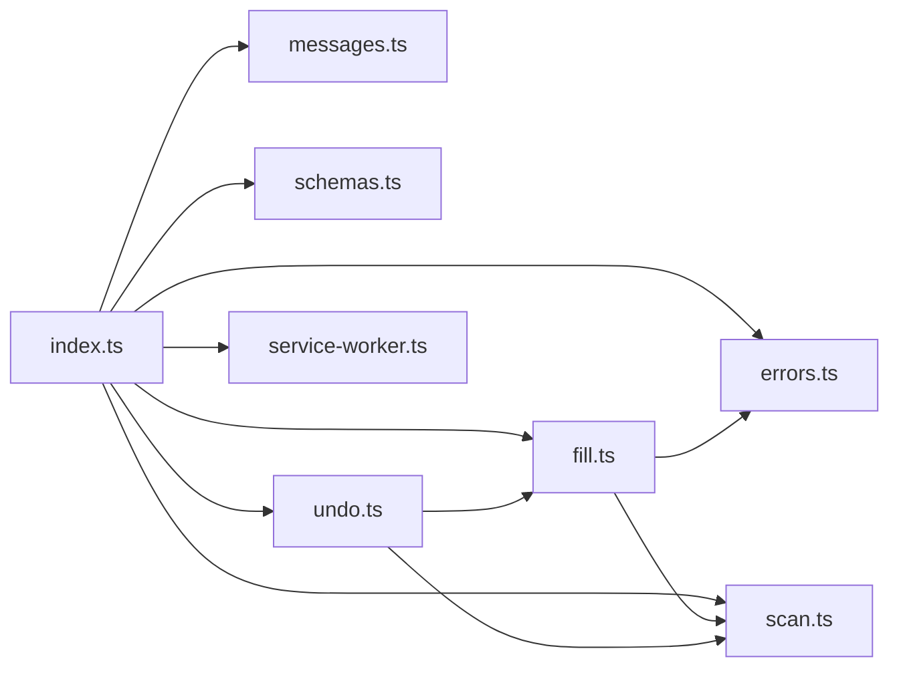

# Content Scripts

<cite>
**Referenced Files in This Document**
- [index.ts](file://src/content/index.ts)
- [scan.ts](file://src/content/scan.ts)
- [fill.ts](file://src/content/fill.ts)
- [undo.ts](file://src/content/undo.ts)
- [messages.ts](file://src/shared/messages.ts)
- [schemas.ts](file://src/shared/schemas.ts)
- [errors.ts](file://src/shared/errors.ts)
- [service-worker.ts](file://src/background/service-worker.ts)
</cite>

## Table of Contents
1. [Introduction](#introduction)
2. [Project Structure](#project-structure)
3. [Core Components](#core-components)
4. [Architecture Overview](#architecture-overview)
5. [Detailed Component Analysis](#detailed-component-analysis)
6. [Dependency Analysis](#dependency-analysis)
7. [Performance Considerations](#performance-considerations)
8. [Troubleshooting Guide](#troubleshooting-guide)
9. [Conclusion](#conclusion)

## Introduction
This document explains the content scripts that power the Help Me Fill extension’s interaction with web pages. It covers how forms are scanned, how field metadata is extracted and validated, how secure form filling occurs while preserving existing values, how undo restores original states, and how messages flow between the content script, side panel, and background service worker. It also outlines security measures against XSS and compatibility considerations across websites and frameworks.

## Project Structure
The content scripts live under src/content and coordinate scanning, filling, and undo operations. Shared types and message schemas are defined in src/shared, and the background service worker provides short-lived authorization checks.

**Diagram sources**
- [index.ts:1-72](file://src/content/index.ts#L1-L72)
- [scan.ts:1-88](file://src/content/scan.ts#L1-L88)
- [fill.ts:1-82](file://src/content/fill.ts#L1-L82)
- [undo.ts:1-29](file://src/content/undo.ts#L1-L29)
- [messages.ts:1-20](file://src/shared/messages.ts#L1-L20)
- [schemas.ts:1-39](file://src/shared/schemas.ts#L1-L39)
- [errors.ts:1-10](file://src/shared/errors.ts#L1-L10)
- [service-worker.ts:1-29](file://src/background/service-worker.ts#L1-L29)

**Section sources**
- [index.ts:1-72](file://src/content/index.ts#L1-L72)
- [scan.ts:1-88](file://src/content/scan.ts#L1-L88)
- [fill.ts:1-82](file://src/content/fill.ts#L1-L82)
- [undo.ts:1-29](file://src/content/undo.ts#L1-L29)
- [messages.ts:1-20](file://src/shared/messages.ts#L1-L20)
- [schemas.ts:1-39](file://src/shared/schemas.ts#L1-L39)
- [errors.ts:1-10](file://src/shared/errors.ts#L1-L10)
- [service-worker.ts:1-29](file://src/background/service-worker.ts#L1-L29)

## Core Components
- Content script entrypoint (index.ts): Initializes state, validates trusted origins, manages a registry of scanned fields, handles messages from the side panel, and orchestrates scan/fill/undo flows with cancellation and cleanup.
- Scanner (scan.ts): Discovers visible text controls, extracts labels and context, excludes unsupported or sensitive controls, builds a stable fingerprint per field, and validates that the page has not changed since scanning.
- Filler (fill.ts): Validates assignments, writes values using native setters to trigger framework-aware events, verifies persistence, and records undo entries.
- Undo (undo.ts): Reverses previously written values safely, preserving user edits when possible.
- Shared schemas and messages (schemas.ts, messages.ts, errors.ts): Define strict types for scans, mappings, write assignments, and error handling.
- Background service worker (service-worker.ts): Provides short-lived authorization checks to ensure the target tab remains active and on the expected URL.

**Section sources**
- [index.ts:1-72](file://src/content/index.ts#L1-L72)
- [scan.ts:1-88](file://src/content/scan.ts#L1-L88)
- [fill.ts:1-82](file://src/content/fill.ts#L1-L82)
- [undo.ts:1-29](file://src/content/undo.ts#L1-L29)
- [messages.ts:1-20](file://src/shared/messages.ts#L1-L20)
- [schemas.ts:1-39](file://src/shared/schemas.ts#L1-L39)
- [errors.ts:1-10](file://src/shared/errors.ts#L1-L10)
- [service-worker.ts:1-29](file://src/background/service-worker.ts#L1-L29)

## Architecture Overview
The content script acts as a secure bridge between the side panel and the page DOM. It only accepts messages from trusted contexts and enforces session integrity via scan IDs and URL checks. The background service worker performs brief authorization checks to confirm the target tab is still active and matches the expected URL.

**Diagram sources**
- [index.ts:22-68](file://src/content/index.ts#L22-L68)
- [scan.ts:62-87](file://src/content/scan.ts#L62-L87)
- [fill.ts:42-81](file://src/content/fill.ts#L42-L81)
- [undo.ts:6-28](file://src/content/undo.ts#L6-L28)
- [service-worker.ts:18-28](file://src/background/service-worker.ts#L18-L28)

## Detailed Component Analysis

### Form Field Scanning Algorithm
The scanner identifies supported input types, extracts metadata, and detects form structure changes.

- Supported elements: input and textarea nodes are considered; select, contenteditable, and iframe containers are reported as unsupported but do not block scanning.
- Visibility checks: Controls hidden via CSS, attributes like hidden/inert/aria-hidden, zero dimensions, or collapsed visibility are excluded.
- Label extraction: Uses aria-labelledby, aria-label, associated label elements, and nearest section headings to build human-readable context.
- Exclusions:
  - Unsupported input types beyond text/email/tel/url.
  - Disabled or read-only controls.
  - Hidden controls.
  - Autocomplete tokens indicating authentication or payment flows.
  - Potentially sensitive fields detected by name/label/placeholder/id patterns.
  - Values exceeding safety limits.
- Metadata captured: id, type, label, ariaLabel, placeholder, name, context, required, maxLength, pattern, currentValue.
- Fingerprinting: A deterministic signature per field based on descriptor plus DOM id, autocomplete, and form id to detect mutations.
- Integrity validation: assertRegistry ensures the page URL, scan ID, element connectivity, exclusion status, fingerprints, and total eligible field count remain unchanged before any fill or undo.

**Diagram sources**
- [scan.ts:62-87](file://src/content/scan.ts#L62-L87)
- [scan.ts:10-61](file://src/content/scan.ts#L10-L61)

**Section sources**
- [scan.ts:10-87](file://src/content/scan.ts#L10-L87)
- [schemas.ts:1-39](file://src/shared/schemas.ts#L1-L39)

### Secure Form Filling Mechanism
The filler validates assignments, writes values safely, triggers necessary events, and verifies persistence.

- Preflight validation:
  - Ensures all field IDs exist and are unique.
  - Confirms current field values match expected values to prevent race conditions.
  - Enforces overwrite policy: overwriting existing values requires explicit approval.
  - Validates value constraints (length, min/max, pattern, required).
- Safe writing:
  - Uses the native property setter for the control’s realm to ensure framework-aware behavior.
  - Dispatches input and change events and blurs the control to mimic real user interactions.
- Verification:
  - Waits for DOM updates and re-checks that the value persisted and validity holds.
  - Records undo entries before writing to enable restoration.
- Guarded execution:
  - Before each write, checks if the operation was canceled or if the target tab is no longer active via background authorization.
  - Re-validates registry integrity after focus to guard against focus handlers replacing or altering the control.

**Diagram sources**
- [fill.ts:42-81](file://src/content/fill.ts#L42-L81)
- [service-worker.ts:18-28](file://src/background/service-worker.ts#L18-L28)

**Section sources**
- [fill.ts:8-81](file://src/content/fill.ts#L8-L81)
- [messages.ts:4-17](file://src/shared/messages.ts#L4-L17)
- [schemas.ts:1-39](file://src/shared/schemas.ts#L1-L39)
- [errors.ts:1-10](file://src/shared/errors.ts#L1-L10)

### Undo Functionality
Undo reverses modifications by restoring previous values while respecting subsequent user edits.

- Iterates undo entries in reverse order.
- Skips restoration if the control is disconnected or its current value differs from the written value (indicating user or page edits).
- Focuses the control, re-validates registry integrity, then restores the previous value using the same safe mechanism as filling.
- Verifies restoration without enforcing validity to accommodate legitimate differences.

**Diagram sources**
- [undo.ts:6-28](file://src/content/undo.ts#L6-L28)

**Section sources**
- [undo.ts:1-29](file://src/content/undo.ts#L1-L29)
- [fill.ts:17-41](file://src/content/fill.ts#L17-L41)
- [scan.ts:77-87](file://src/content/scan.ts#L77-L87)

### Message Handling Between Contexts
The content script receives typed messages from the side panel, validates them, and routes to appropriate handlers.

- Trusted sender check: Only messages from the extension’s own runtime and the side panel origin are accepted.
- Message schema validation: Uses a discriminated union to enforce structure and reject invalid payloads.
- Session management:
  - SCAN initializes a new registry and clears undo/cancel state.
  - FILL executes assignments with preflight checks and returns results with undo capability.
  - UNDO restores previous values and disables further undo until next scan.
  - CLEAR resets state; CANCEL stops ongoing work.
- Connection tracking: Maintains a set of active side panel connections to gate operations and cancel on disconnect.
- Background authorization: Each write or undo step calls CHECK_ACTIVE to ensure the target tab remains active and matches the expected URL.

**Diagram sources**
- [index.ts:15-68](file://src/content/index.ts#L15-L68)
- [messages.ts:1-20](file://src/shared/messages.ts#L1-L20)
- [service-worker.ts:18-28](file://src/background/service-worker.ts#L18-L28)

**Section sources**
- [index.ts:15-68](file://src/content/index.ts#L15-L68)
- [messages.ts:1-20](file://src/shared/messages.ts#L1-L20)
- [service-worker.ts:18-28](file://src/background/service-worker.ts#L18-L28)

### Security Measures Against XSS and Unsafe Interactions
- Strict message validation: All incoming messages are parsed against a strict schema; invalid messages are rejected immediately.
- Origin and sender verification: Only messages from the extension’s own runtime and the side panel are accepted.
- Controlled DOM mutation: Values are written via the native property setter within the control’s realm, dispatching standard input/change events rather than synthetic events that could be intercepted or bypassed.
- Safety limits: Field counts, value lengths, and pattern sizes are bounded to mitigate resource exhaustion and injection risks.
- Integrity checks: assertRegistry prevents operations on stale or mutated forms, reducing risk of mis-targeted writes.
- Authorization gating: Each write/undo step verifies the target tab remains active and on the expected URL through the background service worker.

**Section sources**
- [index.ts:15-68](file://src/content/index.ts#L15-L68)
- [scan.ts:62-87](file://src/content/scan.ts#L62-L87)
- [fill.ts:17-41](file://src/content/fill.ts#L17-L41)
- [schemas.ts:1-39](file://src/shared/schemas.ts#L1-L39)
- [messages.ts:1-20](file://src/shared/messages.ts#L1-L20)
- [service-worker.ts:18-28](file://src/background/service-worker.ts#L18-L28)

### Compatibility Considerations Across Websites and Frameworks
- Framework-aware updates: Using the native value setter and dispatching input/change events ensures React, Vue, Angular, and other frameworks update their internal state correctly.
- Visibility detection: Handles common CSS hiding techniques and attributes to avoid interacting with invisible controls.
- Label and context extraction: Robustly gathers accessible names and nearby headings to aid AI mapping and user review.
- Exclusions for sensitive flows: Detects and avoids authentication and payment-related controls based on autocomplete tokens and naming patterns.
- Limits and resilience: Caps the number of fields and value sizes to handle large or complex pages gracefully.

**Section sources**
- [fill.ts:17-41](file://src/content/fill.ts#L17-L41)
- [scan.ts:10-61](file://src/content/scan.ts#L10-L61)
- [schemas.ts:1-39](file://src/shared/schemas.ts#L1-L39)

## Dependency Analysis
The content scripts have clear, layered dependencies:

**Diagram sources**
- [index.ts:1-72](file://src/content/index.ts#L1-L72)
- [scan.ts:1-88](file://src/content/scan.ts#L1-L88)
- [fill.ts:1-82](file://src/content/fill.ts#L1-L82)
- [undo.ts:1-29](file://src/content/undo.ts#L1-L29)
- [messages.ts:1-20](file://src/shared/messages.ts#L1-L20)
- [schemas.ts:1-39](file://src/shared/schemas.ts#L1-L39)
- [errors.ts:1-10](file://src/shared/errors.ts#L1-L10)
- [service-worker.ts:1-29](file://src/background/service-worker.ts#L1-L29)

**Section sources**
- [index.ts:1-72](file://src/content/index.ts#L1-L72)
- [scan.ts:1-88](file://src/content/scan.ts#L1-L88)
- [fill.ts:1-82](file://src/content/fill.ts#L1-L82)
- [undo.ts:1-29](file://src/content/undo.ts#L1-L29)
- [messages.ts:1-20](file://src/shared/messages.ts#L1-L20)
- [schemas.ts:1-39](file://src/shared/schemas.ts#L1-L39)
- [errors.ts:1-10](file://src/shared/errors.ts#L1-L10)
- [service-worker.ts:1-29](file://src/background/service-worker.ts#L1-L29)

## Performance Considerations
- Field and value limits: Prevents excessive memory usage and long-running operations on large forms.
- Efficient scanning: Early exits for hidden/disabled controls and capped traversal depth for label extraction.
- Batch operations: Preflight validation reduces the chance of partial failures mid-write.
- Asynchronous verification: Short waits and requestAnimationFrame usage minimize blocking while ensuring DOM updates settle.

[No sources needed since this section provides general guidance]

## Troubleshooting Guide
Common issues and resolutions:

- “Another operation is still running”: Wait for the current scan/fill/undo to complete or clear the session.
- “The page changed. Scan again.”: Navigate away or reload the page, then rescan.
- “Unknown or duplicate field ID”: Ensure the mapping plan references unique, valid field IDs from the latest scan.
- “Overwriting an existing value requires explicit approval”: Enable overwrite in the mapping plan for fields with existing values.
- “A field changed since review. Scan and review again.”: User or page modified a field; rescan and remap.
- “The target changed on focus”: Focus handlers may replace or alter the control; rescan and retry.
- “Undo stopped because the operation was canceled or the tab changed”: Ensure the tab remains active and not canceled.
- “Preserved a subsequent user or page edit”: Undo intentionally skipped to keep user edits intact.

**Section sources**
- [index.ts:22-68](file://src/content/index.ts#L22-L68)
- [fill.ts:42-81](file://src/content/fill.ts#L42-L81)
- [undo.ts:6-28](file://src/content/undo.ts#L6-L28)
- [errors.ts:1-10](file://src/shared/errors.ts#L1-L10)

## Conclusion
The content scripts provide a robust, secure, and framework-compatible way to scan, fill, and undo form fields. They enforce strict validation, maintain session integrity, and coordinate with the background service worker to ensure safe operations. By limiting scope, validating inputs, and verifying outcomes, the system minimizes risks and improves reliability across diverse websites.

[No sources needed since this section summarizes without analyzing specific files]