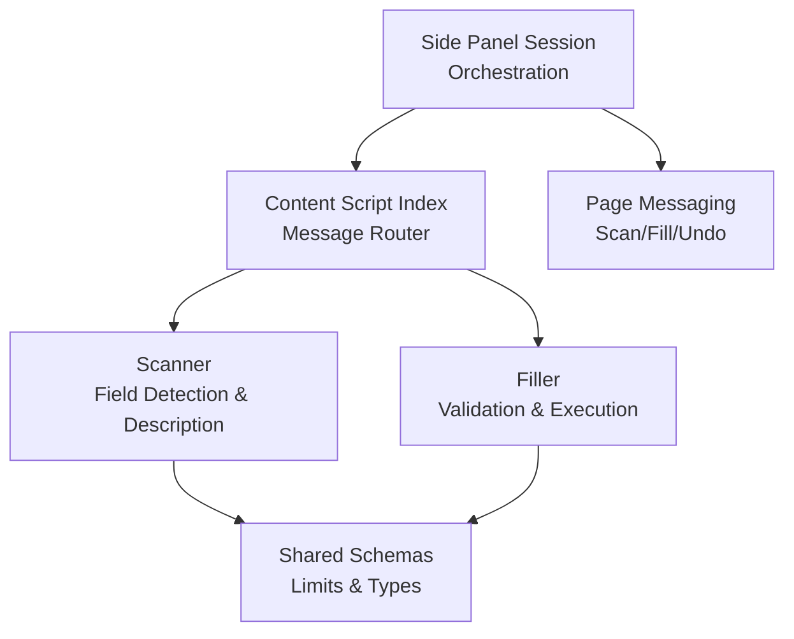
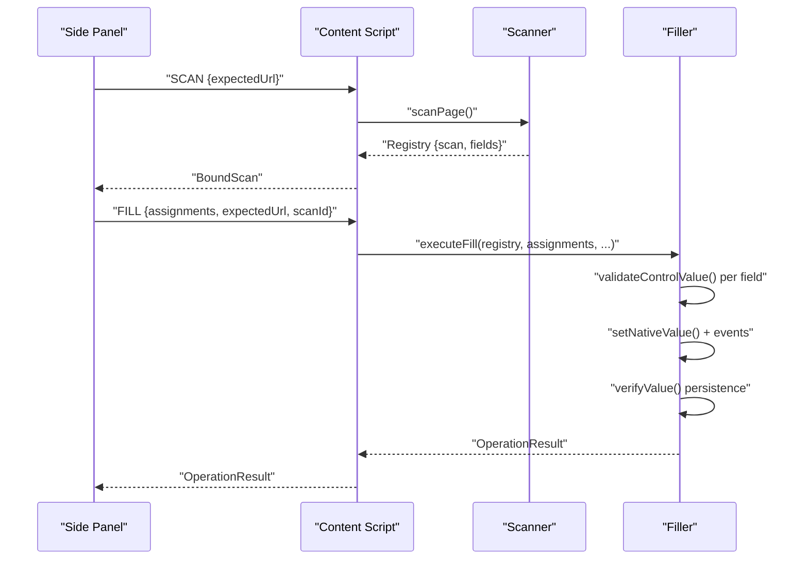
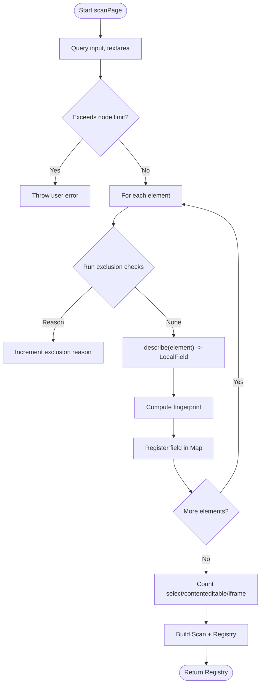
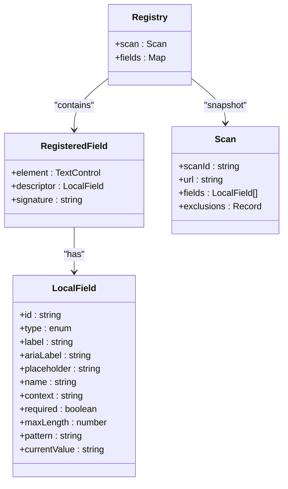
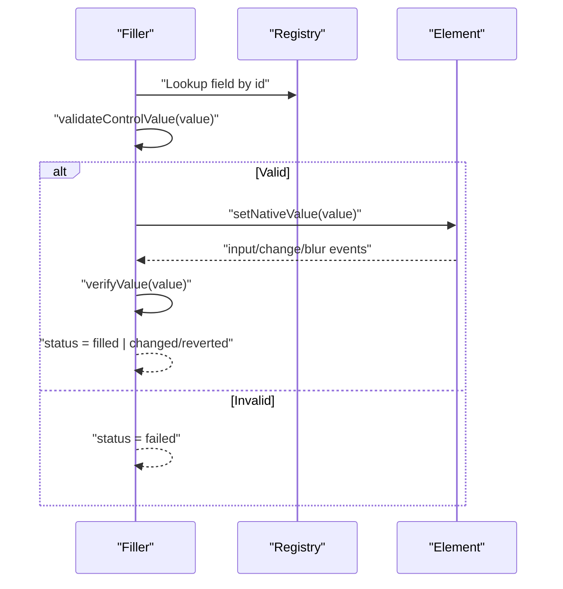
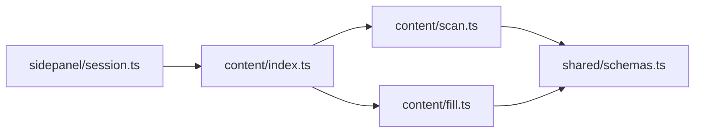

# Form Field Scanning & Analysis

<cite>
**Referenced Files in This Document**
- [scan.ts](file://src/content/scan.ts)
- [fill.ts](file://src/content/fill.ts)
- [schemas.ts](file://src/shared/schemas.ts)
- [index.ts](file://src/content/index.ts)
- [session.ts](file://src/sidepanel/session.ts)
- [filler.test.ts](file://tests/integration/filler.test.ts)
</cite>

## Table of Contents
1. [Introduction](#introduction)
2. [Project Structure](#project-structure)
3. [Core Components](#core-components)
4. [Architecture Overview](#architecture-overview)
5. [Detailed Component Analysis](#detailed-component-analysis)
6. [Dependency Analysis](#dependency-analysis)
7. [Performance Considerations](#performance-considerations)
8. [Troubleshooting Guide](#troubleshooting-guide)
9. [Conclusion](#conclusion)
10. [Appendices](#appendices)

## Introduction
This document explains the form field scanning and analysis system used to detect, describe, and safely fill input elements on web pages. It focuses on how supported fields are identified, how metadata is extracted (labels, placeholders, accessibility attributes, validation constraints), which inputs are excluded for safety, and how a registry maintains field information throughout a session. It also includes examples of scanned data structures and common edge cases encountered across different websites.

## Project Structure
The scanning and filling logic lives in the content script layer with shared schemas defining data contracts:
- Content scripts handle page scanning, execution guards, and value setting/validation.
- Shared schemas define limits, field descriptors, scan results, and operation results.
- Side panel orchestrates scanning and filling via messages and manages session state.

**Diagram sources**
- [index.ts:22-53](file://src/content/index.ts#L22-L53)
- [scan.ts:62-76](file://src/content/scan.ts#L62-L76)
- [fill.ts:42-81](file://src/content/fill.ts#L42-L81)
- [schemas.ts:3-39](file://src/shared/schemas.ts#L3-L39)
- [session.ts:55-84](file://src/sidepanel/session.ts#L55-L84)

**Section sources**
- [index.ts:1-72](file://src/content/index.ts#L1-L72)
- [scan.ts:1-88](file://src/content/scan.ts#L1-L88)
- [fill.ts:1-82](file://src/content/fill.ts#L1-L82)
- [schemas.ts:1-39](file://src/shared/schemas.ts#L1-L39)
- [session.ts:1-86](file://src/sidepanel/session.ts#L1-L86)

## Core Components
- Scanner: Discovers eligible text-like controls, describes them, applies exclusion rules, and builds a registry snapshot.
- Filler: Validates proposed values against native constraints, writes values safely, verifies persistence, and supports undo.
- Schemas: Define strict types and limits for fields, scans, and operations.
- Session: Manages lifecycle, messaging, and authorization checks between side panel and content script.

Key responsibilities:
- Supported input types: text, email, tel, url; textarea elements.
- Select dropdowns and rich text areas are not filled directly but are counted as unsupported during scanning.
- Metadata extraction: labels, aria-label/aria-labelledby, placeholder, name, context (fieldset legend or nearest heading), required, maxLength, pattern, currentValue.
- Exclusions: disabled/readonly, hidden, sensitive keywords, authentication/payment autocomplete tokens, oversized values/patterns, unsupported types.
- Registry: Maps stable IDs to registered fields with descriptors and signatures to detect changes.

**Section sources**
- [scan.ts:32-76](file://src/content/scan.ts#L32-L76)
- [schemas.ts:3-39](file://src/shared/schemas.ts#L3-L39)
- [filler.test.ts:22-46](file://tests/integration/filler.test.ts#L22-L46)

## Architecture Overview
The end-to-end flow starts from the side panel, triggers a scan in the content script, returns a structured scan result, then proceeds to mapping/review and optional fill/undo operations.

**Diagram sources**
- [session.ts:55-84](file://src/sidepanel/session.ts#L55-L84)
- [index.ts:22-53](file://src/content/index.ts#L22-L53)
- [scan.ts:62-76](file://src/content/scan.ts#L62-L76)
- [fill.ts:42-81](file://src/content/fill.ts#L42-L81)

## Detailed Component Analysis

### Scanner: Field Detection and Description
- Discovery: Queries all input and textarea elements. Enforces a hard cap on total nodes to prevent unsafe scans.
- Visibility check: Skips elements that are hidden, inert, aria-hidden, display:none, visibility:hidden/collapse, opacity:0, or have zero bounding rectangles.
- Label extraction: Uses explicit labels, aria-labelledby, aria-label, and trims whitespace. Avoids including nested control contents (select, option, button, output, contenteditable, etc.) when building label strings.
- Context grouping: Captures surrounding semantic context by reading fieldset legends or nearest section headings.
- Descriptor creation: Produces a LocalField with id, type, label, ariaLabel, placeholder, name, context, required, maxLength, pattern, and currentValue.
- Exclusion rules:
  - Unsupported input types: anything other than text, email, tel, url for inputs.
  - Disabled/readonly or aria-disabled.
  - Hidden controls.
  - Authentication/payment-related autocomplete tokens (e.g., cc-*, one-time-code, current-password, new-password, username).
  - Potentially sensitive fields detected via keyword matching across label, ariaLabel, placeholder, name, and element id.
  - Safety limits: value length exceeds configured limit or pattern too long.
- Unsupported elements: select, contenteditable, iframe are not filled and counted under exclusions.
- Registry construction:
  - Each accepted field gets a unique id and a signature derived from its descriptor plus DOM identity and autocomplete/form identifiers.
  - Returns a Scan object with scanId, url, fields array, and an exclusions tally.

**Diagram sources**
- [scan.ts:62-76](file://src/content/scan.ts#L62-L76)
- [scan.ts:47-61](file://src/content/scan.ts#L47-L61)
- [scan.ts:10-45](file://src/content/scan.ts#L10-L45)

**Section sources**
- [scan.ts:10-76](file://src/content/scan.ts#L10-L76)
- [schemas.ts:3-14](file://src/shared/schemas.ts#L3-L14)

### Exclusion Rules and Sensitive Input Filtering
- Type gating: Only text, email, tel, url inputs and textarea are eligible.
- State gating: Disabled, readonly, aria-disabled, or invisible elements are skipped.
- Autocomplete gating: Tokens indicating payment or authentication flows are excluded.
- Keyword gating: A comprehensive set of terms related to passwords, OTP/PIN/CVV, credit cards, bank accounts, IBAN, SSN, CAPTCHA, and equivalents in other languages cause exclusion.
- Size gating: Values exceeding configured limits or overly long patterns are rejected.

These rules ensure that sensitive or non-fillable controls are never included in the scan results.

**Section sources**
- [scan.ts:47-57](file://src/content/scan.ts#L47-L57)
- [schemas.ts:3](file://src/shared/schemas.ts#L3)

### Metadata Extraction: Labels, Placeholders, Accessibility, Validation
- Labels:
  - Explicit <label> associations are preferred.
  - aria-labelledby and aria-label provide accessible names.
  - Text content is gathered via a tree walker that excludes nested interactive/control elements to avoid leaking private values into labels.
- Placeholders and names: Truncated to safe lengths.
- Context: Legend of closest fieldset or nearest h1/h2/h3 within a section provides grouping context.
- Validation constraints:
  - required flag captured.
  - maxLength and pattern captured for inputs.
  - currentValue recorded at scan time.

**Section sources**
- [scan.ts:20-45](file://src/content/scan.ts#L20-L45)
- [schemas.ts:4-14](file://src/shared/schemas.ts#L4-L14)

### Registry Structure and Change Detection
- Registry holds:
  - scan: immutable snapshot with scanId, url, fields, and exclusions counts.
  - fields: Map from stable field id to RegisteredField containing element reference, descriptor, and signature.
- Signature-based integrity:
  - Each field’s signature encodes its descriptor and DOM identity markers. Any change to labels, ids, or autocomplete/form context invalidates the scan.
- Structural integrity:
  - assertRegistry validates that the document URL matches, the scanId matches, and no fields were added/removed/replaced after scanning.
  - If any field becomes ineligible due to exclusion rules post-scan, the registry is invalidated.

**Diagram sources**
- [scan.ts:4-6](file://src/content/scan.ts#L4-L6)
- [scan.ts:32-61](file://src/content/scan.ts#L32-L61)
- [schemas.ts:3-30](file://src/shared/schemas.ts#L3-L30)

**Section sources**
- [scan.ts:4-6](file://src/content/scan.ts#L4-L6)
- [scan.ts:77-87](file://src/content/scan.ts#L77-L87)
- [schemas.ts:25-30](file://src/shared/schemas.ts#L25-L30)

### Fill Execution and Verification
- Preflight validation:
  - Ensures all target fields exist and match expected values before any write.
  - Rejects overwriting existing values unless explicitly allowed.
  - Validates against native constraints (minLength, maxLength, validity, pattern).
- Safe writing:
  - Uses native value setters to trigger proper event handling without submitting forms.
  - Emits input, change, and blur events.
- Persistence verification:
  - Waives briefly and rechecks that the value persists and remains valid.
  - Reports status per field: filled, skipped, changed/reverted, failed.
- Undo support:
  - Records previous values to restore later if needed.

**Diagram sources**
- [fill.ts:8-41](file://src/content/fill.ts#L8-L41)
- [fill.ts:42-81](file://src/content/fill.ts#L42-L81)

**Section sources**
- [fill.ts:8-81](file://src/content/fill.ts#L8-L81)

### Edge Cases and Common Patterns Across Websites
- Nested controls inside labels: The scanner avoids pulling inner control contents into labels to prevent leaking private values.
- Controlled components: Some frameworks synchronize defaultValue into text nodes; the scanner handles this by excluding control nodes from label text.
- Dynamic forms: Fields may be added/removed or replaced; assertRegistry detects structural changes and aborts filling.
- Focus handlers altering values: The filler re-checks after focus to guard against runtime replacements.
- Reversion after render: The filler waits and re-verifies to detect page-driven reversion.
- Overwrite protection: Existing values require explicit approval to overwrite.

**Section sources**
- [filler.test.ts:22-46](file://tests/integration/filler.test.ts#L22-L46)
- [filler.test.ts:47-129](file://tests/integration/filler.test.ts#L47-L129)
- [scan.ts:20-45](file://src/content/scan.ts#L20-L45)
- [scan.ts:77-87](file://src/content/scan.ts#L77-L87)
- [fill.ts:66-73](file://src/content/fill.ts#L66-L73)

## Dependency Analysis
- Content index depends on scanner and filler modules to route messages and manage lifecycle.
- Scanner depends on shared schemas for limits and types.
- Filler depends on scanner’s registry and shared schemas for validation and result types.
- Side panel session coordinates scanning and filling via message passing and enforces tab/page identity checks.

**Diagram sources**
- [index.ts:1-72](file://src/content/index.ts#L1-L72)
- [scan.ts:1-88](file://src/content/scan.ts#L1-L88)
- [fill.ts:1-82](file://src/content/fill.ts#L1-L82)
- [schemas.ts:1-39](file://src/shared/schemas.ts#L1-L39)
- [session.ts:1-86](file://src/sidepanel/session.ts#L1-L86)

**Section sources**
- [index.ts:1-72](file://src/content/index.ts#L1-L72)
- [session.ts:1-86](file://src/sidepanel/session.ts#L1-L86)

## Performance Considerations
- Node count limit: Prevents scanning extremely large forms by throwing early.
- Field count limit: Caps the number of supported fields to keep UI and processing manageable.
- Value and pattern size limits: Protects memory and AI payload sizes.
- Efficient label traversal: Tree walker with depth and length caps avoids expensive DOM walks.
- Minimal event churn: Native setter usage ensures correct behavior with minimal overhead.

[No sources needed since this section provides general guidance]

## Troubleshooting Guide
Common issues and resolutions:
- Page changed during operation: assertRegistry detects URL/scanId mismatches or structural changes; re-scan the page.
- Unknown or duplicate field ID: Ensure assignments reference valid fieldIds from the latest scan.
- Outdated scan ID: Always pass the current scanId returned by the scan.
- Changed labels or replaced elements: Signature mismatch indicates DOM changes; re-scan.
- Added fields after scan: Structural mismatch detected; re-scan.
- Overwrite protection: Set allowOverwrite when intentionally replacing existing values.
- Tab authorization failure: Ensure the target tab remains active and authorized.
- Cancellation: Canceling mid-operation stops remaining writes.

**Section sources**
- [scan.ts:77-87](file://src/content/scan.ts#L77-L87)
- [fill.ts:42-81](file://src/content/fill.ts#L42-L81)
- [session.ts:44-84](file://src/sidepanel/session.ts#L44-L84)

## Conclusion
The scanning system robustly identifies and describes eligible text-like fields while excluding sensitive or unsupported controls. It captures rich metadata for downstream mapping and fills values safely with strong guarantees about integrity and persistence. The registry and assertion mechanisms protect against dynamic page changes, ensuring reliable execution. Together with clear schemas and side panel orchestration, this design provides a secure and predictable form-filling experience across diverse websites.

[No sources needed since this section summarizes without analyzing specific files]

## Appendices

### Example Scanned Field Data Structures
- LocalField fields include: id, type (text/email/tel/url/textarea), label, ariaLabel, placeholder, name, context, required, maxLength, pattern, currentValue.
- Scan includes: scanId, url, fields array, and exclusions map counting reasons like “Unsupported input type”, “Disabled or read-only”, “Hidden controls”, “Authentication or payment controls”, “Potentially sensitive controls”, “Control exceeds safety limits”, and “Selects, rich text, or iframe containers”.

**Section sources**
- [schemas.ts:4-30](file://src/shared/schemas.ts#L4-L30)
- [scan.ts:32-76](file://src/content/scan.ts#L32-L76)

### Supported vs Unsupported Inputs
- Supported: text, email, tel, url inputs; textarea.
- Not filled directly: select, contenteditable, iframe (counted as unsupported).
- Radio/checkbox groups: Not part of the supported set for filling; they are excluded by type gating.

**Section sources**
- [scan.ts:47-57](file://src/content/scan.ts#L47-L57)
- [scan.ts:73-75](file://src/content/scan.ts#L73-L75)
- [schemas.ts:4-14](file://src/shared/schemas.ts#L4-L14)