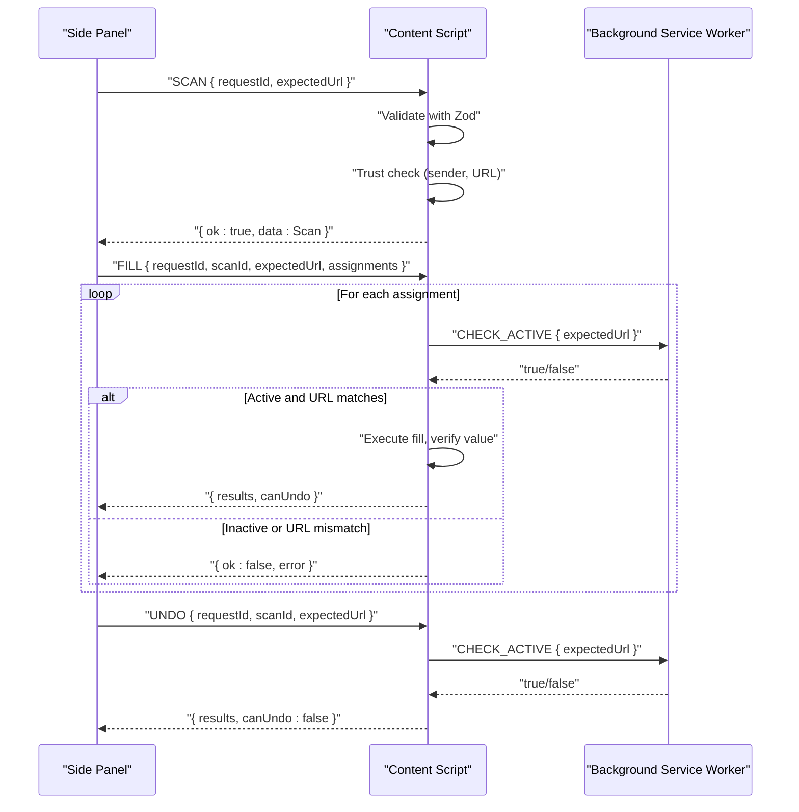
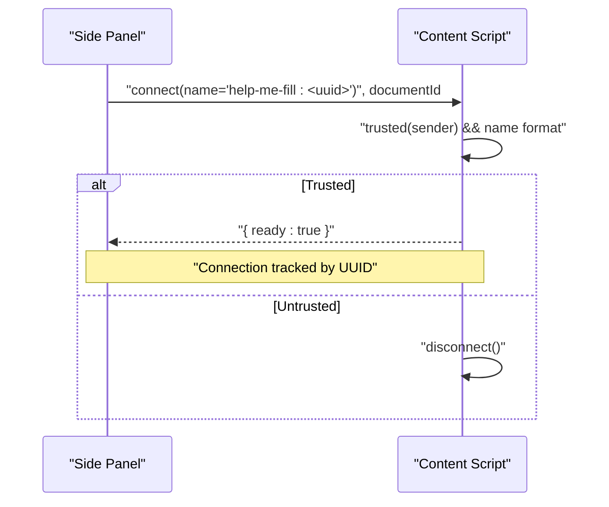
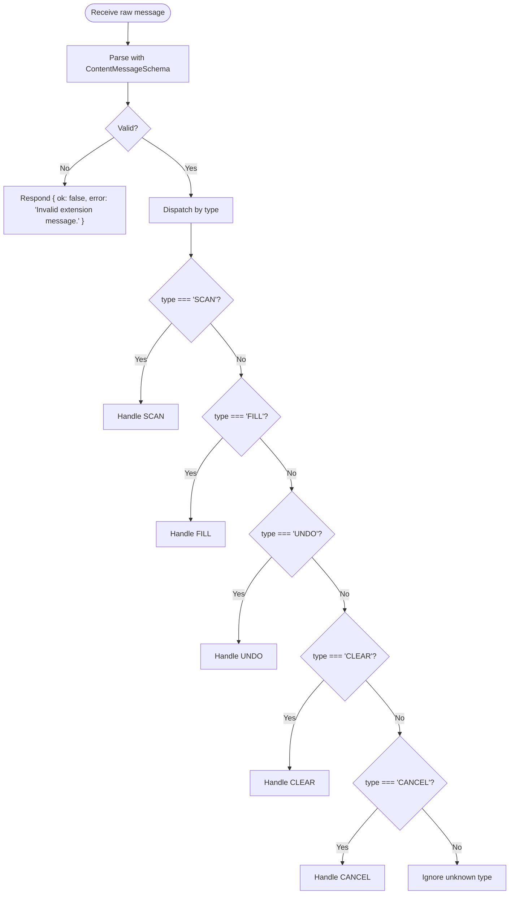
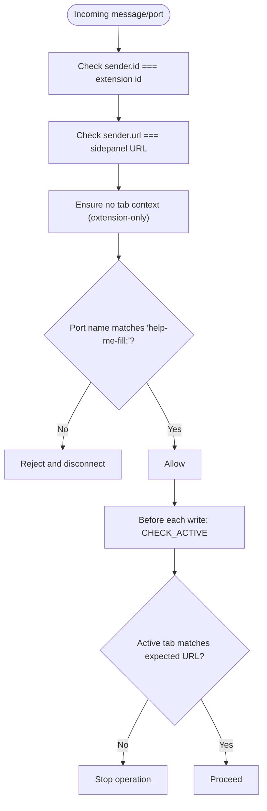
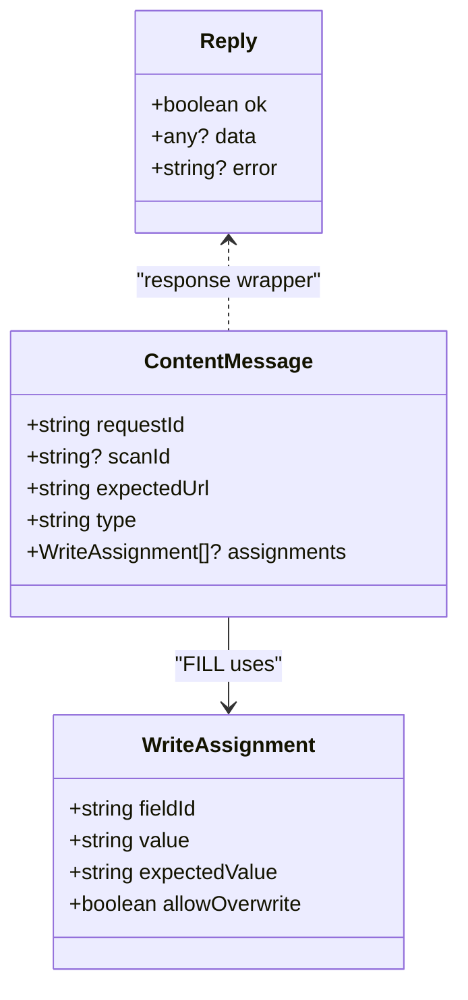
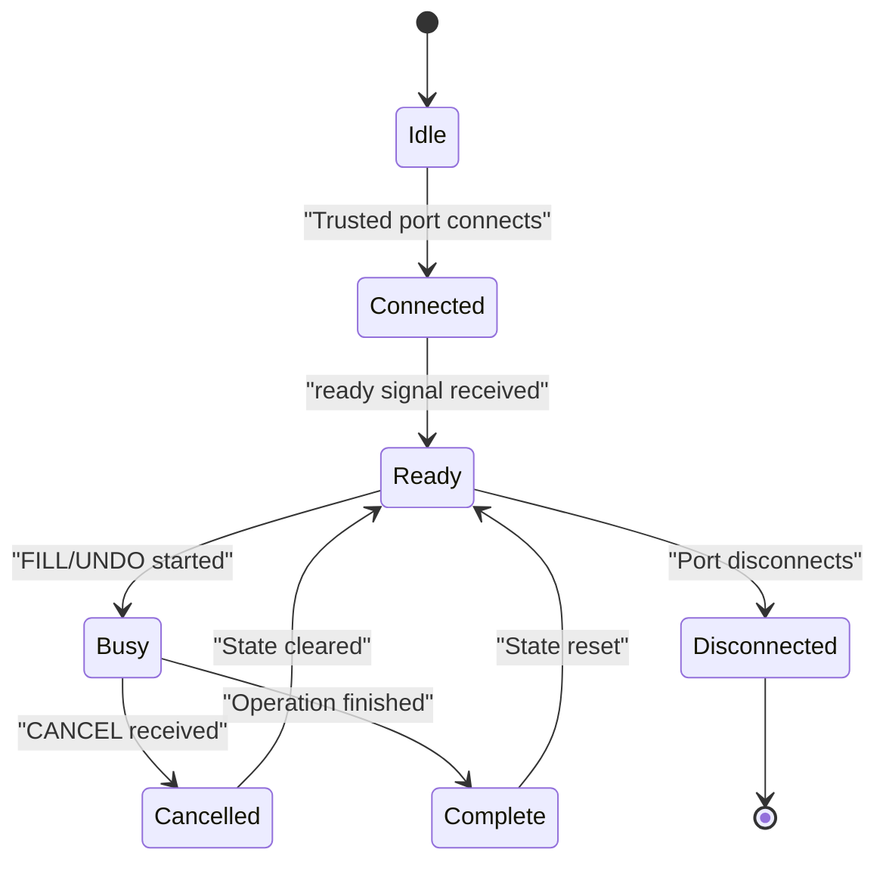
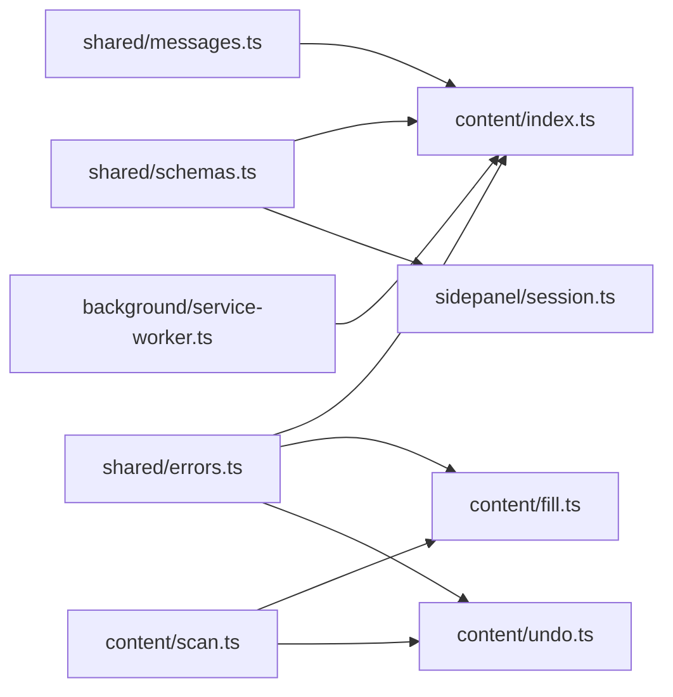

# Page Communication & Message Handling

<cite>
**Referenced Files in This Document**
- [index.ts](file://src/content/index.ts)
- [messages.ts](file://src/shared/messages.ts)
- [schemas.ts](file://src/shared/schemas.ts)
- [errors.ts](file://src/shared/errors.ts)
- [scan.ts](file://src/content/scan.ts)
- [fill.ts](file://src/content/fill.ts)
- [undo.ts](file://src/content/undo.ts)
- [session.ts](file://src/sidepanel/session.ts)
- [service-worker.ts](file://src/background/service-worker.ts)
- [manifest.json](file://src/manifest.json)
</cite>

## Table of Contents
1. [Introduction](#introduction)
2. [Project Structure](#project-structure)
3. [Core Components](#core-components)
4. [Architecture Overview](#architecture-overview)
5. [Detailed Component Analysis](#detailed-component-analysis)
6. [Dependency Analysis](#dependency-analysis)
7. [Performance Considerations](#performance-considerations)
8. [Troubleshooting Guide](#troubleshooting-guide)
9. [Conclusion](#conclusion)

## Introduction
This document explains how the extension’s content script coordinates secure, validated communication between the side panel and web pages. It covers:
- Secure connection establishment using Chrome Extension ports
- Message validation with Zod schemas
- Request/response patterns for SCAN, FILL, UNDO, CANCEL, CLEAR
- Trust model that validates message senders and prevents unauthorized access
- Lifecycle management of connections and error handling strategies
- Security measures against XSS and page tampering

The goal is to ensure only the extension’s side panel can communicate with content scripts on a given tab and document, and that all messages are strictly typed and bounded.

## Project Structure
The communication spans three runtime contexts:
- Side Panel: initiates operations and manages session state
- Content Script: runs in the target page context, performs scanning and filling
- Background Service Worker: provides short-lived authorization checks

```mermaid
graph TB
SP["Side Panel<br/>session.ts"] --> |chrome.tabs.sendMessage| CS["Content Script<br/>index.ts"]
SP --> |chrome.tabs.connect (port)| CS
CS --> |onMessage handler| CS
CS --> |validate with Zod| CS
CS --> |execute scan/fill/undo| CS
CS --> |runtime.onConnect| CS
CS --> |sendMessage CHECK_ACTIVE| BG["Background Service Worker<br/>service-worker.ts"]
BG --> |respond true/false| CS
```

**Diagram sources**
- [session.ts:48-85](file://src/sidepanel/session.ts#L48-L85)
- [index.ts:15-69](file://src/content/index.ts#L15-L69)
- [service-worker.ts:18-28](file://src/background/service-worker.ts#L18-L28)

**Section sources**
- [index.ts:1-72](file://src/content/index.ts#L1-L72)
- [session.ts:1-86](file://src/sidepanel/session.ts#L1-L86)
- [service-worker.ts:1-29](file://src/background/service-worker.ts#L1-L29)

## Core Components
- Message schema and types: strict validation via Zod ensures safe payloads and bounded sizes.
- Connection lifecycle: port-based handshake with readiness signaling and cleanup.
- Trust model: sender identity and URL verification; background authorization for active tab.
- Operation handlers: SCAN, FILL, UNDO, CANCEL, CLEAR with guarded execution and undo tracking.
- Error handling: normalized user-facing errors and cancellation support.

**Section sources**
- [messages.ts:1-20](file://src/shared/messages.ts#L1-L20)
- [schemas.ts:1-39](file://src/shared/schemas.ts#L1-L39)
- [errors.ts:1-10](file://src/shared/errors.ts#L1-L10)
- [index.ts:15-69](file://src/content/index.ts#L15-L69)

## Architecture Overview
The flow begins when the side panel requests a scan or fill operation. The content script validates the request, enforces trust, and executes safely while maintaining an active connection to the review panel. A background check confirms the target tab remains active and matches the expected URL before each write.



**Diagram sources**
- [session.ts:55-85](file://src/sidepanel/session.ts#L55-L85)
- [index.ts:22-69](file://src/content/index.ts#L22-L69)
- [service-worker.ts:18-28](file://src/background/service-worker.ts#L18-L28)

## Detailed Component Analysis

### Secure Connection Establishment
- Port handshake: The side panel connects via chrome.tabs.connect with a name containing a UUID. The content script accepts only trusted senders and matching port names, then signals readiness.
- Readiness protocol: The content script posts a ready signal; the side panel waits for it before proceeding.
- Cleanup: On disconnect, the content script removes the connection ID from its set, ensuring subsequent operations fail if the panel closes mid-operation.



**Diagram sources**
- [index.ts:15-21](file://src/content/index.ts#L15-L21)
- [session.ts:71-85](file://src/sidepanel/session.ts#L71-L85)

**Section sources**
- [index.ts:15-21](file://src/content/index.ts#L15-L21)
- [session.ts:71-85](file://src/sidepanel/session.ts#L71-L85)

### Message Validation with Zod Schemas
- All incoming messages are parsed with a discriminated union schema that enforces type, required fields, and limits.
- Write assignments are validated for field IDs, values, and overwrite permissions.
- Limits prevent oversized payloads and excessive fields.



**Diagram sources**
- [index.ts:54-69](file://src/content/index.ts#L54-L69)
- [messages.ts:1-20](file://src/shared/messages.ts#L1-L20)

**Section sources**
- [messages.ts:1-20](file://src/shared/messages.ts#L1-L20)
- [schemas.ts:1-39](file://src/shared/schemas.ts#L1-L39)
- [index.ts:54-69](file://src/content/index.ts#L54-L69)

### Trust Model and Authorization
- Sender trust: Only messages from the extension’s own runtime ID and the side panel URL are accepted. Tab context must be absent to ensure the sender is the extension UI.
- Port trust: Connections require a name matching the pattern help-me-fill:<uuid>, preventing arbitrary ports.
- Background authorization: Before each write, the content script asks the background service worker to confirm the target tab is active and matches the expected URL.



**Diagram sources**
- [index.ts:13-17](file://src/content/index.ts#L13-L17)
- [service-worker.ts:18-28](file://src/background/service-worker.ts#L18-L28)

**Section sources**
- [index.ts:13-17](file://src/content/index.ts#L13-L17)
- [service-worker.ts:18-28](file://src/background/service-worker.ts#L18-L28)

### Request/Response Patterns and Message Types
- SCAN
  - Purpose: Build a registry of form fields on the current page.
  - Parameters: requestId, expectedUrl
  - Response: Scan object with scanId, url, fields, exclusions
  - Errors: If the page changed since the request was issued, or too many controls
- FILL
  - Purpose: Fill one or more fields based on reviewed assignments.
  - Parameters: requestId, scanId, expectedUrl, assignments (array of fieldId, value, expectedValue, allowOverwrite)
  - Response: results array per field with status and detail; canUndo flag
  - Errors: Unknown/duplicate field IDs, value constraints, target changes, cancellation
- UNDO
  - Purpose: Revert previously filled fields using recorded undo entries.
  - Parameters: requestId, scanId, expectedUrl
  - Response: results array with restored/failed statuses; canUndo false
  - Errors: Target changes during undo, cancellation
- CANCEL
  - Purpose: Immediately stop ongoing operations.
  - Parameters: requestId
  - Response: null
- CLEAR
  - Purpose: Reset internal state (registry, undo stack, completed tasks).
  - Parameters: requestId
  - Response: null



**Diagram sources**
- [messages.ts:4-19](file://src/shared/messages.ts#L4-L19)
- [schemas.ts:33-38](file://src/shared/schemas.ts#L33-L38)

**Section sources**
- [messages.ts:4-19](file://src/shared/messages.ts#L4-L19)
- [schemas.ts:33-38](file://src/shared/schemas.ts#L33-L38)
- [index.ts:22-52](file://src/content/index.ts#L22-L52)

### Lifecycle Management of Connections
- Registration: When a trusted port connects, the UUID is extracted and stored in a connections set.
- Readiness: The content script posts a ready signal; the side panel waits up to a timeout before rejecting stale connections.
- Termination: On disconnect, the UUID is removed from the set. Page hide events clear all state to avoid leaks.
- Guarded operations: During FILL/UNDO, operations check both cancellation and connection presence per step.



**Diagram sources**
- [index.ts:15-21](file://src/content/index.ts#L15-L21)
- [index.ts:22-52](file://src/content/index.ts#L22-L52)
- [index.ts:70-71](file://src/content/index.ts#L70-L71)

**Section sources**
- [index.ts:15-21](file://src/content/index.ts#L15-L21)
- [index.ts:22-52](file://src/content/index.ts#L22-L52)
- [index.ts:70-71](file://src/content/index.ts#L70-L71)

### Error Handling Strategies
- Normalized errors: UserError instances produce concise, user-friendly messages; other errors are wrapped into a generic failure message.
- Cancellation: Abort signals and explicit cancel flags stop long-running operations early.
- Validation failures: Invalid messages return structured responses with ok: false and descriptive errors.
- Operational safety: Each write verifies the target state and re-checks authorization before proceeding.

**Section sources**
- [errors.ts:1-10](file://src/shared/errors.ts#L1-L10)
- [index.ts:54-69](file://src/content/index.ts#L54-L69)
- [fill.ts:42-81](file://src/content/fill.ts#L42-L81)
- [undo.ts:6-28](file://src/content/undo.ts#L6-L28)

### Security Measures Against XSS and Page Tampering
- Strict message parsing: Zod schemas enforce exact shapes and limits, preventing injection via malformed payloads.
- Origin and sender checks: Only extension-owned contexts are accepted; tab context must be absent for direct messages.
- Port naming policy: Only ports named with the expected UUID pattern are allowed.
- Registry integrity: Scans capture field signatures and validate them before writes; any DOM mutation invalidates the scan.
- Value normalization checks: Values are validated against native browser constraints to avoid unexpected behavior.
- CSP and permissions: Manifest restricts script sources and grants minimal necessary permissions.

**Section sources**
- [messages.ts:1-20](file://src/shared/messages.ts#L1-L20)
- [index.ts:13-17](file://src/content/index.ts#L13-L17)
- [scan.ts:62-87](file://src/content/scan.ts#L62-L87)
- [fill.ts:8-16](file://src/content/fill.ts#L8-L16)
- [manifest.json:1-19](file://src/manifest.json#L1-L19)

## Dependency Analysis
- Content script depends on shared schemas and errors for validation and messaging contracts.
- Side panel depends on shared schemas and messages to construct valid requests and parse responses.
- Background service worker provides a lightweight authorization gate without exposing sensitive logic.



**Diagram sources**
- [index.ts:1-6](file://src/content/index.ts#L1-L6)
- [session.ts:1-4](file://src/sidepanel/session.ts#L1-L4)
- [fill.ts:1-5](file://src/content/fill.ts#L1-L5)
- [undo.ts:1-5](file://src/content/undo.ts#L1-L5)
- [service-worker.ts:18-28](file://src/background/service-worker.ts#L18-L28)

**Section sources**
- [index.ts:1-6](file://src/content/index.ts#L1-L6)
- [session.ts:1-4](file://src/sidepanel/session.ts#L1-L4)
- [fill.ts:1-5](file://src/content/fill.ts#L1-L5)
- [undo.ts:1-5](file://src/content/undo.ts#L1-L5)
- [service-worker.ts:18-28](file://src/background/service-worker.ts#L18-L28)

## Performance Considerations
- Bounded payloads: Limits on bytes, characters, fields, and response size reduce memory pressure and network overhead.
- Preflight validation: Full preflight of assignments avoids partial writes and reduces retries.
- Verification delays: Short waits after setting values ensure asynchronous updates settle before confirming success.
- Connection reuse: Port-based handshake avoids repeated injections and keeps sessions efficient.

[No sources needed since this section provides general guidance]

## Troubleshooting Guide
- “Invalid extension message”: Indicates a malformed payload; verify schema compliance and limits.
- “Another operation is still running”: Wait for completion or send CANCEL/CLEAR to reset state.
- “The page changed. Scan again.”: The URL or DOM changed; re-scan to refresh the registry.
- “The review panel is no longer connected.”: The side panel closed or disconnected; reconnect and retry.
- “The target tab or page changed”: Background authorization failed; ensure the correct tab is active and URL matches.
- “Page did not acknowledge the review panel”: Port handshake timed out; re-scan to establish a fresh connection.

**Section sources**
- [index.ts:22-52](file://src/content/index.ts#L22-L52)
- [session.ts:44-54](file://src/sidepanel/session.ts#L44-L54)
- [service-worker.ts:18-28](file://src/background/service-worker.ts#L18-L28)

## Conclusion
The content script’s message handling system combines strict schema validation, robust trust checks, and careful lifecycle management to enable secure communication between the side panel and web pages. By validating senders, enforcing connection policies, and verifying the active tab before each write, the extension minimizes risks from unauthorized access and page tampering while providing a reliable, user-friendly filling experience.