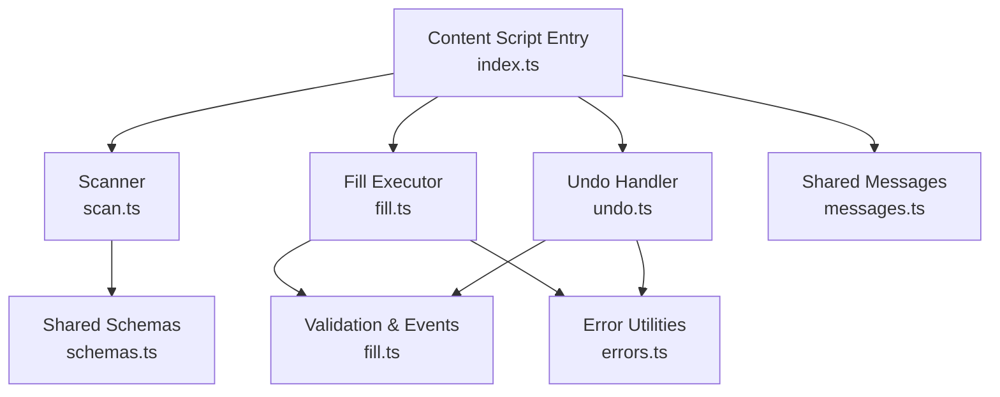
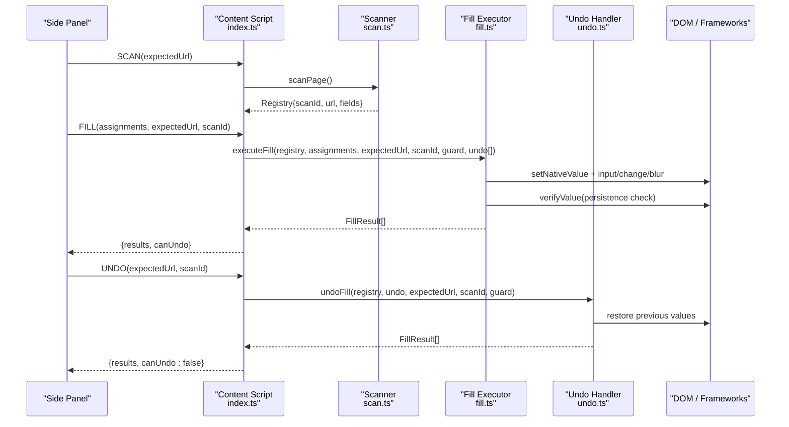
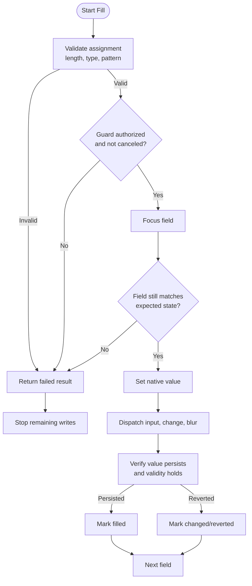
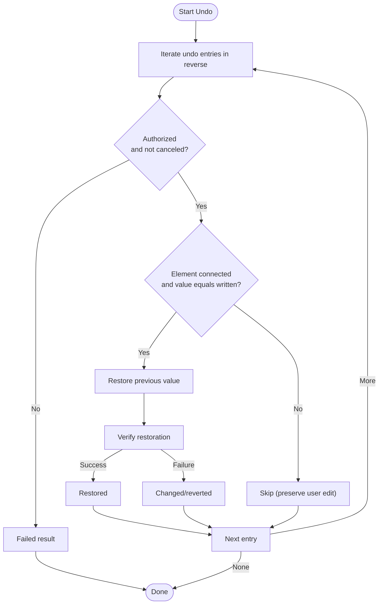
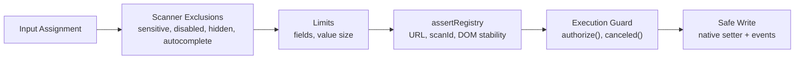
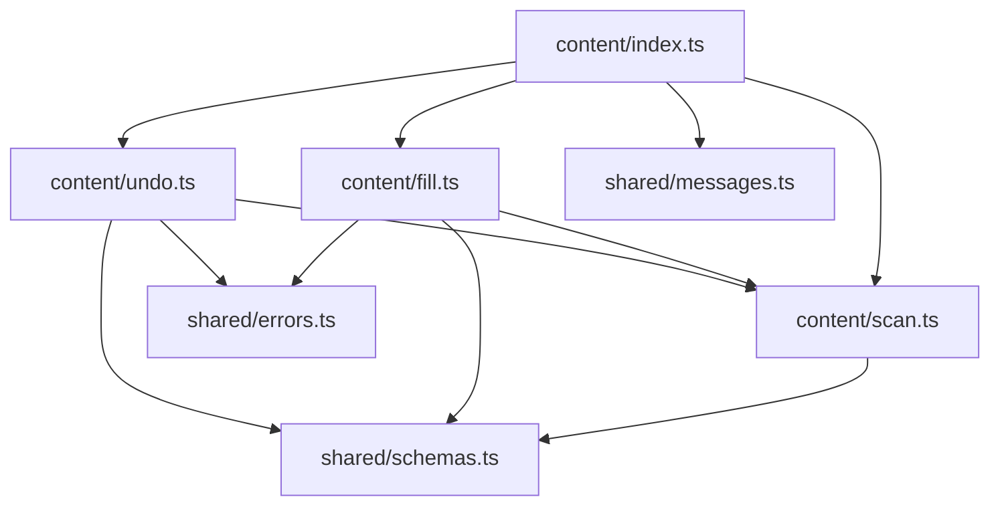

# Safe Form Population

<cite>
**Referenced Files in This Document**
- [fill.ts](file://src/content/fill.ts)
- [undo.ts](file://src/content/undo.ts)
- [scan.ts](file://src/content/scan.ts)
- [index.ts](file://src/content/index.ts)
- [errors.ts](file://src/shared/errors.ts)
- [schemas.ts](file://src/shared/schemas.ts)
- [messages.ts](file://src/shared/messages.ts)
- [filler.test.ts](file://tests/integration/filler.test.ts)
- [forms.tsx](file://tests/fixtures/forms.tsx)
</cite>

## Table of Contents
1. [Introduction](#introduction)
2. [Project Structure](#project-structure)
3. [Core Components](#core-components)
4. [Architecture Overview](#architecture-overview)
5. [Detailed Component Analysis](#detailed-component-analysis)
6. [Dependency Analysis](#dependency-analysis)
7. [Performance Considerations](#performance-considerations)
8. [Troubleshooting Guide](#troubleshooting-guide)
9. [Conclusion](#conclusion)
10. [Appendices](#appendices)

## Introduction
This document explains the safe form filling mechanism that populates form fields while preserving existing values, validating inputs, and triggering framework-compatible DOM events. It covers:
- Field population strategy across supported input types
- Event dispatching to ensure compatibility with React, Vue, and Angular
- The undo entry system that tracks all modifications during fill operations
- Security measures that prevent filling of protected fields, validate target URLs, and handle concurrent operations
- Error handling for failed field populations, page changes, and user cancellations
- Examples of successful fills, partial failures, and recovery procedures

## Project Structure
The safe form filling feature is implemented in the content script layer with supporting shared schemas and messages. Key responsibilities:
- Scanning and describing form fields safely
- Validating and executing writes against a stable registry snapshot
- Dispatching native DOM events to keep frameworks in sync
- Tracking undo entries and restoring previous values
- Enforcing security constraints and concurrency controls

**Diagram sources**
- [index.ts:1-72](file://src/content/index.ts#L1-L72)
- [scan.ts:1-88](file://src/content/scan.ts#L1-L88)
- [fill.ts:1-82](file://src/content/fill.ts#L1-L82)
- [undo.ts:1-29](file://src/content/undo.ts#L1-L29)
- [schemas.ts:1-39](file://src/shared/schemas.ts#L1-L39)
- [messages.ts:1-20](file://src/shared/messages.ts#L1-L20)
- [errors.ts:1-10](file://src/shared/errors.ts#L1-L10)

**Section sources**
- [index.ts:1-72](file://src/content/index.ts#L1-L72)
- [scan.ts:1-88](file://src/content/scan.ts#L1-L88)
- [fill.ts:1-82](file://src/content/fill.ts#L1-L82)
- [undo.ts:1-29](file://src/content/undo.ts#L1-L29)
- [schemas.ts:1-39](file://src/shared/schemas.ts#L1-L39)
- [messages.ts:1-20](file://src/shared/messages.ts#L1-L20)
- [errors.ts:1-10](file://src/shared/errors.ts#L1-L10)

## Core Components
- Scanner (scan.ts): Discovers eligible text controls, builds descriptors, enforces safety limits, and produces a stable registry snapshot used throughout execution.
- Fill Executor (fill.ts): Validates assignments, sets native values, triggers framework-compatible events, verifies persistence, and records undo entries.
- Undo Handler (undo.ts): Reverses previously written values safely, preserving subsequent user edits when detected.
- Content Script Orchestrator (index.ts): Manages lifecycle, concurrency, trusted connections, message routing, and guard-based authorization.
- Shared Contracts (schemas.ts, messages.ts): Define strict validation for messages, scan results, and operation outcomes.
- Error Utilities (errors.ts): Normalize error reporting and cancellation signals.

**Section sources**
- [scan.ts:1-88](file://src/content/scan.ts#L1-L88)
- [fill.ts:1-82](file://src/content/fill.ts#L1-L82)
- [undo.ts:1-29](file://src/content/undo.ts#L1-L29)
- [index.ts:1-72](file://src/content/index.ts#L1-L72)
- [schemas.ts:1-39](file://src/shared/schemas.ts#L1-L39)
- [messages.ts:1-20](file://src/shared/messages.ts#L1-L20)
- [errors.ts:1-10](file://src/shared/errors.ts#L1-L10)

## Architecture Overview
The safe fill flow ensures that only validated, authorized, and stable writes are applied to the DOM while maintaining framework state consistency and providing undo support.

**Diagram sources**
- [index.ts:22-52](file://src/content/index.ts#L22-L52)
- [scan.ts:62-88](file://src/content/scan.ts#L62-L88)
- [fill.ts:42-81](file://src/content/fill.ts#L42-L81)
- [undo.ts:6-28](file://src/content/undo.ts#L6-L28)

## Detailed Component Analysis

### Field Population Strategy
- Supported input types: text, email, tel, url, textarea. Other types are excluded by the scanner to maintain safety and compatibility.
- Value setting uses the native setter on HTMLInputElement or HTMLTextAreaElement to ensure framework bindings update correctly.
- After setting the value, the executor dispatches input, change, and blur events in sequence. This pattern keeps React controlled components, Vue v-model, and Angular two-way binding synchronized without triggering submission.
- Validation before writing includes length constraints, type/pattern compliance, and browser normalization checks. If validation fails, no write occurs and an error is returned.
- Verification waits briefly and rechecks both value and validity to detect pages that revert or reject values after event handlers run.

**Diagram sources**
- [fill.ts:8-26](file://src/content/fill.ts#L8-L26)
- [fill.ts:28-41](file://src/content/fill.ts#L28-L41)
- [fill.ts:42-81](file://src/content/fill.ts#L42-L81)

**Section sources**
- [fill.ts:8-26](file://src/content/fill.ts#L8-L26)
- [fill.ts:28-41](file://src/content/fill.ts#L28-L41)
- [fill.ts:42-81](file://src/content/fill.ts#L42-L81)

### Undo Entry System
- Each successful write pushes an undo entry containing the field identifier, element reference, previous value, and written value.
- Undo runs in reverse order to restore original values safely. It preserves subsequent user edits by skipping restoration if the current value differs from the written value.
- Restoration uses the same native setter and event dispatching to ensure framework state remains consistent.
- Verification confirms whether the previous value persisted; otherwise, it reports changed/reverted.

**Diagram sources**
- [undo.ts:6-28](file://src/content/undo.ts#L6-L28)
- [fill.ts:17-26](file://src/content/fill.ts#L17-L26)

**Section sources**
- [undo.ts:6-28](file://src/content/undo.ts#L6-L28)
- [fill.ts:17-26](file://src/content/fill.ts#L17-L26)

### Security Measures
- Protected fields: The scanner excludes password-like, payment, OTP, PIN, CVV, bank account, IBAN, SSN, captcha, and similar sensitive fields based on label, aria-label, placeholder, name, and id patterns.
- Disabled or read-only controls are excluded. Hidden controls are skipped.
- Autocomplete tokens such as cc-number, one-time-code, current-password, new-password, username are excluded to avoid overwriting credentials or verification codes.
- Safety limits cap the number of fields and value sizes to prevent abuse and performance issues.
- Target URL and scan identity are enforced at every step via assertRegistry to ensure the page has not changed since scanning.
- Concurrent operations are prevented by a busy flag and connection gating; only a trusted side panel port can trigger fills. Authorization checks confirm the tab remains active and matches the expected URL.

**Diagram sources**
- [scan.ts:8-57](file://src/content/scan.ts#L8-L57)
- [scan.ts:62-88](file://src/content/scan.ts#L62-L88)
- [index.ts:13-40](file://src/content/index.ts#L13-L40)
- [fill.ts:42-70](file://src/content/fill.ts#L42-L70)

**Section sources**
- [scan.ts:8-57](file://src/content/scan.ts#L8-L57)
- [scan.ts:62-88](file://src/content/scan.ts#L62-L88)
- [index.ts:13-40](file://src/content/index.ts#L13-L40)
- [fill.ts:42-70](file://src/content/fill.ts#L42-L70)

### Framework Compatibility
- Native value setter ensures React controlled components receive updates through their internal mechanisms.
- Dispatching input, change, and blur events synchronously after setting the value aligns with how Vue v-model and Angular two-way binding listen for changes.
- Tests demonstrate that submit handlers are not triggered and that events fire in the expected order.

**Section sources**
- [fill.ts:17-26](file://src/content/fill.ts#L17-L26)
- [filler.test.ts:48-56](file://tests/integration/filler.test.ts#L48-L56)

### Error Handling
- Validation errors (length, type, pattern, required) abort the entire batch before any writes occur.
- Changes detected between review and execution (field value, structure, or fingerprint) abort the batch to prevent unsafe writes.
- User cancellation or loss of authorization stops further writes and marks remaining items as skipped.
- Page-side rejections or reverts are reported as changed/reverted rather than failures, allowing users to inspect manually.
- Errors are normalized via errorMessage to provide user-friendly messages and consistent cancellation semantics.

**Section sources**
- [fill.ts:8-16](file://src/content/fill.ts#L8-L16)
- [fill.ts:42-81](file://src/content/fill.ts#L42-L81)
- [errors.ts:1-10](file://src/shared/errors.ts#L1-L10)
- [filler.test.ts:57-108](file://tests/integration/filler.test.ts#L57-L108)

## Dependency Analysis
The following diagram shows key dependencies among modules involved in safe form population.

**Diagram sources**
- [index.ts:1-72](file://src/content/index.ts#L1-L72)
- [fill.ts:1-82](file://src/content/fill.ts#L1-L82)
- [undo.ts:1-29](file://src/content/undo.ts#L1-L29)
- [scan.ts:1-88](file://src/content/scan.ts#L1-L88)
- [messages.ts:1-20](file://src/shared/messages.ts#L1-L20)
- [schemas.ts:1-39](file://src/shared/schemas.ts#L1-L39)
- [errors.ts:1-10](file://src/shared/errors.ts#L1-L10)

**Section sources**
- [index.ts:1-72](file://src/content/index.ts#L1-L72)
- [fill.ts:1-82](file://src/content/fill.ts#L1-L82)
- [undo.ts:1-29](file://src/content/undo.ts#L1-L29)
- [scan.ts:1-88](file://src/content/scan.ts#L1-L88)
- [messages.ts:1-20](file://src/shared/messages.ts#L1-L20)
- [schemas.ts:1-39](file://src/shared/schemas.ts#L1-L39)
- [errors.ts:1-10](file://src/shared/errors.ts#L1-L10)

## Performance Considerations
- The scanner caps the number of fields and value sizes to avoid heavy DOM traversal and large payloads.
- Pre-flight validation prevents unnecessary writes and reduces round-trips.
- Verification uses short delays and requestAnimationFrame to accommodate framework rendering cycles without blocking indefinitely.
- Concurrency control avoids overlapping operations that could corrupt state or cause race conditions.

[No sources needed since this section provides general guidance]

## Troubleshooting Guide
Common scenarios and resolutions:
- Unknown or duplicate field ID: Ensure the assignments reference IDs from the latest scan and do not repeat field IDs.
- Field changed since review: Re-scan and re-review before attempting to fill again.
- Overwrite protection: Enable explicit overwrite approval when you intend to replace existing values.
- Invalid value: Adjust the value to satisfy length, type, pattern, and required constraints.
- Tab inactive or unauthorized: Ensure the target tab remains active and matches the expected URL; retry after authorization succeeds.
- Page reverted value: Inspect the field manually; the operation reports changed/reverted to indicate page-side interference.
- Undo did not restore: If the user edited the field after filling, undo preserves the edit; re-fill if necessary.

**Section sources**
- [fill.ts:42-81](file://src/content/fill.ts#L42-L81)
- [undo.ts:6-28](file://src/content/undo.ts#L6-L28)
- [filler.test.ts:57-128](file://tests/integration/filler.test.ts#L57-L128)

## Conclusion
The safe form population mechanism combines rigorous validation, stability checks, and framework-aware event dispatching to reliably populate forms without disrupting user data or application state. The undo system provides a safety net by tracking and reversing changes while respecting subsequent user edits. Security measures protect sensitive fields, enforce target integrity, and manage concurrency to ensure predictable behavior across diverse web applications.

[No sources needed since this section summarizes without analyzing specific files]

## Appendices

### Example Workflows

#### Successful Fill
- Steps:
  - Scan the page to obtain a registry snapshot.
  - Review assignments and confirm they match the current field values.
  - Execute fill; each field receives a native value and emits input, change, blur events.
  - Verify persistence; report filled status.
  - Use undo to restore previous values if needed.

**Section sources**
- [filler.test.ts:48-56](file://tests/integration/filler.test.ts#L48-L56)
- [filler.test.ts:109-123](file://tests/integration/filler.test.ts#L109-L123)

#### Partial Failure and Recovery
- Scenario: One field fails due to validation or page rejection.
- Behavior: Remaining fields are skipped; results include failed and skipped entries.
- Recovery: Fix the invalid assignment or address page-side changes, then re-scan and re-fill.

**Section sources**
- [fill.ts:74-77](file://src/content/fill.ts#L74-L77)
- [filler.test.ts:89-108](file://tests/integration/filler.test.ts#L89-L108)

#### User Cancellation
- Scenario: User cancels or the tab becomes inactive during execution.
- Behavior: Execution stops; remaining fields are skipped; results reflect failure or skip statuses.
- Recovery: Restart the process after ensuring the correct tab is active.

**Section sources**
- [fill.ts:59-61](file://src/content/fill.ts#L59-L61)
- [filler.test.ts:95-100](file://tests/integration/filler.test.ts#L95-L100)

### Framework Fixture Notes
- Test fixtures include React, Vue, and native implementations to validate event-driven updates and controlled component behavior.
- Extra controls like passwords, payment cards, hidden/disabled inputs, and selects are included to exercise exclusion rules.

**Section sources**
- [forms.tsx:1-48](file://tests/fixtures/forms.tsx#L1-L48)