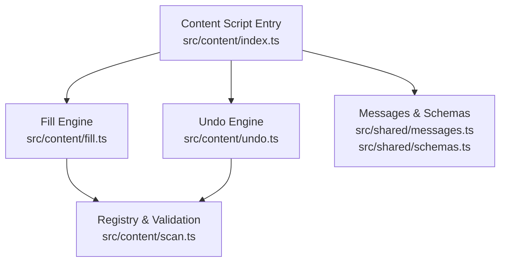
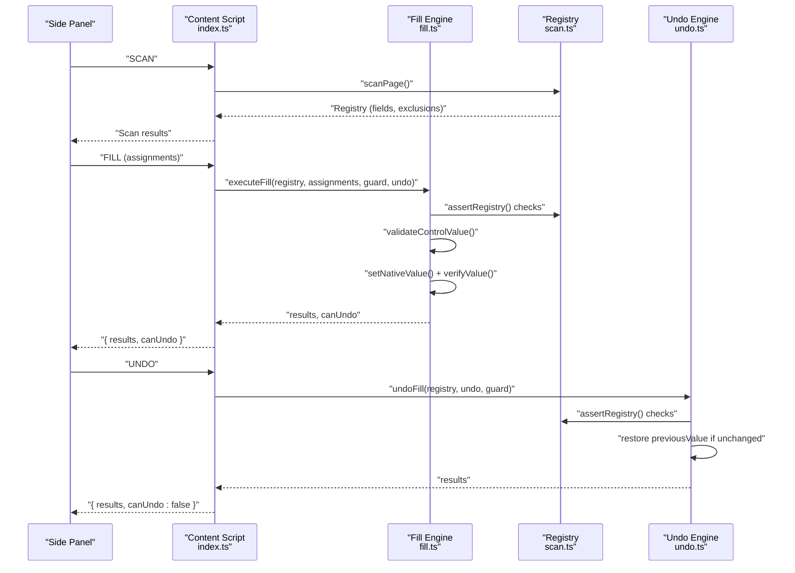
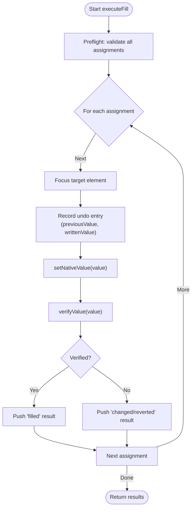
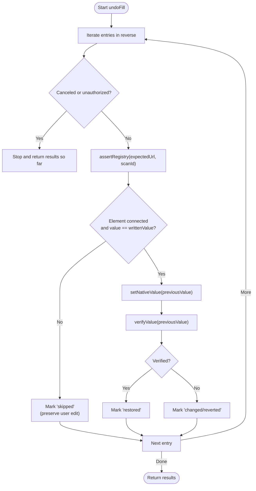
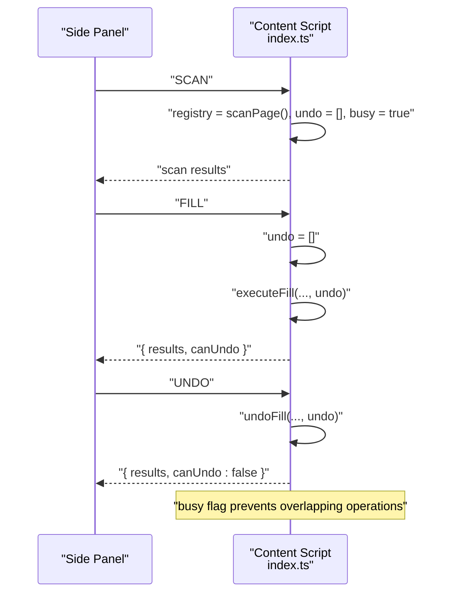
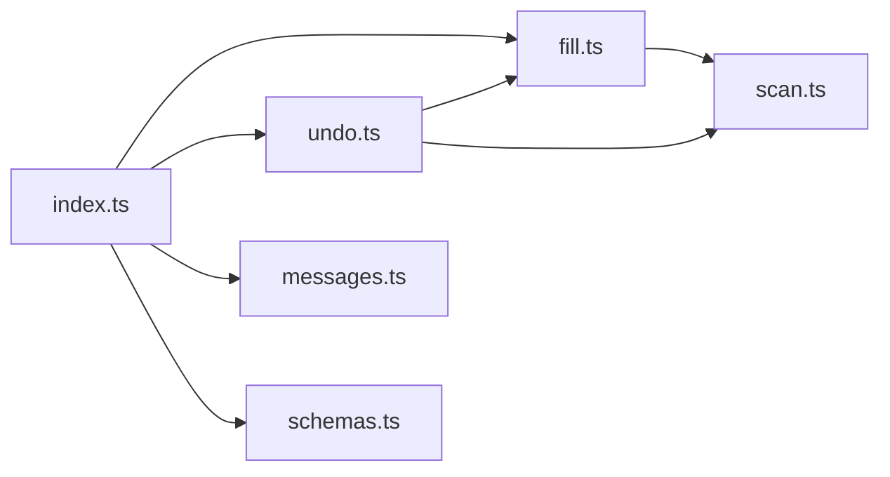

# Undo & State Restoration

<cite>
**Referenced Files in This Document**
- [undo.ts](file://src/content/undo.ts)
- [fill.ts](file://src/content/fill.ts)
- [index.ts](file://src/content/index.ts)
- [scan.ts](file://src/content/scan.ts)
- [schemas.ts](file://src/shared/schemas.ts)
- [messages.ts](file://src/shared/messages.ts)
- [filler.test.ts](file://tests/integration/filler.test.ts)
</cite>

## Table of Contents
1. [Introduction](#introduction)
2. [Project Structure](#project-structure)
3. [Core Components](#core-components)
4. [Architecture Overview](#architecture-overview)
5. [Detailed Component Analysis](#detailed-component-analysis)
6. [Dependency Analysis](#dependency-analysis)
7. [Performance Considerations](#performance-considerations)
8. [Troubleshooting Guide](#troubleshooting-guide)
9. [Conclusion](#conclusion)
10. [Appendices](#appendices)

## Introduction
This document explains the undo functionality that reverses form modifications and restores original states. It covers:
- The undo entry structure that captures field values before modification, including element references and previous values.
- The restoration algorithm that safely reverts changes without affecting other page state or triggering unintended side effects.
- Integration with the fill operation that builds undo entries in real-time as fields are populated.
- Limitations and edge cases where undo may not be possible.
- Examples of undo operations, error scenarios, and best practices for reliable state restoration.

## Project Structure
The undo feature is implemented in the content script layer and integrates with scanning, filling, messaging, and shared schemas.

**Diagram sources**
- [index.ts:1-72](file://src/content/index.ts#L1-L72)
- [fill.ts:1-82](file://src/content/fill.ts#L1-L82)
- [undo.ts:1-29](file://src/content/undo.ts#L1-L29)
- [scan.ts:1-88](file://src/content/scan.ts#L1-L88)
- [messages.ts:1-20](file://src/shared/messages.ts#L1-L20)
- [schemas.ts:1-39](file://src/shared/schemas.ts#L1-L39)

**Section sources**
- [index.ts:1-72](file://src/content/index.ts#L1-L72)
- [fill.ts:1-82](file://src/content/fill.ts#L1-L82)
- [undo.ts:1-29](file://src/content/undo.ts#L1-L29)
- [scan.ts:1-88](file://src/content/scan.ts#L1-L88)
- [messages.ts:1-20](file://src/shared/messages.ts#L1-L20)
- [schemas.ts:1-39](file://src/shared/schemas.ts#L1-L39)

## Core Components
- UndoEntry: Captures the field identifier, the DOM element reference, the value before writing, and the value that was written.
- ExecutionGuard: Ensures the operation is still authorized and not canceled during execution.
- Fill Engine: Validates assignments, writes values using native setters, emits events, verifies persistence, and records undo entries.
- Undo Engine: Reverses writes by restoring previous values while guarding against concurrent changes.
- Registry: Provides a snapshot of scanned fields and validates that the page has not changed since scan time.

Key responsibilities:
- Safe writes via native setters to trigger page-side listeners without submitting forms.
- Post-write verification to detect page-side rejections or replacements.
- Guarded undo that preserves user edits and detects target changes.

**Section sources**
- [fill.ts:6-82](file://src/content/fill.ts#L6-L82)
- [undo.ts:1-29](file://src/content/undo.ts#L1-L29)
- [scan.ts:1-88](file://src/content/scan.ts#L1-L88)
- [schemas.ts:33-38](file://src/shared/schemas.ts#L33-L38)
- [messages.ts:4-17](file://src/shared/messages.ts#L4-L17)

## Architecture Overview
The flow spans message handling, scanning, filling, and undoing.

**Diagram sources**
- [index.ts:22-52](file://src/content/index.ts#L22-L52)
- [fill.ts:42-81](file://src/content/fill.ts#L42-L81)
- [undo.ts:6-28](file://src/content/undo.ts#L6-L28)
- [scan.ts:62-87](file://src/content/scan.ts#L62-L87)

## Detailed Component Analysis

### Undo Entry Structure
An undo entry records:
- fieldId: Stable identifier for the field within the current scan.
- element: Direct reference to the DOM control being modified.
- previousValue: The value present before the write.
- writtenValue: The value that was written during fill.

This structure enables precise restoration by targeting the exact element and verifying it has not changed since the fill.

**Section sources**
- [fill.ts:6](file://src/content/fill.ts#L6)
- [schemas.ts:33-38](file://src/shared/schemas.ts#L33-L38)

### Fill Integration and Real-Time Undo Entry Creation
During fill:
- Pre-flight validation ensures all assignments are safe and consistent with the scanned state.
- For each assignment:
  - Focus is set on the target element.
  - An undo entry is created capturing previous and written values.
  - Native setter is used to update the value and dispatch input/change/blur events.
  - Verification waits briefly and confirms the value persisted and validity constraints hold.
- If any step fails, remaining assignments are marked skipped and the operation stops.

**Diagram sources**
- [fill.ts:42-81](file://src/content/fill.ts#L42-L81)

**Section sources**
- [fill.ts:8-16](file://src/content/fill.ts#L8-L16)
- [fill.ts:17-26](file://src/content/fill.ts#L17-L26)
- [fill.ts:27-41](file://src/content/fill.ts#L27-L41)
- [fill.ts:42-81](file://src/content/fill.ts#L42-L81)

### Undo Restoration Algorithm
The undo process:
- Iterates through recorded undo entries in reverse order to restore the most recent changes first.
- Guards against cancellation and tab changes between steps.
- Verifies the registry is still valid for the expected URL and scan ID.
- Skips an entry if the element is disconnected or its current value differs from what was written (preserving subsequent user edits).
- Restores previousValue using the native setter and verifies restoration.
- Returns per-field results indicating restored, changed/reverted, skipped, or failed.

**Diagram sources**
- [undo.ts:6-28](file://src/content/undo.ts#L6-L28)
- [scan.ts:77-87](file://src/content/scan.ts#L77-L87)

**Section sources**
- [undo.ts:6-28](file://src/content/undo.ts#L6-L28)
- [scan.ts:77-87](file://src/content/scan.ts#L77-L87)

### Message Handling and Lifecycle
The content script manages:
- A single registry per session and an undo stack cleared on new scans or fills.
- Authorization checks to ensure the correct tab remains active.
- Clearing state on page hide to prevent stale operations.

**Diagram sources**
- [index.ts:22-52](file://src/content/index.ts#L22-L52)

**Section sources**
- [index.ts:7-71](file://src/content/index.ts#L7-L71)

## Dependency Analysis
- fill.ts depends on scan.ts for registry access and validation, and on shared errors/schemas for types and messages.
- undo.ts depends on fill.ts utilities (native setter and verification), scan.ts registry assertions, and shared schemas/errors.
- index.ts orchestrates messages, maintains lifecycle state, and wires fill and undo together.

**Diagram sources**
- [fill.ts:1-82](file://src/content/fill.ts#L1-L82)
- [undo.ts:1-29](file://src/content/undo.ts#L1-L29)
- [index.ts:1-72](file://src/content/index.ts#L1-L72)
- [scan.ts:1-88](file://src/content/scan.ts#L1-L88)
- [messages.ts:1-20](file://src/shared/messages.ts#L1-L20)
- [schemas.ts:1-39](file://src/shared/schemas.ts#L1-L39)

**Section sources**
- [fill.ts:1-82](file://src/content/fill.ts#L1-L82)
- [undo.ts:1-29](file://src/content/undo.ts#L1-L29)
- [index.ts:1-72](file://src/content/index.ts#L1-L72)
- [scan.ts:1-88](file://src/content/scan.ts#L1-L88)
- [messages.ts:1-20](file://src/shared/messages.ts#L1-L20)
- [schemas.ts:1-39](file://src/shared/schemas.ts#L1-L39)

## Performance Considerations
- Minimal synchronous work: focus and native setter calls are fast; verification uses short delays to allow page-side updates to settle.
- Preflight validation avoids unnecessary writes and reduces risk of partial failures.
- Undo iterates only recorded entries and skips unchanged fields quickly.
- Registry assertions protect against expensive invalidation by failing fast when the page changes.

[No sources needed since this section provides general guidance]

## Troubleshooting Guide
Common issues and how they are handled:
- Target changed during fill or undo:
  - Filling: If a field’s value changes after review or on focus, the operation stops and reports failure for the affected field and skips the rest.
  - Undo: If the element is disconnected or its value differs from the written value, the entry is skipped to preserve user edits.
- Page rejects or replaces values:
  - Fill marks such fields as “changed/reverted” after verification fails.
  - Undo marks “changed/reverted” if the previous value cannot be retained.
- Tab or context changes:
  - Execution guards detect cancellation or tab changes and stop further processing.
- Form structure changes:
  - Registry assertions detect added/removed controls or replaced elements and require a fresh scan.

Error outcomes are reported per field with status codes: filled, skipped, changed/reverted, restored, failed.

**Section sources**
- [fill.ts:42-81](file://src/content/fill.ts#L42-L81)
- [undo.ts:6-28](file://src/content/undo.ts#L6-L28)
- [scan.ts:77-87](file://src/content/scan.ts#L77-L87)
- [schemas.ts:33-38](file://src/shared/schemas.ts#L33-L38)

## Conclusion
The undo system provides reliable state restoration by recording precise undo entries during fill and reversing them with robust guards and verifications. It preserves user edits, tolerates controlled UI behaviors, and fails fast when the page changes unexpectedly. Following the best practices below will maximize reliability.

[No sources needed since this section summarizes without analyzing specific files]

## Appendices

### Best Practices for Reliable State Restoration
- Always scan immediately before filling to ensure a fresh registry.
- Use explicit overwrite approval when replacing existing values.
- Keep the side panel connected throughout the operation; disconnect cancels remaining work.
- Avoid external scripts that mutate fields independently; such mutations will cause undo to skip or mark changes.
- After undo, re-scan if you plan additional operations to refresh the registry.

[No sources needed since this section provides general guidance]

### Example Scenarios

- Successful fill and undo:
  - Fill a text field; undo restores the original value and returns “restored”.
  - Reference: [filler.test.ts:109-113](file://tests/integration/filler.test.ts#L109-L113)

- Controlled textarea default-value synchronization:
  - Fill a textarea whose default value syncs on input; undo restores the value correctly.
  - Reference: [filler.test.ts:114-123](file://tests/integration/filler.test.ts#L114-L123)

- Preserving subsequent user edits:
  - User edits a field after fill; undo skips that field to keep the user’s change.
  - Reference: [filler.test.ts:124-128](file://tests/integration/filler.test.ts#L124-L128)

- Value reverted by page-side logic:
  - Fill triggers a listener that clears the value; fill reports “changed/reverted”.
  - Reference: [filler.test.ts:105-108](file://tests/integration/filler.test.ts#L105-L108)

- Focus handler changes the field:
  - Fill fails because the target changed on focus; no undo entry is created for that field.
  - Reference: [filler.test.ts:101-104](file://tests/integration/filler.test.ts#L101-L104)

- Unknown or duplicate field IDs:
  - Preflight rejects unknown/duplicate IDs; nothing is filled.
  - Reference: [filler.test.ts:57-60](file://tests/integration/filler.test.ts#L57-L60)

- Overwrite protection:
  - Non-empty values are not overwritten without explicit approval.
  - Reference: [filler.test.ts:77-84](file://tests/integration/filler.test.ts#L77-L84)

- Invalid inputs:
  - Length limits and type/pattern constraints are validated before writing.
  - Reference: [filler.test.ts:89-94](file://tests/integration/filler.test.ts#L89-L94)

- Tab authorization and cancellation:
  - Operations stop if the tab becomes inactive or is canceled.
  - Reference: [filler.test.ts:95-100](file://tests/integration/filler.test.ts#L95-L100)

**Section sources**
- [filler.test.ts:47-129](file://tests/integration/filler.test.ts#L47-L129)