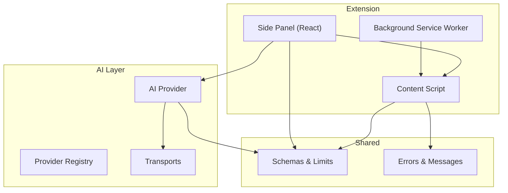
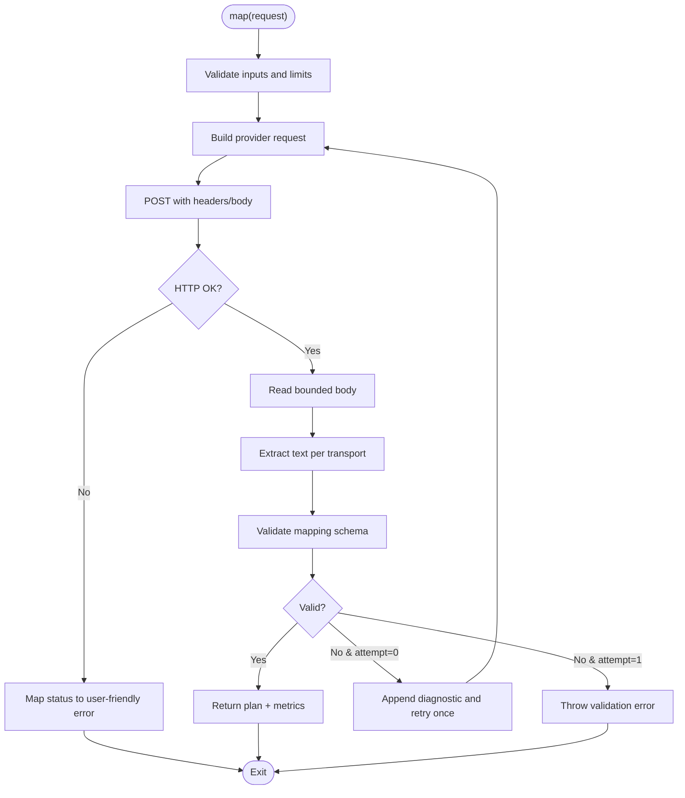
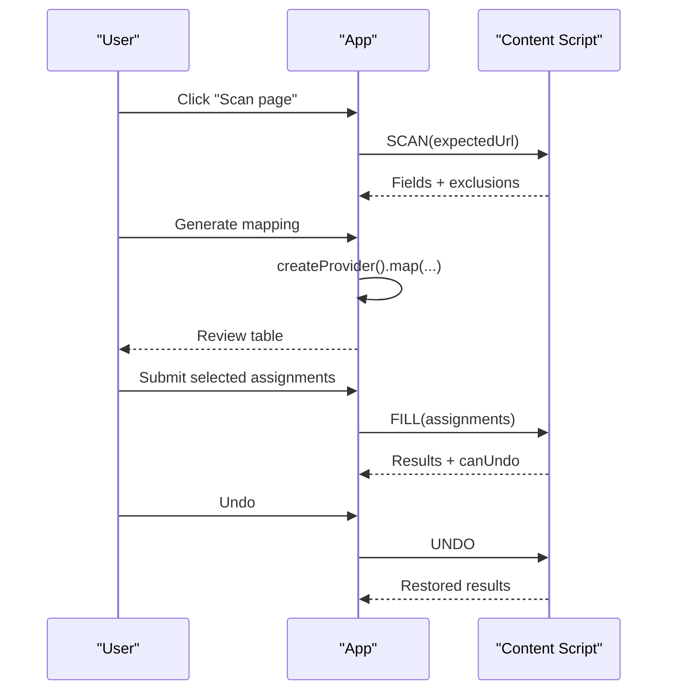
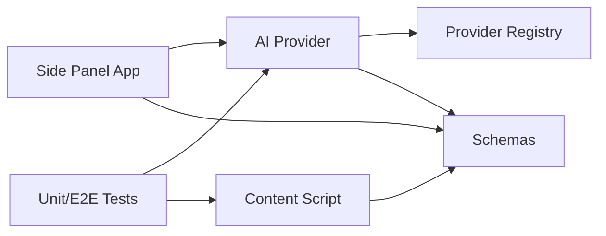

# Contributing Guide

<cite>
**Referenced Files in This Document**
- [package.json](file://package.json)
- [vite.config.ts](file://vite.config.ts)
- [tsconfig.json](file://tsconfig.json)
- [scripts/build.mjs](file://scripts/build.mjs)
- [src/manifest.json](file://src/manifest.json)
- [src/sidepanel/App.tsx](file://src/sidepanel/App.tsx)
- [src/content/index.ts](file://src/content/index.ts)
- [src/ai/provider.ts](file://src/ai/provider.ts)
- [src/ai/registry.ts](file://src/ai/registry.ts)
- [src/shared/schemas.ts](file://src/shared/schemas.ts)
- [vitest.config.ts](file://vitest.config.ts)
- [playwright.config.ts](file://playwright.config.ts)
- [tests/unit/providers.test.ts](file://tests/unit/providers.test.ts)
- [tests/e2e/extension.spec.ts](file://tests/e2e/extension.spec.ts)
</cite>

## Table of Contents
1. Introduction
2. Project Structure
3. Core Components
4. Architecture Overview
5. Detailed Component Analysis
6. Dependency Analysis
7. Performance Considerations
8. Troubleshooting Guide
9. Conclusion
10. Appendices

## Introduction
This guide explains how to contribute to the Help Me Fill extension. It covers setting up the development environment, coding standards, project structure conventions, testing requirements, pull request and code review process, commit message format, branching strategy, version management, and guidelines for extending AI providers and UI components. It also summarizes architecture decisions, design principles, and a roadmap for future improvements.

## Project Structure
Help Me Fill is a Chrome Extension (Manifest V3) with:
- A side panel UI built with React and Vite
- A background service worker
- A content script that safely interacts with web pages
- An AI layer that integrates multiple providers via normalized transports
- Shared schemas and error utilities
- Unit and integration tests with Vitest, and end-to-end tests with Playwright

**Diagram sources**
- [src/sidepanel/App.tsx:1-127](file://src/sidepanel/App.tsx#L1-L127)
- [src/content/index.ts:1-72](file://src/content/index.ts#L1-L72)
- [src/ai/provider.ts:1-107](file://src/ai/provider.ts#L1-L107)
- [src/ai/registry.ts:1-13](file://src/ai/registry.ts#L1-L13)
- [src/shared/schemas.ts:1-39](file://src/shared/schemas.ts#L1-L39)

Key build and configuration files:
- Build pipeline and outputs are defined in Vite and a custom build script.
- TypeScript is configured strictly with browser and Node types included.
- The manifest declares MV3 permissions and optional host permissions for AI providers.

**Section sources**
- [vite.config.ts:1-23](file://vite.config.ts#L1-L23)
- [scripts/build.mjs:1-62](file://scripts/build.mjs#L1-L62)
- [tsconfig.json:1-18](file://tsconfig.json#L1-L18)
- [src/manifest.json:1-19](file://src/manifest.json#L1-L19)

## Core Components
- Side Panel App: Orchestrates document parsing, scanning, AI mapping, review, and filling. Manages session state, provider settings, and lifecycle events.
- Content Script: Validates messages, scans the page, executes fills, and supports undo. Enforces trust boundaries and connection guards.
- AI Provider: Normalizes requests across providers, enforces limits, handles retries and timeouts, and validates responses against schemas.
- Provider Registry: Declares supported providers, endpoints, and transport selection.
- Schemas and Limits: Central definitions for fields, mappings, scans, and size constraints.

**Section sources**
- [src/sidepanel/App.tsx:1-127](file://src/sidepanel/App.tsx#L1-L127)
- [src/content/index.ts:1-72](file://src/content/index.ts#L1-L72)
- [src/ai/provider.ts:1-107](file://src/ai/provider.ts#L1-L107)
- [src/ai/registry.ts:1-13](file://src/ai/registry.ts#L1-L13)
- [src/shared/schemas.ts:1-39](file://src/shared/schemas.ts#L1-L39)

## Architecture Overview
The extension follows a clear separation of concerns:
- UI (side panel) initiates workflows and displays results
- Background manages extension lifecycle and messaging
- Content script performs safe DOM operations on target pages
- AI layer abstracts provider differences and enforces safety and limits

```mermaid
sequenceDiagram
participant User as "User"
participant SP as "Side Panel App"
participant AI as "AI Provider"
participant CS as "Content Script"
participant Prov as "AI Provider API"
User->>SP : Upload PDF / Scan Page
SP->>SP : Parse PDF locally
SP->>CS : SCAN (with expected URL)
CS-->>SP : Registry of fields
SP->>AI : Map(lines, fields, signal)
AI->>Prov : POST normalized request
Prov-->>AI : JSON response
AI-->>SP : Mapping plan + metrics
User->>SP : Review & Select assignments
SP->>CS : FILL(assignments)
CS-->>SP : Results + canUndo
User->>SP : Undo if needed
SP->>CS : UNDO
CS-->>SP : Restored results
```

**Diagram sources**
- [src/sidepanel/App.tsx:64-95](file://src/sidepanel/App.tsx#L64-L95)
- [src/content/index.ts:22-52](file://src/content/index.ts#L22-L52)
- [src/ai/provider.ts:52-105](file://src/ai/provider.ts#L52-L105)

## Detailed Component Analysis

### AI Provider and Transports
- Builds provider-specific requests using registry entries and transport helpers
- Enforces input limits and response size caps
- Implements one-time repair retry when validation fails; never echoes untrusted model output back to the provider
- Handles HTTP errors, timeouts, and abort signals consistently

**Diagram sources**
- [src/ai/provider.ts:52-105](file://src/ai/provider.ts#L52-L105)
- [src/ai/registry.ts:1-13](file://src/ai/registry.ts#L1-L13)

**Section sources**
- [src/ai/provider.ts:1-107](file://src/ai/provider.ts#L1-L107)
- [src/ai/registry.ts:1-13](file://src/ai/registry.ts#L1-L13)

### Side Panel Workflow
- Parses PDF locally and shows progress
- Scans the active tab’s form fields and tracks changes or tab switches
- Generates mapping via AI, then presents a review table
- Executes fill or undo operations on the page with safety checks

**Diagram sources**
- [src/sidepanel/App.tsx:64-95](file://src/sidepanel/App.tsx#L64-L95)
- [src/content/index.ts:22-52](file://src/content/index.ts#L22-L52)

**Section sources**
- [src/sidepanel/App.tsx:1-127](file://src/sidepanel/App.tsx#L1-L127)
- [src/content/index.ts:1-72](file://src/content/index.ts#L1-L72)

### Content Script Safety and Messaging
- Validates incoming messages and restricts trusted senders
- Requires an active side panel port for writes and cancels on disconnect
- Guards against stale scans, overwritten values, and unexpected page changes
- Supports cancel, scan, fill, and undo operations

**Section sources**
- [src/content/index.ts:1-72](file://src/content/index.ts#L1-L72)

### Data Models and Limits
- Field descriptors, mapping plans, scans, and operation results are validated with Zod
- Global limits protect memory and API usage (pages, characters, fields, response size)

**Section sources**
- [src/shared/schemas.ts:1-39](file://src/shared/schemas.ts#L1-L39)

## Dependency Analysis
- The side panel depends on the AI provider and shared schemas
- The content script depends on shared schemas and error utilities
- The AI provider depends on the registry and transport implementations
- Tests validate provider behavior and end-to-end flows

**Diagram sources**
- [src/sidepanel/App.tsx:1-127](file://src/sidepanel/App.tsx#L1-L127)
- [src/content/index.ts:1-72](file://src/content/index.ts#L1-L72)
- [src/ai/provider.ts:1-107](file://src/ai/provider.ts#L1-L107)
- [src/ai/registry.ts:1-13](file://src/ai/registry.ts#L1-L13)
- [src/shared/schemas.ts:1-39](file://src/shared/schemas.ts#L1-L39)

**Section sources**
- [src/sidepanel/App.tsx:1-127](file://src/sidepanel/App.tsx#L1-L127)
- [src/content/index.ts:1-72](file://src/content/index.ts#L1-L72)
- [src/ai/provider.ts:1-107](file://src/ai/provider.ts#L1-L107)
- [src/ai/registry.ts:1-13](file://src/ai/registry.ts#L1-L13)
- [src/shared/schemas.ts:1-39](file://src/shared/schemas.ts#L1-L39)

## Performance Considerations
- Keep PDF parsing local and bounded by page and character limits
- Avoid unnecessary retries; the AI layer retries at most once for schema validation failures
- Use AbortSignal to stop long-running operations promptly
- Monitor provider response sizes and enforce caps to prevent memory pressure

[No sources needed since this section provides general guidance]

## Troubleshooting Guide
Common issues and where to look:
- Provider permission missing: Ensure the origin permission is enabled before generating mapping.
- Invalid or truncated AI response: The provider layer validates and may repair once; repeated failures indicate model or prompt issues.
- Network or rate limit errors: Status codes map to actionable messages; do not rely on automatic retries for network failures.
- Stale scan or tab switch: Re-scan after reloads or tab changes; the content script invalidates stale contexts.
- Overwritten or changed fields: The content script refuses to overwrite user-edited values; re-scan to refresh the snapshot.

**Section sources**
- [src/sidepanel/App.tsx:73-82](file://src/sidepanel/App.tsx#L73-L82)
- [src/ai/provider.ts:71-104](file://src/ai/provider.ts#L71-L104)
- [src/content/index.ts:22-52](file://src/content/index.ts#L22-L52)

## Conclusion
Help Me Fill combines a secure content script, a responsive side panel, and a robust AI integration layer. Follow the setup, testing, and contribution guidelines below to add features, extend providers, and improve reliability.

## Appendices

### Development Environment Setup
- Install dependencies and verify Node engine compatibility
- Run type checking, unit tests, and E2E tests
- Build the extension artifacts for unpacked installation

Commands:
- Install dependencies
- Type check
- Run unit/integration tests
- Run E2E tests
- Build extension

**Section sources**
- [package.json:1-38](file://package.json#L1-L38)
- [vite.config.ts:1-23](file://vite.config.ts#L1-L23)
- [scripts/build.mjs:1-62](file://scripts/build.mjs#L1-L62)

### Coding Standards
- TypeScript strict mode is enabled; avoid disabling rules without justification
- Prefer Zod schemas for all external data and large payloads
- Use AbortSignal for cancellable operations
- Centralize error handling via shared error utilities
- Keep content scripts free of runtime chunk imports and module loading

**Section sources**
- [tsconfig.json:1-18](file://tsconfig.json#L1-L18)
- [src/shared/schemas.ts:1-39](file://src/shared/schemas.ts#L1-L39)
- [scripts/build.mjs:45-61](file://scripts/build.mjs#L45-L61)

### Project Structure Conventions
- src/ai: Provider abstraction and transports
- src/content: Safe page interaction and messaging
- src/sidepanel: React UI and session management
- src/parsers: Local PDF parsing utilities
- src/shared: Schemas, errors, and messages
- tests/: Unit, integration, fixtures, and E2E suites

**Section sources**
- [vite.config.ts:5-22](file://vite.config.ts#L5-L22)
- [vitest.config.ts:1-3](file://vitest.config.ts#L1-L3)
- [playwright.config.ts:1-14](file://playwright.config.ts#L1-L14)

### Pull Request Process and Code Review Guidelines
- Create a feature branch from main for each change
- Include unit or integration tests for logic changes; update E2E tests for workflow changes
- Ensure type checks and all tests pass locally
- Keep PRs focused and small; describe intent, approach, and trade-offs
- Review checklist:
  - Security: No secrets in logs or payloads; respect permissions and origins
  - Reliability: Proper error handling, timeouts, and cancellation
  - Performance: Respect limits and avoid unnecessary retries
  - UX: Clear feedback and recovery paths

[No sources needed since this section provides general guidance]

### Testing Requirements Before Submission
- Unit and integration tests must cover new logic and edge cases
- E2E tests should validate critical flows like scanning, mapping, filling, and undo
- For provider changes, ensure existing provider tests still pass

**Section sources**
- [vitest.config.ts:1-3](file://vitest.config.ts#L1-L3)
- [tests/unit/providers.test.ts:1-69](file://tests/unit/providers.test.ts#L1-L69)
- [tests/e2e/extension.spec.ts:1-173](file://tests/e2e/extension.spec.ts#L1-L173)

### Commit Message Format
- Use conventional commits: type(scope): description
- Types: feat, fix, refactor, test, docs, chore, perf
- Scope examples: ai, content, sidepanel, parsers, tests
- Examples:
  - feat(ai): add DeepSeek provider support
  - fix(content): guard against stale scan on tab switch
  - test(unit): cover oversized provider responses

[No sources needed since this section provides general guidance]

### Branching Strategy
- main: stable, tested code
- feature/*: new features or enhancements
- fix/*: bug fixes
- refactor/*: internal improvements without behavior changes
- Merge via pull requests with required checks passing

[No sources needed since this section provides general guidance]

### Version Management
- Extension version is declared in the manifest and package metadata
- Align extension version with release tags and changelog entries
- Build artifacts include generated icons and packaged resources

**Section sources**
- [src/manifest.json:1-19](file://src/manifest.json#L1-L19)
- [package.json:1-38](file://package.json#L1-L38)
- [scripts/build.mjs:15-44](file://scripts/build.mjs#L15-L44)

### Adding a New AI Provider
Steps:
- Add provider entry to the registry with name, origin, endpoint, and transport
- Implement or reuse transport functions to normalize request/response
- Update optional host permissions in the manifest if needed
- Add unit tests for request building and response normalization
- Verify E2E flows if the provider affects UI or permissions

**Section sources**
- [src/ai/registry.ts:1-13](file://src/ai/registry.ts#L1-L13)
- [src/manifest.json:6-12](file://src/manifest.json#L6-L12)
- [tests/unit/providers.test.ts:14-29](file://tests/unit/providers.test.ts#L14-L29)

### Extending UI Components
Guidelines:
- Keep components small and focused; compose via props and context
- Use session actions to drive state transitions
- Provide accessible labels and keyboard navigation
- Test interactions through E2E where appropriate

**Section sources**
- [src/sidepanel/App.tsx:15-127](file://src/sidepanel/App.tsx#L15-L127)

### Improving Existing Features
- Identify bottlenecks in provider latency or response parsing
- Improve prompts or payload compactness to reduce token usage
- Enhance error messages and recovery flows for better UX
- Add tests to prevent regressions

[No sources needed since this section provides general guidance]

### Architecture Decisions and Design Principles
- Separation of concerns: UI, background, content, and AI layers are isolated
- Safety-first: Strict sender validation, connection guards, and input/output limits
- Portability: Provider abstraction enables adding new models without changing UI
- Determinism: Schemas define contracts; tests assert behavior under failure modes

[No sources needed since this section provides general guidance]

### Future Roadmap
- Support additional field types and richer context extraction
- Expand provider coverage and optimize prompts for cost and speed
- Introduce advanced validation and conflict resolution during fill
- Improve accessibility and localization for broader audiences

[No sources needed since this section provides general guidance]

### Resources for New Contributors
- Repository scripts and configs for building and testing
- Example tests demonstrating provider and E2E patterns
- Manifest and Vite configuration for understanding packaging

**Section sources**
- [package.json:7-15](file://package.json#L7-L15)
- [vitest.config.ts:1-3](file://vitest.config.ts#L1-L3)
- [playwright.config.ts:1-14](file://playwright.config.ts#L1-L14)
- [tests/unit/providers.test.ts:1-69](file://tests/unit/providers.test.ts#L1-L69)
- [tests/e2e/extension.spec.ts:1-173](file://tests/e2e/extension.spec.ts#L1-L173)