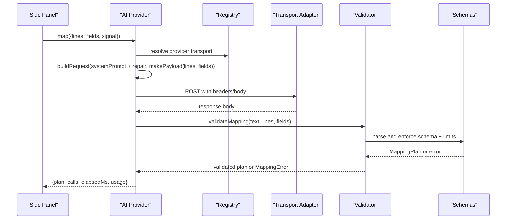
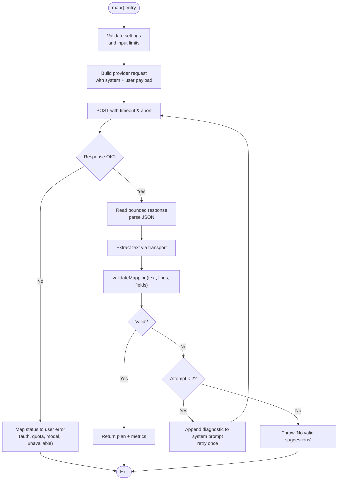
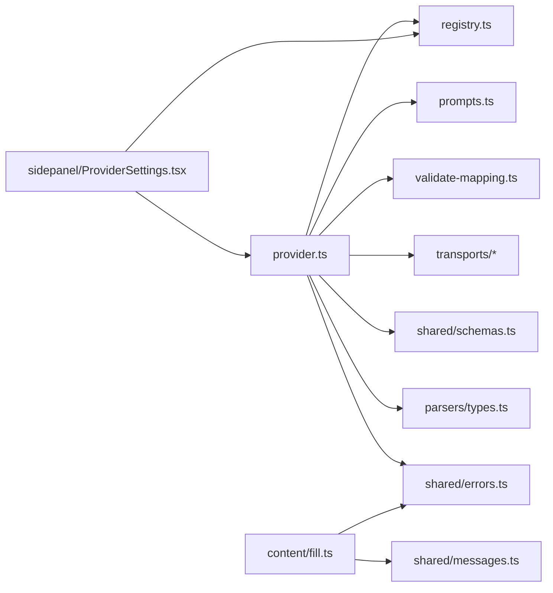
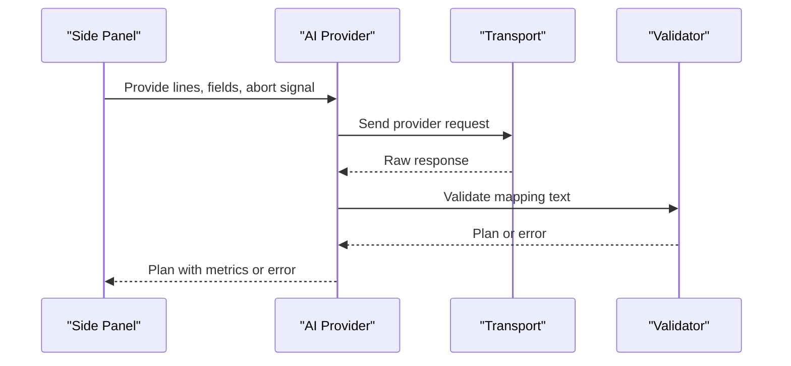
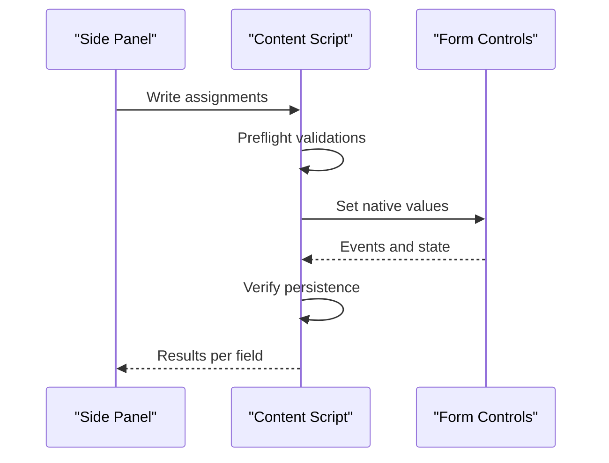

# AI-Powered Mapping

<cite>
**Referenced Files in This Document**
- [provider.ts](file://src/ai/provider.ts)
- [prompts.ts](file://src/ai/prompts.ts)
- [registry.ts](file://src/ai/registry.ts)
- [validate-mapping.ts](file://src/ai/validate-mapping.ts)
- [openai-compatible.ts](file://src/ai/transports/openai-compatible.ts)
- [anthropic.ts](file://src/ai/transports/anthropic.ts)
- [gemini.ts](file://src/ai/transports/gemini.ts)
- [schemas.ts](file://src/shared/schemas.ts)
- [types.ts](file://src/parsers/types.ts)
- [errors.ts](file://src/shared/errors.ts)
- [ProviderSettings.tsx](file://src/sidepanel/components/ProviderSettings.tsx)
- [fill.ts](file://src/content/fill.ts)
- [messages.ts](file://src/shared/messages.ts)
- [mapping.test.ts](file://tests/unit/mapping.test.ts)
</cite>

## Table of Contents
1. Introduction
2. Project Structure
3. Core Components
4. Architecture Overview
5. Detailed Component Analysis
6. Dependency Analysis
7. Performance Considerations
8. Troubleshooting Guide
9. Conclusion
10. Appendices

## Introduction
This document explains the AI-powered mapping system that generates intelligent field-to-document mappings for form filling. It covers:
- Provider abstraction layer supporting OpenAI, Anthropic Claude, and Google Gemini
- Prompt engineering strategies to ensure grounded, verifiable outputs
- Response validation and fallback mechanisms when suggestions are uncertain or invalid
- End-to-end workflow from field descriptors and document lines to structured mapping plans
- Configuration options, rate limiting considerations, and error handling for API failures
- Practical guidance for prompt customization, debugging, and optimizing results across document types and form structures

## Project Structure
The mapping system is implemented as a modular set of components:
- AI orchestration and provider routing live under src/ai
- Transport adapters implement per-provider request/response handling
- Shared schemas define limits and data contracts
- Parser types describe document lines
- Side panel UI configures providers and stores keys securely in session storage
- Content script executes validated fills with safety checks

```mermaid
graph TB
subgraph "AI Layer"
P["provider.ts"]
R["registry.ts"]
Pr["prompts.ts"]
V["validate-mapping.ts"]
T1["transports/openai-compatible.ts"]
T2["transports/anthropic.ts"]
T3["transports/gemini.ts"]
end
subgraph "Shared"
S["shared/schemas.ts"]
E["shared/errors.ts"]
PT["parsers/types.ts"]
end
subgraph "UI"
UI["sidepanel/components/ProviderSettings.tsx"]
end
subgraph "Content"
F["content/fill.ts"]
M["shared/messages.ts"]
end
UI --> P
P --> R
P --> Pr
P --> V
P --> T1
P --> T2
P --> T3
P --> S
P --> E
P --> PT
F --> M
```

**Diagram sources**
- [provider.ts:1-107](file://src/ai/provider.ts#L1-L107)
- [registry.ts:1-13](file://src/ai/registry.ts#L1-L13)
- [prompts.ts:1-26](file://src/ai/prompts.ts#L1-L26)
- [validate-mapping.ts:1-33](file://src/ai/validate-mapping.ts#L1-L33)
- [openai-compatible.ts:1-22](file://src/ai/transports/openai-compatible.ts#L1-L22)
- [anthropic.ts:1-17](file://src/ai/transports/anthropic.ts#L1-L17)
- [gemini.ts:1-21](file://src/ai/transports/gemini.ts#L1-L21)
- [schemas.ts:1-39](file://src/shared/schemas.ts#L1-L39)
- [errors.ts:1-10](file://src/shared/errors.ts#L1-L10)
- [types.ts:1-3](file://src/parsers/types.ts#L1-L3)
- [ProviderSettings.tsx:1-70](file://src/sidepanel/components/ProviderSettings.tsx#L1-L70)
- [fill.ts:1-82](file://src/content/fill.ts#L1-L82)
- [messages.ts:1-20](file://src/shared/messages.ts#L1-L20)

**Section sources**
- [provider.ts:1-107](file://src/ai/provider.ts#L1-L107)
- [registry.ts:1-13](file://src/ai/registry.ts#L1-L13)
- [prompts.ts:1-26](file://src/ai/prompts.ts#L1-L26)
- [validate-mapping.ts:1-33](file://src/ai/validate-mapping.ts#L1-L33)
- [schemas.ts:1-39](file://src/shared/schemas.ts#L1-L39)
- [types.ts:1-3](file://src/parsers/types.ts#L1-L3)
- [errors.ts:1-10](file://src/shared/errors.ts#L1-L10)
- [ProviderSettings.tsx:1-70](file://src/sidepanel/components/ProviderSettings.tsx#L1-L70)
- [fill.ts:1-82](file://src/content/fill.ts#L1-L82)
- [messages.ts:1-20](file://src/shared/messages.ts#L1-L20)

## Core Components
- AI Provider Orchestrator: Builds requests, calls transports, validates responses, and implements retry logic with bounded timeouts and abort signals.
- Transport Adapters: Encode provider-specific payloads and decode responses into a common text format.
- Prompt Engineering: System prompt enforces grounded JSON output with evidence citations; payload builder sanitizes fields to exclude sensitive data.
- Validation Engine: Parses and validates model output against strict schemas, verifies quotes exist on cited lines, ensures values are supported by evidence, and enforces length constraints.
- Configuration UI: Stores provider settings and API keys in session storage, requests host permissions, and persists preferences.
- Fill Execution: Validates control constraints before writing, applies native value setters, and verifies persistence.

Key responsibilities and boundaries:
- The orchestrator never trusts raw model output; it always passes through validation.
- Transports isolate provider differences (headers, endpoints, response shapes).
- Schemas centralize limits and type contracts used across layers.
- Errors are surfaced via a consistent UserError class and message formatter.

**Section sources**
- [provider.ts:15-105](file://src/ai/provider.ts#L15-L105)
- [openai-compatible.ts:4-21](file://src/ai/transports/openai-compatible.ts#L4-L21)
- [anthropic.ts:3-16](file://src/ai/transports/anthropic.ts#L3-L16)
- [gemini.ts:3-20](file://src/ai/transports/gemini.ts#L3-L20)
- [prompts.ts:4-25](file://src/ai/prompts.ts#L4-L25)
- [validate-mapping.ts:7-31](file://src/ai/validate-mapping.ts#L7-L31)
- [schemas.ts:1-39](file://src/shared/schemas.ts#L1-L39)
- [ProviderSettings.tsx:16-44](file://src/sidepanel/components/ProviderSettings.tsx#L16-L44)
- [fill.ts:8-80](file://src/content/fill.ts#L8-L80)

## Architecture Overview
The mapping pipeline transforms untrusted inputs (document lines and field descriptors) into a validated mapping plan using multiple AI providers behind a unified interface.



**Diagram sources**
- [provider.ts:52-105](file://src/ai/provider.ts#L52-L105)
- [registry.ts:1-13](file://src/ai/registry.ts#L1-L13)
- [openai-compatible.ts:4-21](file://src/ai/transports/openai-compatible.ts#L4-L21)
- [anthropic.ts:3-16](file://src/ai/transports/anthropic.ts#L3-L16)
- [gemini.ts:3-20](file://src/ai/transports/gemini.ts#L3-L20)
- [validate-mapping.ts:7-31](file://src/ai/validate-mapping.ts#L7-L31)
- [schemas.ts:1-39](file://src/shared/schemas.ts#L1-L39)

## Detailed Component Analysis

### AI Provider Orchestrator
Responsibilities:
- Validate settings and input sizes against limits
- Build provider-specific requests using registry and prompts
- Enforce timeouts and abort signals
- Read bounded responses and extract provider-specific text
- Validate mapping output and support one automatic retry with diagnostic feedback
- Return metrics including call count, elapsed time, and optional usage metadata

Retry and fallback strategy:
- On first validation failure, append a concise diagnostic to the system prompt and retry once with the original data (not untrusted output)
- If still invalid or no valid suggestion after retries, surface a clear user-facing error

Timeouts and cancellation:
- 60-second timeout per request; aborts propagate cleanly
- AbortSignal integration prevents new work if canceled

Rate limiting and errors:
- Distinguishes 401/403, 429, 400/404, and general failures with actionable messages
- Bounded response size enforcement protects memory and parsing



**Diagram sources**
- [provider.ts:52-105](file://src/ai/provider.ts#L52-L105)
- [errors.ts:1-10](file://src/shared/errors.ts#L1-L10)
- [schemas.ts:1-39](file://src/shared/schemas.ts#L1-L39)

**Section sources**
- [provider.ts:15-105](file://src/ai/provider.ts#L15-L105)
- [errors.ts:1-10](file://src/shared/errors.ts#L1-L10)

### Transport Adapters
OpenAI-compatible:
- Sends chat completions with JSON mode
- Extracts content only when finish reason indicates success and refusal is absent

Anthropic:
- Uses messages endpoint with explicit version header and direct browser access flag
- Ensures stop_reason indicates completion and content blocks are text-only

Gemini:
- Encodes model name and uses generateContent with JSON MIME type
- Filters out thought parts and ensures STOP finish reason

All adapters throw descriptive errors when models refuse, truncate, or return unsupported formats.

**Section sources**
- [openai-compatible.ts:4-21](file://src/ai/transports/openai-compatible.ts#L4-L21)
- [anthropic.ts:3-16](file://src/ai/transports/anthropic.ts#L3-L16)
- [gemini.ts:3-20](file://src/ai/transports/gemini.ts#L3-L20)

### Prompt Engineering Strategies
System prompt design principles:
- Grounding: Require exact quotes and line IDs for every assignment
- Integrity: Prohibit inference, conversions, or fabrication; preserve formatting and units
- Completeness: Every field must be assigned or explicitly unmapped
- Safety: No selectors, commands, or actions; nonempty string values only

Payload construction:
- Compact fields to include only necessary metadata; excludes current values and URLs
- Serialize document lines and fields into a single user message

Customization guidance:
- Adjust system prompt to emphasize domain-specific roles (e.g., buyer vs seller)
- Add examples indirectly via context in field labels/placeholders where appropriate
- Keep payloads within character limits to avoid truncation

**Section sources**
- [prompts.ts:4-25](file://src/ai/prompts.ts#L4-L25)
- [schemas.ts:1-39](file://src/shared/schemas.ts#L1-L39)

### Response Validation Mechanisms
Validation steps:
- Enforce maximum response size
- Parse JSON strictly
- Validate against mapping schema (assignments and unmapped arrays)
- Ensure all supplied fields are accounted for exactly once
- Verify each quote exists on its cited line
- Confirm proposed values are substrings of combined quoted evidence
- Respect field maxLength constraints

Confidence scoring:
- The system does not compute numeric confidence scores; instead, it enforces hard guarantees via evidence citation and schema validation. Ambiguity is handled by requiring unmapped entries with reasons.

Fallback behavior:
- One automatic retry with a concise diagnostic appended to the system prompt
- If validation fails again, surface a user-friendly error indicating no valid suggestions were returned

**Section sources**
- [validate-mapping.ts:7-31](file://src/ai/validate-mapping.ts#L7-L31)
- [schemas.ts:1-39](file://src/shared/schemas.ts#L1-L39)
- [provider.ts:87-104](file://src/ai/provider.ts#L87-L104)

### Configuration Options and Security
Provider configuration:
- Supported providers: OpenAI, DeepSeek (OpenAI-compatible), Anthropic, Google Gemini
- Settings include provider ID, model ID, and API key
- Host origins are requested dynamically per provider

Security and storage:
- API keys stored in session storage scoped to the provider key namespace
- Preferences (provider and model) persisted locally
- Permissions can be revoked via UI controls

Operational notes:
- Live verification of model compatibility is not performed at save time
- Keys are session-only; no encrypted vault is included

**Section sources**
- [registry.ts:1-13](file://src/ai/registry.ts#L1-L13)
- [ProviderSettings.tsx:16-44](file://src/sidepanel/components/ProviderSettings.tsx#L16-L44)

### Fill Execution and Safety
Before writing:
- Preflight validates all assignments, ensuring target fields exist, values match expected state, and overwrite rules are respected
- Control-level validation checks length, minimum length, normalization, and validity constraints

Writing and verification:
- Uses native value setters to trigger proper events and handlers
- Verifies persistence across frames and short delays to account for page reactions
- Records undo entries and reports detailed statuses per field

**Section sources**
- [fill.ts:8-80](file://src/content/fill.ts#L8-L80)
- [messages.ts:1-20](file://src/shared/messages.ts#L1-L20)

## Dependency Analysis
High-level dependencies:
- provider.ts depends on registry.ts, prompts.ts, validate-mapping.ts, transports, shared schemas, parser types, and error utilities
- Each transport depends on registry and errors
- validate-mapping.ts depends on schemas, parser types, and errors
- UI depends on registry and provider validation functions
- Content fill depends on messages and error utilities



**Diagram sources**
- [provider.ts:1-107](file://src/ai/provider.ts#L1-L107)
- [registry.ts:1-13](file://src/ai/registry.ts#L1-L13)
- [prompts.ts:1-26](file://src/ai/prompts.ts#L1-L26)
- [validate-mapping.ts:1-33](file://src/ai/validate-mapping.ts#L1-L33)
- [openai-compatible.ts:1-22](file://src/ai/transports/openai-compatible.ts#L1-L22)
- [anthropic.ts:1-17](file://src/ai/transports/anthropic.ts#L1-L17)
- [gemini.ts:1-21](file://src/ai/transports/gemini.ts#L1-L21)
- [schemas.ts:1-39](file://src/shared/schemas.ts#L1-L39)
- [types.ts:1-3](file://src/parsers/types.ts#L1-L3)
- [errors.ts:1-10](file://src/shared/errors.ts#L1-L10)
- [ProviderSettings.tsx:1-70](file://src/sidepanel/components/ProviderSettings.tsx#L1-L70)
- [fill.ts:1-82](file://src/content/fill.ts#L1-L82)
- [messages.ts:1-20](file://src/shared/messages.ts#L1-L20)

**Section sources**
- [provider.ts:1-107](file://src/ai/provider.ts#L1-L107)
- [registry.ts:1-13](file://src/ai/registry.ts#L1-L13)
- [validate-mapping.ts:1-33](file://src/ai/validate-mapping.ts#L1-L33)
- [schemas.ts:1-39](file://src/shared/schemas.ts#L1-L39)

## Performance Considerations
- Input limits: Character and field counts are enforced to keep payloads tractable
- Response bounds: Responses are capped to prevent excessive memory use
- Timeouts: 60-second request limit avoids hanging operations
- Minimal payload: Only necessary field metadata is sent; private values are excluded
- Single retry: Limits additional network cost while improving robustness

[No sources needed since this section provides general guidance]

## Troubleshooting Guide
Common issues and resolutions:
- Invalid or missing API key / unauthorized: Check credentials and account access; ensure correct provider origin permission
- Rate limited or quota exceeded: Wait and retry later; verify account quotas
- Model incompatibility or refusal: Use a supported text model; shorten documents; ensure JSON output mode is enabled
- Empty or oversized responses: Reduce document size; check network and provider availability
- Validation failures: Review field descriptors and document lines; ensure quotes exist on cited lines and values are supported by evidence
- Aborted or canceled operations: Re-run after resolving tab or session changes

Debugging tips:
- Inspect error messages produced by the orchestrator and transports
- Verify field descriptors do not include sensitive fields like current values
- Confirm document lines contain the exact substrings referenced in evidence
- Use unit tests to validate mapping expectations and edge cases

**Section sources**
- [provider.ts:77-104](file://src/ai/provider.ts#L77-L104)
- [openai-compatible.ts:14-21](file://src/ai/transports/openai-compatible.ts#L14-L21)
- [anthropic.ts:10-16](file://src/ai/transports/anthropic.ts#L10-L16)
- [gemini.ts:13-20](file://src/ai/transports/gemini.ts#L13-L20)
- [validate-mapping.ts:7-31](file://src/ai/validate-mapping.ts#L7-L31)
- [mapping.test.ts:12-31](file://tests/unit/mapping.test.ts#L12-L31)

## Conclusion
The mapping system combines strong prompt engineering, strict validation, and provider-agnostic transports to produce reliable, auditable field-to-document mappings. By enforcing evidence-backed values, bounding inputs and outputs, and providing clear error messaging and fallbacks, it balances accuracy with safety. Configuration is straightforward and secure, and the fill execution layer ensures writes are safe and reversible.

[No sources needed since this section summarizes without analyzing specific files]

## Appendices

### Provider Configuration Reference
- Providers: OpenAI, DeepSeek (OpenAI-compatible), Anthropic, Google Gemini
- Required settings: provider ID, model ID, API key
- Storage: API keys in session storage; preferences in local storage
- Permissions: Origin-based permissions requested per provider

**Section sources**
- [registry.ts:1-13](file://src/ai/registry.ts#L1-L13)
- [ProviderSettings.tsx:16-44](file://src/sidepanel/components/ProviderSettings.tsx#L16-L44)

### Data Contracts Summary
- FieldDescriptor: Identifiers, types, labels, placeholders, names, contexts, required flags, length limits, patterns
- MappingPlan: Assignments with field IDs, values, evidence (line IDs and quotes), and reasons; unmapped list with reasons
- Limits: Bytes, pages, characters, fields, response bytes, and value lengths

**Section sources**
- [schemas.ts:1-39](file://src/shared/schemas.ts#L1-L39)

### Example Workflows

#### Mapping Generation Workflow


**Diagram sources**
- [provider.ts:52-105](file://src/ai/provider.ts#L52-L105)
- [validate-mapping.ts:7-31](file://src/ai/validate-mapping.ts#L7-L31)

#### Fill Execution Flow


**Diagram sources**
- [fill.ts:42-80](file://src/content/fill.ts#L42-L80)
- [messages.ts:4-17](file://src/shared/messages.ts#L4-L17)