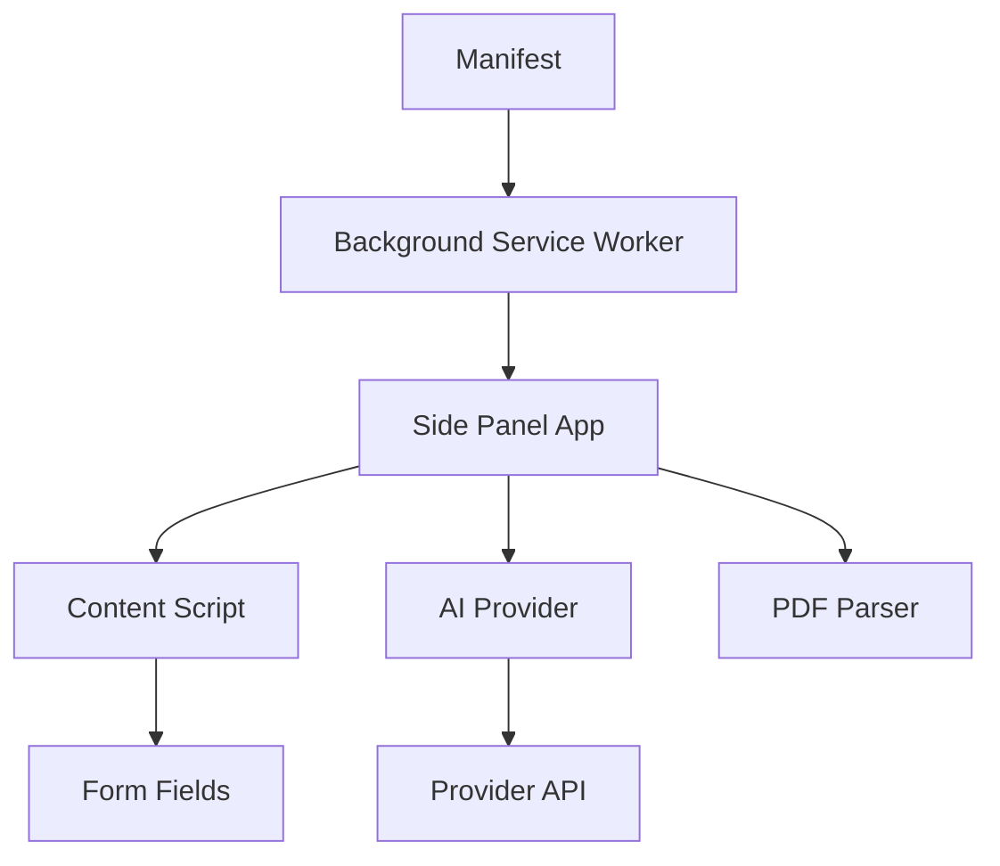
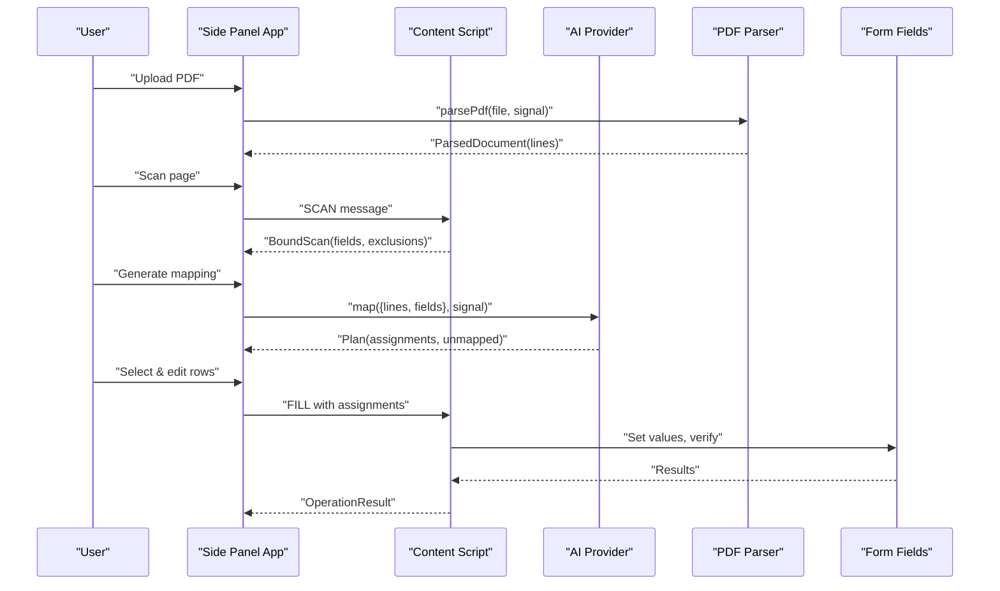
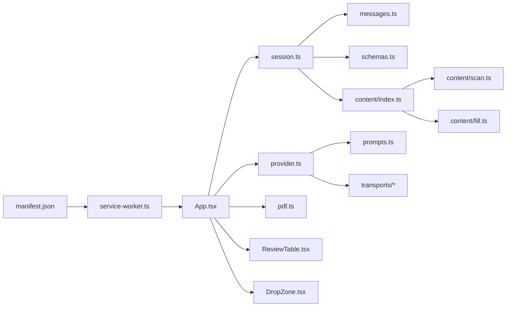

# Core Features

<cite>
**Referenced Files in This Document**
- [manifest.json](file://src/manifest.json)
- [service-worker.ts](file://src/background/service-worker.ts)
- [index.ts](file://src/content/index.ts)
- [scan.ts](file://src/content/scan.ts)
- [fill.ts](file://src/content/fill.ts)
- [pdf.ts](file://src/parsers/pdf.ts)
- [provider.ts](file://src/ai/provider.ts)
- [prompts.ts](file://src/ai/prompts.ts)
- [App.tsx](file://src/sidepanel/App.tsx)
- [session.ts](file://src/sidepanel/session.ts)
- [ReviewTable.tsx](file://src/sidepanel/components/ReviewTable.tsx)
- [DropZone.tsx](file://src/sidepanel/components/DropZone.tsx)
- [schemas.ts](file://src/shared/schemas.ts)
- [messages.ts](file://src/shared/messages.ts)
</cite>

## Table of Contents
1. [Introduction](#introduction)
2. [Project Structure](#project-structure)
3. [Core Components](#core-components)
4. [Architecture Overview](#architecture-overview)
5. [Detailed Component Analysis](#detailed-component-analysis)
6. [Dependency Analysis](#dependency-analysis)
7. [Performance Considerations](#performance-considerations)
8. [Troubleshooting Guide](#troubleshooting-guide)
9. [Conclusion](#conclusion)

## Introduction
Help Me Fill is a browser extension that helps you review AI-generated suggestions from a PDF and safely fill supported web form fields. The workflow is designed to keep sensitive data local where possible, require explicit user consent for each step, and provide clear feedback and undo capabilities.

Key capabilities:
- Local PDF text extraction with strict size and page limits
- Safe scanning of top-frame text inputs on the active page
- AI-powered mapping of document evidence to form fields with human-in-the-loop review
- Controlled filling with validation, overwrite protection, and verification
- Undo support when changes are reversible

Privacy controls:
- No automatic panel opening; action requires user interaction
- Optional host permissions per provider origin
- Explicit permission checks before sending data to providers
- Sensitive field detection and exclusion during scanning
- Strict input validation and bounded response sizes

## Project Structure
The extension follows a layered architecture:
- Manifest defines permissions, background service worker, side panel, and optional host permissions
- Background service worker configures storage access levels and handles action clicks
- Content script runs on target pages to scan and fill forms safely
- Side panel UI orchestrates the end-to-end workflow (upload PDF, scan page, generate mapping, review, fill)
- Shared schemas and messages define contracts between components
- AI layer composes prompts and calls provider transports

**Diagram sources**
- [manifest.json:1-19](file://src/manifest.json#L1-L19)
- [service-worker.ts:1-29](file://src/background/service-worker.ts#L1-L29)
- [App.tsx:1-127](file://src/sidepanel/App.tsx#L1-L127)
- [index.ts:1-72](file://src/content/index.ts#L1-L72)
- [provider.ts:1-107](file://src/ai/provider.ts#L1-L107)
- [pdf.ts:1-87](file://src/parsers/pdf.ts#L1-L87)

**Section sources**
- [manifest.json:1-19](file://src/manifest.json#L1-L19)
- [service-worker.ts:1-29](file://src/background/service-worker.ts#L1-L29)

## Core Components
- PDF Parser: Validates and extracts text lines from PDFs locally with progress reporting and abort support
- Page Scanner: Identifies eligible text inputs, builds metadata, and excludes sensitive or unsupported controls
- AI Mapping: Builds payloads, calls providers, validates responses, and returns a plan with evidence citations
- Review Interface: Displays assignments, evidence, unmapped fields, and allows manual overrides and selective filling
- Safe Filler: Preflights writes, applies values via native setters, verifies persistence, and supports undo
- Session Manager: Coordinates phases, messaging, and error handling across side panel and content script

**Section sources**
- [pdf.ts:1-87](file://src/parsers/pdf.ts#L1-L87)
- [scan.ts:1-88](file://src/content/scan.ts#L1-L88)
- [provider.ts:1-107](file://src/ai/provider.ts#L1-L107)
- [ReviewTable.tsx:1-30](file://src/sidepanel/components/ReviewTable.tsx#L1-L30)
- [fill.ts:1-82](file://src/content/fill.ts#L1-L82)
- [session.ts:1-86](file://src/sidepanel/session.ts#L1-L86)

## Architecture Overview
End-to-end flow from upload to fill:

**Diagram sources**
- [App.tsx:64-95](file://src/sidepanel/App.tsx#L64-L95)
- [session.ts:55-85](file://src/sidepanel/session.ts#L55-L85)
- [index.ts:22-53](file://src/content/index.ts#L22-L53)
- [provider.ts:52-105](file://src/ai/provider.ts#L52-L105)
- [pdf.ts:40-86](file://src/parsers/pdf.ts#L40-L86)

## Detailed Component Analysis

### PDF Document Processing
- Validates file type, size, and header
- Configures PDF worker resources from extension URLs
- Extracts text line-by-line, preserving spacing and line breaks
- Enforces limits on pages and total characters
- Supports cancellation and cleanup

User workflow:
- Drop or choose a PDF in the side panel
- See progress while reading pages
- Proceed to scan the form page after parsing completes

Configuration options:
- Limits enforced by shared schema constants
- Abort signals propagate to cancel parsing early

Integration points:
- Called from side panel App during upload
- Returns structured lines used by AI mapping

Error handling:
- Clear errors for invalid files, password-protected PDFs, empty documents, and unreadable formats
- Graceful cleanup even if parsing is aborted

Performance considerations:
- Pages are processed sequentially and cleaned up immediately
- Progress updates inform users without blocking

Limitations:
- Text-only PDFs; scanned/image-only PDFs require OCR which is not included
- Hard limits on size, pages, and extracted character count

**Section sources**
- [pdf.ts:7-13](file://src/parsers/pdf.ts#L7-L13)
- [pdf.ts:15-38](file://src/parsers/pdf.ts#L15-L38)
- [pdf.ts:40-86](file://src/parsers/pdf.ts#L40-L86)
- [schemas.ts:1-3](file://src/shared/schemas.ts#L1-L3)

### Form Field Analysis
- Scans top-frame input and textarea elements
- Builds rich metadata including labels, placeholders, context, constraints, and current values
- Excludes disabled, hidden, authentication/payment-related, and potentially sensitive controls
- Tracks exclusions counts for transparency
- Fingerprinting detects DOM changes to prevent unsafe fills

User workflow:
- Click “Scan page” on the intended form tab
- View list of supported fields and reasons for exclusions
- Rescan if the page changes

Configuration options:
- Safety limits on value lengths and pattern sizes
- Maximum number of supported fields per page

Integration points:
- Executed via content script injection from side panel session
- Results validated against shared schemas

Error handling:
- Errors for too many controls, unsupported types, or changed pages
- Registry assertions guard against stale scans

Performance considerations:
- Traverses only top-frame controls
- Bounds on node count and metadata size

Limitations:
- Does not handle selects, rich text editors, or iframe containers
- Best-effort filtering for authentication/payment fields

**Section sources**
- [scan.ts:10-18](file://src/content/scan.ts#L10-L18)
- [scan.ts:20-46](file://src/content/scan.ts#L20-L46)
- [scan.ts:47-76](file://src/content/scan.ts#L47-L76)
- [scan.ts:77-87](file://src/content/scan.ts#L77-L87)
- [schemas.ts:1-14](file://src/shared/schemas.ts#L1-L14)

### AI-Powered Mapping Generation
- Compacts field descriptors to exclude sensitive current values and URLs
- Builds a payload with document lines and field metadata
- Calls provider transport based on selected settings
- Reads bounded responses and parses JSON
- Validates mapping structure and cites exact quotes with line IDs
- Retries once with diagnostic repair prompt on validation failure

User workflow:
- Configure provider settings and model
- Generate mapping after scanning and parsing
- Review metrics and usage summary

Configuration options:
- Provider selection, model ID, and API key
- Origin-based optional host permissions enforced at runtime

Integration points:
- Uses shared prompts and transports
- Returns a plan consumed by the review interface

Error handling:
- Distinct messages for auth failures, rate limits, invalid models, timeouts, and network issues
- Validation errors include diagnostics to guide retries

Performance considerations:
- 60-second timeout per request
- Response body bounded to prevent memory pressure

Limitations:
- Requires valid provider credentials and network access
- Only text models supported in this prototype

**Section sources**
- [prompts.ts:4-25](file://src/ai/prompts.ts#L4-L25)
- [provider.ts:15-26](file://src/ai/provider.ts#L15-L26)
- [provider.ts:34-51](file://src/ai/provider.ts#L34-L51)
- [provider.ts:52-105](file://src/ai/provider.ts#L52-L105)
- [App.tsx:73-82](file://src/sidepanel/App.tsx#L73-L82)

### Review Interface
- Presents AI suggestions with source evidence and reasons
- Allows manual editing and marks manual overrides
- Protects overwriting existing values unless explicitly allowed
- Shows unmapped fields with explanations
- Provides select-all/clear and fill actions

User workflow:
- Inspect each suggestion and its evidence
- Edit values if needed and toggle overwrite permission
- Select desired fields and click “Fill selected”

Integration points:
- Consumes mapping plan and bound scan
- Emits row changes and selection state to session reducer

Error handling:
- Disables actions during busy phases
- Warns about potential side effects like autosave or network requests

Performance considerations:
- Lightweight UI rendering with bounded input lengths

Limitations:
- Cannot guarantee server-side effects are reversed by undo

**Section sources**
- [ReviewTable.tsx:1-30](file://src/sidepanel/components/ReviewTable.tsx#L1-L30)
- [session.ts:26-42](file://src/sidepanel/session.ts#L26-L42)
- [App.tsx:84-95](file://src/sidepanel/App.tsx#L84-L95)

### Safe Form Filling
- Preflights all writes to validate targets and constraints
- Verifies expected values have not changed since review
- Applies values using native setters and dispatches events
- Verifies persistence through multiple frames and validity checks
- Records undo entries and supports restoration

User workflow:
- Confirm selections and any overwrite permissions
- Execute fill and inspect results
- Use undo if available

Integration points:
- Executes via content script with registry assertions
- Reports per-field status and overall canUndo flag

Error handling:
- Stops on first failure and marks remaining fields skipped
- Guards against canceled operations and tab changes

Performance considerations:
- Short delays to allow reactive UIs to settle
- Focus management avoids scrolling

Limitations:
- Cannot reverse server-side changes triggered by input events
- Some sites may normalize or reject values

**Section sources**
- [fill.ts:8-26](file://src/content/fill.ts#L8-L26)
- [fill.ts:27-41](file://src/content/fill.ts#L27-L41)
- [fill.ts:42-82](file://src/content/fill.ts#L42-L82)
- [index.ts:42-53](file://src/content/index.ts#L42-L53)

### Privacy Controls and Security
- Action-triggered panel opening prevents accidental access
- Optional host permissions required for each provider origin
- Runtime checks ensure permissions exist before calling providers
- Sensitive control detection and exclusion during scanning
- Payloads exclude current values and page URLs from provider requests
- Bounded responses and timeouts protect against abuse

**Section sources**
- [manifest.json:6-12](file://src/manifest.json#L6-L12)
- [service-worker.ts:1-15](file://src/background/service-worker.ts#L1-L15)
- [App.tsx:73-82](file://src/sidepanel/App.tsx#L73-L82)
- [prompts.ts:18-22](file://src/ai/prompts.ts#L18-L22)
- [scan.ts:47-56](file://src/content/scan.ts#L47-L56)

### Error Handling and User Feedback
- Centralized error formatting for consistent messages
- Phase-aware error handling in side panel to reset states appropriately
- Progress indicators and cancel buttons during long-running tasks
- Clear guidance to rescan when pages change

**Section sources**
- [App.tsx:50-63](file://src/sidepanel/App.tsx#L50-L63)
- [index.ts:22-31](file://src/content/index.ts#L22-L31)
- [session.ts:44-53](file://src/sidepanel/session.ts#L44-L53)

## Dependency Analysis
High-level dependencies among core modules:

**Diagram sources**
- [manifest.json:1-19](file://src/manifest.json#L1-L19)
- [service-worker.ts:1-29](file://src/background/service-worker.ts#L1-L29)
- [App.tsx:1-127](file://src/sidepanel/App.tsx#L1-L127)
- [session.ts:1-86](file://src/sidepanel/session.ts#L1-L86)
- [provider.ts:1-107](file://src/ai/provider.ts#L1-L107)
- [pdf.ts:1-87](file://src/parsers/pdf.ts#L1-L87)
- [ReviewTable.tsx:1-30](file://src/sidepanel/components/ReviewTable.tsx#L1-L30)
- [DropZone.tsx:1-21](file://src/sidepanel/components/DropZone.tsx#L1-L21)
- [messages.ts:1-20](file://src/shared/messages.ts#L1-L20)
- [schemas.ts:1-39](file://src/shared/schemas.ts#L1-L39)
- [prompts.ts:1-26](file://src/ai/prompts.ts#L1-L26)
- [index.ts:1-72](file://src/content/index.ts#L1-L72)
- [scan.ts:1-88](file://src/content/scan.ts#L1-L88)
- [fill.ts:1-82](file://src/content/fill.ts#L1-L82)

**Section sources**
- [manifest.json:1-19](file://src/manifest.json#L1-L19)
- [App.tsx:1-127](file://src/sidepanel/App.tsx#L1-L127)
- [session.ts:1-86](file://src/sidepanel/session.ts#L1-L86)
- [provider.ts:1-107](file://src/ai/provider.ts#L1-L107)
- [pdf.ts:1-87](file://src/parsers/pdf.ts#L1-L87)
- [index.ts:1-72](file://src/content/index.ts#L1-L72)
- [scan.ts:1-88](file://src/content/scan.ts#L1-L88)
- [fill.ts:1-82](file://src/content/fill.ts#L1-L82)

## Performance Considerations
- PDF parsing processes pages sequentially and cleans up resources promptly
- Character and page limits prevent excessive memory use
- AI requests bounded to 256 KiB with 60-second timeouts
- Review table enforces input length limits to avoid heavy re-renders
- Filling uses short waits to accommodate reactive UIs without stalling

[No sources needed since this section provides general guidance]

## Troubleshooting Guide
Common issues and resolutions:
- “Choose a PDF file” or “This file is empty”: Ensure a non-empty, text-based PDF under size limit
- “Password-protected PDFs are not supported”: Use an unprotected document
- “No extractable text was found”: Image-only or scanned PDFs require OCR, not included yet
- “Page changed while scanning”: Re-scan after navigating or refreshing
- “Too many controls” or “More than 60 supported fields”: Simplify the form or focus on a subset
- “API host permission is missing”: Enable the provider origin permission in extension settings
- “Provider request failed”: Check API key, account access, rate limits, or model support
- “Target tab changed”: Return to the original tab and rescan
- “Field changed since review”: Rescan to refresh the registry
- “Value exceeds field length” or “Does not satisfy constraint”: Adjust the proposed value

Operational tips:
- Use Cancel to stop long-running tasks; already filled fields may remain
- After errors, inspect the page for partial changes before rescanning
- If session keys cannot be cleared, use Reset session

**Section sources**
- [pdf.ts:7-13](file://src/parsers/pdf.ts#L7-L13)
- [pdf.ts:40-86](file://src/parsers/pdf.ts#L40-L86)
- [scan.ts:62-76](file://src/content/scan.ts#L62-L76)
- [provider.ts:71-105](file://src/ai/provider.ts#L71-L105)
- [fill.ts:42-82](file://src/content/fill.ts#L42-L82)
- [App.tsx:50-63](file://src/sidepanel/App.tsx#L50-L63)
- [session.ts:44-85](file://src/sidepanel/session.ts#L44-L85)

## Conclusion
Help Me Fill combines local PDF processing, safe form scanning, and AI-assisted mapping into a user-controlled workflow. It emphasizes privacy, safety, and transparency through explicit permissions, sensitive data exclusion, evidence-backed suggestions, and robust error handling. While limited to text PDFs and top-frame inputs, it provides a strong foundation for responsible automation of form filling with clear user oversight and undo capability.

[No sources needed since this section summarizes without analyzing specific files]