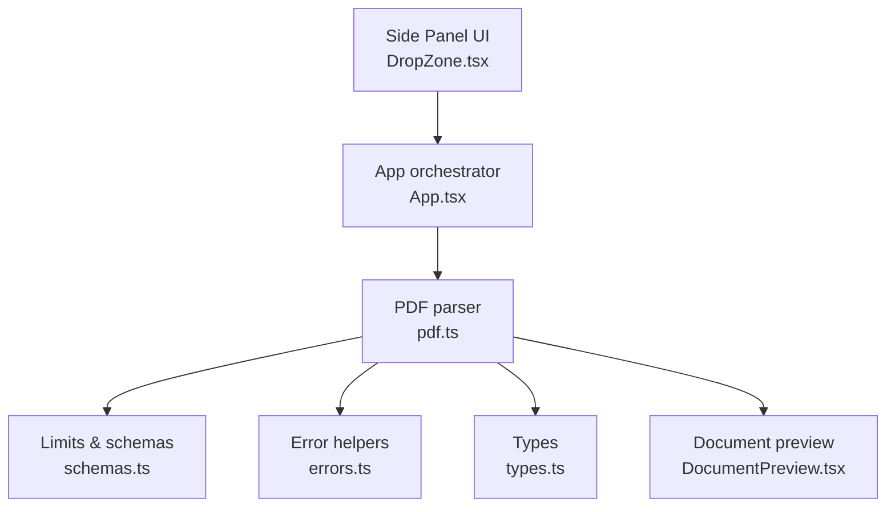
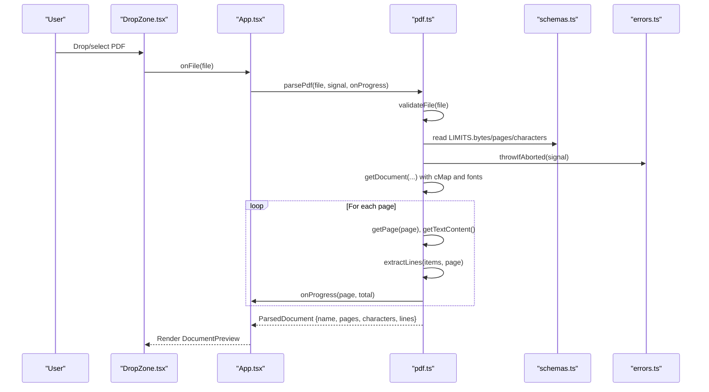
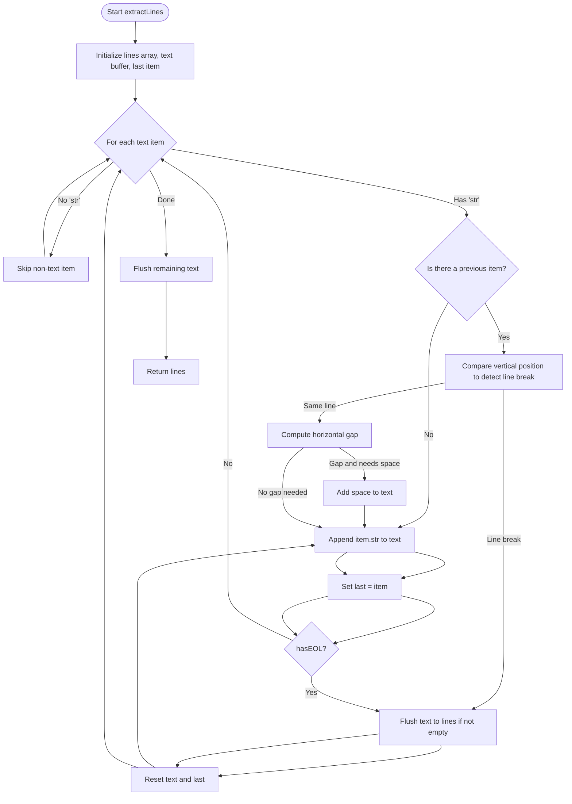
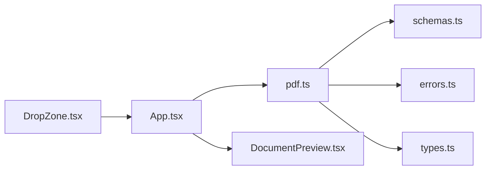

# Document Processing

<cite>
**Referenced Files in This Document**
- [pdf.ts](file://src/parsers/pdf.ts)
- [types.ts](file://src/parsers/types.ts)
- [schemas.ts](file://src/shared/schemas.ts)
- [errors.ts](file://src/shared/errors.ts)
- [DropZone.tsx](file://src/sidepanel/components/DropZone.tsx)
- [DocumentPreview.tsx](file://src/sidepanel/components/DocumentPreview.tsx)
- [App.tsx](file://src/sidepanel/App.tsx)
- [pdf.test.ts](file://tests/unit/pdf.test.ts)
</cite>

## Table of Contents
1. [Introduction](#introduction)
2. [Project Structure](#project-structure)
3. [Core Components](#core-components)
4. [Architecture Overview](#architecture-overview)
5. [Detailed Component Analysis](#detailed-component-analysis)
6. [Dependency Analysis](#dependency-analysis)
7. [Performance Considerations](#performance-considerations)
8. [Troubleshooting Guide](#troubleshooting-guide)
9. [Conclusion](#conclusion)

## Introduction
This document explains the Help Me Fill document processing feature for PDFs. It covers how files are validated, how text is extracted client-side using pdfjs-dist, how progress is tracked for large documents, and how errors are handled. It also documents supported formats, size/page/character limits, the line extraction algorithm that preserves structure, encoding handling, and security measures such as password protection detection. Practical examples and troubleshooting guidance are included to help you handle common scenarios and optimize performance for large documents.

## Project Structure
The document processing pipeline spans a small set of focused modules:
- File upload UI and validation at the side panel level
- PDF parsing and text extraction in the parsers module
- Shared limits and error utilities
- Side panel components for preview and progress

**Diagram sources**
- [DropZone.tsx:1-21](file://src/sidepanel/components/DropZone.tsx#L1-L21)
- [App.tsx:64-68](file://src/sidepanel/App.tsx#L64-L68)
- [pdf.ts:1-87](file://src/parsers/pdf.ts#L1-L87)
- [schemas.ts:1-39](file://src/shared/schemas.ts#L1-L39)
- [errors.ts:1-10](file://src/shared/errors.ts#L1-L10)
- [types.ts:1-3](file://src/parsers/types.ts#L1-L3)
- [DocumentPreview.tsx:1-9](file://src/sidepanel/components/DocumentPreview.tsx#L1-L9)

**Section sources**
- [DropZone.tsx:1-21](file://src/sidepanel/components/DropZone.tsx#L1-L21)
- [App.tsx:64-68](file://src/sidepanel/App.tsx#L64-L68)
- [pdf.ts:1-87](file://src/parsers/pdf.ts#L1-L87)
- [schemas.ts:1-39](file://src/shared/schemas.ts#L1-L39)
- [errors.ts:1-10](file://src/shared/errors.ts#L1-L10)
- [types.ts:1-3](file://src/parsers/types.ts#L1-L3)
- [DocumentPreview.tsx:1-9](file://src/sidepanel/components/DocumentPreview.tsx#L1-L9)

## Core Components
- File validation and limits enforcement
- Client-side PDF text extraction with pdfjs-dist
- Line reconstruction algorithm preserving layout
- Progress tracking per page
- Error handling and cancellation support

Key responsibilities:
- Validate file type, emptiness, and size before parsing
- Enforce page and character limits during parsing
- Extract lines while preserving document structure (line breaks and spacing)
- Provide per-page progress updates to the UI
- Handle errors including unsupported formats, corruption, and password protection

**Section sources**
- [pdf.ts:7-13](file://src/parsers/pdf.ts#L7-L13)
- [pdf.ts:15-38](file://src/parsers/pdf.ts#L15-L38)
- [pdf.ts:40-86](file://src/parsers/pdf.ts#L40-L86)
- [schemas.ts:3](file://src/shared/schemas.ts#L3)
- [errors.ts:1-10](file://src/shared/errors.ts#L1-L10)

## Architecture Overview
The end-to-end flow starts from the user dropping or selecting a PDF in the side panel. The app validates and parses the file locally, tracks progress, and renders a preview of the extracted content.

**Diagram sources**
- [DropZone.tsx:4-8](file://src/sidepanel/components/DropZone.tsx#L4-L8)
- [App.tsx:64-68](file://src/sidepanel/App.tsx#L64-L68)
- [pdf.ts:7-13](file://src/parsers/pdf.ts#L7-L13)
- [pdf.ts:40-86](file://src/parsers/pdf.ts#L40-L86)
- [schemas.ts:3](file://src/shared/schemas.ts#L3)
- [errors.ts:7-9](file://src/shared/errors.ts#L7-L9)

## Detailed Component Analysis

### File Upload Workflow and Supported Formats
- The DropZone component accepts exactly one file and restricts input to PDFs via accept attributes and UI hints.
- On drop or selection, it invokes the app’s upload handler which resets state and begins parsing.
- The UI displays a hint indicating “Text PDFs only · 10 MiB · 20 pages”.

Practical notes:
- Only PDF files are accepted; other formats are rejected early by validation.
- The UI enforces single-file uploads per session.

**Section sources**
- [DropZone.tsx:4-18](file://src/sidepanel/components/DropZone.tsx#L4-L18)
- [App.tsx:64-68](file://src/sidepanel/App.tsx#L64-L68)

### PDF Validation and Limits
Validation ensures:
- File name ends with .pdf and MIME type is application/pdf or application/octet-stream
- File is not empty
- File size does not exceed 10 MiB (LIMITS.bytes)

Parsing enforces:
- Page limit: maximum 20 pages (LIMITS.pages)
- Character limit: extracted text must not exceed 24,000 characters (LIMITS.characters)

These limits are enforced before and during parsing to avoid processing oversized or overly large documents.

**Section sources**
- [pdf.ts:7-13](file://src/parsers/pdf.ts#L7-L13)
- [pdf.ts:40-86](file://src/parsers/pdf.ts#L40-L86)
- [schemas.ts:3](file://src/shared/schemas.ts#L3)

### Client-Side Text Extraction with pdfjs-dist
- Uses pdfjs-dist to load the document with worker, CMaps, and standard fonts configured via runtime URLs.
- Reads the first bytes to verify a valid PDF header.
- Iterates through pages, retrieves text content, extracts lines, and accumulates character counts.
- Cleans up page resources after each page to manage memory.

Security and robustness:
- Detects password-protected PDFs and rejects them immediately rather than waiting indefinitely.
- Destroys the PDF task on abort or completion to prevent leaks.

**Section sources**
- [pdf.ts:40-86](file://src/parsers/pdf.ts#L40-L86)

### Line Extraction Algorithm That Preserves Structure
The extractor reconstructs logical lines from raw text items:
- Tracks the last item and compares vertical positions to detect line breaks based on transform coordinates and font height.
- Adds spaces between adjacent words when there is a horizontal gap but no line break.
- Honors explicit end-of-line markers from the PDF stream.
- Produces stable line IDs including page and sequence numbers.

Complexity:
- Time complexity is O(n) over the number of text items per page.
- Space complexity is proportional to the number of reconstructed lines.

**Diagram sources**
- [pdf.ts:15-38](file://src/parsers/pdf.ts#L15-L38)

**Section sources**
- [pdf.ts:15-38](file://src/parsers/pdf.ts#L15-L38)

### Handling Different PDF Encodings
- Configures CMaps and standard fonts via runtime URLs so that pdfjs-dist can decode various encodings used in PDFs.
- This enables correct extraction of Unicode text across different language scripts and legacy encodings.

**Section sources**
- [pdf.ts:46-52](file://src/parsers/pdf.ts#L46-L52)

### Security Measures: Password Protection Detection
- If the PDF requires a password, the parser triggers an immediate rejection with a clear message.
- The promise is explicitly rejected to avoid hanging on password prompts.
- The PDF task is destroyed to release resources.

**Section sources**
- [pdf.ts:55-59](file://src/parsers/pdf.ts#L55-L59)
- [pdf.ts:78-85](file://src/parsers/pdf.ts#L78-L85)

### Progress Tracking for Large Documents
- The parser calls a progress callback with current page and total pages after processing each page.
- The app translates this into user-facing status messages and supports cancellation mid-operation.

**Section sources**
- [pdf.ts:64-73](file://src/parsers/pdf.ts#L64-L73)
- [App.tsx:64-68](file://src/sidepanel/App.tsx#L64-L68)

### Data Models
- DocumentLine includes id, page, and text.
- ParsedDocument includes name, pages, characters, and lines.

These types ensure consistent data flow from parsing to UI rendering.

**Section sources**
- [types.ts:1-3](file://src/parsers/types.ts#L1-L3)

## Dependency Analysis
The following diagram shows key dependencies among modules involved in document processing:

**Diagram sources**
- [DropZone.tsx:1-21](file://src/sidepanel/components/DropZone.tsx#L1-L21)
- [App.tsx:1-127](file://src/sidepanel/App.tsx#L1-L127)
- [pdf.ts:1-87](file://src/parsers/pdf.ts#L1-L87)
- [schemas.ts:1-39](file://src/shared/schemas.ts#L1-L39)
- [errors.ts:1-10](file://src/shared/errors.ts#L1-L10)
- [types.ts:1-3](file://src/parsers/types.ts#L1-L3)
- [DocumentPreview.tsx:1-9](file://src/sidepanel/components/DocumentPreview.tsx#L1-L9)

**Section sources**
- [App.tsx:1-127](file://src/sidepanel/App.tsx#L1-L127)
- [pdf.ts:1-87](file://src/parsers/pdf.ts#L1-L87)

## Performance Considerations
- Memory management: Each page is cleaned up after extraction to free resources.
- Early exits: Abort signals cancel work promptly without starting unnecessary tasks.
- Limit enforcement: Page and character limits prevent excessive processing.
- Encoding setup: Using CMaps and standard fonts avoids fallback decoding overhead and improves accuracy.
- Single-pass extraction: The line algorithm processes items once, minimizing overhead.

Recommendations:
- Prefer text-based PDFs; scanned images require OCR which is not included.
- Keep documents under the stated limits to ensure responsive parsing.
- Avoid concurrent operations; the app cancels prior work when resetting or switching contexts.

[No sources needed since this section provides general guidance]

## Troubleshooting Guide
Common issues and resolutions:
- Unsupported format: Ensure the file is a PDF. Word, Excel, Markdown, and OCR-only PDFs are not supported.
- Empty file: Re-upload a non-empty PDF.
- Oversized file: Reduce file size to 10 MiB or less.
- Too many pages: Use a shorter document (max 20 pages).
- Too much text: Use a shorter document (max 24,000 characters).
- No extractable text: The PDF may be image-only or scanned; OCR is not included.
- Password-protected PDF: Use an unprotected document.
- Corrupt or unreadable PDF: Try re-saving or exporting the PDF.

Cancellation behavior:
- If the operation is canceled, a specific message indicates no new request was started.
- Partial changes may remain on the page; inspect results before retrying.

**Section sources**
- [pdf.ts:7-13](file://src/parsers/pdf.ts#L7-L13)
- [pdf.ts:40-86](file://src/parsers/pdf.ts#L40-L86)
- [errors.ts:1-10](file://src/shared/errors.ts#L1-L10)
- [pdf.test.ts:9-44](file://tests/unit/pdf.test.ts#L9-L44)

## Conclusion
Help Me Fill’s document processing pipeline validates inputs, extracts text client-side, preserves document structure, and enforces strict limits for safety and performance. It handles encoding via CMaps, detects password protection, and provides clear error messages and progress feedback. By adhering to the supported formats and limits, users can reliably process PDFs locally and proceed to review and fill workflows.

[No sources needed since this section summarizes without analyzing specific files]