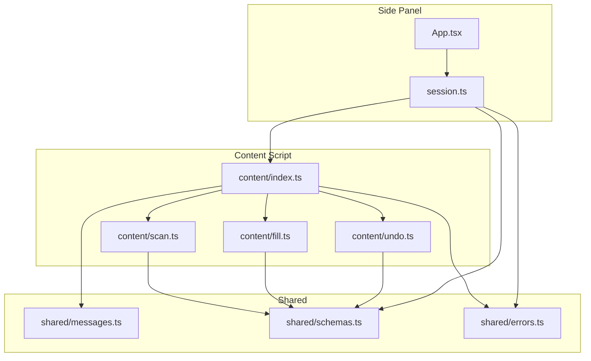
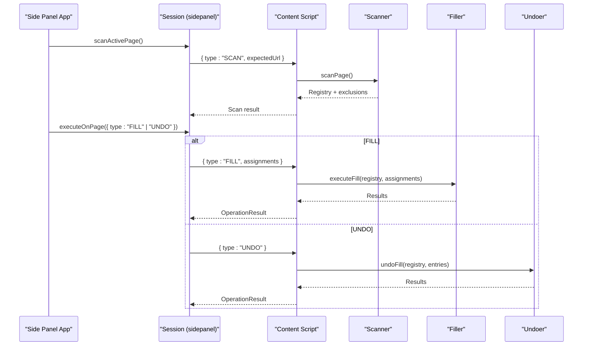
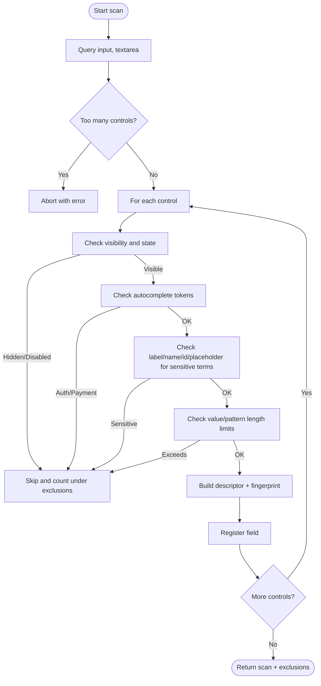
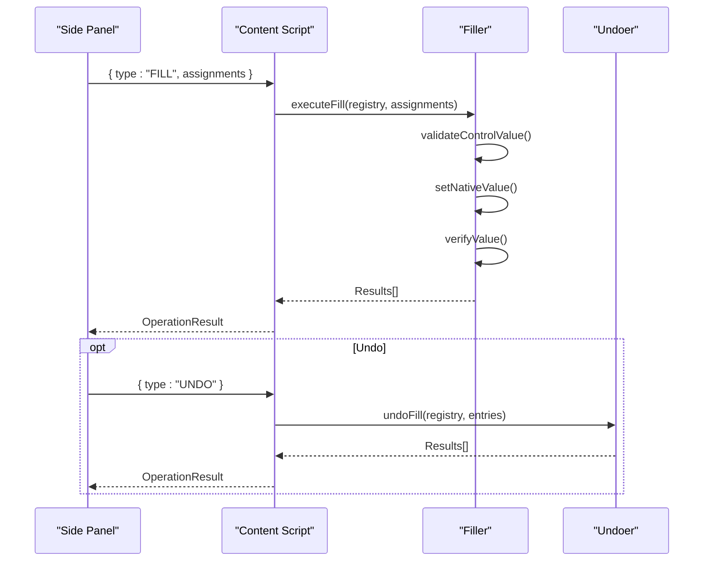
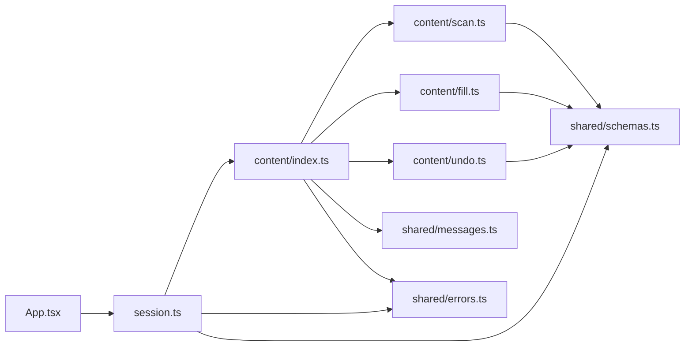

# Form Analysis

<cite>
**Referenced Files in This Document**
- [scan.ts](file://src/content/scan.ts)
- [index.ts](file://src/content/index.ts)
- [fill.ts](file://src/content/fill.ts)
- [undo.ts](file://src/content/undo.ts)
- [messages.ts](file://src/shared/messages.ts)
- [schemas.ts](file://src/shared/schemas.ts)
- [errors.ts](file://src/shared/errors.ts)
- [session.ts](file://src/sidepanel/session.ts)
- [App.tsx](file://src/sidepanel/App.tsx)
- [forms.tsx](file://tests/fixtures/forms.tsx)
</cite>

## Table of Contents
1. [Introduction](#introduction)
2. [Project Structure](#project-structure)
3. [Core Components](#core-components)
4. [Architecture Overview](#architecture-overview)
5. [Detailed Component Analysis](#detailed-component-analysis)
6. [Dependency Analysis](#dependency-analysis)
7. [Performance Considerations](#performance-considerations)
8. [Troubleshooting Guide](#troubleshooting-guide)
9. [Conclusion](#conclusion)

## Introduction
This document explains the form analysis feature that automatically detects and analyzes web form fields, extracts metadata, applies security filters, and integrates with a side panel for review and filling. It covers the scanning algorithm, supported input types, exclusion rules, metadata extraction, message passing between content scripts and the side panel, real-time validation, and handling of dynamic forms.

## Project Structure
The form analysis spans three main areas:
- Content script: scans the page, validates inputs, and executes fills/undos safely.
- Shared schemas and messages: define contracts for scanning, assignments, and results.
- Side panel: orchestrates scanning, AI mapping, review, and execution on the target page.

**Diagram sources**
- [App.tsx:15-127](file://src/sidepanel/App.tsx#L15-L127)
- [session.ts:44-85](file://src/sidepanel/session.ts#L44-L85)
- [index.ts:1-72](file://src/content/index.ts#L1-L72)
- [scan.ts:1-88](file://src/content/scan.ts#L1-L88)
- [fill.ts:1-82](file://src/content/fill.ts#L1-L82)
- [undo.ts:1-29](file://src/content/undo.ts#L1-L29)
- [messages.ts:1-20](file://src/shared/messages.ts#L1-L20)
- [schemas.ts:1-39](file://src/shared/schemas.ts#L1-L39)
- [errors.ts:1-10](file://src/shared/errors.ts#L1-L10)

**Section sources**
- [App.tsx:15-127](file://src/sidepanel/App.tsx#L15-L127)
- [session.ts:44-85](file://src/sidepanel/session.ts#L44-L85)
- [index.ts:1-72](file://src/content/index.ts#L1-L72)
- [scan.ts:1-88](file://src/content/scan.ts#L1-L88)
- [fill.ts:1-82](file://src/content/fill.ts#L1-L82)
- [undo.ts:1-29](file://src/content/undo.ts#L1-L29)
- [messages.ts:1-20](file://src/shared/messages.ts#L1-L20)
- [schemas.ts:1-39](file://src/shared/schemas.ts#L1-L39)
- [errors.ts:1-10](file://src/shared/errors.ts#L1-L10)

## Core Components
- Field scanner: discovers visible text-like controls, builds descriptors, and enforces safety limits.
- Security filter: excludes sensitive or unsupported controls to protect privacy and stability.
- Metadata extractor: captures labels, placeholders, constraints, and accessibility attributes.
- Message bus: typed messages between side panel and content script for scanning, filling, undoing, canceling, and clearing.
- Execution guard: ensures operations run only when the correct tab is active and not canceled.
- Undo system: records previous values and restores them safely.

Key responsibilities are implemented in:
- Scanning and filtering: [scan.ts](file://src/content/scan.ts)
- Message handling and lifecycle: [index.ts](file://src/content/index.ts)
- Filling and verification: [fill.ts](file://src/content/fill.ts)
- Undo logic: [undo.ts](file://src/content/undo.ts)
- Contracts and limits: [messages.ts](file://src/shared/messages.ts), [schemas.ts](file://src/shared/schemas.ts)
- Side panel orchestration: [session.ts](file://src/sidepanel/session.ts), [App.tsx](file://src/sidepanel/App.tsx)

**Section sources**
- [scan.ts:1-88](file://src/content/scan.ts#L1-L88)
- [index.ts:1-72](file://src/content/index.ts#L1-L72)
- [fill.ts:1-82](file://src/content/fill.ts#L1-L82)
- [undo.ts:1-29](file://src/content/undo.ts#L1-L29)
- [messages.ts:1-20](file://src/shared/messages.ts#L1-L20)
- [schemas.ts:1-39](file://src/shared/schemas.ts#L1-L39)
- [session.ts:44-85](file://src/sidepanel/session.ts#L44-L85)
- [App.tsx:15-127](file://src/sidepanel/App.tsx#L15-L127)

## Architecture Overview
The flow begins in the side panel, which injects a content script into the target page and sends a SCAN message. The content script scans the DOM, returns field metadata and exclusions, and stores a registry. When the user reviews and confirms assignments, the side panel sends FILL or UNDO messages. The content script validates, writes values using native setters, verifies persistence, and reports results. Throughout, guards ensure the correct tab remains active and operations can be canceled.

**Diagram sources**
- [session.ts:55-85](file://src/sidepanel/session.ts#L55-L85)
- [index.ts:22-69](file://src/content/index.ts#L22-L69)
- [scan.ts:62-76](file://src/content/scan.ts#L62-L76)
- [fill.ts:42-81](file://src/content/fill.ts#L42-L81)
- [undo.ts:6-28](file://src/content/undo.ts#L6-L28)

## Detailed Component Analysis

### Field Scanning Algorithm
- Discovery: queries all input and textarea elements in the document.
- Visibility checks: skips hidden, inert, disabled, read-only, or zero-size controls.
- Safety limits: aborts if too many controls exist or if any value/pattern exceeds configured limits.
- Exclusions: counts unsupported elements like selects, rich text editors, and iframe containers.
- Fingerprinting: creates a stable signature per field based on descriptor plus DOM identity and autocomplete context to detect later changes.

Supported input types:
- text, email, tel, url, textarea

Exclusion reasons include:
- Unsupported input type
- Disabled or read-only
- Hidden controls
- Authentication or payment controls (based on autocomplete tokens)
- Potentially sensitive controls (labels, names, IDs, placeholders matching sensitive patterns)
- Control exceeds safety limits

**Diagram sources**
- [scan.ts:10-57](file://src/content/scan.ts#L10-L57)
- [scan.ts:62-76](file://src/content/scan.ts#L62-L76)

**Section sources**
- [scan.ts:10-57](file://src/content/scan.ts#L10-L57)
- [scan.ts:62-76](file://src/content/scan.ts#L62-L76)

### Supported Input Types and Exclusion Rules
- Supported types: text, email, tel, url, textarea.
- Unsupported types are excluded early to avoid unexpected behavior.
- Disabled, read-only, or visually hidden controls are skipped.
- Autocomplete tokens indicating authentication or payment flows are excluded.
- Sensitive keywords in labels, aria-labels, placeholders, names, or IDs trigger exclusion.
- Values or patterns exceeding configured limits are rejected.

Examples of excluded scenarios:
- Password fields, OTP, PIN, CVV/CVC, credit card numbers, bank account details, IBAN, SSN, CAPTCHA.
- Selects, rich text editors, and iframe containers are reported as unsupported.

**Section sources**
- [scan.ts:8-57](file://src/content/scan.ts#L8-L57)
- [scan.ts:73-75](file://src/content/scan.ts#L73-L75)

### Metadata Extraction
For each eligible control, the scanner extracts:
- id: internal unique identifier for the field within the scan session.
- type: normalized control type.
- label: aggregated text from associated labels.
- ariaLabel: resolved via aria-labelledby or aria-label.
- placeholder: trimmed placeholder text.
- name: control name.
- context: nearest legend or heading context for grouping.
- required: boolean flag.
- maxLength: numeric limit.
- pattern: regex pattern string (for inputs).
- currentValue: current value at scan time.

Accessibility and labeling:
- Uses labels and aria-labelledby to build human-readable labels.
- Respects group legends and section headings to provide contextual grouping.

**Section sources**
- [scan.ts:20-46](file://src/content/scan.ts#L20-L46)
- [schemas.ts:4-14](file://src/shared/schemas.ts#L4-L14)

### Security Filtering Mechanisms
Security is enforced by:
- Autocomplete token checks to block authentication and payment flows.
- Keyword-based detection of sensitive terms across label, aria-label, placeholder, name, and id.
- Value and pattern length limits to prevent oversized payloads.
- Strict support for safe input types only.

These mechanisms reduce risk of leaking secrets or interfering with secure flows.

**Section sources**
- [scan.ts:8-57](file://src/content/scan.ts#L8-L57)

### Integration with Content Scripts and Side Panel
- Injection: the side panel injects the content script into the top frame of the target tab.
- Connection: a named port is established; the content script acknowledges readiness.
- Messages:
  - SCAN: triggers scanning and returns field metadata and exclusions.
  - FILL: performs validated writes and returns per-field results.
  - UNDO: restores previous values and returns results.
  - CLEAR/CANCEL: resets state and cancels ongoing work.
- Validation: messages are parsed against strict schemas before processing.

Real-time updates:
- Before each write, the content script re-validates the registry and control state.
- If the page changes or the tab becomes inactive, operations stop and report errors.

**Section sources**
- [session.ts:55-85](file://src/sidepanel/session.ts#L55-L85)
- [index.ts:1-72](file://src/content/index.ts#L1-L72)
- [messages.ts:1-20](file://src/shared/messages.ts#L1-L20)

### Filling and Verification Flow
Preflight:
- Validates assignments against registry and limits.
- Ensures no overwriting without explicit approval.
- Checks value constraints (length, pattern, validity).

Execution:
- Focuses the control, sets value via native setter, and dispatches input/change events.
- Verifies persistence through multiple frames and timeouts.
- Records undo entries to restore previous values.

Results:
- Reports filled, skipped, changed/reverted, failed, or restored statuses with details.

**Diagram sources**
- [fill.ts:8-81](file://src/content/fill.ts#L8-L81)
- [undo.ts:6-28](file://src/content/undo.ts#L6-L28)
- [index.ts:22-69](file://src/content/index.ts#L22-L69)

**Section sources**
- [fill.ts:8-81](file://src/content/fill.ts#L8-L81)
- [undo.ts:6-28](file://src/content/undo.ts#L6-L28)
- [index.ts:22-69](file://src/content/index.ts#L22-L69)

### Handling Complex Forms and Dynamic Content
- Complex structures: supports nested labels, fieldsets with legends, and headings for context.
- Dynamic content: fingerprints capture control identity and context; assertions detect DOM changes, added/removed fields, or replaced nodes.
- React/Vue fixtures demonstrate controlled components and rerenders; the scanner avoids framework internals and focuses on native controls.

When dynamic changes occur:
- During fill, focus handlers or reactive updates may replace or alter controls; the filler reasserts registry integrity and stops if inconsistent.
- After scanning, if the page navigates or tabs change, the side panel invalidates the session and requires a new scan.

**Section sources**
- [scan.ts:58-87](file://src/content/scan.ts#L58-L87)
- [fill.ts:42-81](file://src/content/fill.ts#L42-L81)
- [App.tsx:34-48](file://src/sidepanel/App.tsx#L34-L48)
- [forms.tsx:11-19](file://tests/fixtures/forms.tsx#L11-L19)

## Dependency Analysis
- Content script depends on shared schemas and errors for validation and messaging.
- Scanner depends on schema-defined limits and field shapes.
- Filler and undo depend on scanner’s registry and assertion utilities.
- Side panel depends on session helpers to send messages and assert tab activity.

**Diagram sources**
- [App.tsx:15-127](file://src/sidepanel/App.tsx#L15-L127)
- [session.ts:1-86](file://src/sidepanel/session.ts#L1-L86)
- [index.ts:1-72](file://src/content/index.ts#L1-L72)
- [scan.ts:1-88](file://src/content/scan.ts#L1-L88)
- [fill.ts:1-82](file://src/content/fill.ts#L1-L82)
- [undo.ts:1-29](file://src/content/undo.ts#L1-L29)
- [schemas.ts:1-39](file://src/shared/schemas.ts#L1-L39)
- [messages.ts:1-20](file://src/shared/messages.ts#L1-L20)
- [errors.ts:1-10](file://src/shared/errors.ts#L1-L10)

**Section sources**
- [App.tsx:15-127](file://src/sidepanel/App.tsx#L15-L127)
- [session.ts:1-86](file://src/sidepanel/session.ts#L1-L86)
- [index.ts:1-72](file://src/content/index.ts#L1-L72)
- [scan.ts:1-88](file://src/content/scan.ts#L1-L88)
- [fill.ts:1-82](file://src/content/fill.ts#L1-L82)
- [undo.ts:1-29](file://src/content/undo.ts#L1-L29)
- [schemas.ts:1-39](file://src/shared/schemas.ts#L1-L39)
- [messages.ts:1-20](file://src/shared/messages.ts#L1-L20)
- [errors.ts:1-10](file://src/shared/errors.ts#L1-L10)

## Performance Considerations
- Limiting scanned fields prevents heavy DOM traversal and memory usage.
- Visibility checks and early exits reduce unnecessary processing.
- Fingerprinting enables fast change detection without full re-scan.
- Preflight validation avoids partial writes and reduces retries.
- Verification uses short waits and requestAnimationFrame to minimize blocking while ensuring reliability.

[No sources needed since this section provides general guidance]

## Troubleshooting Guide
Common issues and resolutions:
- Page changed during operation:
  - Cause: navigation, tab switch, or DOM mutation.
  - Resolution: rescan the page and re-review assignments.
- Too many controls or unsupported elements:
  - Cause: complex pages with many inputs/selects/iframes.
  - Resolution: simplify the form or use a different approach; note that selects, rich text, and iframes are not supported.
- Sensitive fields excluded:
  - Cause: password, OTP, PIN, CVV, credit card, bank account, IBAN, SSN, CAPTCHA, or similar patterns detected.
  - Resolution: these are intentionally blocked for security; do not attempt to bypass.
- Overwrite protection:
  - Cause: existing values require explicit approval to overwrite.
  - Resolution: enable overwrite for specific fields during review.
- Browser restrictions:
  - Cause: extension store pages or restricted origins.
  - Resolution: open a normal HTTP(S) form page and grant access again.
- Connection lost:
  - Cause: side panel closed or content script disconnected.
  - Resolution: click the toolbar icon on the intended page and scan again.

Error messages are standardized and surfaced to the user via the side panel.

**Section sources**
- [scan.ts:62-87](file://src/content/scan.ts#L62-L87)
- [fill.ts:42-81](file://src/content/fill.ts#L42-L81)
- [session.ts:44-85](file://src/sidepanel/session.ts#L44-L85)
- [errors.ts:1-10](file://src/shared/errors.ts#L1-L10)

## Conclusion
The form analysis feature provides a robust, secure, and user-friendly pipeline to detect, analyze, and fill web forms. It emphasizes safety by excluding sensitive and unsupported controls, extracting meaningful metadata, and validating every step. Integration with the side panel ensures a clear review workflow and reliable execution with undo support. For complex or dynamic forms, the system continuously asserts consistency and guides users to rescan when necessary.